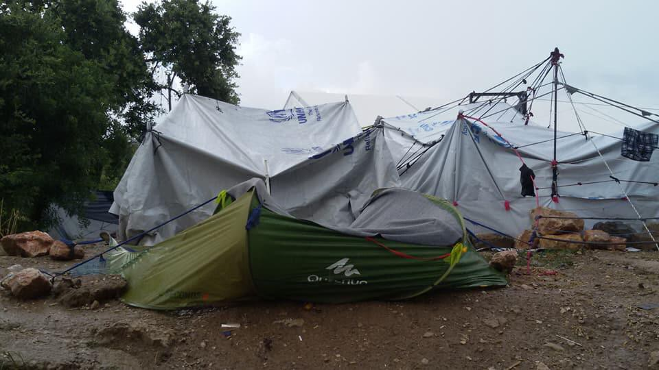
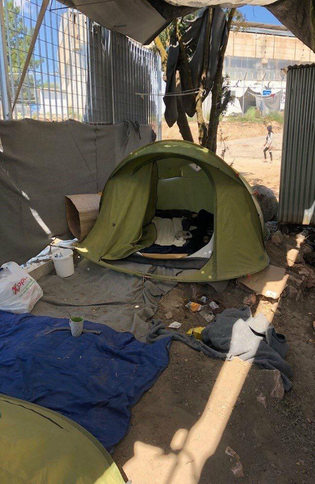
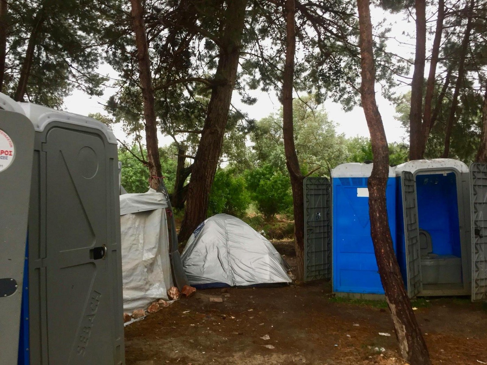
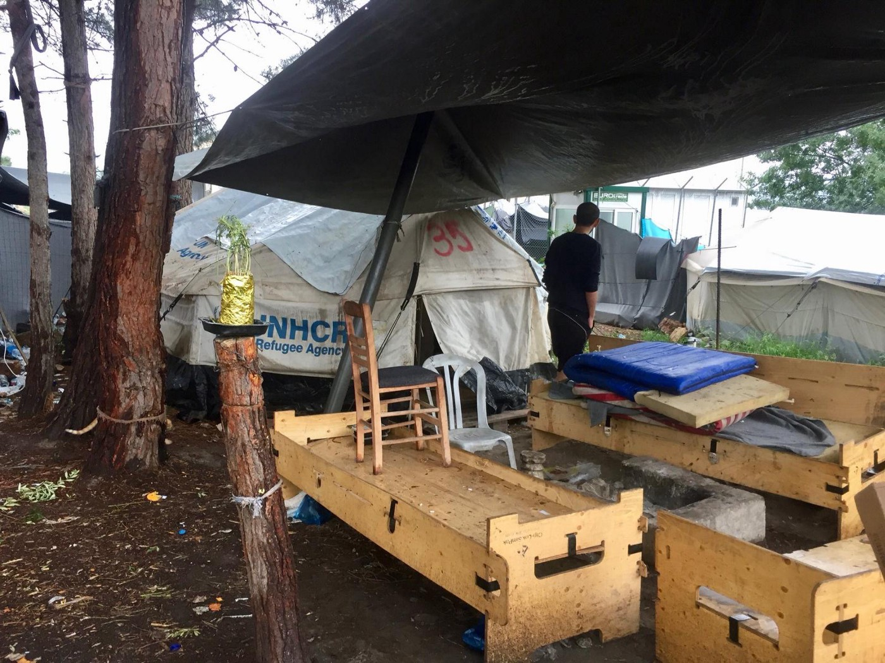

### AYS SPECIAL FROM CHIOS: A story from one of the forgotten islands

_I have returned to Chios after two years, and I want to share with you how shocked I am at the situation here\. Europe seems to have forgotten the Greek Islands; the media is silent and the boats are still coming\._

As the plane touched down last week, I glanced out of the window astounded, yet again, at how easy it is for me to arrive and leave Chios island, Greece\. Passport in hand, I stepped onto the tiny runway, smelling the sea\. Not so simple for the refugees trapped here\.

On Samos, over 5000 refugees live in squalid conditions\. Here in Chios, refugees have more support from volunteers, but life on the small island is far from comfortable, as new problems of stagnation arise\.

Over 1100 people now live in Vial Camp, far more than its capacity allows\. Resources are stretched and there are not enough containers and tents for new arrivals\.

In October there were only 53 working toilets with no separate toilets available for women\. There were 36 functional showers with no facilities for those with physical disabilities and no hot running water\.

Imagine trying to raise a new\-born baby here\!

‘Souda Camp’ has been closed down since I was last here in 2016; it was not sustainable to have hundreds of refugees sleeping in makeshift shelters in the middle of Chios town\. I remember drinking tea with Syrian families trying to learn the beautiful sounds of Arabic, tasting fresh fish cooked on the fire with the African community, putting up tents in gale force winds trying to help Afghan families with tiny babies to get some shelter from the bitter Greek winter\.

I remember the far right fascist attack, and watching the camp burn while the Greek fire brigade ignored our emergency phone calls\. ‘Souda Camp’ is gone but the memories live on\. There was much beauty, as well as horror, within that space; this shall not be forgotten\.

When Souda closed all the residents were transferred to Vial Camp, a ‘hotspot’ run by the Army and the Greek government\. It is a 30\-minute drive from the city surrounded by views of mountains and barbed wire fences\. Now out of sight, out of mind\.

There is limited transport, so most people cannot leave and don’t feel welcome in the town anyway\.

The camp is understaffed, meaning clothes and NFI distributions are minimal and there is limited staff presence at night\. A lawless shanty town lights up the mountain\.

No camp doctor is working to identify vulnerable families that need to be transferred to apartments in the city\. All medical care at night is undertaken by SMH volunteer medics from the Basque Country who have been on Chios, literally saving lives, since 2015\.

It is not so much those on the inside that are prevented from leaving, rather outside eyes from seeing in\.

It is true not so many boats arrive now\. In the winter of 2015 when I first arrived here, up to 1000 people were landing in Chios every day, and moving freely to northern Europe after a few days rest on the island\. Now it’s usually less than 100 a week\. Back then, people were full of anticipation for their new lives in a safe haven in Germany, France, Austria… Now when refugees ask how long they will stay, how can we answer truthfully without shattering dreams?

Some will not get their first asylum interview until 2020, forcing them to stay living in inadequate conditions in an overrun, dirty, crowded and stagnant camp\. People face the constant risk of deportation back to Turkey or their unsafe home countries\. Stagnation creates an increase in mental health issues and unaddressed medical problems\.

Babies grow up in noisy, overcrowded containers unconsciously learning what trauma and fear is\. Teenagers miss out on vital development to find their place in the world and learn the difference between right and wrong\. Fun, play, and normal child development is overshadowed by the fence of the camp\. Children pick up sticks and metal bars to mirror the violence they witnessed back home and now in the camp\.

I am told four boats landed last week, a total of 68 people fleeing wars, persecution and extreme poverty\. On board the flimsy dinghies a 16\-year\-old boy had come alone all the way from Somalia; a Ugandan woman who is eight months pregnant; a man with one leg and trauma from seeing his brother killed by a bomb; a father with two children under the age of four running from the war that only months ago killed his young wife before his family’s eyes\. These people are running from unimaginable horrors that will not be solved by simply closing the borders and patrolling and policing the waters more\.

Vulnerable families sit alone in sparsely furnished apartment blocks waiting, caught in limbo\.

I met one woman, the same age as me, recovering from the traumatic birth of her two\-week\-old son\. She had no partner, no support\. Her older disabled three\-year\-old child lay lifeless on the bed, unable to sit up or talk\. “Please”, she said, “I need help so I can leave the house, I cannot do this alone\.“

Without a wheelchair or double buggy, she had no choice but to remain inside\. She is trapped\. Trapped in her apartment, in Chios, in the failing asylum system that has bottlenecked so many refugees on Greek islands unable to move forwards or back\.

Like many ‘hotspots’ across Europe, volunteers and members of the public are not allowed into the camp\. There is no internal monitoring of conditions, simply stories heard\.

We cannot blame Chios, or Greece… the rest of Europe has turned its back on the situation\. Greece should not be left to pick up the pieces, we should unite in solidarity, human to human\!

> \(Organisations such as Action for Education, Chios Eastern Shore Response Team \(boat landings\), SMH \(medical team\), Imagine Centre \(youth centre, education\), Medicine Sans Frontiers, FEOX \(distribution\), Peoples Warehouse \(distribution\), Kostas Kitchen, IRIS \(distribution\) and the Athena Woman’s Centre are currently providing support to refugees trapped on Chios\. If you have read this article and want to get involved, send a message directly to one of these groups\. \) 

**_\(The author is an independent volunteer in Chios\. Photos taken by the residents of Vial camp\)_**

**We strive to echo correct news from the ground through collaboration and fairness\.**

**Every effort has been made to credit organizations and individuals with regard to the supply of information, video, and photo material \(in cases where the source wanted to be accredited\) \. Please notify us regarding corrections\.**

**If there’s anything you want to share or comment, contact us through Facebook or write to: areyousyrious@gmail\.com**

_Converted [Medium Post](https://medium.com/are-you-syrious/ays-special-from-chios-a-story-from-one-of-the-forgotten-islands-9e7885b49702) by [ZMediumToMarkdown](https://github.com/ZhgChgLi/ZMediumToMarkdown)._
