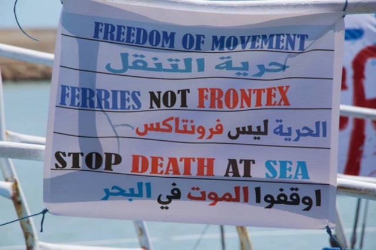
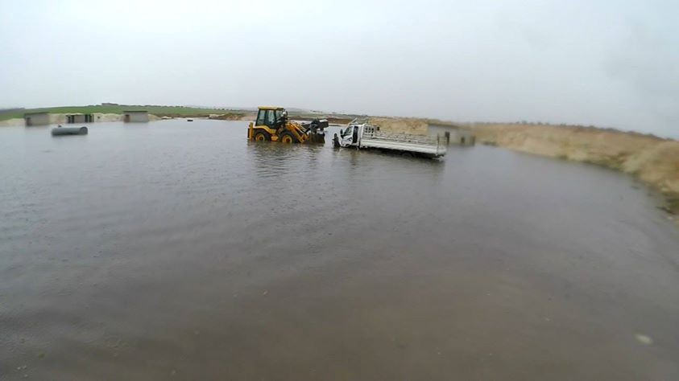
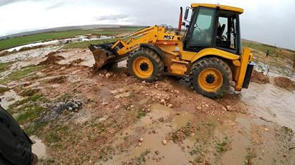
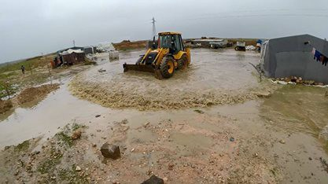
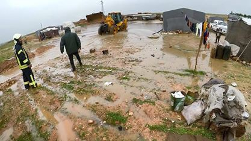
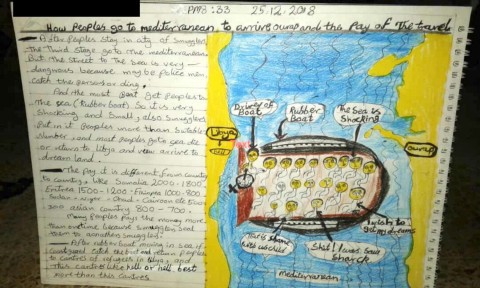
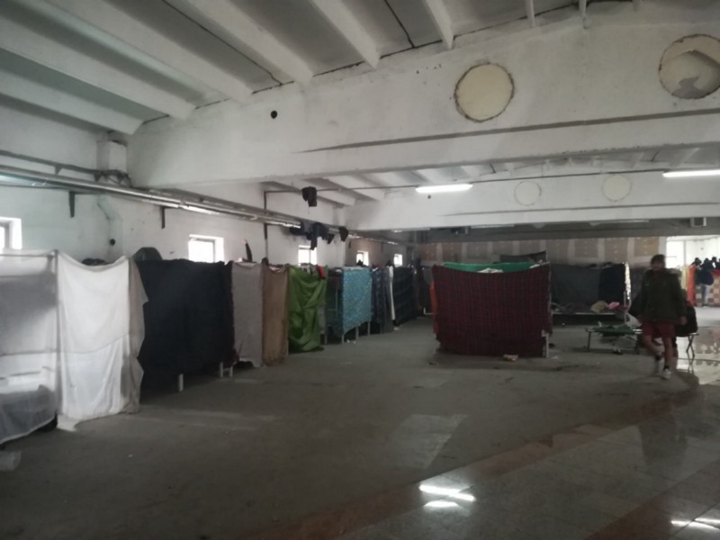

### یک سال مرگبار دیگر برای پناهندگان و مهاجرانی که می خواهند به اروپا برسند

30–24 AYS Weekly News Summary in Persian, December

### خاص
### از روز شنبه، گروه سی\.واچ در دریا مستقر شده است

**در دریا بدون هیچ وسایل امنی ، سی و دو نفر، از جمله چهار زن، چهار نفر زیر سن و سه فرزند بوده اند\. شرایط در دریا رو به سخت تر شدن است و مردم محروم از این هفته به دلیل شرایط جوی دریا رنج می برند\.**

**پنج کشور: ایتالیا، مالتا، اسپانیا، آلمان و هلند از اجازه دادن ورود این کشتی در سرزمین های خود منع کردند، و فیلیپه هان، رئیس این مأموریت، به آلمان و اروپا به دلیل مسئولیت های خود و نشان دادن این وضعیت به عنوان یک مثال خوب گزارش داد\. مخصوصا، سازمان یک غیر دولتی ، وزیر کشور را تحت فشار قرار داد که، هورست سیهوفر، با استفاده از بخش بیست وسه قانون مجوز اقامت برای ارائه به همه کسانی که از لیبی فرار و از اجازه زندگیه امن برای اقامت محروم شده اند، مطابق با رفتار کاملا انسانی و به طورکامل تحت مقررات اروپایی پذیرفته شوند**
### سوریه

**شرایط آب و هوایی بد و باران های سنگین چادر هایی را که در حال حاضر در داخل اردوگاه ها در حومه ادلب زندگی می کنند را از بین برده است**

### لیبی

**افرادی که در حال حرکت به اروپا هستند، سفرهای خود را به اروپا نقاشی میکنند تا آنها را به روشنی توصیف کنند**

**منبع اصلی**

[**https://twitter\.com/sallyhayd/status/1078013428265115649?s=19&fbclid=IwAR3d\- \_F8qr73SsOpeo\_criTouk6hrzN2FClen61\_A2QK6JekLuZVT8dJz\-I**](https://twitter.com/sallyhayd/status/1078013428265115649?s=19&fbclid=IwAR3d-_F8qr73SsOpeo_criTouk6hrzN2FClen61_A2QK6JekLuZVT8dJz-I)
### دریا

**به گفته سازمان آی\.ا\.ام، در حالی که تلاش برای عبور از مدیترانه در سال دوهزاروهجده، عمدتا از منطقه لیبی و منطقه آفریقای شمالی عبور کرده اند، دوهزاروچهارصد وچهل ودو نفر کشته شده اند\. بیش از هفتصد نفر از آنها برای رسیدن به اسپانیا زندگی خود را از دست دادند ، فقط پانزده نفر از آنها در همین هفته گذشته، از جمله دو فرزند جان خود را از دست دادند\. طبق گفته و\.د\.م آلارم فن ، هنوز 12 نفر از آنها پیدا نشده اند**

[**https://missingmigrants\.iom\.int/region/mediterranean**](https://missingmigrants.iom.int/region/mediterranean)

**سی\.آی و سی\.واچ در دریای مدیترانه فعالیت می کنند تا هفتاد و دو تن از افراد پریشان حال را در دریا نجات دهند\. امروز صبح، مرکز م\.ر\.سی\.سی که مرکز هماهنگی نجات دریایی است در رم کمک به گارد ساحلی لیبی کرد که نیازمند به کمک بود و از آن زمان تاکنون اطلاعاتی درباره نحوه انجام عملیات نجات به دست نرسیده است**
### بوسنی و هرزگوین
### پلیس در حال جا به جایی مردم از کانتون بیهاچ است

**صلیب سرخ کلوس گزارش می دهد که پلیس بوسنی همچنان مردم را از مسیر سارایوو به بیهاچ متوقف می کند\. گاهی اوقات افراد به مدت بیست و چهار ساعت در جاده ها باقی می مانند وساکنین محلی و صلیب سرخ محلی به آنها کمک می کنند\. در روز یکشنبه، نه نفر در ولچوو پیدا شدند که در آنجا پلیس آنها را رها کرده بود\. در گروه دو فرد سالخورده وجود داشت و تعدادی از آنها زخمی شده بودند\. بعد از ظهر، بعد از اینکه مقامات بین المللی آی\.ا\.ام و مقامات بوسنی به توافق رسیدند، کل گروه به بیهاچ به مرکز تازه تاسیس شده بیرا منتقل شدند**

**کمبود شدید دستگاه گرمایشی در اردوگاه اوسیواک**

**در آخر هفته، سازمان اید\.بریگاد لباسهای زمستانی را در اردوگاه اوسیواک در نزدیکی سارایوو بین مردم پخش کرد**

### کرواسی

**در ساعت شش و پانزده دقیقه صبح در صبح کریسمس، در یک مسیر کوهستان باریک در منطقه ورگراتس، پلیس یک ون پر از مهاجران را متوقف کرد\. راننده بیست و شش ساله است که در اصالتا اهل بوسنی است، اما دارای تابعیت اسلووانی است\.**

**هنگامی که راننده در دید مأموران پلیس قرار گرفت، بدون توقف سرعت را کم کرد و از ون به بیرون پرید\. او شروع به فرار کرد و با توجه به اطلاعات غیر رسمی، ون به ماشین پلیس برخورد کرد**

**در داخل خودرو سی و نه نفر ازعراق و ایران از جمله چند زن، برخی از آنها باردار و کودکان بودند\. خوشبختانه، همه جان سالم هستند، اما هر دو وسیله نقلیه آسیب دیده بودند و راننده دستگیر شد**

**بعضی از مهاجران در بخش اورژانس در ورگوراتس منتقل شدند و بعدا یک زن در هفته چهاردهم بارداری به اولین کمک رسانی داده شدند و یک کودک هشت ساله مبتلا به پنومونی توسط آمبولانس به بیمارستان اسپلیت منتقل شد**

**راننده هنگام فرار و پرش روی زمین های سنگی مجروح شد\. او همچنین در بخش اورژانس با خراش پاها و یک بازو شکسته به بیمارستان منتقل شد**
### ایتالیا

**یک مرد جوان افغان روز گذشته در آنکونا جان خود را از دست داد\. او توسط کامیونی برای تلاش خروج از بندر به آن آویزان شده بود، جان خود را از دست داد \.**

**هنوز تحقیقات در حال پیگیری است**

[**https://www\.corriereadriatico\.it/ancona/ancona\_si\_aggrappa\_a\_un\_tir\_per\_sbarcare\_giovane\_afgano\_resta\_schiacciato\_e\_muore\-4193274\.html?fbclid=IwAR3bz7K،4Q23TpUBdwpaHHefVv57ZhCNMoN1RzmTNRaDGXE8aX\-xqbyUHx18**](https://www.corriereadriatico.it/ancona/ancona_si_aggrappa_a_un_tir_per_sbarcare_giovane_afgano_resta_schiacciato_e_muore-4193274.html?fbclid=IwAR3bz7K4Q23TpUBdwpaHHefVv57ZhCNMoN1RzmTNRaDGXE8aX-xqbyUHx18)

**امروز صبح، مجمع سودانی ها در رم، خیابان های زیر سفارت سودان را بستند، برای نشان دادن همبستگی خود با مردم اعتراض آمیز در کشور خود، علیه سرکوب خشونت آمیزمسلحانه علیه تظاهرکنندگان و افزایش آگاهی در مورد وضعیت در سودان، جایی که در طول اعتراضات سی وپنج نفر ازجمله کودک پانزده ساله در طول هفته گذشته جان خود را از دست دادند**
### فرانسه

**فرصت های مالی برای پناهندگان یا گروه هایی برای پروژه های مرتبط با کارآفرینی را در اینجا میتوانید دنبال کنید**

[**https://www\.facebook\.com/groups/172900819749383**](https://www.facebook.com/groups/172900819749383/)
### انگلستان

**حدود بیست و سه نفر \(از جمله سه فرزند\) از ایران در روز سه شنبه پس از قایقرانی از شمال فرانسه در یک قایق ، در سه مکان مختلف در کنت، جنوب شرقی انگلستان، در حالی که یازده نفر ازسوی مقامات فرانسوی متوقف شدند، تلاش کردند تا از کانال نزدیک سنگتته عبور کنند**

**همه آنها به کمک های پزشکی دست یافتند، اما بلافاصله برای مصاحبه ها به مقامات مهاجرتی فرستاده شدند، در حالی که این سه کودک بعد از پروسه تحت مراقبت های اجتماعی قرار می گیرند**

_Converted [Medium Post](https://medium.com/are-you-syrious/%DB%8C%DA%A9-%D8%B3%D8%A7%D9%84-%D9%85%D8%B1%DA%AF%D8%A8%D8%A7%D8%B1-%D8%AF%DB%8C%DA%AF%D8%B1-%D8%A8%D8%B1%D8%A7%DB%8C-%D9%BE%D9%86%D8%A7%D9%87%D9%86%D8%AF%DA%AF%D8%A7%D9%86-%D9%88-%D9%85%D9%87%D8%A7%D8%AC%D8%B1%D8%A7%D9%86%DB%8C-%DA%A9%D9%87-%D9%85%DB%8C-%D8%AE%D9%88%D8%A7%D9%87%D9%86%D8%AF-%D8%A8%D9%87-%D8%A7%D8%B1%D9%88%D9%BE%D8%A7-%D8%A8%D8%B1%D8%B3%D9%86%D8%AF-debf05bcccb5) by [ZMediumToMarkdown](https://github.com/ZhgChgLi/ZMediumToMarkdown)._
