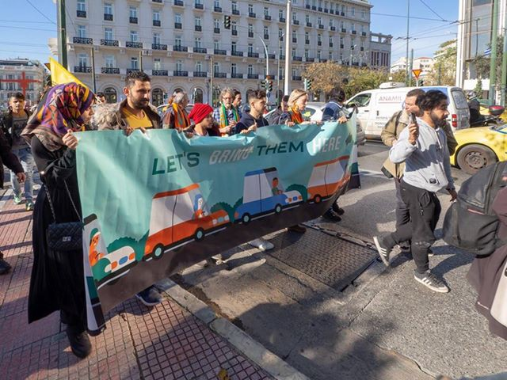
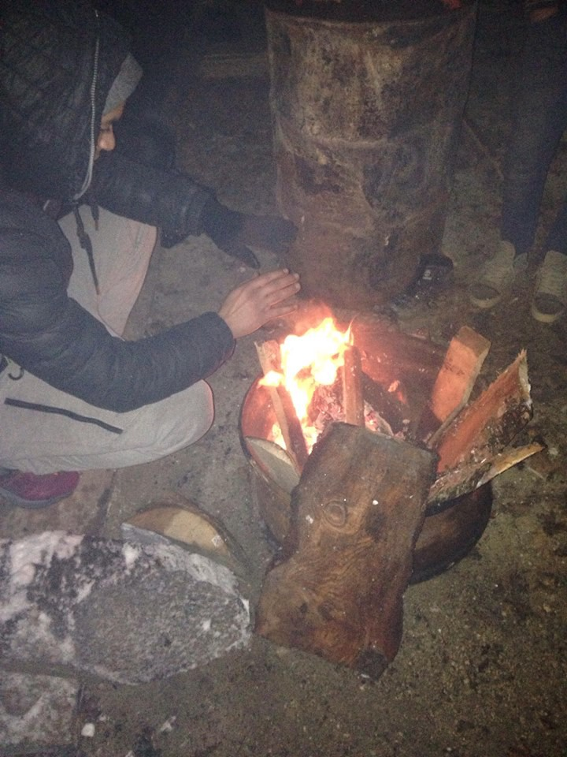

### AYS DAILY DIGEST 2/1/2019: Dangerous routes of Europe

_More people are crossing English channel putting their lives at risk // The same is happening in the Alps and on mountains in the Balkans // Deportations to Afghanistan from Denmark and Germany // Police continue disregarding the law in Bosnia // Calls for protests and solidarity all over Europe_

](assets/a3b8c545cf8c/1*PiZptJI9kSXaOgLRt0tieA.jpeg)

Moria, Lesvos, winter 2018\. Snow is expected these days in Greece, too\. By [Antonios Forlidas](https://www.facebook.com/antonios.forlidas?__tn__=%2Cd%2AF%2AF-R&eid=ARCEawgUqbTrWw8Eg717pn-jJsNytjmAqVH4EOpCYaquijXek8M-ZK3J8QvihUVvx6_hG2pUo1mCGPzB&tn-str=%2AF)
### Feature

In the first days of the New Year, snow blanketed most of Europe\. For people on the move—what with closed borders and restrictions on the freedom of movement—this weather makes everything much harder and more dangerous\.

A snow blizzard and temperatures of \-17C° have been forecast even for Greece, especially Thessaloniki, Athens, and the islands\.

Snow in the Balkans is making travel very difficult for everybody\. Over the last several weeks, mountain rescue teams in Bosnia have been very active, saving people who have been stuck in the snow while trying to reach European Union\. Those who managed to cross over to Croatia and Slovenia, in many cases will try to continue through Italy to France, and further on\. That route is very dangerous at this time of the year\.

On the first day of the new year, Red Cross workers found a 28\-year\-old man in the snow\. His pulse was weak and his breathing shallow — classic symptoms of hypothermia\. When rescue team found him, he was not even wearing a jacket or boots, but only a hoodie and sneakers\.

On the average, r [escue teams are finding 15 people](https://www.npr.org/2019/01/01/679840656/rejected-by-italy-thousands-of-migrants-from-africa-risk-the-alps-to-reach-franc?fbclid=IwAR1Gs0nfjiXVPWo0bGUYoMHaQlim1wAx1pIG7CLleNua-ADwZLKwWp_N-kk) in the mountains every night\.

A new and very dangerous route opened this winter with groups of people—mostly from Iran — crossing to the UK via the English Channel\. Almost daily reports are arriving of people who have been found after shipwrecks at sea\.

The [Refugee Rescue / ‘Mo Chara’](https://www.facebook.com/RefugeeRescueUK/?__tn__=kCH-R&eid=ARAP1ymEu1l5CcDb19N8Es8NFXHs67jO9FVYYEb4m_TBMEWySnYd8r9ezB5qoO4lV5BLuyLm7uLUuLXb&hc_ref=ARSOQn9IPHxR0jWesAZvofmEkYqgo5XkCKR0HokQkntZaLzLaOzM7Dj53GmDl4FPqLM&fref=nf&__xts__%5B0%5D=68.ARClwGh2bUCnO4EVG5oDg66vp0lYPkTKN8twt_Qzo0cDCO6v-vCG5yuWyPOBv5oOEpP-cruhVaUwzseM4xCBnqiIvL05PexcLDiyrR2WCeLSBMSCWZpQD8-ju6PKxcUygkvPhPHeKqKiBmvvrAnw7sxTjAMlXvt1N1Fwow4jpUFQnkvgDqPUXnW3imsSLG5T2iAZcleuvpZENN1SUt8QQXNZ6MQCYZbL3T0YTmqTpjddsEG_wdTuugqluOzcp91lLbLE2lhcDCuW4VQ3f6hPzFv4EYn105AbWOvakw1OgY7YxqegNUriCG0rGU8_dXHH0tbHrcX8qjwsexOU) team warns that “sailing the stretch of water between England and France, in a vessel not fit for purpose, poses an extreme risk to those attempting to do so”\.

_“As an experienced maritime search and rescue professional, this situation is terrifying\. The dangers involved in crossing the Channel in an open dinghy are immense; unforgiving seas, cold weather, unseaworthy boats and busy shipping lanes are just a few of the dangers these people will face\. Lives will be lost unless we act appropriately, and swiftly,”_ Richie Heard, Head of Operations \(Refugee Rescue\) said, asking for the government, especially in the UK, to ensure the safe passage of people\.

_“That people who have already fled their homes are being forced into fragile inflatable rubber dinghies, risking their lives in a bid to have their asylum claims heard, is a heavy indictment of our current approach to migration\. If we are to prevent lives being needlessly lost, it is of vital importance that we recognise fear\-mongering and party\-politics have no place here: this is a question of humanity,”_ added Hannah Wallace Bowman, Programme Director \(Refugee Rescue\)

[Where the eff is Alice?](https://www.facebook.com/wheretheeffisalice/?__tn__=%2CdkCH-R-R&eid=ARBqqoXGVTh5aOfH3D9pet-7UvwBNfcBroUpSMw2kASk6DXvbBaUgImqeOTVS5FgNIeEJfAyQcl-mWJ4&hc_ref=ARR25_wV5IURpUvlMlst_rj9EKlgJ-2B0jpSaB3dBSrmDxkeu7caXfjaLDHHRmpnlho&fref=nf) reminds of the causes for people to try to cross by boat to the UK\.

_“The UK is actively involved financially \(the great wall of Calais and the CRS\) in making France a hostile environment and has no motivation to address the real problems\. The associations working in Calais are a shit band aid on a bigger issue\. Each day at the moment is a struggle to get tents, bedding, shoes, warm and waterproof clothing, firewood and food to people in need\. The frequency of the state clearing living areas is increasing and with increasing reports of tents, belongings and fire wood being taken and/or destroyed\. Winter has barely started and it’s going to be long\.”_
### BALKAN WEATHER for 3 January
#### GREECE

Snow to hit Athens, Thessaloniki and islands in the next 24 hours\.
#### MONTENEGRO

Changeably cloudy with sunny intervals and cold at the centre and south and cloudy with occasional snow and very cold in the north\. Wind weak to moderate from the north and northeast\. Low temperatures from \-14 to 1C° and highs from \-11 to 5C°\.
#### SERBIA

Moderate to full cloud cover, cold and windy, locally with snow and an increase in snow cover\. The wind will be moderate and strong from the northwest\. Low temperatures from \-5 to 0 C° and highs from \-2 to 4C°\.
#### BiH

In Bosnia cloudy with snow\. No precipitation in the north during the morning but during the day precipitation is also expected here\. An increase in snow cover from 2 to 10 cm and up to 15 cm in the mountains\. In Herzegovina lightly to moderately overcast with sun, snow in the north\. The wind will be moderate, with strong gusts, from the northwest\. Low temperatures from \-9 to 2C° and highs from \-6 to 6C°\.
#### CROATIA

Moderately to predominantly overcast, windy and colder\. Inland, intermittent snow and incidental rain along the coast\. In the interior, moderate to stormy north and northwestern wind and along the coast north wind and bura often with stormy and hurricane\-like gusts\. Low temperatures from \-7 to 4C° and highs from 0 to 7C°\.
### Yemen

Another very dangerous route —as some call it “ [the most youthful](https://www.undispatch.com/yemen-received-more-migrants-in-2018-than-europe/?fbclid=IwAR21Ih9s_G-WYUfvgAkh4hzoyYNv6OKcZJdMDWUEqfH--eoSlsfGjO7y6eU) ” route — is through Yemen\. “The most youthful” refers to the fact that most of the people on this route are minors, very often traveling alone\.

According to the IOM, about 150,000 people arrived in Yemen in 2018, which is more than in Europe this year \(134,000\) \.

People are arriving in Yemen despite the ongoing war, a cholera outbreak, and near famine conditions in much of the country\. Yemen is the route taken by people from Ethiopia, via the Red Sea, to Saudi Arabia where they hope to find jobs\. A smaller number sails from the Somali coast\.
#### Morocco

On this first day of 2019, 111 people from Nador, among them women and minors, [left the country by boat](https://youtu.be/vLbUDiKMgc4) and all were recovered by the Spanish guardia civil\.

On the second day of 2019, 49 people were apprehended on the beach at Tazaghine \(60 kms west of Nador\) by the Moroccan authorities, and all were arrested\.

To learn more about living conditions in Morocco for people on the move, read our [special from Nador](ays-special-from-nador-we-know-that-what-we-do-here-is-dangerous-d16c0f587957) \.
### At Sea

For over two weeks now the German NGO, Sea\-Watch, has been waiting for a port to allow it to dock its ship Sea\-Watch 3, which is carrying 32 people rescued on 22 December off the coast of Libya\.

At the same time, another German NGO, Sea\-Eye, which rescued 17 people on 29 December, is also seeking a port of landing\.

[Seebrucke is calling everybody](https://www.facebook.com/SeebrueckeSchafftsichereHaefen/posts/768757696829749) to the demonstration in Berlin on 3 January, on the behalf of the 32 refugees who are still unable to dock in Europe\.

> We demand safe ports\! 

> Solidarity with the people aboard the ships\! 

> Support and decriminalisation of civilian rescue\! 

Due to their long stay on board of Sea Watch 3, under bad weather conditions, many people are suffering from severe seasickness\. For a malnourished, weakened person, the resulting dehydration may be life\-threatening\.

Worsening weather conditions and sea conditions have caused the ships to head north into Maltese waters\.

_“Maritime law clearly states that the time people must spend at sea, after having been rescued from a situation of distress, must be kept at a minimum,”_ said Jan Ribbeck, head of mission on the Sea\-Eye vessel\.

Watch a v [ideo appeal](https://www.facebook.com/seaeyeorg/videos/524867778018230/) from a Nigerian refugee aboard the NGO boat “Professor” that is not allowed to dock in Europe\.

To date, no member state has stepped up and assumed shared responsibility for refugees and migrants saved at sea\. **Sea\-Watch published a list of countries that have refused to offer the vessels a port: Malta, Italy, Spain, Germany, and the EU\.**

Nevertheless, on Wednesday, the Netherlands has indicated a readiness to possibly take in a proportional number of people who are on board, on the condition that other European countries do the same\.

Alarm Phone lists more than 2,260 lost lives in the Mediterranean Sea in 2018\.

_“Of course, these numbers are estimates, often there has been no confirmation\. Many will have lost their lives without ever being accounted for, and without featuring in official statistics for border deaths\. And even if we had the precise record of lives lost, it would not reflect the significance of all these individuals dying in great suffering, leaving behind families, friends, and partners\.”_

[Here is the list](https://alarmphone.org/en/2019/01/02/alarm-phone-list-of-distress-cases-with-disappearances-or-deaths/?post_type_release_type=post&fbclid=IwAR0Hman-AW6te3KXLUxmQh1tkuMQEzPniYLOGOijm2DiHbZhKYKrxBgOFcw) of Alarm Phone emergency cases that involved deaths or disappearances this past year
### Italy

This year, 23,371 people were registered to arrive in Italy, according to UNHCR\.

Some of people who arrived are trying to stay in Italy, while many are trying to continue toward other EU countries\. People from Turin, the Mosaico association, are offering the people transiting through the station assistance, information and basic goods to help them on their journey\. Part of the project is a clinic placed in the Ambulatorio Socio where professionals provide both legal consultancy and medical and psychological assistance in collaboration with local institutions\.
### Greece

Despite the bad weather, people have continued arriving in the Greek islands even in the new year\. A boat landed on Kos on Wednesday morning with 20 people, reports Aegean Boat \.

The living conditions on all of the islands, but also in mainlaind camps, are extreme\. To find out more, see our special reports from [Samos](ays-special-prison-island-surviving-another-winter-on-samos-72ead10d5096) , [Chios](ays-special-prison-island-surviving-another-winter-on-samos-72ead10d5096) and camp [Oinofyta near Athens](ays-special-the-case-of-oinofyta-from-one-hell-to-another-island-to-mainland-5e7fcf3d190e) \.

Over the last several weeks we reported about the “Lets Bring Them Here” civic initiative in Holland\. On the 2nd day of the New Year we received a report about their mission to Greece\.

_“We drove 3000 km and delivered a letter to the parliament in Athens\. We asked for relocation of 1000 refugees from the Greek islands to the NL and had room to take 150 people back with us\. We did not get an answer, we didn’t really expect one, but at least there was huge international press attention for the subject\. We met with NGOs and refugees and discussed several ways to proceed and get the situation changed\. People felt our presence as supporting and bringing a tiny ray of hope\. The 60 drivers are back in the NL now, determined to continue\._

_Oh, and here are the lyrics of the song we sang while demonstrating in front of the parliament\. The melody is “Alle Menschen werden Brüder” by Beethoven:_

_Come and stand up Europeans,_

_since our good old continent_

_sells away its fine tradition_

_of warm hearted tolerance_

_Desperate people, locked up by numbers_

_\(That’s not what Europe must intend\)_

_We demand DIRECT PROCEDURES_

_for the thousands in the camps_

_Come and stand up, Europeans,_

_for the sake of common sense\._

You can find more about free non\-formal educational programs in Athens [here](https://g2red.org/free-non-formal-educational-programs-in-athens/?fbclid=IwAR3eeHfnQril0_KthyyGIMGX6QoqIdVes5AyDCqmLAT4ba-F37wa-fgGveU) \.
### Bosnia

Police in Bosnia continue breaking the law and preventing people from moving around the country\. On 2 January, police stopped a bus on its way from Sarajevo to Bihac and took off three young men, leaving them on the side of the road\. Again, local people and volunteers of the local red Cross, were there to offer basic help\. It was \-6 C° in Velecevo\.

Velecevo, by Red Cros Kljuc

The situation at camps in Bosnia is not getting any better\. It is cold, there is no hot water for the showers, in some places there is no drinking water, security remains issue as well as health protection\. Many vulnerable people are left with minimal care or no care at all\. To take care of them should be the responsibility of the DRC and UNHCR, but in practice the system that has been established in Bosnia, ad hoc, does not work\.

Additionally, until today, IOM — which runs most of the camps including the Bira camp in Bihac — has not published the information of the death of 16\-year\-old boy or the causes of his death\.

Volunteers from all over Bosnia, most of them locals, are still there to help\.

This video is a crowdfunding campaign for SOS Team Kladusa\.

These funds will be used to support hundreds of migrants stuck at the border between Bosnia and Croatia, at the edge of Europe\.
[HERE’S THE LINK](https://bit.ly/2SctKd2) FOR DONATIONS\.

You can also help the [Dautch Lemon Foundation](https://www.facebook.com/lemonfoundation/) which is helping [Latan Restaurant](ays-special-locals-of-velika-kladuša-put-international-organisations-to-shame-5d4ba6b8eb2b) in Kladusa where about 500 people eat daily\.
### France

[Solidarité migrants Wilson](https://www.facebook.com/Solidarit%C3%A9-migrants-Wilson-598228360377940/?__tn__=%2CdkCH-R-R&eid=ARDLaVM_o74E_Hcm7jWPujFTbVKBGrEHlX7FXnzYNl4rjM-kx7zNVISNhn7bUNI5qDkUrDkFfoVwBPuZ&hc_ref=ARThT6q5Cspe0KorLCDvhwwaOmn5T8Y1tuWn8_t2zFCfnagtsJcBSStNBlRsziYJkwU) is calling for volunteers to join them in food distribution on Wilson Avenue in Saint\-Denis from 8:30 to 9:00 pm\.

“We’ll have tea and coffee, bread and jam, sugar… and if you want to offer something else, don’t hesitate\!”
### Denmark

According to [Afghanistan Migrants Advice & Support Org](https://www.facebook.com/AmasoAfg/?__tn__=kC-R&eid=ARBXNoviRRs9ABHVQE3IS0aA459Y-b7nxi3WeoJ8oP6ca20G0HIMmuAYEVHnb3q01y7tK7AL06G6O88Q&hc_ref=ARScoF92uURisORifyuo-bcfTl3ygO9XPYWKSbaAkE_nasmiPVZkmE2jLrqhJG9o52k&fref=nf&__xts__%5B0%5D=68.ARCxyWhRsP9gYyfoFOkdxxrhhRUBVUvNAc8VPTXfCKF7AwMPvVgepywjdY9IU_GIjsVlVsNgf60NFQE3DeqJDNdNDa9sk17nowhv_AZELQDQyYDAhwR-O47NZ1JqHfi8Jiu4zzA3kjdZVlN67gmQeL9zxtNkd8T_CNpYyW_OXsBuwCms0KxgkliimeIcvKe6pkkyjFdWw7Y6cjccDBvOeCb71_l5FXjVryto9TGlZhh93nEo81Ja3UL_5saITUDfP0aKQxLI9zNyqgQ2HABp0Oy9Mw67rOKRNgbmeuMK6wmk__jOhiUHKZYvdDvCxxdcSmBzq_i-Yaixic7ea-8_t0yHnS_IsgR-esaNFaK3DGQmsD4Vj5Hi0eFV) sources and activists in Denmark, dozens of Afghan asylum seekers are currently in detention centers and can be forcibly deported back to Afghanistan at any time\.

There is no exact date fixed for their return, but we will keep our followers updated when a time and date for their return is set\.
### Germany

There are various indications that the next deportation to Afghanistan from Germany will take place on Monday, 7 January\.

“As always, we recommend speaking with a lawyer who is specialised in Afghanistan if one is obliged to leave\. Currently three Afghans are already in detention in Bavaria\.”

Four people were injured after a 50\-year\-old man intentionally drove into a crowd of people in the city of Bottrop in what appeared to be a racist far\-right attack, police said\.

According to the police, the victims included a 46\-year\-old Syrian woman, who was seriously injured, her 48\-year\-old husband and their 16 and 17\-year\-old daughters; a 4\-year\-old boy and his 29\-year\-old mother from Afghanistan; a 10\-year\-old Syrian girl; and a 34\-year\-old German national of Turkish heritage\.

The driver made anti\-foreigner comments during his arrest, according to officials\.

“Investigators suspect it was a deliberate attack that may be linked to the xenophobic views of the driver,” the statement said\.

**We strive to echo correct news from the ground through collaboration and fairness\.**

**Every effort has been made to credit organizations and individuals with regard to the supply of information, video, and photo material \(in cases where the source wanted to be accredited\) \. Please notify us regarding corrections\.**

**If there’s anything you want to share or comment, contact us through Facebook or write to: areyousyrious@gmail\.comdiges**

_Converted [Medium Post](https://medium.com/are-you-syrious/ays-daily-digest-2-1-2019-dangerous-routes-of-europe-a3b8c545cf8c) by [ZMediumToMarkdown](https://github.com/ZhgChgLi/ZMediumToMarkdown)._
