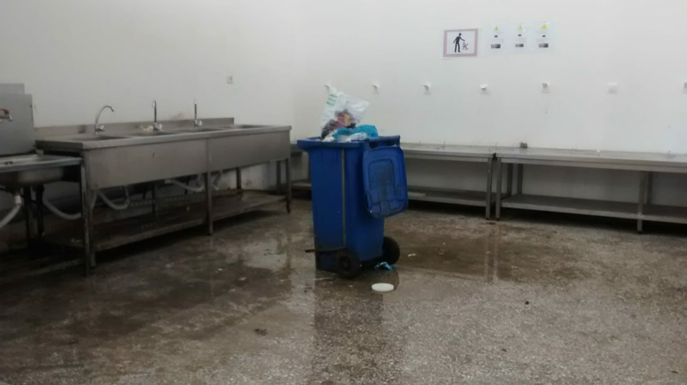

### AYS SPECIAL — THE CASE OF OINOFYTA: From one hell to another — island to mainland

_Oinofyta is a refugee camp run by IOM around 60 km from Athens, Greece\. In November 2017 Oinofyta was closed, as conditions did not meet the minimum legal standards\. It was re\-opened in March 2018, not because conditions had improved, but to meet demand\. An [AYS](ays-special-oinofyta-camp-the-overwhelming-sense-of-nothingness-c37d4037a65) team member visited the camp after it had reopened in the summer and noted that conditions were worse than when the camp was initially closed — 9 months later, people exist in the same hell\._

 ’ is accommodating refugees in conditions that are unlawful, unsanitary and unsafe\._](assets/ae38893f9cbc/1*EaOXBo4pKz61aBEL11o6sw.png)

A child plays in the dust outside the camp\. _UN intergovernmental organisation ‘ [International Organisation for Migration \(IOM\)](https://greece.iom.int/en) ’ is accommodating refugees in conditions that are unlawful, unsanitary and unsafe\._

During 2018, the international media, as well as human rights organizations, focused their attention on the hotspots of the Greek Islands, mostly Moria on Lesvos, a place that has been widely referred to as “ [the worst refugee camp on earth](https://www.youtube.com/watch?v=8v-OHi3iGQI) ”, or Samos where [4,600 people live in a camp built for 650](https://www.bostonglobe.com/opinion/2018/11/15/refugees-pushed-edge-survival-greek-island-samos/8UvQngBU5cKuavGNbXli0N/story.html) \.

These camps are rightly criticised as conditions are insufferable — they are overcrowded, unsafe and unsanitary\. Thousands have no choice but to continue living in tents throughout the winter\. Conditions are deplorable despite millions of Euros being sent by the EU to improve conditions\. In July, [20 million extra Euros](http://europa.eu/rapid/press-release_IP-18-4342_en.htm) were awarded to the UNHCR for this purpose, but on Lesvos, everything remains unchanged\.

This money was in addition to the 1\.6 billion Euros given to Greece since 2015 to address migration\. There is an [ongoing investigation](https://www.thetimes.co.uk/article/eu-investigates-corruption-claims-linked-to-refugee-funds-for-greece-z0ntn2bxp) regarding corruption and embezzlement of these funds\.

In the fall of 2018, the Greek migration minister Dimitris Vitsas [announced that](https://refugeeobservatory.aegean.gr/en/greece-move-6000-refugees-island-camps-mainland) 6000 people will be transferred from the camps on the islands by the end of the year\. This number is on top of over [23,000](https://www.google.com/url?sa=i&source=web&cd=&ved=2ahUKEwjE_qX8m77fAhUxgM4BHcqhArMQzPwBegQIARAC&url=https%253A%252F%252Fgreece.greekreporter.com%252F2018%252F11%252F24%252Flesvos-migrant-camp-a-scar-on-the-conscience-of-europe-says-amnesty%252F&psig=AOvVaw2zNC-WrpNBxs2uAyd4S17b&ust=1545938537616712) refugees who have already been transferred to the mainland in 2018\. As [pressure mounts](https://rsaegean.org/en/greece-eu-move-asylum-seekers-to-safety/) to transfer asylum seekers from Lesvos and other hotspots, IOM [proudly proclaim](https://www.iom.int/news/un-migration-agency-houses-over-2000-vulnerable-migrants-refugees-transferred-aegean-islands) that they play a part in relocating families to better conditions\.

However, transfers to camps such as Oinofyta should not be celebrated too quickly\.

Oinofyta, like the hotspots on the islands, is unsafe and unsanitary; conditions in the camp certainly breach legal standards\. Transferring people into such conditions is an unlawful solution\. One person told us _“we were driven here in a bus, dropped at the gate and then just left, we didn’t even know where we were”_ \.

When Oinofyta reopened earlier this year, it was under the pretence of it being a temporary, emergency measure\. But the camp and its residents look as if they’re here to stay\.

With no safe play areas children are left to amuse themselves amongst rubbish in the yard

These moves threaten to hide the problem as opposed to solving it, allowing the EU and other authorities to claim that the refugee ‘crisis’ is being handled effectively\. These plans also threaten to create the same overcrowded conditions as people experience on the islands\.

The capacity of Oinofyta is [reported](https://rsaegean.org/en/reception-crisis-in-greece/) to be 424, though estimates by the UNHCR place the number of residents at [596](https://data2.unhcr.org/en/documents/download/66038) and residents themselves estimate that there are closer to 1000 people\.

Unsanitary waste facilities in the camp’s communal kitchen

The [UNHCR notes](https://data2.unhcr.org/en/documents/download/66038) that there are environmental hazards within Oinofyta camp\. More worryingly still, they are aware that there are no ‘Standard Operating Procedures’ for persons with specific needs, unaccompanied asylum seeking children or persons who have survived sexual and gender based violence\.

They do however consider that Oinofyta has “sufficient” cooking facilities, access to water, separate female washing and toilet facilities and sewage systems\. The reality is far from “sufficient,” as we saw during our visits to the camp\.

Human faeces smear the walls of Oinofyta\. The camp’s toilets have no doors and men and women’s sections are separated by makeshift curtains\. The water is not fit for drinking and the communal kitchen is flooded with dirty water and overflowing bins\.

Flooded toilets without doors for the women \(left\) and human faeces on the wall of the men’s toilets \(right\) \. Makeshift curtains separate male and female toilets\.

The surfaces are so unsanitary that residents spend what [meagre stipends](https://www.unhcr.org/5a14306a7.pdf) they have on cooking equipment for personal use\. Rubbish litters the floors and the building itself — a disused chemical factory — is visibly structurally unsound\. Children can play only in the rubble outside, there is no safe indoor communal space\. Residents have self\-organised a shop to sell basic provisions as the nearest supermarkets are a long walk away\.

Contrary to IOM’s public posts, there are no regular activities provided for residents at all\. Healthcare is almost non\-existent and the camp is left unstaffed at weekends and overnight\.

Unsafe drinking water in the toilet areas and overflowing bins and dirty flooded floor in the communal kitchen

Something else of concern at Oinofyta is the limited help allowed in, a problem that is common in many camps on the mainland\. NGOs must first gain official permission before offering help inside the camp\. We learnt that organisations offering desperately needed services such as healthcare, midwifery and legal information, had requested permission but been ignored or denied entry\.

Only two NGOs are currently allowed into the camp, ‘Food Kind’, which cooks food three times a week for residents, and ‘Echo Mobile Library’, which aims to provide access to learning resources to camp residents\. This is a far cry from life in the camp before its closure in 2017 when Do Your Part and Armando Aid offered activities and support ranging from [lessons](https://embercombe.org/oinofyta-refugee-camp-school/%2520%2520%2520%2520%2520-%2520https://www.reef.com/blog/we-heart-oinofyta-refugee-camp.html) to initiatives aimed at allowing residents to earn an [income](https://www.unhcr.org/withrefugees/map-location/residents-oinofyta-refugee-camp-started-small-business-allowing-support-livelihoods/?mpfy-pin=1796) \.

The UNHCR notes that there are [no educational activities](https://data2.unhcr.org/en/documents/download/66038) within Oinofyta\.

Remains of life in the camp before its closure in 2017

Asylum seekers who reach the high threshold to be classified as ‘vulnerable’ include pregnant women such as 21\-year\-old Zinab\* who was transferred from Moria camp on Lesvos\. Zinab lived through eight months of her pregnancy at Oinofyta and gave birth alone in the camp\. She went into labour at 6 am when no staff were present\. Other residents did what they could — they called an ambulance and they helped deliver her baby\. The residents who assisted Zinab did not speak Greek or English and the ambulance arrived two days later\. As a result of the lay resident’s intervention, her baby was hurt during the delivery\.

There is inadequate medical care in Oinofyta and no midwives\. Following the birth of her baby girl, IOM do not help Zinab and she has to travel at her own expense and alone to a local hospital\. _“They knew I was pregnant yes, but they did not help me, they did not even check on me after they knew my baby had come,”_ said Zinab\.

Also transferred from Lesvos but at nine months pregnant is Shivan and her husband and three children, from Iraqi Kurdistan\. Shivan has half a liver, following a bomb blast in her country\. They have heard stories such as Zinab’s and fear giving birth in Oinofyta\. This fear has grown following an incident a few days prior to our meeting, when Shivan suffered severe chest pains and asked IOM to call her an ambulance, which she says they refused to do\.

Shivan and her family have approached IOM staff within the camp on other occasions, seeking reassurance that they will receive the help they need\. They have not received clear answers that any action will be taken to support them and are told only to “wait”\.

When asked about the difference between life in Moria and Oinofyta the family find it hard to decide which camp is worse\. _“In Moria, there were fights and we were cold living in a tent, but there were doctors\. Here there are no doctors, no help\. It’s so dirty, like hell”\._

IOM’s [website](https://greece.iom.int/en/humanitarian-and-recovery-support-affected-population-greece) states that they provide primary healthcare in Oinofyta, in partnership with Medicine du Monde \(MDM\) \. This is not the case\.

Becka, a nurse active with an independent medical NGO, notes that it is military doctors who provide medical services\. These military doctors do not have interpreters nor do they have medication\. Medical services are so scant that many believe that there are in fact no doctors\.

Those lucky enough to be seen and given prescriptions must walk 3 km to the nearest pharmacy and pay for the medication themselves\. Some are too sick to make this journey and some simply cannot pay\. A 65\-year\-old diabetic resident is both incontinent and almost blind\. Becka’s NGO pays the 80 Euros a month for her essential medication\. IOM do nothing to help her\.

Becka notes that essential medical services are not available inside the camp, and due to IOM staff’s inaction, many cannot access Greece’s public health system outside the camp either\. _“To access Greek healthcare you must have [AMKA](http://www.amka.gr/tieinai_en.html) \. If the camp staff do not help the residents get AMKA, they cannot access essential healthcare outside the camp\. People are having to travel to Athens to meet with specialist NGOs, a journey people cannot afford and that many are too unwell to make\.”_

The UNHCR notes that the nearest general public hospital is [over 10 km](https://data2.unhcr.org/en/documents/download/66038) from Oinofyta\.

Ronak from Kobane in Syrian Kurdistan was transferred from Moria just a day after giving birth\. She was transferred with her husband Ahmed, one\-year\-old daughter and newborn baby\. Ahmed was an engineer in Syria and notes how structurally unsound the abandoned Oinofyta factory building is\. They know how common earthquakes are in Greece\. _“The building leaks and we sleep in our clothes every night,”_ Ahmed tells us, _“in case of emergencies”_ \. Ronak tells us that she has lost 20 kg since she arrived at the camp\.

Ronak is not the only one losing weight at an alarming rate in Oinofyta\. Becka notes that around 30% of the children her NGO sees from Oinofyta are clinically underweight\. _“We are seeing 5 year olds who weigh as much as two\-year\-olds,”_ she tells us\.

Ronak, Ahmed and their two children light a fire to keep warm and cook food outside

People describe feeling closer to death than life\. _“If you are well when you get here, you will leave sick,”_ says Ahmed\. _“Here it is honestly worse than in Syria,”_ he concludes\. _“If we could go back to Syria we would\. I know many people who have made the journey back\. Better to go home and die than live here in this filth like animals\. We’ve been here since Oinofyta reopened\. We’re lucky, our asylum interview is in 2020, but some people have 2024 interview dates\.”_

We spoke with two young Afghani residents, one an unaccompanied minor who gave his age as an adult as he was [afraid of being detained](https://www.synigoros.gr/?i=childrens-rights.en.news.446301) by Greek authorities\. Both have been living in the camp for eight months\. The hope they felt when they reached Europe is slowly dying, with dreams of getting a job and finding a way to escape the camp seeming more and more unlikely as time goes by\. They both tell us of their aspirations to learn Greek and find a job in one of the many factories surrounding the camp, yet due to the lack of educational support for camp residents this goal remains unattainable\.

When asked what they do all day, as they are not able to work or study, the boy replies _“just sleep, you can only sleep”\._ Some turn to drugs to pass the time — one of the boys shows us a video of his roommate smoking heroin\. He showed it to IOM staff, as he felt uncomfortable and wanted to change rooms — they told him to go away\.

The lack of activities in the camp is a huge problem for its residents, and until very recently the children did not attend school — the other young man shows us pictures of the classes he organised teaching English to both adult and child residents of the camp\. _“This camp is not for the living,”_ he says\. _“Even if you locked a dog in here it wouldn’t stay\.”_

They relay the conditions for single men in the camp, living in small, leaking and overcrowded rooms\. Neither feel safe in Oinofyta but both are not seen as vulnerable enough to have a chance of being transferred\. Both boys note the irony that they must first be driven mad in the camp before they can be classed as vulnerable enough to be transferred\. _“They want us to wait here until we are mad, then we’ll be vulnerable enough\.”_

Some choose death over life in this camp\. In July this year a man hung himself\. Again, there were no staff in the camp when he was discovered\. Becka received a call at three am from residents who were frantic\. They told Becka that they cut the man down\. Nobody performed CPR as they did not know how to\. Still alive, residents explained he was bundled into a police car and taken away\.

His death was [reported in the local media](http://www.ekathimerini.com/230996/article/ekathimerini/news/refugee-found-dead-in-oinofyta-in-suspected-suicide) , but IOM did not investigate and nothing changed\.

IOM reality

It is clear that conditions within Oinofyta camp do not meet legal standards\. Though most camps on mainland Greece [lack any legal basis](https://rsaegean.org/en/reception-crisis-in-greece/) , minimum standards for the reception of asylum seekers are set out in [EU law](https://eur-lex.europa.eu/legal-content/EN/TXT/?uri=celex%253A32013L0033) , and have been [adopted into Greek law](https://www.taxheaven.gr/laws/law/index/law/877) too\.

Most residents meet the legal definition of ‘vulnerable’, having been transferred from island hotspots\. The conditions in Oinofyta are both inhuman and degrading, breaching [Article 3](https://www.echr.coe.int/Documents/Convention_ENG.pdf) of the European Convention on Human Rights\.

IOM’s website quotes Gianluca Rocco, IOM Greece Chief of Mission, saying:

_Our priority is to provide to all people arriving from the islands dignified living conditions, which we have done in coordination with the Ministry of Migration Policy and with funding from the European Commission\. We acknowledge and respect the vulnerability of these individuals and we want to alleviate their suffering by improving their everyday life\.”_

IOM’s publicity is a far cry from the reality at Oinofyta\.

> We call for the camp’s immediate closure and the transfer of all residents into appropriate, clean, safe accommodation with requisite support\. We believe that IOM, the UN and the Greek government should be accountable for the current standards and answer to the acute suffering of Oinofyta’s residents\. 

\( \* \* all names have been changed\)

**_\(Independent volunteers working with AYS Info Team\)_**

**We strive to echo correct news from the ground through collaboration and fairness\.**

**Every effort has been made to credit organizations and individuals with regard to the supply of information, video, and photo material \(in cases where the source wanted to be accredited\) \. Please notify us regarding corrections\.**

**If there’s anything you want to share or comment, contact us through Facebook or write to: areyousyrious@gmail\.com**

_Converted [Medium Post](https://medium.com/are-you-syrious/ays-special-the-case-of-oinofyta-from-one-hell-to-another-island-to-mainland-ae38893f9cbc) by [ZMediumToMarkdown](https://github.com/ZhgChgLi/ZMediumToMarkdown)._
