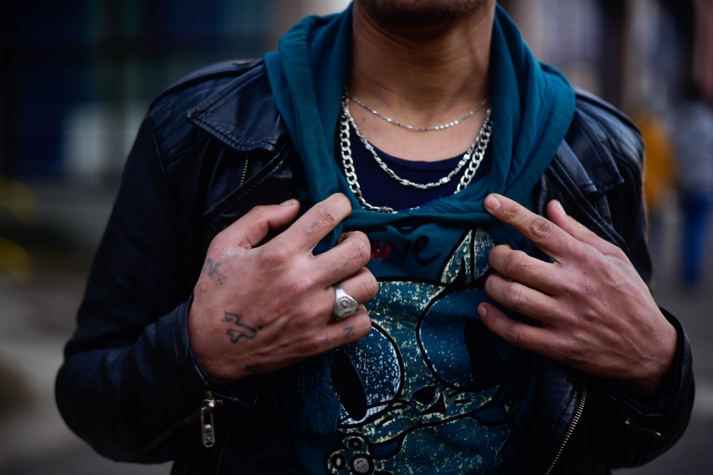
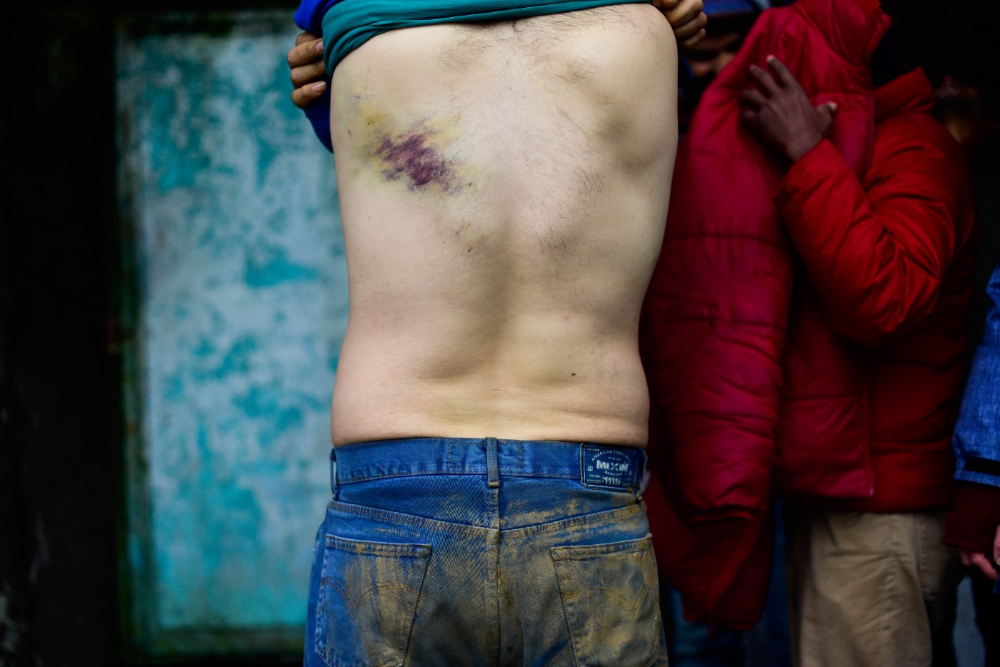
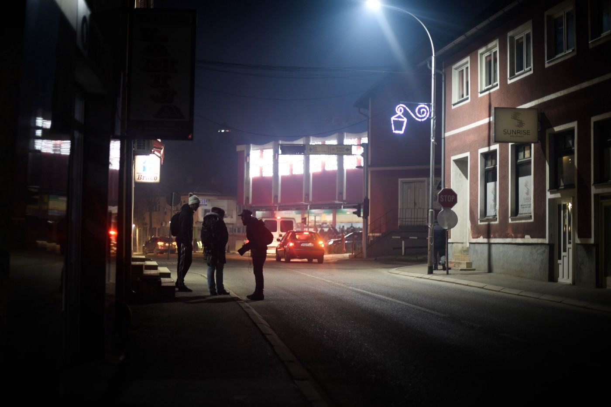
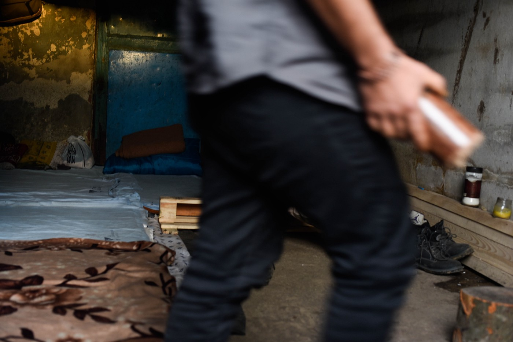

### AYS SPECIAL: Being recruited by smugglers

_To reach the European Union from Bosnia one person needs over 3000 euros\. Since there are no legal opportunities for transit and crossing the border irregularly on foot is almost impossible, people have become reliant on smugglers\. In a bid to earn their way towards Europe, some turn to the very smuggling networks that they seek to move with\._

**Velika Kladuša, in the north\-west of Bosnia and Herzegovina** — A quiet flat filled with cigarette smoke\. Ahmad \(22, Syria\) is sunk into a couch and holds a tissue full of his own blood\. He is cleaning his open wounds and removing thorns from his skin after a long walk in the forest\. His hands are shaking and his eyes, exhausted, are struggling to stay open\. He returned several hours before from the Croatian border which marks the entry\-point into the European Union for refugees and migrants travelling along the Balkan Route\.

_“I walked twenty people to the point in Croatia, from where they were picked up by a car\. Also, women and children were with me\. Now, they are in Europe, safe, and I am back here \[crying\] \. One man had a problem with his kidney and could not walk, so I carried him for hours on my back\. I did not sleep for two days, but this is my job\. Ana moharebe \[I am a smuggler\],”_ Ahmad said and lit another cigarette while leaning his head against the wall\. _“It is risky and hard, but I do not have another option\. I will go ten times more and then a car will take me to Europe\.”_

Ahmad is similar to the other 23,000 people\-in\-transit who entered Bosnia\-Herzegovina in 2018\. He arrived with the intention of moving through the country in pursuit of safety in European countries\. Running counter to this intention, however, are the highly protected EU external borders of Croatia and Slovenia\.

The majority of those seeking to pass along this route and claim asylum suffer physical violence from police officers, are robbed, and then [pushed back to Bosnia](http://www.nonamekitchen.org/wp-content/uploads/2017/04/Selected-November-reports.pdf) \. Since there are no legal opportunities for transit, and crossing the border irregularly on foot is almost impossible, people have become reliant on smugglers\. Human smugglers offer “safer” alternatives of transport in cars to Slovenia and then Italy\. From there, people continue their journeys further on towards western and northern Europe\.

People on the move rather pay thousands of euros to smugglers than walk through mountains and risk being beaten and pushed back by Croatian police, like this man\. Photo by Angélica Sánchez

The more difficult that it becomes to cross the borders on foot, the more the smuggling business expands\. The [EU spent €18 million](http://hr.n1info.com/English/NEWS/a329994/Croatia-receives-strong-support-for-its-Schengen-area-bid.html) from its Internal Security Funds on technical equipment and training in Croatia to help “solve” migration flows\. This money served to heighten the level of surveillance and securitization along the border\. The nightly sounds of a helicopter and gunshots pulsing out from the nearby Croatian border provided an ominous reminder to the residents of the Trnovi camp in Velika Kladuša of the violence awaiting those trying to step into the European Union\.

Ultimately, this “border protection” does not stop people escaping from wars, poverty and climate change and searching for asylum\. Instead, it makes their journeys more clandestine, risky and expensive\.

_“It is not possible to walk without a car arranged by a smuggler\. If you walk you get caught, beaten and you are back in Bosnia\. You need a good smuggler to reach Europe and this costs 2,000 euros,”_ said Rashed \(26, Iran\) in October\. After the first snow fell in the north of Bosnia, the prices went up to as much as 3,000 euros as it became more difficult for the smugglers’ cars to drive in the snow\.

Those stranded on the wrong side of the EU border often struggle to find such high sums of money\. In a bid to earn their way towards Europe, some turn to the very smuggling networks that they seek to move with\.

_“If you understand GPS, you can speak a few languages and you are not scared, Abu Hamza can employ you,”_ Omar \(19, Syria\) said as the call to prayer began to ring outside a mosque\. _“He does not pay me\. The deal is that after some time of taking people to the point in Croatia, he will take me to Italy by car for free\. I trust him\.”_

Like Omar, his boss, Abu Hamza was a refugee himself several years ago and saw an opportunity for good business in “helping” people cross the border\. While sitting in a café in Velika Kladuša, one can notice several young men from Afghanistan and Pakistan recruiting clients and negotiating the prices of transit\.

Young men and minors working for human smugglers recruit clients, negotiate the prices of transit, and walk them across the borders to an awaiting car\. Photo by Angélica Sánchez

Ali \(20, Afghanistan\) has been working for a human smuggler to earn money\. _“I had not sent money to my family for three years\. They are very poor and need money, the same as me here\. How else I would make money?”_ said Ali in an abandoned house where he and his friends sleep\. _“I am paid 200 euros \[10% of the sum a client pays\] for walking people a few kilometres into Croatia where a car is waiting for them\.”_

Ahmed, Omar, Ali, and the other young men and minors involved in the smuggling business are doing dirty work for their bosses while taking the highest risk\.

_“They \[Croatian border patrols\] took me to a police station\. They told me that they had seen me crossing the border many times and started shouting at me: ‘You are a smuggler\!’ Afterwards, they took me to a closed room and beat me for half an hour until they got tired,”_ recalls Ali\. _“They did not have any proof in the end and let me go\. I was lucky I did not end up in jail for seven years\.”_

Young men work for diverse smuggling networks in these small north\-western Bosnian border towns: Syrian, Pakistani, Albanian and Bosnian\. Some of these groups have been operating across the Balkan route for decades\. While some consider smugglers as their only form of help to cross the border, others see them as “d _raculas_ ” who are abusing the difficult circumstances of people in transit\.

_“Me and my friends gave a smuggler 10,000 euros\. We were waiting in a forest in Croatia for days, but no car came\. We have never seen the smuggler and our money anymore,”_ said Faled \(27, Palestine\) _“That is why I got involved in smuggling\. I want to give people fair prices and be a person who helps them, not to abuse them\.”_

People on the move surviving for months and years in abandoned houses and provisional camps see smuggling as the only opportunity to make money and move on from Bosnia\. Photo by Angélica Sánchez

Over the past decade, we have seen the partial construction of “Fortress Europe”\. Barbed\-wire fences have been erected in Hungary, asylum seekers in Bulgaria, Montenegro and Croatia are routinely and violently pushed back over the borders, and thousands of people have drowned in the Mediterranean Sea\. The rhetoric which has been repeated time and again is that these practices protect EU citizens from potential threats\. Thousands of young lives have been left to stagnate on the wrong side of the EU borders at a result of these practices\. Left with a limited set of options which incentivizes illegal movement, people on the move place their lives in the hands of human smugglers and criminal organisations\.

**\* All names have been changed to protect anonymity of people on the move stranded in Bosnia\.**

**_\(Written by Karolina Augustova, edited by Jack Sapoch, photos by Angélica Sánchez\)_**

**We strive to echo correct news from the ground through collaboration and fairness\.**

**Every effort has been made to credit organizations and individuals with regard to the supply of information, video, and photo material \(in cases where the source wanted to be accredited\) \. Please notify us regarding corrections\.**

**If there’s anything you want to share or comment, contact us through Facebook or write to: areyousyrious@gmail\.com**

_Converted [Medium Post](https://medium.com/are-you-syrious/ays-special-being-recruted-by-smugglers-144b3cb2cf7e) by [ZMediumToMarkdown](https://github.com/ZhgChgLi/ZMediumToMarkdown)._
