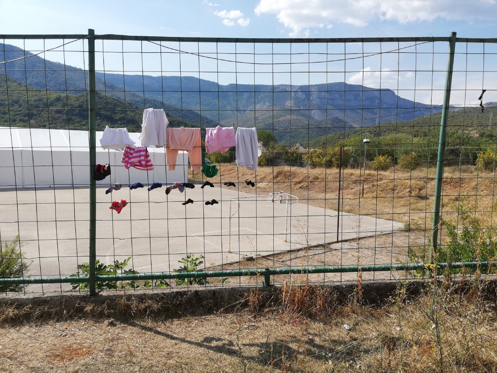

### **Letter to citizens of the EU from the “periphery”: Politics of the closed borders are bringing us closer to fascist rules**

Salakovac camp, Mostar\. Bosnia and Herzegovina\. Photo AYS\.

We, the human rights defenders and citizens from the countries relegated to the “periphery” of the European Union \(EU\) and the Schengen space, want to express our deepest concern for the current situation in which we can see the rise of fascism and a deterioration in basic human rights, such as freedom of movement and the right to seek asylum\.

The leniency towards and acceptance of the rise of the far\-right in European countries is worsening living conditions for people on the move and increasingly endangering their lives\. The claim that the EU’s fundamental values are respect for human dignity and human rights, freedom, democracy, equality and the rule of law has been in question for several years now\. However, in 2018 this claim lost any remaining standing\.

As human rights defenders and citizens, many of us coming from the recently war\-torn former Yugoslav space, we are obliged to point out that current national governments at the periphery of the EU are supposed to act in accordance with guidance from Brussels\. We do not want to justify the institutional inactions, violations and violence used against people on the move in our countries, so we use all available legal and political means to fight their \(in\)actions\. However, we also want to point out that it is the EU, the way it currently functions, that is justifying and making their actions possible\.

> **We use the opportunity of the start of the new year to appeal to the citizens of all the member states, as well as those from the countries that hope to become members one day, to return to the EU’s fundamental values and insist on and promote them in the realities of their own countries\.** 

> **We call upon citizens of the EU to stand up and make their resistance stronger than the borders which the governments are building\.** 

> **We call upon citizens of the EU to resist violence against people on the move, and to stand up against any officials, individuals or groups who intend to continue with the diminishing of the basic rights that all people of the world are entitled to\.** 

> **Today this violence is enacted upon people who dream about a better life in the EU, tomorrow it will be experienced by the citizens of member countries, their friends or relatives, based on some other traits that can be used as a basis for discrimination\.** 

We want to warn, given our unpleasant privilege of the real lived experience of war, but also difficult post\-war years, that it is exactly this kind of behaviour which the bureaucracy of the EU is demonstrating now that enabled the dissolution of the Socialist Federative Republic of Yugoslavia and consequent wars\. In addition to this, it provided fertile grounds for the exploitation of the traumatized and poor, the dehumanization of victims of war and the rise of war profiteers in a similar way to what we see now\. In 1990s Balkans, people were often forced to rely on criminals who were promising to provide them with basic necessities, because governments and UN agencies often failed to do so — even such basic necessities as food, shelter or safe passage from occupied territories\.

Thus, we feel obliged to bring your attention to the urgent need to change the policies regarding the militarization and sealing of the borders in the EU\. Now, when there is no legal way to enter the EU or to seek international protection at Europe’s borders, smugglers and profiteers are thriving again, while those who seek their basic rights are ignored, abused, or even criminalized\.

With the upcoming EU parliamentary elections and the track record of national elections in member states in the last few years, we want to warn that we are again at the verge of the destruction of humanity\. It is exactly these politics, of closed borders and the encouragement of violence and disregard for human rights of a certain group of people that, within the framework of the representative democracy as we now have it, enable the rise and strengthening of fascism\.

**For these reasons, we call upon the citizens of EU countries, to show political courage and solidarity with people on the move and demand that their governments live up to their obligations stemming from the respect for human dignity\. The pressure has to come from your presence in the streets, advocacy engagements, petitioning, and acts you will make to change the EU as it is now\.**

**The change will come with the solidarity and not charity you can show toward people who are dreaming about a better life in Europe\.**

For these reasons, we also call upon the governments in the EU member states to reconsider their current position of closed borders, and their paying of non member states to enforce border regimes which go against democratic principles\. At the moment, by doing so, they are enabling the establishment of authoritarian regimes in the periphery of Europe and further, as well as giving more power within the EU to far\-right politics by giving them legitimacy\.

These policies give approval to violence against human beings at the EU’s borders\. People are beaten up, tortured, sexually harassed, insulted and humiliated\. And according to well\-documented independent reports and numerous testimonies from the field, this is all done by the repressive regimes, border guards and police, from EU member states\.

If those who are currently making decisions in EU capitals do not reconsider their policies, they are going to be remembered in history as guilty of the fall of universal human rights, values and human dignity\.

We are entering 2019 with the scheduled EU parliamentary elections for May\. There is a small window of opportunity to act and try to redirect the sinking ship\. No one will make this change for us\! No one will do it instead of you\! As citizens of EU countries and those who aspire to become part of the EU, we all have to embrace our civil responsibility and ask for change where it matters — from our own governments and policy\-making bodies in the European Union\. When governments fail, citizens must act\. Because Europe painfully remembers what fascism feels like\. But it also knows the power of inclusion and solidarity\.

Let’s remind our elected officials that solidarity, respect for human rights, freedom and democracy, is what is most urgent now\. There are many ways to demand protection for those who suffer due to the disrespect of human rights\. It can be direct action such as peaceful protest, targeted and advocacy or any other form of civic pressure\. But it must be constant, massive and large enough to succeed\. And that’s why every voice and every action matters\.

**European citizens must not remain silent, as they have so many times in the past\.**

Are You Syrious?

Nela Porobić Isaković, Sarajevo

Gorana Mlinarević, Sarajevo

Milena Zajović, Zagreb

Nidžara Ahmetašević, Sarajevo
### Citizens:

Adis Imamović Piksi, Velika Kladuša

Adriana Zaharijević, Beograd

Aleksandar Pavlović, Beograd

Aleksandra Uzelac, Zagreb

Ana Čigon, Ljubljana

Antonija Petričušić, Zagreb

Andrea Grgić, Zagreb

Artan Sadiku, Skopje

Barbara Matejčić, Zagreb

Biljana Stanković Lori, Novi Sad

Bojana Ćulum, Rijeka

Bojana Videkanović, Sarajevo

Biljana Đorđević, Belgrade

Damir Arsenijević, Tuzla

Damir Imamović, Sarajevo

Danijela Dolenec, Zagreb

Dinko Gruhonjić, Novi Sad

Dobrica Veselinović, Beograd

Dražana Lepir, Banja Luka

Duško Vuković, Podgorica

Dženeta Agović, Tutin

Elma Tataragić, Sarajevo

Emina Buzinkić, Zagreb

Ervina Dabižinović, Herceg Novi

Faruk Šehić, Sarajevo

Gazela Pudar Draško, Belgrade

Goran Bubalo, Sarajevo

Helena Popović

Irena Cvetkovik, Skopje

Iskra Gešoska, Skopje

Iva Pleše, Zagreb

Ivan Blažević, Zagreb

Ivana Dragsić, Skopje

Ivan Đorđević, Beograd

Ivana Pantelić, Beograd

Ivana Ristić, Leskovac

Ivica Mladenović, Belgrade

Jasmina Vasileva, Skopje

Jelena Čolaković, Podgorica

Jelena Vasiljević, Belgrade

Jelena Vidojević, Belgrade

Jeton Neziraj, Prishtine

Jovan Džoli Ulićević, Podgorica

Maja Maksimović, Belgrade

Maja Raičević, Podgorica

Marijana Hamersak, Zagreb

Marijana Kučer, Split

Marina Škrabalo, Zagreb

Marjan Ivković, Beograd

Milan Vulović,

Milica Pralica, Banja Luka

Milivoj Bešlin, Novi Sad

Milovan Pissari, Beograd

Minja Bogavac, Beograd

Nataša Kršulj, Sarajevo

Nedim Sejdinović, Novi Sad

Nikola Vukobratović, Zagreb

Nuna Čengić, Sarajevo

Paola Petrić, Beograd

Paula Petričević, Kotor

Petra Matić, Zagreb

Roman Kuhar, Ljubljana

Rumena Bužarovska, Skopje

Sanela Lepirica, Ključ, Velačevo

Senad Pećanin, Sarajevo

Sanja Sarnavka, Zagreb

Snežana Baralić Bošnjak, Pančevo

Snežana Čongradin, Belgrade

Snježana Milivojević, Belgrade

Srećko Horvat, Zagreb

Suzana Kačić\-Bartulović, Splita

Tea Hvala, Ljubljana

Zoe Gudović, Belgrade

Žarka Radoja, Belgrade
### Groups and NGOs:

Autonomni kulturni centar Attack, Zagreb

Borders None, Zagreb

Centar za mirovne studije, Zagreb

Društvo za psihološku pomoć, Zagreb

Dugine obitelji, Zagreb

Inicijativa Dobrodošli

Inicijativa mladih Varaždin za Europsku prijestolnicu mladih 2022

Helsinški parlament građana, Banjaluka

K\-zona, Zagreb

Legis, Skopje

Oštra nula, Banja Luka

Otvoreni Centar Bona Fide, Pljevlja

SOS Team Kladuša, Velika Kladuša

U dobroj vjeri, Zagreb

No Borders Community

Vox Feminae, Zagreb

Zaklada Solidarna, Zagreb

_Converted [Medium Post](https://medium.com/are-you-syrious/letter-to-citizens-of-the-eu-from-the-periphery-politics-of-the-closed-borders-are-bringing-us-5e0f7012436e) by [ZMediumToMarkdown](https://github.com/ZhgChgLi/ZMediumToMarkdown)._
