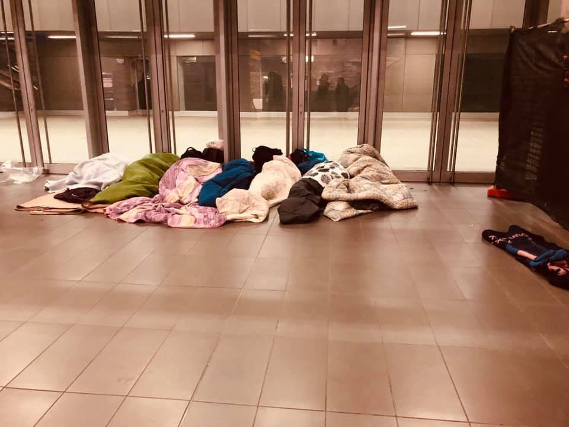
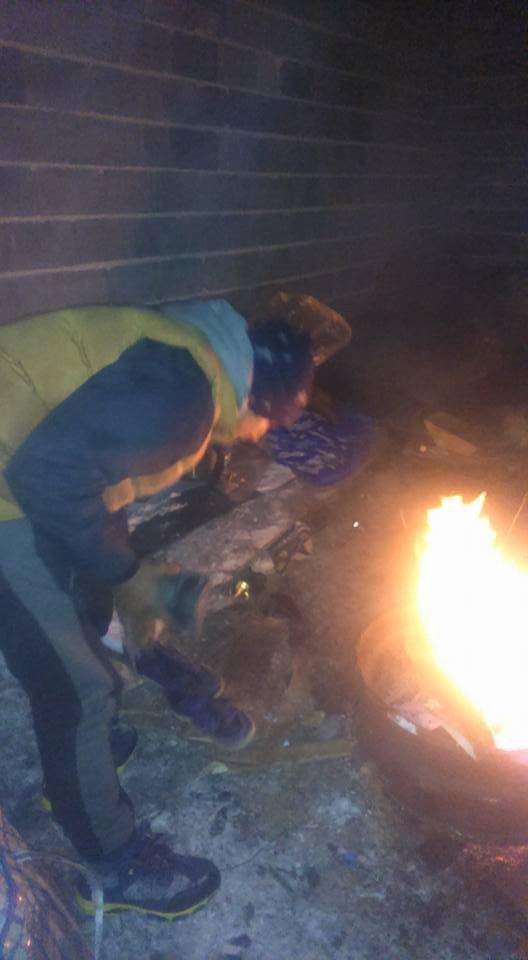
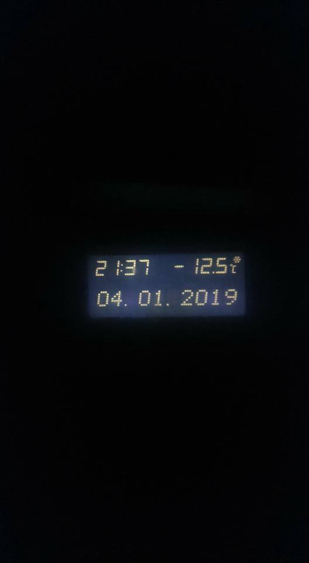

### AYS Daily Digest 04/01/2019 Italy, 2018: record of asylum claim responses, record of rejections

14 days and counting without a safe port for people on the SeaWatch3 and SeaEye /// Bosnian police keep illegally harassing people on the move /// Migrants left outside of winter shelter in Rome /// Video from Danish detention centre /// More on pushbacks from Greece to Turkey /// Setting the record straight on the Channel crossing towards the UK

 \)](assets/4c53576571da/1*y5qy_vwMD-jhfZ55NJOSPQ.jpeg)

NO BORDERS — Protest in Palermo, Sicily \(Photo by [Irene di Stefano](https://www.facebook.com/irenuccia.di.stefano?__tn__=%2Cd%2AF%2AF-R&eid=ARAXws2XgxSFq-W2Gh2hl7IF2TSkb6X0raq3Mc19lhDZ5X3erjQNyWau1eEEwJ9xL1DJPjbDa2UDF6nh&tn-str=%2AF) \)
#### FEATURE — Italy, 2018: Record of asylum claims responses, record of rejections

 , on provisional data from the Interior Ministry](assets/4c53576571da/1*24e3Zhd14LJaqZ8EnAouSw.jpeg)

Responses to protection claims examined in 2018 — by [Vie di Fuga](http://viedifuga.org/richiedenti-asilo-ed-esiti-in-italia-2018-lanno-dei-record/?fbclid=IwAR1V4g2_tU_kRBGEN7gBOxb_mdq_vB55gVT3LbwRUYlg8-RnQ-rOdIg3WSA) , on provisional data from the Interior Ministry

The abolition of humanitarian protection became law in December, but — according to the analysis of Interior Ministry’s data carried out by [Vie di Fuga](http://viedifuga.org/richiedenti-asilo-ed-esiti-in-italia-2018-lanno-dei-record/?fbclid=IwAR1V4g2_tU_kRBGEN7gBOxb_mdq_vB55gVT3LbwRUYlg8-RnQ-rOdIg3WSA) — it had been systematically limited \(following the will of the ministry\) since the summer\. Read our feature on the effects of the new law [HERE](https://medium.com/are-you-syrious/ays-daily-digest-03-01-2019-italian-mayors-are-defying-salvini-4de2585975f1?source=collection_category---5------0---------------------) \.

In 2018 94,901 asylum claims were examined\. This is the highest number ever recorded in the country\. It was 81,500 in 2017 and 91,102 in 2016\.

Rejections increased even more: 62,629 cases were rejected, which counts for 2/3 of the total, 66%\. It was 58% in 2017 and 59% in 2016\. Rejection rates in 2018 increased after the summer, reaching a peak in December, when 82% of cases were rejected\.

The numbers of those receiving subsidiary protection decreased from 9% in 2017 to 4% in 2018; those receiving humanitarian protection went from 25% to 21%\. Refugee status was awarded to only 8% of claimants \(this figure was the same for 2017\) \.

More than 60,000 people have been refused any form of protection \- the highest number ever for the country \- while only 30,000 people obtained some form of protection\.

Also the number of asylum seekers has decreased drastically since last year\. Only 54,000 people managed to apply this year\. 130,119 applied in 2017\.

Regarding [arrivals](https://twitter.com/JigginoRuss/status/1081201045668286464) , the new policy of closed ports and the criminalisation of sea rescue had its effects: 23,370 landed in Italy in 2018 \( \-87\.90% compared to 2017\) \. 6,394 are of Tunisian and Algerian nationality \(about 25% of the total\); because of their nationality, they immediately receive an expulsion order\. Moreover, the Libyan coast guard [intercepted](https://reliefweb.int/report/libya/unhcr-libya-overview-2018-jan-dec-2018-enar) 14,949 people at sea, now all imprisoned in detention centres in Libya\.

■■■■■■■■■■■■■■ 
> **[Jolie Rouge](https://twitter.com/JigginoRuss) @ Twitter Says:** 

> > Ossia:
su 100 persone partite da Tunisia e Libia:
50 raggiungono l'Italia, 3 muoiono in mare, 47 fermate da guardie costiere e recluse nei lager
In Italia, delle 50 persone: 12 ricevono subito decreto di espulsione,  
a 31 viene respinta la domanda d'asilo
Rimangono 7 "regolari" 

> **Tweeted at [2019-01-04 15:49:20](https://twitter.com/jigginoruss/status/1081216015839698944).** 

■■■■■■■■■■■■■■ 

In other words, based on 2018 data:

> “ **out of 100 people leaving for Europe from Tunisia and Libya** : 

> 50 reach Italy, 3 die at sea, 47 are intercepted by coast guards and imprisoned in detention centres\. 

> Out of the 50 people who reach Italy: 

> 12 receive an expulsion order straight away, 31 will see their asylum claim rejected\. 

> **7 people will see their claim accepted\.** ” 

It seems clear that the anti\-migration rhetoric and policies of the new government have affected the capacity and judgement of asylum officers and commissions\.

Italy is not alone in this\. In many parts of Europe, right\-wing and “left\-wing” governments are constantly restricting human rights for people on the move\. International laws are ignored, national laws are followed only when convenient, police forces throughout Europe use violence and brutality on a daily basis and politicians cover for them\. As AYS, we wrote an open letter to the EU citizens from the periphery of the Union, “expressing our deepest concern for the acceptance of the rise of the far\-right in European countries” **and calling upon citizens of the EU to stand up and make their resistance stronger than the borders built by their governments\.**

SEA
#### 49 people stranded at sea for 14 days and counting

49 people are still stranded in the Central Mediterranean\. 17 people are on the SeaEye vessel, while 32 are on the SeaWatch3 about 1 kilometre from Malta\. One individual felt so desperate that he [jumped into the freezing](https://www.repubblica.it/cronaca/2019/01/04/news/migrante_si_tuffa_in_acqua_europa_aspetta-215812585/?ref=fbpr) water to try and swim to shore but was quickly rescued\. Still no European country has agreed to accept the stranded passengers, ignoring calls from the Commissioner for Human Rights\.

■■■■■■■■■■■■■■ 
> **[Commissioner for Human Rights](https://twitter.com/CommissionerHR) @ Twitter Says:** 

> > States must not delay offering a safe port to children, women and men on board #SeaWatch3 and #SeaEye any longer. Their health/safety should not be put at further risk by leaving them stranded at sea. Humanity and compassion must prevail. @[seawatchcrew](https://twitter.com/seawatchcrew) @[seaeyeorg](https://twitter.com/seaeyeorg) @[coe](https://twitter.com/coe) @[PACE_News](https://twitter.com/PACE_News) 

> **Tweeted at [2019-01-04 11:55:32](https://twitter.com/commissionerhr/status/1081157177782489088).** 

■■■■■■■■■■■■■■ 

They have however had a visit from two boats carrying supplies and support\. On board as well: the new crew, German MPs and a Church representative\.

_It’s now 14 days being left alone at sea — new record of shame\. — [Sea Watch](https://twitter.com/seawatch_intl/status/1081124532826619904?fbclid=IwAR2qRQth2J8FaRtWpPakDzNcVqu1_u1kXUHmr9l1NAm8r__TNWliA-PiPVg)_
#### Balkan weather forecasts for the weekend 5–6/01/2019

MONTENEGRO: Cloudy with sunny intervals in the south\. Possibly precipitation of short duration in the night\. In the north moderately to entirely cloudy, mostly towards the end of the day and during the night from time to time snow\. Wind weak to moderate, during the morning strong at some places, blowing from the north\. The lowest temperatures from \-16 to \-1 and highest daily from \-7 to 8 degrees\.

SERBIA: Predominately clear and cloudy with moderate frost in the morning\. Clouds bringing snow will first hit the north, and as the day progresses the rest of the country\. More snow during the evening and night when the snow covers will increase\. The wind weak to moderate, blowing from the southwest, towards the end of the day turning into a northwester and amplifying\. The lowest temperatures from \-7 to \-5 and highest daily from \-2 to 0 degrees\.

BiH: Snow and rain in most of Bosnia\. In the Herzegovina area it will be sunny but cold\. Temperatures from \-11 to 5 degrees in the South\.

CROATIA: Snow in some areas, in others rain or just clouds\. Temperatures from 0 to 3 degrees\.

GREECE: [Local media report](http://en.protothema.gr/thessaloniki-covered-in-snow-as-sophia-continues-to-affect-greece-photos/?fbclid=IwAR2QwM8-QBZ8v5sn94BCxMaQaKfx27OjP472lqj0vJsBrTa_4J3YX2o8I04) that an area of low pressure called “Sophia” continues to pass through Greece bringing low temperatures and storms\. A thick layer of snow has covered the centre of Thessaloniki and the areas of Panorama, Hortiatis, Asvestohori, as well as the regions of Lagadas and Oreokastro\. Because of the frost, the Nea Messimvria — Xirochori District Provincial road is closed, while the road of Agios Vasilios — Chortiatis is also shut down on Friday\. The electricity network has been effected in Pilion, Larissa and Volos in central and eastern Greece due to the weather conditions\.

GREECE
#### Arrivals

[Local media report](https://www.lesvosnews.net/articles/news-categories/astynomiko-reportaz/43-metanastes-stin-periohi-toy-aerodromioy-mytilinis) that 43 people were rescued in the early hours of the 3rd January by a FRONTEX boat during bad weather conditions\. They have been transported to the port of Mytilene\.
#### Lesvos Solidarity call out

Nurses are needed on the Island\. More info in Greek [here](http://socialpolicy.gr/2019/01/%CE%B8%CE%AD%CF%83%CE%B7-%CE%B5%CF%81%CE%B3%CE%B1%CF%83%CE%AF%CE%B1%CF%82-%CE%BD%CE%BF%CF%83%CE%B7%CE%BB%CE%B5%CF%8D%CF%84%CF%81%CE%B9%CE%B1%CF%82-%CE%BD%CE%BF%CF%83%CE%B7%CE%BB%CE%B5%CF%85%CF%84.html?fbclid=IwAR3gyvEaeUM6YTYbvWtvAu-HIp7ziBN0TqFEaCiKjBE-8vURmw25v3pQfHc) \.
#### Evros Pushbacks

As we [reported yesterday](ays-daily-digest-03-01-2019-italian-mayors-are-defying-salvini-70c698efe603) pushbacks along the Balkan route continue\. Arsis have published a [press release](http://www.arsis.gr/deltio-typoy-paramones-protochronias-anilikoys-prosfyges-ston-evro/?fbclid=IwAR3o3mBm3rojZe3Q6kcoMfsu8RUmP6L5C0Fbvmd_NHLgIzq9xTj7MtVBxH4) about their concerns for unaccompanied minors living in an Identification Centre \(KYT\) in the village of Filakio, Evros\. It is the only KYT in Northern Greece, 23 kilometres northwest of Orestiada, and within 36 containers, structured in four wings, some 250 refugees live under police custody\. Almost half of them are children\.

The issue of particular concern here is the [illegal pushback of people to Turkey](http://www.arsis.gr/deltio-typoy-paranomes-epanaproothiseis-ston-evro/?fbclid=IwAR3aA_9DLo2hA4qRGSzmgH_DMF75AL5o1tWZr8ORw8pkzTxVqG-HRvJoCm8#more-16030) \.

_A typical case is a 15\-year\-old refugee who came to Greece and returned to Turkey six times\!_

_Twelve minor unaccompanied refugees, boys aged 12 to 17 sit in a semicircle and talk about their living conditions and their dreams for the future\. Almost everyone would like to get to Germany\. They refrain from talking about their trip to Greece\. They say that if they do so, they will need to write a book\._
#### People returned from Germany

[Local media report](http://www.ekathimerini.com/235982/article/ekathimerini/news/only-7-migrants-returned-from-germany?fbclid=IwAR1N_PtzrjB6Z3xHOsWpjShkcQ89-_hhAp67p1E3gWgt3dLbtsAcyhumBuU) that only 7 people have so far been returned to Greece from Germany out of the 1,500 people that Greece agreed to take as part of a bilateral agreement signed in August\. The deal affects people who travelled to Germany after having applied for asylum in Greece\.

In return, Berlin agreed to receive 2,900 people from Greece for family reunification, but so far only 345 people have been able to travel to Germany\.

ITALY
#### Migrants left out of emergency shelter for homeless people in Rome

From [Baobab Experience](https://www.facebook.com/BaobabExperience/posts/1984822821594460?__xts__%5B0%5D=68.ARDMY1AiW-lVzxzJXfTFk-783mL_2g3vzvRGPyHMLwpT8cwO1fBYpoTH9Nf681Xc2oKjtaIZOpnIxIq4uLse46qAHmI8Yfk9tmekvZAI8qnET7spLg7GF0gR2p259J06-HpVtP4pLDVOxfmd8vccIUAPNyhB_Hz3QibafYArYGgcqK6-noVMBNPFeRiqpgR2mL1AhWYJKy9qvRrghpu1wAl9XR4p1W3ZFzEXjCRkK95D6exf8hDAgHUB_uo7ls1blHoAnVaFBq39aYxocDt4uI-NYH4Bsd-kglQSYUWqb264ZhSI_aSh_AXfHunzOrT3qglm_gceNPLdJY9hMCIiFMHL-g&__tn__=K-R) :

> “Last night we witnessed one more abuse carried out by Rome institutions against the bodies and the minds of migrants\. 

> A cruelty that we are no able to explain \[…\]” 

 \)](assets/4c53576571da/1*lMnKg3f1qvI0fFhJHelz1Q.jpeg)

Tiburtina Station shelter, Roma \(Photo by [Giovanna Maria Seddaiu](https://www.facebook.com/giovanna.seddaiu?__tn__=%2Cd%2AF%2AF-R&eid=ARDO_XrXC8isqHDhpIhpb8YzWZTZjphMnCRkHXCT4CN0wvZi-P7uRWIlvD8mG_0rkdivQH7VHfq8XCU4&tn-str=%2AF) \)

Rome, January 2019, no “winter plan” for homeless people has been activated so far, despite the fact that three people have already died in the last weeks\.

> “Last night, since temperatures were due to drop below zero, the council opened three shelters\. \[…\] The news was published the same afternoon: when we found out about it, we started to gather information on availability, opening times and services offered\. We gave this information to those migrants who, after the eviction of Piazzale Maslax, often gather around the area and are forced to sleep rough\. 

> Following the information provided, we gave a list of 24 names who needed sheltering\. It was 20\.30\. 

> An answer arrived at 23\.30: 8 people could go to one shelter, 5 to a second and 5 to the one in the Tibnurtina Station, where they all were already\. \(A total of 18 people out of the 24 in need\) \. 

 \)](assets/4c53576571da/1*hWkE1jGSssnpTIwWFo-GbA.jpeg)

Tiburtina Station shelter, Roma \(Photo by [Giovanna Maria Seddaiu](https://www.facebook.com/giovanna.seddaiu?__tn__=%2Cd%2AF%2AF-R&eid=ARDO_XrXC8isqHDhpIhpb8YzWZTZjphMnCRkHXCT4CN0wvZi-P7uRWIlvD8mG_0rkdivQH7VHfq8XCU4&tn-str=%2AF) \)

> We asked the reasons for this decision, since the beds in the Tiburtina shelter were all free, since the tube had already stopped running, since that some migrants had already left after waiting for hours, since they could not buy a ticket, take a night bus, go to the other side of the city with belongings and blankets\. Only to be asked to leave the shelter at 6 AM\. We asked why\. \[…\] 

> They answered that they had to keep the beds empty, for possible emergencies\. 

 \)](assets/4c53576571da/1*kCOv3aiX45r8ntxJW6WHnQ.jpeg)

Tiburtina Station shelter, Roma \(Photo by [Giovanna Maria Seddaiu](https://www.facebook.com/giovanna.seddaiu?__tn__=%2Cd%2AF%2AF-R&eid=ARDO_XrXC8isqHDhpIhpb8YzWZTZjphMnCRkHXCT4CN0wvZi-P7uRWIlvD8mG_0rkdivQH7VHfq8XCU4&tn-str=%2AF) \)

> “We know about this behaviour, and we knew that those beds would remain empty\. We had to witness a grotesque scene: a fence was separating 6 people sleeping in beds surrounded by 24 empty on one side, and other people forced to sleep on the ground, outside, on the other\. 

#### Template of council resolution to defy the Salvini Law

After the mayors of several cities expressed their intention to defy the Salvini Law on Immigration and Security, [Alter Ego — Fabbrica dei diritti](http://www.fabbricadeidiritti.it) published a [template of a resolution](http://www.fabbricadeidiritti.it/2019/01/04/dalle-parole-ai-fatti-smontiamo-il-decreto-salvini-ecco-la-delibera-per-iscrivere-allanagrafe-i-richiedenti-asilo/?fbclid=IwAR0slr_2RtpHrVFo0_vbj49S0qU9xU_0dyj32VWg2gxe9BwLMD88ivmXKSE) that can be used by councils to oppose the provisions against asylum seekers introduced by the law\.

> We worked on a template of council resolution which could undo a piece of the law 113/2018, exactly where it, banning asylum seeker from registering in the _anagrafe_ \(the Municipal registry office\) it violates art\. 26 of the Geneve Convention, and bar them from enjoying fundamental rights\. 

> \[…\] It is a template that we put in the hands of those councils who wants to effectively oppose the effects of this law\. 

> It is a temple that we offer to activists and citizens of our small and large cities to put pressure on the councils\. 

Read more on the effects of the law in [yesterday’s digest](ays-daily-digest-03-01-2019-italian-mayors-are-defying-salvini-70c698efe603) \.
#### Demonstrations in Italy

\#Opentheports demonstration in Bologna:

In Palermo citizens held a protest in solidarity with the city’s mayor and the other mayors who are opposing the new Law on migration\.

 alermo \(Photo by [Irene di Stefano](https://www.facebook.com/irenuccia.di.stefano?__tn__=%2Cd%2AF%2AF-R&eid=ARAXws2XgxSFq-W2Gh2hl7IF2TSkb6X0raq3Mc19lhDZ5X3erjQNyWau1eEEwJ9xL1DJPjbDa2UDF6nh&tn-str=%2AF) \)](assets/4c53576571da/1*egEUCIz4YbaZt289S0y2Qw.jpeg)

[P](https://www.facebook.com/irenuccia.di.stefano?__tn__=%2Cd%2AF%2AF-R&eid=ARAXws2XgxSFq-W2Gh2hl7IF2TSkb6X0raq3Mc19lhDZ5X3erjQNyWau1eEEwJ9xL1DJPjbDa2UDF6nh&tn-str=%2AF) alermo \(Photo by [Irene di Stefano](https://www.facebook.com/irenuccia.di.stefano?__tn__=%2Cd%2AF%2AF-R&eid=ARAXws2XgxSFq-W2Gh2hl7IF2TSkb6X0raq3Mc19lhDZ5X3erjQNyWau1eEEwJ9xL1DJPjbDa2UDF6nh&tn-str=%2AF) \)

BOSNIA AND HERZEGOVINA
#### New reports from Bira Admission Camp

#### Police keep harassing people on the move

As we have reported many times, Bosnian police keep stopping people trying to access the border area of Bihac, and forcing them to go back to Sarajevo\. Internal push backs are against the law, but it has become an everyday practice in the last few months\.

 \)](assets/4c53576571da/1*cQH7-AbLfDY4I_PZtIbgKA.jpeg)

Velecevo, Bosnia and Herzegovina \(Photo by [Crveni Križ Općine Ključ](https://www.facebook.com/profile.php?id=100009318317491&__tn__=%2Cd%2AF%2AF-R&eid=ARCqI361DeiNvR3oVpYDbmw-ty4RLB71eA5zjf-q40EkJXWD1Bz-tDVxqGL2k-fRz-y_prAlD2UZfY5H&tn-str=%2AF) \)

[Even yesterday police stopped 7 people in Velecevo\.](https://www.facebook.com/sanela.lepirica/posts/2232237860160765?hc_location=ufi)

The temperature reached \-12\.5 C\.

 \)](assets/4c53576571da/1*XmfzRB3GIoyMwT_yYnif8A.jpeg)

Velecevo, Bosnia and Herzegovina \(photos by [Sanella Leprica](https://www.facebook.com/sanela.lepirica?__tn__=%2CdC-R-R&eid=ARAlFWrz3FuAx_V29x-cb7TxlDyHcKadUCtS2F8SiIv_zKSRbMwJEdY8HAjYvXaBsRSCLUsNUH1j2i2K&hc_ref=ARRweKFnybcCLmdfcMu9L0b0LkS76XmIcj5n4IaIy-N-mpB8ixveRmsmoQZPhwE6MgA&fref=nf) \)

The group is [composed](https://www.facebook.com/permalink.php?story_fbid=2252396815080907&id=100009318317491&hc_location=ufi) of six people from Bangladesh and one from Iraq\. They were forced to spend the night in a garage, without a door, which protects them only from rainfall\.
Local volunteers distributed food and warm clothes\.

They will have to stay there until somebody comes to drive them back or wait for the bus tomorrow and pay for a ticket again\.

The [response of IOM](https://www.facebook.com/permalink.php?story_fbid=2252455915074997&id=100009318317491&hc_location=ufi) is that they are in charge only of centres and camps, and can’t take care of any more people\. Velecevo doesn’t offer solutions either\. Since October more than 1100 people went through this area, including many families with children, and unaccompanied minors aged 10 to 17\.

UK
#### The reality behind the shouting

In the last week several British government figures have commented on the arrival of people in the UK, after navigating across the Channel on boats not fit for purpose\. Instead of focusing on the safety of these people often rescued off the coast in distressing situations, they raised their voices about a “migration crisis”, “major incident”, and “serious concern” for the country, and about the need to increase the capacity for intercepting migrant vessels in the Channel\.

Jeff Crisp, from the Refugees studies centre in Oxford, ironically commented:

■■■■■■■■■■■■■■ 
> **[Jeff Crisp](https://twitter.com/JFCrisp) @ Twitter Says:** 

> > This is what politicians and the media are calling "Britain's migrant crisis." https://t.co/ZMcXFB6FSX 

> **Tweeted at [2018-12-29 22:01:02](https://twitter.com/jfcrisp/status/1079135229653192706).** 

■■■■■■■■■■■■■■ 

Overall, **539** people actually attempted to travel to the UK on unfit boats in 2018\. The majority of the attempts happened between October and December \(with 230 people attempting to reach the UK in the last month of the year\) \.

According to media [sources](https://news.sky.com/story/channel-migrants-what-are-the-numbers-behind-the-major-incident-11596943?fbclid=IwAR3DeutgaDv6XGFVN76RI9VwriMJL3hZtXR1wRkin493slatf4PpAq5i7g4) , 227 of these 539 people were intercepted by French authorities: **a total of 312 people arrived in the country last year through the Channel\.** While it is extremely important to remember the risks connected with an unsafe crossing, the opportunism of EU politicians for anti\-migration rhetoric has reached new lows\.

Both the [Migration Observatory](https://migrationobservatory.ox.ac.uk) and the Refugee Council are trying to set the record straight\. The Migration observatory published a briefing containing facts and figures related to Asylum in the UK\. Read it [HERE](https://migrationobservatory.ox.ac.uk/resources/briefings/migration-to-the-uk-asylum/) \. The Refugee Council published an article distinguishing fact and rumours, and calling the British Home Secretary to spend less time spreading panic and more time taking action to: 1\) introduce safe and legal routes to make it easier for refugee families to be reunited in Britain; 2\) bolster the resettlement programme; 3\) introduce humanitarian visas, which would enable refugees to start their asylum claim while still overseas\. Read more [HERE](https://www.refugeecouncil.org.uk/latest/blogs/5459_channel_crossings_-_time_to_set_the_record_straight?fbclid=IwAR25-mYTDIe7OlL_XaXVWReJwNMfxTA61FqY-RdbTD9arshlBk-7DF9trl0)
#### The Home Office issue Preliminary Information Questionnaires for asylum seekers

[Right to Remain](https://righttoremain.org.uk) inform that the Home Office have begun issuing **“ [preliminary information questionnaires](https://righttoremain.org.uk/preliminary-information-questionnaires/?fbclid=IwAR0GIRWRISKU2yHeKh9eum1KEA9zxbVVJBtDJ1d8CXQ3z-nkQ00CRZNS67Y) ”** to some people who have recently claimed asylum — though it would seem not to everybody in that situation, yet\.

This is a 18\-page long form that is sent to people **after** they have claimed asylum and had their screening interview, but **before** they have their main substantive asylum interview\.

While the Home Office claims that this form will help them “to consider your case and ensure that the decision maker dealing with your claim is fully aware of the reasons why you are claiming asylum”, the questionnaire covers a wide range of information, which the Home Office says in the form “can be shared with other UK government departments or agencies, local authorities” and also “with other countries, which may be responsible for considering you claim”\.

> It is compulsory to fill out the form and return it to the Home Office — if you do not, by the date requested, the Home Office may treat your asylum claim as **withdrawn** \. 

As Right to Remain underlines, the questionnaire form asks for important information that the Home Office will use to make a decision on your asylum claim\.

> **It is therefore really important to ask a lawyer to help you complete the form\.** However, if you do not have a lawyer, the Home Office will still expect you to complete and return the form yourself\. 

> **Make sure you check what has been written in the form and keep a copy yourself\.** 

Read more and download a blank copy of the form [HERE](https://righttoremain.org.uk/preliminary-information-questionnaires/?fbclid=IwAR0GIRWRISKU2yHeKh9eum1KEA9zxbVVJBtDJ1d8CXQ3z-nkQ00CRZNS67Y) \. Right to Remain has also published a [toolkit](https://righttoremain.org.uk/toolkit/) explaining the various phases of an asylum application in the UK\.

DENMARK
#### Video on conditions in Sjaelsmark detention centre

A video has been released made by a young boy’s father in Sjælsmark Detention Centre as his child is refused vegetables in the canteen\. There have been [ongoing protests](https://www.trampolinehouse.dk/special-events/2018/12/18/manifestation-4-support-the-children-in-sjlsmark) during November and December by children and parents living in deportation camp Sjælsmark asking for better conditions for the children of Sjælsmark\.

More info and video in Arabic [here](https://www.thelocal.dk/20190104/potato-and-broccoli-video-sparks-new-debate-over-treatment-of-denmarks-rejected-asylum-seekers?fbclid=IwAR3ttQurDtLCbKalkyop9RUdOgUiy2DSFcePmyNRX7wpgfYSbfUqkTSCUXI) \.

**We also publish weekly summaries of some of the most important news reported during the past week in our Daily News Digest: here is the [Arabic](%D9%85%D8%A7-%D8%B2%D8%A7%D9%84-%D8%A7%D9%84%D8%A8%D8%AD%D8%B1-%D8%A7%D9%84%D8%A3%D8%A8%D9%8A%D8%B6-%D8%A7%D9%84%D9%85%D8%AA%D9%88%D8%B3%D8%B7-%D9%87%D9%88-%D8%A7%D9%84%D8%B7%D8%B1%D9%8A%D9%82-%D8%A7%D9%84%D8%A3%D9%83%D8%AB%D8%B1-%D9%81%D8%AA%D9%83%D9%8B%D8%A7-f77530944236) and [Persian](https://medium.com/are-you-syrious/%DB%8C%DA%A9-%D8%B3%D8%A7%D9%84-%D9%85%D8%B1%DA%AF%D8%A8%D8%A7%D8%B1-%D8%AF%DB%8C%DA%AF%D8%B1-%D8%A8%D8%B1%D8%A7%DB%8C-%D9%BE%D9%86%D8%A7%D9%87%D9%86%D8%AF%DA%AF%D8%A7%D9%86-%D9%88-%D9%85%D9%87%D8%A7%D8%AC%D8%B1%D8%A7%D9%86%DB%8C-%DA%A9%D9%87-%D9%85%DB%8C-%D8%AE%D9%88%D8%A7%D9%87%D9%86%D8%AF-%D8%A8%D9%87-%D8%A7%D8%B1%D9%88%D9%BE%D8%A7-%D8%A8%D8%B1%D8%B3%D9%86%D8%AF-debf05bcccb5?source=collection_category---5------4---------------------) for the Week of December 24–30\.**

**We strive to echo correct news from the ground through collaboration and fairness\.**

**Every effort has been made to credit organisations and individuals with regard to the supply of information, video, and photo material \(in cases where the source wanted to be accredited\) \. Please notify us regarding corrections\.**

**If there’s anything you want to share or comment, contact us through Facebook or write to: areyousyrious@gmail\.com**

_Converted [Medium Post](https://medium.com/are-you-syrious/ays-daily-digest-04-01-2019-italy-2018-record-of-asylum-claim-responses-record-of-rejections-4c53576571da) by [ZMediumToMarkdown](https://github.com/ZhgChgLi/ZMediumToMarkdown)._
