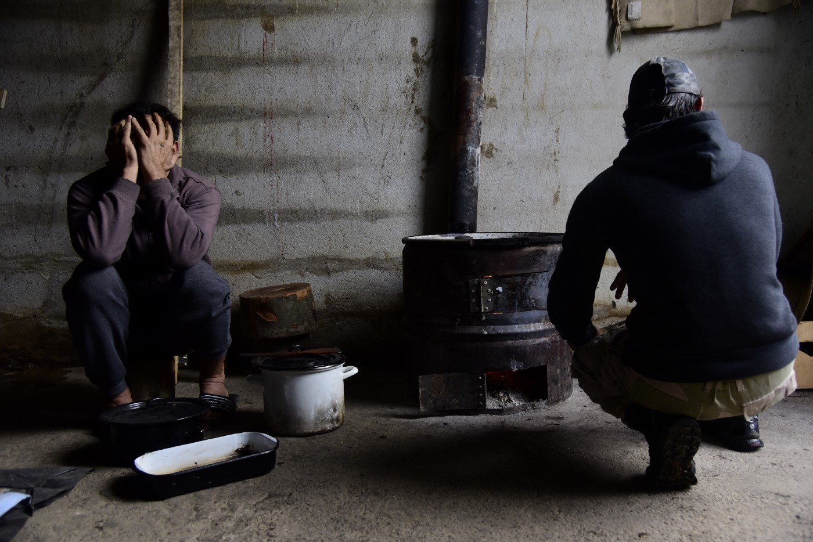
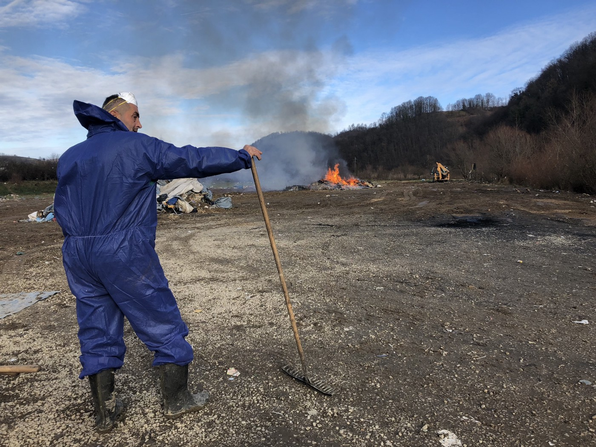
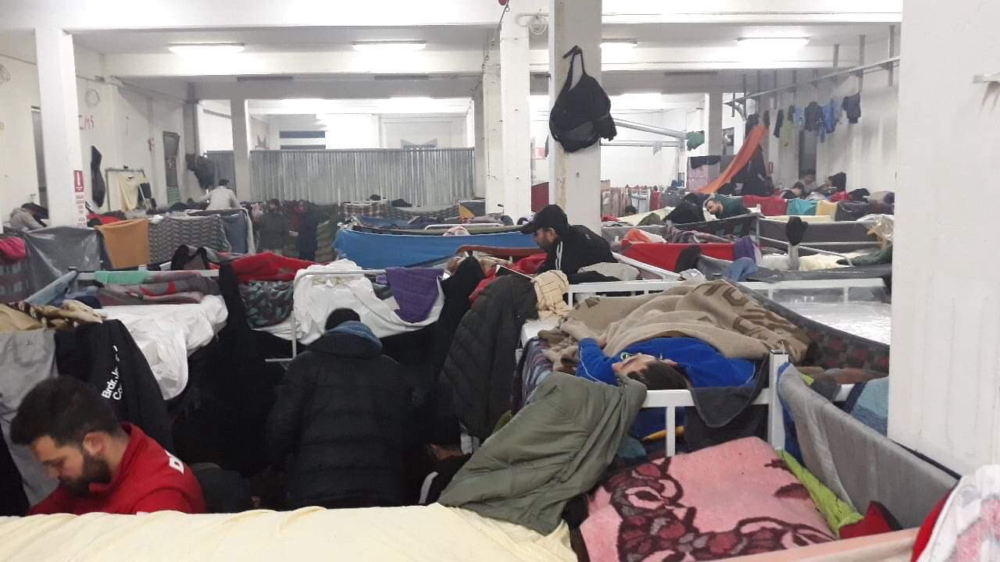
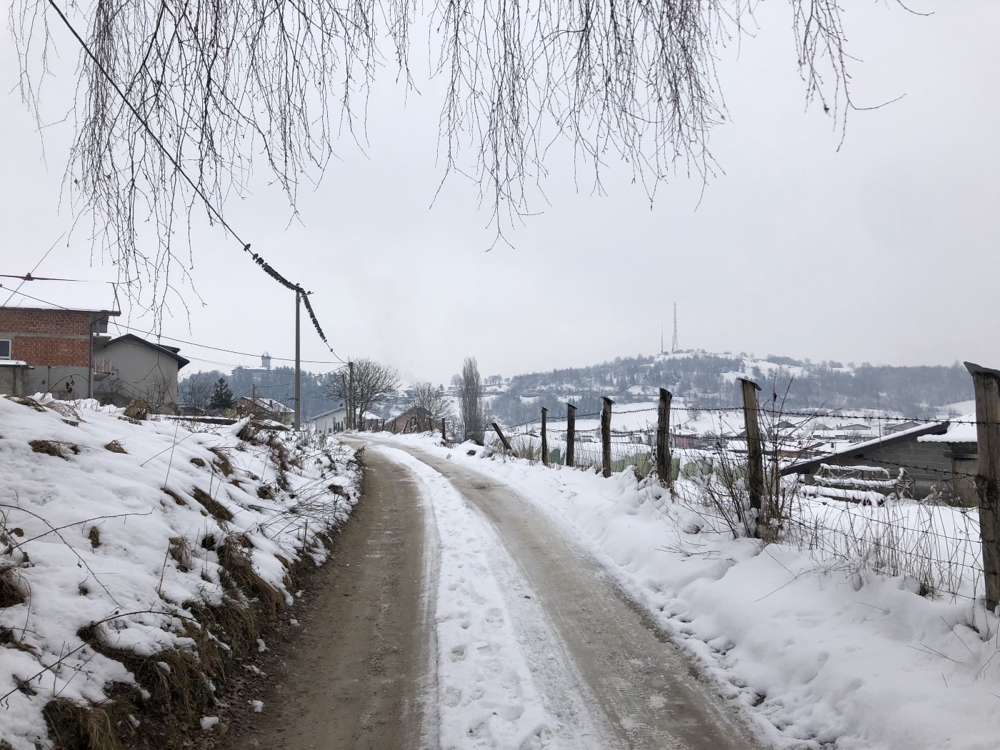
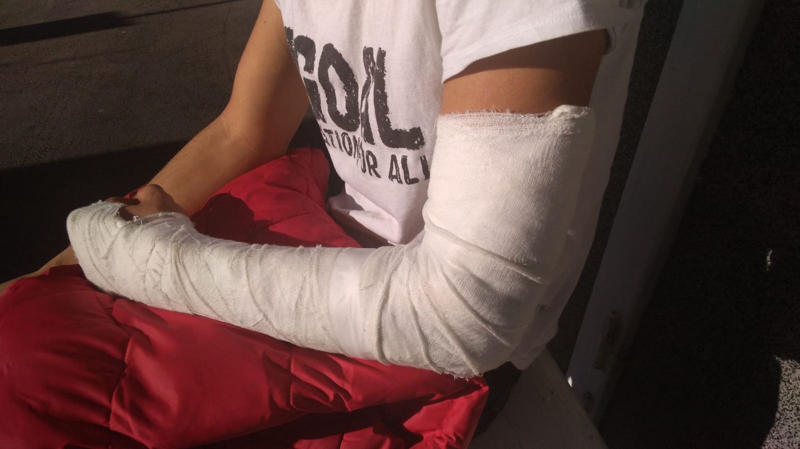
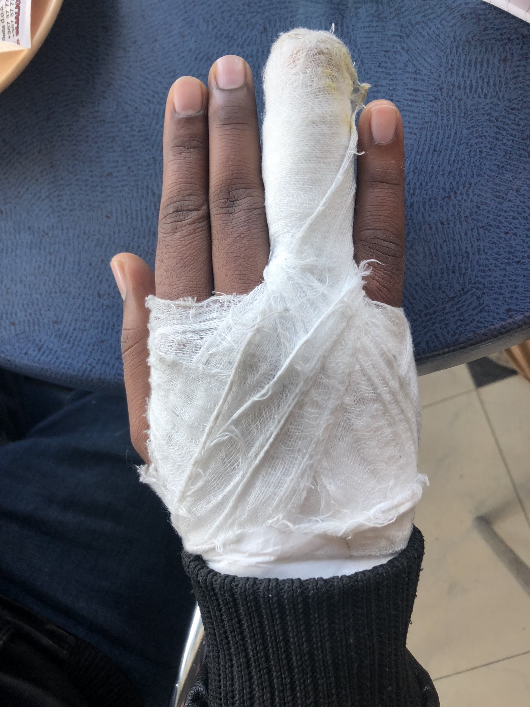
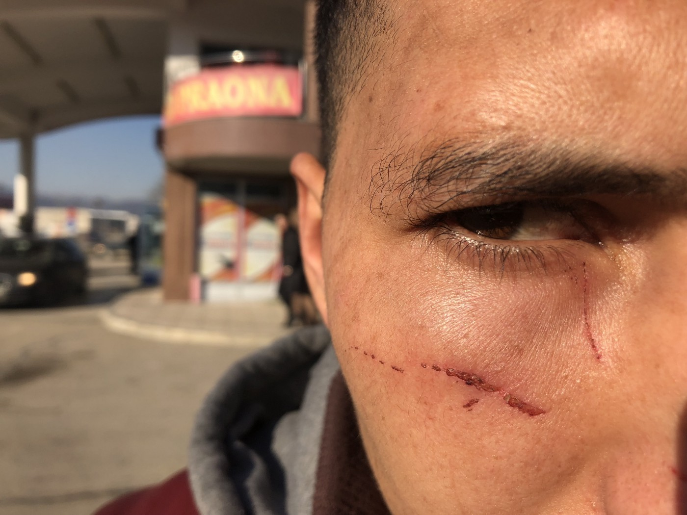

### Border violence report: Winter in Velika Kladuša

_In December, No Name Kitchen and Balkan Info Van registered 23 violence reports\. Most of the people were captured in Croatia and subsequently returned to Bosnia, but there are several reports about pushbacks from Slovenia, too\. Report also notices a new trends as emerging within the last month — the use of fires to burn the belongings of people on the move, increase in the number of reports of individuals having their shoes taken off by police officers during pushback, as well as reports about being pushed into frigid or icy water along the border\._

**A squat in Velika Kladusa\. By Angelica Sánchez\-Martinez**
### **_Miral Camp_**

On the 21th of November, representatives of the IOM and the UNHCR came to Trnovi camp to move people on a voluntary basis to Miral camp, which has been managed by the IOM in Bosnia and Herzegovina, with the support of funds from the [EU](http://europa.ba/?p=61289) \. The day after, food was no longer provided to people remaining in Trnovi camp\. Over the next several weeks water was shut off and the toilets were taken out\. Despite this, some people stayed in the makeshift camp, sleeping under tents to avoid conflicts and fights which were happening inside Miral camp\.

On the 5th of December, the municipality gave the remaining residents of the camp 30 minutes to take their belongings and burned all of the items and structures which remained afterwords\.

**The clearing and dismantling of Trnovi camp on 5/12/18\. By Jack Sapoc** h

Miral camp itself is comprised of a former industrial storage building and a large tent with beds installed inside\. IOM so far registered approximately 600 inhabitants in the camp which include people who got a registration only to get shower and food in the camp but doesn’t sleep there because of many several reasons\.

Food is provided there three times a day by the [Red Cross](https://www.ifrc.org/en/what-we-do/where-we-work/europe/red-cross-society-of-bosnia-and-herzegovina-/) in between 10\.00 am to 16\.00 pm\. Additionally, IOM is considering investing in a place for people to be able to cook their own food as the current supply does meet the quantity and quality desired by many\.

**A picture of the inside of Miral taken by a camp resident from Syria in late December**

Miral camp residents often report that it is noisy at night, leading to difficulties with sleeping\. Some have also expressed that within their group, one person must stay awake while the others rest, in order to prevent theft\.

Initially, showers in the camp were limited by an 80 liter hot water tank, however recently within the last two weeks, the IOM has increase the number and capacity of the showers to 30\.

In this context, approximately 100 refugees and migrants continue to live in Velika Kladuša outside of Miral, dispersed around various squats and informal residences in and around the city\.
### **_Winter_**

**Velika Kladuša covered in December’s snow\. By Jack Sapoch**

Winter has arrived to the region, making the living conditions for many even harder\. It snowed up to 30 cm in Velika Kladuša and the temperature has dropped down to \-6°C\. People trying to cross through Croatia and Slovenia now face an increasing level of danger from frostbite and freezing temperatures\. This threat is particularly pronounced during pushbacks where individuals report having their shoes confiscated and being pushed into rivers and streams\. Despite this, people are still determined to cross\. Many talked about their determination to spend New Year’s Eve accompanied by their family somewhere further in Europe\.

Nonetheless, the risk presented by winter’s arrival is important to understand\.

The month of November ended with the tough information of a young Algerian man who [drowned](https://www.vecer.com/danes-zjutraj-v-reki-utonil-migrant-v-iskalni-akciji-15-policistov-gasilci-in-potapljaci-6620008) in Reka River in Slovenia, accompanied by his friends who were later pushed back and beaten by the Croatian police the day after this happened \[Report 2\.2\] \.

On the 13th of December, a [16\-year\-old resident of Bira camp died](ays-daily-news-digest-17-12-18-what-is-a-signed-agreement-for-people-freezing-in-out-of-the-camps-7f3f0dec3891) in a hospital in Bihać\. A few days before, he got pushed back to Bosnia by the Croatian police\.

Additionally, on December 15th, a video purporting to show the frozen body of an Algerian man who died from exposure near the Slovenian border circulated on several social media pages\. Although the authenticity of this video has not been confirmed, a volunteer from Balkan Info Van made contact with a man who claimed to have been in this man’s group in Croatia and described carrying the Algerian man’s body to a police station and reported later being brought back to Bosnia and beaten at the border\.
### **_Status of solidarity work_**

The dynamics of assistance for independent groups and volunteers in Velika Kladuša has also shifted in the past month\. While the people of Velika Kladuša continue to engage in courageous acts of solidarity with the population of refugees and migrants in the area, the relationship between volunteers and certain local actors has become more complicated\. In the last month, volunteers from organizations active in the area describe being followed inside supermarkets by security guards and being refused entry to cafes and bars\.

This treatment is particularly pronounced for volunteers\-of\-color\. Two volunteers from No Name Kitchen were stopped while attempting to legally cross the Maljevac border checkpoint and were held up for a period of two hours while the contents of the bags and belongings were checked\. When asked why they were being held so long while other groups were able to pass quickly, they were told it was because they were from a “third\-world country”\. The volunteers were from Mexico\.

The obtainment and checking of white registration cards \(legal document to obtain after the entry to Bosnian territory, valid for a month\) has become more complicated for volunteers\. At the beginning of the month, the police requested to see the documents of all volunteers based in Velika Kladuša\. Some individuals were demanded to leave the territory after this incident for having failed to obtain these cards even though several had arrived to the country within the previous 48 hours, the legal window for the obtainment of this card\.

It should also be said that locals engaging in solidarity assistance experience an increased amount of pressure from authorities\. Importantly, this pressure is experienced under a different metric than volunteers, the majority of whom are non\-residents of Velika Kladuša\. The locals who engage in this sort of assistance will stay in the municipality for the long\-term\. Local homeowners have received visits from police and cantonal authorities for housing refugees and migrants inside of their houses\. Likewise, sympathetic landlords who rent their houses to volunteers have begun to receive increased scrutiny and visits from municipal authorities\.
### **Trends in border violence**

In the last month, the violent return and collective expulsion of asylum seekers has continued as a daily occurrence along the borders surrounding Velika Kladuša\.

> _“I told him, “Why? We are all human” and he hit me\. My friends who were already in the forest watched me as I did this\. I told him, “I am not scared of you, I am just a refugee, I won’t kill anything, I won’t steal anything”\. He told me, “You get out, motherfucker”…\. He was scared of me, he was scared of us”_ 

> Mohamed, Iraq 

We conducted 21 violence reports with groups of individuals who returned from the border\. These groups included Algerians, Moroccans, Pakistanis, Afghans, Syrians, Palestinians, Yemenis, Iraqis, Bangladeshis, and Egyptians\. Most were caught in Croatia and subsequently returned to Bosnia\. However, we also conducted three reports with groups who were apprehended in Slovenia and subsequently pushed back to Croatia and then Bosnia\.

**Victimes of border violence, including minor whose arm was broken\.**

Within the collection of our reports, certain trends can be identified as emerging within the last month\. In particular, the use of fires to burn the belongings of people on the move during their pushbacks appears to have become part of the repertoire of violence used by Croatian police officers\. When taken back to the border, individuals have reported their sleepings bags and backpacks being thrown into large fires:

> _“When we went out of the van, a fire was on, they threw everything we needed in it, even belongings from the family”\._ 

> Mohamed, Algeria 

Additionally in the past month, we have observed an increase in the number of reports of individuals having their shoes either stolen or taken off by police officers during their pushback:

> _“When we arrive there \[at the border\] I go out of the van first, one by one\. When I go out, they beat me, after they said, “take your shoes off” and they beat me , then they threw my shoes and then I crossed \[ the river\]”_ 

> Abdinoor, Algeria 

Another trend we have observed in the past month is pushbacks occurring further away from the Bosnian border in the interior of Croatia:

> _“They \[policemen\] dropped in the middle of nowhere, they told us to go to Bosnia”_ 

> Mohamed, Algeria 

One pushback group which contained an Iranian family reported having to walk 500 meters from a police van to a secluded stretch of the Bosnian\-Croatian border outside of Velika Kladuša\. The father of this family expressed confusion and apprehension towards this tactic:

> _“Inside the van the police…didn’t explain to you what they want you to do\. They open the door, slowly you are coming out and police start beating you\. \[For the entire walk\] down to the border, the police is beating you…In this time, I didn’t think about mobile, powerbank, money, only that time you can think about moving your wife and child\. At that time, you are afraid, also your child is afraid, woman is afraid, so many police\.”_ 

> _Amir, Iran_ 

A number of groups also reported this month being pushed into frigid or icy water along the border\. One of the respondents from this past month described being pushed by Croatian police officers into water which rose up to his waist along the border and then being pelted by ice and snowballs thrown by other officers on the bank of the stream:

> _“\[They\] take the ice and throw”_ 

> Mansoor, Yemen 

A final point of note of observation is that with the onset of subzero temperatures and heavy snowfall, the overall number of groups crossing into Croatia from Bosnia\-Herzegovina has gone down within the last month\. While people still cross on a daily basis, groups as a whole are smaller, their frequency is less, and their patterns of movement are shifting as well\.

It has been observed that less groups are attempting to cross on foot the entire route towards Italy, while more are attempting to link up with human smugglers within the Croatian interior\. Still, border violence persists within this dynamic\.

**A man’s face marked by scratches which he attributed to a pushback outside of Velika Kladuša\. By Jack Sapoch**
### **_Border violence coverage elsewhere_**

In the past month, a video was released by the group [Border Violence Monitoring](https://www.borderviolence.eu/proof-of-push-backs/) which was obtained through hidden cameras along the Bosnian\-Croatian border\. In it, the video shows the collective expulsion of people on the move from Croatia to Bosnia\. This evidence provides another powerful counter to the continued denial of such actions from the Croatian Ministry of the Interior\.

> _“They treated us like animals or worse\. They laughed at us and beat us as they search my things and threw them into the ground\. It was snowing and was so cold\.”_ 

> Tamir, Iraq 

In addition, the New York Times released an [article](https://www.nytimes.com/2018/12/08/world/europe/migrants-bihac-bosnia-croatia.html?action=click&module=News&pgtype=Homepage) on December 8th, detailing the conditions which refugees and migrants in northwestern Bosnia\-Herzegovina face as the winter arrives\. Within this article, the violence reports issued by this project were referred as evidence of the continued abuse of authority by Croatian police\.

Human Rights Watch also published a [report](https://www.hrw.org/news/2018/12/11/croatia-migrants-pushed-back-bosnia-and-herzegovina) based off of the collection of testimonies from victims of border violence in northwestern Bosnia\-Herzegovina\.

**_\(The full December report about the violence at the EU border can be downloaded [here](http://www.nonamekitchen.org/wp-content/uploads/2019/01/December-Border-Violence-Reports.pdf) as a PDF\)_**

**_\(Report done by the volunteers of No Name Kitchen and Balkan Info Van\)_**

**We strive to echo correct news from the ground through collaboration and fairness\.**

**Every effort has been made to credit organizations and individuals with regard to the supply of information, video, and photo material \(in cases where the source wanted to be accredited\) \. Please notify us regarding corrections\.**

**If there’s anything you want to share or comment, contact us through Facebook or write to: areyousyrious@gmail\.com**

_Converted [Medium Post](https://medium.com/are-you-syrious/border-violence-report-winter-in-velika-kladu%C5%A1a-c15423c6e4fe) by [ZMediumToMarkdown](https://github.com/ZhgChgLi/ZMediumToMarkdown)._
