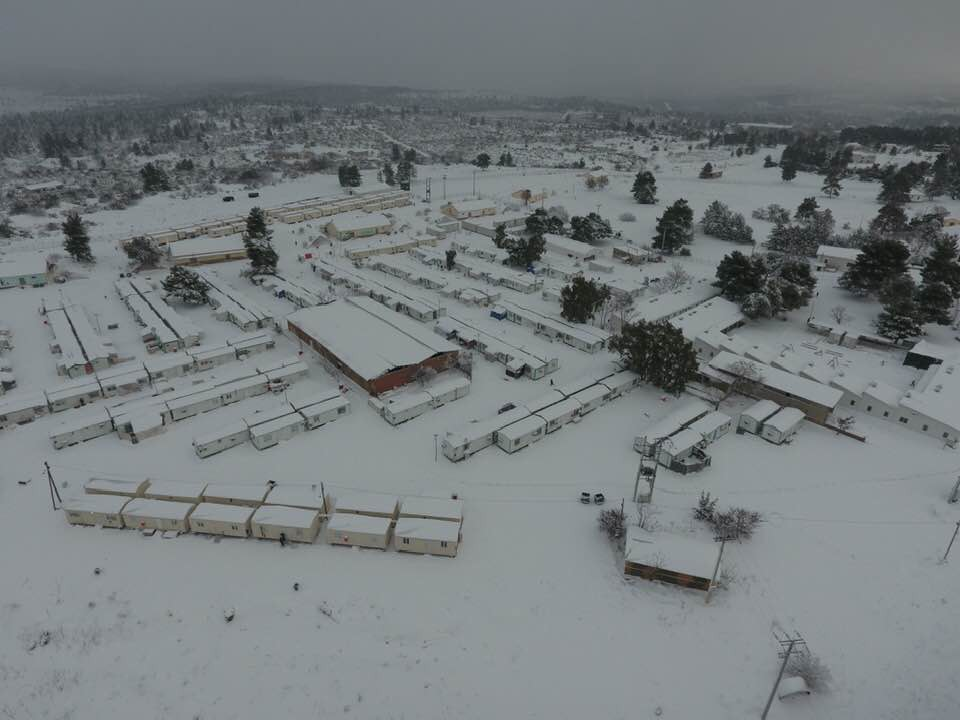
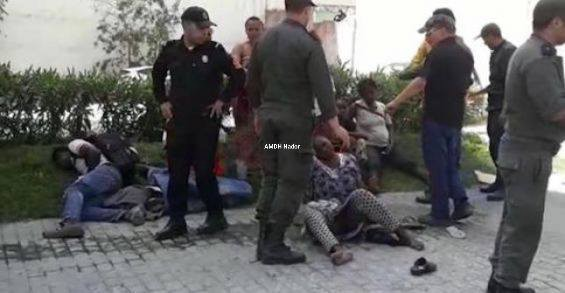
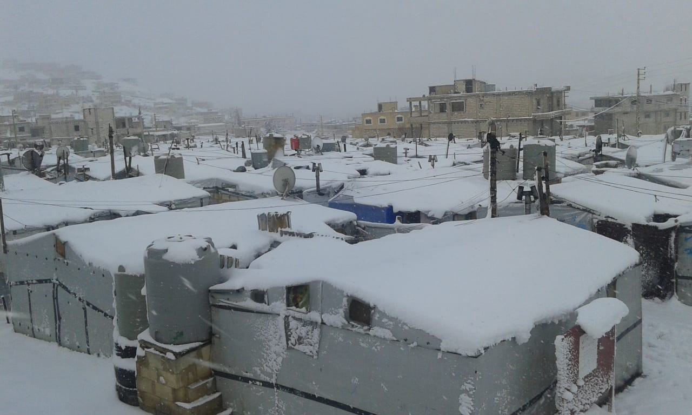
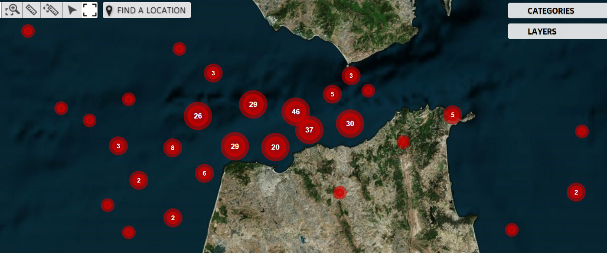
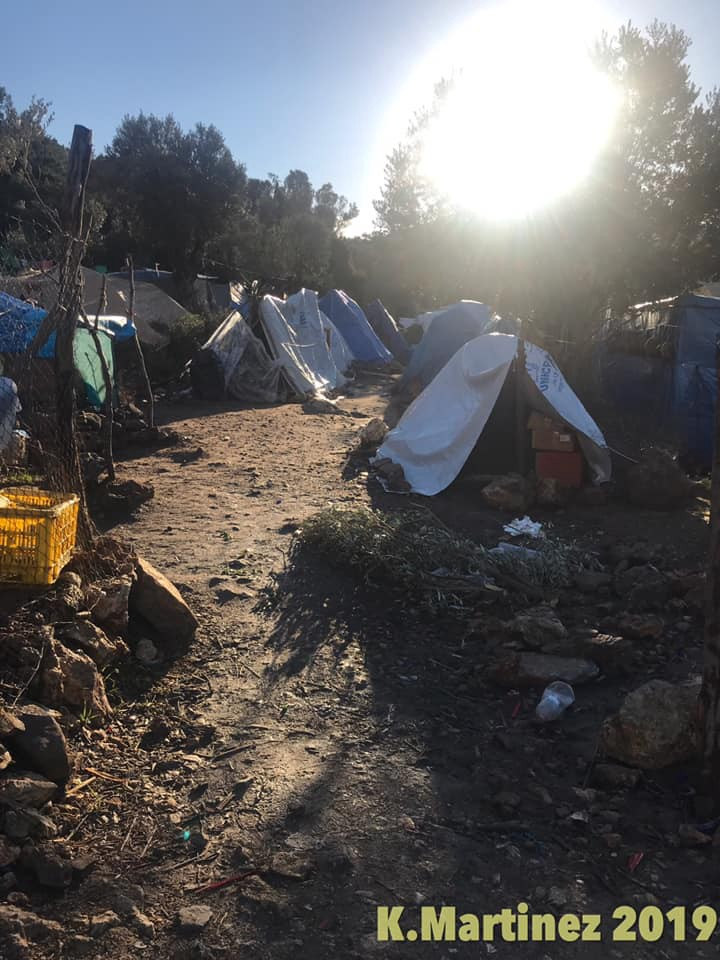
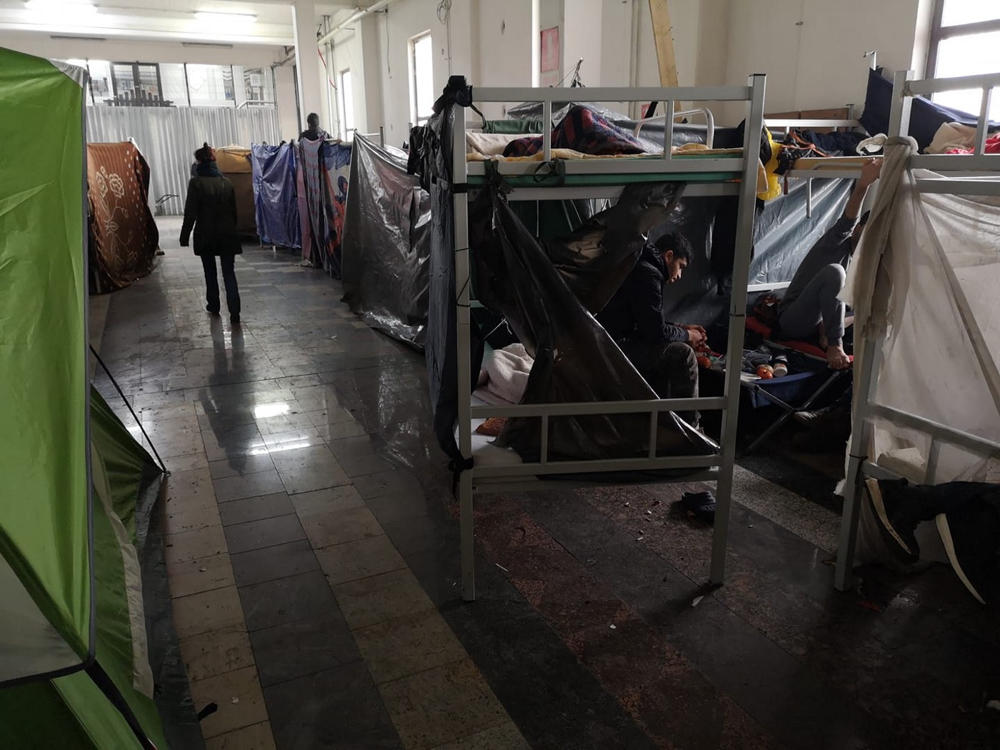
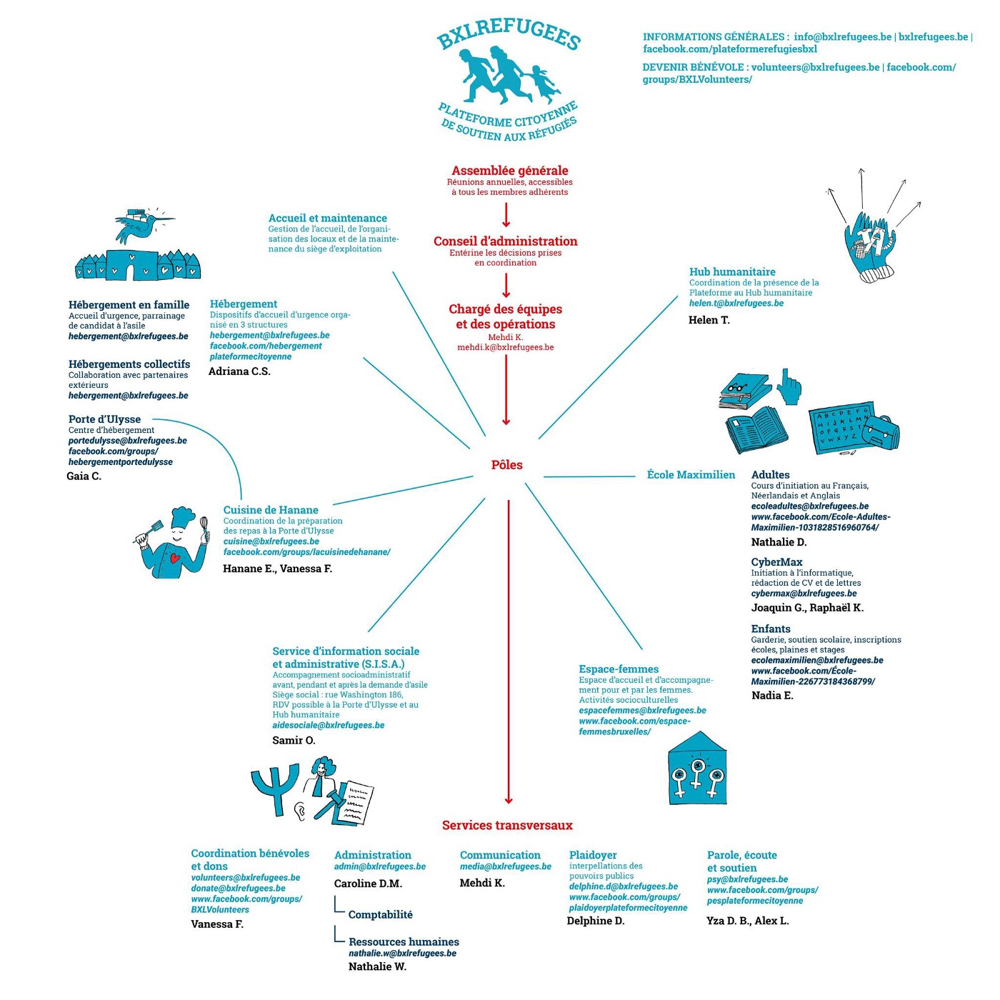

### AYS DAILY DIGEST 7/1/2019: 18th day of agony on the Mediterranean Sea

_One baby died in a refugee camp in Lebanon // One young man died in Moria camp // Condition in the camps in Bosnia so desperate that people choose rather to walk a very dangerous route in the winter // 49 people are still out at sea with no help // People are still being sold as slaves in Libya //_

Camp Malakasa, near Athens\. By Giorgos Moutafis
### Feature

**It is the 18th day since 49 people have been blocked on two rescue boats** \(operated by two German NGOs — Sea\-Watch 3 and Sea\-Eyes’\) close to Malta\. None of the European countries, so far, have agreed to accept the boats with people who are in desperate need of help\.

■■■■■■■■■■■■■■ 
> **[Sea-Watch International](https://twitter.com/seawatch_intl) @ Twitter Says:** 

> > 17th day at sea.
On board of #SeaWatch we are reporting episodes of people refusing food. We fear that their psychological and health status may deteriorate significantly. We cannot believe that all this is happening a few miles from the European coasts. https://t.co/t2sr3po7ol 

> **Tweeted at [2019-01-07 13:13:10](https://twitter.com/seawatch_intl/status/1082263878434734080).** 

■■■■■■■■■■■■■■ 

According to the latest available info, one of the ships received supplies and support after they sent the message that the living conditions were becoming dangerous, with people suffering from severe seasickness due to bed weather and post\-traumatic stress disorder\.

Last week, Malta permitted the boats to approach their coast to shelter from a storm but refused to let the people disembark\. Italy and Spain are also denying access to their ports, but several cities around Europe offered to take the people in, including Napoli, Palermo, Livorno, Berlin, Bremen, Hamburg, Marburg, Heidelberg and Naples\.

Meanwhile, the Alternattiva Demokratika and European Greens candidate Ska Keller urged the EU Member States to take immediate action and find a solution for the people aboard the two rescue vessels\. AD Chairperson Carmel Cacopardo insisted that it is unacceptable that those who flee seeking asylum are left at sea\.

In Portugal, a group of people initiated a [petition](https://secure.avaaz.org/en/community_petitions/Portuguese_Minister_of_Internal_Administration_We_demand_a_Safe_Port_and_Shelter_for_the_49_refugees_rescued_by_SeaWatch/?axxHkcb&fbclid=IwAR04ptE47sfJrPZ9Znf-7DpAcqFpjqc_0qMnHDn9wg4paXXwNDAiC0EQVKc) demanding that their government offer a safe port and shelter to the people on board these two boats\.

_“Let’s hold our governments accountable for their lack of action to ensure Human Rights\. It is not the first time this is happening and it will certainly not be the last if we don’t raise our voices to protect our fundamental human rights\. These are our rights\. This is our problem\.”_
### Morocco

In Nador, the authorities continue with pressure and criminalization of people on the move\. **On Monday, [as AMDH Nador reports](https://www.facebook.com/AmdhNador/posts/2250923855119877?__xts__%5B0%5D=68.ARARlu8DuPaX0_grE0YXt6HxmWeUxO-f7ZLg2rpq2Z_hCENtq1ukIJcgUSxOOXh4GP6fEoyMr1Kwt9_GRmGIEctTjmy56tXGyUooVJt1GlDrug3PdIvFrDpN3KIVVFzPlBE31_G9eOI6F-QkQsmVIjR5CqU_3hKogFD4VqKTLm5MMdluT1PpeKzLxgQeA9JB7IFiCfbSSps0W1O3-Hi07q4e-ntJ5w4DKZjDXxBJ1BjeIyY2LzE1NhFhTulNPXf2uggJqtbTvWDBOMfY7U4KBes49INmR2RtJaMAJ9VuRNDGZA0NF9ZStdsHElQhu98fvSWIFbA9EjCsQD2l40WtNb7zXsnf&__tn__=-R) , nearly 110 sub\-Saharan people, including women and children were, arrested** in Blessed Ensar and Arekmane\. At the same time, authorities attacked a house in the Arid district, arresting more people\.

By AMDH
### Libya

Giulia Tranchina, a human rights lawyer specialized in asylum and immigration law in Libya, wrote about **30 Eritreans, who together with other 300 people had been taken from the sea to the Al Khoms detention centre, and then on Monday were forcibly taken from the centre and sold** to a group of Libyan traffickers and slave masters, as we feared\.

> “A group of men were let by the Libyan police into the centre, took 30 Eritrean refugees out and sold them to the traffickers\. They are going to face months or years of further torture for extortion and slavery\. 

> If their families, already ruined by having been forced to pay previous ransom money whilst their dear ones were being tortured on the phone, have used up all their resources, the refugees will be suffering unspeakable atrocities or be killed\.” 

Activist and human rights defenders in the region are sending an urgent appeal to the [UN Refugee Agency](https://medium.com/u/75f2bdd89854) in Libya asking them to attend Al Khoms “without further delay” and register the Eritreans who have not yet been sold\!

This is a video from two days ago from one of the hangars of Al Khoms, with a person begging “please brothers help us, it is not possible to live like this\. It is almost better to die\.” Other words are translated into English by the second refugee speaking\.
### Lebanon

**A baby died on Sunday night at the Arsal camp in the Baalbek\.** There are five more children in hospital at the moment\.

The camps, close to the Syrian border, is completely covered in snow\. There are 250 tents housing families with between two and five children\.

_“The encampment receives little help from NGOs\. The UN gave some oil money a month ago but some families received nothing and now many families are without fuel and they are collecting car wheels to burn\.”_

In order for volunteers to provide basic help, they need help\. You can donate by credit card using the [link](https://paypal.me/bluedoorglobal) , or via the PayPal home page using the ‘friends and family’ option and the email [bluedoorglobal@gmail\.com](mailto:bluedoorglobal@gmail.com)
### Sea

On 7 January, **about 260 people were rescued by Spain, and over 200 others were returned to Morocco by Moroccan forces\.**

In the first week of the new year, two distress cases reached the [Alarm Phone](https://www.facebook.com/.../a.15261.../2289725441301686/...) in the Western Mediterranean region, both on 6 January\.
### Greece

**A 24\-year\-old Cameroonian was [found dead in his tent](http://www.efsyn.gr/arthro/nekros-24hronos-ston-prosfygiko-kataylismo-tis-morias) in Moria** on Tuesday\. The cause of death is still not public, but many are afraid he died from exposure to the severe cold and precarious living conditions\.

![“The trip to Lesvos \(Greece\) Cost: From 600 to 800 dollars per person\. Time: From 1:30 to 5 hours depending on the state of the sea and if you take the right path\. From 50 to 80 people go in these boats\. Women and children in the middle, the men around\. The water goes under and the boat fills with water\. Sometimes the engine also stops and drifts\. Luck will tell if they land, they are caught by the Turkish coast guard and returned to Turkey or drowned\. Most people who cross don’t know to swim”\. By [Fotomovimento 15](https://www.facebook.com/Fotomovimiento.org/) M](assets/7338728a6e12/1*gT6qJLzog2ZoWhp0lNsVDA.jpeg)

“The trip to Lesvos \(Greece\) Cost: From 600 to 800 dollars per person\. Time: From 1:30 to 5 hours depending on the state of the sea and if you take the right path\. From 50 to 80 people go in these boats\. Women and children in the middle, the men around\. The water goes under and the boat fills with water\. Sometimes the engine also stops and drifts\. Luck will tell if they land, they are caught by the Turkish coast guard and returned to Turkey or drowned\. Most people who cross don’t know to swim”\. By [Fotomovimento 15](https://www.facebook.com/Fotomovimiento.org/) M

This is an extremely difficult situation for people living in the camp on Samos\. Volunteer Kayra Martinez visited the island and the camp\.

_“As I walked through the camp, and around the area, I tried for one second to imagine how hard it must be, day in and day out\. How do they get their strength? How do they survive? How can they be strong for their children?_

_Each person has their own way of coping\. I saw a man two kilometres away from the camp, wearing pink flip\-flops, but he had a soccer ball, and was happy for that moment, in his own world\. At 7:30 am, I saw a man on top of a hill, praying\._

_If you looked down, all you could see were rows and rows of tents\. I saw children playing, but they had on plastic sandals with no socks and it was 4C°\. While we were distributing clothes, I heard singing coming from the top of the hill\. They had gathered together to sing their hearts out\. On the other side, a big group had gathered to pray\. This is the human spirit, which is stronger than anything in the world\. Tonight I can take a bit of comfort knowing that those people won’t give up, because they know we’re advocating for them\. And we won’t give up\.”_

If you can volunteer, [please contac](https://m.facebook.com/Refugee4Refugees/) t\.

**In the first week of 2019, 301 people arrived on the Aegean islands, according to the UNHCR\.**

At the moment, at least 14,680 people are stranded on the islands, and 29 per cent are children of whom more than six out of 10 are younger than 12 years old\. Approximately 20% of the children, mainly Afghan and Syrian, are unaccompanied or separated\.

Living conditions are life\-threatening in many camps on the mainland, too\. People forced to live in Diavata camp, close to Thessaloniki, [went out into the streets on Monday to protest](https://greece.greekreporter.com/2019/01/07/two-injured-in-refugee-protest-at-diavata-camp/amp/?fbclid=IwAR2dI82b4Bjnneopq8Ke1xv7oPuJK0GQEOGh7K8_t-2qyY9BtFR6MQBnMyc) \.

The camp is overcrowded with over 1,410 people living there \(the maximum capacity is about 700\) \. Of those, 700 live in containers which have been made into small houses, a further 300 are staying in large communal buildings in the camp, and about 400 live in tents\. For those living in the tents, the situation is the most difficult with temperature below freezing for days now and the area covered in snow for several days\.

InterVolve is looking for a volunteer for the Irida Women’s Center in Thessaloniki\! They are looking for an assistant to our project manager\.

If you are interested, please e\-mail us at [info@intervolvegr\.com](mailto:info@intervolvegr.com) with your CV\.
### Bosnia

**Despite very bad weather, people keep arriving but also trying to leave Bosnia\.** In order to come or to leave, they have to walk over snow\-covered mountains\. Many of the people AYS volunteers have been in touch with are aware of the dangers along the road, but they say they are ready to take the risk, having in mind the poor living conditions in the IOM\-run camps in Bosnia\.

Just one of the camps is Miral in Velika Kladusa where people \(over 600\) complain about the negligence of those responsible\. The poor living conditions are often the cause of tensions and conflicts\. Some of the people AYS spoke with, told us they cannot sleep since they have to be alert to what is happening around them at all times\.

Mital camp\. Photo by Zarka Radoja\.

The Bosnian government is doing even less than the international organizations present in the country \(in the first place the IOM and UNHCR\), who are in charge of the entire situation and the donations of funds \(over €7,000,000 just from the EU\) \.

In the meantime, more and more people are being arrested while trying to cross to the EU with fake documents\. Last week people were arrested at various border crossings with Bulgarian, Spanish and Czech documents\.
### Belgium

[An appeal for the help](https://www.facebook.com/groups/BXLVolunteers/permalink/804404256570309/?__xts__[0]=68.ARBse9MOB4S-KheduV5j17bAxmCnZuPpeqCgB0EDOogaKa-CD5XcmHvvzhdnZNB327RE5S7R9L6IerdRia46xA8uRMdEwZbtovdhx43o0gkVym-2EDBERTWwOVH9ZsNo27AwI2iZR2h1wW9eAXjFDc3V6du3LXNpT6eFyJzxB3x02SwZvwulVZCxR5b84Jh_givVg1-nJAqv0Qr0d2qXuELbBNnvtS3eeM0KLN9SwYMfSg0&__tn__=-UC-R) and a call for volunteers is coming from Brussels, too\.

### Germany

As we announced earlier, on Sunday groups of people were deported to Afghanistan\. According to the Afghanistan Migrants Advice & Support Organization, 36 asylum seekers have arrived in Kabul\.
### UK

People are stilling finding ways to cross from France to the UK by boat\. **On Monday, [one person was arrested](https://news-sky-com.cdn.ampproject.org/v/s/news.sky.com/story/amp/five-migrants-in-police-care-after-empty-boat-found-on-kent-beach-11601168?usqp=mq331AQECAFYAQ%3D%3D&fbclid=IwAR1YDDjP71WQsgXrAB48Kyyi_s0ecwHTQJg3E3gsQAQiSdAzuXulQ1xOASA&amp_js_v=0.1#aoh=15468913326532&amp_ct=1546891611932&referrer=https%3A%2F%2Fwww.google.com&amp_tf=From%20%251%24s&ampshare=https%3A%2F%2Fnews.sky.com%2Fstory%2Ffive-migrants-in-police-care-after-empty-boat-found-on-kent-beach-11601168) after eight people were found in Kent when an unattended inflatable boat was spotted on a beach\.**

People were found in Lydd, near the place where the boat was discovered on the coastline at Dungeness\. One person was taken to the hospital, while the others were detained by border officials\.

The man arrested by police was found by officers during a search near the boat and is being held on suspicion of facilitating entry into the UK\.
### BALKAN WEATHER

MONTENEGRO

Increasingly overcast during the afternoon, snow late in the day and over night, rain along the coast, possibly sleet in places\. During the morning a strong inland frost, in the north and in lowlands there may be fog or low clouds\. Wind later in the day, locally moderate to gusting, from the south and east\. Low temperatures from \-17 to 0 C° and highs, \-5 to 7C°\.

SERBIA

Predominantly clear and very cold with moderate to strong frost in the morning\. During the course of the day gradually more cloud cover from the northwest with light snow\. In the north and west snow turning to rain that may freeze on contact with the ground\. In the east and southeast mostly dry\. Winds light to moderate, from the southeast, stronger in the mountains\. Low temperatures from \-18 to \-8C° and highs, \-5 to 3C°\.

BH

During the morning in Bosnia moderate to predominant cloud cover, in Herzegovina mainly clear\. Increasingly cloudy during the day\. Snow in most regions in the evening, local rain\. Lowest temperatures from \-12 to \-6C° and highs from \-3 to 5C°\.

CROATIA

Snow, rain and wind in most parts of the country, with temperatures ranging from \-3 to 7C° along the coast\.
### Israel

**The Israeli government has issued a notice for thousands of people from African to leave the country or face imprisonment\.** The Israeli government will offer migrants a $3,500 payment and a free air ticket home or to “third countries” which rights groups have identified as Rwanda and Uganda\.

If they do not leave, the Israeli authorities have threatened to start jailing them from April\.

There are about 38,000 persons living as undocumented migrants in Israel, mostly from Eritrea and Sudan\.

Groups including the Centre for Refugees and Migrants, Amnesty International Israel, and the Association for Civil Rights in Israel have signed a letter demanding the expulsions be stopped\. An investigation by Hotline for Refugees and Migrants, an NGO based in Israel, found that hundreds of African asylum seekers who were deported “willingly” from Israel died in torture camps in Libya or drowned at sea while trying to reach Europe\.

**We strive to echo correct news from the ground through collaboration and fairness\.**

**Every effort has been made to credit organizations and individuals with regard to the supply of information, video, and photo material \(in cases where the source wanted to be accredited\) \. Please notify us regarding corrections\.**

**If there’s anything you want to share or comment, contact us through Facebook or write to: areyousyrious@gmail\.com**

_Converted [Medium Post](https://medium.com/are-you-syrious/ays-daily-digest-7-1-2019-18th-days-of-agony-in-the-mediterranean-sea-7338728a6e12) by [ZMediumToMarkdown](https://github.com/ZhgChgLi/ZMediumToMarkdown)._
