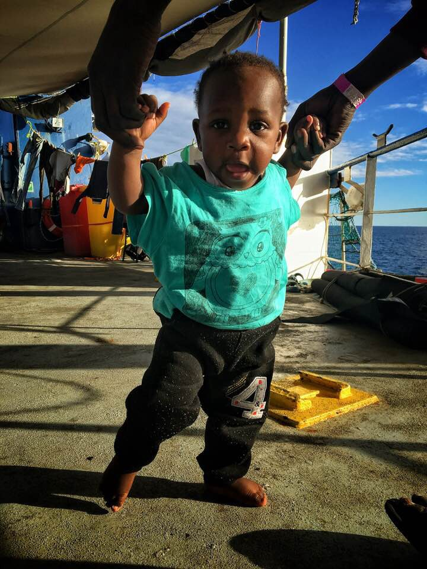

### AYS Daily Digest 8/1/19 — Winter Kills in the Aegean Camps
#### Refugees still stuck on Sea\-Watch 3// Pakistani man dies on Rhodes//Police brutality in Petrou Ralli// Elderly woman living in tent camp dies in Reims//Deportations in Germany// and more…

![Vial camp on Chios, 8/1/19\. Photo Credit: Heidi Mogstad\. “In the tent to the left of the picture lives a newly arrived family from Syria\. The father of the family has only one leg and was limping around on crutches when I met him\. While naturally distressed about the situation, he nevertheless smiled to us and joked with his beautiful 3 years old daughter, who had joined us making bracelets\. His wife is nearly 9
months pregnant, he told us, so he wanted to ask the authorities if the family could move into a container\. ‘Can you help me?’ he asked me\. Shameful, I had to tell him no, but we promised to save a bag of toiletries for the family and a fellow volunteer decided to look for a twin stroller\.”](assets/b1ec56f70b14/1*QGsONeccrZvTt9S8T_p7sg.jpeg)

Vial camp on Chios, 8/1/19\. Photo Credit: Heidi Mogstad\. “In the tent to the left of the picture lives a newly arrived family from Syria\. The father of the family has only one leg and was limping around on crutches when I met him\. While naturally distressed about the situation, he nevertheless smiled to us and joked with his beautiful 3 years old daughter, who had joined us making bracelets\. His wife is nearly 9
months pregnant, he told us, so he wanted to ask the authorities if the family could move into a container\. ‘Can you help me?’ he asked me\. Shameful, I had to tell him no, but we promised to save a bag of toiletries for the family and a fellow volunteer decided to look for a twin stroller\.”
#### Feature

A medical team working on Chios has put out a “yellow alert” because of the freezing cold tonight\. The team is mobilizing for possible emergencies as a wave of “polar cold” hits the island, with many families having only a thin tent to protect them from the elements\.

Volunteers working in the camp report people begging for extra sheets and blankets because they are sleeping on plastic tarps\. Even families with young children and pregnant women are not being given accomodation\.

Life is similarly precarious in the Moria camp on Lesbos, where a young Cameroonian man died two days ago\. His body is currently undergoing an autopsy to determine the cause of death\. Will the Greek authorities find some pre\-existing medical condition to blame the death on?

■■■■■■■■■■■■■■ 
> **[RSA](https://twitter.com/rspaegean) @ Twitter Says:** 

> > This how people keep warm #Moria refugee camp tonight. Families in the Olive Grove have no electricity, it’s freezing and children are sick #opentheislands #refugeesGR https://t.co/zRSiXMQXgv 

> **Tweeted at [2019-01-07 18:47:38](https://twitter.com/rspaegean/status/1082348050159493123).** 

■■■■■■■■■■■■■■ 

](assets/b1ec56f70b14/1*i5yFmnRPHO1Kxstn480XRQ.jpeg)

An Afghan friend who is in the field of Moria: “A week ago we have no electricity, today a boy has died\. In Europe you don’t see us or hear us\. How can it be?” Photo Credit: [Fotomovimiento](https://www.facebook.com/Fotomovimiento.org/posts/2132200566847513)

On Samos, thousands of people are also sleeping in flimsy tents, exposed to the freezing cold\. Not a single additional indoor accomodation has been found for the residents of the camp for the winter\. There seems to be no space for them, despite the fact that there are over 600 hotels on the island, most of which are totally empty during the winter months\.
### Sea

Photo Credit: Brendan Woodhouse\. “Today a baby is learning to walk on the Seawatch 3\. She should be learning to walk on land\. End her incarceration on the sea now\. Open the ports\!” \(Photo taken and used with permission from her mother\. \)

 \.](assets/b1ec56f70b14/1*HcaiWzq7-yJevGkRw8HhNQ.jpeg)

A family stuck aboard the Sea\-Watch 3\. Photo Credit: [Federico Scoppa](https://federicoscoppa.photoshelter.com/index) \.
#### Day 18 at sea for the Sea\-Watch 3

Two NGO ships, the Sea\-Watch 3 and the Sea\-Eye are still waiting to be granted a port of safety for the 49 refugees on board\. No EU country has yet stepped up to accept the people stranded on the ships\. A number of European cities have offered to accmodate the people, but this is more a gesture of solidarity as cities do not have this authority\. As one of the [volunteers aboard the Sea\-Watch 3 stated](https://www.facebook.com/seawatchprojekt/videos/528990027620545/) ,

_“No port in Europe, no country in Europe is open to us\. Can you imagine if this boat was full of white people? Neither can I, it just wouldn’t happen\.”_

■■■■■■■■■■■■■■ 
> **[MSF Sea](https://twitter.com/MSF_Sea) @ Twitter Says:** 

> > Day 18: NGO ships #SeaWatch and #SeaEye are still waiting to be granted a safe port to disembark 49 people rescued at sea as required by international law. This unnecessary wait is detrimental to the physical and mental health of survivors, and impedes further rescue operations. 

> **Tweeted at [2019-01-08 14:08:03](https://twitter.com/msf_sea/status/1082640077237481472).** 

■■■■■■■■■■■■■■ 

■■■■■■■■■■■■■■ 
> **[MISSION LIFELINE](https://twitter.com/SEENOTRETTUNG) @ Twitter Says:** 

> > The stranded ships are in sight! We bring them fresh fruit, vegetables, drinking water, washing products, energy bars and even a book to help pass the time until a solution arrives. We cannot stand by while the helpers are punished. https://t.co/qZdCvcRNek 

> **Tweeted at [2019-01-08 16:19:21](https://twitter.com/seenotrettung/status/1082673118714515462).** 

■■■■■■■■■■■■■■ 

Today [175 people arrived](https://twitter.com/alzoubeidi/status/1082750123078287365?fbclid=IwAR23X4Yg-TeK6BVyqb2nIkD-ry0yyrD1pjRwNi-ktDIAd2tKF6t33eqoyik) in Spain from Morocco by sea\.
### Greece
#### Pakistani man dies of possible carbon monoxide poising in Rhodes

A young man from Pakistan was found dead living in a squatted, cold house today\. The cause of death is suspected to be carbon monoxide poisoning, likely from burning something to keep himself warm, [according to the No Borders network](https://www.facebook.com/nobordersnetwork/posts/2080936225307592) \. Two other people who were in the house with him are currently in the hospital in serious condition\.
#### Truck driver charged in Diavata camp protest assault case

A court in Thessaloniki has charged a Greek truck driver with assault following a confrontation at the Diavata refugee camp outside Thessaloniki on Monday\. The road was being blocked by refugees who were protesting the over\-crowded and freezing conditions in the camp\. The driver got out and assaulted on of the protestors, who had to be hospitalized\. The driver has filed a countersuit against the person he attacked, which resulted in the arrest of the victim and three other refugees, [according to Greek outlets](http://www.ekathimerini.com/236361/article/ekathimerini/news/truck-driver-charged-over-hitting-protesting-refugee-files-countersuit?fbclid=IwAR1hkGk27uikBNwWB6n9LKGmzPgbxBSvs799KyxkUTTaocVxcv4DHjJmYAQ) \.
#### Allegations of police brutality at Petrou Ralli detention center

The guards in the Petrou Ralli detention center in Greece have been accused of using brutality and sexual violence in retaliation against the prisoners\. [According to a migrant woman who was detained in the facility,](https://athens.indymedia.org/post/1594404/?fbclid=IwAR03ah0MdSWZtNmLJGw2ym7G2htt6p6RDgniWsHNVQsN04BnNE67-r3mub8) a guard in the facility was beaten up by prisoners on 20 November\. After the incident, all of the male prisoners were taken one by one to a seperate building where they were severely beaten\. The two people accused of attacking the guard were sodomized by the officers\.

InterVolve is looking for volunteers to help with their women’s center in Thessaloniki\. For volunteers who can commit full time for a minimum of 3 months, the group can offer accommodation within walking distance of the center\. If interested, e\-mail info@intervolvegr\.com with your CV\.

ShowerPower, group which provides a safe space for women living in the Moria camp to shower is [looking for volunteers starting in February](https://www.facebook.com/groups/informationpointforlesvosvolunteers/permalink/1035259473348166/) \.
### Croatia

The volunteer group [borders: none](https://www.facebook.com/pg/bordersnone/posts/?ref=page_internal) is fundraising for their project which teaches coding and websigte development to refugees in Croatia\. Support them [here\.](https://www.indiegogo.com/projects/coding-school-for-refugees--2#/)
### France

An 80 year old refugee woman named Jamila died last night in a tent in a camp in Reims, [according to volunteers in the city](https://www.facebook.com/photo.php?fbid=2155739741177248&set=gm.2205856686408079&type=3&theater) \. She had been living in the camp in inhuman conditions for over a month, said the volunteers who reported her death\. There has been no word on the cause of her death, although exposure to the elements and a lack of medical care are likely to have played a role\.
### Germany
#### 36 people deported to Afghanistan

Yesterday at 9pm 36 Afghani people were been deported from Munich to Kabul\.23 of them had been previously living in Bavaria\. Among the total group, 12 were sentenced criminals\. Baden\-Württemberg, Northrhine\-Westphalia, Hessen, Rheinland\-Palatine, Saarland, Saxony\-Anhalt and Schleswig\-Holstein participated in the deportation\.

**We are an entirely volunteer run media team, and we rely on our supporters to share our news\. So please share, and never forget to ACT\!**

**We strive to echo correct news from the ground through collaboration and fairness\.**

**Every effort has been made to credit organizations and individuals with regard to the supply of information, video, and photo material \(in cases where the source wanted to be accredited\) \. Please notify us regarding corrections\.**

**If there’s anything you want to share or comment, contact us through Facebook or write to: areyousyrious@gmail\.com**

_Converted [Medium Post](https://medium.com/are-you-syrious/ays-daily-digest-8-1-19-winter-kills-in-the-aegean-camps-b1ec56f70b14) by [ZMediumToMarkdown](https://github.com/ZhgChgLi/ZMediumToMarkdown)._
