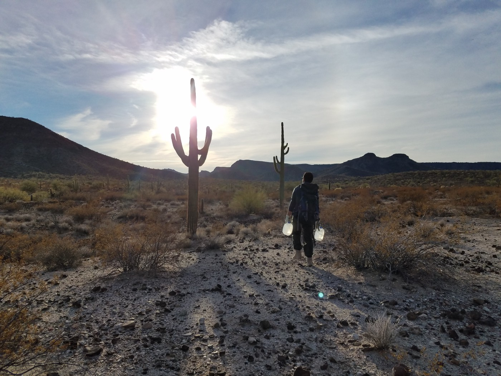
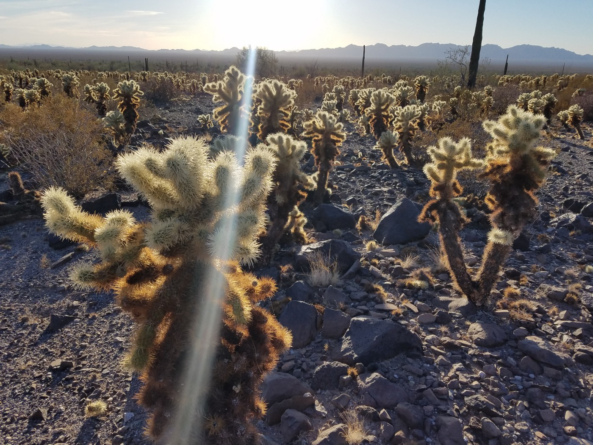
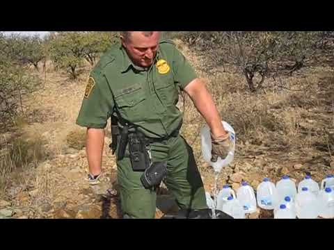
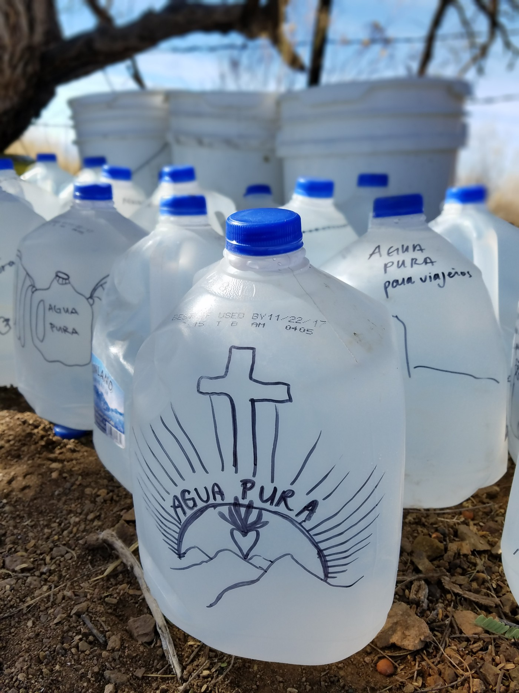
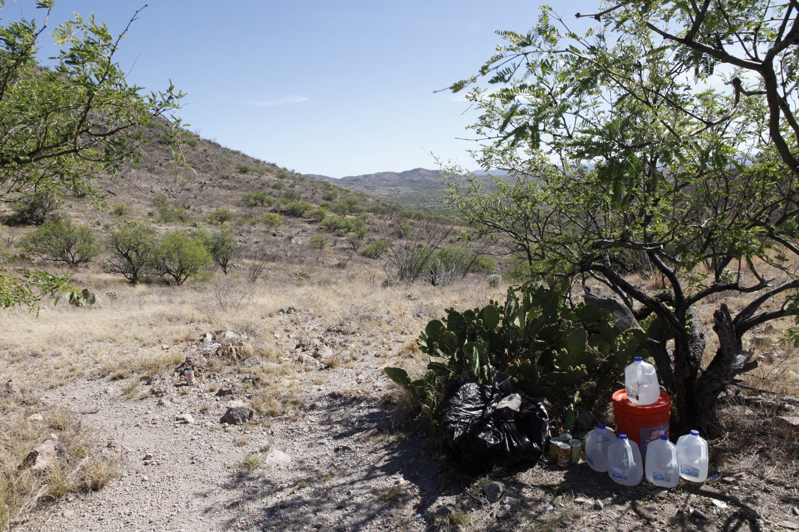
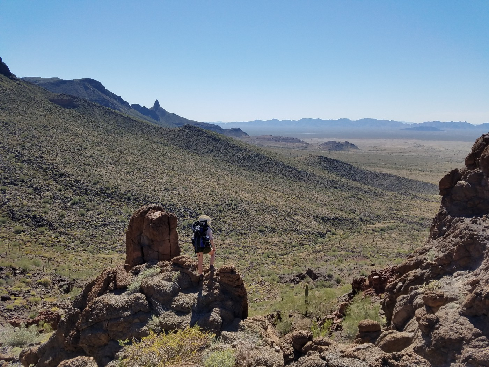
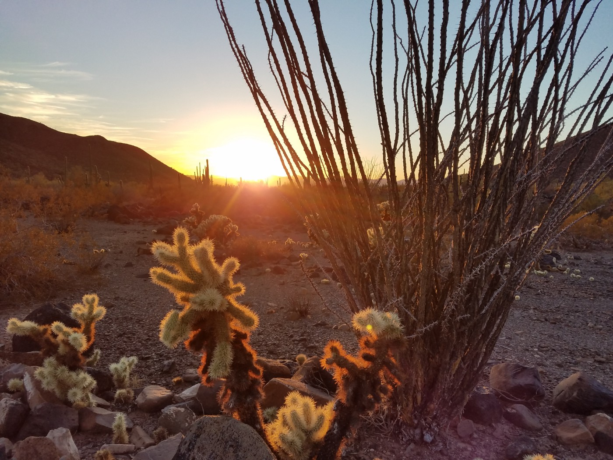
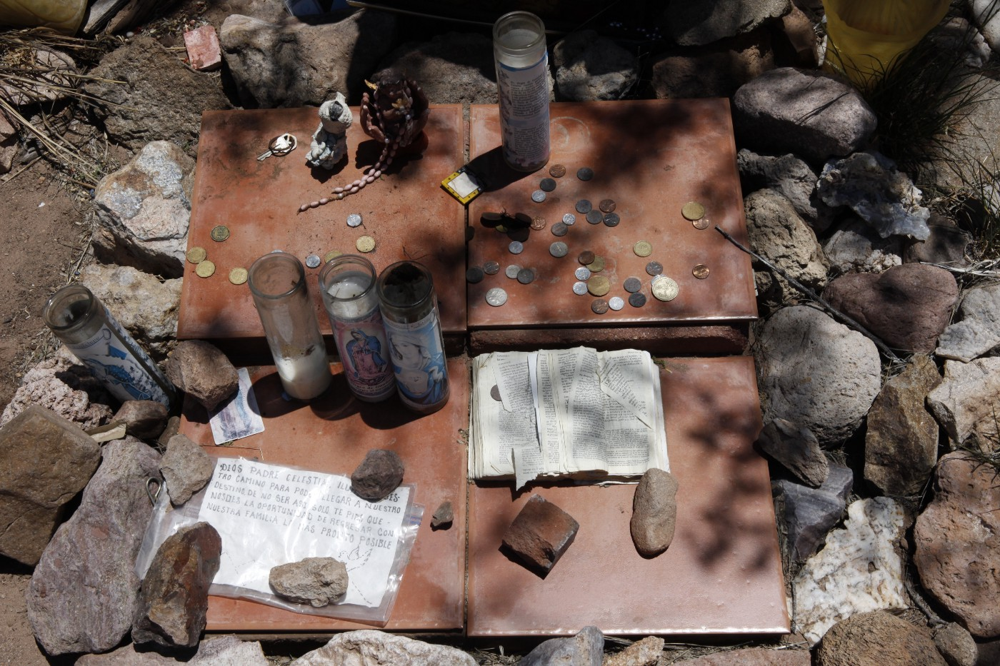

### AYS SPECIAL — US\-MEXICO BORDER: Violence, Seen and Unseen

_The Trump Administration wants a wall across the entire length of the border\. The U\.S\. Border Patrol knows better\. They have a way to stop border crossers that’s cheaper, more effective — and far more deadly\._

The Sonoran Desert, a vast expanse of hostile terrain that many migrants must cross in order to reach the United States\. Photo Credit: Carrot Quinn

2018 was a year of high visibility for the human toll of U\.S\. migration policy\.

In early December, images of children fleeing, terrified, as Border Patrol agents dispelled canisters of tear gas burned themselves onto our collective retinas\. This summer, the entire world watched in shock as children were forcibly separated from their parents, penned up in “baby cages,” and brought into court alone\. We saw videos of children so traumatized that they didn’t recognize their mothers when they were finally reunited\. The impact of their forced separation was etched in the children’s confused and terrified faces; it can never be undone\.

Now, as the U\.S\. government shutdown drags on into a new year and becomes the longest of its kind in the history of this country, both sides remain at an impasse over the Wall — in its most recent iteration, a “steel barrier” that will stretch the length of the United States\-Mexico border and cost over 5 billion dollars\. Since December 22, 800,000 federal employees have gone without pay; ironically, airport security measures are being bypassed for lack of TSA staff\.

On January 8, Trump addressed the nation, trying to make a case for his pet project, an early campaign promise that he has already watered down \(there is no longer any illusion that Mexico will be made to pay for the Wall\) \.

It’s not difficult to figure out why Trump is so attached to the idea of the Wall, even as it has become a political nightmare\. The Wall is a formidable concretization of every dogwhistle and racist cliché about immigrants that he has personally employed or tacitly encouraged\. It is not subtle, complex, or bureaucratic, like so much of U\.S\. migration policy\. It is expensive, it is obvious, and it is big\.

The arid, cactus\-filled terrain of the Sonoran Desert\. Photo Credit: Carrot Quinn

But the ongoing debate over the Wall — which congressional Democrats have already lost, given that their first reaction was to haggle over its cost, rather than taking a moral or practical stand against it — obscures the fact that it is little more than a political symbol, a metaphor for “border security\.” There is already a physical barrier where it matters\.

Today, crossings are nearly at a [20\-year low](https://www.forbes.com/sites/stuartanderson/2018/06/25/there-is-no-crisis-at-the-border-and-dhs-stats-prove-it/#d2cd867112aa) \. On December 31, 2018 Border Patrol itself [admitted](https://twitter.com/jacobsoboroff/status/1079771466516680704) to MSNBC reporter Jacob Soboroff: “We don’t have any intentions of fencing off the entire SW border\. It’s not necessary\.”

The U\.S\. Border Patrol knows better than anyone how lethal the desert can be\.

Like the E\.U, the U\.S\. weaponizes its natural borders\. In 1994, after NAFTA drove corn prices down in Mexico, making it impossible for ordinary Mexicans to make a living farming and sending people north like never before, the U\.S\. Border Patrol enacted a policy called “Prevention through Deterrence\.” The goal: to make border crossings in urban areas all but impossible, driving people into the desert\. Overnight, [entire cities](https://www.nytimes.com/2018/02/05/travel/nogales-arizona-mexico-border.html) were split in two, fences erected that divided families with different sets of documents\.

For a person from Mexico or Central America, to claim asylum in the United States is now a physically grueling task, an odyssey so extreme that it would seem to be something from a video game\. Border crossers face boiling hot days, nights of excruciating cold, wild animals, unexpected checkpoints, rocky terrain, relentless sun, thorns that tear their hands and feet, helicopters that monitor their movement, and rogue bands of [border vigilantes](https://www.motherjones.com/politics/2016/10/undercover-border-militia-immigration-bauer/) , armed to the teeth\. One area that many border crossers are pushed into is an [active bombing range](https://en.wikipedia.org/wiki/Barry_M._Goldwater_Air_Force_Range) run by the U\.S\. army\.

In 2004, ten years after Prevention Through Deterrence, a Migration Policy Report [found that](https://www.migrationpolicy.org/article/evaluating-enhanced-us-border-enforcement) “most migrant deaths in the last 10 years have been due to “environmental causes:” freezing to death in the mountains of San Diego County, succumbing to dehydration or heat stroke in the deserts of California and Arizona, or being asphyxiated in sealed trucks and railroad cars as migrants are being transported away from the border area\. There has also been sharp increase in deaths due to drowning\.”

**The Sonoran and Chihuahuan deserts and the Mediterranean are the biggest unmarked graves in the entire world\.** Unsurprisingly, their true body count is unknown; there are no exact statistics\. A mapping project called ‘ [The List’](https://www.theguardian.com/world/2018/jun/20/the-list-34361-men-women-and-children-who-perished-trying-to-reach-europe-world-refugee-day) has documented the deaths of some 34,000 border crossers trying to find safety in the E\.U between 1993 and 2018; the majority of these people likely perished in the Mediterranean, and this estimate only includes reported deaths\.

Meanwhile, it is [estimated](http://www.thedisappearedreport.org/uploads/8/3/5/1/83515082/disappeared--introduction.pdf) that well over 8,600 people have died crossing the U\.S\. \-Mexico border since the early 1990s\. At least [376](https://missingmigrants.iom.int/region/americas?region=1422) people have died on the border in 2018 alone, one for each day of the year\.

Nobody killed those people — the scorching desert did it; the waves of the rolling sea\. Never mind that U\.S\. border agents [routinely overturn water jugs](http://www.thedisappearedreport.org/uploads/8/3/5/1/83515082/disappeared_report_part_2.pdf) that solidarity organizations leave in the desert for migrants passing through, or that various E\.U\. countries have prevented humanitarian rescue operations from doing their work in the Mediterranean and its surrounding seas, going so far as to refuse to let boats dock at their port\.

Notably _unlike_ Europe, there are no international organizations on the ground at the US\-Mexico border\. The UN is not there, IOM is not there, MSF is not there\.

It’s hard enough getting European countries to abide by the requests of the UN — imagine the US, which increasingly considers itself above international [organizations](https://foreignpolicy.com/2017/10/11/u-s-to-pull-out-of-unesco-again/) and [agreements](https://www.theatlantic.com/science/archive/2017/11/syria-is-joining-the-paris-agreement-now-what/545261/) , allowing an international watchdog in to monitor the abuses of its border agents\.

However, there are a number of small, dedicated solidarity groups who are committed to providing basic aid and exposing the injustices of the U\.S\. border patrol\. Groups like [RAICES](https://www.raicestexas.org/) , based in San Antonio, and [Texas RioGrande Legal Aid](http://www.trla.org/) provide legal support to asylum seekers\. Tucson\-based [Colibrí Center for Human Rights](http://www.colibricenter.org/) and the [South Texas Human Rights Center](https://southtexashumanrights.org/) search for missing border crossers and compile exhaustive lists of the dead, putting names and numbers to each faceless corpse or unmarked grave\.

Operational since 2004, the organization [No More Deaths](http://forms.nomoredeaths.org/en/) offers border crossers basic humanitarian aid throughout the Sonoran Desert in south\-western Arizona; the group is also involved in legal aid and abuse documentation projects\.

“The work No More Deaths does is very simple,” said Elsa,\* a volunteer for the organization since 2015, at a presentation she gave in my hometown recently\. “It’s not radical to feed someone, give someone water, or provide them basic medical care\.” But, she said, because of the “insanely militarized landscape” along the border, basic acts of human kindness become politicized\.

“Clean Water for Travelers\.” Water jugs left for border crossers by No More Deaths\. Photo Credit: Carrot Quinn

Activist groups like Colibrí and No More Deaths are one of the biggest threats to the state’s campaign of deterrence and disappearance\. They make visible the abuses of the state and its agents, and demand change\. And with persistence and dedication, the news media notices, and [amplifies](https://www.theguardian.com/us-news/2016/dec/07/report-us-border-patrol-desert-weapon-immigrants-mexico) [their](https://www.pnj.com/story/opinion/editorials/2014/12/18/editorial-disturbing-trend/20581029/) [message](https://theintercept.com/2018/10/18/border-patrol-no-more-deaths-arrest/) \.

Little surprise that the state punishes them for their solidarity here as surely as it does in Europe, where, this year alone, activists have been detained and prosecuted in Greece, Croatia, France, England, Sweden, and beyond\.

Nine “No More Deaths” volunteers are currently fighting federal charges for their work with the organization: eight members of the “Cabeza Nine” face a six\-month prison sentence and a hefty fine\. The ninth, Scott Warren, is being charged with two felony counts of harboring and one felony count of conspiracy after border agents conducted a raid on a humanitarian aid station in Ajo, Arizona, where he was providing care to two undocumented border crossers\.

Scott’s arrest occurred just hours after No More Deaths released the second installment of their “Disappeared” report, comprehensively documenting routine destruction of water stations and other humanitarian aid supplies by border patrol officers; [internal documents](https://theintercept.com/2018/04/30/were-gonna-take-everyone-border-patrol-targets-prominent-humanitarian-group-as-criminal-organization/) revealed that the agents who arrested him had been surveilling the aid station all morning\. Now, he faces up to 20 years in prison\.

Shade and water — for border crossers, it’s a small desert oasis\. Photo Credit: Amelia Holowaty Krales

During her talk, Elsa noted that though many of the most troubling aspects of US migration policy have been in practice much longer than the current administration, harassment and retaliation campaigns against volunteers have notably increased since Trump took office\. “The relationship has rapidly deteriorated over the past 18 months,” she said\. She warned that the criminalization of aid “could set precedent for the government to go after churches for giving sanctuary” or even more extreme acts of persecution\. Ultimately, even mixed\-immigration\-status families could be targeted, a daughter arrested for harboring her mother in their family home\.

At the end of Elsa’s presentation, a man in the audience raised his hand\. “How far will you go for your beliefs?” he asked Elsa\. “Would you be willing to spend the rest of your life in prison?” This isn’t some pretense of noble sacrifice — in 2018, [this](https://www.lancasterguardian.co.uk/news/history-will-vindicate-us-says-ex-lancaster-uni-student-found-guilty-of-terror-charges-1-9490992?fbclid=IwAR2O7-cCQ1c8fR9HoKsgEBJKHtR8igOJ1DnAry8E_mTH5cSaMvfNiBiqSdk) is the reality that people who try to oppose their country’s campaigns of pervasive, concealed violence towards border crossers are facing\.

The desire to erect a giant wall across the U\.S\. \-Mexico border is consistent with the Trump administration’s general strategy on migration: maintaining all the same pernicious policies that have been in play since the nineties, while ramping up public displays of force and transforming the discourse from coded bureaucratic language to explicitly violent and racist rhetoric **\.**

The Trump administration has been willing to publicly engage in high\-profile tactics with terrible optics–family separation as a deterrence policy, ICE raids on schools and courtrooms, the recent tear\-gas cloud at the border — that the Obama, Bush, and Clinton administrations would not have, though they were happy to quietly deport long\-time U\.S\. residents and send border crossers into the desert to die through Prevention Through Deterrence\.

A No More Deaths volunteer on the lookout\. 9 volunteers face prison time for their activism\. Credit: Carrot Quinn

Though families are often cleaved apart as a byproduct of asylum systems that incentivize smuggling and, under the E\.U\.’s Dublin Regulation, only grant family reunification to children under 18 — leaving a 20\-year\-old son or daughter stranded alone in a peripheral country as the rests of their family is reunited — **an explicit policy of separating parents from their children is unique to the Trump administration** \.

But many of the E\.U\.’s tried\-and\-true border strategies are, not so surprisingly, tactics that the United States embraces with similar levels of zealotry\.

It’s not just Prevention Through Deterrence\. Both before and during the Trump administration, the United States has used [political deals](https://www.law.georgetown.edu/human-rights-institute/wp-content/uploads/sites/7/2017/07/2015-WRC-HRI-Submission-to-IACmHR.pdf) with poorer nations \(agreements with Mexico and Central American nations to limit the flow of asylum seekers, financial support for Mexico’s border enforcers at both its northern and southern borders\), [bureaucratic catch\-22s](https://www.npr.org/2018/11/25/670695100/u-s-closes-major-san-diego-port-of-entry-as-migrants-converge-at-border) \(closing “official ports of entry” and then deeming people who entered through the unofficial ones ineligible for asylum\), and sheer blunt force \(sending thousands of troops to man the border this summer, as though it was not already ridiculously militarized; shooting one teenage boy [over ten times](https://www.nytimes.com/2018/11/21/us/border-patrol-acquitted-involuntary-manslaughter.html) after he threw a rock at border guards\) to shore up its borders\.

Access to asylum is supposedly a [universal right\.](https://www.unhcr.org/3b66c2aa10.html) Anyone can request it\. It doesn’t have to be granted, but it does, at the very least, have to be considered\. And once you’ve lodged an asylum claim, you have rights\. Not that many, but some\. Your story must be reckoned with; you must, at the very least, be heard out\. And you can’t be deported until after this process concludes\.

But if people can’t actually _request_ international protection — whether it’s because they’re stuck in Morocco or Libya \(both countries that have signed border externalization deals with the EU\) or Honduras or Guatemala \(where the U\.S\. has [funded programs](https://www.latimes.com/world/mexico-americas/la-fg-ff-honduras-border-20140709-story.html#page=1) that prevent people from emigrating\), because they’ve been physically shoved back over a borderline by police, or because they can’t get into an asylum office to register their claim — then the U\.S\. and E\.U\. get to continue paying lip\-service to this international human right, while also avoiding responsibility for the very people trying desperately to find asylum within their borders\. It’s a self\-effacing violence, a crime that obscures itself as it’s being committed\.

The desert at sunset\. Photo Credit: Carrot Quinn

It’s not difficult to look away from the bodies of the migrants who drown during their crossing, or die of thirst in an empty desert, because they’re not that easy to see in the first place\. Bodies sink; human flesh decomposes faster under a hot sun\.

The asylum seekers in the much\-discussed “migrant caravan” had a sense of their own visibility\.

They may not have known exactly what conditions awaited them at the border, but they understood instinctively that there is safety — and strength — in numbers\. When people cross the border at random or in a small group, it’s business as usual\. When they do so _en masse_ , it’s a news story\.

Because of their decision to cross together, the violence enacted against the members of the caravan has witnesses\. Those images — children screaming, clouds of teargas — shocked people in the U\.S\. and beyond\. Children’s bodies will always be the site where the brutality of state power and negligence becomes apparent — the image of Alan Kurdi’s tiny body, washed up on a Turkish beach, sparked worldwide awareness of the so\-called refugee crisis on Europe’s shores\.

And yet, visibility doesn’t necessarily translate to meaningful change\. Two years after the viral dissemination of that image, children continue to drown in the Mediterranean\.

A makeshift shrine: prayer candles, coins, a bible, and a note asking god to “illuminate our path in order to arrive at our destination\.” Photo Credit: Amelia Holowaty Krales

Three weeks ago, a seven\-year\-old Guatemalan girl named Jakelin Caal Maquin died in U\.S\. Border Patrol custody in New Mexico\. And on Christmas Eve, another child dead\. Eight years old, Guatemalan as well: Felipe Gomez Alonzo\. Both children had fevers and other symptoms of illness\. Felipe was kept in Border Patrol custody longer than the maximum 72 hours; Jakelin’s father was made a document testifying to his daughter’s health in Spanish, a language he doesn’t fully speak\.

These deaths were reported by every news outlet in the United States, as well as internationally\. But even in the light of day, border enforcement officials are so practiced in the language of denial and self\-absolution that the charges don’t stick\.

“Our system has been pushed to a breaking point by those who seek open borders,” Secretary of Homeland Security Kirstjen Nielsen said in an official [statement](https://www.dhs.gov/news/2018/12/26/secretary-kirstjen-m-nielsen-statement-passing-eight-year-old-guatemalan-child) that located blame for the death of the two children with everyone _but_ U\.S\. border agents\. “Smugglers, traffickers and their own parents put these minors at risk by embarking on the dangerous and arduous journey north… Given the remote locations of their illegal crossing and the lack of resources, it is even more difficult for our personnel to be first responders\.”

Nielsen’s phrasing echoed a statement by the Customs and Border Protection Commissioner, Kevin K\. McAleenan, in [response](https://www.nytimes.com/2018/12/14/us/politics/migrant-girl-dead-border-patrol.html?module=inline) to the first child’s death: “We cannot stress enough the dangers posed by traveling long distances, in crowded transportation, or in the natural elements through remote desert areas without food, water and other supplies,” In both statements, the connection between the desert \(“remote locations”\) and a quarter\-century of U\.S\. border policy is severed, smoothly and silently, under everyone’s nose\.

_\( \*last names have been withheld for the sake of privacy\)_

**_\(By Piper French, AYS Info Team volunteer\)_**

_Correction: an earlier version of this article misstated the number of No More Deaths volunteers who are facing charges\. There are nine volunteers, not 10\. Since publication, a federal judge found four of the “Cabeza Nine” defendants guilty of entering a national wildlife refuge without a permit and leaving humanitarian supplies\._

**We are an entirely volunteer\-run media team, and we rely on our supporters to share our news\. So please share, and never forget to ACT\!**

**We strive to echo correct news from the ground through collaboration and fairness\.**

**Every effort has been made to credit organizations and individuals with regard to the supply of information, video, and photo material \(in cases where the source wanted to be accredited\) \. Please notify us regarding corrections\.**

**If there’s anything you want to share or comment, contact us through Facebook or write to: areyousyrious@gmail\.com**

_Converted [Medium Post](https://medium.com/are-you-syrious/ays-special-us-mexico-border-violence-seen-and-unseen-e6a76dd4831b) by [ZMediumToMarkdown](https://github.com/ZhgChgLi/ZMediumToMarkdown)._
