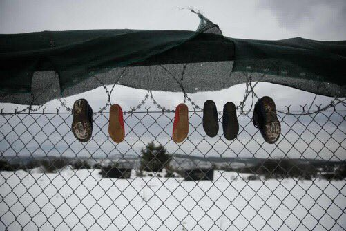
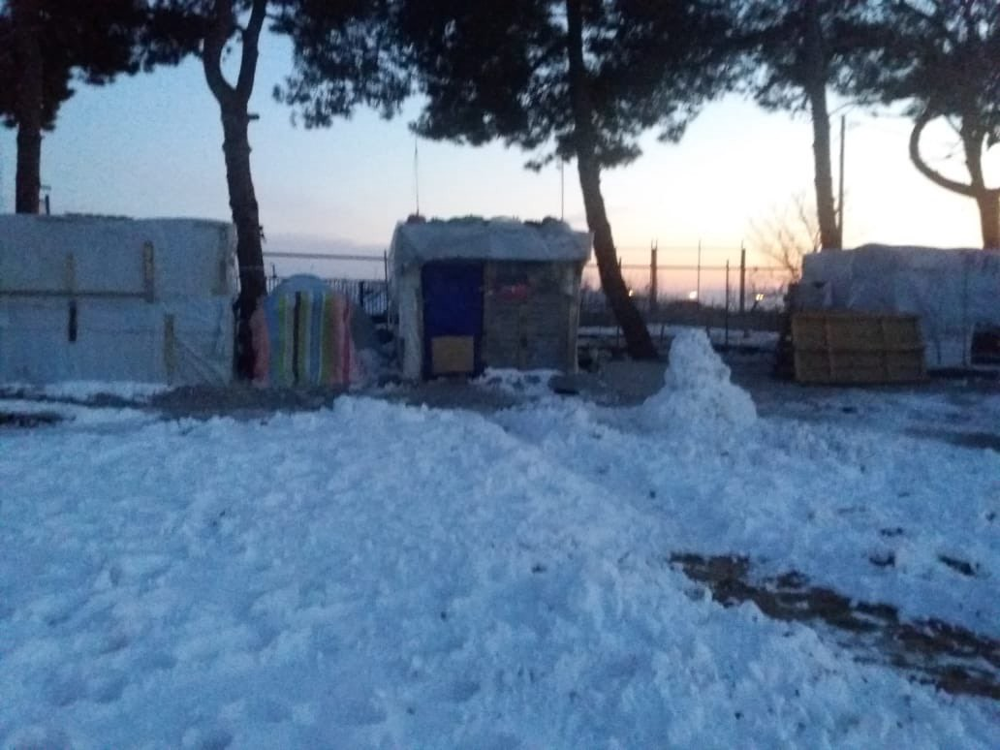
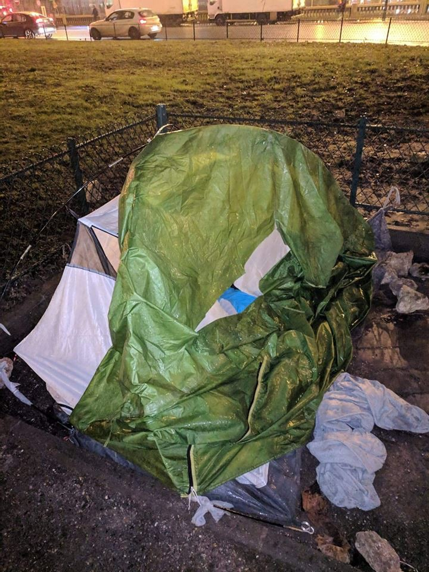

### AYS Weekend Digest 12–13/1/19 Italian Minister of Interior reports fake numbers of those who died at sea in 2018

_Harsh weather conditions continue in Syria, Lebanon, Greece, and the Balkans // 54 people still missing in the Alboran Sea // Increased police intervention in France and Serbia // and more…_

](assets/7bbd4db15025/1*WfsHUWyXsA4LbzM9l7Iarg.png)

With all of the doom and gloom coming from these harsh winter conditions and governments refusing to protect human rights, there is still hope and heartwarming care to be found\. Photo by [Refugee Support Europe](https://www.facebook.com/RefugeeSupportEurope/?tn-str=k*F)
### Feature

Italy’s Interior Minister [Matteo Salvini](https://www.open.online/primo-piano/2019/01/11/news/fact_checking_quanti_migranti_sono_morti_in_mare_nel_2018_secondo_salvini-105238/) reported fake numbers of the people who died in the Central Mediterranean route in 2018\. He wanted to tell the story on television that the number of deaths have drastically decreased, when that is not the truth\.

UNHCR reports that 1276 people went missing or died in the Central Mediterranean in 2018, significantly higher than Salvini’s incomplete data of 23 people\.

Salvini is not glossing over details, **he is lying** \.

No one else should have to die at sea under this political agenda\.
### Syria

In Idlib, at least 11,000 internally displaced persons are at risk of freezing to death with temperatures dropping to \-1C with torrential rain and snow\. Tents and belongings have been swept away in floods and there are dire shortages of supplies to take care of basic needs\. More rain and snow is expected early this week\.

[Save the Children](https://www.theguardian.com/global-development/2019/jan/12/real-risk-of-refugees-freezing-to-death-in-syria-after-rains-destroy-shelters?CMP=Share_iOSApp_Other&fbclid=IwAR2nlmb-D-cnwquJ-ZIlhLmmckry9qfDzSHBymopMu0_vx7bf0PagxEbsec) reports of cases of babies freezing to death last year in similar conditions\. [Violence](https://www.unocha.org/story/syria%E2%80%99s-freshly-displaced-desperate-need-winter-supplies?fbclid=IwAR3irYMH35ZFLmrUtKMXUIEBw9C-wYRe_OjBo0cct2uxnQz69mhQgiKHOmI) in Idlib is also preventing aid from being distributed\.
### Lebanon

[For days](https://www.npr.org/2019/01/09/683528148/heavy-winter-storm-wrecks-syrian-refugee-camps-in-lebanon?fbclid=IwAR1o1gr2rui0iDow2L2UROmHUNB8lyGdSFf-4IYjaEcx7CIHpNTsRblz1kI) cold winter rain and snow from the storm \(named “Norma” by Lebanese meteorologists\) has made conditions in refugee camps unbearable\. 11,000 people are affected by the storm, and another 70,000 people’s temporary accommodations in informal settlements are at risk if the weather continues\. Emergency supplies to keep shelters intact and people dry are desperately needed\. Lebanon does not allow official refugee camps, but regardless of that 1,5 million Syrian refugees are residing in the country due to the war\. the vast majority of them live below the poverty line\.
### Libya

[UN Secretary\-General, Antonio Guterres](https://aawsat.com/english/home/article/1542766/guterres-says-deeply-concerned-over-widespread-violations-human-rights-libya) , expressed his deep concern about the human rights conditions in Libya, calling on Thursday for the Libyan government to protect detainees from torture and ensure fair trials\.

> “All prisons must be under the effective control of the government and not subject to any influence or interference from armed groups\.” 

His report notes how women and children are particularly vulnerable to rape and exploitation at the hands of the government\.

[6 bodies](https://twitter.com/AngiKappa/status/1084431406162497536) were found off the coast of Sirte\. 20 bodies have been found in total since the start of 2019 from Sirte beaches\.
### Sea

[54 people](https://twitter.com/HelenaMaleno/status/1084173148277358592?fbclid=IwAR0WWyQmcu1ys4YXzo2qXYG2PSjsaNigb3PwsnGRzbkHb8TaZkh1ZAZFNJo) are missing in the Aboran Sea in the Western Mediterranean\. [91 people](https://twitter.com/SRodrigoruiz/status/1084490307977314309?fbclid=IwAR1ZLEmLQi3ItWdfRgHQaNjDCr4B98Iw5DmmOY803z3HvVVCGq74A3KsZOw) have been rescued but one ship is still missing\.

Continuing their measures against humanitarian sea rescue, the Maltese government has rejected a request by sea rescuers to exchange 10 crew members for four new volunteers\. The government gave no reason for the denial\. NGO vessel _Professor Albrecht Penck_ has been barred from entering ports in Malta\.

 sea\-eye\.org](assets/7bbd4db15025/1*oqTDbAmHed3tPF2q3bYDCQ.jpeg)

The crew of _Professor Albrecht Penck, just trying to save lives\._ Photo: [Alexander Draheim](https://www.timesofmalta.com/articles/view/20190112/local/malta-rejects-ngo-rescue-ship-crew-exchange.699039) sea\-eye\.org
### Greece

_Islands_

Reported arrivals by Aegean Boat Report:

[**Chios**](https://twitter.com/BoatAegean/status/1084195558242349056?fbclid=IwAR31m_bKCQeDnKJhmnXbiLEzWsdk6jEsmHCdvwU4uNXoH9pQIDFrCgiGd2Y) **\-** 24 people \(3 children, 9 women, and 12 men\) on Saturday\.

[**Leros**](https://www.facebook.com/AegeanBoatReport/posts/507557556434020) \- 55 people \(no breakdown available\) on Saturday\.

[**Lesvos**](https://www.facebook.com/AegeanBoatReport/posts/507557556434020) \- 32 people \(no breakdown available\) and 14 people \(3 children, 4 women, 7 men\) on Saturday\.

Fires in the Moria camp on Lesvos were reported on Sunday\. There is a video from Refugee Accommodation and Solidarity Space City Plaza [here](https://www.facebook.com/sol2refugeesen/videos/326666651283754/?__xts__[0]=68.ARCg8YrET_edBm2h6nj9WWs6tTufQisb3PkmrKER3HW6n9qU3M1XOsFMWbZB5j7avZ8m8QoEagansGQduYGd-Zrsa1x4HAooTMiZWlqpAxj78orxd04Pu0epZMEtmf4PNt2U3VhRcAP4nxrB6INWz_T14BCAQd1i_0FRPb-HxvyWJ3g99A4h0ZCKrWtcQgudTRChfY3UwvMcVtcjLvCv6rzPU85rcnZe-kRhXsk6MythBjJbsiwq-Kz-a0Xa-6C1BWzteKXDhp_0jkF470LTehsD_95l06_YqtyRtKqZjI6cYlgpj_3IJjL77Mhk-Cah_6mgGBHYK_FrE8nDNijb25NNMlGxyBZLwgi8BhWp&__tn__=-R) \. Apparently the fire resulted from a short circuit, yet the Greek media is remaining [silent](https://twitter.com/SeebrueckeFfm/status/1084449501283270656?fbclid=IwAR2oPP0J_jga28djYt_IkjsLlg98QnDNHixK3OnXnj79lMkPBhwNj-NuiDw) \.

Health\-Point Foundation Dental/Medical Relief on Lesvos is in urgent need of volunteer dentists to cover spots in February and March\. More info [here](https://www.facebook.com/healthpointfoundation/posts/744730129236235?__xts__[0]=68.ARAdUqZLuPNkgsUhGDTsXmC5n3MHWrOnQhSnXs4RyyhihBjW2ezAYeHYKrOqSYv_x9kaO5YXHC0JHr28OgfofD_9W3uBzynIJ-b8wu84OzcFTTtq-ZGByI2ETplS2zvy7Bdpf1upIAqWhlncJ0wyv_chqEOSODFV1ICuwmh9f6lvSVLjzh8lkSG3jBs0y-vjhkT3sMRTvzvoKeS4NLe2_2Zp6myIYI0Ub6wV-HSSvtVxse93NWLbQF_5kpsN0Qun8ZjlwVvsxCEhl8ZzL_w7Z8aVIB7hnEWLkNCu8RkJbWr0yfY8vlZbQb5PrQaumCMojOL9mv3X8lnLb6oT4-urSrQ&__tn__=-R) \.

Refugee Rescue are currently recruiting for Land Crew members on Lesvos\. When people first arrive on boats to the island, they need immediate attention\. Find out more [here\.](https://www.facebook.com/RefugeeRescueUK/photos/a.1209475672453214/2038040132930093/?type=3&theater)

_Mainland_

Our House is making **an emergency appeal** for funds to shelter a pregnant woman, husband and 4 children\. Find out how you can help out [here](https://www.facebook.com/ourhousegr/posts/2216473978604436) \.

A series of public health guides for Athens can be found [here](https://www.facebook.com/groups/PAMPIRAIKI/permalink/807555329588573/?hc_location=ufi) in English, French, Arabic and Farsi\. Finding access to health care is an enormous struggle for every refugee in a foreign land, please spread the word\!

](assets/7bbd4db15025/1*OUt7EJFdYjn4L8n3xaRJsg.jpeg)

Malakassa Refugee camp, north of Athens\. Heavy snowfall and freezing temperatures in refugees camps make unbearable conditions worse\. Photos by [Stelios Misinas](https://twitter.com/sol2refugees/status/1083094006156967936?fbclid=IwAR2vna5jidfR9EYRFXyyqFqEfYe3_D8USWBuYOLLw5qumsKKhguRDefQkJs)

You can find the Interpretation Services at Hospitals weekly schedule by Greek Forum for Refugees in Arabic [here](https://www.facebook.com/Greekforumofrefugees/posts/2265898683444925?hc_location=ufi) \.

Conditions in the North in the Diavata camp are coming forward in staggering reports\.

■■■■■■■■■■■■■■ 
> **[Dr. Isabella Alexander-Nathani](https://twitter.com/isabella_writes) @ Twitter Says:** 

> > Out of the 1,410 people currently trapped there, 700 live in containers turned into small houses, 300 sleep in large communal buildings, and about 400 in tents... The camp was intended to hold no more than 700 humanely. 

> **Tweeted at [2019-01-13 14:43:19](https://twitter.com/isabella_writes/status/1084460890177617921).** 

■■■■■■■■■■■■■■ 

](assets/7bbd4db15025/1*3uTO32VNKnhKnuJb-A9YJg.jpeg)

Inhumane, winter conditions in Diavata camp in Northern Greece\. Photos by [RSA](https://twitter.com/rspaegean/status/1084033546602401794?s=19&fbclid=IwAR0NLNGFYfUKNGwVhuakObBVckc9uYlJF2Vav6a1E0DJbY9TDWT0Z6pcUeo)
### Italy

[Kesha Niya](https://www.facebook.com/KeshaNiyaProject/posts/819956208349248?__xts__[0]=68.ARAAu2FY9jzLkss_rdVOH1WN0lTeSegUq4DrbVC_-4_DrQwEs6Bwl0ivNJIcqWJeTZKR4w7NDG9f_tYw981h95JKRMXpmu4AOx5KNDt1_3vXe976PftjdH0yoHbNo_L9bJtrFHxESsAeJjX9SIzZJXopGDMypn37VuUjn383jI_cSIdsbFeu-6ihYOpCVZ5916t7dq8Jfnh71XAU5MiwLV5n7gJMC6gdCOXXH1fbHiAgK-x4w2Tle-HaN9OZITkQO0wsHkO3E2ZA1v-UUhkVNg8W70KT9N-ybaB9wXRTCNs82k5Knj8Jbt2SK21KfvE2shj0N_uJgTJI8mdwpyE&__tn__=-R) is in need of volunteers for the rest of winter for their kitchen and food distribution\. They especially need people comfortable with driving large vehicles and French, Italian, Arabic, Urdu, or Pashto speakers\.
### Serbia

[No Name Kitchen](https://www.facebook.com/NoNameKitchenBelgrade/posts/654070001657954?__xts__[0]=68.ARBbH_Unlk73Kwx2AIkycUUD4uY2egtbhrePsEfxEJ4PvweKTA00Qew3OjXb8QKp5izq-LRbbKEfAaIO8Ofzq2HnHz7jwn5IBDDYiJSdNWPF-NqoQ-5QR8Uqm_6v7YTjKBf9nveM_ESop1IX76gf3Q6rUMEEtykclfMsgFUXasZoEmi13oeFsTtV6e2iqDVORCdivYH2xmct-LtLzSPiIViVxTi7JQ-o5Uo8XQtkc9I3AosaQGdSGbqn6WOVaMQjOEI1fciF4IUGOtaRGvZ8PKqPWdeiEIUSKj_gbQ_7S_JZrFCFjXl-SE9s-GjIESSLyoLjUQFGJ9L4AuAz-UJFc0Y&__tn__=-R) reported on Sunday a worrying account of increased police violence and harassment in Sid\. They note that the increase in malpractice might be a sign of an upcoming mass\-intervention\. These have taken place every 3–6 months where police destroy and burn down squats and violently force people to transfer to camps\.

On Friday, two policemen and a proclaimed owner of an abandoned building already destroyed a part of the space where 20 people were living, injuring two men\. No Name Kitchen is trying their best to help these people in their need to make it through this winter\.
### Balkan Weather Forecasts for the Weekend

**MONTENEGRO**

Predominately cloudy with precipitation from time to time; rain in the south, sleet and snow in the rest of the country\. In the afternoon, less precipitation and locally it will partially clear up\. In the morning the wind will be moderate to strong, blowing from the south\. In the afternoon the wind will pick up and turn northeastern, strong during the night\. The lowest temperatures from \-10 to 5 and highest during the day from \-2 to 9 degrees\.

**SERBIA**

Moderately to entirely cloudy, rain in the north and west, in the center rain and snow in the south\. Before noon rain will stop and it will start clearing up from the north\. In the evening and night, precipitation will cease and clear up in the south\. In the north, snow covers will start melting\. Wind will be moderate, from time to time strong, blowing from the northwest\. The lowest temperatures from \-8 to 4 and the highest during the day from 1 to 8 degrees\.

**BiH**

Cloudy with rain, sleet and snow\. The afternoon will be moderately to predominately cloudy with rain and sleet and towards the end of the day gradual cessation of precipitation\.Wind will be weak to moderate, before noon blowing from the west and southwest, and in the afternoon coming from the north and northwest\. In Herzegovina the wind will be weak to moderate\. The lowest temperatures from \-3 to 5 and the highest during the day from 2 to 10 degrees\.

**CROATIA**

During the night cloudy with rain, sleet and snow inland where precipitation could freeze in contact with the ground\. Towards mid day precipitation will cease in the north and will clear up partially, in southern Dalmatia rain will stay\. Moderate southwestern wind, sometimes with strong gusts, in the afternoon northern and northwestern wind locally with stormy gusts\. Alongside the coast strong southern wind coming from the northeast\. The lowest temperatures from 0 to 8 and the highest during the day from 6 to 11 degrees\.
### France

[Refugee Infobus](https://www.facebook.com/RefugeeInfoBus/posts/2317033271865421?__tn__=-R) is looking fora volunteer — a French legal support worker in Calais for assisting refugees accessing legal information\. To apply please send a CV and cover letter to mail@refugeeinfobus\.com with your available starting date\.

[In Paris](https://www.ecre.org/france-lottery-based-access-to-migrants-day-centre-a-reminder-of-reception-shortages/?fbclid=IwAR1ZFhS7wQHqYGYYY04lMZal1OXRubi6GIjFr7QWOFkyIBUGk9nc8erYhNA) , the migrants’ day centre run by the organization France Horizon give accommodation to people according to a lottery system\. Every morning 150 to 400 people arrive at the center in the hope of getting one of the 50 spaces\. While perhaps more fair than a “first come, first served system,” which in the past has led to fights, this way is just a reminder of the crisis in a shortage of reception centers in France\. The French government plans to increase the number of reception centers by the end of 2019\.

[The police in Paris](https://www.facebook.com/permalink.php?story_fbid=2238867093106584&id=100009499466124) have started slashing tents with people in them in order to destroy the only shelter they have left\. [2,039 people](http://www.infomigrants.net/fr/post/14458/a-paris-plus-de-2-000-migrants-dorment-sur-les-trottoirs?fbclid=IwAR0hNRh17d5f6mtSBYVVnLTFbu5Pb3I8LSBosV81bXRbDz-BfTJdbk-EE_I) are forced to live in tents across the city, without access to proper shelter, announced on Wednesday by the association France Terre d’asile\. The government is promising that 1,200 places of shelter for migrants will open soon\.

](assets/7bbd4db15025/1*oQ4UY_GfY5QRTaTh8DCUCA.jpeg)

Photos by [Danika Jurisic](https://www.facebook.com/permalink.php?story_fbid=2238867093106584&id=100009499466124)
### Denmark

Afghanistan Migrants Advice & Support Org has provided an update on the family of 4 deported from Denmark to Afghanistan in October 2018\. The government of Denmark ignored the mother’s claim that her life was in danger due to her father’s reproach at her marrying a man he didn’t approve of\. The family is thankfully out of Afghanistan once again and trying to reach safety by other means\.

**We are an entirely volunteer run media team, and we rely on our supporters to share our news\. So please share, and never forget to ACT\!**

**We strive to echo correct news from the ground through collaboration and fairness\.**

**Every effort has been made to credit organizations and individuals with regard to the supply of information, video, and photo material \(in cases where the source wanted to be accredited\) \. Please notify us regarding corrections\.**

**If there’s anything you want to share or comment, contact us through Facebook or write to: areyousyrious@gmail\.com**

_Converted [Medium Post](https://medium.com/are-you-syrious/ays-weekend-digest-12-13-1-19-italian-minister-of-interior-reporting-fake-numbers-of-who-died-at-7bbd4db15025) by [ZMediumToMarkdown](https://github.com/ZhgChgLi/ZMediumToMarkdown)._
