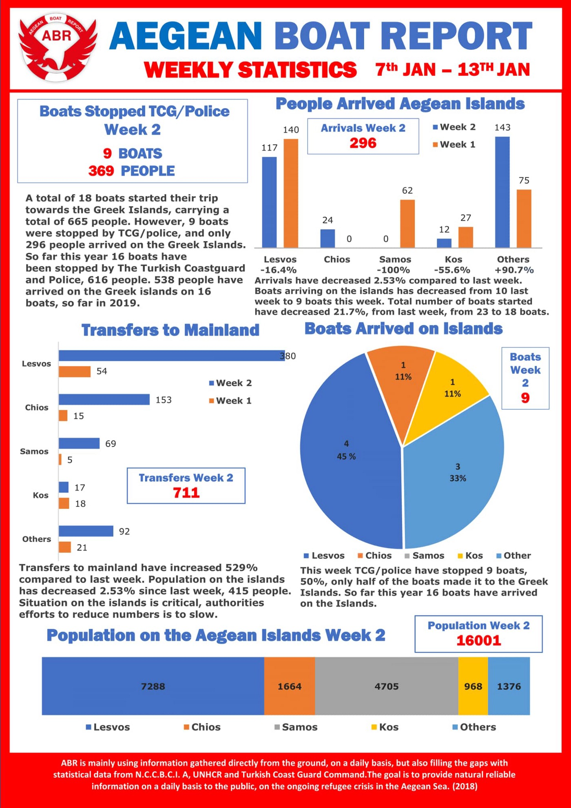
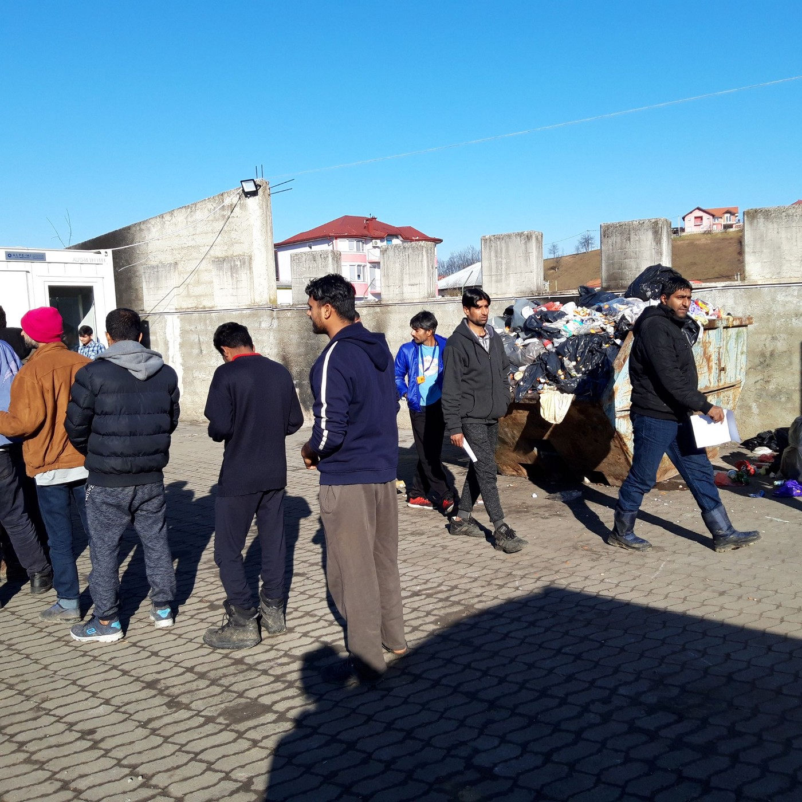
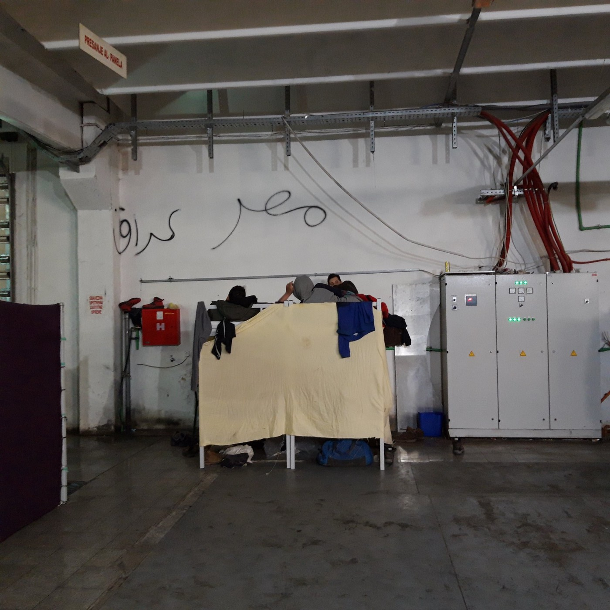
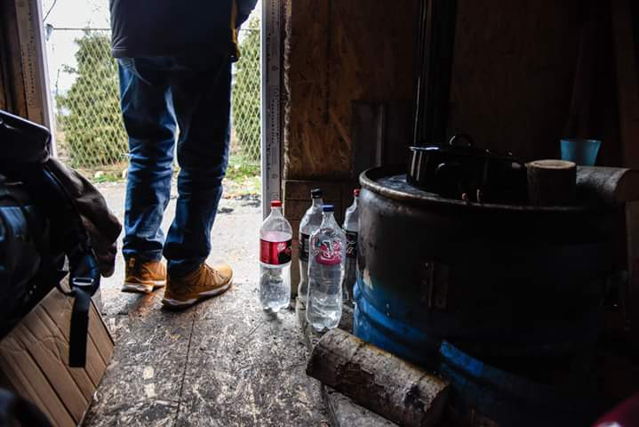
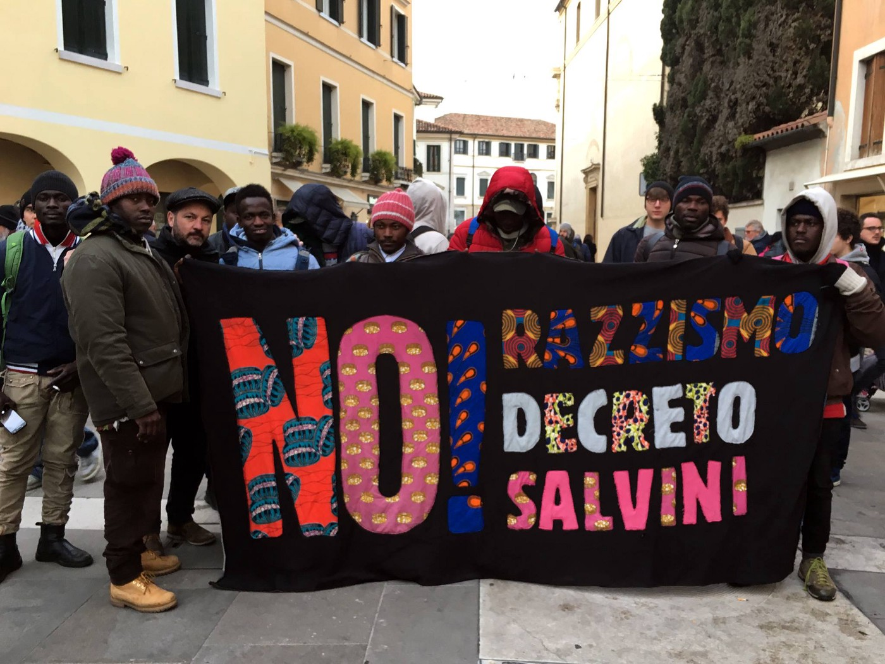
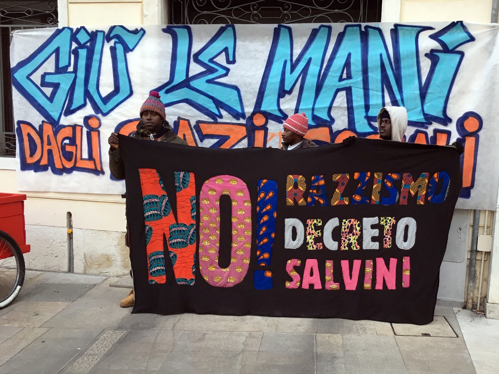
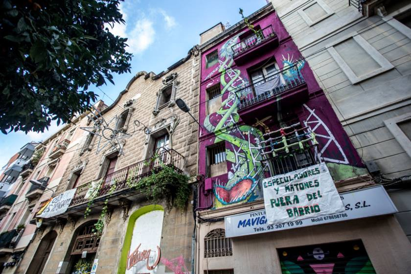

### AYS Daily Digest 14/01/19: Open Arms Rescue Ship barred from leaving port once again

_Updates from Libya // 54 still missing in Alboran Sea // Two new reception centers to open on Greek mainland // Life inside and outside an IOM camp in Bosnia // Statement on illegal push backs on Croatian border // In Italy, freezing temperatures make sleeping rough unbearable // Open Arms blocked yet again // Protests in Spain, Italy, and Belgium // Addressing rumors about Canada’s refugee program_

](assets/c044728e4c26/1*5J63cG5LxptGe7hzpKPFHQ.jpeg)

Spanish anti\-racism protestors take to the streets\. Photo credit: [Mike Gilli](https://www.facebook.com/photo.php?fbid=10157014458088270&set=pcb.10157014460708270&type=3&theater&ifg=1)
### Feature —

The Maritime Authority has once more blocked rescue ship Open Arms from leaving port — this time in Barcelona, where the ship is currently docked\. The Maritime captain’s justification for the decision, according to [El Pais](https://elpais.com/politica/2019/01/13/actualidad/1547398905_005726.html?fbclid=IwAR3diPx-4He8br1t9X__KRwLslqqNl8MGzZgzHIy14MR45eSXtrQrBZODcI) , is the ship’s infringement of “international conventions,” such as the obligation to disembark asylum seekers at the nearest safe port — a convention that Open Arms violated on its last mission because neither Italy or Malta, the closest ports, would allow the ship to dock\.

In other words, Open Arms is being punished for the complete lack of E\.U\. member state cooperation and compromise on how to distribute responsibility for asylum seekers who have been rescued at sea\. Not only can the ship not control this flagrant shirking of duty by various E\.U\. countries, it actively undermines their mission to save lives in the Mediterranean\.
### Libya

An update from journalist Sally Hayden on the situation in Khoms:

■■■■■■■■■■■■■■ 
> **[Sally Hayden](https://twitter.com/sallyhayd) @ Twitter Says:** 

> > Another update from Khoms: detainees say the UN finally came to register the newer arrivals. They say they told them about the people already forced back to smugglers, but UNHCR staff said they can’t do anything about it. “This is Libya.” #libya https://t.co/noTmrjP6Su 

> **Tweeted at [2019-01-14 13:38:12](https://twitter.com/sallyhayd/status/1084806891086196736).** 

■■■■■■■■■■■■■■ 

### Sea

The Mediterranean in January — high winds and rough seas\. Source: Watch the Med

According to [Watch The Med](https://www.facebook.com/watchthemed.alarmphone/posts/2293851080889122) , 54 people are still missing in the Alboran Sea, somewhere between Morocco and Spain\. The organization was alerted to the boat’s presence yesterday, but after search efforts by both Salvamento Marítimo and the Moroccan Navy, the boat, and its passengers, remain elusive\.
### Greece

Weekly statistics from Aegean Boat Report\.

**ISLANDS —**

According to [Aegean Boat Report](https://www.facebook.com/AegeanBoatReport/posts/508153439707765?hc_location=ufi) , 2 boats carrying 74 people arrived on Lesvos this morning\. Around 65 asylum seekers landed on Samos last night, [Samos24](https://www.samos24.gr/metanastes-2/?fbclid=IwAR1HJRR1CrT2jo88URXGVSE8NKrBvjMeUucYx70-339f27UpHGS_-99JboU) reports\.

[Here’s](https://reliefweb.int/sites/reliefweb.int/files/resources/67585.pdf?fbclid=IwAR2zmDpzxxPjYMvimYn2hyJ5qAs3ZPlibYeN6g68A_bxFdR0MpFrPsh8GWk) a weekly snapshot of arrivals from UNHCR, which reports slightly higher numbers than Aegean Boat Report…

InfoMigrants posted a new video bearing witness to the conditions inside Vial, the Chios hotspot\. One woman interviewed noted that some families have been forced to stay at Vial for longer than 7 months while they wait for their interview\.

Another [video](https://www.facebook.com/ruhi.akhtar.7/videos/pcb.2469108889772671/2469083113108582/?type=3&theater&ifg=1) , posted yesterday, shows the terrible conditions at Vathy, the Samos hotspot:

Kitrinos Healthcare is looking for volunteer doctors to assist in their Moria Clinic — February 23rd through March\. Find out more info and apply [here](https://www.facebook.com/TeamKitrinos/posts/2243281699286557?hc_location=ufi) , or email them at **volunteer@kitrinoshealthcare\.com\.**

**MAINLAND —**

](assets/c044728e4c26/1*24W1Vf5exaAZQWMUJGqj2Q.jpeg)

A service for Shehzad Luqman, the 27\-year\-old Pakistani worker who was murdered in a probable hate crime\. Source: [No Borders](https://twitter.com/Refugees_Gr/status/1084745096648671233?s=19&fbclid=IwAR3fKUTgAOLRack2AU4GRIOHtrZyFgM5Xa9FHkNafAOq3JI_cRlsRee-4Po)

6 years ago, a Pakistani worker named Shehzad Luqman was murdered in Petralona, a neighborhood in Southern Athens\. At a hearing in the Court of Appeals today, police on the scene the night of the murder testified that the killers admitted that they were motivated by Luqman’s nationality and immigration status\.

The blog [Under\_Stand\!](https://understand.espivblogs.net/?fbclid=IwAR2cprLUuO89h8toxWuYJrE_I7vZ47sCEiIM3cXLqubRpyKQFJCoqR6CWB8) ties together several recent murders — the rape and femicide of Eleni Topaloudi, the murder of Albanian worker Petrit Zifle, and the honor killing of Aggeliki Petrou by her father, enraged that his daughter was dating an Afghan asylum seeker — noting that each violent crime is attributable to the same forces, manifestations of “a brutal daily condition of the social war that we experience\.” The anniversary of Luqman’s death Nevertheless, they write, “within this war we have chosen to stand against the oppression that comes from patriarchy, racism, \(and\) state repression\.”

Kathimerini [reports](http://www.ekathimerini.com/236541/article/ekathimerini/news/two-new-migrant-reception-centers-to-open-on-mainland?fbclid=IwAR1Xi2x1SSGUthljggJWvd1zi1u5XA5m0Fr0XdTtwAdkqILcf9eeW6qVSRg) that two new reception centers are slated to open on the Greek mainland, in anticipation of winter transfers from the Aegean hotspots\. The new camps will be located at Vaiochori, in Northern Greece, and at Kypselochori, near Larissa\.

The Greek Asylum Service \(GAS\) is announcing a [**new weekly Skype schedule**](http://asylo.gov.gr/en/wp-content/uploads/2019/01/%CE%95%CF%80%CE%B9%CE%BA%CE%B1%CE%B9%CF%81%CE%BF%CF%80%CE%BF%CE%B9%CE%B7%CE%BC%CE%AD%CE%BD%CE%BF-%CF%80%CF%81%CF%8C%CE%B3%CF%81%CE%B1%CE%BC%CE%BC%CE%B1-skype-%CE%B1%CF%80%CF%8C-7-1-2019-ilovepdf-compressed.pdf) for international protection applications, effective January 7th\.
### Bosnia

](assets/c044728e4c26/1*11hBvVza7Sj379eO0hLz2w.jpeg)

Photo Credit: [Bostjan Videmsek](https://www.facebook.com/bostjan.videmsek/posts/2932590230099947?hc_location=ufi)

“Dehumanization as such\.” Images from Miral camp, run by IOM in Velika Kladuša\.

The man’s makeshift shelter, which includes a small stove\. Photo Credit: Angélica Sánchez

“He sits around his stove, which is always lit\. There is not much more he can do\. Get up, fill in the old Coca Cola or Sprite bottles with water from a nearby tap, check the clothes that volunteers have brought in and see if there’s anything for him, take a shower, go to the market, buy chicken… and sit down for hours to cook — very slowly — his chicken stew with vegetables and a lot of oil\. \. \.”

No Name Kitchen [reports](https://www.facebook.com/NoNameKitchenBelgrade/posts/654598898271731) on one Eritrean asylum seeker who has chosen not to live in a nearby IOM camp because of the long lines and lack of dignity and agency for refugees living there\.
### Croatia

Border Violence Monitoring published a collective statement in response to the Croatian Ministry of the Interior’s claims that documented push backs of asylum seekers constitute legal “refusals of entry” rather than illegal expulsions:

“We call on the European Commission to follow through with this concern and treat it as a matter of high priority\. We further demand a call by the European Commission on Croatia to halt and transparently investigate the collective expulsions \(so called push\-backs\) of asylum seekers to Bosnia and Herzegovina, allegations of violence against asylum seekers and chain\-push\-backs from Slovenia to Croatia and then to Bosnia and Herzegovina\.”

Read the full article, which documents various NGO and solidarity groups’ documentation of illegal push backs, [here](https://www.borderviolence.eu/it-is-about-expulsion-about-unlawful-deterring-migrants-from-the-border-collective-statement-as-response-to-the-croatian-ministry-of-the-interior/?fbclid=IwAR1w3jaBZhy9WUQPkhy2Z-lkx5oYCIe73gINLTOZLQqUX8kOzurf08ygxuw) , and Border Violence Monitoring’s initial documentation of push backs [here](https://www.borderviolence.eu/proof-of-push-backs/) \.
### Italy

Baobab Experience reports that a number of women and children have been stranded outdoors overnight, even as the temperature plummets\. “Right now, there are woman and children in the street, begging to be taken ‘home’ because it’s freezing outside,” they write\. There have been many new arrivals since winter started, and the municipality is doing the bare minimum to provide for them\. Once again, volunteers are left to pick up the slack\. Find the full report [here](https://www.facebook.com/BaobabExperience/posts/1997143213695754?hc_location=ufi) \.

Some images from a sit\-in, in defense of a social space for migrants, which took place in Treviso this past Saturday:

](assets/c044728e4c26/1*QY4zO9zBltdYz0d9RUP1kA.jpeg)

Photo Credit: T [alking Hands](https://www.facebook.com/OpificioTalkingHands/photos/pcb.956589888062766/956588078062947/?type=3&theater)
### Spain

This past week, Barcelona\-based Casa Africa [celebrated](https://thefreeonline.wordpress.com/2019/01/14/no-borders-no-nations-2/?fbclid=IwAR3k8auwhfL-iRVNc5CQ2avdieHCbYUZs7AuBUtrN-kFUIIuDTBwwsabIL0) a temporary hold on the squat’s impending eviction with a breakfast\-lunch gathering\. There are currently around 20 young people from various countries in Africa living in the squat\.

The protest, and the Casa Africa Squat\. Photo Credit: Mike Gilli
### France

According to Solidarité Migrants Wilson, the Saint\-Denis mayoral office has shut off access to potable water at two critical water points on the suburb’s Avenue Wilson\. A number of migrants, who are forced to camp out nearby for lack of official housing, rely on these fountains to hydrate and keep themselves clean\. “No alternative solution was put in place,” the organization noted — “One day we will have to explain to our children how we treated people fleeing an atrocious war, who thought they could find refuge in the country of human rights\.”

Watch the video below:

### Belgium

[InfoMigrants](https://www.facebook.com/InfoMigrants/posts/1871203303001446) posted this photo from a protest in Belgium over the weekend\. “I get treated better than migrants do,” the sign reads\.
### Denmark

**Update on a family of 4 deported to Afghanistan in October 2018 —**

The Afghanistan Migrants Advice & Support Organization \(AMASO\) [reports](https://www.facebook.com/AmasoAfg/?__tn__=K-R&eid=ARBe1GdvJxzIXGM-szADjUOuPd54z006oPJ7bwtC0TjzJPJPgnUKlISQtwkRYjZ5h5wx8aJHQRgL3FtQ&fref=mentions&__xts__[0]=68.ARCDR-aT53DTB96NfFmqtVoajyIoZ2R6c5W17yZYEH6kuOYvgeKnuGJPjDOWsJm1lGFklrL7uIR-GQqGS0QuPKJSyD_mikYGnruIrp7RkTSU9iFGlmBXJXPlGptWuBDN0DeJjoZpSEeYy2xLsMfSwCN2FhIasaDJpHrZqzS-NfGNb9W4rHPXAl7RFrMNXrovCWSunuHJpXrHzhsjKxyb1p_eX-Qp8OdejWqvpqgnVex0bmipJG5OsuflWx3QHQT1mBirnVJl1CO7zbSxvnUIj4W2pLvngp2dYHqK4DsK_QIAIWDzxClvRTfmEw8LZJBxdc-qCg73C37tky3ryirUYaQ) on the whereabouts of a family who was deported by the Danish government in October, despite credible fear of the mother’s immediate family members, who don’t approve of her marriage\. The director of AMASO met with the family shortly after their return to Kabul, and the family has since made it safely out of the country\. Now, they must begin the process of making it to a safe destination all over again\.
### Canada

**Debunking Rumors — is it true that Canada will accept over 1 million immigrants in the next few years?**

Thessaloniki’s Mobile Info Team explains that while the Canadian government has indeed announced that it will accept a million immigrants over the next 3 years, the majority of these slots will be reserved for “skilled workers” and their family members\. Canada has plans to resettle approximately 30,000 refugees per year, but these are all people who have been officially designated as such by the UNHCR and who have undergone an extensive selection process\. Unfortunately, there is no way to apply for this program by yourself or even with the help of a lawyer, and the UNHCR does not make refugee referrals for refugees who are already within the European Union\. 
Read the full post, in a number of different languages, [here](https://www.facebook.com/mobileinfoteam/posts/2356556764573039) \.

**We are an entirely volunteer\-run media team, and we rely on our supporters to share our news\. So please share, and never forget to ACT\!**

**We strive to echo correct news from the ground through collaboration and fairness\.**

**Every effort has been made to credit organizations and individuals with regard to the supply of information, video, and photo material \(in cases where the source wanted to be accredited\) \. Please notify us regarding corrections\.**

**If there’s anything you want to share or comment, contact us through Facebook or write to: areyousyrious@gmail\.com**

_Converted [Medium Post](https://areyousyrious.medium.com/ays-daily-digest-14-01-19-open-arms-rescue-ship-barred-from-leaving-port-once-again-c044728e4c26) by [ZMediumToMarkdown](https://github.com/ZhgChgLi/ZMediumToMarkdown)._
