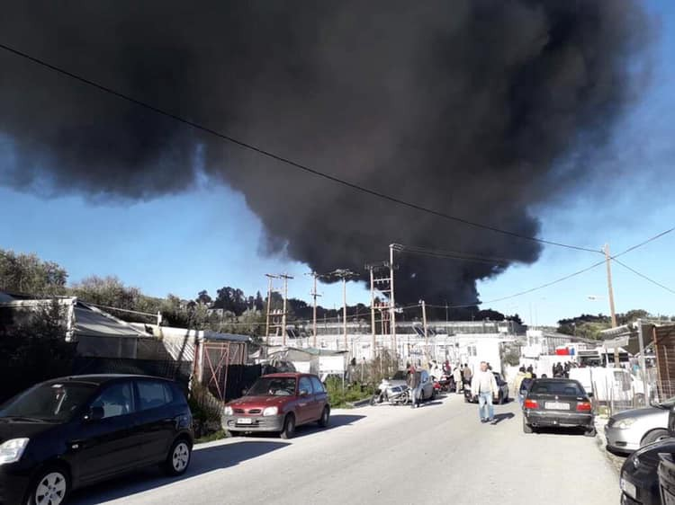

### AYS Daily Digest 16\.01\.19: Fire in Moria Camp

_NGOs call on Spain to search for 54 missing//Will Greece investigate the alleged pushback that resulted in a child’s death?//Daily life in Sid, Serbia //Solidarity in Bosnia//Rescued people face push\-back in Croatia//Evictions announced in Paris//and more…_

A fire started in one of the large tents at the Olive Grove camp in Lesvos around noon on Wednesday\. The tent burned all the way down, but fortunately the fire was contained by firefighters before it spread\. [A video of the fire](https://www.facebook.com/omar.alshakal/videos/vb.100012927578167/603042026803378/?type=2&theater) was posted on facebook\.

There are currently no reports of serious injuries\.

Volunteers on the island are working to help the people who lived in the tents to get them new shelter\.

![“Today we sadly saw the big tent burn down\. Luckily though, nobody was hurt, so we’re very thankful for that\. We want to thank everyone who helped us with the damage control: together we made sure the guys who used to live in the rubhall will find a new warm tent with heaters, sleeping bags, blankets, new clothes, and food\. Even until now, we have a strong team on the ground💪Thanks @movementontheground @becausewecarry and to all the people that reached out to us to offer help and support, we really appreciate that\. Now we continue to improve the situation here, and we will not stop until we do so\. Photo Credit: Ali Mular](assets/839f424af599/1*XYySA4dP9SuQb3ge8H8gng.jpeg)

“Today we sadly saw the big tent burn down\. Luckily though, nobody was hurt, so we’re very thankful for that\. We want to thank everyone who helped us with the damage control: together we made sure the guys who used to live in the rubhall will find a new warm tent with heaters, sleeping bags, blankets, new clothes, and food\. Even until now, we have a strong team on the ground💪Thanks @movementontheground @becausewecarry and to all the people that reached out to us to offer help and support, we really appreciate that\. Now we continue to improve the situation here, and we will not stop until we do so\. Photo Credit: Ali Mular

Approximately 50 people who were living in the tent lost their meagre shelter and all of their belongings\.

The cause of the fire has not been stated, but there a number of potential causes in such a crowded and unsafe camp, where many people have heating, cooking, or electrical wires jerry\-rigged into their tents\. This camp, like many of the other Aegean island camps, is a virtual firetrap, with tents packed very close together, and flammable materials and trash taking up the space between\.

The fire in the Olive Grove was a very close call, and this incident should serve as a wake up call to the Greek and EU authorities\. **Conditions in the island camps are inhumane, unsafe, and sometimes even deadly** — it was only last week that a young man from Cameroon died from a probable case of asphyxation from trying to heat his tent in Moria\. In the freezing cold, without any proper shelter or heat, people will do anything to stay warm\.

> There is only one real solution to this problem, and it cannot be found within the wretched island camps\. People need real shelter, housing and apartments\. Yet after this fire we already see a familiar routine — volunteers doing what they can to provide basic aid, while the authorities turn their backs on those in need\. 

### Morocco

The number of people intercepted by the Moroccan Coast Guard rose dramataically in the past year\. Out of the 19,584 people who have been detected and forcibly returned to Morocco between January 2009 and November 2018, [over 50% were intercepted in the first 11 months of 2018](https://twitter.com/mherbe01/status/1085473620011438080?fbclid=IwAR05E0_W1vSPGG6OTC9ey6G0Nzb8IFWBFXReK0Fn2sUj47Tg5Ow4awOl-1E) , according to a report by Frontex\.
### Sea

A number of sea rescue groups and activists are calling for search operation for the 54 people who went missing on a dinghy that was headed towards Spain from Morocco\.

■■■■■■■■■■■■■■ 
> **[Alarm Phone](https://twitter.com/alarm_phone) @ Twitter Says:** 

> > For 4 days now we are searching with relatives for 54 people who went missing between #Spain and #Morocco while @[salvamentogob](https://twitter.com/salvamentogob) seems to have reduced its rescue capacity and has fewer boats. 

We demand them to urgently launch a large-scale search operation!

#safepassage 

> **Tweeted at [2019-01-16 15:43:51](https://twitter.com/alarm_phone/status/1085563289525018625).** 

■■■■■■■■■■■■■■ 

### Greece
#### No word from Greek authorities on alleged attack by Coast Guard

There has been no information on whether an investigation will be conducted on the attack and possible illegal pushback that caused the death of a four\-year\-old girl on Tuesday\.

As reported [in yesterday’s digest](ays-daily-digest-15-01-19-a-nine-year-old-girl-died-when-a-dinghy-sank-off-the-turkish-coast-1fc42e8da61) , people on the boat described having their boat dragged by masked men in a motorboat, who spun them around and caused their boat to take on water\. The girl drowned in the water before she could be rescued by a Turkish naval helicopter\. The father who lost his daughter is alleging that the masked men were members of the Greek Coast Guard\.

As human rights journalist Marianna Karakoulaki write on Twitter, if true, this incident would not be the first time that Greek authorities have engaged in illegal pushbacks along the EU border\.

■■■■■■■■■■■■■■ 
> **[Marianna Karakoulaki](https://twitter.com/Faloulah) @ Twitter Says:** 

> > @BoatAegean #refugeesGR pushbacks from #Greece towards #Turkey are a common secret. NGOs have been talking about it for years; they did not start with the so called #refugee crisis. As refoulement is a violation of international law, the GR parliament is supposedly "investigating" 6/ 

> **Tweeted at [2019-01-16 07:55:40](https://twitter.com/faloulah/status/1085445468610547712).** 

■■■■■■■■■■■■■■ 

■■■■■■■■■■■■■■ 
> **[Marianna Karakoulaki](https://twitter.com/Faloulah) @ Twitter Says:** 

> > @BoatAegean However, I have the feeling that this investigation will lead to nowhere as refoulement is a method that is used in order to stop #refugeesGR from coming. A method of power, a method of control 7/ 

> **Tweeted at [2019-01-16 07:59:05](https://twitter.com/faloulah/status/1085446325909577728).** 

■■■■■■■■■■■■■■ 

■■■■■■■■■■■■■■ 
> **[Marianna Karakoulaki](https://twitter.com/Faloulah) @ Twitter Says:** 

> > If yesterday's incident is indeed part of this narrative, the Greek government, the EU, as well as those involved in patrolling the Greek waters will have to hold themselves accountable for the death of that child. 9/ 
#refugeesGR 

> **Tweeted at [2019-01-16 08:03:55](https://twitter.com/faloulah/status/1085447544484839424).** 

■■■■■■■■■■■■■■ 

The Refugees 4 Refugees team is looking for volunteers for their warehouse and distribution team on Samos, if interested apply [here](https://refugee4refugees.org/volunteer/?fbclid=IwAR2WmYA8wcZRgiL-PsH7aVezIEC54qW80zZeZWqH2skawReQJrtqLTuWfww) \.

There has been no running water for over a week in the [Lagkadikia Camp](https://www.facebook.com/lagkadikia.camp?__tn__=%2CdCH-R-R&eid=ARAzOE9nAxUKy8NSbInwYl1p29QYewhCei9Aj1BFo55xhy_Bf73lyvNcmcY_rc1agCGA1VLdTIU8kf4w&hc_ref=ARTkHL1t9ptPekj6MZn0SlQp-XZY0DJcPTuvZcaLk0yfELjhe3ICzB4nleQZXCLEm2I&fref=nf&hc_location=group) in Northern Greece\. \.
### Serbia

No Name Kitchen [posted a video](https://www.youtube.com/watch?v=FIDphpYu33g&feature=youtu.be&fbclid=IwAR2Pntv-6AANSyOeGsFKR77u2SwrZSEPj7KMB6z5ljmMCoTMcYyKV-4w-34) today showing their daily work in Šid — and also revealing the miserable conditions facing refugees in the border town\. The video shows people living in tents covered in tarpaulins inside an abandoned and half collapsed building\.
### Bosnia

Bosnian people, unlike their government, have been showing solidarity with people on the move in their country\. [Local media](http://www.6yka.com/novosti/ovako-to-radi-dragoslav-migranti-mu-provalili-u-vikendicu-a-on-ih-nahranio-i-kupio-im-lijekove-vrata-vise-ne-zakljucava?fbclid=IwAR2j92C7CyAQNw3sCvwnQPLTnHfqMq4XBg1cXpWUnQlahuTaVXXlV8v9Gco) published a story about Dragoslav Sinik, a man who has a holiday house in the mountains near city of Gradiska, north Bosnia, that he keeps open for anybody\. As he explained, several months ago he found one family from Iraq hiding inside\. Since then, he keeps the door open and storage full\. At the door he leaves a sign that reads “Open 24 \-7”

_“I decided to keep my doors open, and to have everything ready for people to use\. These people need help, more and more are getting hurt while trying to cross the mountains, and more and more countries want them far away from their borders\. Their stories are not easy, we do not know enough about that, and the worst of it is that there is hardly a solution when it comes to issues related to migration”,_ Sinik told the media in Bosnia\.

Sinik is one of many people in Bosnia who have houses in the mountains and leave them open for people on the move\.

In Bosnia and Herzegovina, for over a year, most of the help for refugees has been coming from the local population, grass\-root and self\-organized\.
#### Health problems and anxiety rashes in IOM\-run Bihac camp

A medical volunteer who visited Bira, the Bihac camp, described in a blog the issues he sees with the refugees they work with\. Some people in the camp have developed a severe skin rash, where the skin becomes bleached and is peeling, and this seems to be caused by extreme stress\. According to the medical volunteer:

> At this camp run by the IOM migrants\-refugees too cannot sleep at the night because of fear that they will be attacked and looted\. This is why they try to sleep only during the day\. It is clear what kind of stress they permanently bear faced also with no individual destiny, and soon they are totally exhausted and psychically ruined\. Sometimes it is not possible to get food after many hours of waiting in line \(a few days ago over 300 hundred people were left without lunch\)… 

#### Will the [IOM \- UN Migration](https://medium.com/u/664cb26312d4) impose a restriction of movement in the Miral camp?

A rumour is circulating that IOM in Bosnia plans to restrict movement both in and out of the Miral camp in Velika Kladusa, turning it into a semi\-closed facility where people are able to leave only a few hours per day\. The rumour came from more than one source, and spread among residents in the camp\.

Currently there are approximately 650 people residing at Miral, including some women\. We predict that this change would have a negative impact on the psyche of those inside , if it were to occur\.

Furthermore AYS team members working in the area have noticed an increase in police presence and general restrictions on people on the move, as well as local and international volunteers in the town\. At this point in time we remain unsure whether it is the local authorities or IOM who are directing these changes\.

This week police officers and IOM workers came together in an independent volunteer project site to inspect the volunteers’ white cards once more\. In addition, a number of squats were evacuated by police who took the people living inside to Miral so that IOM could register them\. Many of these people refused to stay at the facility due to a desire for privacy and fear of being caught up in inter\-communal tensions within Miral\.

Another alarming development is that the private security guards operating at Miral are beginning to refuse the entry of all people who are not yet registered in the facility\. This is leaving people in need of shelter with no other option than to sleep outside in the open in extremely cold temperatures\.
### Croatia
#### Croatian authorities push back rescued family

A group of fifteen refugees, including children as young as one, was rescued today in the Pljesevica mountain area, [according to the Croatian media](http://www.novilist.hr/Vijesti/Crna-kronika/Policajci-na-rukama-nosili-smrznute-migrante-s-Pljesivice.-Medu-njima-je-bilo-i-jednogodisnje-djece?meta_refresh=true&fbclid=IwAR1IBWuqg2G7BJrwwdDH-LNI49eURVBjWKS9RuSAXfcgoJgQacdu2ysr-44) \. Special police forces were involved in saving a group that got stuck in the snow\. Some of the people in the group needed medical help after the ordeal\.

Croatian authorities have announced that all of the people will be sent back to BH immediately\.
### Netherlands
#### Accusations of violence against Dutch police made by passengers on deportation flight

Additional information on the violent deportation of a Sudanese man from the Netherlands that occurred on 5 January [was published today, including the eye\-witness account of a passenger](https://enoughisenough14.org/2019/01/16/amsterdam-at-least-12-military-police-involved-in-deportation-violence-against-sudanese-refugee-ezzedine-mehimmid/) \. According to the passenger, the police used physical force against the man throughout the process:

> Mr\. Mehimmed was placed all the way in the back in the last row\. The first time we caught sight of him, he was being forced to lie flat on the seats\. Three men from the Marechaussee \[police squad\] were sitting on top of him\. A moment later he began to shout, and we saw his face shortly appear above the seats, only to disappear again after a few seconds\. The Marechaussee were restraining him using sheer force\. They covered his mouth to silence him, and his eyes as well\. We could only see his feet sticking out and moving\. 

As the police restrained the man, a number of passengers on the plane began to protest, and demand that the man be let off\. Passengers who attempted to film the scene were reportedly met with aggression by both the police and the KLM flight staff\. Police officers demanded that passengers delete the footage they had taken, or face ejection from the flight and arrest\. Two passengers who refused to sit down were eventually arrested and taken off the back of the plane\. One more passenger was taken off the flight by officers, but not arrested\.

The Dutch government is planning its next deportation flight on 22 January\. At least five Sudanese people in the detention center in Rotterdam are facing deportation on this flight\. A campaign has started to stop this\. For more information and updates see twitter: [@tevree](https://twitter.com/tevree)
### France
#### Eviction announced by the end of the week for people sleeping on Avenue President\-Wilson

Municipal authorities in Paris have announced their plan to evict all the people currently living in the encampment along Avenue President Wilson in Saint\-Denis\. There has not been an accompanying plan to provide emergency shelter for those facing eviction\. A volunteer group that provides aid to refugees living on the avenue published a list of questions about the eviction addressed to the city hall in Paris today:

> first question: Will emergency shelter be provided, as we, with 13 other citizen associations and groups, demanded in an open letter published by the JD on 30 December? \(https://www\.lejdd\.fr/Societe/lettre\-de\-14\-associations\-a\-emmanuel\-macron\-letat\-met\-en\-danger\-les\-migrants\-3829496\) \.
 

> second question: What is the purpose of this raid? Is it intended to make an image in the media?…
 

> 🔴 third question: Where will the evacuees be sent? We still don’t know…
 

> 🔴 fourth question: Will citizens’ associations and groups be able to access them freely to accompany people in the evacuation \(for medical aid, etc\. \)? 

#### Volunteer group estimates approximately 2,450 people living in street encampments

A video of the refugee encampments along several streets and under bridges in Paris was posted today by a volunteer group\. The group estimates that there are at least 400 people sleeping along the Porte de Clignancourt, 800 at the Porte d’Aubervilliers, another 800 at Porte de la Chapelle, and approximately 450 people living on Avenue President\-Wilson\. All of these people are living in filthy conditions, amid waste and rats, with little protection from the cold\. And the constant police harassment, including violence and the frequent use of pepper spray, continues\.

### Denmark

We have an update on the report in yesterday’s digest that an uncomfirmed number of people were deported from Denmark to Afghanistan\. [According to a support group for Afghani refugees](https://www.facebook.com/AmasoAfg/photos/a.625584567471831/2300953026601635/?type=3&theater) , one of the those on the flight was suffering from serious psychological issued, and had already made multiple attempts to take his life\. He is being deported against doctor’s advice\.

**We are an entirely volunteer\-run media team, and we rely on our supporters to share our news\. So please share, and never forget to ACT\!**

**We strive to echo correct news from the ground through collaboration and fairness\. Every effort has been made to credit organizations and individuals with regard to the supply of information, video, and photo material \(in cases where the source wanted to be accredited\) \. Please notify us regarding corrections\.**

**If there’s anything you want to share or comment, contact us through Facebook or write to: areyousyrious@gmail\.com**

_Converted [Medium Post](https://medium.com/are-you-syrious/ays-daily-digest-16-01-19-fire-in-moria-camp-839f424af599) by [ZMediumToMarkdown](https://github.com/ZhgChgLi/ZMediumToMarkdown)._
