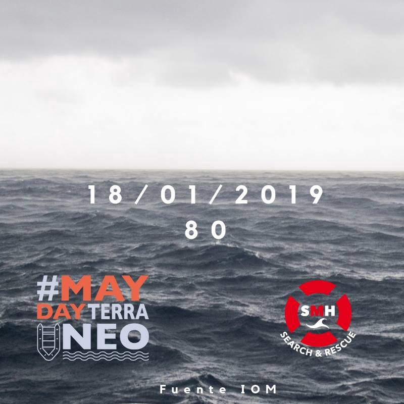

### AYS Daily Digest 17/01/2019 Insulted, threatened and beaten by Croatian authorities

More than 11,300 people affected by storms in Lebanon /// 53 dead and one survivor in shipwreck at the \#FronteraSur /// Protests in Samos /// Right\-wing Belgian Councillor arrested for human trafficking /// Slovenian police refuse to disclose papers on their border activities /// Human Rights Watch on the EU

 \. This is one of the many stories [collected by medical examiner Cristina Cattaneo](https://www.globalist.it/life/2019/01/16/in-tasca-una-pagella-la-storia-del-bambino-che-abbiamo-lasciato-morire-in-mare-2036179.html) , who worked at the identification of people drowned at sea \(Drawing: _Lost Treasures_ by [Makkox](https://twitter.com/makkox) \)](assets/cb1a057bcc00/1*6Za-jGm0YlSXPRJsq8FIbw.png)

“ — Wow\. \. First class grades… — You’re a rare pearl, kid\.” [A 14\-year\-old kid from Mali, who died trying to cross the Mediterranean, had his school report sewed in a pocket\. He wanted to show Europe he was a good boy, yet the ‘civilized’ world failed him](https://twitter.com/Digitalys/status/1085854406900207617) \. This is one of the many stories [collected by medical examiner Cristina Cattaneo](https://www.globalist.it/life/2019/01/16/in-tasca-una-pagella-la-storia-del-bambino-che-abbiamo-lasciato-morire-in-mare-2036179.html) , who worked at the identification of people drowned at sea \(Drawing: _Lost Treasures_ by [Makkox](https://twitter.com/makkox) \)
#### Feature — A\., insulted, threatened and beaten by Croatian authorities

Refugee A\. who has been volunteering in Sarajevo for some time was caught and allegedly abused by Croatian police officers\. His story was shared with us by his friends, who are hoping to raise awareness about his case and to stop his transfer to Bosnia\.

The dubious circumstances regarding A\.’s arrival into Croatia will undoubtedly trigger a wider debate about the legal boundaries of solidarity with those in need\. AYS always chooses to follow legal and safe ways, but we understand that some people might choose differently\. It is for this reason and out of respect for A\.’s struggle that we’re sharing the full message sent by his friends:

> On Monday the 14th of January, 3 white people with a European passport tried to help a refugee from Syria to cross the Bosnian/Croatian border near Strmica on foot and by car\. After 10 km walk and several successful attempts to avoid the police, all 4 were caught around 8 PM and brought to Knin police station\. There, the head of the police station and one person being accused for violating Schengen law and helping a foreigner crossing the border illegally, signed a document where there was handwritten in German: “A\. wants to apply for asylum in Croatia”\. 

> After two days of imprisonment and a mild sentence by the Šibenik court, A\. was brought to the detention centre in Trilj and the 3 European citizens were released\. They tried to visit him today, but the police guards of the detention camp refused and forced them to leave the place\. A\. told them from his cell\-window that he had been beaten him several times in Knin police station, had been insulted \(“animal”, “fuck your mother”, “go back to Syria”\) and had been brought to an unknown abandoned house\. On the way to the house his head was bashed against the seat of the car\. Once in the house, four police men held him while another was beating him in the face\. Once in Trilj detention centre, he was refused to have a lawyer, refused to apply for asylum and he was also told that they would have pushed him back illegally to Bosnia today\. This information has also been confirmed by A\. via phone who has asked for this story of violence to be made public, and forwarded to the ministry of internal affairs as well as the media and Croatian Ombudsman\.” 

At the moment, several groups are working on getting a good lawyer for A\. in Croatia and will hopefully prevent his return to Bosnia\.

No information about A\.’s case has been so far released by the interior ministry, but we expect it to happen tomorrow\.

LEBANON
#### More than 11,300 affected by last weeks’ storms

The latest storms which have hit Lebanon in recent weeks have “left vulnerable children relocated and in need of protection and warmth, with refugee children especially affected”, Unicef [report](https://www.unicef.org.uk/press-releases/unicef-and-partners-providing-urgent-relief-to-protect-nearly-40000-children-at-risk-from-the-ongoing-winter-storms-in-lebanon/) s\.

More than 570 were affected by heavy rain and snowfall; floods took place in at least 11 informal settlements\. According to the UN agency “more than 11,300 people \[…\] have been affected by the storm”, half of them are minors\.

> In the Bekaa valley alone, at least 847 Syrian refugees had to relocate due to floods or severe damages to their shelters\. In the North, over 700 relocations are reported so far\. 

TURKEY
#### 5 migrant workers die in Ankara

Five workers from Syria have lost their lives in a fire that broke out in Ankara Furniture Manufacturers’ Site, media outlets [report](https://bianet.org/english/migration/204542-5-workers-from-syria-lose-their-lives-in-fire?fbclid=IwAR0-2wjk-KQZk-HM4aILZAY5RUvTRXAS96FguVNivi7Vy1X6mKglL37SmMg) \. Throughout 2018, at least 108 migrant\-refugee workers lost their lives in occupational homicides in Turkey\.

SEA

#### 53 dead and only one survivor in the shipwreck in the Alboran Sea

After 6 days at sea, only one person survived the shipwreck\. The vessel had been missing in the Alboran Sea since the 12th of January\.

■■■■■■■■■■■■■■ 
> **[Helena Maleno Garzón](https://twitter.com/HelenaMaleno) @ Twitter Says:** 

> > Eran las personas que buscábamos desesperadas desde hace seis días: 53 han podido desaparecer para siempre. El único superviviente, hospitalizado en Marruecos, nos cuenta que resistió un día flotando en el agua hasta ser rescatado mientras sus compañeros se hundían. #FronteraSur 

> **Tweeted at [2019-01-18 09:28:47](https://twitter.com/helenamaleno/status/1086193677247135745).** 

■■■■■■■■■■■■■■ 

> “The only survivor, hospitalised in Morocco, resisted for one whole day floating in the water while his friends were drowning” 

GREECE
#### Arrivals

[Aegean Boat Report inform](https://www.facebook.com/AegeanBoatReport/posts/509686282887814?hc_location=ufi) that four boats arrived on the Greek islands on Thursday, carrying approximately 146 people\.

A first boat landed on Korakas, on Lesvos north, at 05\.30 AM\. It carried 35 people \(17 children, 11 women, 7 men\) \.

A second boat with 39 people was picked up by HCG outside the airport, Lesvos south, at 08\.00 AM\.

A third boat was picked up by a Portuguese Frontex vessel outside Petra, Lesvos north, at 08\.30 AM\. 18 people were on board \(10 children, 4 women, 4 men\) \.

The fourth boat was picked up outside Samos north east, around 09\.00 AM\. It carried 54 people\.
#### Protests in Samos

■■■■■■■■■■■■■■ 
> **[Gemma Bird 🧡](https://twitter.com/gemmakristina) @ Twitter Says:** 

> > Protest on #Samos #Greece today. ‘We are not numbers. We are humans’. Conditions on the islands are bad in winter with torrential rain/ cold. The Reception Centre has space for 700, estimates suggest 5000 #Refugees currently on the island. More needs to be done for human beings https://t.co/YaNjggBZS4 

> **Tweeted at [2019-01-17 11:06:13](https://twitter.com/gemmakristina/status/1085855807344918528).** 

■■■■■■■■■■■■■■ 

#### Winter in Lesvos

[No Border Kitchen](https://www.facebook.com/NBKLesvos/) published an update about the last few months on the island:

> Winter on Lesvos, the weather has taken a turn for the worse\. In Moria, the main camp on the island, many people — among them recent arrivals — live in tents with little protection from the cold and rain due to a shortage of container “Isobox” housing\. **Adjacent to the camp, a sprawling network of tents has been set up in an olive grove to house over a 1,400 people with little access to running water or other facilities\.** While many people have recently been transferred to the mainland, **Moria remains severely over capacity** while people face increasingly inhumane and inhospitable conditions\. 

 \)](assets/cb1a057bcc00/1*ItOi8Fv0oGVwE0GVNX8SMw.jpeg)

\(Photo by [NBK Lesvos — Enough is Enough](https://enoughisenough14.org/2019/01/17/no-border-kitchen-lesvos-winter-update/?fbclid=IwAR1kogv3-zwt51BWieNeRNiOku-KAvYfG7tcaFy7H7ZnKzWd1RS48ry5IWI) \)

> \[…\] We have continued to distribute food to people coming into Mytilene, although on a smaller scale as fewer people are making the trip from Moria to Mytilene due to the cold\. Regardless of the numbers, providing food in this way remains a crucial form of solidarity with those who’s mobility has been restricted by the violence of the European border regime\. 

> \[…\] NBK is not only about providing food for people, but also about respecting each other as individuals and building autonomous structures based on relationships of solidarity\. 

> We are on Lesvos because we believe that Fortress Europe and its borders must be abolished\. Through a praxis based on mutual aid and solidarity, we take a stand against border policies and the suffering they are causing\. 

Read the full account [HERE](https://enoughisenough14.org/2019/01/17/no-border-kitchen-lesvos-winter-update/?fbclid=IwAR1kogv3-zwt51BWieNeRNiOku-KAvYfG7tcaFy7H7ZnKzWd1RS48ry5IWI)

SERBIA
#### Push\-backs on the Serbian\-Hungarian border

According to [Info Park](https://www.facebook.com/infoparkserbia) , since Monday Hungarian authorities prevented 45 attempts of irregular entry into the country\. As usual, most of them \(36\) were intercepted within the territory of Hungary\.

SLOVENIA
#### Slovenian Police taking Information Commissioner to Court

The Slovenian police appealed against the decision of the Information Commissioner to disclose documents used during the “processing” of asylum seekers at the border\. Although part of these police documents was revealed last year on request of Amnesty International Slovenia, a crucial amount is still concealed\. The Information Commissioner requested that the police disclose all the documents in order to determine the legality of police instructions and procedures\.

This decision follows numerous testimonies from migrants who were denied asylum in Slovenia and were sent back to Croatia, as repeatedly reported by NGOs and the media\. Although the police deny any allegation of wrongdoing, they refuse to disclose the documents, and have appealed against the decision, citing security reasons for Slovenia and the EU\.

According to [local media sources](https://www.dnevnik.si) , the appeal itself partially discloses the police procedures, noting that the police processed asylum seekers depending on their country of origin \(and not by individual case\), a practice which is illegal under international law\. It also confirms that in May 2018 instructions were sent by the former director general of the police on how to “to turn the increasing trend of illegal border crossings downwards”\.

The link between decreasing the trend of irregular crossings and denying access to asylum has also been established by the Slovenian Human Rights Ombudsman\. According to Ombudsman’s investigation the May instructions could be illegal as they called for mixed Slovenian\-Croatian police patrols enabling Croatian police to apprehend asylum seekers even though they were caught in Slovenian territory and asked for asylum in Slovenia\.

BELGIUM
#### Trafficking in Humanitarian Visas uncovered

A councillor of the municipality of Mechelen, Melikan Kucam, elected for the N\-VA \(New Flemish Alliance\), a right\-wing Flemish nationalist party, was arrested on Thursday for human trafficking, criminal organisation, bribery and extortion, local media [report](https://www.rtl.be/info/belgique/faits-divers/trafic-de-visas-humanitaires-l-elu-n-va-melikan-kucam-place-sous-mandat-d-arret-1092527.aspx?dt=12:21) \.

He is accused of “having erected a trafficking of humanitarian visas”\.

> Through intermediaries, he supposedly asked between 2,000 and 10,000 euros from people fleeing conflict zones such as Syria or Iraq in exchange for a humanitarian visa in Belgium\. 

Reports about such trafficking emerged in October 2018, when the [European Syriac Union](https://www.european-syriac-union.org) sent a [letter](https://www.rtbf.be/info/belgique/detail_visas-humanitaires-la-communaute-syriaque-avait-deja-denonce-un-trafic-impliquant-un-membre-du-parlement-belge?id=10121109&fbclid=IwAR0HD_NTn72aWFskLtCzXlIoWPGkletNgVj_sdktS9hNPZtIcZx6kaO0cwA#) to Belgian and European officials, denouncing the practices of a “gang” that had intervened in the resettlement of Christians from Syria to Belgium, with the complicity of the Belgian consulate in Lebanon\. At that time not many of the recipients seemed to notice\.

From the letter:

> We know that 6 people from Belgium are behind” these transports “\. For this service they take from 3,000 to 14,000 Euros from Syrian Christians\. One of these people works with a member of the Belgian parliament \[…\] \. This activity is criminal and must be brought to justice\. 

SWEDEN
#### Family Reunification to be reintroduced in mid\-2019

The reintroduction of family reunification is one of the points of the budget agreement recently approved, local media [report](https://www.svt.se/nyheter/inrikes/1-000-fler-asylsokande-per-ar-nar-anhoriginvandring-aterinfors?fbclid=IwAR1aqxaT_26l-emN-M_LWto-Yk_chLUeD-JYyrPrPq3kF93weNYSUs7TUk4) \.

The right to family reunification was removed when the temporary asylum law was brought in in November 2015\.

According to an impact assessment from the Swedish Migration Board, about 1,000 asylum seekers per year will arrive through this program\.

The changes are expected to be implemented by the middle of the year\.

EU
#### Issue of migration used to stoke fear, says HRW World Report 2019

Human Rights Watch published today their [World Report 2019](https://www.hrw.org/sites/default/files/world_report_download/hrw_world_report_2019.pdf) \. Regarding the EU they write:

> Despite falling numbers of migrants arriving at the borders of the European Union, populist leaders in EU states sought to **use the issue of migration to stoke fear and increase their support at the polls** \. Their positions on migration frequently undermined the EU’s moral standing and often had little to do with effective policy\.” 

> \[…\] **The focus remained on keeping migrants and asylum seekers away from the EU** , including through problematic proposals for offshore processing and migration cooperation with non\-EU countries with fewer resources, uneven human rights records, and less capacity to process asylum claims\. 

> The EU consolidated its partnership on migration control with Libya despite overwhelming evidence of brutality against migrants and asylum seekers there\. 

> EU member states’ efforts to obstruct rescue efforts by nongovernmental organisations \(NGOs\) and the increasing reliance on Libyan coast guard forces coincided with a skyrocketing death rate\. 

#### EASO signs new 2019 Operating Plans with Greece, Italy and Cyprus

In late December 2018, the European Asylum Support Office \(EASO\) [signed](https://www.easo.europa.eu/news-events/easo-steps-operational-support-cyprus?fbclid=IwAR1sBH5o-mVnSFTrA0Y4-4WJbRw-u3RNiYFWC_B9a5NzfM4_NuhVTeKeK64) three new Operating Plans with authorities in Cyprus, Greece and Italy, detailing the support that the Agency will provide to the asylum authorities of the three EU Member States throughout 2019\.

The [Operating Plan for **Cyprus**](https://www.easo.europa.eu/sites/default/files/OP-Cyprus-2019.pdf) , which has experienced a recent surge in asylum applications, sees a considerable increase in the activity of the Agency in the island and aims to reduce the backlog of pending cases\.

> Specifically, the Agency will continue to support the Cypriot Authorities with the registration of applications for international protection and with improving reception conditions, not only in the accommodation centre in Kofinou, but also in the newly established first reception centre in Kokkinotrimithia\. 

The new Operating Plans for [Greece](https://www.easo.europa.eu/sites/default/files/OP-Greece-2019.pdf) and [Italy](https://www.easo.europa.eu/sites/default/files/OP-Italy-2019.pdf) , updates the previous ones already in place\.

**We also publish weekly summaries of some of the most important news reported during the past week in our Daily News Digest: here are the [Arabic](%D8%B4%D8%AA%D8%A7%D8%A1-%D9%82%D8%A7%D8%B3%D9%90-%D8%A2%D8%AE%D8%B1-%D9%8A%D9%88%D8%A7%D8%AC%D9%87-%D8%A7%D9%84%D8%A7%D8%AC%D8%A6%D9%8A%D9%86-%D9%81%D9%8A-%D8%A7%D9%84%D8%A7%D8%AA%D8%AD%D8%A7%D8%AF-%D8%A7%D9%84%D8%A3%D9%88%D8%B1%D9%88%D8%A8-4161fa56036) and [Persian](%DB%8C%DA%A9-%D8%B2%D9%85%D8%B3%D8%AA%D8%A7%D9%86-%D8%B3%D8%AE%D8%AA-%D8%AF%DB%8C%DA%AF%D8%B1-%D8%A8%D8%B1%D8%A7%DB%8C-%D9%BE%D9%86%D8%A7%D9%87%D9%86%D8%AF%DA%AF%D8%A7%D9%86-%D8%AF%D8%B1-%D8%A7%D8%B1%D9%88%D9%BE%D8%A7-998456a2a542) for the Week of January 7–13\.**

**We are an entirely volunteer\-run media team, and we rely on our supporters to share our news\. So please share, and never forget to ACT\!**

**We strive to echo correct news from the ground through collaboration and fairness\. Every effort has been made to credit organizations and individuals with regard to the supply of information, video, and photo material \(in cases where the source wanted to be accredited\) \. Please notify us regarding corrections\.**

**If there’s anything you want to share or comment, contact us through Facebook or write to: areyousyrious@gmail\.com**

_Converted [Medium Post](https://medium.com/are-you-syrious/ays-daily-digest-17-01-2019-insulted-threatened-and-beaten-by-croatian-authorities-cb1a057bcc00) by [ZMediumToMarkdown](https://github.com/ZhgChgLi/ZMediumToMarkdown)._
