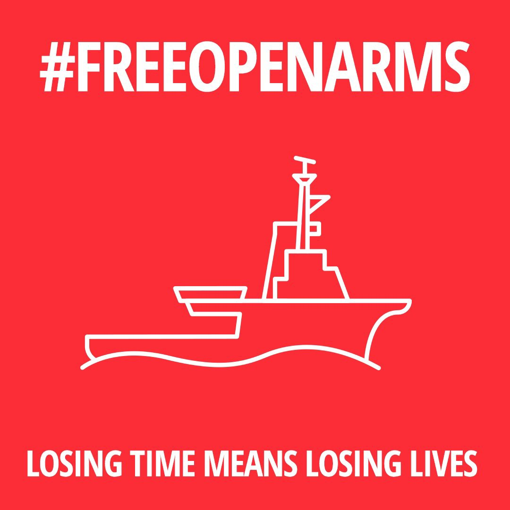
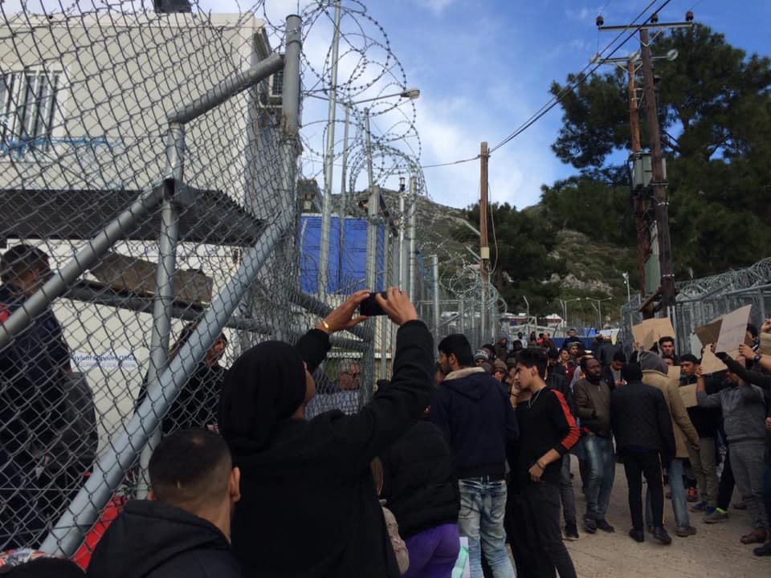
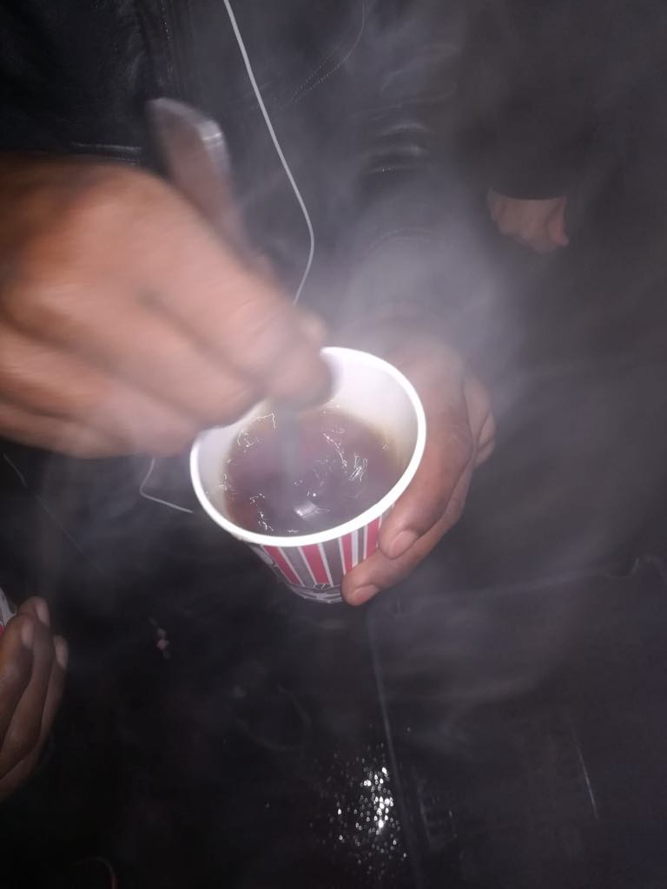

### AYS Daily News Digest 18/1/19: A system failing both the frontline states and people seeking safety
#### Amnesty International warning of the devastating consequences of the EU politics in the Mediterranean —read the analysis / SAR teams under pressure again / increasing number of arrivals to Greece and the area / Afghan minors sent to adults prison in Serbia / Pressure to volunteers in Bosnia and Herzegovina / more news

 ‎](assets/5e2ad98d08bd/1*aD2ZhdNAGbdMp0R0b2U5tQ.jpeg)

Photo: [Pothiti Kitromilidi](https://www.facebook.com/pothiti.kitromilidi?__tn__=%2Cd%2AF%2AF-R&eid=ARBd2y1L_pAbZCqMbMewBzYZ0uviGRN4aIlEQMyEWY638CTkDLpxiJX2iVZWGyCJJwTwsui3Lx7CbKUe&tn-str=%2AF) ‎
#### FEATURE

**_More women, men and children will suffer unless European governments agree on a swift and predictable disembarkation policy in line with international law and a fair system to share responsibility among EU countries\. —_** Matteo de Bellis, Amnesty International’s Migration Researcher

Under international law, people rescued at sea must be taken to a nearby place of safety, namely a country where they will be treated humanely and offered a genuine opportunity to seek asylum\. Avoiding legal and moral obligations, the EU states have continuously been giving the Libyan Coast Guard support to intercept people at sea and return them to Libya, where it is proven over and over again that they are subjected to arbitrary detention, and often torture\.

European leaders must urgently act to fix a system which deters states from assisting refugees and migrants in peril at sea, said Amnesty International in an analysis published today\. [**_Cut adrift in the Mediterranean_**](https://www.amnesty.org/en/latest/campaigns/2019/01/cut-adrift-in-the-med/) outlines how the outsourcing of European border control to the Libyan authorities, in combination with a system which fails to share responsibility for asylum\-seekers fairly across Europe, has created a situation where people are frequently stranded in the Mediterranean and SAR teams are prevented from acting in order to save lives\. The latest such example is the order issued by Spanish maritime authorities last week, preventing Proactiva Open Arms from rescuing people in the central Mediterranean\. The AI analysis also sets out steps to ensure situations like the stranding of the Sea\-Watch and Sea\-Eye rescue ships, and the blocking of Proactiva Open Arms, do not happen again\.

See their 2018 report [here\.](https://www.amnesty.org/en/documents/eur30/8906/2018/en/)

> “European leaders can no longer turn their backs on people stranded at sea and continue distorting the debate on migration for their own political gain\. They must urgently agree on a swift and predictable disembarkation policy in line with international law and on a fair system to share responsibility for asylum\-seekers among EU countries\.” 

#### LIBYA

There were 14 dead and 58 wounded people as battles continue on the outskirts of Tripoli in Libya\. In the conflict area Qasr Bin Gashir, citizens and refugees trapped in the detention centre must be transported securely while it is still possible\.

■■■■■■■■■■■■■■ 
> **[Sally Hayden](https://twitter.com/sallyhayd) @ Twitter Says:** 

> > Starting a new thread, as a fresh round of fighting in Tripoli means more than 200 men, women &amp; child refugees/migrants are trapped in Qasr Bin Gashir detention centre, on the front lines, without food or proper protection. #libya https://t.co/JOOA5OnrNc 

> **Tweeted at [2019-01-18 08:36:33](https://twitter.com/sallyhayd/status/1086180532008964096).** 

■■■■■■■■■■■■■■ 

> The people I’m in touch with say everyone in the centre is a refugee: they can’t return to the country they’ve come from bc of war or dictatorship\. They’ve all tried to get to Italy but were intercepted & returned to Libya by the EU\-funded coastguard\. Then they were locked up\. 

■■■■■■■■■■■■■■ 
> **[Sally Hayden](https://twitter.com/sallyhayd) @ Twitter Says:** 

> > A female refugee in Qasr bin Ghashir dc sent this photo, using a hidden phone. She says fighters came into the centre where they're being held yesterday, &amp; the head of the dc left. There are women &amp; young children there - they're on the front lines &amp; terrified. https://t.co/qAoteW1z1G 

> **Tweeted at [2019-01-17 16:19:43](https://twitter.com/sallyhayd/status/1085934703180423170).** 

■■■■■■■■■■■■■■ 

Since the beginning of the year a total of 25 people bodies have been found in the surrounding area\. It is impossible to know how many more are missing and have not been found\.

On Friday afternoon in the central Mediterranean, about 50 nautical miles off the North East of Tripoli, a maritime patrol plane spotted a raft sinking with about 20 people on board\. The crew of the plane, given the bad conditions, immediately launched SAR in the vicinity of the raft, which was continued by the Libyan teams with the support of Italian Navy\.

■■■■■■■■■■■■■■ 
> **[Flavio Di Giacomo](https://twitter.com/fladig) @ Twitter Says:** 

> > Shipwreck 50 miles off the Libyan coasts. @[ItalianNavy](https://twitter.com/ItalianNavy) rescued 3 survivors but there are maybe about 17 #migrants still missing. Waiting for more news. The 3 survivors are in difficult conditions and have been brought to #Lampedusa. 

> **Tweeted at [2019-01-18 20:48:37](https://twitter.com/fladig/status/1086364759857991681).** 

■■■■■■■■■■■■■■ 

#### MOROCCO

The country stopped 89,000 people from illegally migrating in 2018, up 37 percent compared with the previous year, the interior ministry said on Thursday\.

About 80 percent of migrants intercepted in 2018 were foreigners; 29,715 were saved at sea while 5,608 reportedly decided for a voluntary return to their home countries, the Moroccan ministry said\.

However, the [Association Marocaine des Droits Humains — Section Nador](https://www.facebook.com/AmdhNador/?__tn__=%2CdkCH-R-R&eid=ARClX7jcfLUv6ft1v3l4NTK2wxWvfUlq4ooUer6w_BDDf53BlMLsRdJkI1iswhajE5lI_G8nZH9tRfq0&hc_ref=ARTxSwfLyCqgszzTuqtRoB3-TiIsYY56lVJhI2FjddcE041ILrFq-DMu9YV7VN1Dgtc&fref=nf&hc_location=group) warn that their statistics rely on the number of documented attempts of migration, which vary from person to person — on average, people make from 4 to 8 attempts per year\.

In a recent shipwreck off the coast of Nador, 53 people are missing, presumably with only 1 survivor\.

> 2,217 died while crossing the Mediterranean including 744 on the western route, in 2018, the IOM said\. 

“We’re leaving people to die at sea by the hundreds, every year\. Trump, with his wall idea, would be proud of us\.”
By Emanuele Del Rosso
#### SEA

4216 migrants and refugees have entered Europe by sea through the first 16 days of the year, @UNmigration reports\.

That’s almost twice as many as during the same period in 2018 \(2,365\) \.
In the past 10 days, the number of those who lost lives at sea multiplied by 10, the [Salvamento Marítimo Humanitario](https://www.facebook.com/smhumanitario/?__tn__=%2CdkCH-R-R&eid=ARDuWi66A4OdZG6W2yJQHNxwnLcI7zOK0LdsoLu1wGzXuUoCkmx1te9OfFOG6mfX-SBMBeuG89tCG1gJ&hc_ref=ARRCZbezDPoVHWXNuE77BLl6lbzg8TjP7b72l0k1pX2Oqn5A1eIsQqkhYaPKIWIukf0&fref=nf&hc_location=group) says\.

■■■■■■■■■■■■■■ 
> **[Sergio Scandura](https://twitter.com/scandura) @ Twitter Says:** 

> > #migranti UPDATE via Radio Radicale 20:47 🔴 ALLERTA NAUFRAGIO PER UN GOMMONE PARZIALMENTE SOMMERSO CON 50 A BORDO e 2 persone in acqua, segnalato da Mrcc Roma via Maltaradio #navtex 18:23 (GMT+0), a 44 miglia ca. Tripoli est altezza costa Garabulli. In area #SeaWatch. https://t.co/wpblFnHVR4 

> **Tweeted at [2019-01-18 19:48:23](https://twitter.com/scandura/status/1086349601345622016).** 

■■■■■■■■■■■■■■ 

■■■■■■■■■■■■■■ 
> **[Sea-Watch International](https://twitter.com/seawatch_intl) @ Twitter Says:** 

> > People drowning and nobody there for rescue. No #EU sea rescue program, @[openarms_fund](https://twitter.com/openarms_fund) detained in Spain, @[seaeyeorg](https://twitter.com/seaeyeorg) searching for a harbour for a crew change, after Malta didn't allow that. We cannot cover the #MediterraneanSea alone. And we shouldn't have to. #SafePassage https://t.co/UErBGpnNQz 

> **Tweeted at [2019-01-18 18:44:07](https://twitter.com/seawatch_intl/status/1086333430986461186).** 

■■■■■■■■■■■■■■ 

The number of unregistered needs of SAR operations grows by the day\.

■■■■■■■■■■■■■■ 
> **[Oscar Camps](https://twitter.com/campsoscar) @ Twitter Says:** 

> > Sr @[sanchezcastejon](https://twitter.com/sanchezcastejon) Volviendo de un vuelo de reconocimiento, #Moonbird ha interceptado por radio el avistamiento por un avión italiano de una balsa parcialmente hundida con aprox  25 personas a bordo y otras ya en el agua.Un mercante estaba cerca, sin intervenir ¿Cuantos morirán? 

> **Tweeted at [2019-01-18 18:22:53](https://twitter.com/campsoscar/status/1086328087069900800).** 

■■■■■■■■■■■■■■ 

At the same time, more and more SAR missions with professional teams on board are prevented from helping and saving the lives of people at sea\. These are people who had few options but to board boats that offered the hope of gaining international protection overseas\.

■■■■■■■■■■■■■■ 
> **[maydayterraneo](https://twitter.com/maydayterraneo) @ Twitter Says:** 

> > 🆘ATENCIÓN🆘
🔊Nuestro barco #AitaMari, al igual que el @[openarms_fund](https://twitter.com/openarms_fund), ha sido bloqueado por el gobierno de España. No hay ningún barco de rescate en el Mediterráneo y las muertes no dejan de aumentar
#freeaitamari #FreeOpenArms #ElTiempoAhoga #EltiemposonVidas https://t.co/pSClJbHX4P 

> **Tweeted at [2019-01-18 18:15:51](https://twitter.com/maydayterraneo/status/1086326317992366081).** 

■■■■■■■■■■■■■■ 

#### GREECE

Despite the cold weather and poor conditions at sea, an increasing number of refugees who left Turkey have reached Greece recently\. [Reportedly](https://harekact.bordermonitoring.eu/2019/01/17/refugee-arrivals-to-cyprus-and-evros-from-turkey/?fbclid=IwAR0ZfQpdohVfk9sgOWOUKf7ypPqYj7M80Uxf9v_ropSQe59lZr2-4XlXWmI) , there were also arrivals in Cyrpus and Evros\.

 ‎](assets/5e2ad98d08bd/1*YVyh__hiIOU4ZBtEmrjyaQ.jpeg)

Photo: [Pothiti Kitromilidi](https://www.facebook.com/pothiti.kitromilidi?__tn__=%2Cd%2AF%2AF-R&eid=ARAnG9Uh4cmap99TFtGeyGDRIIibfkt_RyjazNZYW7uvNwA-L9HnSInpBp6yV3AhCYgSVH_W1zKJ9jeW&tn-str=%2AF) ‎

During the bad weather, with high winds, there were new arrivals of people in Katarraktis beach on the island of Chios, [Salvamento Marítimo Humanitario](https://www.facebook.com/smhumanitario/?__tn__=%2CdkCH-R-R&eid=ARAikANS490cu9lK4QwxqdbTl6E6Mg3RMoarDHhtY6MmNSKZbRJm2QGDCF7BvjCG1sqFPfqrayLc3sRK&hc_ref=ARR1PS4wNTHTS2aC7vGKBqSjXHZnxkc0H_W9PjI-vJYAtlySXZCoRzbAepfeW75hZv0&fref=nf&hc_location=group) team reports\.

48 people arrived in the first vessel: 5 minors, 26 women and 17 men, arriving from Congo, Cameroon, Mali, Algeria and Guinea\.

Later on, another group arrived on Karfas beach: 11 minors, 4 women and 7 men from Iraq and Palestine\.

4 people from Syria arrived with the third boat to Chios\.
One refugee missing from the morning arrival was found dead near Farmakonisi\. The remaining people were reportedly transferred to Leros\.

](assets/5e2ad98d08bd/1*J5eX8DWp-lVbznLHpx8lNQ.jpeg)

Refugees in protest in front of Asylum offices in hotspot at the island of Samos\. In the hotspot of Samos 2/3 of the refugees are out of the capacity and the living condition is horrible\. — [Refugee Accommodation and Solidarity Space City Plaza](https://www.facebook.com/sol2refugeesen/?tn-str=k%2AF)
### New centres opening in Greece

Two new facilities are set to open soon in a bid to ease the pressure on the overcrowded refugee camps on the north eastern Aegean islands of Lesbos, Chios, Samos, Kos and Leros, InfoMigrants r [eports](http://www.infomigrants.net/en/post/14555/greece-will-open-new-migrant-reception-centers-on-the-mainland?platform=hootsuite) \. The two centers will open “within the coming weeks” in Vaiochori, near Thessaloniki in the north, and in Kypselochori, close to Larissa in the central Thessaly region, according to state sources\.
### Greece’s treatment of migrant children subject to legal challenge before the European Committee on Social Rights

A [**legal challenge**](https://rm.coe.int/cc173casedoc1-en/168090390c) to the violations of migrant children’s social rights on mainland Greece and its North Eastern Aegean islands has been lodged before a European body specialised in the protection of social rights at the European level\. The legal action, taken in the form of a collective complaint to the [**European Committee on Social Rights**](https://www.coe.int/en/web/turin-european-social-charter) by the [**European Council on Refugees and Exiles**](https://www.ecre.org/) \(ECRE\) and the [**International Commission of Jurists**](https://www.icj.org/) \(ICJ\), catalogues the numerous instances of Greece failing its child care and protection obligations towards migrant children by leaving them in conditions of squalor, insecurity and violence\. Read more [here](https://mailchi.mp/ecre/ecre-weekly-bulletin-18012019?e=d7886dc795#Greece%E2%80%99s%20treatment%20of%20migrant%20children%20subject%20to%20legal%20challenge%20before%20the%20European%20Committee%20on%20Social%20Rights) \.
#### SERBIA
### Afghan minors sentenced and sent to adult prison

A group of six Afghans, three of whom are minors, were caught hiding in a truck near the city of Bačka Palanka, in an attempt to cross the border with Croatia\. The police arrested them and, as they reportedly had no money to cover the fine of 10000 dinars, all of them ended up in a single cell in a prison in Novi Sad\.

> “The police denied them the right to free legal aid, right to a translator and the right to state their case on the alleged misdemeanor\. \(…\) None of the other procedures that would determine their age were done, after which the whole process wouldn’t have taken place at all\.” — _Nikola Kovačević, Belgrade Human Rights Centre_ 

One of the boys that the lawyers of the Belgrade Human Rights Centre managed to speak to, with the help of a translator, spoke to them in the prison, saying he only speaks Pashto and at no point could he understand what was happening\. However, the president of the court in Bačka Palanka said to the [media](http://rs.n1info.com/Vesti/a452768/Maloletni-migranti-iz-Avganistana-zavrsili-u-zatvoru-za-odrasle-u-Novom-Sadu.html?fbclid=IwAR01FT0GpnDVTJjfyxVP85zPpcvP4rNr3-a4s5MpJDPR5KPNGb1oIu4VeZY) that they had respected the law\.
#### BOSNIA AND HERZEGOVINA
### Volunteer team of No Name Kitchen stopping activities due to pressure by the officials

The volunteers in Velika Kladuša have temporary been stopped from providing help to the refugees in the area, as some of them have overstayed their 90 days\. The group has been pressured by means of intimidation, restraint from providing activities and food, clothes and hygiene distribution\. Here is a part of what they posted on their official Facebook page:

> Today a volunteer was stopped and taken to the police station just for walking in the street\. Police officers visit the house where volunteers are staying at least once a week, but they have never been able to find anything with what they could charge us\. In one occasion, one of No Name Kitchen’s volunteer was followed home\. They were sure that he was a refugee, and he was held for a long time and asked to show his papers — all of which were in order\. They also visit the space for showers often, but they have not been able to bring anything against us, because we are actually doing nothing that goes against the rules\. We have always been kind to them and invited them to come see our work\. If you have nothing to hide, you have nothing to fear\. 

> On their last visit to our working space they came together with IOM workers\. We were given an appointment to talk with the local authorities\. Because they have not been able to find anything dark behind our work, they now force us to have some document which entails this long procedure\. We are not even sure if there is any law regarding this document\. 

\(…\)

> Our lawyers are working right now to see how we can negotiate this new requirement or if it is actually legal at all\. They seem to be aiming at having people moving as little as possible from IOM’s camp, 5 km from Velika Kladusa; a camp which many of its residents have described as a “prison from which you can go in and out”\. We would certainly leave Velika Kladusa if IOM provided the services that refugees really need and deserve, but this is not the case and we are aware that we must stay\. We do not want to leave hundreds of people abandoned here\. 

> IOM’s camp is far beyond its capacity\. People are not provided with clean or warm clothes and there is no place where people can wash their clothes to prevent infections\. Many people come to us daily asking for clothes, wood to keep themselves warm, heaters, blankets, access to showers or hygienic products — and sometimes even food\. 

#### BALKAN WEATHER forecast for Saturday, 19/01

**Montenegro**

Predominately cloudy in the south and centre; rain from time to time; some showers with thunder\. In the north predominantly cloudy with snow and sleet in the higher areas and rain in lower areas\. More intense precipitation at the end of the day and during the night\. Wind weak to moderate, at some places amplified, mostly blowing from the south\. The lowest temperatures from \-3 to 8 at night, and in the day from 0 to 13 degrees\.

**Serbia**

Moderately to mostly cloudy and cold, in the lower regions locally rain and in the mountains snow\. In the north and west rain during the day and in the lower areas transiting to snow\. Wind weak to moderate from the northeast and east\. The lowest temperatures from \-5 to 0 and highest daily from 0 to 5 degrees\.

**BiH**

Cloudy, snow and sleet in west and northeast Bosnia, weak snow and rain in the centre and north\. In Herzegovina rain and snow in the higher areas\. Towards the end of the day mostly no precipitation in the west, north and northeast\. Wind in Bosnia weak from changing directions and in Herzegovina weak to moderate southeastern\. The lowest temperatures form \-3 to 5 and highest daily from \-2 to 9 degrees\.

**Croatia**

Moderately to predominately cloudy, rain and possibly thunder in Dalmatia and towards the end of the day snow locally\. During the morning fog is possible land inward\. Wind mostly weak, locally moderate northeastern and eastern\. Alongside the coast southern, at places southwestern and at the other places moderate to strong Bura\. Lowest temperatures from \-6 to 8 and highest daily from 6 to 11 degrees\.
#### FRANCE

](assets/5e2ad98d08bd/1*1OOpCwB3Z1EI0DiC9QIIvA.jpeg)

Photos: [Solidarithé](https://www.facebook.com/solidarithe/?tn-str=k%2AF&hc_location=group_dialog)

> It’s freezing cold in Paris and WE NEED YOUR HELP\. Temperatures have dropped to an all\-time low\. No one should be sleeping outside in these temperatures\! There are Around 2000 people sleeping in the streets in and around Porte de Clignancourt, Porte de la chapelle, porte d’Aubervilliers, porte de la Villette and Saint Denis\. Temperatures are going to drop even further over the next few weeks, so we are doing a last\-minute run from London to Paris next Sunday to take donations down\. 

> We will be in Camden collecting donations THIS SATURDAY of:
 

> Winter coats/Warm jumpers/Other men’s clothing
 

> Blankets 
 

> Tea/sugar and coffee etc… 

> Please message us if you would like to drop anything off\. Get in touch with [Florence Taylor](https://www.facebook.com/florence.taylor3?__tn__=%2CdKH-R-R&eid=ARB2HaTQORk8QaI1AumhF32Vh7eJg_4h89b5rE-ZcgnGKlw5r03PB8SaZXda0LZyupc94GjuHRgw6RTl&fref=mentions&hc_location=group) for more information\. 

> We can do a lot more together, and Solidarithe is better in numbers\! Why not do a last minute collection in your office and we can pick up next week? — [Solidarithé](https://www.facebook.com/solidarithe/?tn-str=k%2AF&hc_location=group_dialog) 

**We also publish weekly summaries of some of the most important news reported during the past week in our Daily News Digest: here are the [Arabic](%D8%B4%D8%AA%D8%A7%D8%A1-%D9%82%D8%A7%D8%B3%D9%90-%D8%A2%D8%AE%D8%B1-%D9%8A%D9%88%D8%A7%D8%AC%D9%87-%D8%A7%D9%84%D8%A7%D8%AC%D8%A6%D9%8A%D9%86-%D9%81%D9%8A-%D8%A7%D9%84%D8%A7%D8%AA%D8%AD%D8%A7%D8%AF-%D8%A7%D9%84%D8%A3%D9%88%D8%B1%D9%88%D8%A8-4161fa56036) and [Persian](%DB%8C%DA%A9-%D8%B2%D9%85%D8%B3%D8%AA%D8%A7%D9%86-%D8%B3%D8%AE%D8%AA-%D8%AF%DB%8C%DA%AF%D8%B1-%D8%A8%D8%B1%D8%A7%DB%8C-%D9%BE%D9%86%D8%A7%D9%87%D9%86%D8%AF%DA%AF%D8%A7%D9%86-%D8%AF%D8%B1-%D8%A7%D8%B1%D9%88%D9%BE%D8%A7-998456a2a542) for the Week of January 7–13\. The new Weekly edition will be out during this weekend\.**

**We are an entirely volunteer\-run media team, and we rely on our supporters to share our news\. So please share, and never forget to ACT\!**

**We strive to echo correct news from the ground through collaboration and fairness\. Every effort has been made to credit organizations and individuals with regard to the supply of information, video, and photo material \(in cases where the source wanted to be accredited\) \. Please notify us regarding corrections\.**

**If there’s anything you want to share or comment, contact us through Facebook or write to: areyousyrious@gmail\.com**

_Converted [Medium Post](https://medium.com/are-you-syrious/ays-daily-news-digest-18-1-19-a-system-failing-both-the-frontline-states-and-people-seeking-safety-5e2ad98d08bd) by [ZMediumToMarkdown](https://github.com/ZhgChgLi/ZMediumToMarkdown)._
