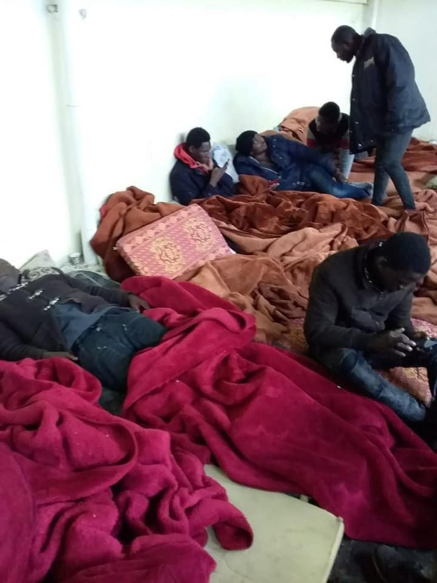
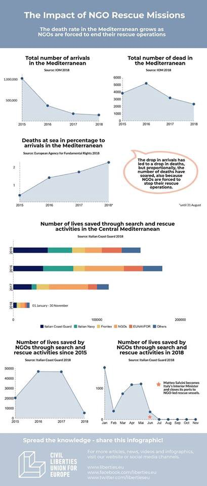
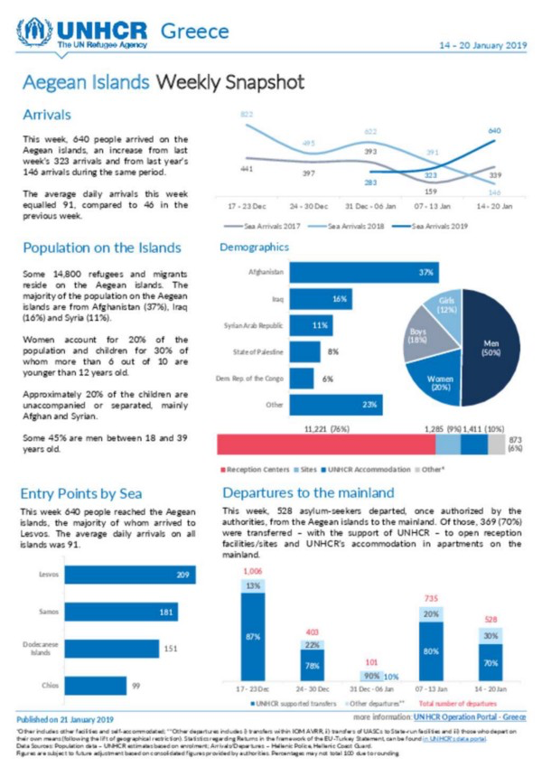
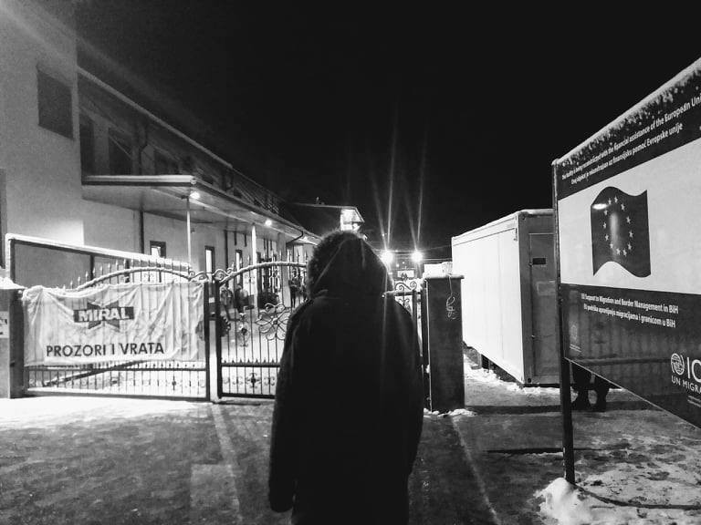
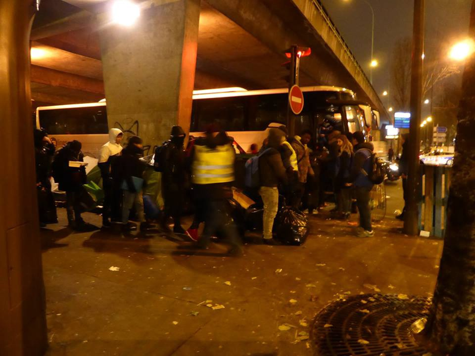

### AYS Daily Digest 22/1/19: Approximately 300 people returned to the Libyan hell\-camps — is this what success looks like?

_Lebanese police implicated in death of Syrian boy//illegal detention in Tangiers//refugees plea for UNHCR in Tripoli detention center//Report on civilian sea rescue//Open Arms rescue ship blocked//Sea\-Watch stuck at sea//New arrivals in Greece//Evictions in France and Italy//and more…_

](assets/d11e28a61986/1*mmfY8r-jayUd2vSVQfRAyQ.jpeg)

Rescued people being taken aboard the Sea\-Watch\. Photo Credit: [Sea\-Watch](https://www.facebook.com/seawatchprojekt/)
#### Feature — Approx\. 300 refugees forcibly returned

As [AYS reported yesterday](ays-daily-digest-21-1-19-in-the-first-21-days-of-2019-200-people-died-on-the-mediterranean-abc25fc0de5b) , it seems likely from a number of reports that approximately 150 refugees who were rescued from Libyan waters aboard by the Lady Sham cargo ship have been handed over to the Libyan Coast Guard and forcibly returned to detention centers in the country\. The [Alarm Phone](https://twitter.com/alarm_phone) group lost contact with the people aboard the Lady Sham sometime during the night, and failed to receive a number of photographs that the people were trying to send\.

■■■■■■■■■■■■■■ 
> **[Alarm Phone](https://twitter.com/alarm_phone) @ Twitter Says:** 

> > ... We don't know about their fate but according to @[fladig](https://twitter.com/fladig) they have been disembarked and taken to a closed detention centre. We don't have words to express the injustice playing out before our eyes. 

> **Tweeted at [2019-01-22 09:55:32](https://twitter.com/alarm_phone/status/1087649960118706176).** 

■■■■■■■■■■■■■■ 

This action violates both maritime and international law, as returning people to a country where their lives are in danger is not permissible\.

While it is widely confirmed that the people have been taken to a detention center, there have been conflicting reports about where\. Human rights journalist Sally Hayden suggested that the people [may have been taken to the Souq al Khamis detention center](https://twitter.com/sallyhayd/status/1087667487678910465) in Khoms, based on her contact with people inside the facility, and the fact that a large number of people arrived today\. Italian journalist [Sara Creta reported that they had been taken](https://www.facebook.com/creta.sara/posts/10218451721954276) to the [Kararim detention center](https://www.globaldetentionproject.org/countries/africa/libya/detention-centres/989/misratah-detention-centre) in Misratah Libya\.

Not only people aboard the Lady Shams have been forced back to hellish conditions in the Libyan detention centers this week\. According to the [UN Refugee Agency](https://medium.com/u/75f2bdd89854) , [nearly 500 people have been forcibly returned to Libya since Saturday this week](https://www.devdiscourse.com/article/international/341833-update-1-almost-500-migrants-brought-back-to-libya-after-foiled-attempts-to-reach-italy) \. Approximately 300 people have been forcibly returned on Tuesday, including the people from the Lady Sham and another ship, which has been confirmed by [Libyan authorities](https://www.facebook.com/libyan.navy/photos/a.1796366143939996/2243455139231092/?type=3&theater) \.

■■■■■■■■■■■■■■ 
> **[Sally Hayden](https://twitter.com/sallyhayd) @ Twitter Says:** 

> > For those following this situation in the Med, it looks like the group has now been taken to Khoms, Libya. 
If they're detained in Souq al Khamis dc, as many others are, they're at immediate risk of being sold back to smugglers: [irishtimes.com/news/world/eur…](http://www.irishtimes.com/news/world/europe/rescued-at-sea-locked-up-then-sold-to-smugglers-1.3759181) [twitter.com/alarm_phone/st…](https://twitter.com/alarm_phone/status/1087469942591705088) 

> **Tweeted at [2019-01-22 10:54:28](https://twitter.com/sallyhayd/status/1087664792213602304).** 

■■■■■■■■■■■■■■ 

### Lebanon
#### 14 year old boy chased to his death by Lebanese police

A 14 year old Syrian refugee named Ahmad Zoubi was chased to his death by Lebanese police, [according to Lebanese activists and the family](https://www.alaraby.co.uk/english/news/2019/1/21/lebanese-police-chase-syrian-child-refugee-to-his-death?fbclid=IwAR2_4AR7OBZ10hkIzHZGJOQZ9Kns6dd4vpbGhTk417Amg_aDsGGGxrK3HRM) of the child\.

The boy had been shining shoes in the street as a way to support himself, and after a report of a theft in the area he was pursued by the police\. Ahmad ran up an apartment staircase to escape, and fell down a six floor stairwell to his death\. People were outraged that the boy’s body was only recovered after three days, when police abandoned the scene without calling for medical help\.

■■■■■■■■■■■■■■ 
> **[Asaad Sam Hanna](https://twitter.com/AsaadHannaa) @ Twitter Says:** 

> > This poor Syrian child was died today in Lebanon while the Lebanese  police was chasing him because he was working on cleaning the shoes in the streets.
#SaveRefugees #SaveChildren https://t.co/DVaQyXECIb 

> **Tweeted at [2019-01-20 19:00:10](https://twitter.com/asaadhannaa/status/1087062244989505536).** 

■■■■■■■■■■■■■■ 

### Morocco

Over 50 reufgees have been illegally detained in a Tangiers police station, [according to the Human Rights Association of Morocco — Section Nador](https://www.facebook.com/AmdhNador/posts/2259824944229768?__xts__[0]=68.ARALv-eFfm_iDypesYoYEoME7SUziTKi98CXktUC7jaodrSvfXVPzBS6nZyVdRPKVkoLAJh_diryaRKT1u0IzFSZa6IvNixlOV06wuNWtLQ83aoaPOeSagj7yxFzsLCjNexeIToppZibpymyKPmhvdfKDYCntdLDQGq9oIgLtJqgkbOx_4xFKV2HyC2NzndJH9FeT_LSdWrZRR1qR82fE11_EoDnXugFCOEkTgSSgDeyJ7hqeQEMcvfAh1gFN42tNDeUvIU1fpmS5Z4kwJ5VHc8qE6v_Lce76wWzpk1PFTrXnafKpMX46ZNELZK4MBTBa-1JvefwNOPWXnaUx3IUlQglIvC_&__tn__=-R) \.

A photo of people in the jail that was shared with AMDH Nador\.
### Libya
### Refugees plea for help in Qaser Bin Ghashir

There has been fighting surrounding the Qaser Bin Ghashir detention center outside of Tripoli in the past week between local militias, which is threatening people stuck in the jail\. There has been no running water, electricity, or food given to the people inside for days, [according to human rights lawyer Giulia Trnachina](https://www.facebook.com/rastajuly/posts/10156399173633621?__tn__=-R) \.

 \. “They have sent me these pictures from August 2018, when the centre was already caught in the middle of heavy fightings and the refugees were begging UNHCR to save them\.”](assets/d11e28a61986/1*fZQoqFim6mN3WOuhRyRmKw.jpeg)

Photo Credit: [Giulia Tranchina](https://www.facebook.com/rastajuly/posts/10156399173633621?__xts__[0]=68.ARCpUXwzSlskILQLI9wthQ5Z2JEyGXpOLiAe4yR81q3UVOPISktptuG5wjFUxi8zw1StYj7P53AAiSHoZjj3Ir04KaTIIX1exRugvlySoQ2SgsW4ZDH5tlSWJHZVVPVrT4pOua89B52yxLfux2mJDiH9yutbhULkF_O0S0x9q5fXrwFauoc2pUYzV0LMyEOCMQAAamwC3bjC6JPLZw&__tn__=-R) \. “They have sent me these pictures from August 2018, when the centre was already caught in the middle of heavy fightings and the refugees were begging UNHCR to save them\.”

> Nothing has been explained or planned by UNHCR\. They went all the way to the centre to just interview 2 people who might be considered for evacuation as spouses\. Nobody else among the over 40 women, 10 children and 44 minors are being even considered for evacuation\. Nobody talked to any of them about any plans to get them out to safety\. Nothing at all… 

> Nothing has changed\. They have been starving, suffering and sick, writing to us since then with no help and no solution\. We cannot even imagine the trauma and impact that these human rights abuses are having on the detained children and babies\. If anybody has any idea of how to help them, how to pressure EU governments to stop their nazist policies, to offer more places to UNHCR for evacuation, to get [UNHCR LIBYA](https://www.facebook.com/UNHCRTripoli/?__tn__=%2CdKH-R-R&eid=ARDREwwXB-tLVXaXqQmKwxOps-xT6hqoZBsUlhNWcVGa4cG10quRTRJxEmm-Fx3_Nzg3Psw3NGSjpC-A&fref=mentions&hc_location=group) [UNHCR, the UN Refugee Agency](https://www.facebook.com/UNHCR/?__tn__=%2CdKH-R-R&eid=ARBx1dRGa4smz0YyC0bBA7nqnOXbyB3mgiUJHF98F4A3dOhrmkxB96GaBXkPafUsxPCgiPSSd6IVI6Zo&fref=mentions&hc_location=group) [UNHCR Italia — Agenzia ONU per i Rifugiati](https://www.facebook.com/UNHCRItalia/?__tn__=%2CdKH-R-R&eid=ARAY3wQpTqFjd6UAFX46Dv4JCWVCVKg2hQO9fnQbQgGpZQrJgYhmd9fJioMOuG1NgpqKZOQoaNCqw7Sl&fref=mentions&hc_location=group) to explain what they need in order to be able to help them, please take action\. They have lost all hope\. 

### Sea

](assets/d11e28a61986/1*YOvJIuXSNKAWD6k2iPv76g.jpeg)

203 — this is the number of people who have drowned in the Mediterranean already in the new year\. Phoot Credit: [MayDay Terraneo](https://www.facebook.com/MAYDAYTERRANEO/photos/a.138427050039725/395296347686126/?type=3&theater&ifg=1)
#### Fewer people are crossing the Mediterranean, but the journey has become much more dangerous

The European Union likes to celebrate downturn in the number of refugees reaching its shores as a sign of the success of its policies\.

While in 2018, 2,778 reached Italy from Libya in the first 20 days of January, in the same period this year a mere 156 people have arrived, according to the latest [data from the UNHCR](https://data2.unhcr.org/en/documents/details/67679?fbclid=IwAR0xmrduIo96e8oX_ZJpot4lzz5uRw6CUlECXJkq1B3BJ7rrJYK0Z753QXc) \. But at the same time, the journey has become more perilous than ever, and hundreds of people are being forcibly returned to Libya each week\.

This year, almost as many people have died on the way to Italy as reached it\. By the 20th, 156 people had drowned in the central Mediterranean\. By today, 203 people have drowned\.

A report released this week by a European human rights group shows the criminalization of rescue ships, and the policy of funding the so\-called Libyan coast guard has made the Mediterranean deadlier for refugees\. As the report shows, the sea\-rescue NGO’s have been highly successful at saving lives:

> [Data](http://www.guardiacostiera.gov.it/attivita/Documents/attivita-sar-immigrazione-2017/Rapporto_annuale_2017_ENG.pdf) from the Italian Coast Guard shows that NGOs have saved more than 90,000 people from drowning in 2016 and 2017 alone, far more than the Italian Coast Guard, the Italian Navy, Frontex or the European Union Naval Forces\. 

](assets/d11e28a61986/1*eUvC5AUkblmeZxS39kLq-Q.jpeg)

Volunteers from the Open Arms NGO\. Photo Credit: [Salvamento Marítimo Humanitario](https://www.facebook.com/smhumanitario/?__tn__=%2CdkCH-R-R&eid=ARCPUSqGZ2Anv7aOD0N0rqghbDnU3MnBiEIN4SvSq6pDiG0uKiNhh-keSVzXRxLjL2m2Pjj6ZcD2aNPl&hc_ref=ARQOjQmVdC_QxJIj2P5xU9trOZSe0732-kQKVwPJ5m6eQYZV3zC8UhPvBlevWaFwYw0&fref=nf)

Despite this, Italy and other EU member states have pursued a policy of detaining these ships, and often prosecuting volunteers\. The latest ship to fall victim to this trend is the vessel Open Arms, which has been denied permission to sail by Spanish authorties\. The stated reason for the denial of Open Arm to operate is that the ship did not follow regulations to drop rescued people off at the closest port of entry after a recent rescue\. However, the ship failed to do so because the closest ports of entry are blocking rescue ships\.

You can see the entire report [here](https://www.liberties.eu/en/news/the-impact-of-ngo-rescue-missions/16797?fbclid=IwAR2PPREGPCtThuiZE6PuAY2C2IV-DBYmG4ZXs0L9FMErkY1aKfC2OVsy1Tc) \.

■■■■■■■■■■■■■■ 
> **[Sea-Watch International](https://twitter.com/seawatch_intl) @ Twitter Says:** 

> > "Three numbers out of five don't work. The fourth number is answered by a recorded message saying "try again later". On the fifth number they say: "We don't speak English. Only Arabic." 
That's how the so-called Libyan Coast Guard works. [video.repubblica.it/dossier/immigr…](https://video.repubblica.it/dossier/immigrati-2015/migranti-quel-telefono-dei-soccorsi-libici-che-squilla-a-vuoto-ecco-cosa-succede-se-si-prova-a-chiamare/325041/325658) 

> **Tweeted at [2019-01-22 10:57:44](https://twitter.com/seawatch_intl/status/1087665612296470528).** 

■■■■■■■■■■■■■■ 

#### 4th day at sea for refugees stuck on the Sea\-Watch

Another week, another rescue ship stranded at sea\. It has been four days since [47 people \(including 8 minors\)](https://twitter.com/EleonoraCamilli/status/1087746312399978497?fbclid=IwAR1JJv5B57akWSDwsKRf4EVZ4WS8wCTiIPpH1d1oJfXZCTm0GCwaUPVdQ6I) were rescued by the Sea\-Watch, and the ship is still looking for a port of safety\. The ship is now close to Lampedusa, and has asked for permission to dock in Italy, which has so far been denied\.

“Times seem to have changed so much that even the saving of life is being questioned\. But it should be that simple: We are all equal and the dignity of human being is inviolable\. Or is that no longer the case?” [said Frank Dörner](https://www.facebook.com/seawatchprojekt/posts/2189470611271008) , the doctor aboard the rescue ship\.
### Italy
#### Evictions in Castelnuovo di Porto reception center

305 out of the 535 people living in the Castelnuovo di Porto reception center near Rome were [forced to leave](http://stranieriinitalia.it/attualita/attualita/attualita-sp-754/lavoro-migranti-sfruttati-nel-nord-italia-per-3-euro-l-ora-arresti-e-denunce.html?fbclid=IwAR0n0VdD6NcDKnWNA_M98k9Pd5cYM6AF66F2yca99dFI8_pk74rTYuvHCsU) on Tuesday\. It is not certain where they will be moved to, but likely other centres in Lombardia, Toscana and Umbria\.

The eviction is the result of the “Salvini decree,” passed in December of last year, which aims to abolish humanitarian protection for people who have not been granted refugee status in Italy\. This law is an not only an attack on the social integration of refugees, but an open effort to dispossess refugees and make them homeless\.

The centre will close by the end of the month, and the people who don’t have humanitarian protection will be left on the streets with no support at all \(as the decree intends\) \. The order of closure was sent last Friday and basically put into force immediately\. The eviction is planned to be over by Saturday\.

A number of people were [arrested for exploiting migrants for labour](http://stranieriinitalia.it/attualita/attualita/attualita-sp-754/lavoro-migranti-sfruttati-nel-nord-italia-per-3-euro-l-ora-arresti-e-denunce.html?fbclid=IwAR1fV7DlgqIM9PHXWzwHeFQ7g6hbft-aZRhdX1_9XOER6AyXuwm43UHs1Q8) in the provinces of Cremona, Bergamo, Reggio Emilia and Como\. The perpetrators were exploiting the people to collect and sort used clothing that was to be re\-sold\. The workers were being kept in deplorable and unhygienic conditions, and being paid a rate of three euros an hour\.
### Spain
#### High Court rules asylum\-seekers have right to freedom of movement

The Higher Court of Justice in Madrid ruled this week that people who have made an asylum claim in Spain have the constitutional right to freely move within the country\. You can read more about the decision [here](https://sjme.org/?fbclid=IwAR0coQ3pcuc0v_g0QVIKDw2_m9g410e7G4nWxy8tjvPNl2m55C5rv2UnuKc) \.
### Greece

New Arrivals \(figures from Aegean Boat Report\)

> So far today, two boats have arrived on Lesvos, one on Farmakonisi, carrying a total of 130 people\. 

> First boat landed behind the castle of Mytilíni, Lesvos south, 08\.00\.
 

> 40 people 
 

> No breakdown available\. 

> Second boat was picked up outside the airport, Lesvos south, 09\.00\.
 

> 43 people\.
 

> No breakdown available\. 

> Third boat arrived on Farmakonisi during the night, normally transported to Leros, but because the camp on Leros is overcrowded they were taken to Kos\.
 

> 47 people 
 

> No further information available\. 

#### Protests continue in Samos camp

Protests began in the Samos camp earlier this week, as AYS reported in the weekend digest\. People living in the hill\-side camp are protesting the near total lack of assistance from the authorities to provide shelter from the cold\. Protestors from the camp came into the town carrying signs and singing chants, including “we want freedom”\.
#### Call for solidarity in trial of activist on Moria

Sohel M\. is a Bangledeshi man who is well known within the Moria camp on Lesvos and to the authorites there as an activist for refugee rights\. He is [currently facing trial](http://legalcentrelesvos.org/2019/01/22/defender-of-migrant-rights-arrested-and-facing-criminal-trial-in-lesvos/?fbclid=IwAR2SLzlYx7y4ibCT5MovBJ83KCQ_oncQWKfJFfcMINjus_3F9WbiEJGp4sU) on charges that the Legal Center Lesvos organization have challenged as being “baseless” and intended as a retribution for his activism\. Sohel is currently facing the possibility of prison or deportation\. Supporters are calling for people to join them in on Thursday 24 January at 12pm in Mytilene Court to demand [\#FreedomForSohel](https://www.facebook.com/hashtag/freedomforsohel?source=feed_text&epa=HASHTAG&__xts__%5B0%5D=68.ARAEs0gfZsMOYtntjXEg7BtztFk_Y-v8FGsDrNsodQgrPcvIRnx97X4X5S4936w4wJTpvBp_GxvI39qIdOwgLp_aPIiIxP3X2LA2i4ONV-uCK-pZytIXjLTIrXXp8sN01ClXnfPm2QHQx2_5z4OWi3BkC0KbnA0sT8o6adLMVMdHUCdc4tqj1qY1tJ2cueIUSW6FD1t_yTnTKnDxH4oc32mSKZdCZBbcECm6dqP4PQZpuO0NlNgbXZBakKzFMCKNukGCNvH4wagtsuwaw0XUFLgFtC5y_B2EkxAV3VIND7rpRxjGTD8sdrQQe_TE9w3uunzmFxPZzjOK9gALQvQJvwdf17V0&__tn__=%2ANK-R) \.
#### Uncertainty surrounding number of people trapped on the Aegean islands

UNHCR has released their weekly “snaphot” of the appalling Aegean island camps\. According to their figures, 640 people arrived on the islands in this week, and there an estimated 14,800 people living in the island camps\.

There has consistently been disagreement between the estimates provided by the UNHCR, the Greek authorities, and volunteers\. Because they fluctuate the most wildly, it is widely believed that the numbers of the Greek authorities are the least accurate\.

However, the UNHCR estimates should also be taken with a grain of salt, as they are often based on the number of people who get cash assistance, and this is not received by everyone in the Aegean camps\. The [estimate made by Aegean Boat report](https://www.facebook.com/AegeanBoatReport/photos/a.285312485325196/512578422598600/?type=3&theater) , which was updated today to reflect new arrivals, shows that there are nearly 16,000 people trapped on the Aegean islands\.

The Team Humanity women’s center opened outside of the Moria camp today, to provide a warm place during the cold\. You can support the center [here\.](https://gogetfunding.com/warm-and-safe-place-for-refugee-children-moria-lesvos-greece/?fbclid=IwAR3sOVAxMOEw_eu6QsO0RWguGbK-clfRxTp-Hy_GYFEdYwsKyhOs9TLWWMQ)

The Jaffra foundation is looking for Greek, German and English volunteer language teachers to work in their center in Athens, [click here for more info](https://www.facebook.com/JafraFoundationinGreece/?__tn__=%2CdkCH-R-R&eid=ARBe8UOZ9HlksqZMfLrDXD_QhjDUVzVMX6sCql81xpRLPOmsE6W9bKouYIOGTb26cROgGUgQt2nNjVq9&hc_ref=ARTzhh5qJSzezjvjivq9XbnI9WVJT5w_bUFrorquipBaSxvqN4M44RZtMpzEqFu0Go8&fref=nf) \.
### Serbia

A report from Iran Wire has tried to uncover more on the death of Iranian migrant whose body was found near the reception center in Adasevci on 1 December\. His body is still being held in Serbia while the family is trying arrange transportation of the corpse to Shiraz\.
### Bosnia
#### IOM worker kicks refugee out in the cold

In the IOM managed Miral facility in Velika Kladusa around 10pm of the 21st of January, a resident was taking a video on his phone when he was approached by an IOM employee who attempted to take his phone away\. The man asked the IOM worker to let him keep his phone but assured him he would delete the video\. 20 minutes later, as the IOM worker was engaged in reorganising the sleeping places of residents in the camp, he became engaged in a verbal conflict with some of the camps residents\. The same man who filmed the video approached the IOM worker and asked him to not speak in such a rude way to the people\.

Allegedly the IOM worker then pushed the man, at which point the man pushed the IOM worker back\. The IOM worker then proceeded to take the man’s ID card away from him and kicked him out of the facility\. He was left without anywhere to sleep in \-3 degree Celsius weather\. He attempted to get back into the facility the next day but was prevented from doing so by security because he no longer had his ID card\. He is currently left without any accommodation\.

At 7pm on the 22/01/2019 an independent volunteer approached an IOM employee working in Miral to ask about the incident, and what they plan to do now with the man who is currently without shelter for a second night in a row\. The worker claimed that they have a zero tolerance policy for any physical altercations between residents and staff and that the man who was kicked out started the altercation, which is why he was removed from the facility and prohibited further entry\. The IOM worker informed the volunteer that he felt sorry for the man, but offered no solutions for his current situation\. IOM appears to have no contingency plan for such situations, and leaving people without shelter in below freezing temperatures is not an appropriate solution\.

Outside of the Miral camp\. Photo Credit: AYS

> [**Read our recent special about the Miral camp and the destructive influence of the IOM in Velika Kladuša\.**](ays-special-from-bosnia-killing-solidarity-in-velika-kladuša-be9045b1dfec) 

### Croatia
#### English Summary of Report on Asylum in Croatia from the Welcome Initiave

> 739 is the number of approved international protection claims with which the Republic of Croatia enters the new year\. From 2016 until today, 600 asylum claims, and 139 subsidiarity protection were granted\. Over the last few years, the number of granted international protections increased, but Croatia remains — in relation to some other EU Member States — restrictive in the approval of international protection; and at the same time one of the less desirable destination country due to poor quality integration system\. The quality of the system is greatly influenced by policies that are implemented by the institutions\. With that being said, we are particularly interested in the information that the new Demography Strategy is to be implemented, which anticipated shaping of the Migration Strategy\. Although Croatia has not had an official migration policy since 2016 which was based on the Act on International and Temporary Protection, we believe that migration policy would be appropriate for a better and more comprehensive approach to the migration phenomenon\. 

> Croatia participates in the program of resettlement of refugees from Turkey and, according to the latest information provided by the last group of arrived refugees, 50 people were moved and accommodated in the Asylum Seekers Reception Center in Kutina\. The State allocated for them 14 flats in the city of Rijeka, which recently joined the resettlement plan\. The city of Osijek already has some experience with the resettlement plan, and that process is described in the Integration Audit Report issued by the Center for Peace, Nonviolence and Human Rights — Osijek\. The report represents a good overview of the institutional and civil readiness for the inclusion of foreign nationals in public urban life and providing support for the establishment of such a system\. 

### Balkan Weather Report \(for Wednesday 23\.1\)
#### Croatia

It will be cloudy with possibly some rain, and short heavy rains on south\. There is possiblity of snow on the mountains\. Morning temperatures from — 1 to 8, daily temperatures from 1 to 13\.
#### Serbia

It will be cloudy, with snow in the north, west and east\. Max daily temperatures from 0 to 5\.
#### **Montenegro**

It wil be cloudy with possible raining, and short heavy rains on south\. There is possiblity of snow on mountains\. Morning temperatures from — 1 to 8, daily temperatures from 1 to 13\.
### Germany
#### Health Minister funds study to test age through ultrasounds

Bone testing has often been floated as a way to test whether minor refugees are ebing honest about their age, yet this approach ahs been widely dismissed by doctors and medical experts\. Now the German Health Minister Jens Spahn is spending €1 million euros on a new study to determine if ultrasound testing can verify someone’s age, according to a report from [InfoMigrants](http://www.infomigrants.net/en/post/14647/germany-looks-into-ultrasound-age-tests-on-unaccompanied-minor-refugees?fbclid=IwAR0BdU4DEgcaxqg4KFntxec7pVGsOeMz8xZc8FE__DWm3booIHvlNK22rfY) \.
### France
#### Evictions begin in Paris

A new round of winter evictions began this morning in Paris\. On the Porte Clignancourt approximately 200 people were evicted form their tents, [according to volunteers in the city](https://www.facebook.com/jeanjacques.clement.14/posts/2242326156036009) \. Some people lost many of their possessions as they were being taken away by the police and municipal authorities, despite efforts from volunteers to help\. Hopefully this evictions will result in more people getting shelter from the cold and not having to live on the streets\. However, based on previous cycles of evictions in France, this may not be the case\. Shelter provided for refugees in the wake of evictions is often temporary, inadequate, and in extremely remote parts of the country\. As a result, people ususally end up on the streets again\.

Many human rights and volunteer groups have condemned the way this round of evictions has been conducted\. The authoroties have been very opaque in terms of the relocation process for those evicted\. And as the volunteer group Solidarity Migrants Wilson pointed out in their [open letter](https://www.facebook.com/permalink.php?story_fbid=1064438347090270&id=598228360377940) , although 2,400 people are facing eviction from the streets, the authorities have only prepared accomodation for 1,200\.

](assets/d11e28a61986/1*JEtT37Mf-fdXOmz--yJvSw.jpeg)

Police and workers go through the encampment at porte Clignancourt\. Photo Credit: [Jean\-Jacques Clement](https://www.facebook.com/photo.php?fbid=2242323812702910&set=pcb.2242326156036009&type=3&theater)

Refugees were taken to temporary accomodation by bus afterwords\. But what happens next? The tents go up, and the cycle of harassment and eviction begins again… Photo Creidt: Jean\-Jacques Clement
#### Update from Calais

 \. “Cold and high pressure in calais… and one more wall\! Yes, we could tell you about the climate in Calais: all those exiles outside, about 500, in the cold, rain, mud, and soon snow\.
But the cold blow and pressure are also the government’s\. For two weeks, under the influence, perhaps blackmail, of the British government, the dismantling and destruction of tents, duvets, Personal Affairs by the police have increased, especially on Iranians\. Yesterday, the police evacuated the mattresses and sleeping bags of the young eritreans and Ethiopians who found shelter under a bridge, roundabout marcel doret\. In addition, a 3\-foot wall is built around the total service station nearby\.
Walls, fences, violence, cameras, projectors, drones, control devices, security guards, master dogs, barbed wire… Castaner comes Friday in calais\. He will still congratulate his police forces, ensure that the situation is well in hand\. But Calais is disfigured every day a little more, and inhumanity wins\. Nevertheless, we continue our emergency aid here in Calais, Grand\-Synth\. For a long time\.](assets/d11e28a61986/1*ZmoXbLWgjr0lWttNmAKvgw.jpeg)

Photo Credit: [L’auberge des Migrants](https://www.facebook.com/AubergeMigrants/photos/a.10152514841565339/10156611833515339/?type=3&theater) \. “Cold and high pressure in calais… and one more wall\! Yes, we could tell you about the climate in Calais: all those exiles outside, about 500, in the cold, rain, mud, and soon snow\.
But the cold blow and pressure are also the government’s\. For two weeks, under the influence, perhaps blackmail, of the British government, the dismantling and destruction of tents, duvets, Personal Affairs by the police have increased, especially on Iranians\. Yesterday, the police evacuated the mattresses and sleeping bags of the young eritreans and Ethiopians who found shelter under a bridge, roundabout marcel doret\. In addition, a 3\-foot wall is built around the total service station nearby\.
Walls, fences, violence, cameras, projectors, drones, control devices, security guards, master dogs, barbed wire… Castaner comes Friday in calais\. He will still congratulate his police forces, ensure that the situation is well in hand\. But Calais is disfigured every day a little more, and inhumanity wins\. Nevertheless, we continue our emergency aid here in Calais, Grand\-Synth\. For a long time\.
### Norway

On the 26th of January a solidarity event will be held in Oslo, protesting against worsening conditions for refugees in Lebanon and throughout the EU\. A Drop in the Ocean and LADC Norway are among the participants, [click here for more details](https://www.facebook.com/events/738015899925442/) \.

_We also publish weekly summaries of some of the most important news reported during the past week in our Daily News Digest: here are the [Arabic](%D8%A7%D9%84%D9%85%D9%84%D8%AE%D8%B5-%D8%A7%D9%84%D8%A7%D8%B3%D8%A8%D9%88%D8%B9%D9%8A-%D9%A1%D9%A4-%D9%A1%D9%A9-%D9%A1-%D8%A7%D9%84%D9%82%D8%A7%D8%AF%D8%A9-%D8%A7%D9%84%D8%A3%D9%88%D8%B1%D9%88%D8%A8%D9%8A%D9%88%D9%86-%D9%84%D9%85-%D9%8A%D8%B9%D9%88%D8%AF%D9%88%D8%A7-%D9%82%D8%A7%D8%AF%D8%B1%D9%8A%D9%86-%D8%B9%D9%84%D9%89-%D8%A5%D8%AF%D8%A7%D8%B1%D8%A9-%D8%A7%D9%84%D9%88%D8%B6%D8%B9-%D8%AD%D9%88%D9%84-%D8%A7%D9%84%D8%A3%D8%B4%D8%AE%D8%A7%D8%B5-%D8%A7%D9%84%D8%B0%D9%8A%D9%86-%D8%AA%D9%82%D8%B7%D8%B9%D8%AA-64cd585ecd9) and [Persian](https://medium.com/are-you-syrious/%D8%B1%D9%87%D8%A8%D8%B1%D8%A7%D9%86-%D8%A7%D8%B1%D9%88%D9%BE%D8%A7%DB%8C%DB%8C-%D8%AF%DB%8C%DA%AF%D8%B1-%D9%86%D9%85%DB%8C-%D8%AA%D9%88%D8%A7%D9%86%D9%86%D8%AF-%D8%A8%D9%87-%D9%85%D8%B1%D8%AF%D9%85%DB%8C-%DA%A9%D9%87-%D8%AF%D8%B1-%D8%AF%D8%B1%DB%8C%D8%A7-%DA%AF%D8%B1%D9%81%D8%AA%D8%A7%D8%B1-%D8%B4%D8%AF%D9%87-%D8%A7%D9%86%D8%AF-%D9%BE%D8%B4%D8%AA-%DA%A9%D9%86%D9%86%D8%AF-d7ecfe360045?fbclid=IwAR2wJJVlFyjGmbmaBFujDLxxZiuJ8Jz71LZ0c8YbHzv_OtsrmpKZvCCYrbc) for the Week of January 14–20\. Please, share the information with your Arabic and Persian speaking contacts\._

We also publish weekly summaries of some of the most important news reported during the past week in our Daily News Digest: here are the [Arabic](%D8%A7%D9%84%D9%85%D9%84%D8%AE%D8%B5-%D8%A7%D9%84%D8%A7%D8%B3%D8%A8%D9%88%D8%B9%D9%8A-%D9%A1%D9%A4-%D9%A1%D9%A9-%D9%A1-%D8%A7%D9%84%D9%82%D8%A7%D8%AF%D8%A9-%D8%A7%D9%84%D8%A3%D9%88%D8%B1%D9%88%D8%A8%D9%8A%D9%88%D9%86-%D9%84%D9%85-%D9%8A%D8%B9%D9%88%D8%AF%D9%88%D8%A7-%D9%82%D8%A7%D8%AF%D8%B1%D9%8A%D9%86-%D8%B9%D9%84%D9%89-%D8%A5%D8%AF%D8%A7%D8%B1%D8%A9-%D8%A7%D9%84%D9%88%D8%B6%D8%B9-%D8%AD%D9%88%D9%84-%D8%A7%D9%84%D8%A3%D8%B4%D8%AE%D8%A7%D8%B5-%D8%A7%D9%84%D8%B0%D9%8A%D9%86-%D8%AA%D9%82%D8%B7%D8%B9%D8%AA-64cd585ecd9) and [Persian](https://medium.com/are-you-syrious/%D8%B1%D9%87%D8%A8%D8%B1%D8%A7%D9%86-%D8%A7%D8%B1%D9%88%D9%BE%D8%A7%DB%8C%DB%8C-%D8%AF%DB%8C%DA%AF%D8%B1-%D9%86%D9%85%DB%8C-%D8%AA%D9%88%D8%A7%D9%86%D9%86%D8%AF-%D8%A8%D9%87-%D9%85%D8%B1%D8%AF%D9%85%DB%8C-%DA%A9%D9%87-%D8%AF%D8%B1-%D8%AF%D8%B1%DB%8C%D8%A7-%DA%AF%D8%B1%D9%81%D8%AA%D8%A7%D8%B1-%D8%B4%D8%AF%D9%87-%D8%A7%D9%86%D8%AF-%D9%BE%D8%B4%D8%AA-%DA%A9%D9%86%D9%86%D8%AF-d7ecfe360045?fbclid=IwAR2wJJVlFyjGmbmaBFujDLxxZiuJ8Jz71LZ0c8YbHzv_OtsrmpKZvCCYrbc) for the Week of January 14–20\. Please, share the information with your Arabic and Persian speaking contacts\.

**We are an entirely volunteer media team, and we rely on our supporters to spread our news\. So please share, and never forget to act\!**

**We strive to echo correct news from the ground through collaboration and fairness\.**

**Every effort has been made to credit organizations and individuals with regard to the supply of information, video, and photo material \(in cases where the source wanted to be accredited\) \. Please notify us regarding corrections\.**

**If there’s anything you want to share or comment, contact us through Facebook or write to: areyousyrious@gmail\.com\.**

_Converted [Medium Post](https://medium.com/are-you-syrious/ays-daily-digest-22-1-19-d11e28a61986) by [ZMediumToMarkdown](https://github.com/ZhgChgLi/ZMediumToMarkdown)._
