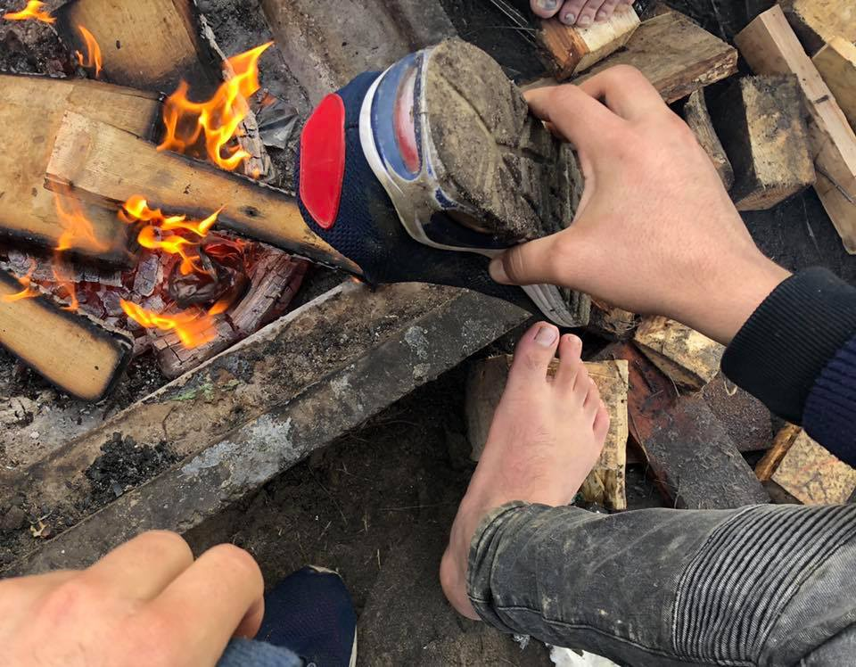
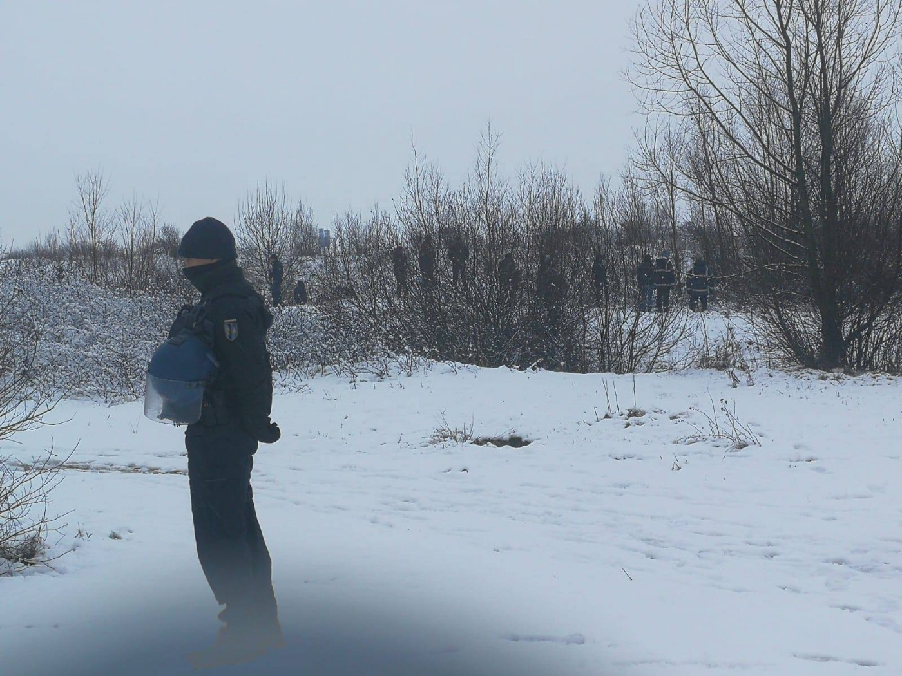
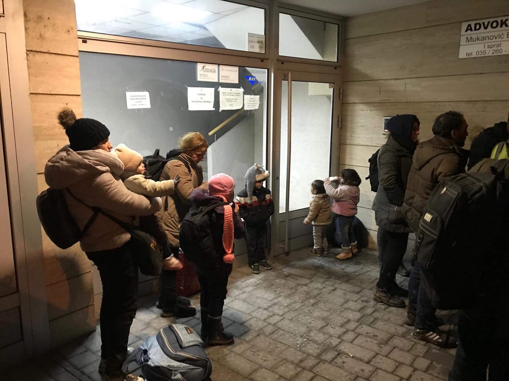
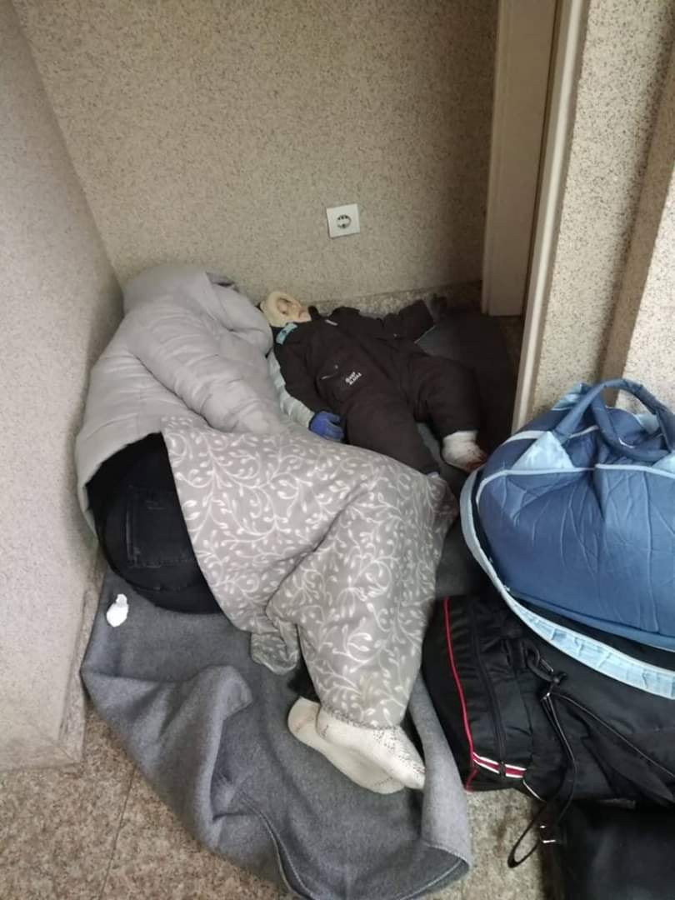
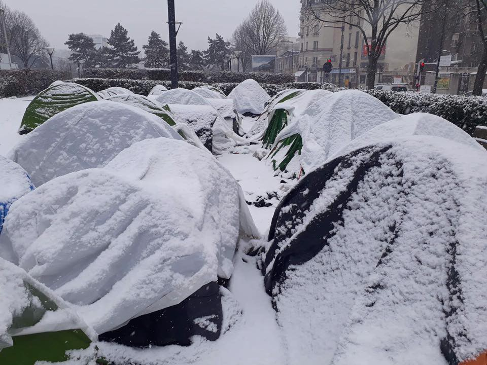

### AYS DAILY DIGEST 23/1/2018: People in Calais need help\!

_Number of organizations in Calais are appealing for help // Wall is getting bigger in Calais // Deportations from Turkey to Afghanistan // Operation Sophia in question // People on the move in Serbia and Bosnia with no help from institutions or UN agencies and big NGOs // Attack on refugee in German center_

By Care4Calais
### Feature

Calais is covered in snow\. [Help Refugees](https://www.facebook.com/111893659171316/posts/785450015149007/) group calls on everybody to share reports about the condition in the area and to write to the local authorities in Calais \( [pref\-communication@pas\-de\-calais\.gouv\.fr](mailto:pref-communication@pas-de-calais.gouv.fr) \) demanding the centres stay open through winter\.

“ _Roughly 1,000 displaced people are living in Northern France, half of whom slept outside in the freezing cold\. Four people died in Calais last January\. We fear another avoidable tragedy at the border if action isn’t taken immediately to protect people\. Temporary accommodation has opened, but without adequate transport, hundreds have been left outside\._

The state has a responsibility to keep the accommodation centres open throughout winter and keep vulnerable people safe and warm\. We urge the local authorities to act immediately and keep the centres open through winter and provide enough transport to get people to the centres before another death in Calais\.”

[Care4Calais](https://www.facebook.com/1046117708754519/posts/2284403794925898/) also sends an urgent appeal:

_“Rain is forecast every day for the next week and there are still many refugees who don’t have winter coats or proper shoes\. We have started extra distributions to keep people warm but urgently require more supplies\. We are appealing for the following:_

_Volunteers to do additional distributions including trips to Paris and Caen_ 
_\* Thermals — especially long johns_ 
_\* Joggers \(can be worn under jeans\)_ 
_\* Ski gear \(coats and trousers\)_ 
_\* Waterproof trousers_ 
_\* Bivvy bags to help sleeping bags retain heat_ 
_\* Gloves, socks, hats and scarves_ 
_\* Small tents and warm sleeping bags_ 
_\* Coffee, sugar and hot chocolate to take out every day_ 
_\* Funds to buy emergency supplies of all the above_ 
[Please donate](https://goo.gl/jmkx7A) \.

By Refugee Info Bus

[Refugee Info Bus](https://www.facebook.com/RefugeeInfoBus/posts/2323110677924347) adds to these reports writing about another eviction and police brutality\. On Wednesday morning, police arrived in a convoy, telling people to move their stuff\. Everything left behind was taken by the police\.

_“There is alternative accommodation available tonight until Friday, due to heavy snow\. However, in order for people to get to the shelter, they must travel very far\. We predict that those who were evicted this morning will return to the same spot, within minutes after the police convoy leaves\._

_Last night in Dunkirk, the council housed 160 people inside this gym, however, 132 tents remained outside, with around 200 people sleeping in \-2 conditions\.”_

While people are desperately begging for help, the governments are building even more walls\. One of the Refugee Community Kitchen in Calais, filmed part of the ongoing work at the border\.

**Well done Europe\!**
### Libya

Despite numerous media reports, warnings and pleas from human rights defenders involved in the work, the situation in Libya for people on the move is not improving\.

[Sally Hayden](https://twitter.com/sallyhayd) , a journalist currently focused on migration, conflict and humanitarian crises, reminds us that around 350 men, women, and children in Abu Salim are still waiting to be registered by UNHCR\.

_“They escaped directly from smugglers, and several were so sick they have since died in hospital\. Some are waiting months now\.”_
### Turkey

The Turkish government continues sending people back to Afghanistan\. As the [local media reports](https://www.evrensel.net/haber/371733/talibandan-kacan-afgan-multeci-zorla-ulkesine-gonderildi) , Yar Muhammed Akca, who was living in Turkey and supporting himself by working at various construction jobs, has been extradited to Afghanistan while his appeal process was still ongoing\.

Interviewed by a reporter, Akca said he had been in military service in Afghanistan when he started receiving threats from the Taliban\. The threats became so bad that he was forced to leave the service; however they did not cease, and he also found himself at risk as a deserter\. He was then forced to escape and entered Turkey two years ago at the eastern border close to Van\. He applied for international protection but was unable to register\.

On 14 December, Akca was arrested together with two Afghan co\-workers at their construction job\. A deportation order was summarily issued and they were incarcerated at the Harmandalı Geri Gönderme Merkezi \(Harmandalı Deportation Centre\. \) An appeal was lodged on his behalf by the Izmir Bar Association’s Refugee and Immigration Commission\.

Akca described the conditions at Harmandalı: “We immediately became sick once there\. It was an enclosed space with many sick people, so illnesses were easily transmitted\. It was also very cold\. I waited for a doctor or treatment for a week but got neither\. We had permission to go out for 15 minutes after meals, for a total of 45 minutes daily\. For us, this was like a prison\. Everyone was complaining about the conditions\. Most were not able to use their rights to use the telephone\.”

“One day around midnight I was called in\. An officer asked me to agree to a voluntary return\. I declined\. I was told that the officer in charge wanted to see me\. When I went downstairs, I saw that police officers were waiting for me\. They put handcuffs on me, put me on a bus and forcibly deported me to Afghanistan\. I am not safe here\. I am only able to visit my home and village secretly and stay for only a short while each time\. I want to return to Turkey but have no money to do so legally or otherwise\. It costs $4000–5000 to do so\. I have no money at all\. I have no money and no home\. I wish for the decision to be annulled and to be able to return to Turkey\.”
### Sea

[Watch The Med — Alarm phone](https://www.facebook.com/.../a.15261.../2299571453650418/...) has been alerted about six boats in distress in the Western Mediterranean, and five of them were rescued to Spain, and one intercepted back to Morocco\. All this happened during the one week\.

The [Sea\-Watch crew](https://www.facebook.com/seawatchprojekt/posts/2190172007867535?__xts__[0]=68.ARAz97WkEgT2GGf-jbMifNqD4wgkKezD9HDd1xD_V39WJi4wFpAgqmalRUwbWURilw8FvL4Mo8Wp2FFZhVdIJspQOmxpRiI20V9QND7bAfplaxVU83of-TDMnv9H0To8H7_LFVjIVL62hH5REOC-nkHmuWU8H1bqDD1DzhcspEQLBqknCBL0xgxRIpGzs4ga4-Y0af7yotBxp3kBn2Gl22LvjMfdU_pGPCuc9OgCWi2U0nD62Z-PeByK9s5EbNtccX-R2UgmA1yAtbtZQtXcMOw9byLXGrSBLEV8ruy8DQNlW5z-NOyJWtXnu5hPNjYifeRzXiKvubrOqhOt1kXJczIV6g0e&__tn__=-R) has also been very busy since the start of this year\. The stories their team members are faced with daily are heartbreaking\. This is an update from Sea\-Watch 3, still stranded at sea:

_“One boy has been telling me for days that he’s 15 years old\. I looked at him, sure that he was younger\. His friend told me he is making out that he is older than he really is because he does not want to face this life as a teenager\. He’s tiny, and really quite adorable\. He’s going to own up about his real age soon\. He’s 12 or 13\._

_I asked him what he’s doing on the ship, and where he wants to go\. In a second he replied “Marseilles”\. I asked why\. “That’s where my father lives,” he said\. This young boy is crossing the deadliest border on the planet to meet his dad\. And he’s doing it alone\! Open the ports man\!”_
### Europe

Starting in February, Germany will leave Operation Sophia in the Mediterranean, and will not be sending ships to take part in the anti\-people smuggling operation\. The 10 German soldiers currently working at the operation’s headquarters will, however, remain until at least the end of March, [DW reports](https://www.dw.com/en/germany-pulls-out-of-mediterranean-migrant-mission-sophia/a-47189097?fbclid=IwAR2f1PCRxZcs1-wch2LiW1hVnj3oBk8a81rYme3k0mT9kZcWN5PiNvwA8rI) \.

Operation Sophia, led by the EU, was launched in 2015 with the task to capture smugglers and shut down human trafficking operations across the Mediterranean, as well as enforce a weapons embargo on Libya\. At the moment, three ships, three aeroplanes, and two helicopters, which are permitted to use lethal force if necessary, are part of the operation\.

Additionally, its mandate includes training the North African country’s coast guard\. The EU formally extended Operation Sophia by three months at the end of December\.

In these three years since the operation was launched, they managed to arrest a modest number of human traffickers — over 140 — and to destroy more than 400 smuggling boats\. However, they were involved in rescue of over 49,000 people\.

The mission is in danger since Italy decided to close its ports, while they are asking that the mission has to be changed and the people who are rescued should be distributed fairly across Europe\.

Nevertheless, not all EU members states want to accept people who are looking for safety and shelter\.

Due to the Italian government’s attitude, Germany believes that the operation can no longer fulfill its original mandate\.

Stefan Liebich, a foreign affairs spokesman for Germany’s socialist Left party, called the government’s decision to suspend its involvement a “tragedy\.”

“As long as Sophia is not replaced by a civilian operation, even more people will drown,” he told the daily Süddeutsche Zeitung\.

Nevertheless, the operation should end on 31 March\. At the moment, some countries are negotiating about the possible extension\.
### Italy

[Kesha Niya](https://www.facebook.com/358467077831499/posts/826554911022711/) continues working in the border area of Ventimiglia, and seeing a daily average of 25 to 40 people, but much more on some days\.

_“We see many minors nearly every day\. We also see women \(sometimes with children\) regularly\. Since the beginning of January, we have received complaints that the French police have been stealing documents, identity papers, birth certificates from minors, medical papers, etc\. In response to requesting to have their documents returned, many people have reported police abuse\. In fact, we have heard of many incidents of pepper spray shot into the containers, slapping, punching, even small cuts and burns\._ 
_We have been seeking the support of French and Italian organizations, above all for legal assistance for these various human rights violations, but it remains difficult due to the lack of present experts and lawyers\.”_
### Greece

On Thursday 24 January 2019, Sohel M\. from Bangladesh will appear for preliminary hearings after being indicted on felony charges relating to a fire at the Moria Detention Centre in October 2016, according to the [Legal Center Lesvos\.](http://legalcentrelesvos.org/2019/01/22/defender-of-migrant-rights-arrested-and-facing-criminal-trial-in-lesvos/?fbclid=IwAR2jE-fB6nRG7nvvzUoRFjW0LsT3O4pC0ZpD8hZwV9XD0gv46a5b5WqdoxM)

This hearing was called by the judge to decide what criminal charges to raise against Sohel, and whether he will be freed from detention awaiting trial — which could be several months from now\.

LCL describes Sohel as having been a politically active and public figure in Lesvos for the last two years, saying that “it defies logic why more than two years after this specific fire in Moria in which no one was injured, the Greek state has decided to invest resources to prosecute a case that has no grounds\.”

LCL calls everybody to show solidarity and join them at noon on Thursday at Mytilene courthouse\.

_“Sohel has been living in Greece since July of 2016\. Arriving just a few months after the EU\-Turkey deal was implemented, he has been restricted for this entire time to the island of Lesvos, living most of this time in the notorious Moria Camp\. While Sohel personally faced persecution for his political activities in his home country \(and fatal political infighting is common in Bangladesh\), his asylum claim, like those of most Bengali nationals, was rejected\. He now faces baseless criminal charges\. The injustice Sohel has faced since he arrived in Europe is the only crime in this case\.”_
### Serbia

Despite a very harsh winter in the Balkan, with snow up to 1\.5m in some areas and subzero temperatures, people are still moving, crossing the border, full of hope to reach the EU and safety\. Many of them are on the road with their children, due to the closed borders and carelessness of those who should be in charge, being local institutions in individual countries or big NGOs and UN agencies\.

In Belgrade, volunteers from Info Park are tireless in their work\. Over the last couple of days, they noticed a number of people, entire groups sometimes, who are returned to Serbia by the authorities of other countries\.

_“Info Park protection officers reported that four families were returned from Bosnia over the last five days\. All of them were provided with appropriate assistance in the hub\. Three of those families, nationals of Iraq, stated they were returned to Serbia by Croatian border police after spending four months in Bosnia \(Bihać\)… Two men from Pakistan approached Info Park stating their readiness to return to Greece\. Allegedly, the main reason for such a decision is the expected support of the Pakistani community there\. They had been in Bosnia for six months before they attempted to continue their journey to Croatia\. They were returned by Croatian border police to Serbia three days ago\.”_
### Bosnia

At the same time, more people are crossing to Bosnia from Serbia\. Most of them are coming from Greece or Bulgaria\.

By Nihad Suljic, an independent volunteer in Tuzla\.

In Tuzla, local volunteers are trying to support all those in need\. During Wednesday, several big groups came, some even during the night\. Those who arrived during the night did not have any other option but to stay outside\.

Tuzla, children left to sleep in the streets\. By Nihad Suljic\.

People are passing through Tuzla on their way to Sarajevo, and further on to Bihać\. No help, but from volunteers, is offered to them in Tuzla\.

When some of them finally reached Sarajevo on Thursday morning, volunteers called the IOM mobile team to transport them to the camp\. Even though the group had at least six children with them, IOM told them they had to come by themselves using public transportation\.

The temperature in Sarajevo was \-3, and the city was covered in snow\.

IOM has two cars in their mobile team — one stays in the camp for emergencies, and the other one is available, but obviously not very mobile\.
### France

In Paris, covered in snow this week, over 2000 people are forced to sleep rough on the streets\.

By Calais Action

[Calais Action](https://www.facebook.com/1018579608194544/posts/2378167608902397/) reports about evacuations this week, when a number of people have been taken to the shelters, but warns that more people are outside and need help\. So far, only 170 have been evacuated\.

**_“People are sleeping in the snow\. In 2019\. We have allowed this\. It’s just horrific\.”_**
### Germany

The [Refugee Struggle for Freedom](https://www.facebook.com/159945670862898/posts/1004331876424269/) group reports about two refugees from Africa who have been severely beaten in the Deggendorfer Asylum\-seekers camp on 22 January by the security staff\.

_“It happened that a woman went to the canteen for dinner and the security staff asked her about her white card, the card people get in camp to eat in the canteen\. This woman took the white card out of her pocket and showed it to the employee, and he asked her to give it to him\. She replied that she had already shown it to him and she was sure this was enough\._ 
_Then the woman tried to enter the canteen and the employee of the security firm put her up against the wall and pressed her with his elbow\. A man had been watching the scene from the beginning and tried to intervene to prevent the woman from being hurt\. Then this man was attacked by the security personnel and massively beaten\. There are photos of this man to prove his condition\. Besides, a video shows the woman crying and screaming\.”_

The man and woman who were beaten up were taken to the hospital, while other people at the camp plan to protest and demand their right to be respected\.

[Petition against](https://www.openpetition.de/…/verhinderung-der-abschiebung-…) the deportation of a 21 year\-old Iranian to Iran \(in German\)
### General

_“Hey, friends,_

_As most of you know, Raghad is my daughter\. She is now three years old and we have been in Athens for three years too\. During these three years, Greece has refused asylum for me and my daughter, as well as a custody case\. Raghad currently has no nationality\. I do not have custody of Raghad and to gain custody of Raghad, we need to pay €2000 for the lawyer’s fee\. We worked with a lawyer pro bono in 2018, and after waiting for one year the custody case was also deined, as the lawyer did not do the correct paperwork for the case\._

_I need custody of Raghad so we can secure her future as a human being, as my daughter and as the independent woman she will grow up to be\. Currently, Raghad has no rights, and I as her father want her recognised as a human being and more than anything, for us to be able to live a safe family life together\._

_I need an initial down payment for the lawyer of around €400 and as time goes on I hope we can reach the goal\!_

_Any donation or a share amongst friends would be hugely appreciated,_ 
_Thank you all\! \!”_
- [Hussein](https://www.gofundme.com/cnnes-fundraiser-for-legal-fees?fbclid=IwAR3TUhYeEmUDHgYT503w7LkryOg8ZyWxemtCO2e_3KDHcrPSsmI0B1i3ha8)

**We are an entirely volunteer media team, and we rely on our supporters to spread our news\. So please share, and never forget to act\!**

**We strive to echo correct news from the ground through collaboration and fairness\.**

**Every effort has been made to credit organizations and individuals with regard to the supply of information, video, and photo material \(in cases where the source wanted to be accredited\) \. Please notify us regarding corrections\.**

**If there’s anything you want to share or comment, contact us through Facebook or write to: areyousyrious@gmail\.com\.**

_Converted [Medium Post](https://medium.com/are-you-syrious/ays-daily-digest-23-1-2018-people-in-calais-need-help-c6ff05da27f4) by [ZMediumToMarkdown](https://github.com/ZhgChgLi/ZMediumToMarkdown)._
