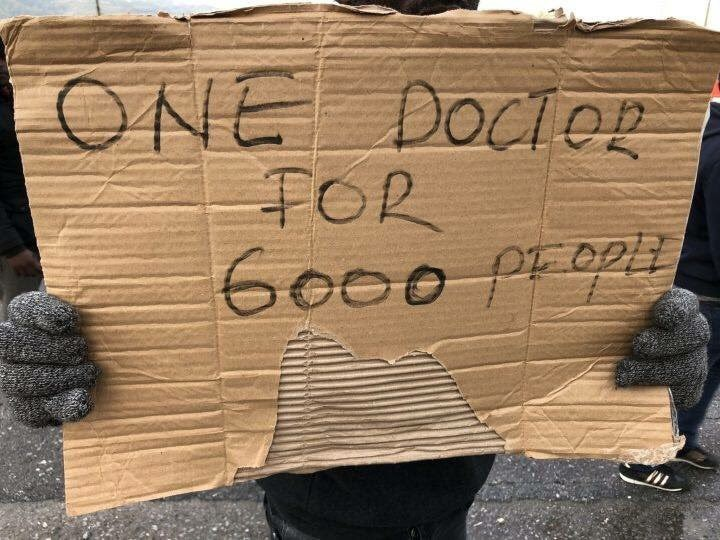
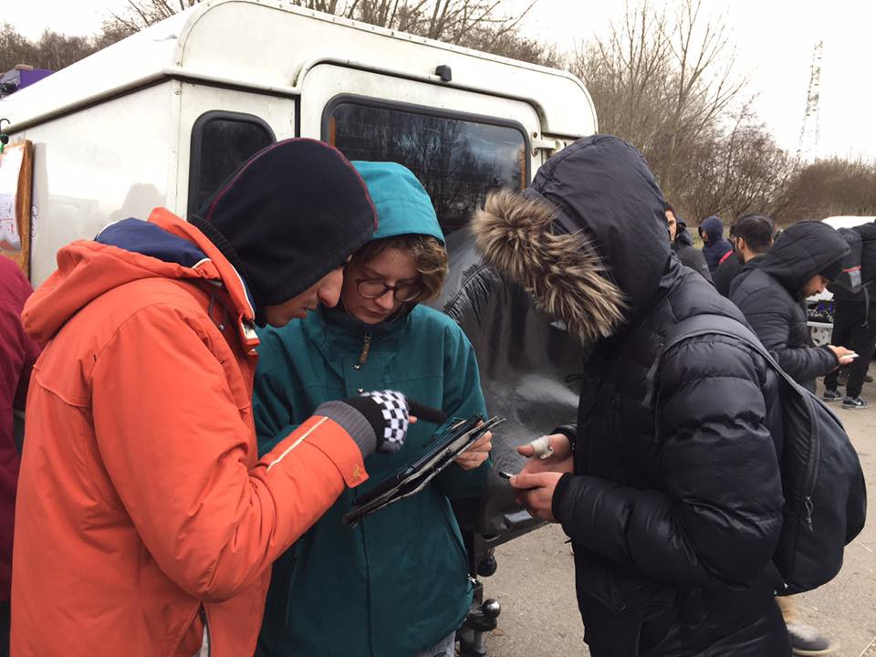

### AYS Daily Digest 24/01/19: Cyclone Producing 7 Meter Waves Hits Mediterranean
#### 47 people rescued on Board Sea Watch 3, denied access to Italian Ports as Weather Worsened in Mediterranean//100 people remain trapped in Nador Detention Facility//Situation in Libyan Detention Camp Mistrata Deteriorating// Weather Warning for Greece// Fourth Day of Protests on Samos// Salvini to Close Largest Reception Center in Europe Cara Mineo// 2000 people Sleeping on Streets of Paris// UK returns people who crossed the English Channel from France… And more…


](assets/156f689ab334/1*oPj0ymeJO_hmxDTVasLUFg.jpeg)

Source: [Federico Scoppa](https://www.facebook.com/Scoppa.Photos?__tn__=%2CdCH-R-R&eid=ARBkkqscVe2uqeFLDVDktHzOFqKR7dOhI7nkL50qjsD_eHpknMYkONC4_Vxf6eKEW-QnFozRctyDy3Fw&hc_ref=ARSEMCTjHMEvGNcZ2Xx3ON5YVVDdTEYQucTIQql8RAY0O2JjptJqYS01CLPdkeX1Iy8&fref=nf)
#### Feature:

Five days ago the SAR vessel Sea Watch 3 rescued 47 people from a shipwreck in the Mediterranean, including 8 unaccompanied minors\. It is reported that around 100 others drowned in the incident\. Since then, the rescued group has been stranded on board the vessel, which has been prevented from disembarking on any Italian or Maltese port\. As weather conditions worsened and a rare Mediterranean cyclone that produced waves up to seven meters, Sea Watch 3 spent the day sheltering from the bad weather conditions close to the coast of Eastern Sicily\.


■■■■■■■■■■■■■■ 
> **[Sea-Watch International](https://twitter.com/seawatch_intl) @ Twitter Says:** 

> > 🔴 We’re facing a Mediterranean cyclone, a rather rare weather phenomenon with waves of 7 meters, rain and icy wind. #SeaWatch is sailing in this storm and looking for shelter, on board are 47 people rescued out of distress last Saturday. https://t.co/UoEw0y0i0j 

> **Tweeted at [2019-01-24 11:39:27](https://twitter.com/seawatch_intl/status/1088400885351366656).** 

■■■■■■■■■■■■■■ 


International Maritime law states that a place must be assigned for those on board, but Italy continues to ignore these laws\. People continue to be denied safety\.

[MEDITERRANEAN Saving Humans](https://mediterranearescue.org/en/news-en/immediately-a-safe-harbour-for-sea-watch-3-mediterranea-ready-to-intervene/?fbclid=IwAR2kGq7gFy1lpW_gW5IaC9kdNTMIxwso3JIX-j4fnwVz_aF0SitQd4nCGYs) asks for compliance with International Law, and appeals to the civil society of Italy, and mayors to allow Sea Watch 3 into their They also declare that they are ready to assist Sea Watch 3 immediately with their own assets to intervene in support of Sea Watch 3 by any possible means\.


> 7m high waves, rain & icy winds in the [\#Mediterranean](https://www.facebook.com/hashtag/mediterranean?source=feed_text&epa=HASHTAG&__xts__%5B0%5D=68.ARBZxk6ftGV4CUaXEmL7K2geN7uPxRiL-g7hUQvwQqpLtCMs54R3gDq-Xgu9q88yqkLGya6DfTKzmzGb60FkIHBxvqkCZYov86W4tNcQIa7lW2cz5zj3g2rBFSnoOgokf7-Ar9Lf6dufX8mjbphzwIp8nI7wl2jbke5MKznaCpBgAeUVfzR_fNGqAEowynhVfCEk8egdPR1_FTyxOfUQY7f6jhhJdNUzJMNlhIIlU3IrgjR62khAoBNfFmirnnMyUlz-3-TyZJ_DPkge4P2631JtLpZfbD0Zgyog7cXvLLj_fxd1pwvW_k87ys2mpjjPyDXIZSdD4rgrp_MI13N4EFuyfA&__tn__=%2ANK-R) : conditions [\#SeaWatch3](https://www.facebook.com/hashtag/seawatch3?source=feed_text&epa=HASHTAG&__xts__%5B0%5D=68.ARBZxk6ftGV4CUaXEmL7K2geN7uPxRiL-g7hUQvwQqpLtCMs54R3gDq-Xgu9q88yqkLGya6DfTKzmzGb60FkIHBxvqkCZYov86W4tNcQIa7lW2cz5zj3g2rBFSnoOgokf7-Ar9Lf6dufX8mjbphzwIp8nI7wl2jbke5MKznaCpBgAeUVfzR_fNGqAEowynhVfCEk8egdPR1_FTyxOfUQY7f6jhhJdNUzJMNlhIIlU3IrgjR62khAoBNfFmirnnMyUlz-3-TyZJ_DPkge4P2631JtLpZfbD0Zgyog7cXvLLj_fxd1pwvW_k87ys2mpjjPyDXIZSdD4rgrp_MI13N4EFuyfA&__tn__=%2ANK-R) with 47 rescued people onboard are now facing\. 


■■■■■■■■■■■■■■ 
> **[Sea-Watch International](https://twitter.com/seawatch_intl) @ Twitter Says:** 

> > For all those who find 7 meter waves in the #Mediterranean hard to imagine:

At 2m life is getting uncomfortable on #SeaWatch3.

At 4m the ship turns quiet – whoever can stay in bed, does so.

At 5m we start worrying.

6m and more: We need a #PortOfSafety, now! https://t.co/ILPrcqP3eC 

> **Tweeted at [2019-01-24 16:40:34](https://twitter.com/seawatch_intl/status/1088476664433180672).** 

■■■■■■■■■■■■■■ 


The 47 rescued people on board spent the day sheltering in a makeshift tent on the deck of the ship during bad weather conditions\. As weather conditions continued to worsen, Sea Watch 3 was finally allowed to anchor in Sicily by Italian Authorities\.

A d [emonstration against Italy’s treatment of Rescue Boat](https://www.facebook.com/events/889163371278976/) has been planned for today\. A new petition has also been created to support the Sea\-Watch 3\.
```
GOVERNMENT MEASURES AGAINST RIGHTS AND DIGNITY!
We have great responsibilities before us: to rebel and disobey unjust laws, to reiterate and build spaces of solidarity, to leave the social networks to meet in the streets and streets to rediscover so many * and divers *.
Open ports, borders, our cities, streets and squares because without dissent there is no democracy.
Open citizenship to present and future generations
Affirming the rescue on land and sea as an indisputable and just action.
Let us also save ourselves to remain human *!
This is why we are waiting for you on Friday 25th January at 5.00pm in Piazza Esquilino,
```
#### MOROCCO

Nador New reports that a group of unaccompanied minors from Morocco arrived in Nador early in the morning\. Local media has reported that they were intercepted by members of the civil guard\. Some of them were treated for symptoms of fever and cold by The Red Cross\. They are expected to be transferred to the overcrowded unaccompanied minor accommodation center\.

[Association Marocaine des Droits Humains — Section Nador](https://www.facebook.com/AmdhNador/?__tn__=kC-R&eid=ARBuw36HRe2hvFPUb0oVTYNIPiwlARUf1Zx7FTRCVR3tCk7N3_ahqwTjBu_JYqLd-5U0YbOxpQdVq2K0&hc_ref=ARTK11bfNUOBotpvsAx3zQTJ63lQP6LggmgEWCElXXLFGMx1F6lur1RvLo2W4cz4ixc&fref=nf&__xts__%5B0%5D=68.ARDFK01SCewx0f9Bq8S7tDx5WidoinAbkTE_LZpA_X6KwLjZyQ52ciY2XHlElBcnRCExOMYbIKwOu7YBD0bTwNrtYOBeI18wis15koC-6UIdQEdHisbD5IG0PbH6Yd7qCvCqVvQsNHdTu8bXJU0IBP3DSVZmEYtsmIgutLS6YMC8busoArymPAzMzy-MiW5oCkfYSTd5qoB_HyoikAe8gicCga-mmAXtSzmphOYp0sjkNJT8Avk3Pfuio3vXD8ueOWibwpF7TGBiRdQ0YabyJ0tltLLkC8h0ZmjLpSr0XHnN31e8qmClKIXBjXcX2OUwEL60YrxQjtk7S-APkzik-yZivh03) reports that the detention center of Nador is still open\. Over 100 people on the move who have been arrested are currently detained in the facility\. People are banned from visiting the center and the authorities continue to refuse to move or open an investigation into the release of those detained\.

[Spain continues to advocate for Morocco](https://www.moroccoworldnews.com/2019/01/264169/spain-eu-morocco-border-control/?fbclid=IwAR1bJb4m3D6Yj6gchL3SdOHfC_fSkpqq9Bd_S83ns8uFI7jbyVXIZJd4qTk) to receive greater funding from the EU in order to run it’s campaign against ‘irregular migration and terrorism\.’ The European commission granted Morocco €140 Million in December 2018 to “ To address irregular migration in response to increased migratory pressure along the Western Mediterranean Route\.” Spanish Secretary of State for Migration Consuelo Rumi insists for the EU Commission to release the financial aid before March 2019\.
#### LIBYA

[Watch The Med — Alarmphone](https://www.facebook.com/watchthemed.alarmphone/?__tn__=kC-R&eid=ARBBNLz-qFwKhuwZHLwFhaelKjc9yvJZx7i1JnPilOhWfj5bT6erLbNdtue_ZuF2rF0-SkD_SUHfyPKM&hc_ref=ARTzOGSpprG2-y_X_AzJm-VgjRgd9zsPdJCzoIzxI5Ftpk2S3NEo8TVEblwekLtY6co&fref=nf&__xts__%5B0%5D=68.ARAj9O7eCN5jjkB7y7pVTB_ck6l5QolWAtZmt2eMy0bAW87bKmCqseBIBq1zTICQ3IihsvJg23vu2tmsjNXXPNB4ik_Hx2Uc40Wf7Q3JQyPPt_KSJYWBlzSAxn5t38hGdzye2F4E5d3BpaNeb1rLnueygyFqDjCOFzxauZ6a04vnwF9pKQQZ5Z-qWsHeTDc9OOp_5MMmsyJarwcgEMyUAWVwjcqk9TtGCUtn_6CaK8eJAA1wmuVgzfKQCvQYciK3ObaM12odUbJsD4KWT1NJppxEypJnui9CHTJnh_UMTALTFPSjo_z3TK9Ei2ksNZ3V_0VkQ6tdcecjLGPTqJsoRkMS97Lv) reports on the situation in Libyan detention centre Mistrata\. They have attempted to keep in contact with the people detained but their reception broke off reportedly after military entered the facility\. It is feared that phones were confiscated\. Before the connection broke off, some women they were in contact with reported that they attempted to break out of the prison, but were met with military men with guns who pointed them at them\. It is believed that 500 people are inside the prison\. They request media attention, food and doctors\.

[MSF reports that people](https://www.msf.org/migrants-and-refugees-returned-overcrowded-libyan-detention-centres-libya?fbclid=IwAR0AXChBMGMUDfDyJfsm-W6te-80YFfrwioGWb6404EDpf6CQg4vPSN_UiE) ‘rescued’ by Libyan coast guard continue to be illegally brought back to crowded detention centers in Libya, exposed to dangerous conditions\. They report that over the past two weeks the number of people held in detention centers Mistrata and Khoms ahve sharply increased\. The population in the detention centres in the area has increased from 650 at the beginning of the year to 930 today\.
#### SEA

47 people remain trapped on board of SAR vessel Sea\-Watch 3 as 7 M waves bad weather conditions are predicted to hit the Mediterranean\.

The Commandant General of the Italian Coast Guard has praised the work of the Libyan Coast Guard, proclaiming ‘The colleagues of the Libyan Coast Guard are doing a great job, thanks to projects of the European Community, but above all to the patrol boats provided by Italy and the Training we have provided\. The Mediterranean is not a grave\.’ Despite his words the reality is 200 people have already lost their lives at sea in 2019\.

In this time, search and rescue vessels continue to be blocked from saving lives\. [Mare Liberum](https://www.facebook.com/MareLiberumOfficial/?__tn__=kC-R&eid=ARA89mWTmyuI5ZsK4HgV_b1CwH_owqJwjvqUzuGvITOK2dVXm0Igx_wLjLjbkwKrFM1mop_kVuECiHxA&hc_ref=ARRsHzRQVtOW0eRKaeXs2pi6Z3tk_pCvQY7GVmF5kL9-lixuz8obsp_VAyIVVI7dfT8&fref=nf&__xts__%5B0%5D=68.ARAsUUSebp6qgK19I7_cnF-8Lkun-WhPOAr9E08tkTu9AxM5NIzULlDYiTFNpgeV1f770SduHHXxCsH_aU_m5Pk3ap4F-YTxA4_dHDCdhdLt-SXVITLTPQtLa8dp0Qs-WNyaXmdf0Oe1BmZXP9htWVzMrqCmdY6wfHsSH7WbyCTsvpbJJMl0gLFN71dvu3aHN1U2TETzmLR9MrumsmXIgDZOMkBVmIdyKcGCvG1nF0WrEh7IovvjijH0jJ9E_pQQvKk02_M2nE38ZamdPcUFkiA9AKS4NLAepR6-4iVV_-Ov52z-c0byrydyRd56k_AEHInMIboIht4cFFMV-rSEUoY) stands in solidarity with Chios [Salvamento Marítimo Humanitario](https://www.facebook.com/smhumanitario/?__tn__=K-R&eid=ARAnImh3UwpOl0ZFCLURiWJknnW5G_39bXOfOzHnQrqQ-swOg3LRk_IjgEfgHMWMTbwFQ0ZW65QB3-9u&fref=mentions&__xts__%5B0%5D=68.ARAsUUSebp6qgK19I7_cnF-8Lkun-WhPOAr9E08tkTu9AxM5NIzULlDYiTFNpgeV1f770SduHHXxCsH_aU_m5Pk3ap4F-YTxA4_dHDCdhdLt-SXVITLTPQtLa8dp0Qs-WNyaXmdf0Oe1BmZXP9htWVzMrqCmdY6wfHsSH7WbyCTsvpbJJMl0gLFN71dvu3aHN1U2TETzmLR9MrumsmXIgDZOMkBVmIdyKcGCvG1nF0WrEh7IovvjijH0jJ9E_pQQvKk02_M2nE38ZamdPcUFkiA9AKS4NLAepR6-4iVV_-Ov52z-c0byrydyRd56k_AEHInMIboIht4cFFMV-rSEUoY) who has been denied to leave the port in Spain\.
#### GREECE

A weather warning has been issued for Greece, with powerful rainfalls, storms, hale and gusty winds expected to hit between Jan 23 — Jan 27, 2019\.

[It is reported that Greece will obtain three new patrol boats](https://greece.greekreporter.com/2019/01/23/greece-to-obtain-three-state-of-the-art-coastal-patrol-boats/?fbclid=IwAR0nJgMtoSXse_MYC_OYEPLaW32yFPAtonpZI-sJyKXAy8sUgtSJAav9wNw) , with 90% of the funding coming from Frontex\. The vessels have been described as state\-of\-the\-art and will be constructed and delivered by the Italian company ”Cantiere Navale Vittoria” next year\. The total price is estimated to be approximately €42 million

Drop in the Ocean is in need of volunteer English Teachers in Athens and on Lesvos\. For more information send an e\-mail to:
athen@drapenihavet\.no or lesvos@drapenihavet\.no




Source: AYS
#### The Islands:
#### Samos

People on the Move in Samos continue their fourth day of protest at the Asylum Service Center, against the inhumane living conditions on the Greek Island\.

[More info can be found in our Weekend Digest\.](ays-weekend-digest-19-20-1-2019-a-letter-from-samos-3dffac09efc3)
#### Lesvos

Independent volunteers report on the impact of the bad weather from the ground ‘Another day of torrential rain on Lesvos\. Everywhere is flooded, even driving is a challenge\.’
#### Leros\.

Increase of arrivals to Leros, hotspot is overcrowded\.


■■■■■■■■■■■■■■ 
> **[RSA](https://twitter.com/rspaegean) @ Twitter Says:** 

> > Increase of arrivals on the island of Leros. The hotspot is overcrowded. Refugees have to stay also there in tents  and the identification and registration procedures are significantly delayed
[dimokratiki.gr/23-01-2019/ori…](https://www.dimokratiki.gr/23-01-2019/oriaki-i-katastasi-sti-lero-me-toys-prosfyges/) 

> **Tweeted at [2019-01-24 20:22:47](https://twitter.com/rspaegean/status/1088532588128583681).** 

■■■■■■■■■■■■■■ 

#### BALKAN WEATHER REPORT

MONTENEGRO

Moderately to entirely cloudy in the south, rain from time to time, in the mountains sleet and weak snow and in he north cloudy whit snow\. Wind weak to moderate, at places very strong and stormy, blowing from the north and northeast\. Lowest temperatures from \-8 and 7 and highest daily \-7 to 11 degrees\.

SERBIA

Cloudy whit snow, in the afternoon, evening and night intensified snowfall and an additional 15 to 30 cm of snow, locally over 40 cm\. At some places a mix of rain and snow\. Wind weak to moderate northern and northwestern\. Lowest temperatures from \-3 to 0 and highest daily 0 to 3 degrees\.

BiH

Cloudy, in Bosnia sleet and snow, rain or sleet in Herzegovina during the morning and in the mountains snow\. The hight of the new snow covers will be between 5 to 15 cm and local 20 to 25\. Wind in Bosnia weak to moderate from the north and in Herzegovina amplified whit moments of strong gusts\. Lowest temperatures from \-8 to 3 and the highest daily from \-4 to 6 degrees\.

CROATIA

Moderately to predominately cloudy, land inwards snow from time to time\. Alongside the coast locally rain and steelt, alongside the coast locally rain and sleet and possibly some snow\. Wind weak to moderate, at places strong, blowing from the north and northeast and alongside the coast strong to stormy Bura\. Lowest temperatures from \-7 to 4 and the highest daily groom \-5 to 9 degrees\.
#### ITALY

Interior Minister Salvini has announced that the next center to close in Italy will be the Cara Mineo, the largest reception facility in Europe\.


> The problem is not the closure of the dear that we have always considered inadequate mega\-structures to provide good reception and effective integration\. The problem is how such closure happens\.The Methods with which the ministry of the interior is proceeding to the closure of the dear of catelnuovo of Porto do not respect the dignity of people, hinder the integration of migrants, interrupt routes of care \(in many cases also of people victims of torture and severe violence\) They damage foreign and Italian citizens\. — [MEDU — Medici per i Diritti Umani](https://www.facebook.com/MEDUonlus/?__tn__=%2CdkCH-R-R&eid=ARDca2ivXkyKpGOrfT_cY99pXmbdgY0d4HM-0lpYxRUcR2491JH-AsHvVd9JI-3PlSzhYVmzgn8V55Kv&hc_ref=ARSj7Hv3iH1XSxsuNJDbuIx-uyUK2xFgo3YYfkF7luX9AabYc4wGognrGUt_xdInm4Y&fref=nf) 


#### FRANCE

Calais Action reports that More the 2000 people are sleeping on the streets of Paris under heavy snow and cold weather\.


](assets/156f689ab334/1*Y12Uu6-eMrbdYGMOoarUyQ.jpeg)

Source: [Calais Action](https://www.facebook.com/calaisaction/?__tn__=%2CdKH-R-R&eid=ARAHOgBsvsobwpEKqkmNz3MbJhEjebVZekmmZKW42___YGq9gtLPtybsq1Z2ig6Y0jT3aJe52SwbwM0S&fref=mentions)

**Volunteers Needed:**

Mobile Refugee Support is in search for volunteers to join their team to help deal with the high numbers and new arrivals\.





People stuck in Calais and Dunkirk continue trying to reach the UK by taking boats across the English Channel\. [Refugee Women’s Centr](https://www.facebook.com/refugeewomenscentre/?__tn__=%2CdkCH-R-R&eid=ARD5QRg5_MvLpXYCQ51nA355Bb5kLKmyGmMfI7eH9WZB_UHStG5gTvqLdv15elJKVyXTo_7qdStAzx4c&hc_ref=ARSqIXfpsNa_AqI3eVjPif91So_qi86pFmAZa6GVR_gpYenuZDOUMBy51_bE_qH0l04&fref=nf&hc_location=group) e reports some snippets of conversations they have had with displaced families who have resorted to these dangerous means to reach the UK\.


> ‘The smugglers put eighteen of us in a five meter boat\. The youngest was two years old\. We all fell in and were pulled back to France\. The outdoor temperatures were \-2C that night\. We’ve been trying to get to the UK by lorry for seven months now\. There is no life here\. I am a teacher in my country, I hope I will be a teacher again’\. 


> Sonya sits in the hospital waiting room waiting for her burns to be redressed, as she has done every day now for the last four weeks\. As the boat toppled over, the mix of petrol and salt water on her skin resulted in severe burns across her body\. She speaks great English, and is a feminist\. Once she gets to the UK she wants to work for women’s rights organisations\. 


#### THE UK

[The UK has begun returning people who have reached the UK by crossing the Channel from France\.](https://www.independent.co.uk/news/uk/home-news/migrant-crossings-uk-france-channel-returns-deter-funding-calais-kent-a8745121.html?utm_medium=Social&utm_source=Facebook&fbclid=IwAR0D7T2bAbr00Bb6-WPNCNGxXPhuZurrrsCmb66FrSWHtRyhoepKk9ov964#Echobox=1548354050) They are doing this in a bid to deter future attempts\. Recently the UK paid France £6m for security equipment including [drones and video surveillance](https://www.independent.co.uk/news/uk/home-news/migrants-boats-crossings-english-channel-france-coast-drones-security-plan-a8712251.html) along the French coast\.


> Understanding the asylum and immigration system, and your own legal case, is more important than ever\. Cuts to legal aid \(free, government\-funded legal representation\) mean that more and more people have no lawyer at all and ae forced to navigate this very complicated system without legal representation\. 


[This information is intended to help you better understand the asylum system in the UK\.](https://www.refugeeinfobus.com/uk-asylum-information?fbclid=IwAR3_XC1k9H1K78ky12GlgS1HjcIVuUGdmm7YKU-zPoTo1jopO_Kzn_uMflA)
#### THE EU

European shipowners insist that the EU takes immediate action on the situation in the Mediterranean\. European Community Shipowners’ Associations \(ECSA\) is disappointed with Germany’s decision to withdraw from Operation Sophia, launched by the EU in 2015 to capture smugglers and shut down human trafficking operations across the Mediterranean, as well as enforce a weapons embargo on Libya\.

Germany withdrew due to a dispute with the Italian government over their prevention of ships being allowed to dock at their ports and people being allowed to disembark\.

‘We are very disappointed with Germany’s decision to uspend its participation in Operation Sophia\. Operation Sophia’s contribution to maritime security in the Central Mediterranean is very important’ said ECSA’s Secretary General Martin Dorsman\.
#### GENERAL


> [A Canadian\-led group is calling on](https://www.thestar.com/news/canada/2019/01/24/recasting-needed-in-global-response-to-refugee-crisis-report.html?fbclid=IwAR2of2FFqf4WtVZUZl1bGtUdPAzKlWEWq4B2UQq3FVUEGD8KkaD1vHBubaE) world leaders to form a network of countries to work together outside the constraints of the United Nations to tackle the global refugee crisis\. 


> The World Refugee Council, chaired by former Canadian foreign affairs minister Lloyd Axworthy, has made [55 recommendations aimed at reversing the UN’s top\-down approach](https://www.worldrefugeecouncil.org/publications) to the issue by having a core group of like\-minded countries spearheading creative solutions and allowing them to bypass the bureaucracy of the international body\. 


Canada has taken the lead in refugee settlement for the first time in 72 years\.


> Data compiled from the United Nations High Commissioner for Refugees \(UNHCR\), as well as other governments worldwide, shows that Canada resettled just under 30,000 refugees in 2018 — slightly exceeding the number of those resettled by countries in the European Union, and a few thousand more than those resettled by the United States, putting Canada in a historic lead\. 


However Robert Falconer, a researcher at the U of C’s School of Public Policy has explained that Canada has established this position primarily because the U\.S\. resettlement has substantially decreased\.


> They’ve gone from resettling 65 to 70 per cent of the world’s resettled refugees to only 24 per cent,” Falconer said of the U\.S\., comparing the dramatic shift in numbers from 2016 to 2018\. 


**We strive to echo correct news from the ground through collaboration and fairness\.**

**Every effort has been made to credit organizations and individuals with regard to the supply of information, video, and photo material \(in cases where the source wanted to be accredited\) \. Please notify us regarding corrections\.**

**If there’s anything you want to share or comment, contact us through Facebook or write to: areyousyrious@gmail\.com**


_Converted [Medium Post](https://areyousyrious.medium.com/ays-daily-digest-24-01-19-cyclone-producing-7-meter-waves-hits-mediterranean-156f689ab334) by [ZMediumToMarkdown](https://github.com/ZhgChgLi/ZMediumToMarkdown)._
