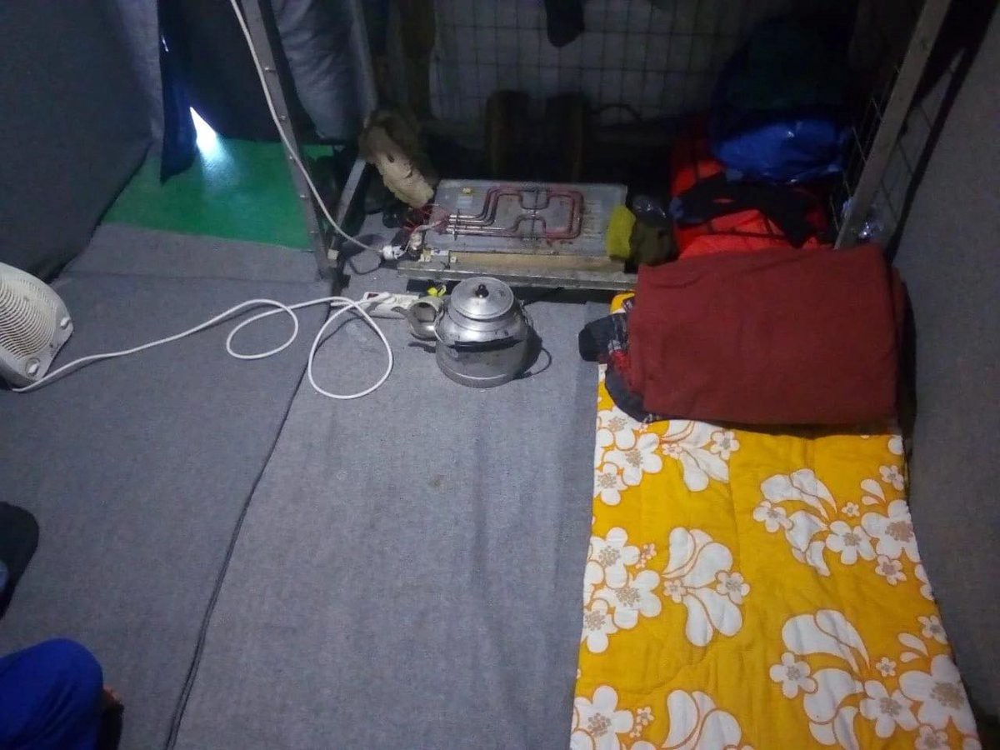
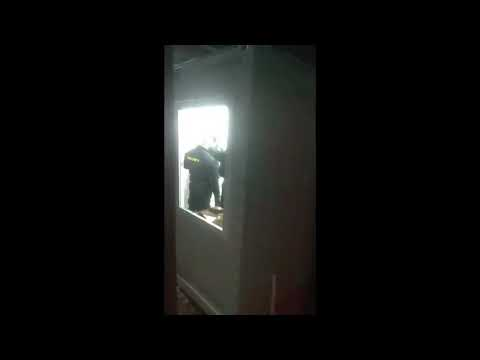
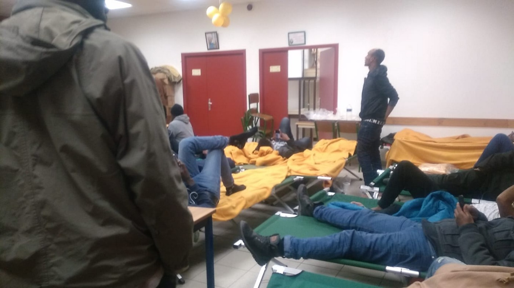
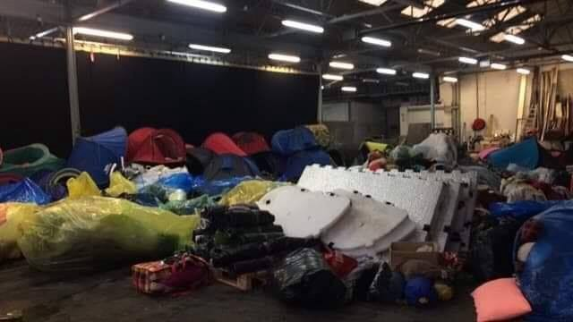
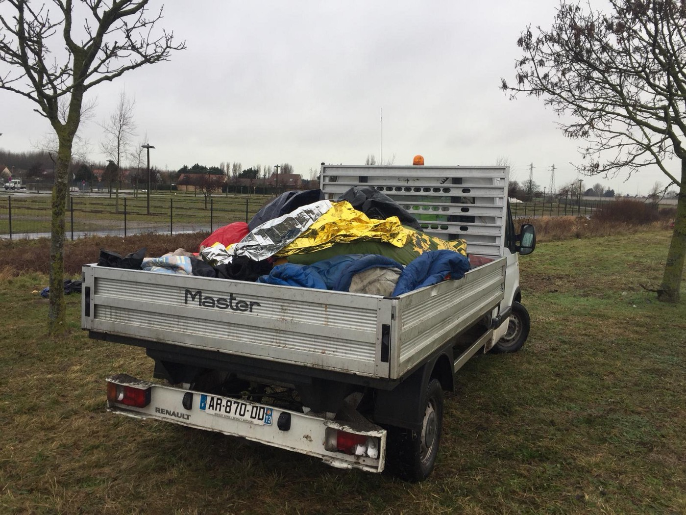

### AYS DAILY DIGEST 25/1/2019: SeaWatch 3 still needs port of safety

_Libyan coastguard intercepts 473 people over the course of 72 hours// 15\-year\-old girl killed in hate attack in Turkey // Violance in IOM run camp in Bosnia // More than 300 people evacuated from St Denis camp//Police continues destruction of belongings in Calais//_

Photo by Mediterranea

On Friday night, the SeaWatch 3 entered the port of Santa Pelagia Bay, north of Syracuse and is now anchored there, according to [Mediterranea](https://mediterranearescue.org/en/news-en/immediatedisembarkmentseawatch3/?fbclid=IwAR2TXIQMvfI4eKQ-V5zhU_KzfuxawjVjGdeJB7iY2MQZTRwSKGK3a3EAO4s) n Rescue\. The Italian government and Interior Minister Salvini in particular, say that the SeaWatch 3 will not be able to disembark in an Italian port, while Francesco Italia, mayor of Syracuse, says “the city is ready to welcome the 47 people on board”\.

Mediterranea now demands that the Italian government assigns to Sea\-Watch 3 the port of Syracuse as a “Place of Safety” and immediately authorises the disembarkment of the 47 shipwrecked and rescued people\.

SeaWatch meanwhile has launched a [petition](https://www.change.org/p/eu-commission-sea-rescue-is-non-negotiable-open-the-ports-for-sea-watch-3) , calling on the European Commission to put an end to the undignified haggling over people’s lives and the establishment of a sustainable solution under which similar cases in future will be allocated a safe harbour without delay\. The people have been aboard the ship since last Saturday\.

The Libyan coastguard says it has intercepted and brought back a total of 473 migrants to its shores over the course of 72 hours, according to [Infomigrants](http://www.infomigrants.net/en/post/14705/nearly-500-migrants-brought-back-to-libya-in-72-hours) \. [Corriere Della Sierra](https://www.corriere.it/foto-gallery/esteri/19_gennaio_25/torture-gabbie-immagini-centro-detenzione-libico-f3b035e6-20a7-11e9-926b-daa18cae285e.shtml?fromArticle=true&fbclid=IwAR0hMd1xo4OKD-mS9gKesswgTRBNcYzQ8nbRVveed_W8_GJVrCNAJ3HGARU&refresh_ce-cp) has published photos, showing clear evidence of torture and disgraceful living conditions in Libyan prisons\. On Monday already, [Human Rights Watch](https://www.hrw.org/report/2019/01/21/no-escape-hell/eu-policies-contribute-abuse-migrants-libya) had published a report, showing how EU Policies contribute to the abuse of migrants in Libya\. In July 2018, Human Rights Watch researchers visited four detention centers where they documented

> “Inhumane conditions that included severe overcrowding, unsanitary conditions, poor quality food and water that has led to malnutrition lack of adequate healthcare \(…\) and disturbing accounts of violence by guards” 

It adds that the EU is providing support to the Libyan Coast Guard to enable it to intercept refugees at sea, after which they take them back to Libya to arbitrary detention\.
### Turkey
#### Girl killed in hate attack

A child has lost her life in a hate attack on a Syrian family in Gaziantep\. The family, living in the Vatan quarter of Gaziantep, were attacked by unknown persons in their home, [media are reporting](https://www.gazeteduvar.com.tr/gundem/2019/01/25/suriyeli-aile-saldiriya-ugradi-1-cocuk-hayatini-kaybetti/?fbclid=IwAR08NpzC9crgA-SEODYWTOcic0z0f-3Fj2ZOGdAkrx6PNR5d_qKB1V5EWBo) \.

**The victims, Ayşe Farmeti and her three children Hanan, 15, Nur el Nude, 11, and Raman Elalawi, 8, were beaten and hit over the head with a heavy object\.** Hanan Alalawi lost her life; the mother and two younger children were taken to the hospital with life threatening injuries\. The victims were found by the father, who had been out of the house, running an errand\. An autopsy will be conducted on Hanan; a police investigation is ongoing\.
### Italy
#### Salvini admits acting illigally

There is a possibility that Interior Minister Matteo Salvini could be charged with kidnapping, after he prevented refugees from disembarking an Italian coast guard ship in August\.

This is the rulling made by a court in Sicily this week\. So far, Salvini has not appeared to find this in any way worring for him\. In a post on Facebook he said: “I confess, there is no need for a trial\. It’s true, I did it and I’d do it again\.”
### Greece
#### Living conditions in Moria have not improved

The power cuts in Moria continue\. Refugees have to live in the same miserable situation, despite the promises\. From 14–20 January 640 people reached the Aegean islands, the majority of whom arrived to Lesvos, according to UNHCR\.

The average daily arrivals on all islands was 91 in this time\.

By Refugee Info Bus

In the hotspot of Moria, children are still not attending formal Greek education\. Children account for 30% of the refugee population on the islands, of whom more than 6 out of 10 are younger than 12 years old, according to UNHCR\.
### Bosnia
#### Violance under the UN watch

On Friday night, we recived a very disturbing video from Miral, one of the IOM run camps in Bosnia, showing a security guard in this camp beating up one of the residents\.

In Miral camp, the presence of the UN agencies, as well as their associates and partners, is very visible\. Additionally, representatives of the Bosnian Ministry for Security, responsible for asylum seekers, is also present\.

The IOM, the organization running the Miral camp, hired a private security company that does not have previous experience or training in working with vulnerable people\. The process of hiring the agencies, in any of the IOM run camps, was not transparent, nor was the decison to hire private security companies\.

Read more about living conditions in Miral in our special: [Killing solidarity in Velika Kladusa](ays-special-from-bosnia-killing-solidarity-in-velika-kladuša-be9045b1dfec) \.
### France
#### More than 300 people evacuated in St Denis

Photo by Solidarité migrants Wilson

More than 300 people have been evacuated from the St Denis camp, just outside of Paris\. The people have been brought mostly to temporary shelters \(hotels, gyms and schools\) \. [Solidarité migrants Wilson](https://www.facebook.com/Solidarit%C3%A9-migrants-Wilson-598228360377940/) says that 40 people were not able to get aboard a bus\. They found temporary shelter in a nearby church\.

Photo by Utopia 56

Paris Refugee Ground Support says volunteers salvaged as much as possible before the street cleaners came:

_“Hundreds of blankets, sleeping bags and tents are being sent to an industrial cleaning company\. They will be washed, dried, repacked and then redistributed to those in so much need”\._
#### Police evicts refugees in Calais

Photo by Refugee Info Bus

A group of young people from Eritrea and Ethiopia were evicted on Friday morning, according to Refugee Info Bus:

> “Sleeping bags and blankets were placed in clearing trucks, leaving this community once again with no form of shelter” 

The same group had been evicted five days earlier from under a bridge, with their blankets and belongings thrown away as well\. Refugee Info Bus adds that the “Plan Grand Froid,” the only alternative form of indoor shelter, closed its doors this morning, leaving this community to face the night outside\.

L’Auberge des Migrants says it has changed its distribution methods to counter the destruction of tents and blankets by police\. Instead of massive and regular distributions from the warehouse, its teams are now more mobile to understand the real needs of refugees\. Iranian refugees in particular face more pressure from police and can find themselves without any form of shelter at night\.
### Latvia
#### Training in Latvia

[The Education Development Center \(IAC\)](http://www.iac.edu.lv/projekti/aktualie-projekti/new-project-page-2/new-news-article/?fbclid=IwAR1dC-IqUq4387LHL49iVo0CsNkA6MdhKLcHxq-pnJbnm-ubt9-24bDuOm4) , a Latvian NGO focused on professional development, is offering a free\-of\-charge training programme for intercultural communication and work with third\-country nationals\. The training is intended for social workers, police officers, educators, health care professionals, immigration officers and employment office specialists, media workers and other representatives of state and municipal institutions, NGOs and the private sector\.

Topics to be covered in the training are:

Globalisation and migration
Statistics on third country nationals in Latvia
Intercultural communication and competence
Legal framework for third\-country nationals
The role of the media

IAC will hold training sessions in various municipalities and at different dates, based on interest\. Those interested in having a training session in their municipality should contact the project manager\.
### General

A recent [report by Eurydice](https://eacea.ec.europa.eu/national-policies/eurydice/sites/eurydice/files/integrating_students_from_migrant_backgrounds_into_schools_in_europe_national_policies_and_measures.pdf?fbclid=IwAR3D74ultAHkuUoYAvJAEZos5lrzOiE_rs0fLnIFhDBmsD5BJlY-tsC8flk) “ Integrating Students from Migrant Backgrounds into Schools in Europe” maps the policies and measures of 42 European education systems in the areas of governance; access to education; language, learning, and psycho\-social support; and teachers and school heads\. Here are some of the conclusions :

**Access to education**

In most European education systems, children with migrant backgrounds have the same rights and obligations to participate in education as their native peers\. But this is not always the case, especially for children who are irregular migrants\. In 13 education systems, young migrants who are over the compulsory school age but have not completed compulsory education do not have the same rights to educational access as their native peers\.

Newly arrived students are usually placed in preparatory courses if they do not have the language skills to follow mainstream classes\. To ensure that such courses do not hinder integration, many education systems limit the time spent in preparatory courses or require that such courses teach curriculum subjects beyond language\.

**Language and psycho\-social support**

Funding is often allocated based on the number of migrant students who need language support\. Very rarely do migrant students have the right to study their home language at school\. Policies and measures tend to focus on academic rather than social and emotional needs\. However, many systems make psycho\-social support available to all students\.

**Teachers and school heads**

Most education systems include competences related to teaching in multicultural classrooms in their teacher competence frameworks and/or promote these skills through activities organised by top\-level authorities\.
Intercultural mediators and teaching assistants are under\-deployed resources\.
School heads often do not receive training from top\-level authorities to ensure successful integration of migrant students\.

**Policy approaches**

Few education systems have top\-level strategies for migrant student integration, but most systems do have policies or measures in specific areas relevant for integration\. Only two of the ten selected education systems had policies that emphasised both promoting diversity and taking a ‘whole\-child’ approach\.

**We are an entirely volunteer\-run media team, and we rely on our supporters to share our news\. So please share, and never forget to ACT\!**

**We strive to echo correct news from the ground through collaboration and fairness\. Every effort has been made to credit organizations and individuals with regard to the supply of information, video, and photo material \(in cases where the source wanted to be accredited\) \. Please notify us regarding corrections\.**

**If there’s anything you want to share or comment, contact us through Facebook or write to: areyousyrious@gmail\.com**

_Converted [Medium Post](https://medium.com/are-you-syrious/ays-daily-digest-25-1-2019-seawatch-3-still-needs-port-of-safety-baef02a293e9) by [ZMediumToMarkdown](https://github.com/ZhgChgLi/ZMediumToMarkdown)._
