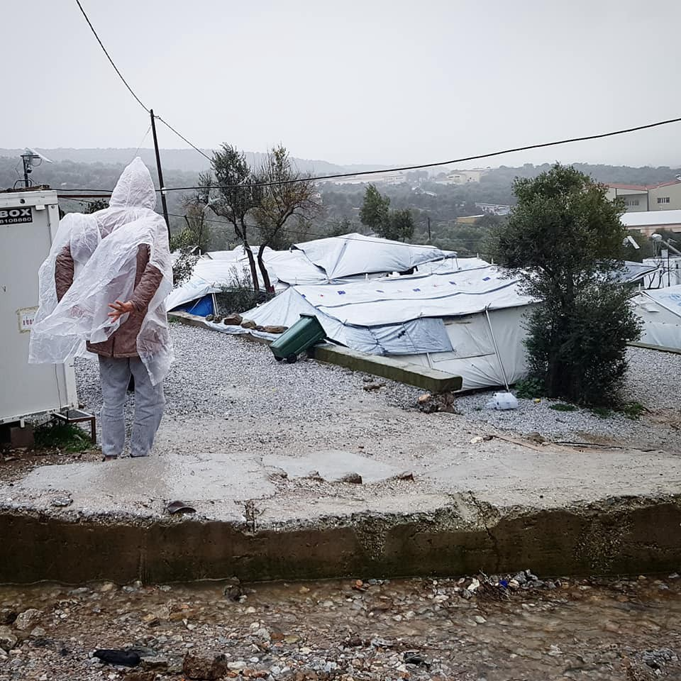

### اروپا از پرداخت هزینه برای نجات مردم در دریا جلوگیری می‌کند ،در حالی که برای کمپ های نامناسب در بالکان پول می‌پردازد
#### AYS Weekly News Summary in Persian, January 21–27

Moria, Lesvos\-Photo: Anna Alboth

**خاص**
### اعتراضات در اردوگاه ساموس ادامه دارد

همانطور که آر\.یو\.س در آخر هفته گزارش داد، اعتراضات در اردوگاه ساموس در اوایل این هفته آغاز شده است\.

افرادی که در اردوگاه روی بالای کوه زندگی می‌کنند، به کمک نکردن مقامات برای تامین سرپناه از سرما اعتراض دارند\. معترضان از اردوگاه به شهر آمدند و پلاکاردهایی در دست داشتند و شعارهایی را به زبان می آوردند و میگفتند: ما آزادی میخواهیم

 \)](assets/586506d64ef8/1*M9XHxdHqepBdM-Q3rNnuRQ.jpeg)

Photo: [Nicoletta Novara](https://www.facebook.com/nicoletta.novara.3?__tn__=%2CdKH-R-R&eid=ARAWwAtfTUEkj7qPJeJH7ledbzRrTYCIaFOw5xYs7ljNI2SAwjLzQ5_LFMFjnM3NjInO6XoMcZXCU3-g&fref=mentions) \)
#### **لبنان**
### پسر ۱۴ ساله ای که پلیس لبنان باعث مرگ او شد

به گفته فعالان لبنانی و خانواده ی کودک، یک پناهنده ۱۴ ساله سوری به نام احمد زوبی توسط پلیس لبنان کشته شد

این پسر در خیابان، کفش‌های براقی به تن داشت و پس از گزارش سرقتی در منطقه، توسط پلیس، به دنبال او گشتند\. احمد از پله‌های آپارتمان بالا رفت تا فرار کند و از پلکان ششمین طبقه به پایین پرتاب شد و جان خود را از دست داد\. مردم خشمگین بودند که بعد از سه روز به سراغ پیکر او رفتند، به این دلیل که پلیس این صحنه را بدون درخواست کمک‌ پزشکی ترک کرد
#### **لیبی**
### درخواست پناهندگان برای کمک به قاصر بن قشیر

در هفته ی گذشته به دنبال مردمی که در زندان بسر می‌برند، بین شبه نظامیان محلی و مردم درگیری رخ داد\. این درگیری در اطراف مرکز بازداشت قاصر بن قشیر در خارج از طرابلس رخ داده ‌است\. بنا به گفته ی وکیل حقوق بشر جولیا تراچینا ، هیچ آبی ، برق یا غذایی برای مردم در این روزها وجود ندارد، که به مردم داده ‌شود

### **مراکش**

براساس گزارش اتحادیه حقوق بشر مراکش، بخش نارد، بیش از ۵۰ پناهنده به طور غیرقانونی در یک پاسگاه پلیس بازداشت شده‌اند

### **صربستان**

گزارشی از ایران سعی کرده است در مورد مرگ مهاجر ایرانی که جسد او در نزدیکی مرکز پذیرش در ماه دسامبر دیده شده‌است، پرده بردارد\. جسد او هنوز در صربستان نگه ‌داشته می شود و خانواده ی او در حال تلاش برای انتقال جسد وی به ایران هستند
### بوسنی و هرزگوین

کارگر سازمان آی\.ا\.ام، یک پناهنده را به بیرون از کمپ در سرما پرتاب کرد

در حدود ساعت ده شب، بیست و یکم ژانویه، هنگامی که یکی از افراد محله با گوشیه شخصیه خود از کارمندان سازمان آی\.ا\.ام فیلم میگرفت، یکی از کارمندان سازمان آی\.ا\.ام به سراغ او رفت و تلاش کرده بود گوشی را از او بگیرد\. این مرد از کارمند سازمان آی\.ا\.ام خواست که اجازه دهد که او با موبایلش فیلم بگیرد، اما به او هشدار دادند که این ویدیو را حذف خواهد کند\. بیست دقیقه بعد, هنگامی که سازمان آی\.ا\.ام درگیر سازماندهی مجدد مکان‌ خواب برای وی در اردوگاه شدند, او در یک درگیری لفظی با برخی از ساکنان اردوگاه‌ها درگیر شد\. همان مردی که ویدیو را فیلم برداری کرد, به کارگر سازمان آی\.ا\.ام نزدیک شد و از او خواست که با این روش گستاخانه با پناهندگان صحبت نکنند
#### **کرواسی**
### خلاصه ی گزارش در مورد پناهندگی در کرواسی

۷۳۹ تعداد پناهندگانی است که جمهوری کرواسی تا سال جدید آنان را پذیرفته است\. از سال ۲۰۱۶ تا امروز ۶۰۰ نفر درخواست پناهندگی کامل و ۱۳۹ نفر سوبسیدیاری دریافت کرده اند\. طی چند سال گذشته ، تعداد دریافت پناهندگی بیشتر شده است، اما کرواسی هنوز در رابطه با برخی دیگر کشورهای عضو اتحادیه اروپا، محدود است به تایید اعطای پناهندگی است و در عین حال یکی از کشورهای نامطلوبی برای پناهندگی به دلیل سیستم ضعیف یکپارچه ‌سازی والحاق پناهندگان به جامعه به شمار می رود\. کیفیت سیستم به شدت تحت‌تاثیر سیاست‌هایی قرار می‌گیرد که توسط موسسات اجرا می‌شوند\. با این حال ، ما به طور خاص به این اطلاعات علاقمند هستیم که استراتژی نگاری جدید باید اجرا شود، که شکل پیش ‌بینی ‌شده استراتژی مهاجرت را پیش‌بینی می‌کند\. اگرچه کرواسی از سال ۲۰۱۶ یک سیاست مهاجرت رسمی نداشته است، که براساس لایحه حفاظت بین‌المللی و موقت بوده‌است، ما معتقدیم که سیاست مهاجرت برای یک رویکرد بهتر و جامع‌ تر به پدیده مهاجرت مناسب خواهد بود
### **دریا**

این روزها مردم کمتری موفق به عبور از دریای مدیترانه هستند، این مسیر بسیار خطرناک ‌تر شده ‌است

اتحادیه اروپا از زمان رسیدن پناهندگان به سواحل خود به عنوان نشانه ‌ای از موفقیت سیاست‌های خود را جشن می‌گیرد

با وجود این، ایتالیا و دیگر کشورهای عضو اتحادیه اروپا سیاست بازداشت این کشتی‌ها را دنبال کرده و اغلب داوطلبان را تحت پی‌گرد قانونی قرار میدهند\. آخرین کشتی که قربانی این روند شد، کشتی آزادی بود که اجازه خروج از کشتی توسط مقامات اسپانیایی داده نشد\. دلیل بیان‌ شده از سمت اپن\.ارم برای این اتفاق، این است که کشتی از مقررات پیروی نکرده است تا افراد را از نزدیک ‌ترین بندر ورودی، نجات دهد\. با این حال، این کشتی نتوانست جان سالم به در برد، زیرا نزدیک‌ ترین بندر ورودی برای نجات کشتی‌ را، مسدود کردند

شما می‌توانید کل این گزارش را در اینجا ببینید

■■■■■■■■■■■■■■ 
> **[Sea-Watch International](https://twitter.com/seawatch_intl) @ Twitter Says:** 

> > Thanks from all of us to the thousands of people who demonstrated yesterday in #Genova because they want a welcoming country, to the hundreds who asked in #Siracusa and #Bologna for the landing of the shipwrecked aboard the #SeaWatch.

We are not alone ❤️

[video.repubblica.it/edizione/genov…](https://video.repubblica.it/edizione/genova/a-genova-10mila-in-piazza-contro-il-decreto-salvini-liberate-i-47-migranti-della-sea-watch/325536/326152) https://t.co/ODZ5Qjx7fy 

> **Tweeted at [2019-01-27 10:19:27](https://twitter.com/seawatch_intl/status/1089467919342469120).** 

■■■■■■■■■■■■■■ 

#### **ایتالیا**
### اخراج از مرکز پذیرش کاستلنوودی پورتو

۳۰۵ نفر از ۵۳۵ نفر که در مرکز پذیرایی کاستلنوودی پورتو در نزدیکی رم زندگی می‌کردند ، مجبور به ترک آنجا در روز سه ‌شنبه شدند\. مشخص نیست که آن‌ها به کجا منتقل خواهند شد، اما احتمالا ً مراکز دیگری در لومباردیا، توسکا نا و اومبریا قرار دارند برده میشوند

این اخراج نتیجه حکم سالوینی است که در ماه دسامبر سال گذشته تصویب شد که هدف از آن لغو حمایت انسان‌ دوستانه از افرادی است که در ایتالیا پناهندگی نگرفته اند\. این قانون نه تنها حمله‌ ای به انسجام اجتماعی پناهندگان بلکه تلاش کاملا واضحی است برای بی ‌خانمان کردن پناهندگان است

این مرکز تا پایان ماه ادامه خواهد داشت و افرادی که از حمایت انسان ‌دوستانه برخوردار نیستند در خیابان‌ها بدون حمایت باقی خواهند ماند، همان طور که در این حکم وضع شده است\. دستور بسته شدن این مکان، جمعه ی گذشته فرستاده شده و اساسا ً به سرعت وارد عمل خواهد شد\. این اخراج برای روز شنبه برنامه ‌ریزی شده‌است

#### **اسپانیا**
### قوانین دیوان عالیه میگوید: پناهندگان حق آزادی و تظاهرات را دارند

دیوان عالی عدالت در مادرید این هفته حکم داد، افرادی که در اسپانیا ادعای پناهندگی کرده‌اند، حق قانونی دارند که آزادانه در داخل این کشور تظاهرات کنند\. شما می‌توانید مطالب بیشتری در این مورد را در اینجا بخوانید

#### **آلمان**

نشانه‌هایی وجود دارد مبنی بر اینکه بازگشت دسته‌ جمعیه بعدی به افغانستان در ۴ فوریه برگزار خواهد شد\. اطلاعات این موضوع در وب‌سایت شورای پناهندگان باواریا
### وزیر بهداشت در حال مطالعه است که کنترل تشخیص سن را، از طریق سونوگرافی انجام دهند

آزمایش استخوان اغلب به عنوان راهی برای آزمایش اینکه آیا پناهندگان در مورد سن خود صادق هستند یا خیر، در جریان بوده‌است، با این حال این رویکرد به طور گسترده توسط پزشکان و متخصصان پزشکی رد شده‌است\. در حال حاضر، نخست‌ وزیر آلمان، جنز اسپان، یک میلیون یورو صرف یک مطالعه جدید می‌کند تا مشخص کند که آیا آزمایش فراصوت می‌تواند سن فردی را تایید کند یا خیر

_Converted [Medium Post](https://medium.com/are-you-syrious/%D8%A7%D8%B1%D9%88%D9%BE%D8%A7-%D8%A7%D8%B2-%D9%BE%D8%B1%D8%AF%D8%A7%D8%AE%D8%AA-%D9%87%D8%B2%DB%8C%D9%86%D9%87-%D8%A8%D8%B1%D8%A7%DB%8C-%D9%86%D8%AC%D8%A7%D8%AA-%D9%85%D8%B1%D8%AF%D9%85-%D8%AF%D8%B1-%D8%AF%D8%B1%DB%8C%D8%A7-%D8%AC%D9%84%D9%88%DA%AF%DB%8C%D8%B1%DB%8C-%D9%85%DB%8C-%DA%A9%D9%86%D8%AF-%D8%AF%D8%B1-%D8%AD%D8%A7%D9%84%DB%8C-%DA%A9%D9%87-%D8%A8%D8%B1%D8%A7%DB%8C-%DA%A9%D9%85%D9%BE-%D9%87%D8%A7%DB%8C-%D9%86%D8%A7%D9%85%D9%86%D8%A7%D8%B3%D8%A8-%D8%AF%D8%B1-586506d64ef8) by [ZMediumToMarkdown](https://github.com/ZhgChgLi/ZMediumToMarkdown)._
