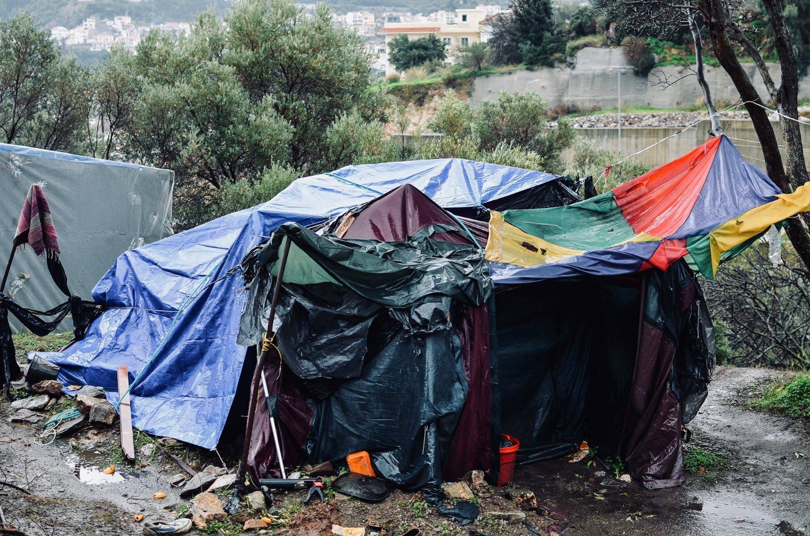

### تمويل الاتحاد الأوروبي يمنع إنقاذ الأرواح في البحر ، بينما يدعم المخيمات اللاإنسانية في دول البلقان
#### AYS Weekly News Summary in Arabic, January 21–27

Moria, Lesvos\-Photo: Anna Alboth
### الاحتجاجات مستمرة في معسكر ساموس

بدأت الاحتجاجات في معسكر ساموس في وقت سابق من هذا الأسبوع ، كما ذكرت \(ا ي س\) في ملخص الأسبوع الماضي \.

ويحتج الأشخاص الذين يعيشون في المعسكر الواقع على جانب التل على الافتقار شبه التام إلى المساعدة من السلطات لتوفير المأوى من البرد\. خرج المتظاهرون من المخيم إلى المدينة حاملين لافتات وهتافات غنائية ، بما في ذلك “نريد الحرية”\.

](assets/a7dc22e7bf7f/1*M9XHxdHqepBdM-Q3rNnuRQ.jpeg)

Photo: [Nicoletta Novara](https://www.facebook.com/nicoletta.novara.3?__tn__=%2CdKH-R-R&eid=ARAWwAtfTUEkj7qPJeJH7ledbzRrTYCIaFOw5xYs7ljNI2SAwjLzQ5_LFMFjnM3NjInO6XoMcZXCU3-g&fref=mentions)
#### **لبنان**
### صبي في الرابعة عشرة من عمره طاردته الشرطة اللبنانية

وقد طاردت الشرطة اللبنانية لاجئاً سورياً يبلغ من العمر ١٤عاماً يدعى أحمد الزعبي ، وفقاً للنشطاء اللبنانيين وعائلة الطفل\.

■■■■■■■■■■■■■■ 
> **[Asaad Sam Hanna](https://twitter.com/AsaadHannaa) @ Twitter Says:** 

> > This poor Syrian child was died today in Lebanon while the Lebanese  police was chasing him because he was working on cleaning the shoes in the streets.
#SaveRefugees #SaveChildren https://t.co/DVaQyXECIb 

> **Tweeted at [2019-01-20 19:00:10](https://twitter.com/asaadhannaa/status/1087062244989505536).** 

■■■■■■■■■■■■■■ 

كان الصبي يرمي الأحذية في الشارع كطريقة للدفاع عن نفسه ، وبعد تقرير عن سرقة في المنطقة ، كانت الشرطة تتبعه\. ركض أحمد على درج شقة للهروب ، وسقط على درج من ستة طوابق إلى ان توفى\. كان الناس غاضبين من أن جثة الصبي تم استردادها بعد ثلاثة أيام ، عندما تخلت الشرطة عن المكان دون طلب المساعدة الطبية\.
#### **ليبيا**
### نداء من اللاجئين للمساعدة في قصر بن غشير

كان هناك قتال محاصر لمركز احتجاز قصر بن غشير خارج طرابلس في الأسبوع الماضي بين ميليشيات محلية ، مما يهدد الناس عالقين في السجن\. لم تكن هناك مياه جارية ، أو كهرباء ، أو طعام مُعطى للناس في الداخل لأيام عدة ، وفقاً لمحامية حقوق الإنسان جوليا ترناشينا\.

### **المغرب**

تم احتجاز أكثر من ٥٠ لاجئاً بشكل غير قانوني في مركز شرطة طنجة ، وفقاً لجمعية حقوق الإنسان المغربية — القسم الناظور\.

#### **البحر**
### عدد أقل من الناس يعبرون البحر الأبيض المتوسط ​​، لكن الرحلة أصبحت أكثر خطورة

يود الاتحاد الأوروبي أن يحتفل بالانكماش في عدد اللاجئين الذين يصلون إلى شواطئه كدليل على نجاح سياساته\.

على الرغم من ذلك ، اتبعت إيطاليا ودول أخرى في الاتحاد الأوروبي سياسة احتجاز هذه السفن ، وغالباً ما كانت تحاكم المتطوعين\. آخر سفينة تقع ضحية لهذا الاتجاه هي سفينة \(وبن ارم\) ، التي تم رفض الإذن لها بالإبحار من قبل أتباع أسبانية\. السبب المعلن للحرم من \(وبن ارم\) هو أن السفينة لم تتبع اللوائح لإسقاط الأشخاص الذين تم إنقاذهم في أقرب ميناء الدخول بعد الإنقاذ الأخير\. ومع ذلك ، فشلت السفينة في القيام بذلك لأن أقرب مدخل للدخول تمنع سفن الإنقاذ\.

يمكنك رؤية التقرير بأكمله هنا

■■■■■■■■■■■■■■ 
> **[Mediterranea Saving Humans](https://twitter.com/RescueMed) @ Twitter Says:** 

> > Delegazione sale a bordo della #SeaWatch3 - "Verificheremo condizioni per sbarco immediato dei 47 naufraghi".

A delegation has reached the Sea-Watch3 - "We will verify conditions to demand the immediate disembark of the 47th people onboard". https://t.co/6WzKMPRJux 

> **Tweeted at [2019-01-27 09:47:20](https://twitter.com/rescuemed/status/1089459836495032320).** 

■■■■■■■■■■■■■■ 

### **صربيا**

حاول تقرير من شركة إيران واير كشف المزيد عن وفاة مهاجر إيراني عثر على جثته بالقرب من مركز الاستقبال في أداسيفتسي في ١ ديسمبر / كانون الأول\. ولا يزال جثته محتجزة في صربيا بينما تحاول الأسرة ترتيب نقل الجثة إلى شيراز\.
#### **البوسنة**
### يعمل عامل المنظمة الدولية للهجرة على طرد اللاجئين من البرد

في منشأة [ميرال التي](ays-daily-digest-26-12-2018-humiliating-living-conditions-in-iom-run-centre-in-bosnia-174c30250862) تديرها [منظمة الهجرة الدولية](ays-special-from-bosnia-killing-solidarity-in-velika-kladu%C5%A1a-f7c18edd8826) في فيليكا كلادوسا في حوالي الساعة العاشرة من يوم ٢١ يناير ، كان أحد السكان يأخذ شريط فيديو على هاتفه عندما اتصل به موظف في المنظمة الدولية للهجرة حاول أخذ هاتفه\. سأل الرجل العامل في المنظمة الدولية للهجرة للسماح له بالاحتفاظ بهاتفه لكنه أكد له أنه سيحذف الفيديو\. بعد عشرين دقيقة ، عندما كان العامل في المنظمة الدولية للهجرة يعيد تنظيم أماكن النوم الخاصة بالسكان في المخيم ، بدأ في صراع كلامي مع بعض سكان المخيمات\. اقترب نفس الرجل الذي صوّر الفيديو من العامل في المنظمة الدولية للهجرة وطلب منه ألا يتكلم بهذه الطريقة الفظة أمام الناس\.

#### **كرواتيا**
### ملخص باللغة الإنجليزية تقرير عن اللجوء في كرواتيا من البداية الترحيبية

\( ٧٣٩ \) هو عدد طلبات الحماية الدولية الموافق عليها في جمهورية كرواتيا من السنة الجديدة \. من عام ٢٠١٦ وحتى اليوم ، تم منح ٦٠٠ طلب لجوء ، و ١٣٩ حماية فرعية\. خلال السنوات القليلة الماضية ، ازداد عدد الحمايات الممنوحة الدولية ، لكن تظل كرواتيا — فيما يتعلق ببعض الدول الأعضاء الأخرى في الاتحاد الأوروبي — مقيدة في الموافقة على الحماية الدولية\. وفي الوقت نفسه ، واحدة من أقل البلدان التي ترغب في الوصول إليها بسبب ضعف نظام تكامل الجودة\. تتأثر جودة النظام بشكل كبير بالسياسات التي تنفذها المؤسسات\. مع ذلك ، نحن مهتمون بشكل خاص بالمعلومات التي سيتم تنفيذها الإستراتيجية الديمغرافية الجديدة ، والتي توقعت تشكيل إستراتيجية الهجرة\. على الرغم من أن كرواتيا لم تطبق سياسة رسمية للهجرة منذ عام ٢٠١٦ والتي استندت إلى قانون الحماية الدولية المؤقتة ، فإننا نعتقد أن سياسة الهجرة ستكون مناسبة لنهج أفضل وأكثر شمولاً لظاهرة الهجرة\.
#### **إيطاليا**
### عمليات الإخلاء في مركز استقبال كاستلنوفو دي بورتو

أجبر ٣٠٥ من أصل ٥٣٥ شخصاً يعيشون في مركز استقبال كاستيلنوفو دي بورتو بالقرب من روما على الرحيل يوم الثلاثاء\. ليس من المؤكد أين سيتم نقلهم ، ولكن من المحتمل مراكز أخرى في لومبارديا ، توسكانا وأومبريا\.

هذا الإخلاء هو نتيجة “مرسوم سالفيني” الذي صدر في ديسمبر من العام الماضي ، والذي يهدف إلى إلغاء الحماية الإنسانية للأشخاص الذين لم يتم منحهم وضع اللاجئ في إيطاليا\. هذا القانون ليس مجرد هجوم على الاندماج الاجتماعي للاجئين ، بل هو جهد مفتوح لإبعاد اللاجئين وجعلهم بلا مأوى\.

سيتم إغلاق المركز بحلول نهاية الشهر ، وسيتم ترك الأشخاص الذين لا يتمتعون بالحماية الإنسانية في الشوارع دون دعم على الإطلاق \(كما ينص المرسوم\) \. تم إرسال أمر الإغلاق يوم الجمعة الماضي ودخل حيز التنفيذ على الفور\. ومن المخطط أن يتم الإخلاء بحلول يوم السبت\.
#### **إسبانيا**
### قواعد المحكمة العليا يحق لطالبي اللجوء الحق في حرية التنقل

قضت محكمة العدل العليا في مدريد هذا الأسبوع بأن الأشخاص الذين تقدموا بطلب لجوء في إسبانيا لهم الحق الدستوري في التنقل بحرية داخل البلاد\.

يمكنك قراءة المزيد عن القرار هنا\.

#### **ألمانيا**
### وزير الصحة الالماني ينفق امواله لدراسات اختبار العمر من خلال الموجات فوق الصوتية

غالبًا ما يتم استخدام اختبار العظام كطريقة لاختبار ما إذا كان اللاجئون القاصرون يتعاملون بأمانة بشأن عمرهم ، ومع ذلك فقد رفض الأطباء والخبراء الطبيون هذا النهج على نطاق واسع\. ينفق الآن وزير الصحة الألماني ينس سباهن مليون يورو على دراسة جديدة لتحديد ما إذا كان اختبار الموجات فوق الصوتية يمكنه التحقق من عمر شخص ما ، وفقًا لتقرير صادر عن \(انفو ميكرنت\) \.

_Converted [Medium Post](https://medium.com/are-you-syrious/%D8%AA%D9%85%D9%88%D9%8A%D9%84-%D8%A7%D9%84%D8%A7%D8%AA%D8%AD%D8%A7%D8%AF-%D8%A7%D9%84%D8%A3%D9%88%D8%B1%D9%88%D8%A8%D9%8A-%D9%8A%D9%85%D9%86%D8%B9-%D8%A5%D9%86%D9%82%D8%A7%D8%B0-%D8%A7%D9%84%D8%A3%D8%B1%D9%88%D8%A7%D8%AD-%D9%81%D9%8A-%D8%A7%D9%84%D8%A8%D8%AD%D8%B1-%D8%A8%D9%8A%D9%86%D9%85%D8%A7-%D9%8A%D8%AF%D8%B9%D9%85-%D8%A7%D9%84%D9%85%D8%AE%D9%8A%D9%85%D8%A7%D8%AA-%D8%A7%D9%84%D9%84%D8%A7%D8%A5%D9%86%D8%B3%D8%A7%D9%86%D9%8A%D8%A9-%D9%81%D9%8A-%D8%AF%D9%88%D9%84-%D8%A7%D9%84%D8%A8%D9%84%D9%82%D8%A7%D9%86-a7dc22e7bf7f) by [ZMediumToMarkdown](https://github.com/ZhgChgLi/ZMediumToMarkdown)._
