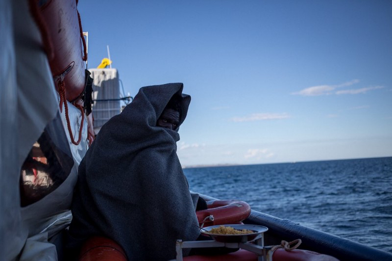

### AYS Daily Digest 29/01/19: Evictions in Porte\-de\-la Chapelle

_Libyan PM reveals shocking statistics of migrants held in government detention centers // Sea\-Watch 3 ordeal continues // A short film depicts street life for two Syrian children in Turkey // Refugees show their experience of Serbia in new photo exhibition // Demos in Venice and Berlin // New laws in France for unaccompanied minors // and more…_

](assets/1fd252238a4e/1*d3Kkv-LcWNyAiOjSm1w4HQ.jpeg)

Police evict refugees living under a bridge in Porte\-de\-la\-Chapelle, Paris\. Credit: [LouizArt Lou](https://www.facebook.com/loulou.timri/media_set?set=a.2250263038574639&type=3)
### Feature —

Last night, Tuesday evening, saw a massive eviction of Paris’s Porte de la Chapelle urban camp\. According to [Paris Refugee Ground Support](https://www.facebook.com/PRGS.team/) , hundreds were brought to gymnasiums to get out of the cold overnight — but hundreds more were left behind to fend for themselves\.

This is not a simple gesture of mercy by any means — [Solidarité Migrants Wilson](https://www.facebook.com/Solidarité-migrants-Wilson-598228360377940/) notes that once news media left the scene, police began to check people’s documents, move people out of the area, and systematically destroy the tents left behind\.

FranceBleu has more information [here](https://www.francebleu.fr/infos/societe/paris-evacuation-des-migrants-de-la-porte-de-la-chapelle-1548747242?fbclid=IwAR30LJdl8mcCmm25dtbrS3N1yiyaLdjgAZcjYBhMqrQQMPMvfCsI_62RNW0) \(in French\) \.

](assets/1fd252238a4e/1*ZgToJsEvgXwkNwqcn3KtbA.jpeg)

Before the eviction\. PRGS estimates that there were 400–500 people living in Porte de la Chapelle\. Credit: [Paris Refugee Ground Support](https://www.facebook.com/PRGS.team/photos/pcb.2295356204077820/2295356134077827/?type=3&theater)

](assets/1fd252238a4e/1*Ap8GUj14cMLyrp37v7FJtA.jpeg)

The eviction\. Credit: [Paris Refugee Ground Support](https://www.facebook.com/PRGS.team/photos/pcb.2295356204077820/2295356134077827/?type=3&theater)

A volunteer from Solidarité Migrants Wilson testified:

> “I’m coming back from the scene following the umpteenth red alert of this crazy day\! So this time the story is: the [\#villedeparis](https://www.facebook.com/hashtag/villedeparis?hc_location=ufi) came back to throw out the pallets that the refugees were starting fires with \(because fire = danger… but also, fire=life when it’s so cold\! \), and by the way, the city employees also tossed a few dozen tents on the east side and then left\. 

> A national police courier arrived right after, we approached to try our luck and understand a little bit of what was going on — they didn’t understand any more than we did\. When it comes to police, I’ve seen everything since we started, but here, luckily, they were the nicest of all\! Nice, and thus, like all those who possess a bit of cranial material, disgusted with all this nonsense, this inhumane policy \(towards migrants\) that’s also so expensive\. 

> A car loaded with food passed, and all the refugees rushed to get a chance to eat a little, because with all of this, nobody has had anything in their belly since yesterday, and the cold is biting\! Those who returned from their mandatory OFII meeting found that they had no more tents…A crazy day, and tonight, the snow returns…” 

See more photos of the situation at Porte de la Chapelle [here](https://www.facebook.com/permalink.php?story_fbid=1068850213315750&id=598228360377940&hc_location=ufi) \.
### Libya

During a recent trip to Vienna, Libyan prime minister Fayez Al\-Sarraj [admitted](http://“the situation in the camps is – to put it mildly – far from satisfactory.”) that there are currently around 20,000 migrants languishing in inhumane government\-run detention facilities, most of them from Sub\-Saharan Africa \(an additional 780,000 migrants are currently in Libya, trying to get to Europe\) \. These numbers are at least partially due to a law signed between Italy and Libya in February 2017, which made it possible for the Libyan Coast Guard to send asylum seekers it picked up in the Mediterranean back to Libya — straight into the Libyan government’s detention centers, where many prisoners are tortured, sexually assaulted, and starved\.

Even as Austrian president Alexander Van der Bellen issued a weak denunciation of the detention centers’ conditions \(“the situation in the camps is — to put it mildly — far from satisfactory”\), the country’s prime minister, Sebastian Kurz, actually thanked the Libyan Coast Guard for having “saved 20,000 people \[at sea\] and taken them back” to Libya\.

We have to ask: what is the moral value of saving someone from drowning, only to subject them to indefinite detention, deny them any privacy, safety, or dignity, and systematically violate their human rights?
### Sea

IOM [reports](https://www.iom.int/news/mediterranean-migrant-arrivals-reach-5757-2019-deaths-reach-207?fbclid=IwAR3WoDajbyDu_jkFNGo_vs1knO-n4PuPsWuMoIEoWdgp7WWpy5d748tiNSc) that 5,757 migrants have reached Europe by sea so far this year; already, over 200 people have drowned during the crossing\.

**Update on Sea\-Watch 3:**

In yet another example of the criminalization of solidarity, Sea\-Watch 3 is still without a port — and Italian interior minister Matteo Salvini is threatening to subject the crew to a criminal investigation\.

The rescue ship is now in its 10th day at sea\. There are 47 asylum seekers aboard, including 13 unaccompanied minors and a [number of people](https://www.iom.int/news/mediterranean-migrant-arrivals-reach-5757-2019-deaths-reach-207?fbclid=IwAR3WoDajbyDu_jkFNGo_vs1knO-n4PuPsWuMoIEoWdgp7WWpy5d748tiNSc) who were subject to abuse in Libya\.

[At least one](https://twitter.com/FedericoScoppa) passenger has suffered a psychological breakdown, and others are refusing food\. There are clear and pressing humanitarian, medical, logistic, and hygienic reasons that the ship needs to dock immediately\. And yet, Salvini is holding firm\. [According](https://www.bbc.com/news/uk-england-derbyshire-47029350?SThisFB&fbclid=IwAR2pZb3AIEie8sS3nBGM1waxpYXHPgfxZPsWZqzcrYxOHHQub-WntQMBk7U) to the BBC, the interior minister has accused the Sea\-Watch 3 crew of having a “clear desire to use these immigrants in a political battle” — as though that wasn’t exactly what Salvini himself were doing by forbidding the rescue ship from docking in Syracuse, only a mile away\.
### Turkey

From director Serkan Özyumsak, a moving short film about the reality for two Syrian children living in Turkey:

### Greece

](assets/1fd252238a4e/1*pYiscGSP8CPL-Lb5EhI1XA.jpeg)

Miserable conditions in Moria\. Credit: [No Borders](https://www.facebook.com/nobordersnetwork/photos/a.773767229357838/2109427742458440/?type=3&theater)

This week alone, 508 people landed on the Greek Islands, according to data released by the UNHCR\. IOM [reports](https://www.iom.int/news/mediterranean-migrant-arrivals-reach-5757-2019-deaths-reach-207?fbclid=IwAR3WoDajbyDu_jkFNGo_vs1knO-n4PuPsWuMoIEoWdgp7WWpy5d748tiNSc) that there were at least two search\-and\-rescue operations over the weekend, which lead to 80 passengers being transferred to the islands of Farmakonisi and Chios\. 1,660 migrants have landed on Greek shores thus far this year\.

See the Aegean Boat Report’s weekly statistics [here](https://www.facebook.com/AegeanBoatReport/photos/a.285312485325196/515786875611088/?type=3&theater&hc_location=ufi) \.

Samos Volunteers are looking for enthusiastic and kind volunteers to help out with their children’s program\! Volunteers must speak English, be over 18, and be able to commit to at least 4 weeks of work\. Find out more and apply [here](https://samosvolunteers.org/volunteer?fbclid=IwAR0hAuks5HpMKXvRR57AMA8bKfLQNZG12cMw8uB-Bz0y-VY2srII-RIMON4) \.

The good news: public transit in Athens is free with an unemployment card\. The not\-so\-good news: the process of actually _obtaining_ this card, and then using it to access free transportation, is complicated, opaque, and involves multiple steps — like every other bureaucratic task in Greece\. Refugee Info Bus breaks it down for you [here](https://www.refugee.info/greece/transportation--greece/free-transportation-in-athens-with-an-unemployment-card?language=en) \.
### Serbia

](assets/1fd252238a4e/1*1UGGcum6M7XSKaWJzJOATg.jpeg)

Making bread\. Credit: [No Name Kitchen](https://www.facebook.com/NoNameKitchenBelgrade/posts/662229647508656)

A winter [report](https://www.facebook.com/NoNameKitchenBelgrade/posts/662229647508656) from No Name Kitchen: “Despite the snow and the low temperatures, people still continue to try crossing the forests to reach Italy…and are still being pushed back illegally when they are caught\.” No Name Kitchen provides breakfast, dinner, clean water, electricity, and hot water \(when the water heater is working\! \) to over 100 people each day\.

The poster for the exhibition’s launch, on February 6\.

A photo exhibition called “Through our Eyes,” which features photos taken by asylum seekers depicting their unique perspective and experience of Serbia, is coming to Belgrade\. The exhibition will open February 6 and 8pm and continue until February 10\.
### Balkan Weather Report for Wednesday, January 30 —

MONTENEGRO

Cloudy with sunny intervals before noon; increasingly cloudy during the evening\. Chance of precipitation in the southwest during the day and throughout the country at night\. Wind mostly weak to moderate, from changing directions\. Lowest temperatures from \-8 to 6 and highest daily from 1 to 14 degrees\.

SERBIA

Pockets of fog in the morning\. During the day moderately to fully cloudy, with rain and snow in the southeast\. Precipitation will gradually drop off over the course of the afternoon and evening\. Wind weak to moderate, coming from the east and southeast\. Lowest temperatures from \-1 to 2 and highest daily from 2 to 5 degrees\.

BiH

Moderately to entirely cloudy\. Precipitation from noon on, lasting into the night: light snow throughout most of the country and rain in the south\. Lowest temperatures from 0 to 5 and highest daily from 6 to 10 degrees\.

CROATIA

Moderately to entirely cloudy, rain or showers from time to time, in Dalmatia with thunder\. Locally snow inland as well as fog in the morning\. Wind will be weak, alongside the coast weak to moderate southern\. Lowest temperatures from \-6 to 7 and highest daily from 7 to 13\.
### Italy

This Saturday, February 9, there will be a demonstration in Venice against the implementation of the Salvini Decree and the racism and xenophobia it condones and engenders\. The event will begin at 2pm in front of the Santa Lucia train station\. More [here](https://www.facebook.com/OpificioTalkingHands/posts/966938103694611) \(In Italian\) \.
### France

A new policy aims to cut down on the number of unaccompanied minors being processed by the French state, InfoMIE [reports](http://www.infomie.net/spip.php?breve3237&lang=fr&fbclid=IwAR15Hxx6JbjaRi70viVXjDzTi5lpFztPSI6vBBpUTW61TrOQsLk5gyXQiWc) \. From now on, asylum seekers who present themselves as minors will be evaluated more “rigorously,” supposedly in order to crack down on adults pretending to be children in order to access a wider range of resources\. A new biometric program is also being implemented in an attempt to ensure that people don’t present themselves as minors to another administrative district in a different area of France after being rejected by the first place they try\.

As we [saw in Calais during the 2016 evictions](https://www.indy100.com/article/refugee-child-syria-home-office-calais-old-age-software-war-france-uk-migrants-7369351) , there is no completely accurate and reliable test of age, and it’s incredibly reductive to assume that someone is over 18 simply because they have visible signs of aging associated with an older person \(wrinkles, grey or white hairs\) — especially given that the incredible stress that most refugees experience as part and parcel of that identity often prematurely ages people, both physically and mentally\.
### Germany

There will be a demonstration in Berlin on February to protest the quota on family reunification applications for beneficiaries of international protection \(currently limited to 1000 cases per month; ultimately, even fewer than 1000 are successfully processed\) \. Find out more information [here](http://familienlebenfueralle.net/2018/12/gemeinsam-fuer-familiennachzug-und-grundrechte/?fbclid=IwAR1UOcO1qazvxdZqAPw1OvohvKsPn0Pil2TRrWwRqRbQsqlvGJtmSk6ERyM) \.

**We also publish weekly summaries of some of the most important news reported during the past week in our Daily News Digest: here are the [Arabic](%D8%AA%D9%85%D9%88%D9%8A%D9%84-%D8%A7%D9%84%D8%A7%D8%AA%D8%AD%D8%A7%D8%AF-%D8%A7%D9%84%D8%A3%D9%88%D8%B1%D9%88%D8%A8%D9%8A-%D9%8A%D9%85%D9%86%D8%B9-%D8%A5%D9%86%D9%82%D8%A7%D8%B0-%D8%A7%D9%84%D8%A3%D8%B1%D9%88%D8%A7%D8%AD-%D9%81%D9%8A-%D8%A7%D9%84%D8%A8%D8%AD%D8%B1-%D8%A8%D9%8A%D9%86%D9%85%D8%A7-%D9%8A%D8%AF%D8%B9%D9%85-%D8%A7%D9%84%D9%85%D8%AE%D9%8A%D9%85%D8%A7%D8%AA-%D8%A7%D9%84%D9%84%D8%A7%D8%A5%D9%86%D8%B3%D8%A7%D9%86%D9%8A%D8%A9-%D9%81%D9%8A-%D8%AF%D9%88%D9%84-%D8%A7%D9%84%D8%A8%D9%84%D9%82%D8%A7%D9%86-a7dc22e7bf7f) and [Persian](%D8%A7%D8%B1%D9%88%D9%BE%D8%A7-%D8%A7%D8%B2-%D9%BE%D8%B1%D8%AF%D8%A7%D8%AE%D8%AA-%D9%87%D8%B2%DB%8C%D9%86%D9%87-%D8%A8%D8%B1%D8%A7%DB%8C-%D9%86%D8%AC%D8%A7%D8%AA-%D9%85%D8%B1%D8%AF%D9%85-%D8%AF%D8%B1-%D8%AF%D8%B1%DB%8C%D8%A7-%D8%AC%D9%84%D9%88%DA%AF%DB%8C%D8%B1%DB%8C-%D9%85%DB%8C-%DA%A9%D9%86%D8%AF-%D8%AF%D8%B1-%D8%AD%D8%A7%D9%84%DB%8C-%DA%A9%D9%87-%D8%A8%D8%B1%D8%A7%DB%8C-%DA%A9%D9%85%D9%BE-%D9%87%D8%A7%DB%8C-%D9%86%D8%A7%D9%85%D9%86%D8%A7%D8%B3%D8%A8-%D8%AF%D8%B1-586506d64ef8) for the Week of January 21–28\.**

**We strive to echo correct news from the ground through collaboration and fairness\.**

**Every effort has been made to credit organizations and individuals with regard to the supply of information, video, and photo material \(in cases where the source wanted to be accredited\) \. Please notify us regarding corrections\.**

**If there’s anything you want to share or comment, contact us through Facebook or write to: areyousyrious@gmail\.com**

_Converted [Medium Post](https://medium.com/are-you-syrious/ays-daily-digest-29-01-19-evictions-in-porte-de-la-chapelle-1fd252238a4e) by [ZMediumToMarkdown](https://github.com/ZhgChgLi/ZMediumToMarkdown)._
