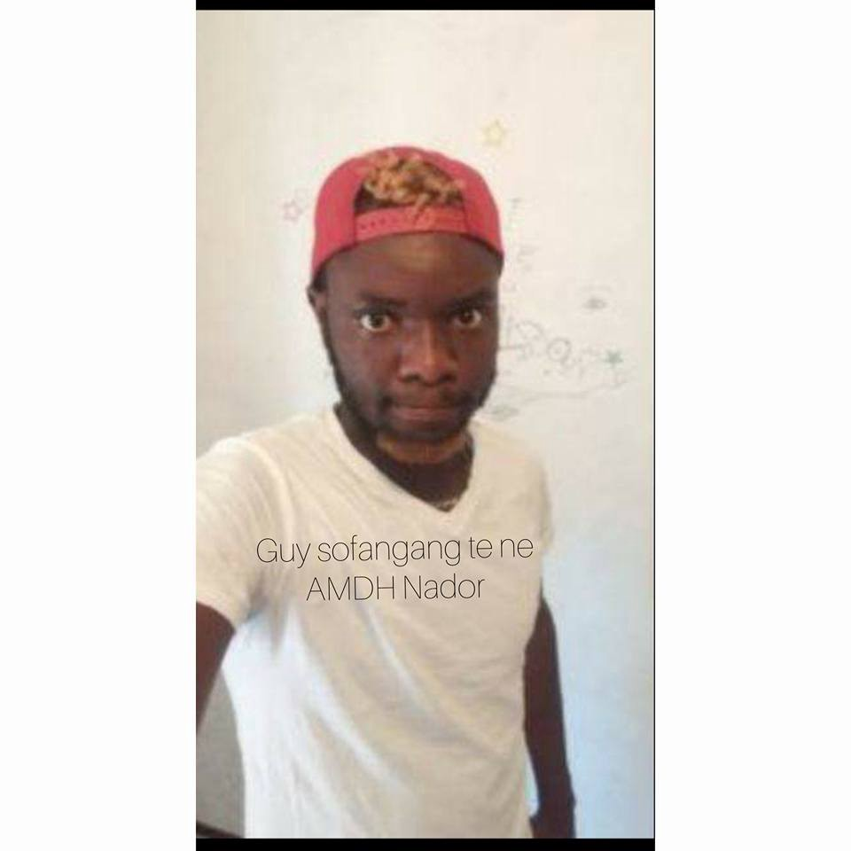
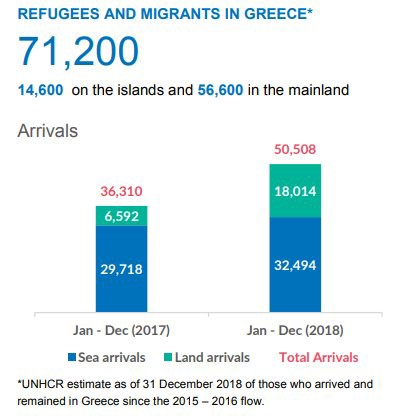
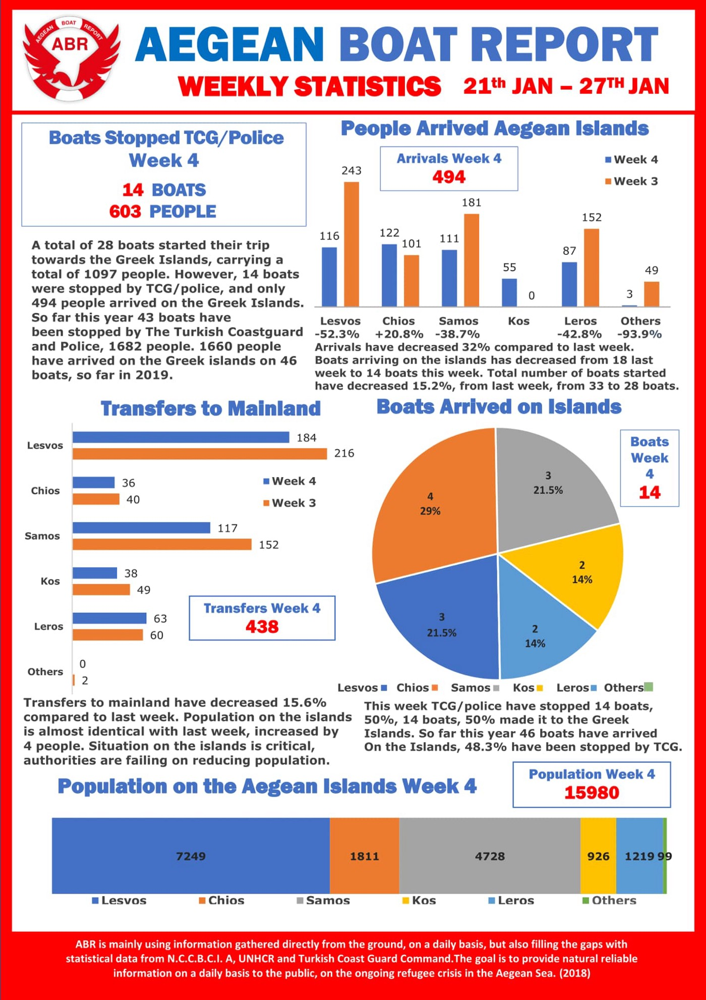

### AYS Daily News Digest 30/1/19: Solidarity and support to everyone at Sea Watch 3
#### Changes in the treatment of minors in France / The Netherlands leaves expelled minors so far, but cuts the refugee resettlement quota / All refugees in Denmark to be there temporarily, no matter the system they came through / &more info

](assets/ff9f0e87060b/1*eSkdt_X1i25VBp2lpKkwgg.jpeg)

on board the Sea Watch, photo by [Brendan Woodhouse](https://www.facebook.com/brendan.woodhouse.18?__tn__=%2CdlCH-R-R&eid=ARC_4fASByT1S1wE4tMeR5_O7TLoUdd-e7RY5onF4JAIPR4Dc-CYzeGA4dmVGIHTiEIeSp66iuSgLB_g&hc_ref=ARTrW-zr_b3-VnXKAysfzlRAOLsOMJU7C4W_cMBkSTCflMVRqvo_KQMv4uQwNr-Xeg4&hc_location=group)
#### FEATURE

Sea Watch migrants to dock in Italy after seven countries agree to take them in\.

■■■■■■■■■■■■■■ 
> **[MSF Sea](https://twitter.com/MSF_Sea) @ Twitter Says:** 

> > It appears that the 47 survivors stranded on board the NGO vessel #SeaWatch3 will finally be allowed to disembark. The mental and physical stress they have needlessly endured over the past 10 days will end. 

> **Tweeted at [2019-01-30 14:52:08](https://twitter.com/msf_sea/status/1090623705959616513).** 

■■■■■■■■■■■■■■ 

France, Germany, Malta, Portugal, Romania and Luxembourg have all now offered to accept some of the migrants who have been stuck on the Sea Watch 3 vessel since 19 January\. On the other hand, in a rather vendetta\-sounding scenario, Minister Salvini promised to sue Sea Watch\.

](assets/ff9f0e87060b/1*qtf5DFVP5Qc1rFPVlcxpZw.jpeg)

photo by: [Brendan Woodhouse](https://www.facebook.com/brendan.woodhouse.18?__tn__=%2CdlCH-R-R&eid=ARC_4fASByT1S1wE4tMeR5_O7TLoUdd-e7RY5onF4JAIPR4Dc-CYzeGA4dmVGIHTiEIeSp66iuSgLB_g&hc_ref=ARTrW-zr_b3-VnXKAysfzlRAOLsOMJU7C4W_cMBkSTCflMVRqvo_KQMv4uQwNr-Xeg4&hc_location=group)

However, Mediterranea and the Sea Watch team have [asked the European Court of Human Rights](https://mediterranearescue.org/news/corteeuropeadirittiumanigovernoitaliano/?fbclid=IwAR2WenNDwfMD5wL2glfNA3_Uffj7Xw-QkOJSwgrjjmSDlFh87ux06TLkJSM) if the Italian government, by preventing the landing, is violating the fundamental rights of the people rescued by Sea Watch 3\.

■■■■■■■■■■■■■■ 
> **[Federico Scoppa](https://twitter.com/FedericoScoppa) @ Twitter Says:** 

> > A migrant onboard the ship has a psychological breakdown, after 11 days stranded on the sea the mental status of people onboard the Sea Watch 3 is becoming an issue. @[seawatch_intl](https://twitter.com/seawatch_intl) #SeaWacht https://t.co/CvsDqjptjN 

> **Tweeted at [2019-01-29 06:29:10](https://twitter.com/federicoscoppa/status/1090134741691629568).** 

■■■■■■■■■■■■■■ 

We quote Sea Watch crew member [Brendan Woodhouse](https://www.facebook.com/brendan.woodhouse.18?__tn__=%2CdlCH-R-R&eid=ARC_4fASByT1S1wE4tMeR5_O7TLoUdd-e7RY5onF4JAIPR4Dc-CYzeGA4dmVGIHTiEIeSp66iuSgLB_g&hc_ref=ARTrW-zr_b3-VnXKAysfzlRAOLsOMJU7C4W_cMBkSTCflMVRqvo_KQMv4uQwNr-Xeg4&hc_location=group) and stand firmly in solidarity with the people stranded on the vessel and the teams who worked and are still working to save their and other lives at sea\.

> We will not sit on this ship in self pity\. We shall not drown in our cause\. We make the best of our time together in unity and solidarity, with all who have faced this journey\. 

> We are now one collective group of people\. For now, even the crew can not leave this ship\. We are all kept as hostages on the sea\. But this does not, and it will not weaken us\. It brings us together\. 

> Doro said that we are now one family\. However I know that soon I’ll be alright and they will continue their journey\. It will be a journey filled with mistrust and fear\. Another struggle for them will ensue, to build a new life in Europe and to have to prove that they are worthy of our lands\. 

> Meanwhile we wait for the politicians to decide what will happen with us, and we pass the time as best we can\. Together we play cards\. Together we read\. Together we try to keep active, making up games and playing music\. 

> The people who I share this iron prison with are incredible\. They have told me about incredible hardships\. Of suffering that I simply can’t imagine\. 

> One guy was on a boat which sank earlier this year\. He is one of only nine survivors of a boat of 120 people\. Many of them have been captured at sea and then returned to the hell from which they were trying to escape\. 

> Most of them have been tortured\. Some worse than others\. Lots of them have been enslaved, sold for the price of a phone\. They have been held at ransom and tortured in video calls to their parents, extorting money from them\. 

> Their dehumanisation is not over, for still they suffer the cruelty of Europe as we wait indefinitely to be allowed into port\. But their resolve is as strong as anything I’ve ever seen before\. 

> Today we shared bread, and ate together as one\. Doro said that in comparison to prison in Libya, this is a paradise\. He is so accustomed to living in detention in Libya, that his statement is just a comparison to the hell that he has had to face\. Being absolutely truthful, I can see the profound psychological effect that this hostility is having upon our friends\. 

> But together, we shall not be broken\. We shall continue to show kindness and compassion on this ship as we know that in unity we are strong\. 

> Say what you want about the 47 survivors, but they are the kindest, gentlest and most incredible group of people that I am privileged to know\. 

> One love\! 

](assets/ff9f0e87060b/1*CeYcZsjhuV6Nj2obb-SqQw.jpeg)

Photo by: [Brendan Woodhouse](https://www.facebook.com/brendan.woodhouse.18?__tn__=%2CdlCH-R-R&eid=ARC_4fASByT1S1wE4tMeR5_O7TLoUdd-e7RY5onF4JAIPR4Dc-CYzeGA4dmVGIHTiEIeSp66iuSgLB_g&hc_ref=ARTrW-zr_b3-VnXKAysfzlRAOLsOMJU7C4W_cMBkSTCflMVRqvo_KQMv4uQwNr-Xeg4&hc_location=group)
#### MOROCCO

[Association Marocaine des Droits Humains — Section Nador](https://www.facebook.com/AmdhNador/?__tn__=%2CdkCH-R-R&eid=ARCn7--UW4UsnRzCsQf7PSXkitHXfPEbaCun6SR01-kqmCxosojuGHy5GtW1JeE3UW2vA6R134CdCmdu&hc_ref=ARSuwTViB6oA97pP5lUe1pWYG1itv3NK2tSj9lQaMEO4yeElEoooObw5U9FkGZNWJK8&fref=nf&hc_location=group) reports they are still looking for 54 migrants missing since 12 January\.

Among the missing is this Cameroonian named Guy\. His family has no news of him since 12 January\. The suspected smuggler who was allegedly responsible for this convoy refuses to cooperate with the family and give them reliable information\. AMDH Nador launches this call for all those who have information to help Anthis family\.
#### GREECE

Many are still complaining against the EU\-Turkey deal as its consequences fall on the heads of the weakest people in the story, the refugees\.

An estimated 71,200 people are stuck in Greece at the moment, according to the UNHCR statistics and based on a report they published in December\.

Here are last week’s stats on the newly arrived people:

### Volunteering

[Samos Volunteers](https://www.facebook.com/samosvolunteers/?__tn__=%2CdkCH-R-R&eid=ARBEwudEi8HTpPqmhHcKpFp-gbT6uQOfPoGa8me3gMMxDAGv1CsX_syUuMIamb3Z1DWvSzqNXtq5Oxxk&hc_ref=ARTV4He7R8nURLyCLtJZu2hkMlr0mEa5YRpH5PILH8NDW9vS-CIWcOqrzD-pOf1Wb38&fref=nf) are looking for new team members:

> Twice a day, we share songs, play and fun\. It’s a stable, joyful moment for children forced to live in unacceptable circumstances\. Think you have the enthusiasm and energy to help kids be kids, even on Samos? 
 

> Then come and volunteer\! 

[www\.samosvolunteers\.org/volunteer](http://www.samosvolunteers.org/volunteer?fbclid=IwAR1WMWdW5l3msxB2j4vPwglaDyVOs3RXaerfIXZ0IlXjs4xIG4vfts3uKDo)

**Montenegro**

Moderate cloud cover to overcast, intermittent rain, in some places possibly a short shower with thunder, in the north, parts of the center and the higher regions in the south sleet and snow\. In the far north and northeast, longer dry stretches\. Wind light to moderate from the south, temporarily stronger in the north\. Low temperatures from \-5 to 7° and highs from \-1 to 12° C\.

**Serbia**

Dry in most parts of the country, light precipitation only locally, mostly in the center and south\. Wind mostly light from shifting directions\. The low temperaturess from \-2 to 1° and highs from 2 to 6° C\.

**BH**

Cloudy before noon, with light snow and rain in the south\. Precipitation will cease in the afternoon and in Bosnia it will clear during the afternoon and evening\. Light weak from the east and southeast\. Low temperatures from \-3 to 5° and highs from 0 to 9° C\.

**Croatia**

Changeably to predominantly cloudy, inland snow and sleet, rain along the coast and local showers\. Local fog inland during the morning\. Wind light, a moderate to strong bura windalong the northern coast, eastern and southern wind in Dalmatia turning to west and northwest\. Low temperatures from \-5 to 6° and highs from \-1 to 12° C\.
#### BOSNIA AND HERZEGOVINA

In the period of 1–27 January this year, the office for foreigners has registered 696 illegal migrants, of whom 585 demonstrated the intention of seeking asylum, while nine people filed the asylum application\. Among these people there were 20 unaccompanied minors, of whom 19 people demonstrated intention for seeking asylum\.

The largest number of migrants who arrived during January comes from: Pakistan \(106\) and Iraq \(102\), followed by Syria \(85\), Morocco \(73\) and Algeria \(67\) \. The other 28\.7 % of the total number of registered migrants come mostly from Bangladesh \(43\), Iran \(40\), India \(34\), Libya \(32\) and Palestine \(25\) \.
#### CROATIA

The bizarre circumstances in Croatia’s asylum system continue\. Although we have all struggled with trying to help people realize their rights in the field of health care, education and other basic human needs, a few years later people are still struggling with large bills for basic healthcare services \(though these should be directly handled between the Ministry of Health and doctors\), education \(children are losing sometimes even two years of education because of a gap in the non\-existent system and the people in charge not knowing they are in charge\) and not getting their passports even if they have a ‘clear’ security situation, five years’ asylum granted in the country, are almost fluent in Croatian and are working their way to becoming independent citizens\. It seems Croatia is not really upholding to their “supporting solely the legal and legitimate processes” policy that the Ministry of Interior representatives keep saying on repeat\. Now what? More beating at the borders and then Schengen?
#### ITALY

■■■■■■■■■■■■■■ 
> **[Tommaso Cacciari](https://twitter.com/TommasoCacciari) @ Twitter Says:** 

> > Al centro sociale @[RivoltaPVC](https://twitter.com/RivoltaPVC) per l'assemblea preparatoria alla manifestazione contro il decreto Salvini.
Siamo centinaia, attivisti, operatori, #ong, studenti medi e universitari, singoli cittadini indignati dal razzismo di questo governo infame.
Il #9F saremo marea
#indivisibil https://t.co/QTguMXnkEd 

> **Tweeted at [2019-01-30 18:28:38](https://twitter.com/tommasocacciari/status/1090678189712650240).** 

■■■■■■■■■■■■■■ 

A young Senegalese immigrant has become a hero in Padua, in the north\-east of Italy, after jumping into a freezing cold river to save an elderly Italian man who was reportedly trying to commit suicide\.
#### FRANCE
### Unaccompanied minors

As in most countries, the ad\-hoc guardian is normally assigned by the justice system to each unaccompanied minor in order to represent them and assist in the administrative procedures regarding asylum\. The prefecture must contact the public prosecutor to request they provide the minor with an ad\-hoc guardian and then the procedure of the young asylum seeker starts\.

Officially, one cannot be subject to the Dublin procedure and transferred to the first European country where the fingerprints were taken, and France should register each asylum request\.

But, news to this procedure is that France will soon adopt a large biometric file listing the identity data of minor migrants who have applied as unaccompanied refugee minors in France\. This means that from April this year any person applying for international protection as an unaccompanied minor will have his data entered into the national biometric system so as to evaluate their exact age and decide if they will be considered as such\. The decision of one department is valid at the national level\. However, while some departments seem to hurry the procedure, others have already refused this system\. It is yet to be seen what will become of the decision in practice\.

> _As a minor, you cannot be placed in housing in an asylum seekers’ reception center [nor receive](https://www.gisti.org/spip.php?article5230) the asylum\-seeker’s allowance\. Only the ASE can house unaccompanied minors\._ 

However, faced with the growing number of unaccompanied minors in the streets, especially in Marseille, Emmaus Pointe\-Rouge is seeking testimonies attesting to their presence in the streets\. Emmaus Pointe\-Rouge is [reportedly](http://www.lamarseillaise.fr/marseille/flash/74721-marseille-emmaus-cherche-des-temoignages-pour-sortir-de-la-rue-les-mineurs-isoles?fbclid=IwAR32SqoTwapVd-I1rsiQe6OodNphffih6FIEg8baOvqtwoRDDffXiU51pVk) looking for testimonies that would allow them to support a lawsuit against the Departmental Council of Bouches\-du\-Rhone\. [Read more](http://www.lamarseillaise.fr/marseille/flash/74721-marseille-emmaus-cherche-des-temoignages-pour-sortir-de-la-rue-les-mineurs-isoles?fbclid=IwAR3jgVmIjbJV3NagctafWJuTrXb15KDG1QTL8e4xMCCfWT-CDSDO4Mf1laQ) \.

Some departments are expanding the capacities of their temporary centers used during the wait \(for the interview\) \. Although the average wait should be around 29 days, according to [some departments](https://www.ladepeche.fr/2019/01/30/42-places-creees-en-2019-pour-la-mise-a-labri-des-mineurs-non-accompagnes,7983960.php?fbclid=IwAR0wqWRr70B90VXnv_zxDQRfmfN76ap7y4UQsE2ovaRh_dMraDNwhu934hM) that are more engaged in the process, they estimate it exceeds 83 days\.
#### THE NETHERLANDS
### Abolishing amnesty, but cutting the resettlement quota

A recent political debate between the Dutch parties [reportedly](https://www.dutchnews.nl/news/2019/01/coalition-reaches-deal-on-child-refugees-agrees-to-abolish-amnesty/?fbclid=IwAR0M690cEt6touQtUkIm0Esg_q7IYm_1A0ouogMsAQysXXAxYmOJz-rs5eg) resulted in a deal which will lead to some 630 of the 700 children facing deportation being allowed to stay with their families\. In total, some 1,300 are likely to be given residency rights\. After their cases have been solved, the much\-criticised amnesty will be abolished and the Netherlands will cut the number of refugees it takes from the UN settlement scheme from 750 a year to 500\.
#### DENMARK

Denmark’s government [changes their policy](https://www.thelocal.dk/20190130/denmarks-government-changes-policy-on-un-quota-refugees-with-new-bill?fbclid=IwAR1fSwqQcyql1j-af32n0U-SKNtq1S7JgSiU2t0gKHNxD76xmANKvYpTu2Q) on UN quota refugees with new bill\. The bill provides for quota refugees to be subject to the same rules regarding their asylum status as all other types of refugees taken in by Denmark\.

This means the application of the government’s view that the status of refugees should always be considered as temporary, and that their status should be revoked as soon as conditions in the origin countries are deemed to allow this\.

**We also publish weekly summaries of some of the most important news reported during the past week in our Daily News Digest: here are the [Arabic](%D8%AA%D9%85%D9%88%D9%8A%D9%84-%D8%A7%D9%84%D8%A7%D8%AA%D8%AD%D8%A7%D8%AF-%D8%A7%D9%84%D8%A3%D9%88%D8%B1%D9%88%D8%A8%D9%8A-%D9%8A%D9%85%D9%86%D8%B9-%D8%A5%D9%86%D9%82%D8%A7%D8%B0-%D8%A7%D9%84%D8%A3%D8%B1%D9%88%D8%A7%D8%AD-%D9%81%D9%8A-%D8%A7%D9%84%D8%A8%D8%AD%D8%B1-%D8%A8%D9%8A%D9%86%D9%85%D8%A7-%D9%8A%D8%AF%D8%B9%D9%85-%D8%A7%D9%84%D9%85%D8%AE%D9%8A%D9%85%D8%A7%D8%AA-%D8%A7%D9%84%D9%84%D8%A7%D8%A5%D9%86%D8%B3%D8%A7%D9%86%D9%8A%D8%A9-%D9%81%D9%8A-%D8%AF%D9%88%D9%84-%D8%A7%D9%84%D8%A8%D9%84%D9%82%D8%A7%D9%86-a7dc22e7bf7f) and [Persian](%D8%A7%D8%B1%D9%88%D9%BE%D8%A7-%D8%A7%D8%B2-%D9%BE%D8%B1%D8%AF%D8%A7%D8%AE%D8%AA-%D9%87%D8%B2%DB%8C%D9%86%D9%87-%D8%A8%D8%B1%D8%A7%DB%8C-%D9%86%D8%AC%D8%A7%D8%AA-%D9%85%D8%B1%D8%AF%D9%85-%D8%AF%D8%B1-%D8%AF%D8%B1%DB%8C%D8%A7-%D8%AC%D9%84%D9%88%DA%AF%DB%8C%D8%B1%DB%8C-%D9%85%DB%8C-%DA%A9%D9%86%D8%AF-%D8%AF%D8%B1-%D8%AD%D8%A7%D9%84%DB%8C-%DA%A9%D9%87-%D8%A8%D8%B1%D8%A7%DB%8C-%DA%A9%D9%85%D9%BE-%D9%87%D8%A7%DB%8C-%D9%86%D8%A7%D9%85%D9%86%D8%A7%D8%B3%D8%A8-%D8%AF%D8%B1-586506d64ef8) for the Week of January 21–28\.**

**We strive to echo correct news from the ground through collaboration and fairness\.**

**Every effort has been made to credit organizations and individuals with regard to the supply of information, video, and photo material \(in cases where the source wanted to be accredited\) \. Please notify us regarding corrections\.**

**If there’s anything you want to share or comment, contact us through Facebook or write to: areyousyrious@gmail\.com**

_Converted [Medium Post](https://medium.com/are-you-syrious/ays-daily-news-digest-30-1-19-solidarity-and-support-to-everyone-at-sea-watch-3-ff9f0e87060b) by [ZMediumToMarkdown](https://github.com/ZhgChgLi/ZMediumToMarkdown)._
