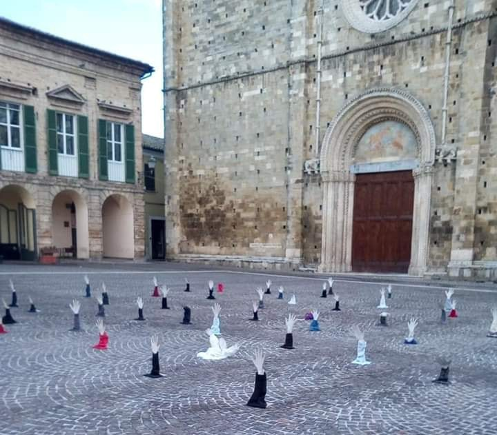
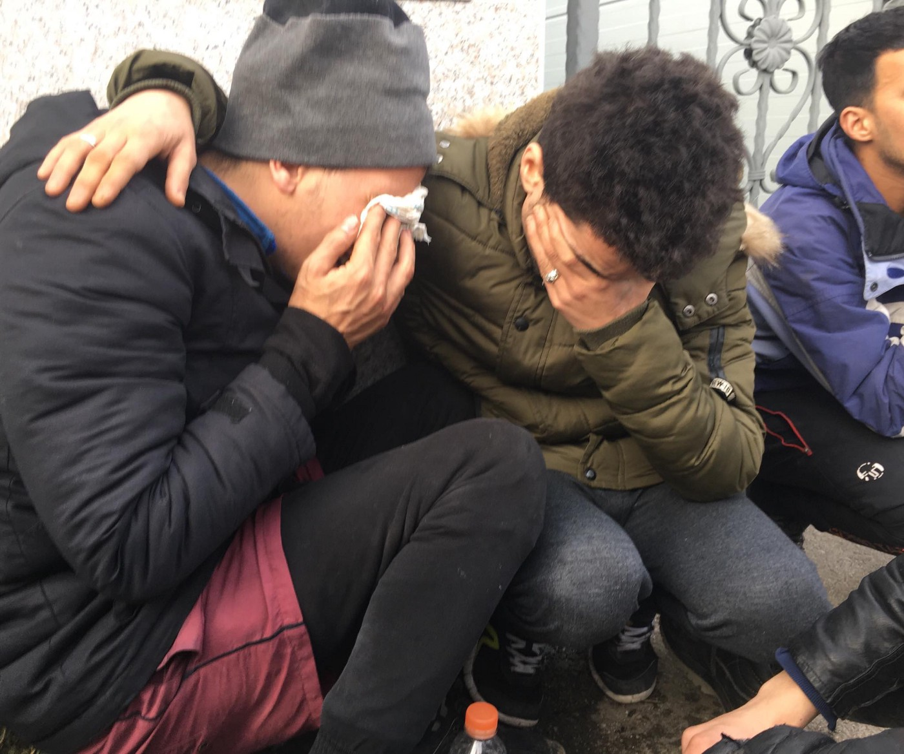
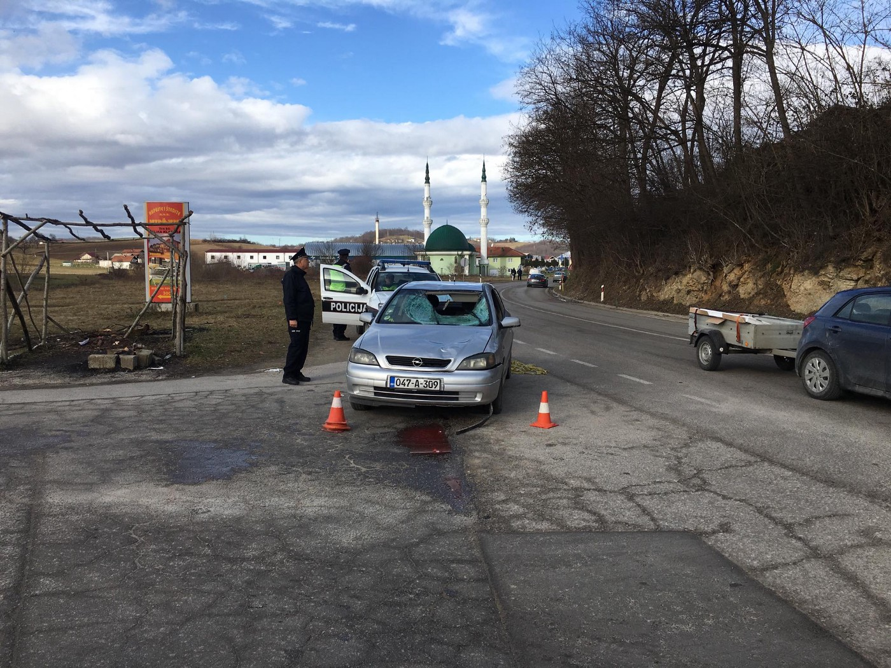

### AYS DAILY DIGEST WEEKEND 2/3\.2\.2019: European deadly trap

_Three girls died in ship wreck in Evros // Father of 5\-year\-old died in car accident in Bosnia // Victim of trafficking got asylum in Serbia // Elin Ersson, the Swedish student who tried to halt a deporation onboard a plane is on trial today // and much more from the rest of Europe_

“Welcome” for minister Salvini in Atri, Abruzzo, Italy\. A square filled with “drowning” hands\. A slap in the face of the arrogance and inhumanity of his policies\. By L’Urlo\.
### Feature

Devastating beginning of the week: three girls — three sisters from Iraq — died in [another boat sinking](https://greece.greekreporter.com/2019/02/03/three-young-sisters-among-missing-migrants-in-greeces-evros/) which occurred at the Evros river\. One more body was discovered, while more people are missing\. All of them, refugees from Iraq, were on the inflatable boat they used to cross from Turkey to Greece\.

People were discovered by police on an outcrop of rocks in the middle of the river\.

The father of the three girls is among the survivors, as are two of their siblings, a girl and a boy\.

So far in 2019, 308 people died while trying to reach Europe or once on the mainland, forced to choose dangerous routes due to closed borders\.

Only last week several big incidents were recorded in the Mediterranean\. Two ship wrecks occurred in the Red Sea’s Strait of Bab el\-Mandeb, off the coast of Obock, Djibouti\. The number of people who were on this boat is not known, but what is certain is that it was overcrowded which is the reason why it sunk\. So far, 15 survivors have been found, while 52 bodies were recovered from the sea\.

[Mediterranean Migrant Arrivals Reach 5,989 in 2019; Deaths Reach 208](https://www.iom.int/news/mediterranean-migrant-arrivals-reach-5989-2019-deaths-reach-208) 
[Geneva — IOM, the UN Migration Agency, reports that 5,989 migrants and refugees have entered Europe by sea through the…www\.iom\.int](https://www.iom.int/news/mediterranean-migrant-arrivals-reach-5989-2019-deaths-reach-208)
### Sea

The prosecutor of Catania recognises that the SeaWatch 3 rescue boat operated correctly in the rescue of 47 shipwrecked people and in its decision to makes its way towards Italian ports\. Italian newspaper [Vita](http://www.vita.it/it/article/2019/02/02/sorpresa-la-procura-di-catania-per-la-sea-watch-3-nessun-rilievo-penal/150554/?fbclid=IwAR0yby6r1jUTFt_9XGUVZ-wClcU2uRPTNMqMfv8a5c6_ip4Z8hw1py5yeb4) reports on a note signed by prosecutor of Catania Carmelo Zucchero, that states the investigations have led to prove the legality of Sea Watch 3’s actions\.

On 19 January, the ship correctly referred to the Libyan, Maltese and Italian MRCC authorities\. The communication with the Libyan authorities got interrupted because the Libyans showed they could not understand English, while the Italian and Maltese ones mentioned their incompetency in acting according to the laws of the international conventions\.

The ship did not choose Tunis but Siracuse, because previously the Tunisian authorities had not allowed Sea Watch 3 to even stop in their harbors for supplies\. The representative of the Dutch MRCC seems to corroborate the thesis: without telling the Sea Watch 3’s crew, he requested the Tunisian authorities to allow the landing of the ship, without receiving any reply\. In this situation, the commander’s choice to lead the ship north to look for a safe harbor cannot be deemed unjustified\.

Prosecutor Zucchero further stated that without the presence of SeaWatch, the 47 people would have died, as no other boat was in the area\. The question now is how many more have already died, because SeaWatch, and other rescue organisations, are criminalised and prevented from helping\.

MSF has provided psychological support to 32 people who disembarked from the SeaWatch 3\. It says they spent up to two years detained in inhumane conditions in Libya, with little access to water and food\. Many show signs of violence and torture\.

[IOM](https://www.iom.int/news/mediterranean-migrant-arrivals-reach-5989-2019-deaths-reach-208) says 5,989 people have entered Europe by sea through the first 30 days of 2019, while 208 individuals have died\.
### Greece

The situation in Greece, on the islands and mainland, does not get any better for people on the move\. As 1796km group reports, in Malakasa refugee camp, near Athens, there are at the moment about 2000 residents who are registered, plus about 500 unofficial more\.

[Attika Human Support](https://www.facebook.com/AttikaHumanSupport/?__tn__=%2CdkCH-R-R&eid=ARBbwFXSmyNFVAK4fK5liNhz6VzIOzwNC7EG1i4qEAE0GTHojMPXChJpEHw3ao_QzvzWUpCEc61cZzTD&hc_ref=ARShCUT2IgJGm9C2A6US0i6EO5NB1Q22ER_A4vttN4Sl3ZrfAewkFdq70jsFg3IbH60&fref=nf) reports about the increase in arrivals on the islands, especially Lesvos and Chios, but also the difficult situation on mainland\. An essential part of the volunteer system, the group runs the largest warehouse on Lesvos and distributes items to organisations all over Greece, for example, diapers for the Pikpa camp, sleeping bags for Samos and water for the No Border Kitchen\.

The Ellinikon Warehouse in Athens meanwhile needs food and hygiene items to distribute to other groups\. Ways to deliver items and make donations can be found on the [Athens Volunteers Information Group](https://www.facebook.com/groups/AthensVolunteersInformation/permalink/1611740928958198/?hc_location=ufi) \.

[CHEER](https://www.facebook.com/CHEERequity/) \(the Center for Health Equity, Education, and Research\) is offering free trainings on Infant Feeding in Emergencies in Athens in February and April\. The organisation can also visit and do trainings for organizations that serve mothers and infants\. More general information on breastfeeding vs bottle feeding, particularly in the Greek context, can be found on the Athens Volunteers Information and Coordination Group\.
### Bosnia

On the 3 February at 5\.30 AM, Abdelhamid \(34\) from Algeria, who was a resident of the Miral Accommodation Centre in Una Sana Canton \(run by the [IOM — UN Migration](https://medium.com/u/664cb26312d4) with the presence of other [United Nations](https://medium.com/u/3e33f42d2bd) agencies and their partner organizations in Bosnia\), was hit by a car and died\. The person who responsible left the scene, but later on went to the police by himself and is now in police custody\.

Abdelhamid was with two friends at the moment the accident happened 200 meters away from the camp entrance\. When one of the friends alerted the private security guards patrolling the centre, that are hired by the IOM and supposedly trained by the United Nations, they told the young man to leave and refused to call an ambulance\.

The young man could not find any IOM staff to assist him, and so ran to the petrol station next to the camp and alerted the woman working inside, who called police\. No ambulance arrived to the scene; instead the critically injured man and his friends were taken in a police car to the local hospital in Velika Kladusa approximately one hour after the time of the accident\.

When the friends of the injured man asked police why no ambulance is coming, they allege that they were verbally attacked by the officers that came to assist\.

The injured was proclaimed deceased 10 minutes after his arrival to the hospital\.

Back in Algeria, Abdelhamid has a 5 year old daughter and wife\. The friends remain in shock and are devastated by the lack of support from camp personnel to help their friend who very possibly could have been saved if there was a more humane reaction to the accident\.

IOM is responsible for the camp and responsible to handle emergencies such as this\. It is evident that they have no strategies in place to deal with such events, IOM personnel arrived on the scene at 10am, four and a half hours after the accident happened\.

Volunteers from [SOS team Kladusa](https://www.facebook.com/SOSTeamKladusa/posts/2218974748366527?hc_location=ufi) published a short update of the general situation in the city where they, together with citizens of Kladusa, run a small restaurant \(they serve 250 to 380 people a day\), free shop, and provide first aid\.

The restaurant is supported by the [Lemon Foundation](https://www.facebook.com/lemonfoundation/?__tn__=K-R&eid=ARB2UfPD-0yALPSiBTWWfGLimPNW-5HgXA6BcjdkP34Hof5Z72kc-m4SSycqzQcprJCLaYmTUrE96twF&fref=mentions&__xts__%5B0%5D=68.ARDpZSmdqE1DlJmTQTFmiAY9rBU097HWvPcZf9t0sfmYxl6BIQWVvc4HQj5qWxoWy6ssVSYVa701jgrIJIEC5wwyRRQV82blLnSMPdMBsd5Zw91FErsiiW-FLYiP1YTnITJB1NKfkUnLDeDaxnwdeHZ1SUHn0uQ09g0UovvkGgtPR9hfwrXVGcxGG07lE-5wx6LRNpn9xCHZ48i8xUEanekBJz_NFhQkrhLJZ_ZsgUgQF0itWwzAEqtqNsPuHPcHQfTrQs8ZOcqO2VTfXTEc9aQNhcbNW1k2GiEiXe9VYp7Ysv0F1boyP0KkCCaO7_pNoPy3qNVlGkKol7wO52L1OQu0xA6Y) , but more help is needed\.

When it comes to the general heath situation in the city, the biggest issues remain flu and scabies, next to various kinds of wounds and pains\.

If you can, [support this team](https://www.gofundme.com/wx3ydx-feed-the-people…) of locals and internationals doing very important work\.
### Balkan Weather

_MONTENEGRO_

Predominately cloudy with rain from time to time, local showers and thunder, in the higher areas snow and sleet\. In the afternoon precipitation will gradually stop\. Wind from the north will be moderate to strong, towards the end of the day strong in the south\-east\. Lowest temperatures from \-1 to 10 and highest daily from 1 to 16 degrees\.

_SERBIA_

Moderately to entirely cloudy, windy and warmer with a further melting of the snow cover on altitudes up to 1500 metres\. Before noon in the southwest, in the afternoon in the west and north and in the evening in the center there will be local rain and showers\. Wind moderate to strong, locally stormy to very stormy blowing from the south\-east and decreasing in strength later in the day\. Lower temperatures from 0 to 12 and highest daily from 15 to 18 degrees\.

_BiH_

Due to heavy rain and rising of temperatures, a big part of the country is flooded, and roads are blocked\.

Cloudy, in the lower parts of the country weak rain or sleet and in the higher regions weak snow\. Wind weak to moderate blowing from the north\. Lowest temperatures from 0 to 5 and highest daily from 6 to 11 degrees\.

_CROATIA_

Moderately to predominately cloudy and colder\. Locally rain or snow\. Wind moderate mostly, sometimes with strong gusts, blowing from the north\-east and north\. Alongside the coast moderate to strong Bura with at some places stormy gusts\. Lowest temperatures from \-1 to 4 and highest daily from 2 to 13 degrees\.
### Serbia

At the end of 2018, an unaccompanied minor girl from an African country received asylum in Serbia\. This was the first instance of asylum being granted to an unaccompanied minor in the country\. The young girl was deceived, with the promise that she will have the opportunity to finish schooling and was taken from her homeland to a neighbouring country of Serbia where she was violently pushed into a prostitution ring\. Although she managed to seek protection, she was illegally pushed into Serbia, where she had never entered or stayed before\.

[UNHCR](https://reliefweb.int/report/serbia/serbia-inter-agency-operational-update-october-december-2018?fbclid=IwAR0LfnlHOTMwKMess1fyA8QC8fSzrscgCy2deZL0XNK5HeOOp8-RBg6TQPA) says that “the number of new refugees, asylum\-seekers and migrants counted as present in Serbia increased by 14% to 4,470 on 31 December”\. 36% of registered refugees and migrants were minors\.

What the authorities and groups working in this country are noticing since the beginning of this year \(the same trend is visible in Bosnia\), is an increase in the number of children traveling alone\.
### France

Law students are providing [legal aid in Paris](https://www.facebook.com/groups/P2PParis/permalink/2051547264932137/) , but they need help to continue doing so:

_“In order to combat these unjust migration policies, we have therefore decided to bring to the benefit of the most vulnerable people a lasting legal assistance in obtaining protection in order to get them out of this infernal circle as soon as possible\.”_

The legal clinic is an association attached to the bar training school of the Paris Court of appeal \(Paris Lawyer’s school\) \.

[First Aid Support Team — FAST](https://www.facebook.com/FASTFirstAidSupportTeam/?__tn__=%2CdkCH-R-R&eid=ARBfAxpVp0xSDLMIwPwqDrfxld0hyOmlXHql-DY0AjRYY-0oelcsZ_wnmsmf8vjlbpPdnhEpeHaECtgu&hc_ref=ARSRwN6bigRedlY_KC_J16pNerZQYbhQ6thSRsY33nbvQ156p9wHENkCl9adeSv_lrM) , present is Calais, is looking for a fundraiser\! \(Volunteer\) \. They ask for help for a couple of hours a week, and the job can be done from home\.

If you are interested, please apply on this vacancy or send an email for more information to [info@f\-a\-s\-t\.eu](mailto:info@f-a-s-t.eu)
### Belgium

 in Gent, 1st February 2019 at 6 am, **“** This is not a Flemish painting of the 17th century, this is a picture of a group of frozen migrants trying to reach England\.”](assets/e59476b9b91a/1*Fg1mXxvb2opn2r_2SlsfCQ.jpeg)

[Isabelle Dion](https://www.facebook.com/isabelle.dion?__tn__=%2CdCH-R-R&eid=ARApKg4we36ZFdgJwQ3HNAXQbq1dnC6JYAaTcI7WI-LbMyBKISQL5L24CLuIvvNaMWaNc7_prPEvoEbo&hc_ref=ARQciF-7nbhB7nrLVxcO9ZcGYa0DNyunlr_vIAZSpxjqVw8zeTJSjcVWa1cJRd1P228&fref=nf&hc_location=group) in Gent, 1st February 2019 at 6 am, **“** This is not a Flemish painting of the 17th century, this is a picture of a group of frozen migrants trying to reach England\.”
### Germany

Rostock Deacon and Rostock Hilft activist Arne Bölt was convicted in Sweden last week of smuggling, for helping a Syrian family reach Sweden in the spring of 2016\. The Supreme Court in Stockholm rejected a challenge on 17 January\. The judgment in the form of a fine in the middle four\-digit range is thus legally valid\. The association [Rostock Hilft](https://www.hrohilft.de/team-arne/?fbclid=IwAR0R1MBgbInGiy5m4X8GSSXksBeWcnf0TeP-XEWYs5fb_XRtMoUkza4b1FM) , however, announced a protest and wants to support Bölt in the costs of the proceedings and attorney’s fees\.

Ronja Thiede from Rostock Hilft says:

> “Arne did exactly what many volunteers did here in Rostock in 2015 and 2016\. We all helped people to come to Sweden, to their families, friends and relatives\. The verdict against Arne is a verdict against us all, for whom the human right to family, to asylum and freedom of movement is not just an empty phrase” 

In the fall of 2015 , more than 30,000 refugees tried to get from Rostock to Sweden by ferry and were supported by hundreds of Rostock volunteers\. The association Rostock Hilft calls for donations through this [link](https://www.hrohilft.de/team-arne/?fbclid=IwAR0R1MBgbInGiy5m4X8GSSXksBeWcnf0TeP-XEWYs5fb_XRtMoUkza4b1FM) \.

A mass deportation will take place this Wednesday from Leipzig to Tunisia\. A [protest and information day](https://www.facebook.com/events/624016498035786/) will take place in Leipzig to inform about “the European border regime and its consequences for North African society”\.

Photo by Die Grenze ist das Problem
### Sweden

Elin Ersson , the Swedish student who livestreamed her onboard protest against the deportation of an Afghan asylum seeker will go on trial on Monday at Gothenburg District Court, charged with violating Sweden’s Aviation Act\.

She protested in July last year against the policy of deporting rejected asylum seekers to Afghanistan by boarding an Istanbul\-bound flight that carried an Afghan man who was to be returned home after being denied asylum\.

With a ticket for the flight that was purchased by the activist group ‘Sittstrejken i Göteborg’, the activist boarded the aircraft and then [refused to sit down until the Afghan man was let off](https://www.thelocal.se/20180725/swedish-students-protest-throws-issue-of-afghan-deportations-into-the-spotlight) \. Flights are not allowed to take off until all passengers are safely in their seats\.

Ersson livestreamed her protest on Facebook, where it was viewed over five million times\.

“I believe that she is guilty of a crime which I can prove and which she will not admit\. The court will therefore determine this,” prosecutor James von Reis told TT when charges were brought against the student\.

“The key issue for me is that the man who was to be deported is human and deserves to live\. In Sweden we do not have the death penalty, but deportation to a country which is at war can mean death,” Elin Ersson said\.

The trial is expected to be completed within one day and Ersson’s defence has sent supplementary evidence to the court\.

**We are an entirely volunteer\-run media team, and we rely on our supporters to share our news\. So please share, and never forget to ACT\!**

**We strive to echo correct news from the ground through collaboration and fairness\. Every effort has been made to credit organizations and individuals with regard to the supply of information, video, and photo material \(in cases where the source wanted to be accredited\) \. Please notify us regarding corrections\.**

**If there’s anything you want to share or comment, contact us through Facebook or write to: areyousyrious@gmail\.com**

_Converted [Medium Post](https://medium.com/are-you-syrious/ays-daily-digest-weekend-2-3-2-2019-european-deadly-trap-e59476b9b91a) by [ZMediumToMarkdown](https://github.com/ZhgChgLi/ZMediumToMarkdown)._
