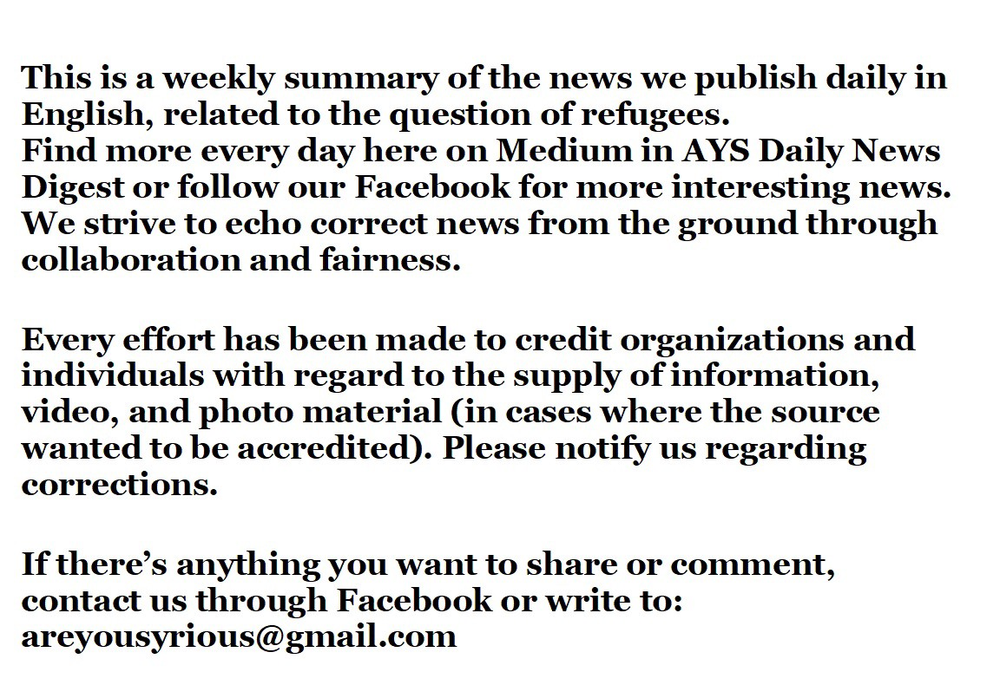

### أصبحت إسبانيا نقطة الدخول الرئيسية إلى أوروبا
#### AYS Weekly News Summary in Arabic, January 28– February 3

 by](assets/27939af2b662/1*uCrkaNXQpAA_ZJE5YvMdSg.jpeg)

[**SAFETY4SEA** ‏](https://twitter.com/safety4sea) by
### **ليبيا**

على الرغم من كل الانتقادات الموجهة إلى تعاون الاتحاد الأوروبي مع ليبيا ، إلا أنها لن تتوقف\. قام وزير الخارجية محمد سيالا بزيارة إلى النمسا معلنا أن ليبيا ستزود الاتحاد الأوروبي بحلول ٢٠ فبراير بسياسة نهائية مطلوبة لتأمين الحدود الجنوبية في البلاد\. وأوضح أن “الحدود الحقيقية للاتحاد الأوروبي ليست في البحر الأبيض المتوسط ​​ولكن في الصحراء الليبية الشاسعة،” في اشارة الى تدفق المهاجرين عبر الحدود الجنوبية لليبيا\.

تقريبا في نفس الوقت يأتي خطاب مفتوح وقعه ٥٢ منظمة، وتتهم حكومات الاتحاد الأوروبي من “بالتواطؤ في مأساة المهاجرين الذين يعبرون من ليبيا إلى إيطاليا، قائلا ان أكثر من ٥٣٠٠ شخص لقوا حتفهم في البحر الأبيض المتوسط ​​في العامين الماضيين\. “

ويطلق على المنظمات غير الحكومية على الحكومات الأوروبية لدعم عمليات الإنقاذ ووقف ارسال الناس الى ليبيا، مشيرا إلى أن الدول الأعضاء في الاتحاد الأوروبي يجب أن تكون “مستعدة لتعليق بالتعاون مع خفر السواحل الليبي إذا لم يتم التعامل مع قضايا مثل الاعتقال التعسفي مع” حكومات الاتحاد الأوروبي يجب أن كما يؤيدون عمليات البحث والإنقاذ والتأكد من أن الأشخاص الذين يتم إنقاذهم في البحر يمكنهم الوصول بأمان ودون تأخير إلى أوروبا ، كما يعتقدون\.
### **المغرب**

#### [جمعية \(ماروكاينه\)](https://www.facebook.com/AmdhNador/?__tn__=%2CdkCH-R-R&eid=ARCn7--UW4UsnRzCsQf7PSXkitHXfPEbaCun6SR01-kqmCxosojuGHy5GtW1JeE3UW2vA6R134CdCmdu&hc_ref=ARSuwTViB6oA97pP5lUe1pWYG1itv3NK2tSj9lQaMEO4yeElEoooObw5U9FkGZNWJK8&fref=nf&hc_location=group) — قسم الناظور يفيد أنهم ما زالوا يبحثون عن ٥٤ مهاجراً مفقودين منذ ١٢ يناير\.

بين المفقودين هو هذا الكاميروني يدعى غي\. عائلته ليس لديها أخبار عنه منذ ١٢ يناير\. يرفض المهرب المشتبه به الذي يُزعم أنه مسؤول عن هذه القافلة التعاون مع العائلة ومنحها معلومات موثوقة\. تطلق شركة \(نادور\) هذه الدعوة لجميع من لديهم معلومات تساعد عائلة
### **تركيا**

من المخرج سيركان أوزيومساك ، فيلم قصير مؤثر عن واقع طفلين سوريين يعيشان في تركيا:

### **إيطاليا**
#### منطقة الحدود مع فرنسا

[“يتم الاحتفاظ بعشرات الأشخاص](ays-daily-digest-26-27-1-18-eu-funded-misery-on-the-greek-islands-ff6cfe68fae3) داخل حاويات معدنية لمدة تصل إلى ٢٤ ساعة أو أكثر ، بدون طعام أو ماء أو مراحيض أو رعاية طبية أو سقف\. يتم الحفاظ على الأرضية مبللة حتى لا يستطيع أي شخص الجلوس أو الاستلقاء ، مما يجعله وضعًا لا يطاق بالنسبة للأشخاص المصابين بالإرهاق والمتعبين بالفعل هناك “\.

يساعد فريق [كيشا نيا](https://www.facebook.com/KeshaNiyaProject/?__tn__=%2CdkCH-R-R&eid=ARCBZVAZ0aEXY-tPdOjG59bzfV0fQgwZoq-BM5Jb4KR534urbIue7fuFgce1kj8jK0e7WGXfKERJ536v&hc_ref=ARTZ1Q2R7-YjQiI7q6pPEPQ2rMiq_UBADa4b2G7NPXE1mIbj2nJDs-XCa2omgq_lWZk&fref=nf&hc_location=group) على الجانب الإيطالي ويجمع العديد من القصص على مدار الأسبوع\. هذا ما كتبوه:

> في الآونة الأخيرة ، أظهرت القصص التي نجمعها زيادة كبيرة في عنف الشرطة وإساءة استخدام السلطة: 

> الشرطة الفرنسية تأخذ وثائق مهمة بعيدا \(مثل شهادات ميلاد القاصرين\) وعندما يطلبون إعادتهم ، أو يطلبون الطعام أو الماء ، يحصلون على لكمات في الوجه \(… مع عصابة\) \. ضربوا قاصرين لمحاولتهم إعلان أنفسهم كقاصرين\. إنهم يرشون الفلفل في الوعاء المغلق ، وأحيانًا مباشرة في العيون ، ويضربون الناس دون رحمة\. 

> خرج رجل يوم أمس مع كدمات و جروح ودماء على سترته ، وعلى ظهر يده كان لديه علامة حروق: الشرطة الفرنسية لم تضربه فقط وأهانته ، ولكن أيضا أخمدت سيجارة على يده \(شاهد الصور\) \. 

> أخبرنا كيف أنهم صفعوا وجهه ولكموه وأخبره أحدهم أنه سوف يمارس الجنس مع أمه\. أخذوا كل متعلقاته\. 

> نأمل ألا يكون هناك حاجة لإضافة هذا ، لكن ليس لدينا سبب للشك في هذه الحسابات: فالكلّ تم حبسهم معًا وتأكيد قصص بعضهم البعض بشكل مستقل\. 

> نحن لسنا متفاجئين ولكن غاضبين\. هذا هو إلى أي مدى ستذهب الدولة الفرنسية إلى “عدم تشجيع” الهجرة\. 

> سنستمر في تناول وجبة الإفطار ونحاول تقديم كل التشجيع والتضامن والقهوة التي يمكننا القيام بها\. 

### اليونان

■■■■■■■■■■■■■■ 
> **[MSF Sea](https://twitter.com/MSF_Sea) @ Twitter Says:** 

> > Every day on our clinic in #Lesvos, #Moria we treat children for diseases that under normal circumstances are easily preventable. These children deserve much better than that. #letthemout https://t.co/EsM8yldaSE 

> **Tweeted at [2019-02-01 13:46:52](https://twitter.com/msf_sea/status/1091332056481701888).** 

■■■■■■■■■■■■■■ 

■■■■■■■■■■■■■■ 
> **[International Rescue Committee - UK](https://twitter.com/RESCUE_UK) @ Twitter Says:** 

> > At Moria, Lesvos, people living in tents are facing their eighth consecutive day of rain.
The Greek reception system is failing to protect vulnerable people seeking asylum. 
As people cannot stay dry &amp; conditions remain poor, the effect on mental health is extensive.
#RefugeesGr https://t.co/PRxhWYsFRp 

> **Tweeted at [2019-01-31 23:10:01](https://twitter.com/irceurope/status/1091111389228339200).** 

■■■■■■■■■■■■■■ 

### فرنسا

### **اسبانيا**
#### تشديد العقدة التشريعية

أصبحت إسبانيا نقطة الدخول الرئيسية لأوروبا بالنسبة للاجئين والمهاجرين ، وتجاوزت اليونان وإيطاليا\. وصل أكثر من ٥٥ ألف مهاجر إلى إسبانيا عن طريق البحر في عام ٢٠١٨، وفقاً لوكالة الأمم المتحدة للاجئين\.

طرح اقتراح جديد للحكومة الإسبانية خطة لطرد ٩٠٠٠ مهاجر غير شرعي في البلاد\. كما أنهم يخططون لإنشاء مراكز اعتقال جديدة \(س ا ي س \) في مدريد وفي مدينتي ملقة والجزيرة ، وهي نقاط الوصول الرئيسية للأشخاص غير الموثقين\. هذا الاقتراح يؤكد تشديد الهجرة غير النظامية ، تقارير\( ي س ر ي\)

### **هولندا**

بعد أكثر من ثلاثة أشهر ، أنهت كنيسة هولندية بروتستانتية خدمة بدون توقف ، حيث بدأت في حماية العائلة التمرجية ، طالبي اللجوء الأرمينيين ، من الترحيل\. وجاء هذا الإعلان بعد أن قررت الحكومة الهولندية أنها ستراجع مئات طلبات اللجوء المقدمة من قبل الأطفال الذين تم رفضهم من قبل ، والتي ستشمل الأسرة التي كانوا يحمونها\.

عقدت الخدمة الأخيرة يوم الأربعاء الساعة ١٠ بعد الظهر\. وتليها حفلة\.

فرت عائلة تمرازيون من أرمينيا بعد أن تلقى الأب تهديدات بالقتل بسبب أنشطته السياسية\. لقد كانوا في هولندا لمدة تسع سنوات
### **الدنمارك**

قامت منظمة دعم وإسداء المهاجرين الأفغان بتوثيق الترحيل من الدنمارك إلى كابل ، [أفغانستان:](https://www.facebook.com/AmasoAfg/photos/a.1419588361404777/2319366604760277/?type=3&permPage=1)

> ليس لدينا أي اتصال في أفغانستان وسف ازور البلاد لأول مرة\. \. 

أصبحت إسبانيا نقطة الدخول الرئيسية لأوروبا بالنسبة للاجئين والمهاجرين ، وتجاوزت اليونان وإيطاليا\. وصل أكثر من ٥٥ ألف مهاجر إلى إسبانيا عن طريق البحر في عام ٢٠١٨، وفقاً لوكالة الأمم المتحدة للاجئين\.

طرح اقتراح جديد للحكومة الإسبانية خطة لطرد ٩٠٠٠ مهاجر غير شرعي في البلاد\. كما أنهم يخططون لإنشاء مراكز اعتقال جديدة \(س ا ي س \) في مدريد وفي مدينتي ملقة والجزيرة ، وهي نقاط الوصول الرئيسية للأشخاص غير الموثقين\. هذا الاقتراح يؤكد تشديد الهجرة غير النظامية ، تقارير\( ي س ر ي\)

_Converted [Medium Post](https://medium.com/are-you-syrious/%D8%A3%D8%B5%D8%A8%D8%AD%D8%AA-%D8%A5%D8%B3%D8%A8%D8%A7%D9%86%D9%8A%D8%A7-%D9%86%D9%82%D8%B7%D8%A9-%D8%A7%D9%84%D8%AF%D8%AE%D9%88%D9%84-%D8%A7%D9%84%D8%B1%D8%A6%D9%8A%D8%B3%D9%8A%D8%A9-%D8%A5%D9%84%D9%89-%D8%A3%D9%88%D8%B1%D9%88%D8%A8%D8%A7-27939af2b662) by [ZMediumToMarkdown](https://github.com/ZhgChgLi/ZMediumToMarkdown)._
