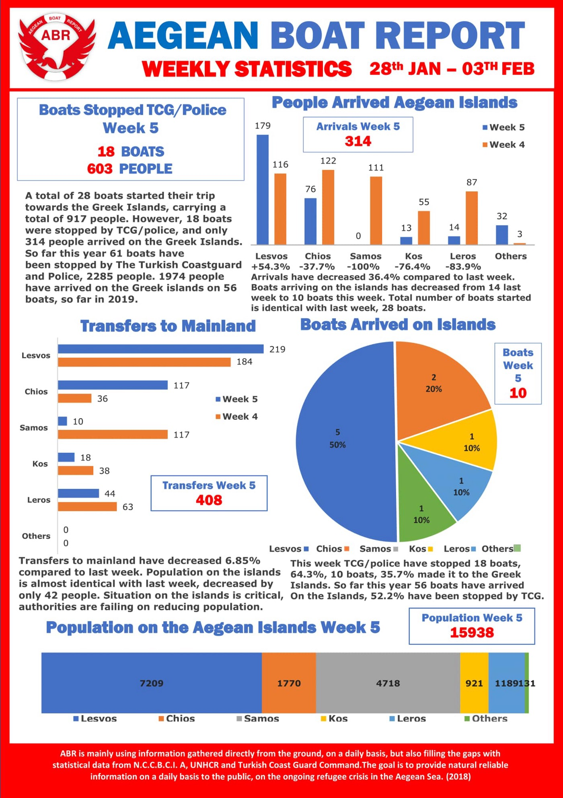
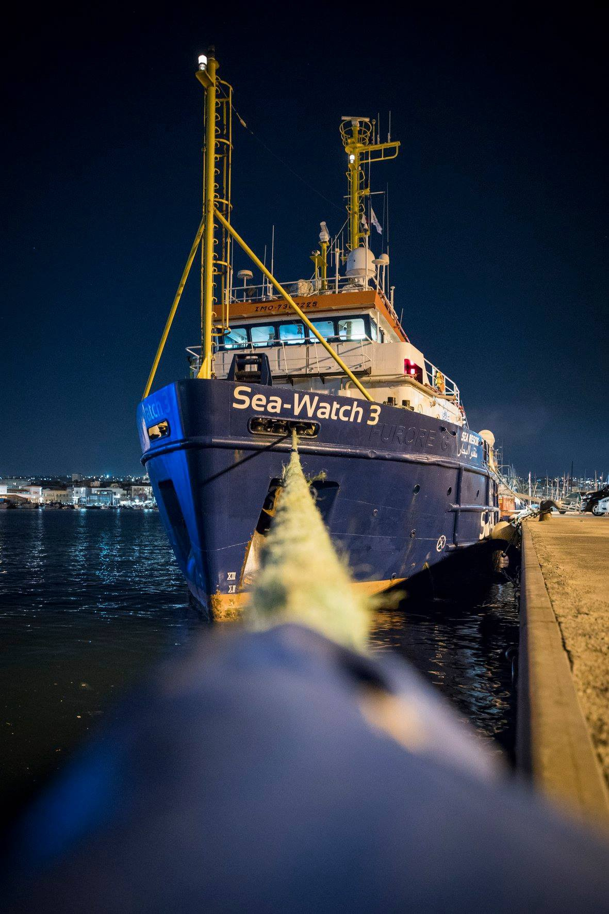
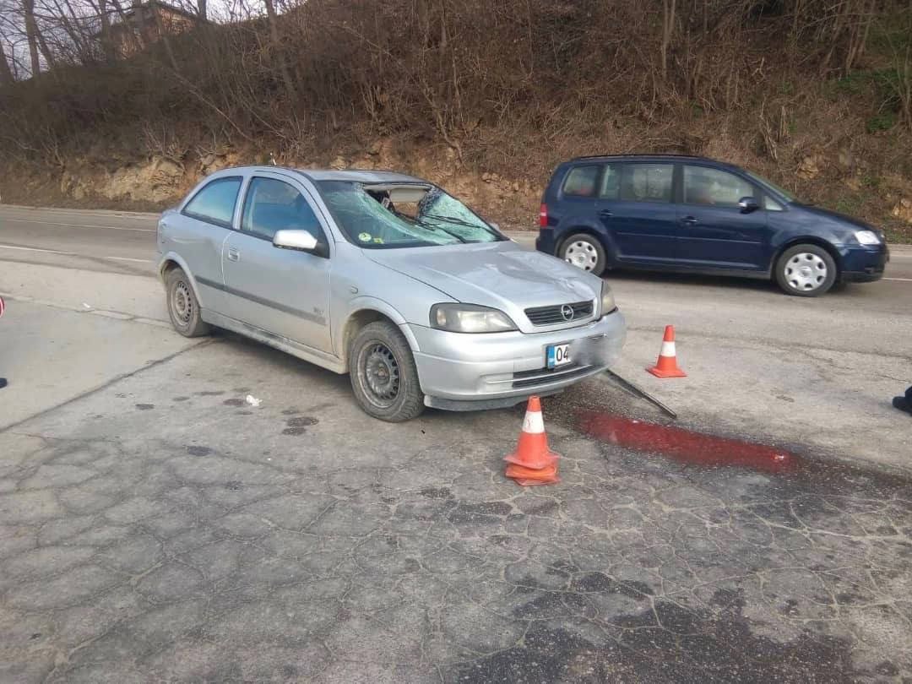
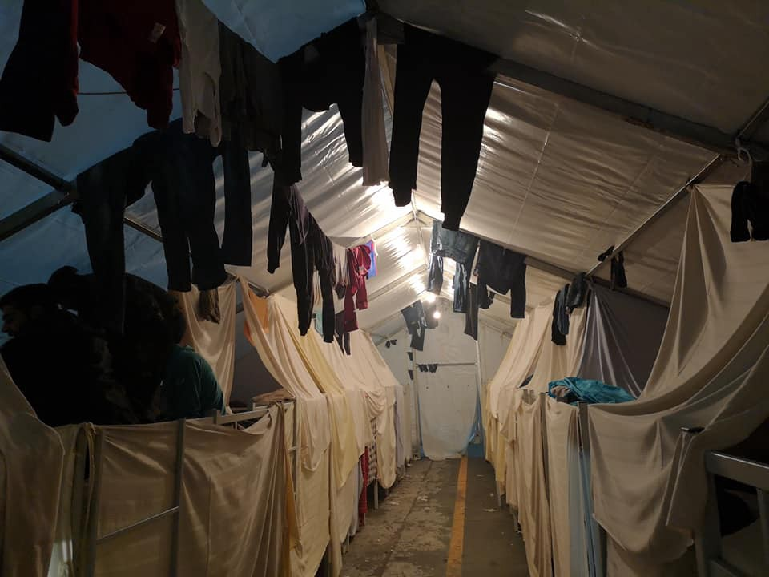

### AYS DAILY DIGEST 4/2/2019: 15,980 people stranded on Greek islands

_And more people are coming every day // Life in the camps on mainland Greece is not much better // The situation in camps in Bosnia increasingly resembles the ugliest camps in Greece // Stories to be told and listen to from France and other parts of Europe_

![“According to all the data, every year since the beginning of the refugee crisis fewer people reach Europe \(138,882 in 2018 compared to 1,015,078 in 2015\) \. However, thinking that the crisis is over is far from the truth\. Refugees still risk their lives crossing the Mediterranean Sea\. With a different reality in Europe, choosing a destination freely is no longer an option\. For Greece, this means a change from a country of transit to that of final destination\. According to Asylum Services, the number of new asylum applicants in Greece grew from 13,187 in 2015 to 61,760 in 2018\. An increase in asylum claims requires more services and financing from the Greek side and is a huge organizational challenge\. Italy and Spain are in a similar situation\. Seeing the situation up close in person and being engaged, one understands that no country should be left alone with this challenge\.” By 1796km\.](assets/e0eeaadcf8f8/1*WFuUycbCsUkm36cFwe3gig.jpeg)

“According to all the data, every year since the beginning of the refugee crisis fewer people reach Europe \(138,882 in 2018 compared to 1,015,078 in 2015\) \. However, thinking that the crisis is over is far from the truth\. Refugees still risk their lives crossing the Mediterranean Sea\. With a different reality in Europe, choosing a destination freely is no longer an option\. For Greece, this means a change from a country of transit to that of final destination\. According to Asylum Services, the number of new asylum applicants in Greece grew from 13,187 in 2015 to 61,760 in 2018\. An increase in asylum claims requires more services and financing from the Greek side and is a huge organizational challenge\. Italy and Spain are in a similar situation\. Seeing the situation up close in person and being engaged, one understands that no country should be left alone with this challenge\.” By 1796km\.
### Feature

Early in the morning, a boat landed on Farmakonisi, and 42 people were transported to Leros\.

Aegean Boat Report came out with the latest statistics from the islands for January, according to which there are 15,980 people stranded in inhuman camps\. So far this year, 1974 persons have come to the islands by the boats leaving from Turkey\. Many more were stopped on this route\.

The biggest number of arrivals is still registered on Lesvos\.

Nevertheless, transfers to the mainland are still very slow\. But, according to plan, about 7,000 people will be allowed to leave the islands by the end of March\. Where and how they will be placed, is as yet unkonwn\. But what can be seen is that some of the old camps are opening again on the mainland, while others are often overcrowded, or living conditions are not even close to decent\.

This is what it looks like in Eleonas camp, according to some, one of the best camps in Greece\.

Unfortunately, this is not rainwater \(“the sewage has not been repaired because of the neglect of the camp administration and smells everywhere\)”\.

More devastating statistics:

■■■■■■■■■■■■■■ 
> **[RSA](https://twitter.com/rspaegean) @ Twitter Says:** 

> > Pavlos Pavlidis, Professor of Forensic Medicine in Democritus University of Thrace,  has identified 39 dead refugees in Evros in 2018. He estimates that about 1.000 persons have lost their lives in Evros since 2000.

[thepressproject.gr/article/138323…](https://www.thepressproject.gr/article/138323/Dekades-prosfuges-kai-metanastes-pethanan-ston-Ebro-to-2018?fbclid=IwAR0iAxbpdz-4CfYqw-yFH5ea80ezqd_rUZGmmAupRXv0uGynr2COpseT7Y4#.XFhuxNqwF68.facebook) 

> **Tweeted at [2019-02-04 19:14:16](https://twitter.com/rspaegean/status/1092501613238018049).** 

■■■■■■■■■■■■■■ 

### Libya

Journalist and human rights defender [Sally Hayd keeps reporting](https://twitter.com/sallyhayd/status/1092434289084583936?fbclid=IwAR3dykZPf1WxcWxbh0Acsxeam4AfNMEPdi2VTn_p25E2B8nQwGQIumFI71o) from Libya\. In her last twitter post she quotes sources saying that at least ten more detainees in Triq al Sikka are now testing positive for tuberculosis\.

Cases of tuberculosis have been recorded even before in overcrowded Libyan detention centres\. Last year, several deaths were recorded, too\. Most of the people diagnosed with this illness in Libya also show signs of severe malnutrition\. So far, it does not look like anybody is taking this seriously and really trying to resolve the situation\. Even more, with the approach the EU has, the existence of these detention centres is supported, while its silence is tantamount to approval of the cruel methods used in Libya\.
### Italy

[Sea Watch 3](https://www.facebook.com/1578640155687393/posts/2197481963803206/) is still stuck in Catania, for the 5th day in a row\.

_“The local public prosecutor’s office had to admit that the crew and ship had not committed any misconduct\. However, the port authority insists that all “technical irregularities”, found after hours of searching the 46\-year\-old ship, be rectified\._

_Apart from the repairs, the new crew is nevertheless preparing for their mission\. Today there is no rescue ship in the central Mediterranean — and every one of those days is one too many\.”_

BALKAN WEATHER

_GREECE_

Greece’s National Meteorological Service EMY has issued a Red Alert warning of significant weather deterioration with extreme weather phenomena, heavy rainfalls, powerful storms, hail\-falls and snow\.

The bad weather front will be coming from the south\-west, with gusty winds up to 9 and locally up to 10 Beaufort\. As the weather front will be coming from the Sirte Gulf in Libya, the south winds will bring a huge volume of Sahara dust\. Greece will be the target of powerful air\-streams, that is when the air is moving with considerable force from an area of high pressure to an area of low pressure\.

_MONTENEGRO_ 
In the south and centre, lightly to moderately cloudy with sunny intervals\. In the north, moderately to entirely cloudy and mostly dry, and in the basins short periods of fog are possible\. Wind weak to moderate, along the coast locally amplified and during the night stronger throughout the country, blowing from the north and northeast\. Lowest temperatures from \-3 to 9 and the highest daily from 1 to 17 degrees\.

_SERBIA_ 
Cloudy in most parts of the country, with some local rain and, in the mountains, snow in some places\. In the far south, changeably cloudy with sunny intervals\. Wind weak, in the mountains moderate, blowing from the north\-west\. The lowest temperatures from 0 to 4 and the highest daily from 3 to 10 degrees\.

_BiH_ 
In Bosnia cloudy, locally sleet and snow in the second part of the day, in the north rain and in the mountains light snow\. In Herzegovina moderately cloudy without precipitation\. Wind in Bosnia weak to moderate from the north and in Herzegovina moderate to amplified Bura\. The lowest temperatures from \-2 to 6 and the highest daily from 1 to 11 degrees\.

Due to heavy rain and snow melting, there are floods everywhere, which causes a problem in moving across the country\.

_CROATIA_

Partly sunny along the coast, in the rest of the country predominately cloudy with rain alternating with local snow and sunny periods in the west\. Wind mostly weak, along the coast, Bura first decreasing and then towards the end of the day increasing in strength\. The lowest temperatures from \-2 to 8 and the highest daily from 1 to 15 degrees\.
### Bosnia

After yesterday’s car accident in front of the refugee centre in Velika Kladusa \( [see our weekend Digest](ays-daily-digest-weekend-2-3-2-2019-european-deadly-trap-f19131bb6123) \), IOM, the organization in charge of the camp, did not issue any information about what happened\. IOM employs a private security company in the centre which did not call an ambulance or the police after the accident happened, and a 33\-year\-old man from Algeria bled to death\.

After the accident\. By Nevia Elezovic\.

In the meantime, the situation in Bihac, camp Bira — another IOM\-run facility — is getting worse\.

Last Friday, there was a serious incident when over 100 people participated in a fight\. Around 50 people were injured, some seriously, while 30 were arrested\. The constant fighting in the camp is caused by the inhuman and degrading living conditions, with minimum to no privacy, and the scarcity of food inside the dark old factory\.

Nevertheless, none of these circamstances have been taken into consideration, and nothing at all is being done to improve conditions\. Rather, the situation is being used by the authorities in this area of the country to further restrict freedom of movement for the people\. IOM and UNHCR are aware of all this\.

Inside BIRA camp\.

A volunteer in Bihac told us that now the police has surrounded the camp and doesn’t allow people to go towards the city centre, to buy food or other necessities\. This makes people even angrier and produces even more tensions\. At the same time, volunteers are prevented from entering and bringing food or anything else\.

About 2000 people are placed in Bira, including families, vulnerable people and unaccompanied minors\. The results of these careless and restrictive policies are that more and more people are considering either voluntary repatriation \(with IOM\), or trying the game, forcing them to walk for hours in snow and cold, and putting their lives in danger\.
### Germany

The Federal Ministry of the Interior intends to introduce measures which will allow withdrawing the tolerated stay permits of some failed asylum seekers who make falsified claims about their country of origin in a bid to remain in the country\.

According to the KNA news agency, the bill says “those who prevent their deportation, for example, because they deceive the authorities about their identity or nationality or do not cooperate sufficiently in obtaining a passport replacement, may no longer be tolerated in future\.”

The Welt newspaper said that in such cases authorities will order migrants to leave and that such failed asylum seekers would be excluded from integration offers and other future residency permits\.
### France

Solidarité migrants Wilson brings [another story from the Porte de la Chapelle](https://www.facebook.com/598228360377940/posts/1072671232933648/) \. These stories must be told and heard\. \(visit their FB page to read the story\)

_“The door of the chapel is a shell in the middle of so many small bombs\. At 3 pm this Monday, February 4th, we realize that the whole camp of the chapel door is surrounded by cars and police vans that have crossed the tracks\. I stop and try to understand what is happening, but the cops refuse to say anything\. So I go to the camp to try to see it more clearly, but no one knows anything, and I’ve barely arrived when people start coming to me\. A minor discovered the address of doctors without borders that could warm him up for a few hours, but he doesn’t know how to get there, and then it’s already too late…\. a man arrived three days ago, he tells me how he had to flee after hiding the children of his neighbours, telling me about torture, showing me his legs that can barely carry him\. He doesn’t understand why he’s on the street, why the phone number that is supposed to give you an appointment for asylum always rings in the void\.”_

[Care4Calais reports](https://www.facebook.com/care4calais/videos/782197048799098/?__xts__%5B0%5D=68.ARCiveeACs0Yx7gi4qzNNOdBAZBEBYRphsvKFL_2_hCYHObssVSGPHwozE6D9FjWUCHxOn-CieASMX1mnIdGJLaR5NstpRmr5a64RgzTjuUATI0HyIGSS3K5TIoKkR0IoRjXLor69_epkm1K8LeCj2_4FVamSysw9A48qVTxEkrbobUHpZ8MOjJkYOGM98VkKiwYcdQ2m6hq0QNAM1GmOGumE7gyl68N74HAAdPdjhFxKWAlK9hPPsmhU2I9LWRhs7VVWj2NUa8HY_A-uRetmJHuQTmF5_YvWaDBGz0EIJF440yWuima2FWOyIs1o-Vvxe9D6ul2LfcQaME7sZH9hPAPS3mAADg6UZkptQ&__tn__=-R) that people stranded in this area from now on will have dentists from Focus4Hope\.

“Not only are they fully qualified professionals, they have brought a kitted\-out van and have treated hundreds of people this weekend, some who have been waiting for months\. They performed fillings and even extractions, treated infections, investigated underlying issues\. Seeing a man who previously could barely talk, actually laugh and smile because his pain was gone was a real joy to behold\.”

We also publish weekly summaries of some of the most important news reported during the past week in our Daily News Digest: here are the [**Arabic**](%D8%A3%D8%B5%D8%A8%D8%AD%D8%AA-%D8%A5%D8%B3%D8%A8%D8%A7%D9%86%D9%8A%D8%A7-%D9%86%D9%82%D8%B7%D8%A9-%D8%A7%D9%84%D8%AF%D8%AE%D9%88%D9%84-%D8%A7%D9%84%D8%B1%D8%A6%D9%8A%D8%B3%D9%8A%D8%A9-%D8%A5%D9%84%D9%89-%D8%A3%D9%88%D8%B1%D9%88%D8%A8%D8%A7-27939af2b662) and [**Persian**](%DA%A9%D8%B4%D9%88%D8%B1-%D8%A7%D8%B3%D9%BE%D8%A7%D9%86%DB%8C%D8%A7-%D8%AA%D8%A8%D8%AF%DB%8C%D9%84-%D8%B4%D8%AF%D9%87-%D8%A8%D9%87-%D9%86%D9%82%D8%B7%D9%87-%DB%8C-%D8%A7%D8%B5%D9%84%DB%8C%D9%87-%D9%88%D8%B1%D9%88%D8%AF-%D8%A8%D9%87-%D8%A7%D8%B1%D9%88%D9%BE%D8%A7-7e36c6f4bdbe) for the Week of January 21–February 3\. 
Please, share the information with your Arabic and Persian speaking contacts\!

**We are an entirely volunteer\-run media team, and we rely on our supporters to share our news\. So please share, and never forget to ACT\!**

**We strive to echo correct news from the ground through collaboration and fairness\. Every effort has been made to credit organizations and individuals with regard to the supply of information, video, and photo material \(in cases where the source wanted to be accredited\) \. Please notify us regarding corrections\.**

**If there’s anything you want to share or comment, contact us through Facebook or write to: areyousyrious@gmail\.com**

_Converted [Medium Post](https://medium.com/are-you-syrious/ays-daily-digest-4-2-2019-15-980-people-stranded-in-greek-islands-e0eeaadcf8f8) by [ZMediumToMarkdown](https://github.com/ZhgChgLi/ZMediumToMarkdown)._
