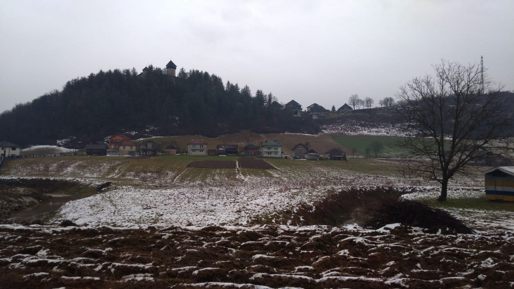
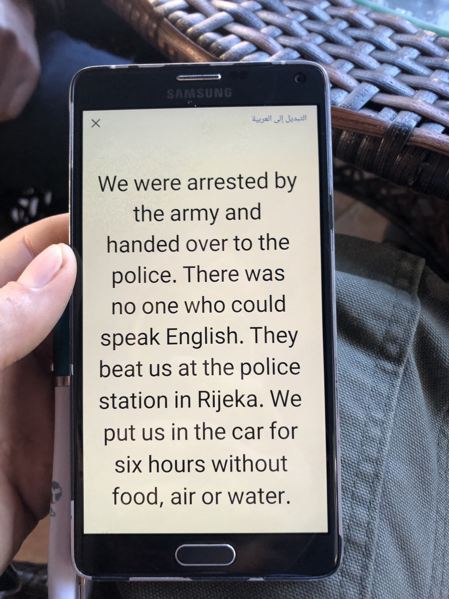
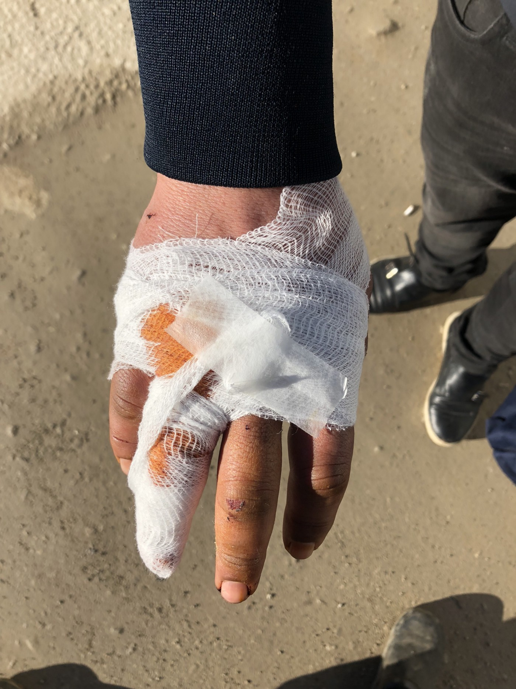
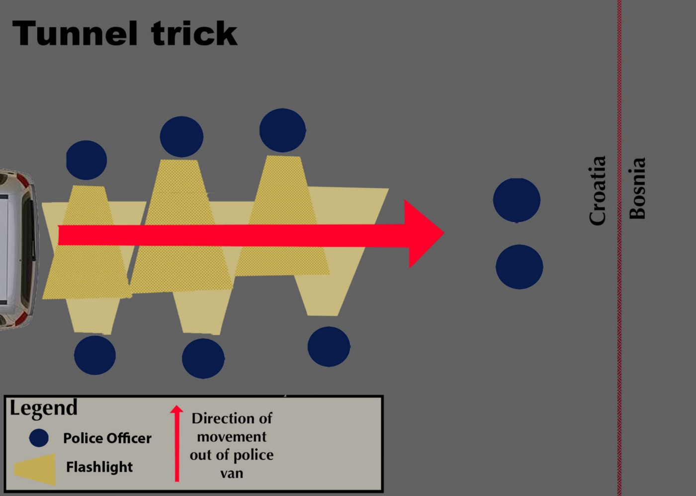
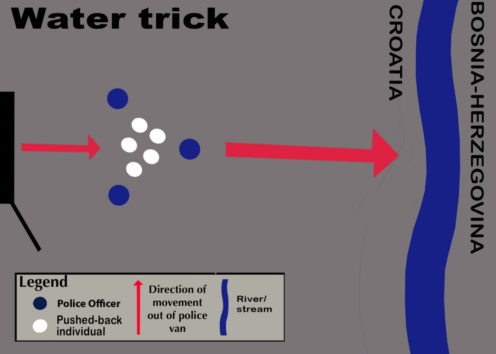
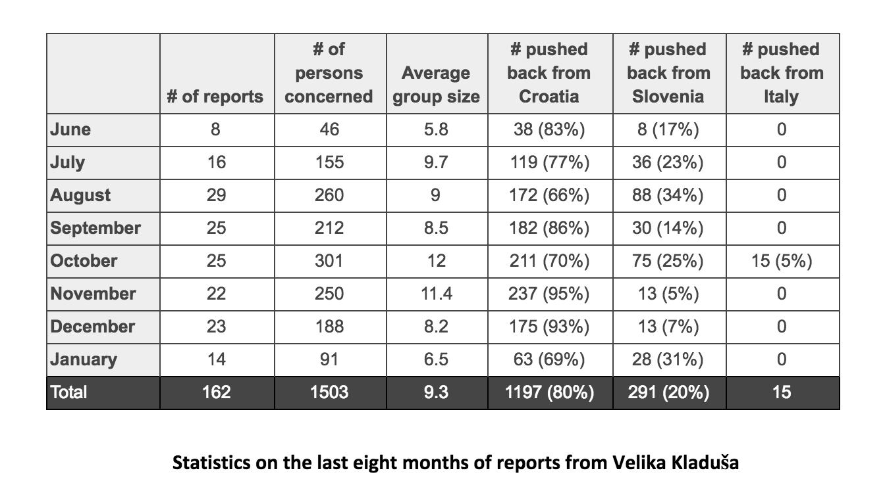

### Border violence report: **An update on the situation in Velika Kladuša**

_As of mid\-January, the UNHCR [estimates](https://ec.europa.eu/echo/where/europe/bosnia-and-herzegovina_en) there are upwards of 5,000 refugees and migrants currently present in Bosnia\-Herzegovina\. Of this number, more than 500 likely reside in the IOM\-run Miral camp outside of Velika Kladuša\. In the last month, camp residents reported abuses of [authority](https://www.youtube.com/watch?v=jWmwACRlhRQ) from the private security guards who monitor the camp\. Rumors abound about whether or not the camp will become “closed” in the coming months\. Moreover, confusion abounds about the official capacity of the camp\._

Last month, the IOM invested in 40 converted shipping containers to provide extra accommodations for 200 people\. There are three bunks beds per container, plugs and heater\. Despite this, according to the information provided to a refugee who was refused entry to the camp in mid\-January, Miral camp is at full capacity with 730 persons inside\.

In the last several weeks, new arrivals to the camp were required to go through a period of quarantine before being given access to the common sleeping areas\. This quarantine area has capacity for approximately twenty persons inside and it is possible that the small quarantine capacity may be linked to these registration refusals\.

Several individuals which had previously obtained registration cards for the camp were refused entrance after 11:00 pm, with the time being cited as the reason for denial\. This sometimes\-enforced\-rule, like many others, has not been formally explained to camp residents\.

**_Similarly unexplained, is an apparent ban on residents filming their daily conditions within the camp\. Several individuals have reported being reprimanded by private security guards for taking pictures of their breakfasts and for taking videos inside of the camp\. While there are no restrictions on the use of cell phones within in the camp, it would appear that there are informal restrictions on using these cell phones in a “journalistic sense”\._**

A large security deployment was observed in the camp in [mid\-January](ays-special-from-bosnia-killing-solidarity-in-velika-kladu%25C5%25A1a-f7c18edd8826) \. Upwards of fifty police officers from different departments were mobilized for this actions, with some wearing black uniforms and others dressed in green military fatigues\. Some of the officers carried long rifles and others managed K9 units during their deployment within the camp\. According to some camp residents, some drugs were found and various weapons were confiscated\. The entirety of the camp present for this action was made to stand in a line and be frisked\.

**_Velika Kladuša_**

An increase in the control and restriction over refugees and migrants has also been observed outside of Miral camp, in Velika Kladuša at large, over the past month\. Several individuals have reported being transported to Miral while they were walking in the street within the city center during the evening\. Others reports being taken to Miral in a similar manner in the morning\. Once dropped off at Miral, they were free to continue moving unhindered, and many reported returning to the city after these exchanges\.

**_Medical care_**

MSF ceased their operation within the Una\-Sana Canton towards the end of January, handing off their project to the Danish Refugee Council \(DRC\) which now provides medical care to the residents of Miral camp\. The DRC does not have any plans to provide medical assistance to those living outside of the camp in squats without registration\. There are concerns that this has the potential to lead to a gap in medical assistance for individuals who may return pushed\-back at the border and fail to access the camp due to its overcapacity\.

**_Winter_**

Winter continues in northwestern Bosnia and Herzegovina\. Nonetheless, the temperatures remained relatively warm for the first half of January\. This resulted in a dynamic in which many groups left Velika Kladuša to attempt to cross through Croatia expecting warm temperatures, leaving many [unprepared](http://www.balkaninsight.com/en/article/cold-winter-not-stopping-the-migrants-on-their-way-01-16-2019) for the comparably colder temperatures in Croatia as well as the increased snowfall there\. Many groups on “game” reported that the intentionally sought out the attention of authorities in an attempt to “self\-deport” themselves\. Nonetheless, many of the groups that intentionally sought out Croatian authorities in an attempt to return themselves to Bosnia and Herzegovina reported that they experienced violent pushbacks\.

**_Status of solidarity work_**

The environment for independent solidarity organizations working to assist refugees and migrants in the Una\-Sana Canton has continued to become more complicated in the past [month](ays-special-from-bosnia-killing-solidarity-in-velika-kladu%25C5%25A1a-f7c18edd8826) \. In particular, the operations of No Name Kitchen have been to a certain extent as a result of pressure exerted on the group from the cantonal authorities\. In this period of increased friction between institutional actors and independent organizations, “going against the grain” of established assistance procedures has become a liability\. This is particularly true for those seeking to provide assistance to those living outside of the system in squats or informal living arrangements\.

**Trends in border violence**

This month we conducted fourteen violence reports with groups of individuals who were pushed\-back to Bosnia\-Herzegovina\. Ten of these groups were pushed\-back directly from Croatia while four of the groups were initially apprehended in Slovenia\. The individuals we conducted reports with consisted of a variety nationalities including Algeria, Syria, Darfur, Tunisia, Iraq, Afghanistan, and Pakistan\. The average push\-back group size was around seven individuals\.

Generally speaking, there has been less direct violence towards refugees and migrants observed along the Bosnian\-Croatian border in the month of January in comparison to that which was witnessed in the summer or autumn\. Specifically, the emotional nature of this violence, which one might describe as tactics of violence which incorporate prolonged violence, humiliation, or torture, has decreased\. Push\-backs in the month of January were typically carried quickly, with less people, in ways which left fewer physical marks of violence\. While the manner in which violence is communicated onto the bodies of refugees, asylum seekers, and migrants along the Croatian border has changed, it nevertheless continues to be structural\. Rather than _diminished_ _violence_ , we should understand this shift as _altered violence\._ Importantly, these tactics continue to serve the strategic purpose of enacting physical, emotional, and material costs on those attempting to transit towards the EU, with the intended effect to make continued transit attempts less appealing\.

Croatian pushbacks around Velika Kladuša \(BiH\) have changed with the winter weather yet continue to incorporate strategic violence\. For much of the summer and fall, it was common practice for Croatian police officers to take individuals one\-at\-a\-time out vans and then force them to run through two parallels lines of police officers wearing headlamps and swinging batons\. In comparison, during the winter months, pushbacks tactics have evolved to be carried out more quickly, with less police officers, while still enacting physical and material costs onto the pushed\-back individuals\. It has become common practice for an entire van to be cleared out at once, surrounded by a small contingent of police officers, and then corralled under the threat of police batons to run into bodies of near\-freezing waterways along the border \(see reports 1\.3, 1\.5, & 1\.10\) \.

While there are smaller numbers of individuals returning with broken arms or with backs cross\-stitched with the patterns of prolonged baton beatings, individuals are being regularly forced to walk between five and twenty kilometers from the border to the relative safety of Miral Camp in subzero temperatures with clothes soaked through with water\. In this sense, the _altered violence_ of the winter months utilizes the weather to communicate strategic, physical violence\.

This winterized violence is not as visible as previous border violence yet still serves similar purposes\. In addition to the physical trauma of forced water immersion, this push\-back treatment enacts specific material costs onto the victims of border violence, making continued transit attempts harder\. Whereas during the months of October and November the use of traps, such as tripwires or barricades, was a common feature associated with the Croatian pushback, this strategy has all but disappeared in the repertoire of violence used by Croatian authorities during the winter months\. Rather, in the cold months of winter, the theft of winter clothing or shoes, the burning of sleeping bags, and the forced immersion of oneself into near\-freezing water has become increasingly more common\.

Sleeping bags, tents, coats, and shoes are necessities for transit during these months and one has to invest money or time in the re\-procurement of these items before a new transit attempt\. At the very least, they have to allow their soaked\-through jacket the time to dry before attempting to cross again\. This behavior follows a similar pattern to the procedural destruction and theft of mobile phones, money, and power banks which has persisted as an endemic characteristic of the Croatian push\-back\. In this way, the winter months have provided increased material costs for these authorities to target\.

It is difficult to reliably identify the motivating factors for these changes\. On the one hand, it is possible that this shift in tactics has been adopted in order to make push\-backs less observable and therefore less risky\. Given the strong surge of negative press coverage that Croatian pushbacks received in the autumn, it is possible that this is part of a strategic shift in tactics\. On the other hand, one could also argue that the altered, more muted, nature of Croatian pushbacks in the winter months is a product of the weather\. It is colder and there has been a blanket of snow on the ground for much of the past month and a half\. One might point out that this makes it harder for large numbers of police officers to remain outside and move around effectively in the cold, and that this is why push\-backs are being carried out in a manner which is quicker and conducted with less participants\. Furthermore, less people are attempting transit in the winter months which makes it possible to infer that there are less police officers being delegated to conduct pushbacks on a nightly basis\. The tactic of corralling a group of people to run into a freezing river under the threat of police baton is effective for the goals of these pushbacks and can be completed quickly\.

While it remains difficult to identify the contributing factors to this shift push\-back tactics, one can pragmatize that this _altered violence_ continues to accomplish specific goals meant to further securitize the Croatian border from transit attempts\. The enactment of physical and material violence onto the bodies of refugees, asylum seekers, and migrants caught in Croatia and Slovenia serves to dissuade continued transit attempts\. Although the manner in which this violence is accomplished has shifted, its rationalization and intention remains the same\.

**_“Tunnel trick”_ method of push\-back — previously use commonly**

**_“Water trick”_ method of push\-back _—_ currently used commonly**

**Self\-deportations**

In the winter months, groups attempting to transit through Croatia and Slovenia are often ill\-prepared for the cold weather conditions they encounter while walking for up to fifteen days through snow\-covered forests\. Sometimes, these groups “give up”\. The hard conditions of the walking “game” prove challenging enough that groups sometimes purposefully alert authorities to their location in the hopes of being “rescued”\. We refer to this practice as “self\-deportation”\.

While the groups who opt to self\-deport often declare their intention to apply for asylum in Croatia or Slovenia, they most often are returned back to BiH within the following twelve hours of alerting the authorities to their presence\. Most self\-deportation groups understand the likelihood of this outcome\. Furthermore, most self\-deportation groups understand the high probability of encountering violence from authorities during their eventual push\-back to BiH\. On the one hand, this underscores the adverse conditions that groups of people attempting to transit through Croatia and Slovenia are facing in these winter months\. Groups are willing to purposefully expose themselves to police violence rather than continue on their journeys\. On the other hand, the practice of self\-deportation also highlights the predictability of the illegal practice of collective expulsions\. Push\-backs have become such a ubiquitous feature of transit attempts that, in practice, groups of people on the game utilize push\-backs as a reliable, albeit dangerous, means of transport and return to BiH\.

**Slovenian translators**

Groups of individuals returning to Velika Kladuša after being pushed\-back from Slovenia routinely express frustration at their treatment by Slovenian translators\. These frustrations are most regularly expressed at the way these translators conduct interviews without significant input from police officers and regularly delegitimize the lived experiences of asylum seekers fleeing conflict and trauma\. Particularly notorious is a translator who is referred to informally by people\-on\-the\-move as “the Palestinian”\. This individual has appeared in conservative Slovenian news media regularly over the years and is often described by these publications favorably, as a prime example of adopted nationhood and assimilation\. The translator, who apparently lived for some time in Syria in the 1980s, is middle\-aged and often wears sunglasses to his interviews\. One individual described his interaction with the translator as follows:

_“I see not like a translator, I see like a police\. \[He\] asked me like police, not like a translator…He alone asked me\.” \[Report 2\.1a\]_

Another expressed frustration at the erasure of his survival of conflict as a Syrian and described being asked by this individual:

“ _What is the problem in Syria? Syria is no problem”_

The reports that this individual, as a civilian, routinely conducts translations with the demeanor of a state authority \(adopting the responsibility of choosing which individuals are allowed to access asylum procedure in Slovenia\) are worrying\.

**Statistics on the last eight months of reports from Velika Kladuša**

The 162 reports written and published from June 2018 to January 2019 concerned 1503 persons pushed back from Croatia, Slovenia or Italy\. A majority of the reported pushbacks had initially been apprehended in Croatia with a quantity of approximately 1197 persons compared to approximately 291 from Slovenia\. Reported push\-backs from Italy to Velika Kladuša were exceedingly rare\.

It is important to understand the limit of this information\. While these reports are conducting with individuals who return from the border with stories of abuse or violence, it would be misleading to say that the participants are selected at random\. Rather, there are a variety of factors which might influence the conduction of a violence report, the most prominent being that these reports often target the most violent cases of border violence\. To this end, despite our efforts to engage with the population of pushed\-back individuals as evenly as possible, there are no methodological mechanisms in place to ensure that these participants are “randomly” selected\.

Rather than being viewed as hard data on the total group’s pushed\-back from Croatia or Slovenia, these numbers should be taken for what they are, namely statistics on reported push\-backs\. There is no way to effectively say what percentage of total push\-backs these numbers represent however it is safe to say that these reports only cover a fraction\.

**_\(Report done by the volunteers of No Name Kitchen and Balkan Info Van\._** To read previous monthly reports see [here](http://www.nonamekitchen.org/en/violence-reports/) \. **_\)_**

**We strive to echo correct news from the ground through collaboration and fairness\.**

**Every effort has been made to credit organizations and individuals with regard to the supply of information, video, and photo material \(in cases where the source wanted to be accredited\) \. Please notify us regarding corrections\.**

**If there’s anything you want to share or comment, contact us through Facebook or write to: areyousyrious@gmail\.com**

_Converted [Medium Post](https://medium.com/are-you-syrious/border-violence-report-an-update-on-the-situation-in-velika-kladu%C5%A1a-6de407355de8) by [ZMediumToMarkdown](https://github.com/ZhgChgLi/ZMediumToMarkdown)._
