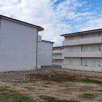
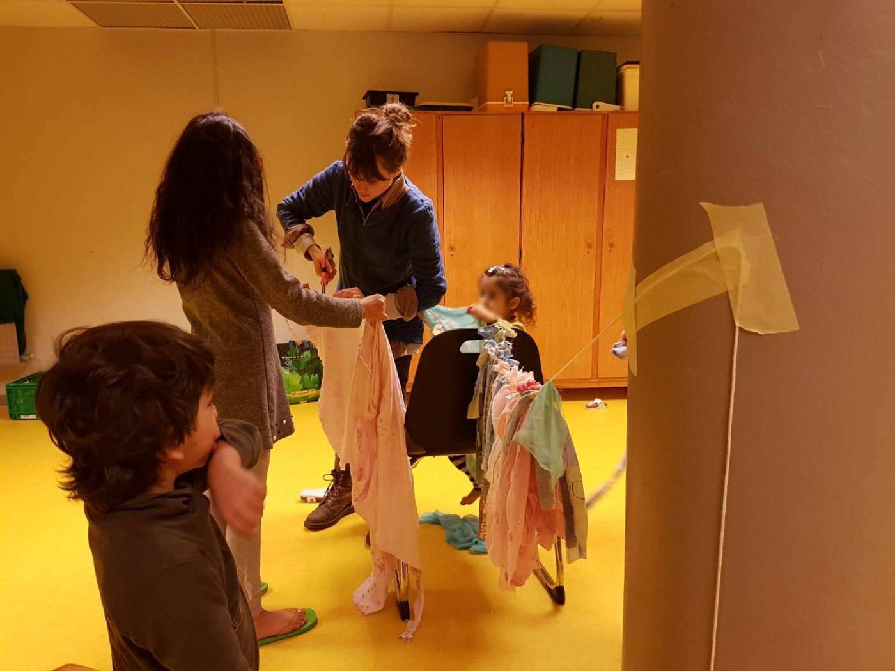
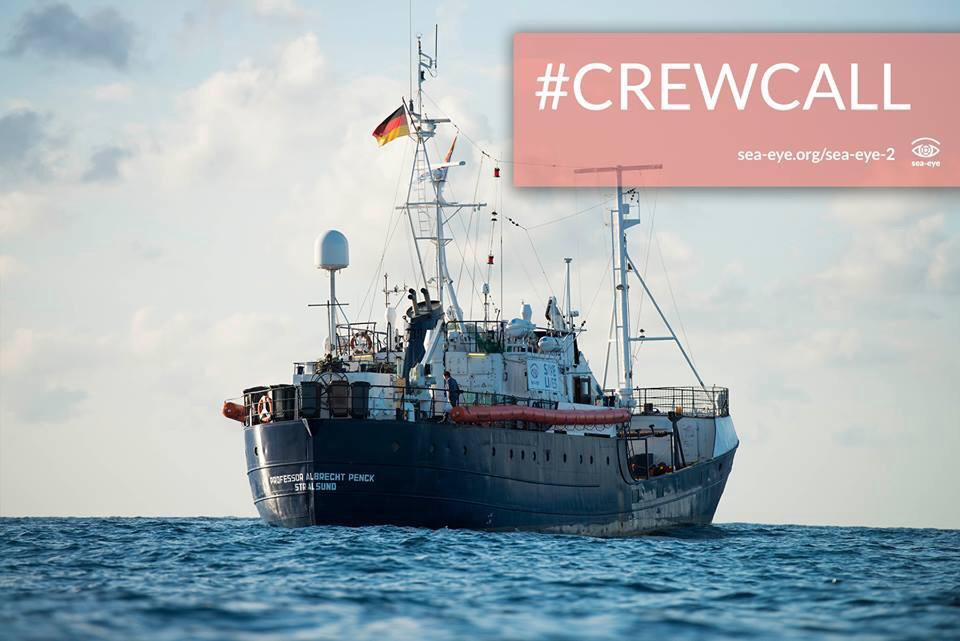

### AYS Daily Digest 6/2/19: Racist winds blowing in European metropolises
#### Another riot in Greece / Search and Rescue NGOs deliver petition to the Spanish Congress / Pakistani student stranded in ‘no man’s land’ at Croatian airport / UK — Standsted 15 not jailed / & more info, news and volunteer calls

](assets/743d10d154ec/1*_HJYHcve-RHtfvEYjQi4Ng.jpeg)

Photo taken during one of the 5 evacuations of the beginning of February 2019: waiting for several hours in the cold before a departure to an unknown destination\. Photo by: Louiz Art via [Solidarité migrants Wilson](https://www.facebook.com/Solidarit%C3%A9-migrants-Wilson-598228360377940/?tn-str=k%2AF)
#### FEATURE

[Solidarité migrants Wilson](https://www.facebook.com/Solidarit%C3%A9-migrants-Wilson-598228360377940/?__tn__=%2CdkCH-R-R&eid=ARDPPpyvCjDlnnvd7Wtdy5BJzqJ3lzSVpBJ1sIOZEL13xbww4MgRkPz77demcJmskUKhA-63YtLVphOv&hc_ref=ARSrnlzGfmDOF8OhZwckyg3MWZespOquEmP3-7BY-E0YbudM-rsLI4u5RBPUMof_xjw&fref=nf) team writes about groups of refugees around the streets with no tents or blankets, in the rain\. Some have only small jackets with no hoodies\. You can only see silhouettes running, trying to find shelter\. No fire to gather around and rarely someone who has managed to get food to eat\.

People taken to ‘shelters’ the previous week are already back in the streets, says the group\. Those who were present at the evacuations were taken in unknown directions\.

> Concretely, there are a lot of centers and it is really difficult to know where the people were taken, what condition they are in at those places\. Some of the news that we hear suggests that some centers are very insecure\. More precisely, a certain number of places have no budget for food\. So, in some places the refugees are not even provided with food, which is incredible\!
 

> The police are everywhere, for what purpose and to protect whom? 

For months, they have been removing everyone and everything that looks like they could be refugee\-related in the suburbs, in Saint\-Denis in particular, volunteers say:

> Is it just so that the streets of the capital are pretty, and are we cleaning Paris as we do the Mediterranean? 

#### GREECE
### Raising the question of refugee women’s choice

A meeting between the Secretary General for Gender Equality, Fotini Kouvela, and the president of the “MOV” feminist collective was organized to focus on the issues that have arisen in the Aegean islands with refugees, as media have [reported](https://left.gr/news/synantisi-tis-f-koyvela-me-ti-sissy-vovoy-gia-dikaioma-olon-ton-gynaikon-sti-diakopi-kyisis?fbclid=IwAR1AaIoYI_C3KV1neuoND0BDF9tlVxBtdMGHspt_bUnEQyzSk37WlgtKIfQ) \.

The meeting once again raised the controversial issue of the refusal of some doctors at public hospitals on the Aegean islands and refugee populations to terminate pregnancies, when the pregnancy is the result of rape, by invoking the moral conscience, according to paragraph 1 of article 31 of Law 3418/2005 \(Code of Medical Ethics\) \.

At the meeting there was focus on the provisions of the Article protecting the free development of the individual personality in general, also protecting all the individual rights such as physical freedom, honor, health, but there are also certain caveats\. One such caveat is the mother’s choice, where the law permits such a conditional choice\.
### The question of citizenship for newborn children

[Mobile Info Team For Refugees In Greece](https://www.facebook.com/mobileinfoteam/?__tn__=%2CdkCH-R-R&eid=ARCnTes6L87fX65x15nGF9oY-_yPEaCNspwsWnv_t6ufzS8Te-vMjUlPWbGOEafASB7LnAYffiZjxkXh&hc_ref=ARRgExgCK6bBel3g8K8PAIFcbNWukRtP0tij_QHtJRG_AZLJqPYLsA_ImgReWgrB-Ww&fref=nf) reports: The concept that a baby born in a country will automatically become a citizen is quite common on the American continent\. In Europe no country has what is called birthright citizenship\. In Greece a newborn baby will receive the status of its parents\. If the parents are asylum seekers, the baby will be included in the asylum application of the parents, after the baby and the birth certificate are presented to the Asylum Office\. If the parents have already been granted asylum status, the baby will receive the same status as they have\.
### Minors riot in Fylakio

Police filed a case file for arson, disruption of the peace, and disaster damage against 14 people after a riot on Monday morning at the Reception and Identification Center in Fylakio Orestiada, when a group of unaccompanied refugees damaged a wing of the Center building\. In particular, minors trashed and set fire to the ward where they had been detained, demanding resettlement to camps on the mainland\.
The minors complain that despite the fact that their identification process has been completed — within 25 days of their arrival — they are being held as prisoners in Fylakio in northern Evros for two or three months\.
The incident ended with intervention of the police and the fire brigade\.
This is the third such riot to occur recently\.
### Workshop for job seekers

[Generation 2\.0 for Rights, Equality & Diversity](https://www.facebook.com/secondgenerationgreece/?__tn__=%2CdKH-R-R&eid=ARAl4_r6CjEp1BNi3tdpR_zj1c9pjz3QovIRvZiDaps3Usq6tYQBDliJEgAo39FJp-LBK8S9MwwYqA-M&fref=mentions) with the International Rescue Committee \(IRC\) are holding a workshop on workplace culture in Greece on Friday, February 8 at 11:00 am\.
The event will take place in English, with interpretation in Arabic, Farsi, French and Greek\. You can find more event details in your language, including how to reserve your place [here](http://bit.ly/2SeEeN5) \.
#### BALKAN WEATHER REPORT for February 7

Montenegro

Sunny in the morning with increasing clouds in the north, possibly fog\. Wind light to moderate, changing in direction, in the morning at places moderate to strong northeastern wind\. Low temperatures from \-7 to 8 C° and highs from 2 to 17 C°\.

Serbia

Morning fog in the north, mainly sunny as the day progresses\. Overcast in the rest of the country, rain in the morning in the southeast and snow in the mountains\. Gradual clearing in the afternoon\. Wind light from the northwest before noon, and from the southeast in the afternoon\. Low temperatures from \-3 to 3 C° and highs from 5 to 9 C°\.

BH

Mainly sunny in Herzegovina and western and southwestern Bosnia\. In most parts of the Bosnian lowlands fog or low clouds before noon and clear during the second part of the day\. Wind light from the north and northeast\. Low temperatures from \-3 to 8 C° and highs from 2 to 14 C°\.

Croatia

Mainly sunny with local fog inland during the morning\. Inland the wind will be mostly light\. Along the coast during the night and morning moderate to strong bura winds which will weaken later in the day and shift to the northwest and west\. Low temperatures from \-7 to 9 C° and highs from 5 to 15 C°\.
#### CROATIA

For three days now a Pakistani student has been stranded at the Franjo Tuđman airport in Zagreb, with no possibility of entering the country and no way to contact the outside world to tell his side of the story\. He flew in from Serbia and was not granted entrance to Croatia \(EU\), and according to a brief statement from the police, he has not demanded international protection from Croatia, but nobody can confirm this since there is no way to contact him\.
#### ITALY
### Racist winds blow in the Eternal City

As we [reported yesterday](ays-daily-digest-05-02-2019-local-authorities-in-bosnia-demand-state-institutions-to-lift-ioms-af159fce1ff8) , the police took 11 young refugees off the street for no obvious reason or justification\. 
“Yet another intervention, the only effect \(now clearly targeted\) being humiliating and generating frustration in those who are already in a condition of vulnerability”, say the volunteers of [Baobab Experience](https://www.facebook.com/BaobabExperience/?__tn__=%2CdkCH-R-R&eid=ARDNBhcig7v2EnytQdpahO2zKrMJL47Zm4boTkgc6KhXRkxx1MYe8Nh2XfsWgg2ab6efWYNuVAoxnV2h&hc_ref=ARQmh1b-rvg1JkfIRItNpvC29DjVDckZk36OcPv0fkhdlViteCeKGdwn-G-gfPBMV2I&fref=nf&hc_location=group) the next day\.

> We are asking all people and everyone living in Rome if this is the city they want, one they feel part of\.
 

> Has the capital, after almost 2,800 years, become a place where those who are foreign are persecuted, made to feel unwanted, humiliated\.
 

> What has been happening at Piazzale Spadolini is just a part of this air, now unbreathable, a racist wind that cannot be part of Rome; it is also shown in the continuous searches and identifications that occur daily on public transport and only target foreigners\. 

### San Ferdinando, Reggio Calabria

[Comitato Lavoratori delle Campagne](https://www.facebook.com/comitatolavoratoridellecampagne/?__tn__=%2CdkCH-R-R&eid=ARCl8jqgU7FcDf9dQimCjcDvnYgmAGqi0R1CpaH-9ej7uTzE-mA5CVBTMpmjX2JbqCLYrL6QgmqaTAjm&hc_ref=ARQPieH6jyBx09CXIfqeLPbwBSgMdZ93ndRQrDDuiCiwqCWVw-OoXQctRNhM6hp4Uhg&fref=nf) reports that the refugees who live and work at the provisional campsite and who have previously complained about the situation and the vague statements producing no results after many interofficial meetings, were threatened by some of the very officials who came and spoke to six people, of whom they do not know five, attacking them with questions like: “Who sent you to protest? Who do you work for? What do you people from ‘tendopoli’ want? 
There are six new buildings, built with EU funds and precisely for the immigrants workers, which can accommodate 250 people, but nobody seems to speak about that, writes the Comitato team\.
#### FRANCE

The February version of “The Asylum seekers’ Guide in Paris” is here\!
SPECIAL EDITION NEW ASYLUM LAW
It is available in French, English and Arabic

### Dunkirk

The [Refugee Women’s Cent](https://www.facebook.com/refugeewomenscentre/?__tn__=%2CdkCH-R-R&eid=ARAk87mhWDpJdUMp2cPDagEFgjp-2148LD7UpeyWerzJAhS7M7pwAMNy4bXogt7z9uMA-3J-wKao4IhT&hc_ref=ARSa7_jBH7btyOTdyIkLtFSNaPr7VGt7G4B3c8uIZOPnot7y5cbYHsvDxvKDAvVwv3U&fref=nf) er facilitates activities twice a week in Grande\-Synthe and every Friday in Calais\.

> Often during these sessions, when people are feeling the most at ease in a safe and private space, we hear about the traumas people have experienced and continue to undergo and people’s future concerns\. It is then our role to refer the people as appropriate, whether it be for legal support, supporting political action, or for psychological support\. 

### Diplo\-docus / Migrations / L’aquarius : et maintenant ?

On Friday, 8 February at 18h, a debate will take place at Café Associatif \(La Croisée des Drailles in Saint\-Disdier\-en\-Dévoluy\) with one of the crew members of the Aquarius\. tThe debate aims to spark discussion about what can be done next, to share the experiences that had happened on board the Aquarius, and initiate possible future activities\.

See more information and announcements on the upcoming events in the Alpes region here: [Valées en Lutte](https://valleesenlutte.noblogs.org/post/category/infos-locales/)
#### SPAIN

Proactiva Open Arms and Maritime Humanitarian Rescue have collected almost 140,000 signatures for the government to allow the Aita Mari and the Open Arms to leave the sea, as they have been blocked in Spanish ports since January\. This initiative, which began two weeks ago through the [Change\.org](https://l.facebook.com/l.php?u=http%3A%2F%2FChange.org%2F%3Ffbclid%3DIwAR3eZoQMhHBaWlw83w5OfMbMogCeOMAe0roTmWtrps5HWIywla24SeT1ABw&h=AT2wcwZyJlLvP_c8ZU2Rcyhj8LfOnIL6Vygb4APR5iFDN25B1SkqRXw6czVzPW6CNI3fUYItA7-DFcS8crUhsgZM1AhRdT92pGgZJ6julMTwcANGjcCBR0FkkmPIyU_9OoUiLqS_etqnQ7pluio) platform, aims to cast light on the fact that the Central Mediterranean “is still the deadliest route in the world,” and calls on the executive branch to re\-think immigration policy\.

The organizations will deliver Congress the signatures they have collected, with which they denounce **blocking civil society that tries to respond “to the cry for help from hundreds of people\.”**
#### SEA

> 332 people\.
 

> This is the number of people who have drowned in the Mediterranean as a result of the blockade of rescue ships this month\. These people could have been saved by vessels such as the Open Arms, the Aita Maria, the Sea Watch 3, or the Iuventa\. Because the Sea Watch 3 has been blocked in Catania for a few days, Open Arms has been calling for its release since 8 January, and for the Aita Mari since 18 January\. The winds in Spain seem to have shifted, something that has never happened in this ‘migration\-open’ country\. Technical reasons have also been given here, though the Open Arms is well\-equipped, and this is obviously an excuse\. The ships have been blocked for political reasons\. This is why many members in Madrid and celebrities worldwide are demanding that the Open Arms can finally be allowed back to sea\.
 

> At the same time, Madrid is cutting funds for its official rescue mission between Morocco and Spain and this is demonstrably wrong\.
 

> So, while ships remain blocked for purely political reasons to secure the fortress of Europe, the ticker, the Proactiva Open Arms has been set up to hold the people who died due to the blockade in the moat…
 

> The dying must finally stop\! We demand: the ambulances must be released immediately\! 

### Crew call

The Sea\-Eye needs team members\! 
For more information, please go [here](https://sea-eye.org/sea-eye-2?fbclid=IwAR1QELtmpq-xeC9vNtbMzZERpWi0GNyGYX8v8aAvyS6FpYkvZ9xhuE2dU9w) \.

#### UK
### No prison sentences for Stanstead 15\!

While their convictions still raise huge questions about the use of terror legislation and ongoing charter deportation flights, this will come as great news for the peaceful protesters, it is [reported](http://bit.ly/2HWRMYE) \.

](assets/743d10d154ec/1*JgRj91bBIaZEjtMPV5KtqA.jpeg)

Photo: [End Deportations](https://www.facebook.com/EDeportations/?tn-str=k%2AF&hc_location=group_dialog)

We also publish weekly summaries of some of the most important news reported during the past week in our Daily News Digest: here are the [**Arabic**](%D8%A3%D8%B5%D8%A8%D8%AD%D8%AA-%D8%A5%D8%B3%D8%A8%D8%A7%D9%86%D9%8A%D8%A7-%D9%86%D9%82%D8%B7%D8%A9-%D8%A7%D9%84%D8%AF%D8%AE%D9%88%D9%84-%D8%A7%D9%84%D8%B1%D8%A6%D9%8A%D8%B3%D9%8A%D8%A9-%D8%A5%D9%84%D9%89-%D8%A3%D9%88%D8%B1%D9%88%D8%A8%D8%A7-27939af2b662) and [**Persian**](%DA%A9%D8%B4%D9%88%D8%B1-%D8%A7%D8%B3%D9%BE%D8%A7%D9%86%DB%8C%D8%A7-%D8%AA%D8%A8%D8%AF%DB%8C%D9%84-%D8%B4%D8%AF%D9%87-%D8%A8%D9%87-%D9%86%D9%82%D8%B7%D9%87-%DB%8C-%D8%A7%D8%B5%D9%84%DB%8C%D9%87-%D9%88%D8%B1%D9%88%D8%AF-%D8%A8%D9%87-%D8%A7%D8%B1%D9%88%D9%BE%D8%A7-7e36c6f4bdbe) for the Week of January 21–February 3\. 
Please, share the information with your Arabic and Persian speaking contacts\!

**We are an entirely volunteer\-run media team, and we rely on our supporters to share our news\. So please share, and never forget to ACT\!**

**We also publish weekly summary digests in [Persian](https://medium.com/are-you-syrious/کشور-اسپانیا-تبدیل-شده-به-نقطه-ی-اصلیه-ورود-به-اروپا-7e36c6f4bdbe?fbclid=IwAR3aMZOEipwboDl7g6f2uB1ESsUGZmJFiOjLZR7LX1u8jT3ad4x3bBgt6kk) and [Arabic](https://medium.com/are-you-syrious/أصبحت-إسبانيا-نقطة-الدخول-الرئيسية-إلى-أوروبا-27939af2b662?fbclid=IwAR2xuFaPG7me5-6O3KLH6qYasBKix98oU4sML5DKaaBTZNr1ULAZyvXBiHo) \.** **Please, read and share the ones for the week January 28 — Febraury 3\.**

**We strive to echo correct news from the ground through collaboration and fairness\. Every effort has been made to credit organizations and individuals with regard to the supply of information, video, and photo material \(in cases where the source wanted to be accredited\) \. Please notify us regarding corrections\.**

**If there’s anything you want to share or comment, contact us through Facebook or write to: areyousyrious@gmail\.com**

_Converted [Medium Post](https://medium.com/are-you-syrious/ays-daily-digest-6-2-19-racist-winds-blowing-in-european-metropolises-743d10d154ec) by [ZMediumToMarkdown](https://github.com/ZhgChgLi/ZMediumToMarkdown)._
