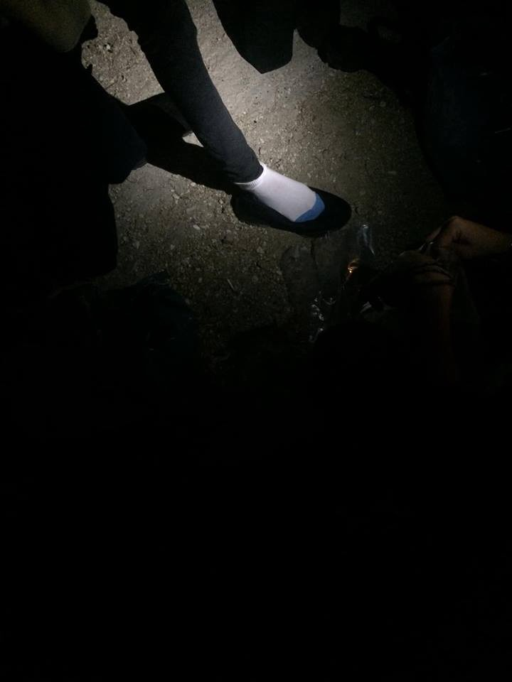
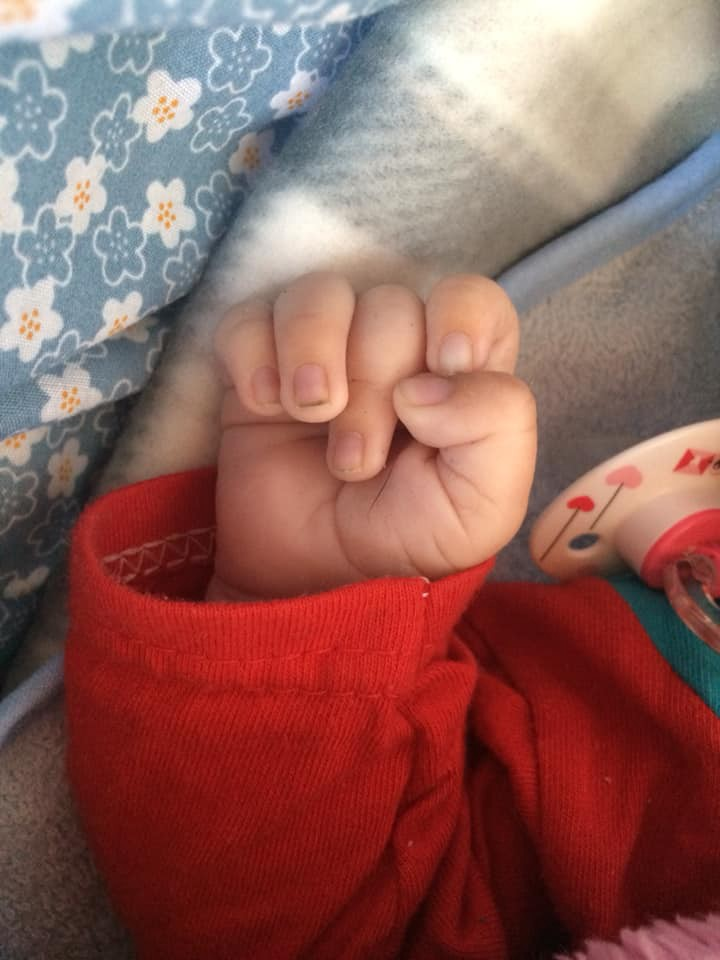
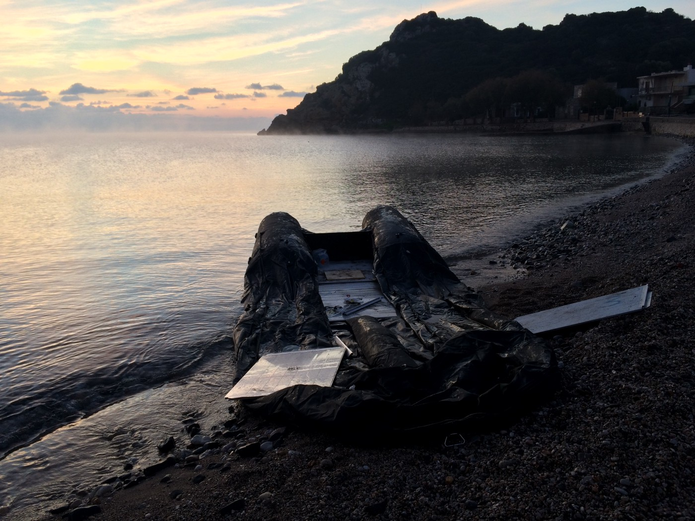

### AYS SPECIAL from Chios: _Moments never forgotten_
#### _Volunteers from the CESRT team on Chios are present during landings on this island, every day\. This is a story about one such landing, but also a story about solidarity, compassion, and resilience\._

It was 11pm\. As the car sped along the winding mountain road I tried to stay calm, breathe slowly and stay focused\. Driving to landings always fills me with a familiar sense of anticipation and dread for what we may find\. This landing spot was a 45\-minute drive across the harsh Greek landscape far south on the Island in a remote spot\. The sound of stray dogs surrounded us as we parked the hire car and the other members of our team arrived, all wearing bright vests\. The lights of the police van flashed blue across the olive grove\. We had followed the pin on Whats App sent by the medical team to this once silent roadside spot\.

Before our arrival the refugees had walked in the pitch dark for an hour from the shoreline, their clothes dripping, hoping to be found but also fearing what this would mean\. On they marched\. One woman had felt her arms strain under the weight of the hardcovered Quran she couldn’t leave behind in Syria\. The cold weather flushed people’s faces as they trekked up the road in search of safety\. Men, women and children from different continents, united in this moment\.

Their small dinghy lay deflated on the stony beach, like a beached whale, taking its final breath on the shore of Europe\. Everyone carried heavy bags dripping with sea water\. Many bags had been thrown overboard when the boat started taking in water\. It had begun drifting about one hour from the Turkish Coast\. Most people didn’t know how to swim\.

A local Greek man called the police when he drove past the shadowy people\. The headlights of his car highlighted many women and children, exhausted after five hours of floating at sea\. As arranged, the police informed the volunteer medics who then contacted our team, and as soon as possible we were there\.

The emergency blankets reflected the lights of our headtorches\. An almost beautiful image in a desperate moment\. Our team assumed pre\-planned roles; we grabbed blankets, water and food and began distributing them\. We communicated with the volunteer medics about those most in need\. There were 38 people from Palestine, Congo, Cameroon, Syria\. The police stood by, watching the situation unfurl\. After three years of volunteers patrolling the beaches and being on call 24 hours a day, the police seemed to have finally accepted the need for our presence at landings\.

I recognised the familiar feeling in my chest as I began to see the vulnerability of the people around me\. I now understand the fragility of life\. Children began to cry, confused by the urgency of the team and traumatised from the journey behind them\. We tried to calm all the refugees; to encourage them to sit down while we distributed packs of dry clothes\. Many of them were too shocked to change their clothes so we encouraged them behind makeshift blanket changing curtains\. They smelt of the sea\.

One medic ran to me, ‘Quick’ she said, ‘her waters have broken, we need blankets and clothes while we wait for the ambulance’\. The woman must have been over 50 years old\. She told me her name was Amina and she was from Palestine\. She was terrified, clutching my hand until her knuckles became white, looking to the sky and murmuring under her breath\. We told Amina the ambulance was coming, she had to try and stay calm\. Her youngest son clutched her legs, terrified to see his mother in distress surrounded by strangers\. She was completely soaking wet so we gathered a blanket around her and helped her change with whatever remaining dignity we could offer\. Her belly was exposed, swollen and stretched; she rocked back and forth gently to comfort herself\. The team brought her hot tea and gently helped her child to change from his wet clothes\. After what seemed like an eternity, the ambulance arrived, and she was driven off into the unknown\. I don’t know what happened to her or the baby\.

Moments later a woman grabbed my arm\. She was clutching a small baby wrapped in an emergency blanket\. Everything was wet\. Together we found a space in the back of our team van\. I unwrapped the blankets quickly realising the baby was abnormally still\. I glanced around for the medics\. The baby was swaddled in a tight blanket and to my shock, a small soft rope round his body which I urgently undid\. The baby, free at last to move its body, let out a cry\. His mother, began to shake with cold and appeared to be in a state of shock\. She watched as I changed her sons’ nappy amongst the car stock and chaos in the dark\. Was the rope there to subdue her child’s cries while she smuggled him across the dark sea? I had images of him sinking to the bottom of the ocean like a heavy stone\.

Before I could think too much about it, I noticed a young African boy sitting silently on the wall, his eyes vacant\. He gestured to his head and stomach, speaking in French\. His trousers were wet so I helped him change, then offered him a carton of juice\. Again he pointed to his stomach\. He told me was seven years old but seemed very small for his age\. I dressed him in clothes made for a five\-year\-old while he stared at the ground\. I grabbed a toy car from the car stock and he very slowly began to play, to open up and look around properly at where he was\. He seemed to be taking it all in silently, dealing with this moment alone\. His mum was nearby but too busy attending to her two other small children; her husband had been killed in the Congo not long ago\.

Two teenagers caught my eye\. I tried to encourage them to change their clothes before the bus arrived because otherwise they would spend hours in wet clothes\. ‘We will wait for a hot shower’, one said\. The frustration of this hit me\. ‘No my friend, no shower today’, I told them\. I knew that once they reached the Camp they might have to wait for days to be registered and provided with accommodation in an overcrowded container or UNHCR tent\. I knew that the hot water was irregular, and the facilitates overstretched and unsanitary\. They told me they were 17, alone, and hoping to go to university in Europe one day\. I couldn’t destroy their dreams of hot showers or access to education\. I offered them tea and at that moment saw the police van turn up\.

Fifteen minutes later they were all gone\. Emergency blankets littered the road\. Discarded socks and water bottles the only evidence of the heightened moments just passed\. We cleaned up and drove back to our warehouse, smoking cigarettes and looking at the outline of the mountains\. Moments never forgotten\. Shared experiences and understanding\. A small act of kindness\. Witnessing the resilience of humankind\. Gone\. Until the next boat\.

These moments are real and are still happening without the spotlight of the mainstream media\. Can you help?

_\(By volunteer at Chios\) \._

**We are an entirely volunteer\-run media team, and we rely on our supporters to share our news\. So please share, and never forget to ACT\!**

**We strive to echo correct news from the ground through collaboration and fairness\. Every effort has been made to credit organizations and individuals with regard to the supply of information, video, and photo material \(in cases where the source wanted to be accredited\) \. Please notify us regarding corrections\.**

**If there’s anything you want to share or comment, contact us through Facebook or write to: areyousyrious@gmail\.com**

_Converted [Medium Post](https://medium.com/are-you-syrious/ays-special-from-chios-moments-never-forgotton-a9ee2a98f6e2) by [ZMediumToMarkdown](https://github.com/ZhgChgLi/ZMediumToMarkdown)._
