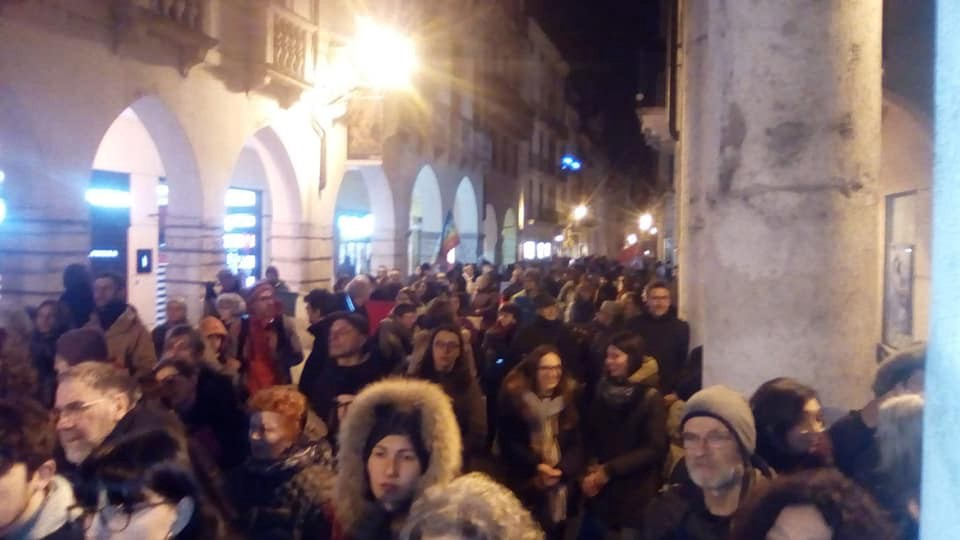
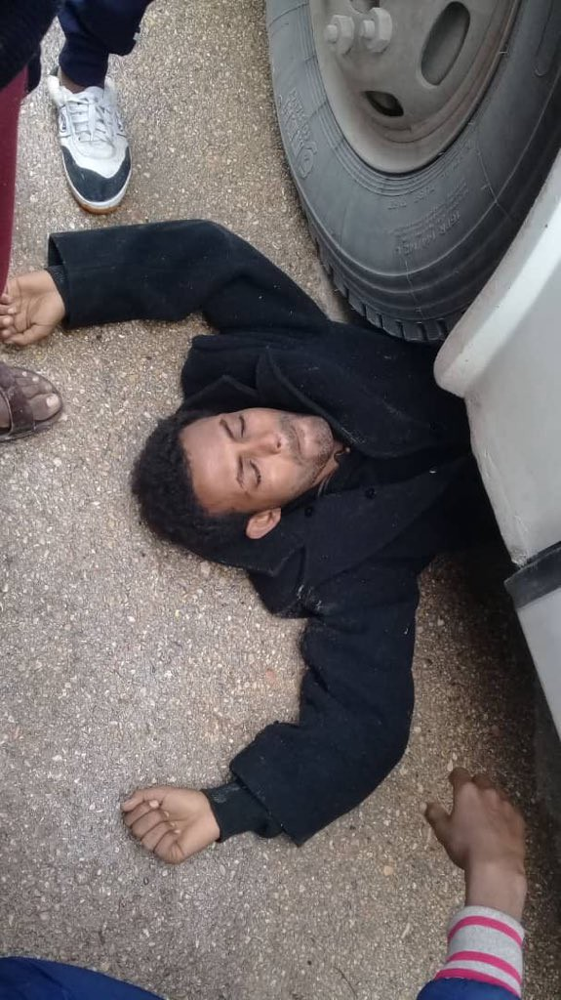

### AYS Daily Digest 7/2/19: Protests against abolishing “humanitarian protection” residency in Italy
#### _Updated numbers of refugees in Turkey / volunteers needed in Greece and Bosnia / humanitarian crisis in Syrian camps after flooding / trafficking in Morocco / and more…_

 139\.000 signatures of citizens and citizens who ask the government of Pedro Sanchez to rectify his immigration policy and do not let anyone die in the sea\. They do not want witnesses but they will not be able to prevent us from defending the right to life of all\.](assets/6cdcca2d8254/1*yGtsWm0u_QAcRyEW7hch0g.jpeg)

“Today we have delivered with [Proactiva Open Arms](https://www.facebook.com/…/a.90945922247…/2093137634111409/…) 139\.000 signatures of citizens and citizens who ask the government of Pedro Sanchez to rectify his immigration policy and do not let anyone die in the sea\. They do not want witnesses but they will not be able to prevent us from defending the right to life of all\.
### Feature

Following the outcry from the [Salvini’s degree back in November](https://www.pri.org/stories/2019-02-01/after-salvini-decree-evictions-refugees-italy-face-uncertain-future) to target asylum\-seekers’ rights by abolishing “humanitarian protection” residency permits, protests happened in Vicenza on Thursday\.

](assets/6cdcca2d8254/1*AC1coGImwLsX5Tkv6mN0XA.jpeg)

“\(We are\) against the Salvini decree and municipal ordinances that devastate lives and create social exclusion\.” Photos by [Global Info Project](https://www.facebook.com/globalproject.info/posts/2201521886553103?__xts__[0]=68.ARDnGVwrWsxt4eu-do5gZATgpyykDKp0XbDB_U6aSt9FtDXRoB8NwkyhD6ia6gfIOat358CGQDRTc7a2DpN78ymH1AgpAUQjvGnfL_ONc4Wno6Om2aXfr1Go43UBnApmHnw_YlDySRvCbYzVc36iUT3W5jRl0tB-CyEiIDZJ2VhN-rHTiz6I_SbcaE3ZuhvQvRdqF3McXLiQBtBy5UPweQAoahmOOgvPwzInHiJOzfaKhiS5BfiHi0ollSDaqyz-9Q4YEkrOsf6enzoTPAXeEydR00d9ryRH9ep3B6QxBf7syaaYmUoqXijbpVfVv40yOpwRJtEETppoOmKt5C7TIFXaFQ&__tn__=-R)

Several events are happening over the next few days in response to Salvini’s decree:

[**Friday 8/2**](https://www.facebook.com/events/347359136115066/) , 17:00–20:00h: Naples “Towards the assembly of Macerata, let’s get organized\!”

[**Saturday 9/2**](https://www.facebook.com/events/322329008451920/) , 14:00h: Fondamenta Santa Lucia, Venice “Side By Side \#indivisibili in Marcia per l’ Umanitá”

[**Saturday 9/2**](https://www.facebook.com/events/784553168570254/) , 16:00–20:00h: Catania “City Event for Open Ports”
### Syria

6 weeks after the downpour of the rainstorm, the displacement camps in the Idlib province are still facing catastrophic living conditions\. There continues to be a severe lack of medical aid and food to distribute\. Tents have either been torn apart or sunk into the mud\. For more information from the Syrian Observatory for Human Rights look [here](http://www.syriahr.com/en/?p=115752&fbclid=IwAR2YGN1KyzLqXgeFKFD9NKaBoAdRqtZZOq02NftjQn-hVb8J_lW_nV0VH20) \.
### Turkey

[According to](https://www.facebook.com/GlobalDTM/photos/a.179695088858385/1122956651198886/?type=3&theater) the Turkish Directorate General for Migration Management \(DGMM\) there are now 4 million non\-Turkish people residing in Turkey seeking international protection\.

](assets/6cdcca2d8254/1*0d52Z5syv1aIgtqbQFurXw.jpeg)

Photo by [Displacement Tracking Matrix — DTM](https://www.facebook.com/GlobalDTM/photos/a.179695088858385/1122956651198886/?type=3&theater)

[The majority](https://www.facebook.com/GlobalDTM/photos/a.179695088858385/1122956651198886/?type=3&theater) are from Syria \(3,640,466 people\) and the other mainly inlcude people from Afghanistan, Islamic Republic of Iran, Iraq, Somalia and as well as other countries\.
### Libya

There were [protests](https://twitter.com/sallyhayd/status/1093517120703528962/photo/1) today in Khoms Souq al Khamise dc at frustrations towards UNHCR when they apparently took 10 new arrivals for evacuation\. Others have been detained for 10 months and still have not been registered by UNHCR\. The protests included mostly teenagers, but about 40 women were also involved\.

](assets/6cdcca2d8254/1*-8sA5d8OJ2DzjP0tASfS0A.jpeg)

Photos by [Sally Hayden](https://twitter.com/sallyhayd/status/1093517120703528962/photo/1)

[Libyans](https://twitter.com/sallyhayd/status/1093517120703528962/photo/1) showed up in the evening to take about 50 people to another detention centre\. At the time of this reporting there is no confirmation that they made it to the detention centre\. The concern is that this was the same excused used at the start of January, when people were forced back to smugglers\.
### Morocco

In an update from [Association Marocaine des Droits Humains — Section Nador:](https://www.facebook.com/AmdhNador/photos/a.1693125780899690/2269650336580562/?type=3&theater)

> “The tragedies of migration are becoming more common in nador because of the networks of traffickers that are active in freedom\.
 

> **This Monday, February 4** , a trafficker bus carrying migrants to sidi hssaine beach in tazaghine to do boza has spilled\. Final Balance Sheet 3 Dead, 2 injured still in nador hospital, while the other 17 left the hospital after receiving the necessary care\.” 

](assets/6cdcca2d8254/1*I0eWh0j-qNi5cSvTJm8xUw.jpeg)

Hospital in Nador Photo by [Association Marocaine des Droits Humains — Section Nador:](https://www.facebook.com/AmdhNador/photos/a.1693125780899690/2269650336580562/?type=3&theater)

They also named a trafficker in a Facebook post who they say is a part of the network responsible for the appearance of 53 persons on January 12th\. Their families are worried and you need to find out more [here](https://www.facebook.com/AmdhNador/photos/a.1693125780899690/2269733993238863/?type=3&theater) \.
### Sea

Sea\-Watch is in need of donations:

Sea Eye is in need of volunteers, especially ones with nautical and/or medical experience\. Find out more [here](https://www.facebook.com/SeebrueckeSchafftsichereHaefen/photos/a.640137809691739/789712568067595/?type=3&theater) \.

 to get their boats back in open waters saving lives\. Photo By [Proactiva Open Arms\.](https://www.facebook.com/proactivaservice/photos/a.232810050083187/2264419463588892/?type=3&theater)](assets/6cdcca2d8254/1*7TPFkqglm9GJBtpR1JO-vA.jpeg)

Open Arms presented 139,000 signatures to the government of [Pedro Sanchez](https://www.facebook.com/smhumanitario/photos/a.909459222479262/2093137634111409/?type=3&theater&ifg=1) to get their boats back in open waters saving lives\. Photo By [Proactiva Open Arms\.](https://www.facebook.com/proactivaservice/photos/a.232810050083187/2264419463588892/?type=3&theater)
### Greece

Helsinki racist crime monitoring watch [initiated a legal case](https://racistcrimeswatch.wordpress.com/2019/01/28/3-53/Leslie Meral Schick) against four banks denying to open account for salaries for asylum seekers as they do not accept asylum card as an identity\.

_Mainland_

Layali Salon is part of [Project Layali](https://www.facebook.com/projectlayali/?__tn__=%2CdKH-R-R&eid=ARB9QTCyxexm80WUwz6e6QoAY4cvVF3Q4Om2qgG-P7qCVO7rLR0Du1MksPWAf3nkkCoJT6JufzmvOLmK&fref=mentions) , a social enterprise created through [Zaatar — non\-profit organization](https://www.facebook.com/zaatarngo/?__tn__=%2CdKH-R-R&eid=ARA3fKNh5Oi7tel8OZNLRiAWMBXRqW_wsN9ZycHehxGt2QgSbwi2Wx6kHkbPvSvjlxAX6TSv3y2X7BJ9&fref=mentions) \. All profits go directly to refugees working at our salon and shop\. Thank you for supporting our vision\!

[Our House](https://www.facebook.com/pg/ourhousegr/posts/?ref=page_internal) is looking for donations for the Malakasa Camp, where 315 people in one large community tent\. They are especially in need of:
\-Personal items for women, fresh underwear and sanitary items
\-Milk for babies
\-Cooking stoves and gas canisters for all
\-Extra food supplies
\-Toys

Generation 2\.0 has new job advertisements for NGO and other jobs\! Find out more [here\.](https://g2red.org/job-adverts-07-02-2019/?fbclid=IwAR3CKSVJsHpeSvTN2al5FOyrWK-3RV3pYt8JDvADLKOU1Jgiuq-IkfeA75c)

> “foodKIND is looking for a volunteer that can start in March or April and can commit a minimum of 6 months to oversee our projects in camps Oinofyta and Malakasa\.” 

Find out more about the daily responsibilities [here\.](https://www.facebook.com/foodKIND/photos/a.1750505655170694/2342183609336226/?type=3&theater)

Action for Women is looking for volunteers to help them run their center in Athens\. Find out more [here](https://www.facebook.com/actionforwomenCH/photos/a.726720240805801/1549614318516385/?type=3&theater) how you can help protect vulnerable women and girl refugees\.
### Bosnia and Herzegovina

Call for volunteers in Velika Kladuša for support in the field

At the moment the S\.O\.S\. Team Kladuša runs a restaurant \(where local war veterans cook and work\), a FreeShop \(for clothes, shoes, blankets, etc\. \) and First Aid\. In order to be able to continue working, they **need 4–6 people to help** , arriving by **Monday, February 11** \.

> We need people who are willing to engage in longer term \(at least 4 weeks\) \. We are informal association of independent volunteers, and we are in process of registration\. For expenses, a hostel is about 200 Euro / month plus what you need to live \(food is very cheep here\! \)
 

> Please contact us if interested at this email: soskladusa@gmail\.com 

### Balkan Weather

MONTENEGRO

Moderately cloudy\. In the morning, fog or low clouds in the basins in the north\. Weak to moderate wind, changing directions\. Lowest temperatures from \-7 to 5 and the highest from 3 to 15 degrees\.

SERBIA

Some frost in the morning\. Predominately sunny, before noon\. In the afternoon cloudy with chance of rain in the west and center\. Weak to moderate wind from the south\. The highest temperature from 4 to 9 degrees\.

BiH

Predominately cloudy, in the basins fog before noon\. Sunny in Herzegovina, western and southwestern Bosnia\. Weak wind from the north\. Lowest temperatures from \-3 to 6 and highest from 1 to 15 degrees\.

CROATIA

Predominately sunny with mostly a weak wind from the west and northwest\. Highest temperatures from 5 to 16 degrees\.
### France

CAMO has some disrupting footage of police brutality against young migrants in Ouistreham\. They wrote a letter to the court outlining the events and hope to protect the dignity of the boys involved\. Find out more [here](https://www.facebook.com/CollectifAideMigrantsOuistreham/videos/796982820682361/?__xts__[0]=68.ARAf5ImPgStCD_VQTI_InlXHjUoo0oSYQOae_zXJMIlpwFjpNDHIEqpJgPHtfM6pfbvfC06TXsdKErwetDbjHs3ynyWn2DHDa8E1jNAUAQVunjTLikmg6lrYKfQRqPYP9gHXr7elfNkc9DbypCQDQLuo6243OYwwQq_t-IOT3jFy1FB9j39bM6MmZJOMJXBEMvS2fjeMoU5Fm1nKREqo2lSqKvN44GL-nuOH7b4nBMgYwhEKIGmEI5cM8P2gDo0Wm_stpX2g6rMu6T9hOBSPFHYAgiow7-k_ytv0PIMfj0JbB7bWgOEeqCOVanAiOhQAd5d19ceXj_dO04WjoM_DXdAB42GCfVRqHrZ4ix09&__tn__=-R) \.

[A young migrant man](https://www.ledauphine.com/hautes-alpes/2019/02/07/val-des-pres-un-jeune-migrant-decede-apres-avoir-ete-retrouve-inanime-le-long-de-la-rn-94?fbclid=IwAR1C7R6AOnNFWTqFzX49k_sbxUk-z0E6lBxj-Ygdp0BZPIvtg3ex7Iz_R5Y) was found right before 3 am on the RN 94 at Val\-des\-Près and he later died at the hospital due to cardio arrest\. [He was suffering](https://torino.repubblica.it/cronaca/2019/02/07/news/cadavere_di_un_migrante_trovato_sulla_strada_del_monginevro_voleva_superare_la_frontiera_con_la_francia-218540751/?fbclid=IwAR0FBjO7eDnuEE9vbyHj7iNdTf2yLH07mT_FbuDlOHZpftptpMJXQYern8Q&refresh_ce) in the snow on the side of the road from extreme hypothermia\. The investigation remains open for “ manslaughter and endangering the lives of others”\.

Need legal advice? Write to the FEB Lawyer’s Clinic [here](https://cjeaefb.wordpress.com/prenez-rendez-vous/?fbclid=IwAR3JhM4wC4y03YifDTHJcQ-emYfKBWCEz4Kxu1Vj65H1UeMniQT-8nK-eX0) \.
### UK

Parliament’s Human Rights committee has issued a statement with the recommendation to take power away from the Home Office to lock up a migrant in detention\. The recommend that the decision to detain should remain independent\. Look [here](https://www.freemovement.org.uk/take-power-to-lock-up-migrants-away-from-the-home-office-report-urges/?utm_source=rss&utm_medium=rss&utm_campaign=take-power-to-lock-up-migrants-away-from-the-home-office-report-urges) for more key recommendations\.

The Gaskell Garden Project reported on Tuesday a stop a plan campaign of deporting Owen Haisley and others and are continueing the fight to keep him from leaving the UK\. While stopping this deportation was successful, they’ve stated:

> “\(It’s\) possible that the Home Office will still try to deport him and those who remain at Harmondsworth IRC in the short term\. At present, Owen remains detained indefinitely — so the fight is far from over\.” 

Find out more and what you can do [here](https://www.facebook.com/TheGaskellGardenProject/videos/338670956752437/?__xts__[0]=68.ARC9LEGXXDN9Mnm5AY6zbjXOAJgbc_e-YycMcGe4pf4iOsW4jzi6NH6mfbkxj3s6YFEQxEOmvlTPVTOWbRA_QS24dzGpkCt0nQKtezOYpSKLsFteAWBPT5Q-rp4qG1ILfI-p1x64JfrV51ps2-dgN7hT4wMm-uCU76dK-NBDQ1iEvluslB3OPyvSC4Dk_Q1ylxezd2hJT1Pe7S-tATYUA2UfKomZFi-Z1aXlkcS4ZE99CNeVZq59RWfyCw1LPNARpTMEXXfbZuetFcvb8HRfm5nw2mbK0AR-GzHZ_bmG0yLpLVAK1Ni8BrUKIPYnkwmhWHD1A8rTTlQji2J_uQaehlCWc9nQtWa45FgIlxk-5D3eBbuQWCIGdYXc53cXxZ9zxwOOW_RIf5o2IAWkjmNni_YANqQrFMommpkFx0bBm0qNDth9WdovUWsi-MEpZnN6zxP0QVTse9y5bQQbAnCmRMARqiTidqa0jYbzNven7FuQraiOBXeWHyKmH64PhVlE8jOc&__tn__=H-R) \.

We also publish weekly summaries of some of the most important news reported during the past week in our Daily News Digest: here are the [**Arabic**](%D8%A3%D8%B5%D8%A8%D8%AD%D8%AA-%D8%A5%D8%B3%D8%A8%D8%A7%D9%86%D9%8A%D8%A7-%D9%86%D9%82%D8%B7%D8%A9-%D8%A7%D9%84%D8%AF%D8%AE%D9%88%D9%84-%D8%A7%D9%84%D8%B1%D8%A6%D9%8A%D8%B3%D9%8A%D8%A9-%D8%A5%D9%84%D9%89-%D8%A3%D9%88%D8%B1%D9%88%D8%A8%D8%A7-27939af2b662) and [**Persian**](%DA%A9%D8%B4%D9%88%D8%B1-%D8%A7%D8%B3%D9%BE%D8%A7%D9%86%DB%8C%D8%A7-%D8%AA%D8%A8%D8%AF%DB%8C%D9%84-%D8%B4%D8%AF%D9%87-%D8%A8%D9%87-%D9%86%D9%82%D8%B7%D9%87-%DB%8C-%D8%A7%D8%B5%D9%84%DB%8C%D9%87-%D9%88%D8%B1%D9%88%D8%AF-%D8%A8%D9%87-%D8%A7%D8%B1%D9%88%D9%BE%D8%A7-7e36c6f4bdbe) for the Week of January 21–February 3\. 
Please, share the information with your Arabic and Persian speaking contacts\!

**We are an entirely volunteer\-run media team, and we rely on our supporters to share our news\. So please share, and never forget to ACT\!**

**We also publish weekly summary digests in [Persian](https://medium.com/are-you-syrious/کشور-اسپانیا-تبدیل-شده-به-نقطه-ی-اصلیه-ورود-به-اروپا-7e36c6f4bdbe?fbclid=IwAR3aMZOEipwboDl7g6f2uB1ESsUGZmJFiOjLZR7LX1u8jT3ad4x3bBgt6kk) and [Arabic](https://medium.com/are-you-syrious/أصبحت-إسبانيا-نقطة-الدخول-الرئيسية-إلى-أوروبا-27939af2b662?fbclid=IwAR2xuFaPG7me5-6O3KLH6qYasBKix98oU4sML5DKaaBTZNr1ULAZyvXBiHo) \.** **Please, read and share the ones for the week January 28 — Febraury 3\.**

**We strive to echo correct news from the ground through collaboration and fairness\. Every effort has been made to credit organizations and individuals with regard to the supply of information, video, and photo material \(in cases where the source wanted to be accredited\) \. Please notify us regarding corrections\.**

**If there’s anything you want to share or comment, contact us through Facebook or write to: areyousyrious@gmail\.com**

_Converted [Medium Post](https://medium.com/are-you-syrious/ays-daily-digest-7-2-19-protests-against-abolishing-humanitarian-protection-residency-in-italy-6cdcca2d8254) by [ZMediumToMarkdown](https://github.com/ZhgChgLi/ZMediumToMarkdown)._
