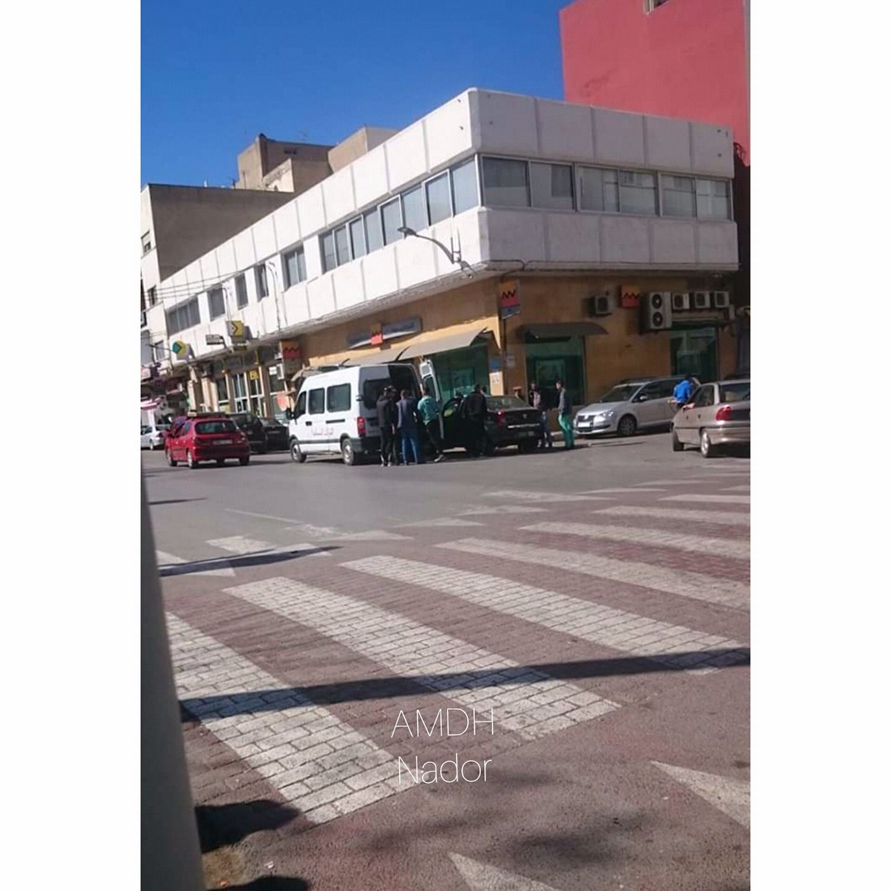

### AYS Daily News Digest 8/2/19: Violence in Morocco increases
#### Even racist attacks of civilians increase / New makeshift camps in Greece show up / Mainly South and Central American refugees in Spain

](assets/25cc8d0c81b9/1*dHUQRa1ORcIavI3MQmtdLA.jpeg)

AMDH reports, that people are being arrested, because they are black\. Credits: [Association Marocaine des Droits Humains — Section Nador](https://www.facebook.com/AmdhNador/?tn-str=k%2AF)
#### FEATURE

There are currently repeated reports coming through that the violations of the Moroccan authorities against sub\-Saharan migrants have reached unbearable limits\.

“ A day of arrest of migrants in nador\. In the streets, the auxiliary forces and authority officers arrested several sub\-Saharan migrants among them women who did nothing wrong except that they were black\.”

> Today, people in civilian clothes, who are neither police, nor the army, nor even members of the auxiliary forces, have arrested dozens of migrants in Nador\. They tried even to arrest our colleague Abdoulay who is a community agent, who has his residence card, and who works legally in Nador\. 

Thus, it is safe to say these attacks are racially motivated and directed against the potential refugees and migrants\.

Listen to his testimony:

[Association Marocaine des Droits Humains — Section Nador](https://www.facebook.com/AmdhNador/?__tn__=%2CdkCH-R-R&eid=ARB8O2SquBjRiZ-inzebxiuKNfvDkVc49TSdTVGCFBfkPbPa5O7Nc-uWaiXMDkLXuNjUE-nAdDquFWof&hc_ref=ARTakUw1DwfWJVugg2-s5x7WXuk9Q55KtRJaCkXQqwSd9GuS0iuyk03Df_vONwigWMM&fref=nf&hc_location=group) , who were present during this arrest attempt, claim to know those ‘outside the law’ that are civilians with no right to arrest people\.
Ours and their full solidarity with Aboubakar\.

According to these reports, nearly 500 migrants were arrested, women with their children included, but also asylum seekers who have submitted their asylum applications in Morocco\.

> 6 refoulement bus came out of Nador for now\. While the authorities have kept simple migrants in detention to charge them of being traffickers\.
 

> A known game that must be unmasked\.
 

> The great traffickers are still running, while migrants who get arrested in forest or on the street are presented as great smugglers\. 

### Libya

Journalist Sally Hayden reports that a group from Khoms has been deported to Sebha detention center in Tripoli\. “It’s not clear why they were moved, & obviously it’s distressing for detainees when this happens at night without them feeling they can trust the Libyan authorities moving them,” she writes on [Twitter](https://twitter.com/sallyhayd/status/1093765873154826240) \. For the [Time](http://time.com/5510517/facebook-smuggling-libya-ransoms/) she also wrote an article about families raising money on Facebook to free their relatives held hostage by smugglers\.

■■■■■■■■■■■■■■ 
> **[Flavio Di Giacomo](https://twitter.com/fladig) @ Twitter Says:** 

> > The access of IOM and others to detention centres in #Libya can try to alleviate the suffering of #migrants but cannot change the unacceptable conditions in which they are being arbitrarily detained.

#LibyaisNotaSafePort 

> **Tweeted at [2019-02-08 09:10:29](https://twitter.com/fladig/status/1093799215522820097).** 

■■■■■■■■■■■■■■ 

### Greece

The land route of Greece and Turkey through the Evros river still seems to be in use, according to AYS information\. As the Diavata camp is overcrowded, a new makeshift camp popped up close to the central station of Thessaloniki\. Several people have reported that they have been denied access to official reception facilities for months\. Conditions have also been reported to be very poor in the Diavata camp\.

■■■■■■■■■■■■■■ 
> **[MSF Sea](https://twitter.com/MSF_Sea) @ Twitter Says:** 

> > Ali, 28, lives in a cramped tent with 3 families in #Moria. Personal space is but a dream, access to healthcare is very limited, &amp; human dignity has been forgotten. We continue to call on Greek authorities &amp; #EU to evacuate vulnerable people from this inhumane place #letthemout https://t.co/UyjA9htM1e 

> **Tweeted at [2019-02-08 15:13:36](https://twitter.com/msf_sea/status/1093890598136938496).** 

■■■■■■■■■■■■■■ 

### BALKAN WEATHER 08\.02
#### MONTENEGERO

Lightly to moderately cloudy with sunny intervals\. In the morning in the basins in the north there is a possibility of fog\. Wind weak too moderate from changing directions\. Lowest temperatures from \-8 to 6 and highest daily from 4 to 15 degrees\.
#### SERBIA

Predominately sunny and warm, wind moderate\. Lowest temperatures from \-3 to 1 and highest daily form 6 to 9 degrees\.,
#### BiH

Moderately to predominantly sunny\. In the basins and alongside the rivers there will be fog before noon\. During the day less clouds\. Wind moderate, in the southwest moderate, from the south and southwest\. Lowest temperatures from \-3 to 5 and highest daily from 3 to 13 degrees\.
#### CROATIA

Partly sunny, alongside the coast predominately sunny\. Inland locally fog during the morning\. Moderate to strong southwestern wind will be blowing\. Lowest temperatures from \-5 to 8 and highest daily from 7 to 15 degrees\.
### Serbia

Info Park continues to note cases of individuals who were sent to Serbia by authorities of other countries, although Serbia had never been the country of their transit\. With that regard, a man from Somalia, who was intercepted by Hungarian police, was assisted in the Info Park’s hub\. He stated he was granted asylum in Romania in 2016 before he travelled to Belgium in 2018, where he filed an asylum claim which was denied\.

> On his return from Belgium to Romania through Hungary, he was required by
 

> Hungarian police to enter Serbia, although he had never been in Serbia before\. Out protection staff briefed the man thoroughly on legal options in his situation\. SCRM referred him to a reception center, while an interview at the Embassy of Romania in Belgrade was scheduled for Monday, 11 February\. 

Collective Aid is looking for van drivers in Serbia to continue the daily operations\.

### Spain

The UNHCR released the [yearly aslum report for Spain](https://data2.unhcr.org/en/documents/download/67907) \. As of 31/12/2018, More than 55,000 people filed an application for international protection, which is 75 percent more than the year before\. The recognition rat is 22% and more than 78,000 applications are still pending\.

More than half of the applicants are from Venezuela and Colombia; four of the top eight nationalities are Central or South American\. Syrians and Algerians together made up only around 4,300 applications\. Ukrainians, who before Venezuelans have the highest rejection rate, and Palestinians around 4,000\.
### France

[Collectif Soutien Migrants 13 / El Manba](https://www.facebook.com/collectifmigrants13/?tn-str=k%2AF) writes about another death due to hypothermia in Montgenevre\. On Saturday they announced a solidarity march at 3pm: “Don’t let them silently turn the mountains into a cemetery\.”

](assets/25cc8d0c81b9/1*ArBhKfRLgWfy8MwGyF0eRw.jpeg)

Credits: [Collectif Soutien Migrants 13 / El Manba](https://www.facebook.com/collectifmigrants13/?tn-str=k%2AF)
### Netherlands

In its newsletter, ECRI writes about the current development in Dutch interior politics: The government announced to examine the cases of 700 children and their families, who had made use of the “children’s pardon” scheme, which is about to be scrapped\. Families, whose asylum cases hadn’t been processed for five years or longer, were eligible to apply for this kind of residence permit\. “There will be a transitional arrangement for families that have been here for five years or longer, but have not made any application for the children’s pardon before,” ECRI writes\. At the same time, the government wants to relocate 500 instead of 750 people from UNHCR refugee camps in war zones\.
### EU

Dunja Mijatovic, commissioner for human rights of the Council of Europe, expressed “deep concern” about Italy’s closed harbour policy in the recent months, Ansa [reports](http://www.ansa.it/english/news/2019/02/07/migrants-strasbourg-criticizes-closed-ports-policy_6610299f-5725-4553-8ddc-13f3368873f8.html?fbclid=IwAR1OOMFy51cUt876G57H--4UiDgjED2p5t9X9ICEUQKmieOvcaz9LXJCjio) \. In a letter sent to prime minister Giuseppe Conte, she urged the government to prioritize Human Rights over disagreements with other countries\.

**We are an entirely volunteer\-run media team, and we rely on our supporters to share our news\. So please share, and never forget to ACT\!**

**We also publish weekly summary digests in [Persian](https://medium.com/are-you-syrious/کشور-اسپانیا-تبدیل-شده-به-نقطه-ی-اصلیه-ورود-به-اروپا-7e36c6f4bdbe?fbclid=IwAR3aMZOEipwboDl7g6f2uB1ESsUGZmJFiOjLZR7LX1u8jT3ad4x3bBgt6kk) and [Arabic](https://medium.com/are-you-syrious/أصبحت-إسبانيا-نقطة-الدخول-الرئيسية-إلى-أوروبا-27939af2b662?fbclid=IwAR2xuFaPG7me5-6O3KLH6qYasBKix98oU4sML5DKaaBTZNr1ULAZyvXBiHo) \.** **Please, read and share the ones for the week January 28 — Febraury 3\.**

**We strive to echo correct news from the ground through collaboration and fairness\. Every effort has been made to credit organizations and individuals with regard to the supply of information, video, and photo material \(in cases where the source wanted to be accredited\) \. Please notify us regarding corrections\.**

**If there’s anything you want to share or comment, contact us through Facebook or write to: areyousyrious@gmail\.com**

_Converted [Medium Post](https://medium.com/are-you-syrious/ays-daily-news-digest-8-2-19-violence-in-morocco-increases-25cc8d0c81b9) by [ZMediumToMarkdown](https://github.com/ZhgChgLi/ZMediumToMarkdown)._
