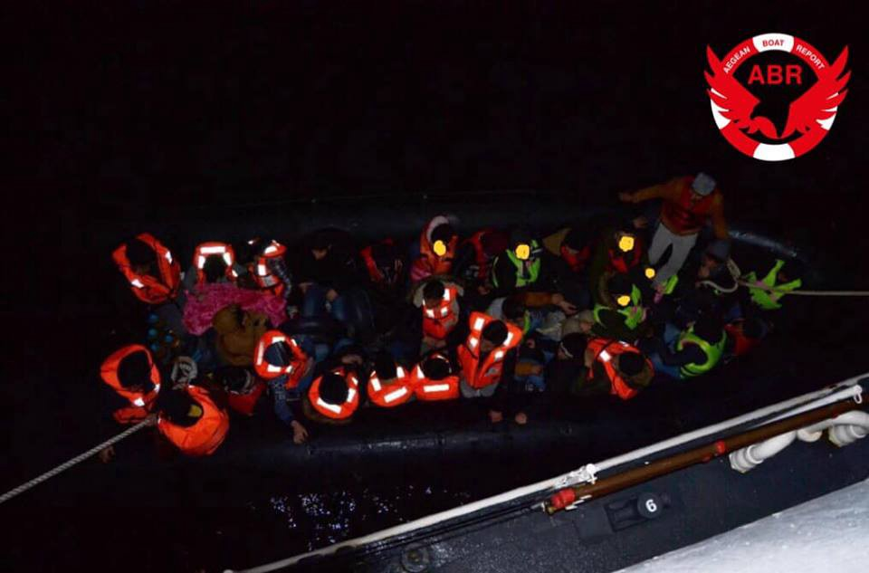
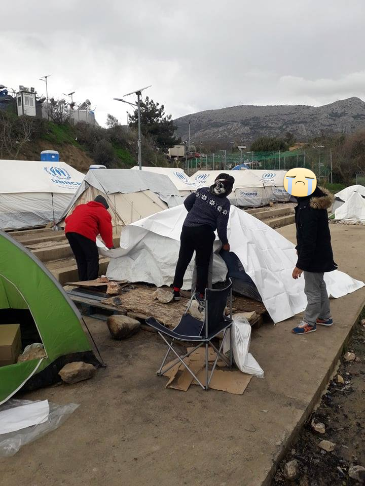
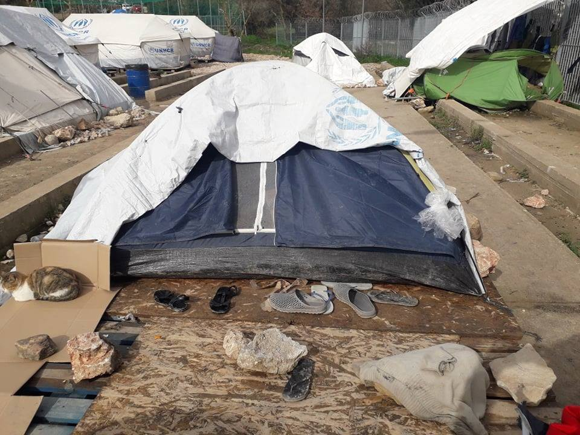
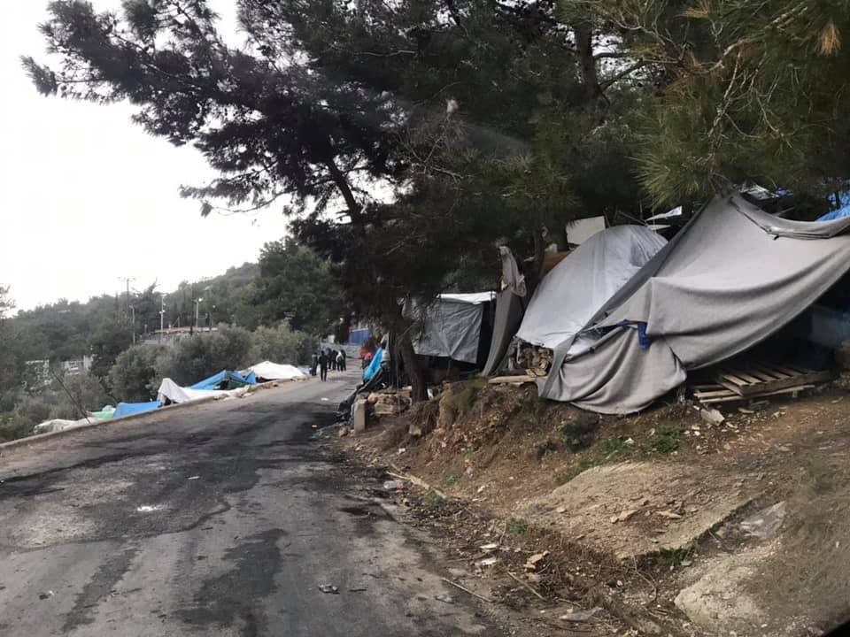
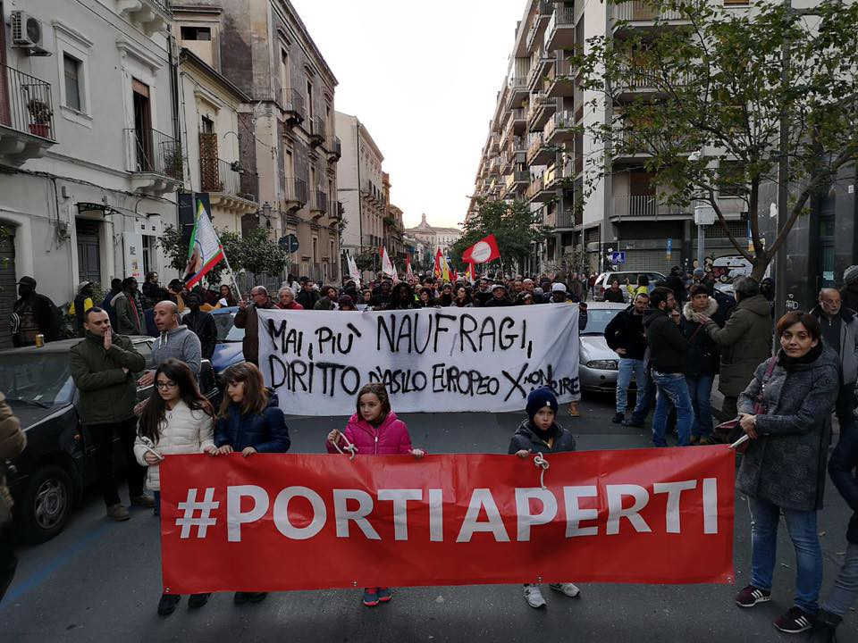
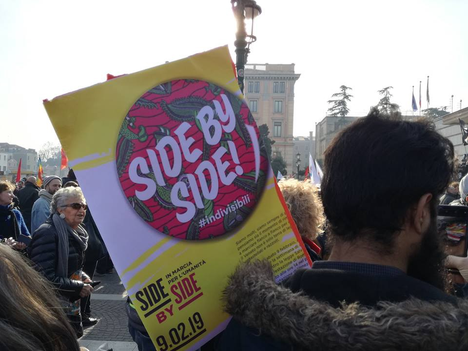
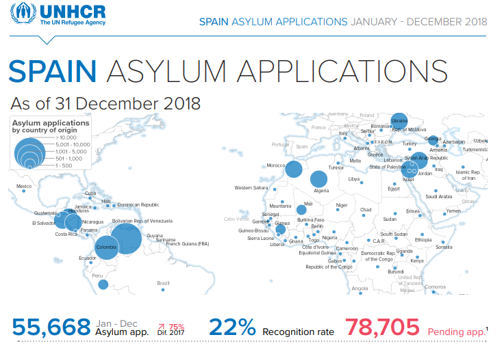

### AYS Weekend Digest 9–10/02/19: 5 years on and people keep dying at Europe’s borders

Protests in various Italian cities /// Racist attacks against refugee camp in Northern Lebanon /// Young girls attacked in Berlin /// Row among authorities regarding social housing for migrants in Italy /// People keep sleeping in summer tents in Greece /// Unsanitary conditions in Swiss reception centre /// Attempt to cover up real conditions of Libyan centre exposed

 renamed “Alan Kurdi”](assets/e4937cceb33c/1*iDe6riXtSxTRZA_WPWwjXQ.jpeg)

[Sea Eye Vessel](https://www.facebook.com/seaeyeorg/photos/a.730635527042347/1771049893000900/?type=3&theater) renamed “Alan Kurdi”
#### 5 years on and people keep dying at Europe’s borders

 \)](assets/e4937cceb33c/1*aHlQU01Vu-Nql-lxkjDYEw.jpeg)

Tarajal, Ceuta \(Photo by [Watch the Med — Alarm Phone](https://www.facebook.com/watchthemed.alarmphone/photos/pcb.2310729352534628/2310718329202397/?type=3&theater) \)

Protests have been held at Tarajal, in Ceuta, Spain on 9th February in memory on 14 African migrants who were killed by the Guarda Civil on 6th February 2014\. The attack in 2014 [was reported](https://www.ecre.org/at-least-13-people-die-in-an-attempt-to-enter-spain-migrants-accuse-guardia-civil-of-using-rubber-bullets-and-tear-gas-against-them/) as occurring after 200 to 400 people attempted to cross the border fence that separates Ceuta and Morocco\.

They were met with rubber bullets and tear gas by the Spanish Guarda Civil, who continued to fire at people in the sea, while they tried to cross into Spanish territory by swimming around the fence\. Though 14 people were officially reported dead, many more were never accounted for — Roger, Yves, Samba, Larios, Daouda, Luc, Youssouf, Armand, Ousmane, Keita, Jeannot, Oumarou, Blasie and many others are still missing\.

 \)](assets/e4937cceb33c/1*VUlRUUYABsHelGyMByJWBw.jpeg)

Tarajal, Ceuta \(Photo by [Watch the Med — Alarm Phone](https://www.facebook.com/watchthemed.alarmphone/photos/pcb.2310729352534628/2310718329202397/?type=3&theater) \)

[Watch the Med — Alarm Phone](https://www.facebook.com/watchthemed.alarmphone/posts/2310729352534628?hc_location=ufi) denounce the actions of the Spanish authorities, claiming that the deadly attack was never officially condemned\. The court case against the officers was reopened in August 2018\.

**The group demands justice for the victims\. They did not simply die, they were assassinated\.**

[**\#5AnosTarajal**](https://www.facebook.com/hashtag/5anostarajal?source=feed_text&epa=HASHTAG&__xts__%5B0%5D=68.ARAkq6pvZLVrMFaF7NfJwMMvFEDGxqgvECFJtS3uwEBC6WRmBZHhh9o-jcGsfMHKx7V8LqNB4a31Nqi2hLsNKctkicsu4NF1X4pyphVoSaI_DnoIi7Z3au-LJpoJlUo-LwD5BDOi1AMUteUQE_yiXXieLDOScseq4HacWCKtgCsOACTNjwUsNXx87n6MEqtmQuyruR3MIeGOu2ilgMFpW7oVbtWoVXZlVusOp6eThV9m4yDrkcKWu8o3Qs3Moebyh7jQBzKE_5AJZ34bjMj4hvMp5wlWirEEXE6C-ohg00pzFQVwpuGUu9xUad8Kfq4RIvCl21dlGbelGJhZbmmN5NVcRZux&__tn__=%2ANK-R) **— No olvidamos\!**

After 5 years we still report deaths at the hands of Europe’s border policies\.

After the death of the young Togolese person we reported on Friday, a [protest was held over the weekend](http://alpesdusud.alpes1.com/news/hautes-alpes/75437/hautes-alpes-deces-du-jeune-migrant-une-manifestation-prevue-ce-samedi-a-briancon?fbclid=IwAR1kCQLAOME_WCAbC5JV4hAzieitS1XyjOHPgQUpPifkl8fV3kvT52M79eg) in Briançon in the Hautes\-Alpes region of France in his memory\.

 \)](assets/e4937cceb33c/1*26kX_DOSKPs1oAUpB7H6oA.jpeg)

La Frontière Tue \(Photo by [Chez JesOulx — Rifugio Autogestito](https://www.facebook.com/Chez-JesOulx-Rifugio-Autogestito-362786637540072/) \)

[A group text](https://www.facebook.com/tousmigrants/posts/2351347295096836?hc_location=ufi) signed by attendees and NGOs was addressed to the prefect of the region\. They state that hypothermia, injuries due to falls, and frostbite have all become common and ask for an end to pushbacks in the mountains and the harassment of volunteers\. Above all they highlight that border policies and police activity in the area are directly leading to people’s deaths\.

In Croatia, [local media](http://hr.n1info.com/Vijesti/a368976/Mladi-migrant-smrznuo-se-do-smrti-na-Cicariji.html?fbclid=IwAR1bvzOqmN5AqSQkhxWipnSxECVqjO6SIl9m6d2h6-ExlqBj-6oHFZrtUyQ) has reported the death of a migrant in the forest area of ​​Vodni dol in Ćićarija\. The body was found on Tuesday and the person is believed to have frozen to death whilst attempting to cross the border out of the country\. This comes following a search and rescue mission to find the missing person, after a friend, who was also stopped in an attempt to cross the border, reported them missing as he was concerned for his missing comrade, who he stated had gotten lost in the vast forest\. Unfortunately, the search and rescue mission was too late and resulted only in the discovery of the lifeless body of the migrant who had been left to navigate the difficult and frozen terrain alone\.

And people keep dying in Northern Greece as a result of police persecution\. [Local media report](http://www.efsyn.gr/arthro/dromoi-harakomata-polemoy?fbclid=IwAR0S6bMzTFejgjzYNXTQL8Hrn4y_Fnwx8HHLzQCOpMF_jGTCXDuSrRXaj0U) that the Hospital of Doctors Association of Thessaloniki, the Thessaloniki Anti\-Racist Initiative, the Social Solidarity Hospital of Thessaloniki and the SOS Traffic Crimes Association of Thessaloniki have collected data stating that high speed police chases of vehicles carrying refugees led to the death of 18 people between 8/6/18 and 9/11/18 as well as the injuring of a further 54 people\.

The four organizations and collectives refer mainly to the area of Egnatia Odos from Kavala to Thessaloniki and stress that:

> these 72 people cannot be considered victims of traffic accidents\. They are victims of the ruthless war that, for decades, European countries have been conducting, with the participation of Greece, of course, against refugees\. These refugees of war, poverty and repression come from countries which European states have provoked with their economic and military interventions\. 

> We do not mean it metaphorically : almost all of the above ‘accidents’ are directly caused by the violent persecution carried out by the Greek Police\. 

> These pursuits are thus another weapon — alongside the fence, the camps, the minefields, the enclave — and extend the war against refugees from the border to the hinterland\. 

LEBANON
#### Raids against refugees in al\-Anma camp

There have been [reports](https://www.alaraby.co.uk/english/indepth/2019/2/8/lebanese-army-arrests-32-syrian-refugees-in-dawn-raid?fbclid=IwAR3_Sgg6iT3bUOkVRZQTo0KSxQWSJzh2MNAsabXHgiUsKN_BGqsyjk9cyzY) of raids targeting undocumented Syrian refugees living in the al\-Anma refugee camp in Northern Lebanon\. 32 men have been arrested by the Lebanese army following an early morning raid on February 5th by around 20 to 30 soldiers, with all 32 men being released later that evening after spending the day in army prison cells, first at the checkpoint in Der Anmar, and later at Qobbe\. One man was brutally beaten by two soldiers during the raid after complaining about their treatment, with tents being searched and vehicles and motorbikes confiscated:

> “They entered without warning, flashing their lights in our faces, shouting to get out while throwing all of our stuff on the floor”\. 

The al\-Anma camp is one of the largest in Lebanon and lies just over the border from Syria, making it one of the first places many refugees reach after fleeing violence in the southern Homs area\. Some residents have reportedly stayed there for over 5 years\. Among those arrested is Abu Raed, a 56 year old Syrian, stating that “the army wanted to check our documents and ask us about our status in Lebanon, even if they know perfectly well that most of us do not have the correct documents to be here”, coming in the morning “with no warning, coming straight to take us from our tents while everyone was still asleep”\.

Lack of documentation is common amongst Syrian refugees in Lebanon, with unaffordable prices for residency permits and difficulty in finding the necessary citizen sponsors\. With high numbers of refugees in the country, conditions are just getting worse; without documentation people are unable to work or travel and live in fear of arrest and detention at any time by the Lebanese army\.

The army justifies these raids through claiming them a necessary precaution against terrorists, though refugees believe they are a means of pushing out the refugee population and forcing them back to Syria\.

TURKEY
#### Clashes between Turkish citizens and Syrian refugees in Istanbul

■■■■■■■■■■■■■■ 
> **[Sotiri Dimpinoudis](https://twitter.com/sotiridi) @ Twitter Says:** 

> > #Breaking: Clashes today between Syrian refugees and Turkish people in Esenyurt, Istanbul #Turkey, leaves at least 12 people wounded. https://t.co/9O9HTAdq6C 

> **Tweeted at [2019-02-09 20:59:38](https://twitter.com/sotiridi/status/1094340065852043265).** 

■■■■■■■■■■■■■■ 

Videos have emerged showing clashes between settled Syrian refugees and a group of Turkish men in Esenyurt, Istanbul\. At least 12 people have reportedly been wounded\. [Sotiri Dimpinoudis](https://twitter.com/sotiridi) has reported from local sources that the violence broke out between the refugees and a group of men from the Turkish Muslim Brotherhood following the harassment of a young Syrian girl\. The retaliation from the Syrian shopkeepers was then met with their shop windows being smashed and the contents looted by the Turkish men who were eventually intercepted by Turkish riot police\.

LIBYA
#### Attempts to hide conditions in detention centre exposed

Sally Hayden has exposed the efforts of guards in a Libyan detention centre, Abu Salim, to hide the reality of life there from an independent auditor who visited on the 10th February\.

She received messages from people inside the centre who stated that they had been warned not to mention that they have not been fed for months and were dissuaded from talking to the auditor at all, with guards saying he only spoke English and would not have a translator, though it seems there was indeed a translator present\. The lack of food has resulted in families sending money to inmates of the detention centre, from which guards reportedly take a cut\.

■■■■■■■■■■■■■■ 
> **[Sally Hayden](https://twitter.com/sallyhayd) @ Twitter Says:** 

> > It seems an independent auditor came to Abu Salim today looking into UN activities. The guards told detainees in advance not to mention that they haven't been fed for months (some of their families are sending them money to buy food with instead, which guards take a cut from). https://t.co/hEwMr87mRG 

> **Tweeted at [2019-02-10 17:17:51](https://twitter.com/sallyhayd/status/1094646640055586816).** 

■■■■■■■■■■■■■■ 

SEA
#### Sea Eye rescue vessel renamed after Alan Kurdi

On the 10th of February, The humanitarian Search and Rescue organisation **Sea\-Eye e\.V\.** [renamed their vessel](https://sea-eye.org/en/schiffstaufe-auf-mallorca-vater-tauft-sea-eye-schiff-auf-den-namen-seines-ertrunkenen-sohnes-alan-kurdi/) , which had until now the name “Professor Albrecht Penck”\. The new name of the boat is “Alan Kurdi”, after the 2 year old child, who died in September 2015, while trying to cross the 4km of sea between the Turkish coast of Bodrum and the Greek island of Kos with his family\.

The photographs of the drowned boy impelled thousands of civilians in Europe to turn towards active solidarity with refugees and civilian sea rescue\. Members of the Kurdi family were present at the launching ceremony in Palma de Mallorca, Spain\.

> “We are happy that a German rescue ship will carry the name of our boy\. My boy on the beach must never be forgotten\. Our grief for the loss of my wife and sons is shared by many, by thousands of families who have so tragically lost sons and daughters this way” _, says Abdullah Kurdi, father of Alan\._ 

> “The name “Alan Kurdi” shall be a reminder of what our work is really about\. It is not about ships, captains, NGOs and clashes with misguided politicians\. It is about actual persons, like Alan, Ghalib and Rehena, who drown in the Mediterranean daily\. And it is about the endless pain and grief their loved ones have to feel\.” _– Carlotta Weibl, spokesperson for Sea\-Eye e\.V\._ 

GREECE
#### Arrivals

[Aegean Boat Report](https://www.facebook.com/AegeanBoatReport/posts/522343318288777) stated on Saturday morning at 7am that a boat was stopped outside Dikili, Izmir province by the Turkish Coastguard\. The boat was heading towards Lesvos south\. 48 people \(27 children, 9 women and 12 men\) were arrested\.

Many other boats have also been stopped in the last week according to ABR\.

On Sunday several [arrivals were also reported](https://www.facebook.com/AegeanBoatReport/posts/522697838253325?hc_location=ufi) \.

Four boats arrived on Lesvos overnight from Saturday to Sunday, carrying a total of 167 people\. One was picked up by Frontex outside Skala Sykamineas, Lesvos north 23\.50 carrying 34 people\. No breakdown available\. The second landed south of Agrilia Kratigou, Lesvos south 05\.30 carrying 51 people\. No breakdown available\. Two more boats were picked up outside the airport, 08\.00 by HCG\. First boat 38 people\. Second boat 44 people\. No breakdown available for either\.

Another boat [attempted to reach Lesvos](https://www.facebook.com/AegeanBoatReport/posts/522795764910199?hc_location=ufi) but was stopped by TCG\. The boat heading towards Korakas, Lesvos north, was stopped by the Turkish Coastguard at 06\.50 on Sunday morning outside Ahmetçe, Ayvacik, carrying 62 people \(39 children, 10 women and 13 men\) who were all arrested\. Many of the children were not wearing life jackets, some only a swimming ring\.

The last boat to arrive over the weekend landed on Pasas island, north east of Chios, at 21\.00 on Sunday night\. 42 people are thought to have been on board but numbers have not been confirmed\.

GREEK ISLANDS
#### Welcome to Europe 2019…

People are still housed in tents at Vial Camp on Chios\.

 \)](assets/e4937cceb33c/1*Uf3usXfeewI9jBwZbv_LIg.png)

Vial, Chios \(Photos by [Chios People’s warehouse](https://www.facebook.com/chiospeopleswarehouse/photos/pcb.546688135828926/546687702495636/?type=3&theater) \)

The programme of [free travel from Vial has also been suspended](https://twitter.com/Theurgia_Goetia/status/1093920291389169664?s=19&fbclid=IwAR3xOaRaOUMaa7SEgXmav1LB_1IduGCpeZfnQA50T05w4UYU8pxq5S3sHk8) by UNHCR, leaving people to walk 7km to town and 8km to the nearest hospital\.

And the situation has not improved on Samos at the Vathy camp either\.

 \)](assets/e4937cceb33c/1*xf3BDKx6qlzwUKLZQcD9JA.jpeg)

Vathy, Samos \(photos by [Donate4Refugees\.org\.uk](https://www.facebook.com/Donate4Refugees.org.uk/posts/2278373362452971?hc_location=ufi) \)

On Kos people are also lacking basic supplies\.

■■■■■■■■■■■■■■ 
> **[RSA](https://twitter.com/rspaegean) @ Twitter Says:** 

> > Refugees in hotspot of Kos complain about the lack of medical and legal support but also the poor quality of the food. 
#opentheislands #stopthetoxicdeal https://t.co/bF19vZvZWz 

> **Tweeted at [2019-02-08 15:52:58](https://twitter.com/rspaegean/status/1093900501933002758).** 

■■■■■■■■■■■■■■ 

#### Fundraiser for underwear on Samos

[Donate4Refugees](https://www.facebook.com/Donate4Refugees.org.uk/?eid=ARDpXgS6Su0U1BBM-9XXhGWaXvXElWasU2rnKkX9vbKLLyWRY3WrHlszNmLpWM3WtMDZKzT8cBLvzXKR) are trying to raise £1000 to buy 2500 pairs of boxers for the boys and men in Vathy camp, Samos\.

Donate [HERE](https://www.facebook.com/donate/223567221883028/)
#### Arrests of minors on the islands

[Local media report](https://twitter.com/VassilisTsarnas/status/1094357115282616321?s=19&fbclid=IwAR000qCwzhHcn41grooroJEV4LUwhqCb39SQLoirxZFvp_vkPkuuDTjwNsI) that 31 adolescent asylum seekers were arrested, accused of damaging hosting facilities and disrupting services within such facilities on Chios, Samos, and Lesvos\. On Lesvos the young people were returned to the prison like conditions of Moria camp\.
#### Mare Liberum Still Need Help on Lesvos

Mare Liberum plan to monitor Human Rights in the Aegean Sea with the ship they are currently working on\. They want to increase public pressure for providing better sea rescue for people on the move between Turkey and Greece, strengthening solidarity and Human Rights\.

> The aim of our mission is to monitor migrants’ sea crossings from Turkey to Greece — and subsequently, the search and rescue operations conducted by the Greek and Turkish Coast Guards; as well as to generally maintain an independent presence during operations performed by other actors involved, i\.e\. NATO and Frontex\. We will raise pressure for lifesaving and dignified behaviour towards migrants\. While SAR operations are not our main aim, we can react swiftly to changes, being aware that the reality of the situation may at times demand our participation in supporting SAR tasks\. With an experienced crew on board we are equipped to be active\. 

You can support them [here](http://gleft.de/2BZ) — or by becoming a helping hand, contact them on [ship@mare\-liberum\.org](mailto:ship@mare-liberum.org)

MAINLAND GREECE
#### Conditions are also diabolical on the mainland

A [short report has been published in Greek](https://www.tovima.gr/2019/02/09/society/athlies-synthikes-sto-kentro-kratisis-katsika-ioanninon/) regarding the situation in Ioannina, a camp which takes in people transferred from Moria on Lesvos\. Up to 7 people share the small containers and there is only one doctor and one washing machine for the thousand people who live there\. The Hospitality Center in Katsika have complained to the Ministers of Immigration Policy, KKE Moraitis, D\. Manolakou and N\. Karathanasopoulos and have asked for conditions to improve\. They also report that there is no guard to secure the site and there is an almost complete lack of support staff\. Many young children and women do not feel safe to leave their rooms at night and in case of emergency residents cannot be seen at the nearest hospitals as there are no interpreters\.

To be ‘rescued’ from Moria only to end up here in an even more isolated spot, hidden from the world’s media, is in no way an acceptable solution to the problems of overcrowding at the island hotspots\.
#### Volunteers needed in Athens

The Sissa Project are looking for volunteers with experience in education or social work for a project of non\-formal education with young people at a non\-official shelter \(occupied building\) in Athens, where more than 200 displaced people are living\. They need people able to commit for 1 month at least but also contact them if you have experience or a short project to propose\.

sissanonformaleducation@gmail\.com [https://www\.facebook\.com/sissaproject](https://www.facebook.com/sissaproject)

ITALY
#### Thousands of people in solidarity with people on the move

Demonstrations and meetings have been held in different cities over the weekend\.

In Catania, people in their hundreds marched to the port where SeaWatch3 is blocked by Italian authorities, to express solidarity with the crew\.

 \)](assets/e4937cceb33c/1*eLH76a4UnKFpj0st3kGnwA.jpeg)

\#OpenPorts / No more shipwrecks, European asylum right \(photo by [Globalproject\.info](https://www.facebook.com/globalproject.info/photos/pcb.2204136009625024/2204132722958686/?type=3&theater) \)

In Ancona, anti\-racists protested against Italian policies such as closing ports to rescue ships and limiting the rights of asylum seekers and undocumented people\.

](assets/e4937cceb33c/1*hJlpsUn0kkkDhFJ9zoGJUQ.jpeg)

photo by [Globalproject\.info](https://www.facebook.com/globalproject.info/photos/pcb.2204136009625024/2204132722958686/?type=3&theater)

In Venice, 6,000 people took to the streets for the “side by side” march\.

 \)](assets/e4937cceb33c/1*RlLTrRFBjh4CWoDRqBZF-Q.jpeg)

Side by Side march in Venice \(photo by [Melting Pot Europa](https://www.facebook.com/meltingpoteuropa/photos/pcb.2287167031315011/2287164794648568/?type=3&theater) \)

In Macerata, a national meeting of the [Indivisibili network](https://www.facebook.com/indivisibili10novembre/) , hosted hundreds of people to commemorate the racist attack that took place in the city one year before, and to establish a permanent forum against racism and social exclusion\.

Many people expressed solidarity with the [anarchists arrested in Turin](https://www.autistici.org/macerie/) in the last few days, after the eviction of the Asilo squat\. They have been active for years in the struggle against detention centres for people on the move\.

More protests will be held in the next days\.
#### Social housing for migrant workers in Rosarno fuels controversy

36 social housing units have been built in the last months in the Rosarno area, where the makeshift camp of San Ferdinando lies\. The houses, built with EU funding, should be destined for migrant workers already residing in the camp\. Local, regional and national authorities fuelled an argument lasting for weeks over the use of these houses, with some proposing to use them to house only Italian homeless people, despite the funding criteria stating otherwise\. As [reported](http://www.telemia.it/2019/02/rosarno-case-popolari-per-i-migranti-il-12-riunione-in-prefettura/?fbclid=IwAR3QK6QmwGvlYjdCVuP1PKS7F_Bq1YrSQPI98twZNin08zzDeVGPmaDek9g) by local media, on Tuesday 12th of February there will be a meeting to define such usage\.

[Comitato lavoratori delle campagne](https://www.facebook.com/comitatolavoratoridellecampagne/) denounce authorities and unions for playing electoral games over human lives, while it seems that 12 social housing units will actually be sold instead of being given to people in need, and other social housing projects have been halted in the last year\.
#### Italian and Spanish mayors meet with OpenArms in Rome

On Saturday the 9th, Open Arms met with the Mayors of 9 important Spanish and Italian cities\. Representatives from Madrid, Barcelona, Zaragoza, Valencia, Milan, Bologna, Naples, Palermo, Siracusa and Latina were present\. They presented a [joint declaration](https://www.facebook.com/Open-Arms-Europe-2088704344683209/?__xts__[0]=68.ARBzA1Lf8yYR9YZlJxJW0ymAUZsYrpa5ehHZTKBM-qZCiM1WE6f6EDufkGXm5AkEm6EmAz97ImXXwifBgoK7vD4orhXnqI50jznp0_JUA2e1JigRyzm3sCM5gGDPH0zC_cBlaG2KLJKrAsFuM6FqXjH2HiSiWPHih-rCYp1HB9eqQ4OQvSJmjQos3RfJpXHLvL40blicLSenlgymh7_1maBkGcZCwTHq50GBMaZhpNe5MPq3UjKIv7MDZ2F10vDAWLXydGfJi0qa5-kqJs0ODWdtxLZGPESzrz5Pgyd767ExaINLoYLiRHCz_gBDcNqTKTD_7u5Wx_56YczULVjyFHexTb57&__xts__[1]=68.ARAeIW5EZFprpECnrs7out7GMzeCBJWONE74i17czn-hvPmOk0kDfcmclNEG8rk6hNSDACH_Yh1cu3J7dldzjkoce-lCupF9vTzZnunplsSWV7teeG6Ms1yYtbX68QZYIHJ_emjX2QDM9krXH1-oK8TCIZNj1BbdN4BPC-YvXTa_LsDNYBiyl-iyncDe2uvHNhcFK-3pvSObvqmxYlIQQL1hrhiPtZZtz_-0y7Epxs6SL8Zi3baKtyf_ZJPYJ7mwqXJlN0iXpy-ZvKJVTO95-SXdnW45XwjKcq5emvRZJEcFD3PedLUMh3T5l1wAVLmmrRkfjU_Jem2WnawjBEaEeK1sjrn7&__tn__=kC-R&eid=ARDeU1EG8hIBjKU-V-BZZShD5pmbajbUthc-kKIMB_LqJt1nOy1wxN0kp7MDVDGXB8oVJUsAO0LtRa3-&hc_ref=ARRkcjAIYy0RgF5n7IC1GgeQ7ShPOtdlbnuO4BQ2-Wxn5Xse5v5noTrPWdo-J8hGoBs&fref=nf) to support humanitarian rescue and pressure Italian, Spanish and European authorities to change their policies on migration, which have already caused more than 200 deaths in the Mediterranean since the beginning of the year\.

SPAIN
#### Update on Asylum Applicant numbers and statistics for 2018\.

See the full statistics [HERE](https://data2.unhcr.org/en/documents/download/67907) \.

BALKANS
#### Balkans weather forecast for Monday 11/02

MONTENEGRO — Partly to entirely cloudy with rain showers, with thunder expected in some places\. In the high mountainous areas there will be sleet and snow, which will spread out to lower areas during the night\. Sleet and snow will take the place of rain in the centre during the night\. Wind will increase throughout the night, at some places with very strong gusts, blowing from the south\. Lowest temperature from \-1 to 9 and highest between 3 to 15 degrees\.

SERBIA — Cloudy with rain and a drop in temperatures, in the higher mountainous areas rain will turn into snow overnight\. Wind moderate in the morning, whilst some places will be stormy, with winds blowing from the south and turning to the northwest in the course of the day\. Lowest temperatures from \-1 to 8 and highest from 7 to 14 degrees\.

BOSNIA AND HERZEGOVINA — Cloudy with a drop in temperatures, rain in the lower areas and snow in the high regions\. In Bosnia between 15 and 30 litres of precipitation per square meter is expected and in Herzegovina up to 60 litres\. The height of the new snow cover will be from 5 to 15 centimetres, and in the mountains up to 30cm\. There will be high winds, first a southern wind and later coming from the north\. The morning will be the warmest part of the day\. Expected temperatures will be between 5 and 10 degrees, dropping when precipitation comes\.

CROATIA — Changeable and rainy, with precipitation occurring mostly till noon\. In the coastal areas rain showers with thunder and with a drop in temperatures inland at some places rain turning into sleet and snow\. Moderate winds, at times a strong wind blowing from the northeast\. Along the coast there will be very strong winds and a stormy southern wind turning to a north\-western direction\. Lowest temperatures inland from 3 to 8 and alongside the coast from 8 to 13 degrees\. In the afternoon and evening temperatures will significantly drop\.

BOSNIA AND HERZEGOVINA
#### Updates from Velika Kladusa

[Efforts continue](https://www.facebook.com/profile.php?id=100009318317491&sk=photos&collection_token=100009318317491%3A2305272732%3A69&set=a.2275500136103908&type=3) by the Red Cross Municipality of Kljuc to provide food, warm clothes, blankets and firewood to migrants stuck in Velečevo, as cold weather and harsh conditions continue\.

 \)](assets/e4937cceb33c/1*TELlo6smyokjPzoihOg7bQ.jpeg)

Velika Kladusa \(Photo by [Crveni Križ Općine Ključ](https://www.facebook.com/profile.php?id=100009318317491&__tn__=%2Cd%2AF%2AF-R&eid=ARCkYUk3IfRxvWm_zrGSrcgVw6Krp9nP-4wvs-Z7756AGOCkMfHpEtGGCZkeRJRp9fey0Cg4S7D5Yg2W&tn-str=%2AF) \)

[Mam Beyond Borders](https://www.facebook.com/MAMbeyondborder/posts/2294735403906149) and [IPSIA BIH](https://www.facebook.com/IPSIA.BIH/?__tn__=K-R-R&eid=ARC6lGTECquVjfncvABrh0OBB-pyL0nsZkCb5fYImIJQGnX3_S0IWj7C5p6BI-shanO25cqjbe-qOGbe&fref=tag) are calling out for donations to allow them to continue their ‘Coffee Corner’ project and help expand other projects they are working on, which provides a safe, warm and welcoming space for people to gather, chat, drink tea and play games, giving them a much needed respite from the cold and difficult conditions they face\. Donations should be sent to :

> Mam Beyond Borders — Next bank: 5901 6001 0000 0103 294
 

> Paypal: [Mambeyondborders@yahoo\.it](mailto:Mambeyondborders@yahoo.it) 

[SOS Team Kladuša](https://www.facebook.com/SOSTeamKladusa/posts/2222738194656849?hc_location=ufi) also call out for donations to enable a restaurant in Velika Kladusa, run by Bosnian war veterans, to carry on providing a much\-needed warm lunch every day to those that are “stuck in inhuman conditions on their way to a safer life”\. Please message [SOS Team Kladuša](https://www.facebook.com/SOSTeamKladusa/posts/2222738194656849?hc_location=ufi) directly to donate, or support in any way you can\.

SWITZERLAND
#### Overcrowding and unsanitary conditions in Oftringen accommodation centre

According to [local media](https://www.watson.ch/!272087228?utm_medium=social-user&utm_source=social_app&fbclid=IwAR36oUbzg1Rod5--hCP5EMDzwoE0MM8bu-ckUPAFNcZt6oFT6KL8kegTXqo) , an Iranian asylum seeker has spoken out about conditions in their accommodation in Oftringen\. Residents have posted photos of the deplorable conditions in which they are made to live for many months, with rusted cookers, broken toilets, broken heating, cockroaches in the fridge and overcrowded rooms filled with cabin beds, leaving no room for privacy\. An official response by Stephan Müller, the head of asylum care for the area, has denied these conditions, stating they “guarantee well\-heated premises in all accommodation”, though admitting the house described is one of the oldest properties they use\. Others have accused the government of using poor conditions as a deterrent to stay, suggesting bad housing is used as part of a hostile environment approach, to encourage those who have received negative asylum decisions to leave quickly and of their own accord — “If they are so upset, they could also obey the law and leave Switzerland”, Martina Bircher, SVP councillor\. There is also concern about the effect of poor conditions on the mental and physical health of those forced to live there\.

FRANCE
#### Become a Host family in France

On Friday the association Le Temps Partage held an info evening for people who are interested in hosting young people while they wait for their asylum decision\. More info [here\.](http://www.fdesouche.com/1156943-chateaulin-29-une-association-heberge-et-se-bat-pour-de-jeunes-migrants-mineurs-non-accompagnes-juges-majeurs-par-les-medecins-et-tribunaux?fbclid=IwAR27K9izbkGiW-Xc5tTSU2IMPeOcB4jX8Y96Nj7IeoMo0x9mHF7flteW8TU) [Utopia 56](https://www.facebook.com/groups/172900819749383/) will be hosting another info evening on the 23rd of February\.

GERMANY
#### Rally planned against European Police Congress, Berlin, 19/2/2019

[Refugee Protest Camp Vienna](https://www.facebook.com/RefugeeCampVienna/posts/2221521147900466) have done a call out for a demonstration planned in the coming weeks in Berlin\.

> Protest planned for 19\.2\.2019 1:30–3:30 pm // Rally against the European Police Congress // bcc Berlin Congress Center 

> 2300 people died in the Mediterranean in 2018 — that’s six people per
 

>  day\. On top of that a similar but uncounted number of people have died
 

>  in the desert\. Behind these numbers are real people with dreams, visions
 

>  and ideas\. People who have left a lot behind them and who could have
 

>  become our neighbours, colleagues and friends\. On the 19th February at
 

>  2\.40 pm leading people in the European border police force are coming
 

>  together at the European Police Congress to discuss “Border Protection
 

>  in Europe”\. 

> The stories and destinies of the dead will presumably not
 

>  play a role in their discussions\. Instead they are more likely to talk
 

>  about increasing controls in the desert and restricting rescue missions
 

>  in the Mediterranean even more than they already do\. We have already
 

>  seen in the last few years what that leads to\. 

> This murderous policy makes us sad and angry\. How many more need to die?
 

>  Show solidarity\! Come to our rally\!
 

>  The dying must stop\! Freedom of movement for all\!” 

> More information on the actions:
 

>  [https://polizeikongress2019\.noblogs\.org/](https://polizeikongress2019.noblogs.org/?fbclid=IwAR15Yhye8CDyzGCNgqJq6YaMnyqtpfSXFHTzfOiQyaUu8ju5FHOAUZjpN1E) , [http://corasol\.blogsport\.de/](http://corasol.blogsport.de/?fbclid=IwAR2dKfgrrkmc5u4KwlWBXqbd9i1KeD3IgkULECN-VJb-TdtPJ9a6mMUgImw) , [https://migration\-control\.taz\.de/\#de](https://l.facebook.com/l.php?u=https%3A%2F%2Fmigration-control.taz.de%2F%3Ffbclid%3DIwAR0Il1i2E1UtlQNphlhtQ6VpFVq49YUH6q0XX2ml7GhEuysnzNirefthuc4%23de&h=AT36iqfOiEW6o0SuQnHVrxo2OX06ANIuneXJlPlk6feLqvgsNhU3H1vL2ckErYrd4J-pud-6BCkB5ZZ8PkoFZBrifeNXt8Y0-8Dlm4tykRjGKnvkioW78mO_7xlI4YgQnUQSuG96Vx_z9MQCPGVh0dfyeLHekz8UPHOxzXzdsJJCM3u3UiUpZwSKTRYRUM7VYPk5xqSO_g7YmOunj8nN3N2CKNKTcK42f6OXWHdzD594ZZ5PAClZ5ACgS6nHlqmHAx9ueve31d0CKHwSGVp7f_2JqMEOsmEaJWorPZPnhDH8-yhMTvDwaVJ_36EF-piyyHNC2PSXlgqKB6OXQx065qb6f7CUiFzOFLSn1J7FBaEkVV1nWhmzIPNotELtsO_EdNRwsPev-Y5rUZ_NxfHWl7CST7Ti05_guyPJEpU08LI5FkGAVV6BEa1PdFiPKfUHAhzK2NNBp_C5pJZ_hBRDgTbV3WO7sNL6m6C_kzn7bGeDrxX4njButBldHIq9AnKFdjqfCY8q5QY22QBNKUEG5WDEuG_PxA220iLxYPYbD1F1AQMlcCrOxnD28gAXYrP2zhRK2mpmeNfAFzvmFdveG3vhtTHd5VTnBvpJpBswu9MDiBlxnf1zwaOrld2Q1O5GnkuHR7CMRduAwQ) , [https://www\.youtube\.com/watch?v=pQeBq1Zj6K0](https://www.youtube.com/watch?v=pQeBq1Zj6K0&fbclid=IwAR3C6apig68l6z_1WfJgOXDkMk2EaCwPNj714puPeMmIIj41HQ2Tlw5Qadg) , [https://www\.europaeischer\-polizeikongress\.de/](https://l.facebook.com/l.php?u=https%3A%2F%2Fwww.europaeischer-polizeikongress.de%2F%3Ffbclid%3DIwAR2TJuMJWOTHE2Kz30fX5MVq6n3wkQiJTGiH1tznWQgUjArZKrKfcz_Xvp4&h=AT3d1H9WSotGzJH7i0DFg2oBkE7JySV1NACRg7Q0GzpKyApMKvSrktqRZRBO8cTF2mBBH7T7-N3WUGem59TfgEKJ5CEJAoX2AQgdYRJ25kO8csB0vH4ZH8JohpwggZipGkkMMoLjvaL9DVZQCnSKavAFxomhDluDmDvD07cFSH0I2aPk3D__IQ_q5tOgZyJ-NfxXTM534gwCLrgrJpOgj1aX80mbTxAWRR8AWvG6AEdkj9VlPBmBtRSNhOx_tw5KBUdO2q86moQYX3glIqAsQByc1eLR2_3rjeoQ7UDIQmhTgcw3YOqK8Hp1ZcZTRLvzVW-qoEfqeMsVkDBjodDfu0HTl4JsvaQgiM--eFNiK0kOJzp-6s_FIU9MO9kw_I32IhrTLAxHg9eZ7yui3AgY2Wq1I8EHRxh8wMF2IF3-aQqrKhtXkLaY24zXy-oxzERIFWrWfC3-B-UEsD2CHkSEqtUVEibnTzIqSawpqcLTHiHa1MdWhJ5G0EG5QBfqUyqjaL6JkS7E9RKqA5AvjxenvtkHKfe4HIG-9k8FRN0TYZA65XcZt8Y4xLVbQaxdJ-Li-wDLo2svlNAmhnrk42XHiSPNmLkAPm7hKzPf0EQw8NsNuNl8VS-53N1U9zQHLwxWVVj_n5LIuybl-Q) 

#### Racist attacks against three young girls in Berlin

In Berlin three young girls were the recipients of racist and violent attacks on Friday 8th February, [DW reports](https://www.dw.com/en/syrian-girls-attacked-in-berlin-racism-suspected/a-47445140?fbclid=IwAR0fHEpWgTj7QycZdB9s3g3Xl2LT0lb0FPHWsh6Ol5gaoJ399xIXzlSzwuE) \. One of the girls, a 12\-year\-old, had their headscarf pulled off by a woman who also attempted to stab her with a blood filled syringe and threatened her with pepper spray whilst pulling her hair\. The other two attacks saw a man verbally and physically attacking two teenagers, aged 15 and 16\. The man shouted racist insults whilst punching them in the face, until the girls fled to safety in a shopping centre\. They were both taken to hospital for treatment as a result of the attack\.

POLAND
#### Call out for volunteers

The EVS project for refugees in Poland is calling out for long term skilled volunteers, able to commit to at least 3 months for their kindergarten, to come as soon a possible\.

> Urgent call for volunteers from EU countries, highly motivated to work with refugee kids 

> We are looking for one volunteer from EU countries to to our project “EVS for Caucasus” which takes place in Białystok in Poland to work in the kindergarten of the refugee centre\. 

Find a more detailed list of requirements and tasks [HERE](https://www.smore.com/xhvzf-evs-project-about-refugees-in-pl?fbclid=IwAR1ktVEnMiFDD_hlGonsx9JFcxiKGYPVKQ3_AmtjCRAAjYTOTtfFd7YBS6Q) or contact them via email: [**voluntary\.info@gmail\.com**](mailto:voluntary.info@gmail.com)

**We are an entirely volunteer\-run media team, and we rely on our supporters to share our news\. So please share, and never forget to ACT\!**

**We also publish weekly summary digests in [Persian](https://medium.com/are-you-syrious/کشور-اسپانیا-تبدیل-شده-به-نقطه-ی-اصلیه-ورود-به-اروپا-7e36c6f4bdbe?fbclid=IwAR3aMZOEipwboDl7g6f2uB1ESsUGZmJFiOjLZR7LX1u8jT3ad4x3bBgt6kk) and [Arabic](https://medium.com/are-you-syrious/أصبحت-إسبانيا-نقطة-الدخول-الرئيسية-إلى-أوروبا-27939af2b662?fbclid=IwAR2xuFaPG7me5-6O3KLH6qYasBKix98oU4sML5DKaaBTZNr1ULAZyvXBiHo) \.** **Please, read and share the ones for the week January 28 — February 3\.**

**We strive to echo correct news from the ground through collaboration and fairness\. Every effort has been made to credit organizations and individuals with regard to the supply of information, video, and photo material \(in cases where the source wanted to be accredited\) \. Please notify us regarding corrections\.**

**If there’s anything you want to share or comment, contact us through Facebook or write to: areyousyrious@gmail\.com**

_Converted [Medium Post](https://medium.com/are-you-syrious/ays-weekend-digest-9-10-02-19-5-years-on-and-people-keep-dying-at-europes-borders-e4937cceb33c) by [ZMediumToMarkdown](https://github.com/ZhgChgLi/ZMediumToMarkdown)._
