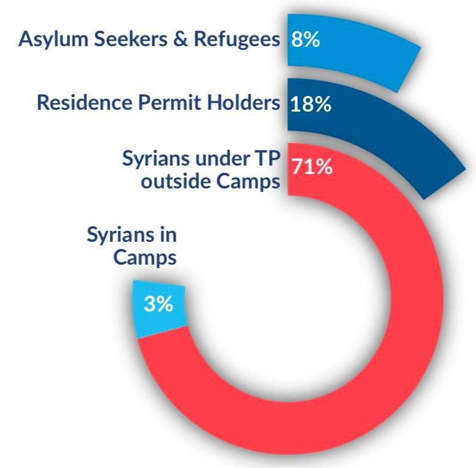
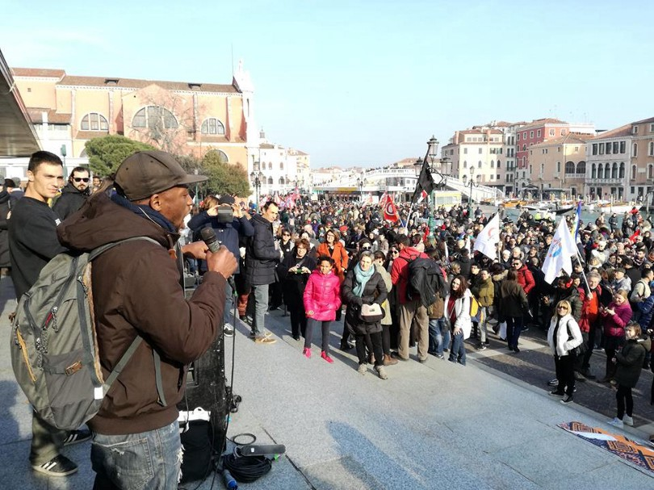

### الاْحتجاج على السياسات الأوروبية حول الحدود المغلقة
#### AYS Weekly News Summary in Arabic, February 4–10

](assets/a0dba044308/1*AroiquF51PfkBCE3xvS3FQ.jpeg)

Tarajal, Ceuta — Photo by [Watch the Med — Alarm Phone](https://www.facebook.com/watchthemed.alarmphone/photos/pcb.2310729352534628/2310718329202397/?type=3&theater)
### **سوريا**

بعد مضي ستة أسابيع على هطول الأمطار الغزيرة ، لا تزال مخيمات النازحين في محافظة إدلب تواجه ظروفاً معيشية كارثية\. لا يزال هناك نقص حاد في المساعدات الطبية والمواد الغذائية لتوزيعها\. وقد تمزقت الخيام أو غرقت في الوحل\. لمزيد من المعلومات من المرصد السوري لحقوق الإنسان [انظر هنا](http://www.syriahr.com/en/?p=115752&fbclid=IwAR2YGN1KyzLqXgeFKFD9NKaBoAdRqtZZOq02NftjQn-hVb8J_lW_nV0VH20) \.
### **ليبيا**

كانت هناك احتجاجات في سوق الخمص العاصمة بسبب إحباطاتهم تجاه المفوضية عندما قاموا على ما يبدو باستقبال ١٠ وافدين جدد للإخلاء\. واحتجز آخرون لمدة ١٠ أشهر ولم يتم تسجيلهم من قبل المفوضية\. تضمنت الاحتجاجات معظمهم من المراهقين ، لكن حوالي ٤٠ امرأة كانوا متورطين أيضً\.
### **المغرب**

في تحديث من جمعية \(ماروكيين\) — قسم الناظور:

> “أصبحت مآسي الهجرة أكثر شيوعا في الناظور بسبب الشبكات النشطة المتاجرة في الحرية في يوم الاثنين ، ٤ فبراير / شباط ، تسربت حافلة مهربة كانت تحمل المهاجرين إلى شاطئ سيدي حسين في تزازين وكان عدد القتلى ٣ ، و ٢ جريحا لا يزالون في مستشفى الناظور ، في حين أن ١٧ آخرين غادروا المستشفى بعد تلقي الرعاية اللازمة “\. 

### **تركيا**

وفقا للإدارة العامة التركية لإدارة الهجرة \(د\-ج\-م\-م\) ، يوجد الآن٤ ملايين شخص غير تركي يقيمون في تركيا ويبحثون عن الحماية الدولية — [انظر هنا](https://l.facebook.com/l.php?u=https%3A%2F%2Fbit.ly%2FTurkeyMPM_Jan2019%3Ffbclid%3DIwAR0L7YG7OE7LOUQNQ_ZuCcoQdVCIyzT7PE07Wa8ywhZrA_EbfwEZMT0czb8&h=AT3tyPWm6cMZg_ow8hzCQjBV3NTXe92nq8-7GKgO-M-q6cjyv189aYTIHbgj1uMoH795nOPihSefzegZlV6fYROzZWtxThK-MdFWL8nC-lCQpz6TP6VvVurMb3OEATJI8AiMwlQM_DqNKWN9J5hImKtjOGdem_uerUb3J26kRa2HmImmnDRgaXrxW84tV9RNjvR72M5RlapmxsQOLa2_9QUPDwezP0ebULVMJENGrWKRwlTpzarxtgWOqPXKVJAAtB9uaUSuuhU7iVC0eQ3hG3P0BTc4AVFW6FoQCDcTFJcK07clLs4cXqO3iv8t4Pd3Q302gkxnnrqRK9T9W1at4ufq0uF-HhU_mjVRCMG9Nd6AjNoap0e4m5X1RYEd_ViLFs9oXBtvQXr5Z2jUA6wcx7br4dxjf74KLe2LMjd6J1e-FUySWW46pApxxDX-S6SbnMy9IOZiA6qp7RW1YOKmdWr2IFlBU3ZwfJ9Z-8QyvUcAuaBR0ZVLIuKlq59yNSWU9rcWTlBt852jbBg_sdj8wV5U08fZog1YOSqKEd7B5iV0yL8BdeS7WlU9UVZJU90q9vwY3ZHO759XSLQ305Lq38S3Lt95JrsjjiLVm-WEXX0QLleyfR37BY5DmsCwFX6OUw) \.

### **الجزر اليونانية**

جاء تقرير بحر إيجة مع أحدث إحصاءات من الجزر لشهر يناير ، حيث أن هناك ١٥٨٩٠ شخص تقطعت بهم السبل في معسكرات غير إنسانية\. حتى الآن من هذا العام ، وصل ١٩٧٤ شخصًا إلى الجزر على متن القوارب المغادرة من تركيا\. تم إيقاف الكثير على هذا الطريق\.

لا يزال أكبر عدد من الوافدين مسجلًا في ليسفوس\.

■■■■■■■■■■■■■■ 
> **[RSA](https://twitter.com/rspaegean) @ Twitter Says:** 

> > Refugees in hotspot of Kos complain about the lack of medical and legal support but also the poor quality of the food. 
#opentheislands #stopthetoxicdeal https://t.co/bF19vZvZWz 

> **Tweeted at [2019-02-08 15:52:58](https://twitter.com/rspaegean/status/1093900501933002758).** 

■■■■■■■■■■■■■■ 

ومع ذلك ، لا تزال عمليات النقل إلى البر الرئيسي بطيئة للغاية\. ولكن وفقا للخطة ، سيتم السماح لنحو ٧٠٠٠ شخص بمغادرة الجزر بحلول نهاية مارس\. أين وكيف سيتم وضعها ، غير معروف حتى الآن\. ولكن ما يمكن ملاحظته هو أن بعض المخيمات القديمة تفتح أبوابها مرة أخرى في البر الرئيسي ، في حين أن البعض الآخر غالباً ما يكون مكتظاً ، أو أن الظروف المعيشية ليست قريبة من المستوى اللائق
### البوسنة والهرسك

أصدرت الحكومة المحلية في ولاية أونا سانا ، حيث تقع بيهاتش في البوسنة ، [إنذاراً نهائياً يطالب المؤسسات الحكومية بنقل المسؤولية عن المهاجرين واللاجئين من المنظمة الدولية للهجرة ، مما أدى إلى نقل حوالي ٥٠٠ شخص ، ممن هم حالياً في هذه المنطقة](ays-daily-digest-05-02-2019-local-authorities-in-bosnia-demand-state-institutions-to-lift-ioms-af159fce1ff8) ، في مكان آخر\.

السبب الرئيسي لهذا الطلب هو أنه لا يوجد سكن كاف لطالبي اللجوء\.

كما طالبوا بأن يتم نقل جميع العائلات التي لديها أطفال إلى فندق سابق ، سيدرا ، وإلى مخيم بوريتشي الذي تم تجديده ، حيث تكون ظروف المعيشة أفضل بكثير من مخيمات أخرى افتتحت في المصانع القديمة ميرال وبيرا\.

بعد تبرعات الاتحاد الأوروبي المخصصة للبوسنة لمساعدة عدد متزايد من الناس على التحرك في عام ٢٠١٨، تم تقديم جميع الأموال إلى المنظمة الدولية للهجرة ، ومفوضية الأمم المتحدة لشؤون اللاجئين واليونيسيف ، مما منحهم أيضا مسؤولية توفير سكن لائق وظروف المعيشة\. أكثر من٢٤٠٠٠ شخص دخلوا البوسنة في العام الماضي\. وجد معظمهم طريقهم إلى الاتحاد الأوروبي ، وعاد بعضهم إلى صربيا أو اليونان ، في حين أن أكثر من ٥٠٠٠ لا يزالون في البوسنة\. من أصل ٥٠٠٠، يوجد حوالي ٤٠٠٠ في كانتا صنعاء ، على حدود الاتحاد الأوروبي مباشرة\.
### **صربيا**

في نهاية عام ٢٠١٨، تلقت فتاة قاصر غير مصحوبة بذويها من بلد أفريقي اللجوء في صربيا\. كانت هذه هي المرة الأولى التي يمنح فيها اللجوء إلى قاصر غير مصحوبة بذويها في البلاد\. وقد خُدعت الفتاة الصغيرة ، ووعدت بأن تتاح لها الفرصة لإنهاء الدراسة ونقلها من بلدها إلى بلد مجاور لصربيا حيث دفعت بعنف إلى حلقة الدعارة\. على الرغم من أنها تمكنت من طلب الحماية ، فقد تم دفعها بشكل غير قانوني إلى صربيا ، حيث لم تدخل أو بقيت من قبل\.

تقول المفوضية السامية للأمم المتحدة لشؤون اللاجئين أن “عدد اللاجئين وطالبي اللجوء والمهاجرين الجدد المحتسبين في صربيا قد ارتفع بنسبة ١٤٪ إلى ٤٤٧٠ يوم ٣١ ديسمبر”\. كان ٣٦٪ من اللاجئين والمهاجرين المسجلين قاصرين\.

ما تلاحظه السلطات والمجموعات العاملة في هذا البلد منذ بداية هذا العام \(نفس الاتجاه مرئي في البوسنة\) ، هو زيادة في عدد الأطفال الذين يسافرون بمفردهم\.
### ايطاليا

بعد الضجة \(من درجة سالفيني في نوفمبر الماضي\) لاستهداف حقوق طالبي اللجوء من خلال إلغاء تصاريح الإقامة “للحماية الإنسانية”\.

](assets/a0dba044308/1*-kWuNuE3LGl7WXmyhp2EiA.jpeg)

photo by [Globalproject\.info](https://www.facebook.com/globalproject.info/photos/pcb.2204136009625024/2204132722958686/?type=3&theater)

البندقية
### **فرنسا**

لدى كامو بعض المقاطع المدمرة لوحشية الشرطة ضد المهاجرين الشباب في أويستراهم\. وكتبوا رسالة إلى المحكمة توضح الأحداث وتأمل في حماية كرامة الأولاد المعنيين\. اكتشف [المزيد هنا](https://www.facebook.com/CollectifAideMigrantsOuistreham/videos/796982820682361/?__xts__[0]=68.ARAf5ImPgStCD_VQTI_InlXHjUoo0oSYQOae_zXJMIlpwFjpNDHIEqpJgPH) \.
### **ألمانيا**

وتعتزم وزارة الداخلية الاتحادية اتخاذ تدابير تسمح بسحب تصاريح الإقامة المسموح بها لبعض طالبي اللجوء الذين أخفقوا في تقديم طلبات مزورة عن بلدهم الأصلي في محاولة للبقاء في البلد\.

ووفقاً لوكالة الأنباء \(ك\-ن\-ا\) ، ينص مشروع القانون على أن “أولئك الذين يمنعون ترحيلهم ، على سبيل المثال ، لأنهم يخدعون السلطات بشأن هويتهم أو جنسيتهم أو لا يتعاونون بشكل كافٍ في الحصول على بديل لجواز السفر ، قد لا يتم التسامح معهم في المستقبل”\.

**وقالت صحيفة فيلت إنه في مثل هذه الحالات ، ستأمر السلطات المهاجرين بالرحيل ، وسيتم استبعاد طالبي اللجوء الفاشلين من عروض الدمج وغيرها من تصاريح الإقامة في المستقبل**
### المملكة المتحدة

أصدرت لجنة حقوق الإنسان التابعة للبرلمان بيانا بالتوصية بنزع السلطة من وزارة الداخلية لإغلاق مهاجر في الحجز\. يوصي بأن يظل قرار الاعتقال مستقلاً\. انظر [هنا](https://www.freemovement.org.uk/take-power-to-lock-up-migrants-away-from-the-home-office-report-urges/?utm_source=rss&utm_medium=rss&utm_campaign=take-power-to-lock-up-migrants-away-from-the-home-office-report-urges) لمزيد من التوصيات الرئيسية\.

_Converted [Medium Post](https://medium.com/are-you-syrious/%D8%A7%D9%84%D8%A7%D9%92%D8%AD%D8%AA%D8%AC%D8%A7%D8%AC-%D8%B9%D9%84%D9%89-%D8%A7%D9%84%D8%B3%D9%8A%D8%A7%D8%B3%D8%A7%D8%AA-%D8%A7%D9%84%D8%A3%D9%88%D8%B1%D9%88%D8%A8%D9%8A%D8%A9-%D8%AD%D9%88%D9%84-%D8%A7%D9%84%D8%AD%D8%AF%D9%88%D8%AF-%D8%A7%D9%84%D9%85%D8%BA%D9%84%D9%82%D8%A9-a0dba044308) by [ZMediumToMarkdown](https://github.com/ZhgChgLi/ZMediumToMarkdown)._
