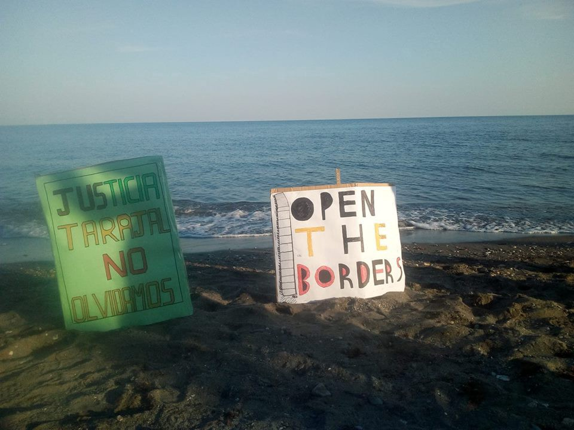
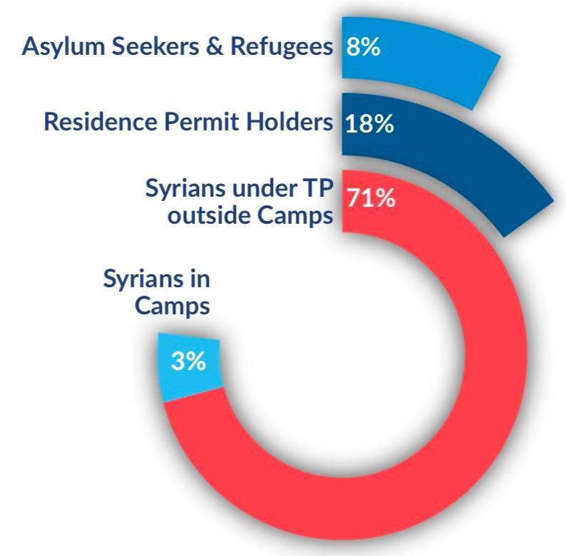

### تظاهرات برای مخالفت با سیاست بسته بودن مرزها
#### AYS Weekly News Summary in Persian, February 4–10

### سوریه

شش هفته پس از بارش باران سنگین ، کمپ های آوارگان در استان ادلب، هنوز با شرایط زندگیه فاجعه‌بار مواجه هستند \. کمبود شدید کمک‌های پزشکی و توزیع غذا همچنان وجود دارد \. چادرها از هم جدا شده‌اند و یا در گل فرورفته اند \. برای اطلاعات بیشتر از رصدخانه ی حقوق بشر سوریه، در اینجا کلیک کنید
### **لیبی**

امروز در خمس سوق خمیسه ، در ناامیدی به سمت یو\.ان که ظاهرا ً ۱۰ تن از تازه واردان را برای تخلیه به آنجا برده بودند ، اعتراضاتی صورت گرفت \. برخی دیگر به مدت ۱۰ ماه بازداشت شده‌اند و هنوز توسط یو\.ان ثبت‌نشده اند \. اغلب این اعتراض‌ها اغلب نوجوانان بودند ، اما حدود ۴۰ زن نیز در این اعتراضات شرکت داشتند

■■■■■■■■■■■■■■ 
> **[Sally Hayden](https://twitter.com/sallyhayd) @ Twitter Says:** 

> > Protest today in Khoms Souq al Khamise dc, after UNHCR apparently tried to take some recent arrivals for evacuation. Other detainees have been there 10 months already &amp; complained it’s unfair. (Deleted other tweet re shooting, it was a miscommunication) https://t.co/RuVBMzqTef 

> **Tweeted at [2019-02-07 14:29:32](https://twitter.com/sallyhayd/status/1093517120703528962).** 

■■■■■■■■■■■■■■ 

### **مراکش**

یک خبر از انجمن م\.د\.د\.ه — بخش نا\.در

> تراژدی‌های مهاجرت به دلیل شبکه‌های قاچاقچیان که در آزادیه کامل فعالیت میکنند ، در نا\.در رایج‌تر شده‌است 

دوشنبه ،۴ فوریه ،یک اتوبوس قاچاقچی حامل مهاجران را به ساحل سی\.دی در تازاگینا برد \. آخرین خبر نهایی، ۳ کشته ، ۲ مجروح هنوز در بیمارستان نا\.در بستری شده‌اند ، در حالی که ۱۷ تن دیگر پس از دریافت مراقبت‌های ضروری از بیمارستان خارج شدند

### **ترکیه**

به گفته اداره مدیریت مهاجرت ترکیه د\.ج\.م\.م ، اکنون ۴ میلیون نفر در ترکیه ساکن هستند که به دنبال دریافت پناهندگی هستند

### **جزایر یونانی**

گزارشی از ق\.ژ ، با آخرین آمار از جزایر ماه ژانویه منتشر شد که براساس آن ۱۵۹۸۰ نفر در اردوگاه‌های غیر انسانی گرفتار شده‌اند\. تا کنون ، سال ۱۹۷۴ افراد توسط قایق‌هایی که از ترکیه خارج می‌شوند به این جزایر آمده‌اند \. بسیاری دیگر در این مسیر متوقف شدند

بیش‌ترین تعداد مسافران هنوز در لیسووس ثبت شده‌است

■■■■■■■■■■■■■■ 
> **[RSA](https://twitter.com/rspaegean) @ Twitter Says:** 

> > Refugees in hotspot of Kos complain about the lack of medical and legal support but also the poor quality of the food. 
#opentheislands #stopthetoxicdeal https://t.co/bF19vZvZWz 

> **Tweeted at [2019-02-08 15:52:58](https://twitter.com/rspaegean/status/1093900501933002758).** 

■■■■■■■■■■■■■■ 

با این وجود ، نقل و انتقالات به سرزمین اصلی هنوز خیلی کند هستند \. اما طبق برنامه ، حدود ۷۰۰۰ نفر تا پایان ماه مارس اجازه خروج از این جزایر را خواهند داشت \. اینکه کجا و چگونه قرار خواهند گرفت ، هنوز نا معلوم است \. اما چیزی که دیده می‌شود این است که برخی از اردوگاه‌های قدیمی، دوباره در سرزمین اصلی باز می‌شوند ، در حالی که برخی دیگر اغلب شلوغ هستند ، یا شرایط زندگی حتی شایسته برای زندگی نیستند
### **صربستان**

در پایان سال گذشته , دختر کوچکی از یک کشور آفریقایی به صربستان پناهنده شد \. این نخستین بار بود که در این کشور پناهندگی اعطا شده است \. دختر جوان فریب خورد و قول داد که این فرصت را خواهد داشت که مدرسه را تمام کند و از سرزمین مادری خود به کشور همسایه صربستان که در آن به شدت به یک حلقه فحشا کشانده شده بود، منتقل شود \. اگرچه او به دنبال محافظت بود , به طور غیر قانونی به صربستان رفت , جایی که هرگز به آنجا وارد نشده بود

سازمان یو\.ان\. می‌گوید : تعداد پناهندگان جدید , پناهجویان و مهاجران در حال حاضر در صربستان به ۴۴۷۰ نفر تا سی و یک دسامبر افزایش‌یافته است \. بیش از ۳۶ درصد از پناهندگان ثبت‌نام‌شده، مهاجران خردسال بودند

آنچه که مقامات و گروه‌هایی که در این کشور کار می‌کنند، گزارش داده اند , از ابتدای امسال، همان روند قبلی در بوسنی قابل‌رویت است و افزایش شمار کودکانی که به تنهایی مهاجرت میکنند، رو به افزایش است
### **بوسنی** و هرزگوین

دولت، محلی در صنعا که در بوسنی واقع شده‌است، یک اولتیماتوم را صادر کرده است و خواستار آن شد که موسسات دولتی مسئولیت مهاجران و پناهندگان سازمان بین‌المللی مهاجرت را به عهده بگیرند

دلیل اصلیه این تقاضا، این است که اقامت کافی برای پناهجویان وجود ندارد

آن‌ها تهدید کردند که اگر این اتفاق در عرض چند روز آینده رخ ندهد , دولت محلی، قصد دارد تا چهارتا از کمپ‌ها را در این منطقه ببندد \. آن‌ها همچنین خواستار این شدند که همه خانواده‌هایی که کودک دارند، به یک هتل قدیمی نقل‌مکان کنند که در آن شرایط زندگی به طور قابل‌توجهی بهتر از دو اردوگاه دیگر است که در کارخانه‌های قدیمی در میرال و بیرا باز شده‌اند
### **ايتاليا**

پس از اعتراضاتی از سالوینی در ماه نوامبر برای هدف قرار دادن حقوق پناهندگان از طریق لغو مجوزهای اقامت کمک‌های انسان‌دوستانه ، اعتراضات روز پنج شنبه در ویچنزا برگزار شد

### **فرانسه**

کا\.مو\. برخی فیلم از خشونت پلیس علیه مهاجران جوان در را که مختل کرده‌است را پخش کرد \. آن‌ها نامه‌ای به دادگاه نوشتند که در آن وقایع را مشخص کرده و امیدوارند که از شان و منزلت افراد دخیل در این حادثه محافظت کنند \. اطلاعات بیشتری در اینجا پیدا کنید

### **آلمان**

وزارت داخله فدرال قصد دارد تدابیری را معرفی کند که اجازه خروج از مجوز اقامت چند پناهندگیه ناموفق را که ادعاهای جعلی در مورد کشور مبدا خود را در تلاش برای باقی ماندن در کشور مرتکب شده‌ را، مطرح کند

براساس گزارش خبرگزاری ک\.ن\.ا ، این لایحه می‌گوید : برای مثال آن‌هایی که از اخراج و دیپورت خود جلوگیری می‌کنند ، چرا که مقامات را در مورد هویت یا ملیت خود فریب می‌دهند یا به اندازه کافی در دستیابی به جایگزینی گذرنامه هم‌کاری نمی‌کنند ، ممکن است دیگر در آینده تحمل نشود

روزنامه ی ولت گفت، که در چنین مواردی مقامات به مهاجران دستور خواهند داد که خارج شوند و این پناهجویان از پیشنهادهای یکپارچه‌سازی و دیگر مجوزهای اقامت دیگر محروم خواهند شد
### **بریتانیا**

کمیته حقوق بشر پارلمان، بیانیه‌ای را با توصیه مبنی بر انتقال قدرت از دفتر مرکزی برای زندانی کردن یک مهاجر در بازداشت صادر کرده‌است \. توصیه این است که تصمیم برای بازداشت باید مستقل باقی بماند \. [برای توصیه‌های کلیدی بیشتر به این جا نگاهی بیندازید](https://www.freemovement.org.uk/take-power-to-lock-up-migrants-away-from-the-home-office-report-urges/?utm_source=rss&utm_medium=rss&utm_campaign=take-power-to-lock-up-migrants-away-from-the-home-office-report-urges)

_Converted [Medium Post](https://medium.com/are-you-syrious/%D8%AA%D8%B8%D8%A7%D9%87%D8%B1%D8%A7%D8%AA-%D8%A8%D8%B1%D8%A7%DB%8C-%D9%85%D8%AE%D8%A7%D9%84%D9%81%D8%AA-%D8%A8%D8%A7-%D8%B3%DB%8C%D8%A7%D8%B3%D8%AA-%D8%A8%D8%B3%D8%AA%D9%87-%D8%A8%D9%88%D8%AF%D9%86-%D9%85%D8%B1%D8%B2%D9%87%D8%A7-457758feea96) by [ZMediumToMarkdown](https://github.com/ZhgChgLi/ZMediumToMarkdown)._
