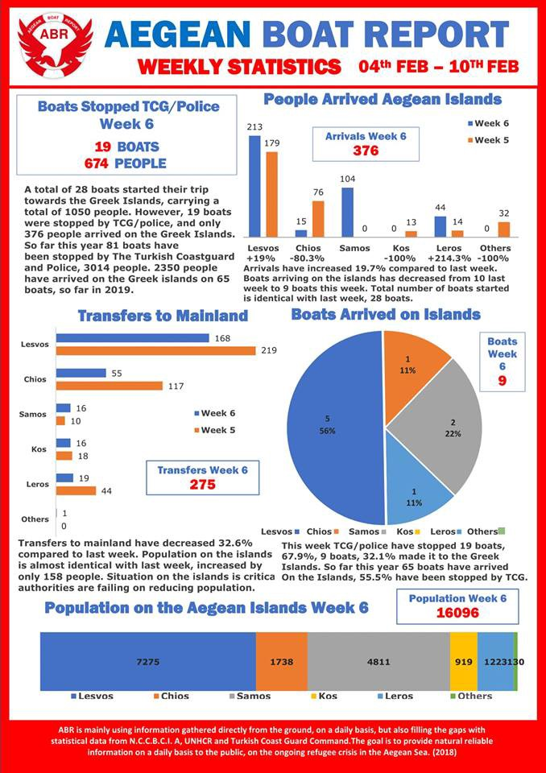

### AYS Daily Digest 12/2/2019 — Denmark: leaving human rights behind, one law at the time

[Are You Syrious?](https://medium.com/@AreYouSyrious)

Feb 13

One death in Libyan detention centre due to inaction of international organisations /// Moroccan authorities destroy Sub\-Saharan migrants’ shelters /// Deportation alerts from Germany and Austria /// New fences in Calais to prevent people from finding shelter /// “Commercial refoulements” in the central Mediterranean /// New Arrivals in Greece and Italy

 \)](assets/59a4679cb04c/1*wgYkSR46AJWWHiRoC65-fw.jpeg)

CLOSED BORDER — Algerian / Moroccan border, 1994 \(Photo by [Watch the Med — Alarm Phone](https://www.facebook.com/watchthemed.alarmphone/photos/a.1526182797655958/2311970032410560/?type=3&theater) \)
#### Feature story — Denmark: leaving human rights behind, one law at the time

In the last few years — and in the last months especially — Denmark has been drifting away from human rights protection, especially regarding asylum seekers\.

> “An increasing amount of complaints against Denmark are taken to the UN Human Rights Committees, and many end up voting against the Danish state\. Also, the European Court on Human Rights in Strasbourg has several times found Danish laws to be in breach of their articles\.” _\(from [Refugee\.dk](http://refugees.dk/en/focus/2019/february/the-massive-danish-discrimination/?fbclid=IwAR1WFNyoz9p8Q3yA6-YsrGRnvb6I57gDfzfNfwM-ZyKSgEXxPzPWMjQWqh8) \)_ 

In reaction to this, the Danish government and the Social Democratic Party are insisting on the right to discriminate, with calls to rewrite international conventions and diminish the power of human rights courts\. **In the preparation of new bills, the intention to violate certain human rights is explicitly mentioned\.**

An \(incomplete\) list of discriminatory legislation has been published by [Refugees\.dk](http://refugees.dk/en) , read it [HERE](http://refugees.dk/en/focus/2019/february/the-massive-danish-discrimination/?fbclid=IwAR1WFNyoz9p8Q3yA6-YsrGRnvb6I57gDfzfNfwM-ZyKSgEXxPzPWMjQWqh8) \(in English\) \.

Local media sources have been reporting on the story of Mohammed Anowar, an asylum seeker of the Rohingya minority in Myanmar\.

After having lived for 7 years in the northern European country, always in a state of bureaucratic limbo, he was told on Wednesday the 31st of January that his work permit had been withdrawn and that he had to move to the deportation centre in Kærshovedgård within 7 days\.

For the last 6 years, the Danish state has not been willing to recognise him as a refugee\. Danish authorities state he is from Bangladesh; Bangladesh states he is from Myanmar\. Myanmar does not recognise Rohingya people as citizens\. **The authorities have unsuccessfully tried to deport him to both Myanmar and Bangladesh\.**

Mohammed Anowar “didn’t seem to care about where Denmark will send him”, as long as he could get out of the Danish asylum system\.

> “Of course I want to go back\. All Rohingyas want to go back to Myanmar, so if the police can send me there, that will be fine\. If they can send me to Bangladesh, that’s fine too, but I’m not from Bangladesh”\. 

He has had to quit his job and leave his apartment\. Failure to present himself to Kærshovedgaard on time could have meant detention\. **But** **living in the deportation centre means not being allowed to work, volunteer, or receive any form of cash assistance** \. He will be able to use the centre’s canteen 3 times a day, and he will be required to return to the centre every night and report to the police 3 times a week\.

328 people have already fled Kærshovedgår centre, trying to reach other countries, to avoid being deported to their country of origin, local media [report](https://www.dr.dk/nyheder/regionale/midtvest/ahmad-reza-forsvandt-fra-kaershovedgaard-kirkeasyl-i-tyskland-giver-ny?fbclid=IwAR0qh86BkdxyJ8f0sLORM7LE8C8nnB3VbRPd7xyCkh71UxE_IMKOYCEGWgo) \. They are only a small percentage of the 3177 missing asylum seekers that the Danish authorities cannot find\.

One of them has recently contacted [volunteers in Denmark](https://www.facebook.com/deportedfromdenmark/posts/603369373459313) from the streets of Paris:

> He’s freezing, scared, hungry and deeply unhappy\. His safety as an unaccompanied minor in Denmark disappeared when he was questionably assessed 18\-years\-old and old enough for being sent back to Afghanistan, despite the fact that he is an orphan\! 

> He has now taken the escape to the street in Paris, where he stays freezing along with hundreds of other rejected young people from countries like Denmark and Norway\! 

> **Common to all of them is that they would rather freeze to death on the street in Paris than be sent to Afghanistan\.** 

TURKEY
#### Updates on the attacks in Esenyurt, Istanbul

As we [reported in our last Weekend Digest](ays-weekend-digest-9-10-02-2019-5-years-on-and-people-keep-dying-at-europes-borders-1a56fe429146) , clashes broke out in Esenyurt, Istanbul between Syrian refugees and Turkish people\. New local media [reports](https://www.demokrathaber.org/guncel/esenyurt-ta-suriyelilere-toplu-saldiri-4-yarali-h112912.html?fbclid=IwAR2MjfTTf4TcRMa2xIqV27aq8byei2n4rb4ptIdizMaI50QZr8uaSDYL2ZA) have suggested that Syrian workplaces have been the target of mass attacks by groups of Turkish people shouting “This is Turkey\.”

According to witnesses, at least 4 people were injured in a knife attack\. After the fight, 3 Syrians were arrested by riot police\.

LIBYA
#### Testimony from the slave trade in Libya

Kombini News published a video \(in French\) with the story of Alpha Kaba, from the Guinea Conakry, a radio journalist who was kidnapped by a Libyan militia and sold as a slave multiple times to work in plantations\. He speaks about his story and his escape from the Libyan hell through the dangerous Central Mediterranean crossing\.

#### Death of a young Eritrean man in detention centre

■■■■■■■■■■■■■■ 
> **[Sally Hayden](https://twitter.com/sallyhayd) @ Twitter Says:** 

> > From @[saracreta](https://twitter.com/saracreta): "This is happening in Al-Hamra Detention Center in Gheryan, about 80 Km south-west of the capital, Tripoli." #libya #refugees https://t.co/g1lBWFEFqr 

> **Tweeted at [2019-02-12 05:46:37](https://twitter.com/sallyhayd/status/1095197464297119744).** 

■■■■■■■■■■■■■■ 

The behaviour of [IOM \- UN Migration](https://medium.com/u/664cb26312d4) and [UN Refugee Agency](https://medium.com/u/75f2bdd89854) in Libya has too often been ambivalent, denouncing the situation in Libya and at the same time refusing to take any action\.

TUNISIA
#### People in reception centre told to leave because of new arrivals

Journalist Sally Hayden [report](https://twitter.com/sallyhayd/status/1095372756244402177?fbclid=IwAR3D1IiYtCEkQCysFUS35syaMDzpymmr6vrxp-tIA7UeKzBJVa_6PKrJ91E) s that some refugees have been paying between $600 and $800 to be smuggled from Libyan detention centres to Tunisia over the past few months\. Those who’ve been there for a while say that they are now being told to leave their accommodation to make space for new arrivals\. Hayden reports that they are frightened because it isn’t clear where they should move and whether they will be able to access any services\.

MOROCCO
#### Authorities destroys Sub\-Saharan migrants’ shelters in Nador region

 \)](assets/59a4679cb04c/1*DhRJfofYBp5qCNYmEJdUAQ.jpeg)

Shelter destroyed by authorities \(photo by [AMDH Nador](https://www.facebook.com/AmdhNador/photos/pcb.2272541622958100/2272541599624769/?type=3&theater) \)

[AMDH Nador report](https://www.facebook.com/AmdhNador/photos/pcb.2272541622958100/2272541599624769/?type=3&theater) that the authorities in Nador have destroyed the shelters of sub\-Saharan Migrants living in an unofficial camp in a forested area\. Many of the forest camps are already very empty as the inhabitants were recently arrested\.

_An inhumane obstinacy against men, women and children who live in very difficult forest conditions\._

SEA

While Italian authorities keep shouting about how they have curbed migration flows, and stopped people from endangering their lives by attempting to cross the Mediterranean, three boats left the Libyan coast in just one day\. The first, carrying 132 people, was intercepted by the Libyan coast guard, as we reported yesterday\. The second, with more than 100 people on board, was “rescued” by a cargo ship which returned them to Libya\.

[Alarm Phone report](https://www.facebook.com/watchthemed.alarmphone/photos/a.1526182797655958/2311970032410560/?type=3&theater) on the fate of 62 people on the third boat\. They too were returned to Libya by a merchant vessel\.

 \)](assets/59a4679cb04c/1*zQWNIsOPODrqp06myWxg-Q.jpeg)

Alarm Phone was called from the sea by survivors of a Mediterranean crossing while they were being returned illegally to Libya on a merchant vessel\. As so many others before, these 62 people were deceived by the crew and told they would be brought to Europe\. \( [Watch the Med — Alarm Phone](https://twitter.com/alarm_phone/status/1095372905771425792?fbclid=IwAR1i_JiUV-WwEXuBhCrvu-k2Gu57lWWKXX3sScoAouoOnjLBBPYzmZcP_Fw) \)

Alarm Phone have referred to this as ‘commercial refoulement\.’ Other groups such as Jugend Rettet are equally angered and saddened by the border policies and governments behind these manoeuvres and have discussed the case as a form of ‘push back’\.

**These practices, as we have stated many times before, are illegal under international and EU law\.**

Even [IOM \- UN Migration](https://medium.com/u/664cb26312d4) , who do occasionally also return people to unsafe countries, have [stated](https://twitter.com/fladig/status/1095327142102085632?fbclid=IwAR3upDl9PAfIyBJnHDKRYEB_SodVo6aEZqmSJYVXv-MY8QMk4IaYgOgGlB8) that:

> Migrants rescued in international waters should never be sent back to Libya, which is NOT a safe port\. 

Around 200 people had been returned to Libya in less than 24 hours, among them, a high number of pregnant women and children\. Where will these people give birth? Where will these children grow up? In detention, in Libya\.
#### 3 people rescued in the Canary Islands sea

Salvamento Marítimo has [rescued](https://twitter.com/EPCanarias/status/1095238717340635137?fbclid=IwAR1xYiB3LuhV6UY1wgP9pHkeObLG_NdYl3WejCL2zyHDg6AyW29ecaz4LOE) a boat south of Gran Canaria with three people aboard\.
#### Moonbird finally back in the sky

Humanitarian Pilots Initiative HPI [report](https://www.facebook.com/humanitarianpilotsinitiative/photos/a.1564914920480338/2004411946530631/?type=3&__xts__[0]=68.ARCP4KDWqDSkKGiik6Y9RhVq8rhsjhWnrUwxt_HYPYKiE4_H1cf59dH7L7dZQTP3ijMwMKm7xdV9OfptHWp__5avy6xRRH7SkndVHkOMSBX-ZfdMhcTkDNJpMADT5nBV--dpJTcFfniJgeGJiLpAtYc6wU11dLrZ8Ek0Qg-sm9kkpEb5z6TDjmOqz_twd1yP9ZQXHbKEuMkcoeISocMv0gpnAow2vZV4PCP3oeH3IwAOsJ9_h4Q84SJAu37rLGOe4VbTuSr7nbrJJbB1CY4B9_T--wvTcWjEzwfCDRoJXt5Io649kgERii5Djt7g9kcMjdx6RDYVOgVWkNBvNo-Gqqgphqnq&__tn__=-R&hc_location=ufi) that Moonbird is in the air again and already on the way to the Mediterranean after maintenance work\. But their partner Sea Watch 3 is still being held in the port of Catania for alleged “technical irregularities\.”

John Bayer, chairman of Sea Watch, states:

> Our task is to save people in distress and to bring them to a safe place as soon as possible\. With our ship, this place is available quickly from every position in the Mediterranean, and we are prepared for that\. It was the European governments who delayed the landing of rescued people too long, not us\. They force us to take people in for weeks, and then blamed us for not being a hotel\. 

CYPRUS
#### New Cyprus profile on the Statelessness Index

The [Cyprus Refugee Council](https://www.facebook.com/cyrefugeecouncil/posts/389559638275565) has launched a new country profile on Cyprus as part of the Statelessness INDEX in partnership with the European Network on Statelessness\. More info [here\.](https://index.statelessness.eu/country/cyprus?fbclid=IwAR2hyrMKoGEYlSwqKd65DZ4t9UE-MPaKj1tvEybyFJd_dWcF6HK7EJN85CU)

> A stateless person is someone who has no nationality\. Statelessness is a legal anomaly that affects over half a million people in Europe — both recent migrants and those who have lived in the same place for generations — denying many their \#fundamentalrights\. 

The Statelessness Index assesses how countries in Europe protect stateless people and what they are doing to prevent and reduce statelessness\.

GREECE
#### Arrivals

Figures from [Aegean Boat Report](https://www.facebook.com/AegeanBoatReport/photos/a.285312485325196/524080044781771/?type=3&theater) :

A boat was picked up by Frontex outside Korakas, Lesvos north, 21\.15, Tuesday evening, 25 people on\-board\. No breakdown available\.
#### Aegean Boat Report Weekly Statistics

Also UNHCR published their weekly statistics for the Greek Islands, which you can find [HERE](https://reliefweb.int/sites/reliefweb.int/files/resources/67936.pdf) \.
#### Flying Seagulls to visit Chios

> Information/advice needed\! [The Flying Seagull Project](https://www.facebook.com/flyingseagulls/) clowns will be coming back to visit Chios in April\. It’s been quite a while since we were last here so I need some up to date information on the situation/who is currently providing kids recreation activities and who would be willing to collaborate with us and have us visit\! 

> Anyone is very welcome to get in contact if you would like us to visit a place or can help us co\-ordinate shows and games outside of Vial\. You can contact me [HERE](https://www.facebook.com/groups/chiosrefugees/permalink/1243947499090947/?hc_location=ufi) or email isobel@theflyingseagullproject\.com 

MAINLAND

_Converted [Medium Post](https://medium.com/are-you-syrious/ays-daily-digest-12-2-2019-denmark-leaving-human-rights-behind-one-law-at-the-time-59a4679cb04c) by [ZMediumToMarkdown](https://github.com/ZhgChgLi/ZMediumToMarkdown)._
