### AYS SPECIAL: Another cruel winter in Paris

_As the refugee crisis in Paris continues further into its fifth year, there is no hope in sight that things might ever change\. Regardless of all the efforts placed by the grassroots association and small collectives, and in spite of all the promises given by authorities of Paris, things have not moved forward for refugees\. At this point, it is estimated that over two thousand of them are sleeping on the streets, families, and children among them\._

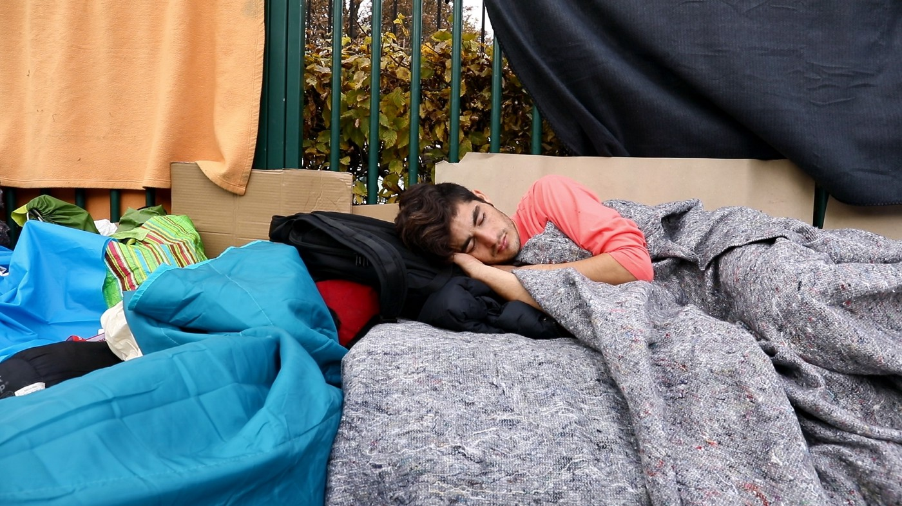

On the corners of the city, mostly on northern parts of Paris, close to the highway Périphérique \(or as you can see from this picture — at the bare end of it\), many refugees are building their improvised shelters\. Those places are infested by rats and covered with garbage, but they are rarely visited by the police or others, so forced evictions and confiscations of the tens are \(somewhat\) rarer there\.

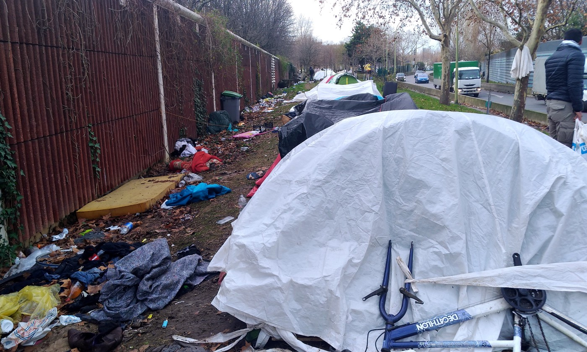

This winter will surely be remembered as the cruel one, one where most of the vulnerable — refugee children and their families, old and sick people are left outside in the cold\. Regardless of the efforts of many associations \( [_Utopia 56_](https://www.facebook.com/asso.utopia56/) _, Scarabée, [Paris d’exiles](https://www.facebook.com/parisexil/)_ and many others\) providing the temporary shelter for children and families has turned out to be an impossible task, so many of them were forced to stay in tents, that are installed only during the night on the narrow path in front of the shopping center\.

In the early morning hours, they are woken by the security guard and moved further, out of site\. Refugees are forced to be invisible and therefore irrelevant in the eyes of authorities and media\.

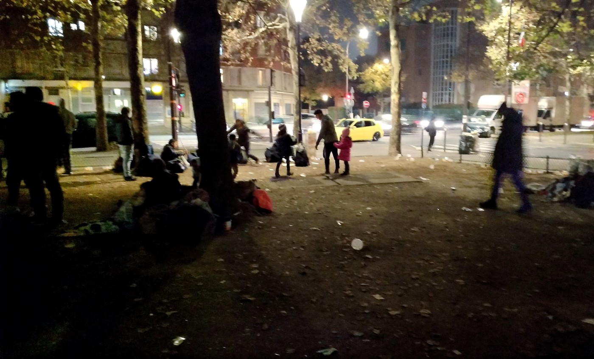

Park at Porte d’Aubervilliers is the gathering spot for many — refugees and volunteers alike, the most of the evening food distributions are organized there\. Utopia 56 is gathering families there as well, following their asylum application and providing with emergency housing \(if possible\) \. Their actions start in early evening hours: they meet with families, register new arrivals, take their names and contact\.

The real struggle starts when they try to place all of the vulnerable refugees in a safe place, within the solidarity housing system they have developed themselves\. Every evening, after establishing the number of the most vulnerable refugees in need of accommodation, they start arranging emergency accommodation with volunteers, so\-called _hébergeurs de solidarité\._ Refugees are passing hours in suspense, not knowing if they will find a shelter or stay on the street\.

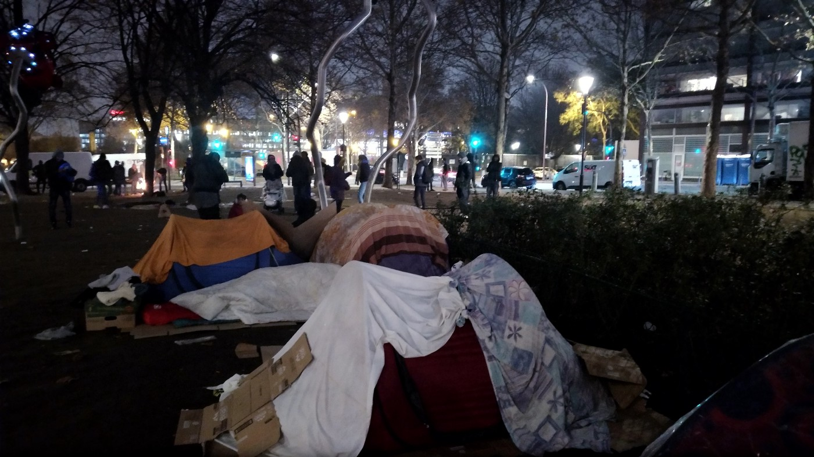

Z\. came from Afghanistan, together with her husband\. They are a young couple without any children, so their priority on the list for emergency housing is not very high\. For days they have been sleeping on the street, hoping for a change\. Unlike others, they have no tent, just an old mattress, and few blankets to keep them somewhat warm\.

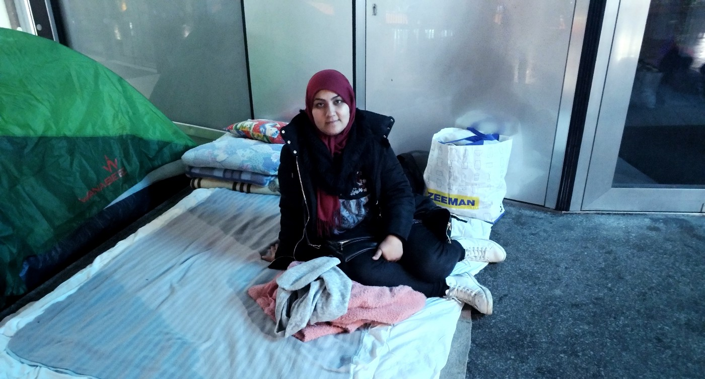

Hundreds of refugees sleep under the highway on _Porte de la Chapelle_ , not far away from the place where once stood a notorious official refugee camp, known as _La Bulle_ \. This area has become one of the most dangerous in Paris, avoided by far, but not because of the refugees and their miserable state\.

Isolated refugees, especially the underage ones, the ones that are dublined, or whose asylum application has been denied several times, have no hope of getting any kind of accommodation or help, and they are left to themselves\. The vulnerability of those people attracts many predators, drug dealers, gangs, criminals of all sorts, and their presence on the camp has shaped the lives of refugees into even more difficult one than it was\.

Some of them pose as humanitarians, volunteers and they manage to manipulate many of the refugees on the trough intimidations and spreading of false rumors, distancing them further from the community and pushing them deeper into isolation\.

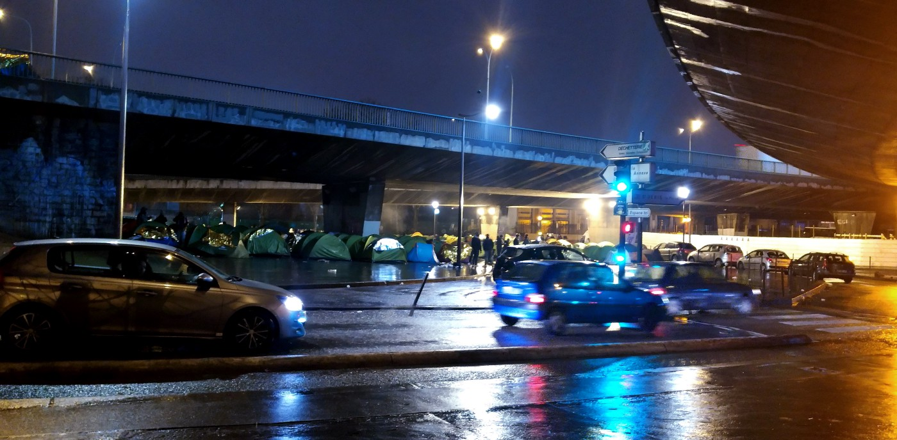

For the last few years, many of the grassroots associations and collectives have experienced the same problems — a violent, and extremely dangerous attacks, both verbal and physical from a group of problematic people, led by a person known as “Faty”\. We have all seen all sorts of people coming to the camps, trying to profit from someone’s misery, but so far this group has made the most out of it\. They are abusing the trust and humanity of certain people, taking on donations, money, and other goods intended for the refugees, and using them for their own needs\.

This has become through time their only source, the income they depend on, and they will stop at nothing to get as much as they can\. The greed for donations, money and lack of any scruples or morality has turned this group into dangerous criminals that constantly provoke violence and conflict endangering lives not only of other volunteers but refugees as well\.

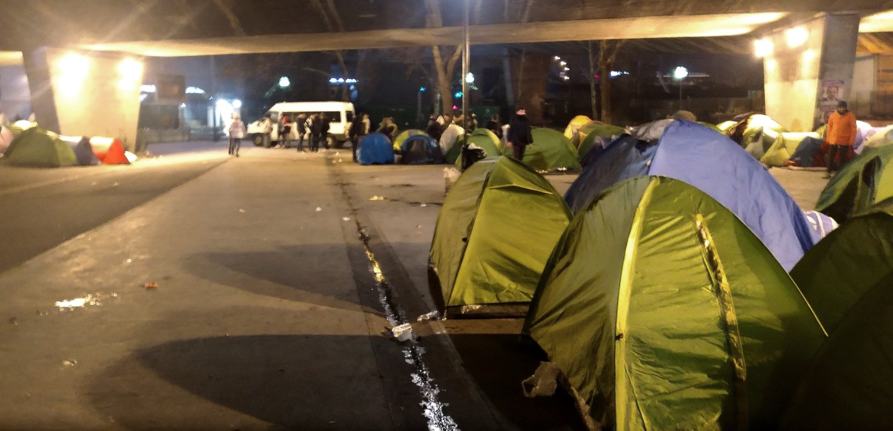

Isolated refugee minors, or M\.I\.E\. for short, are one of the most endangered among refugees in Paris\. The only institution that is appointed by the authorities is the branch office of Red Cross called DEMI, where the minors should apply to claim their asylum\.

The refusal rate of the ones who apply is extremely high — almost ninety percent of all the children who show up at the doors of DEMI are refused\. Many grassroots association are stepping in, and taking onto themselves the care and wellbeing of these children — [_Les midis du MIE_](https://www.facebook.com/lesmidisdumie/) _, Timmy, [Paris d’Exiles](https://www.facebook.com/parisexil/) , [SAJE](https://www.facebook.com/lesajeparis/)_ — are just some of them\.

Food, shelter, clothes, but also legal advice and moral support are provided for the isolated minors until they are acknowledged in the eyes of authorities as such\. But those associations are often taking a step further and organize classes, usually very much needed French lessons in the local libraries, visits to the museums, to the theatre plays, and other cultural events that Paris can offer\. _Cité des sciences et de l’industrie_ is one of the most popular places where isolated minors can spend the entire day, not only to shelter themselves from cold weather but to profit and enjoy in various programs this place can offer\.

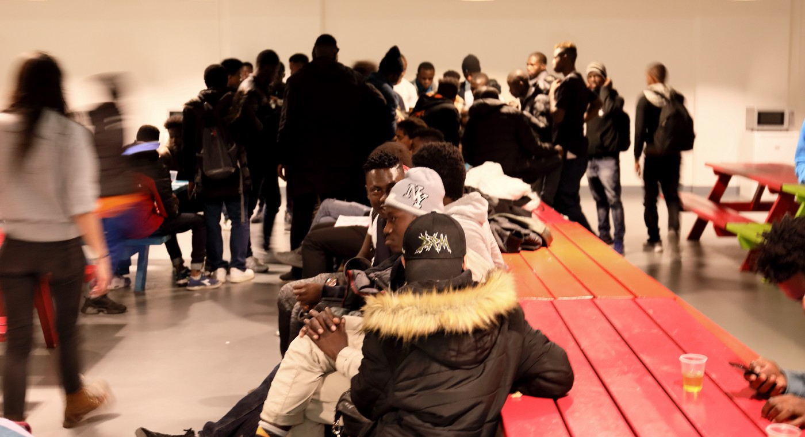

One of the most engaged persons on the ground, Esperance \(left\) has been present and engaged in refugee crisis for years, with her association [TIMMY](https://www.helloasso.com/associations/timmy-team-mineurs-exiles/collectes/10-euros-pour-un-toit/don) \. They are takin care of isolated refugee minors and at this point, they are housing through the network of volunteers so many of them\. Still, the most important part of their work would be a legal help that they are providing for the minors, who would be completely lost in the system without the guidance of this association and them alike\.

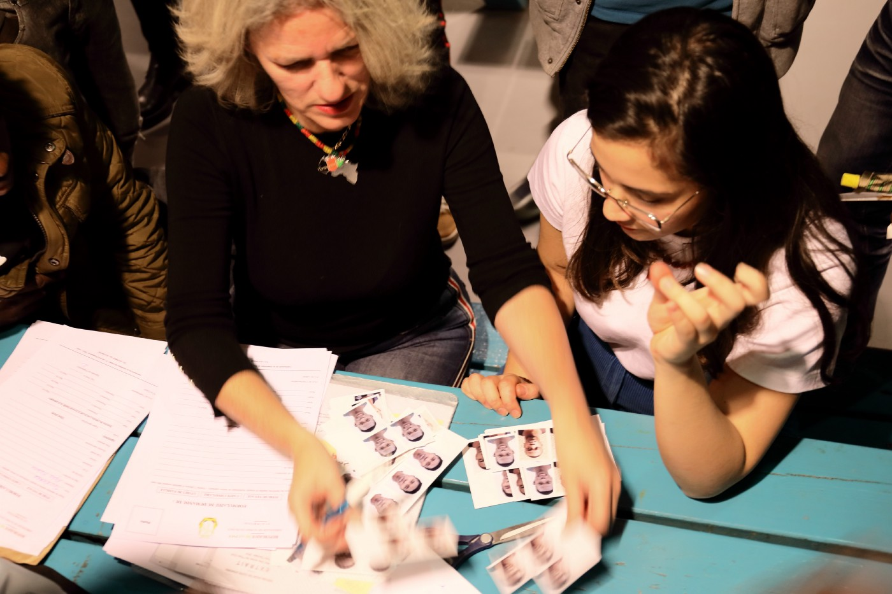

Women volunteers are very often submitted to violence and abuse, and very often they are ignored when they try to speak out\. Verbal and physical attacks, sexual harassment, mobbing, defamation, filming with intent to harm their image — those are just some forms of violence that many of them experience daily\.

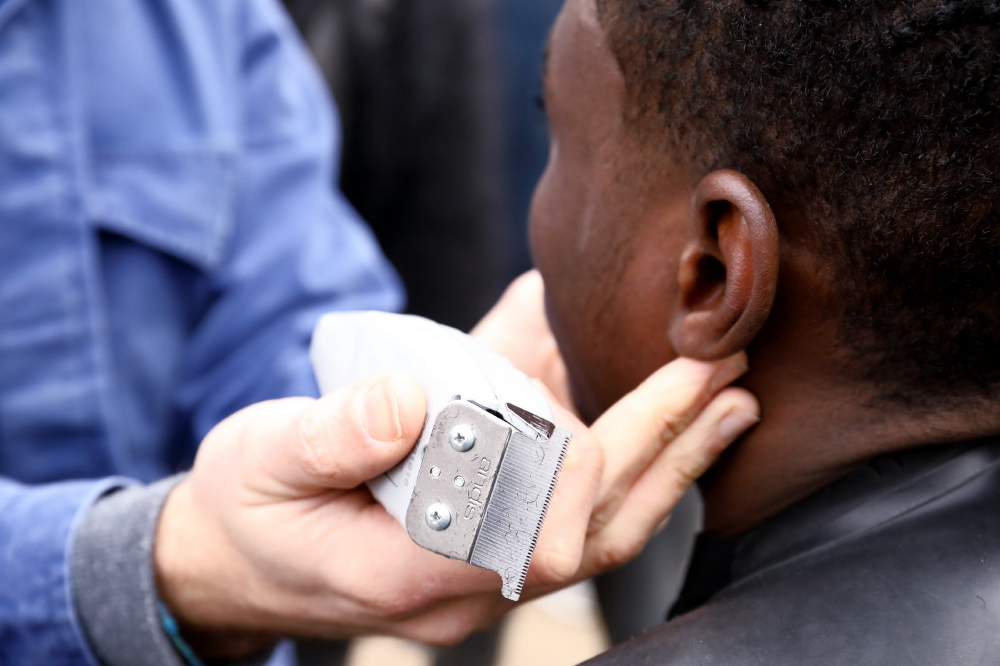

Julie Ward, MEP from Manchester, UK, is one of the fearless advocates for refugee rights\. She never misses the opportunity to speak out on refugee issues and to highlight the values of humanitarian work\. This winter, together with her staff, friends, and family, she managed to gather many donations — warm clothes and coats through the campaign “Coats for Calais”\. This is her, in the middle, visiting the camp close to _Porte d’Aubervilliers,_ with refugees from Eritrea\.

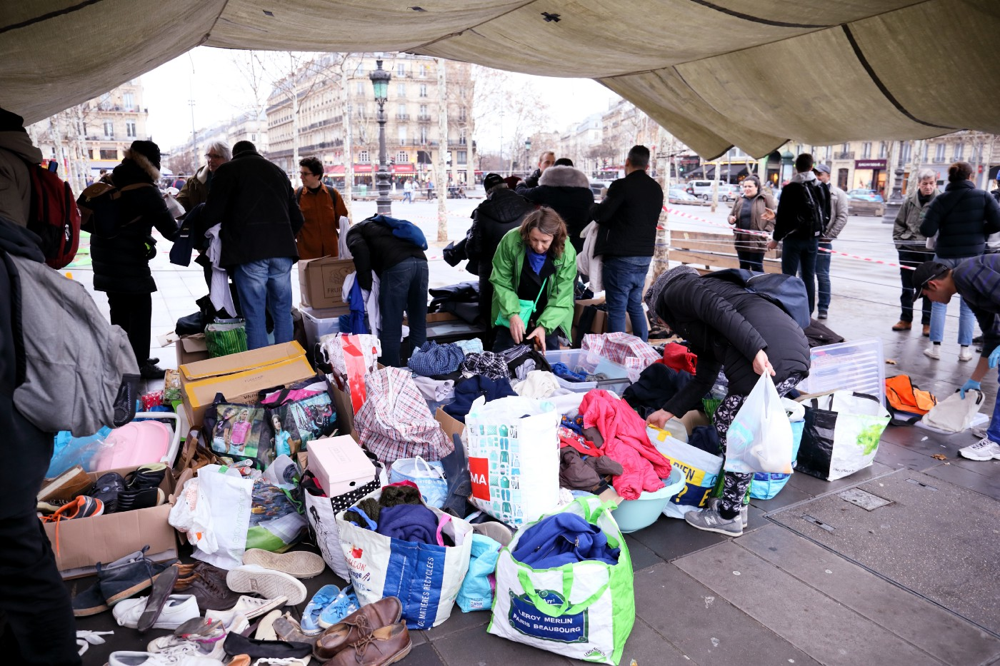

**_\(Paris report, Winter 2018 / 2019 by D\.M\. Jurisic\)_**

**We are an entirely volunteer\-run media team, and we rely on our supporters to share our news\. So please share, and never forget to ACT\!**

**We strive to echo correct news from the ground through collaboration and fairness\. Every effort has been made to credit organizations and individuals with regard to the supply of information, video, and photo material \(in cases where the source wanted to be accredited\) \. Please notify us regarding corrections\.**

**If there’s anything you want to share or comment, contact us through Facebook or write to: areyousyrious@gmail\.com**

_Converted [Medium Post](https://medium.com/are-you-syrious/ays-special-another-cruel-winter-in-paris-cee7460ef9ba) by [ZMediumToMarkdown](https://github.com/ZhgChgLi/ZMediumToMarkdown)._
