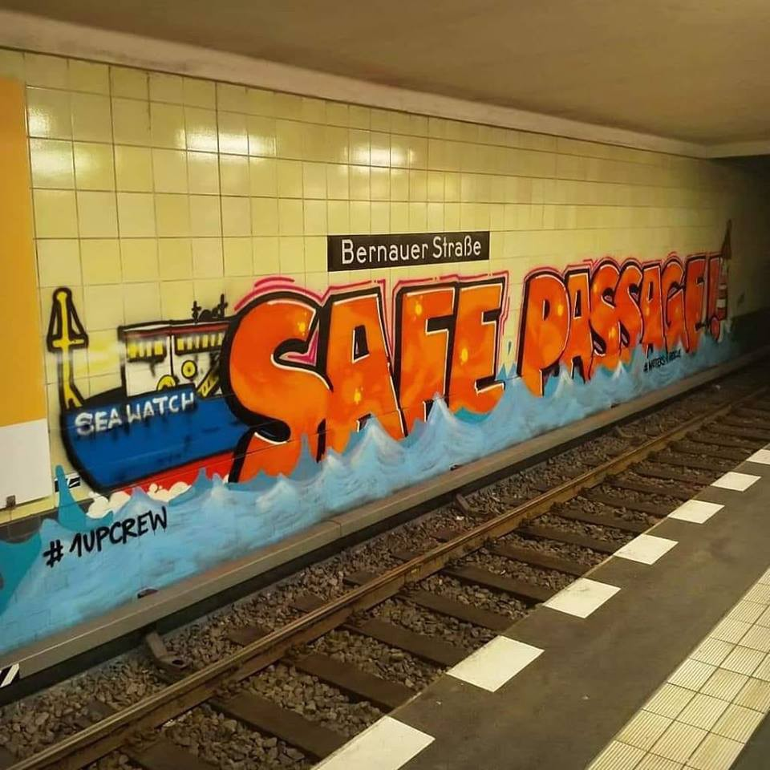

### AYS Daily Digest 14/02/2019: Italy rejecting the highest number of asylum applications in years
#### Another child lost his life in Syria//Volunteers needed in Lebanon//The Algerian\-Moroccan border is increasingly becoming a death trap//Cuts to budget for asylum seekers in Italy//Unbearable living conditions of asylum seekers denounced in France//Demos in Paris and in Frankfurt//Lists of on and offline services for newly arrived asylum seekers in Germany//News of another death in Ceuta\. \.

Credit: ZeeBrug — Zorg voor veilige havens
#### FEATURE

As stated by [Vie Di Fuga](http://viedifuga.org/richiedenti-asilo-ed-esiti-in-italia-2018-lanno-dei-record/) , in 2018, Italy examined a total number of 95,000 asylum requests, of which **2/3 \(around 60,000\) received a negative response\!** The majority of the applicants lodged their requests in 2017, as it can take up to 19 months for Italian authorities to examine the applications\.

In December 2018 alone, the negative responses reached 82% of the total applications of the month, meaning that four in five requests were rejected\!

This definitely represents a negative record for the country, as in 2016, for example, a smaller number of asylum applications were examined by Commissions \(91,102\), but with a different, lowest percentage of rejections, a total of 59% in the whole year\.

Humanitarian protection was granted to only 3% of the applicants in December \(around 200 people\), partly as an effect of the new Salvini decree, which entered into force at the end of the year\. A total percentage of 21% \(20,077\) represents the quota of people who received humanitarian protection in 2018\. To note that in 2017, the asylum seekers granted humanitarian protection represented 25% of the total decisions\.

The country has also reached the lowest number of asylum seekers and refugees registered within the system; in fact, at the end of 2018, only 135,858 people were reported being hosted in governmental centres\.

A drastic cut was also registered by the beneficiaries of subsidiary protection, 4% of the total decisions in 2018, against the 9% of 2017\.

The percentage of those who received asylum was stable in both years, around 8% of the applications\.

[Other sources](https://www.theguardian.com/world/2019/feb/14/italy-rejects-record-number-of-asylum-applications?fbclid=IwAR3tgQR_VVaQ42yDAqSkKnBx-YdSFY-rrcfHH3HO_BJP8-40b7OkuYFjhu4) also summarised the news from a different perspective, stating that 24,800 asylum applications in the last 4 months received a negative response\.

> More than 7,000 people have been refused so\-called “humanitarian protection” since October\. There were just 150 approvals in January, down from 2,091 in January 2018, leading to a sharp increase in the number of migrants with no legal status\. \[…\] 

> “According to our estimates, there could be more than 670,000 asylum seekers who will find themselves living irregularly in Italy, partly because the government does not have the capacity to deport them\.’’ 

For more information and data on arrivals in 2018 and 2019, please see [here](https://migration.iom.int/europe?type=arrivals) \.
#### SYRIA

News of more deaths are reaching us, as seven\-month\-old Abdul Majid Alaa al Qadi [died](http://sn4hr.org/sites/news/2019/02/14/death-infant-february-14-fire-broke-idps-camp-idlib-suburbs/?fbclid=IwAR3-Pp0oVYxG4MTtcBk-fe9IROV8Rdf_qUoDVVLfbKDWlNTs-9d1rj8McPE) of burns reported after a fire broke out in the tent where he was living with his family, caused by the heating system\.
#### LEBANON

ClimbAID is looking for volunteers to join their team\!

#### LIBYA

The corpses of three people were recovered around Sirte on Thursday\.

■■■■■■■■■■■■■■ 
> **[MSF Sea](https://twitter.com/MSF_Sea) @ Twitter Says:** 

> > After some 20+ bodies washed ashore near Sirte, #Libya last month, new reports indicate that the Libyan Red Crescent has now recovered another 3 bodies in the same area. 

#Italy and #EU policies have led to more suffering in the #Mediterranean, not less.

[bit.ly/2IdEoQ1](https://bit.ly/2IdEoQ1) 

> **Tweeted at [2019-02-15 07:03:02](https://twitter.com/msf_sea/status/1096303855749525504).** 

■■■■■■■■■■■■■■ 

#### MOROCCO

> Over the past two weeks, the Algerian\-Morrocan border between Oujda and Maghnia has shown its deadly face several times\. Travellers trying to reach Morocco via this border must not only cross fences, but first of all a ditch, which in winter is a death trap\. Soaked in water, 6 people froze to death in the last two weeks alone\. Their bodies have been recovered and they are at the Oujda morgue, some of them buried already\. One Malian, two Bangladeshi, one Ivorian and two Cameroonians have been identified\. Three bodies were also found on the Algerian side, and three other people were rescued at the last minute\. A Cameroonian woman with frozen legs is in the hospital in Oujda, and it’s not yet sure if her legs have to be amputated\. 

Meanwhile, attacks on migrants in Nadoor by the hand of the Moroccan authorities are constant, mainly consisting of violent raids and destruction of private properties\.

Last Friday, authorities set fire to the entrance of a cave, without making sure that all the people were outside; in fact an 11\-year\-old boy almost remained trapped inside the cave\.

#### SEA

Sea\-Eye needs your help and support\!

[](https://www.facebook.com/seaeyeorg/photos/a.732203640218869/1776604079112148/?type=3&eid=ARAx1PlYGKN2yDKpU-OYED1x3DGa42OKJlevQ6RK37BeFHK--m0jsdqWf6d_EjsuAlqXL9Tso0DfyJDT&__xts__[0]=68.ARBPECbspMlaKlXcibpn88zr1Z6k42QZMqkGlzNd_hOe_yAsGe8wUdTqpZEWdeLt9P_faAEQ8tINwkGntVBgysZ0fSkB8EIgTf0gUVg0U5cruKCAMR3CSewNwkGNDYe82rGlz32Ny5fTOB7zdtWCjpuPlgvg1t1q-qUv3ToKOOO8sPrX_4q9IehX8IYw9jUQRLHrcebWUeiA-DeOEZHLCgVep8-HQtNJ-VmR2oftR5X6-mFZjKgsaQ8s7516OIYxt4P_GYFNDK2A3AvtB0l7v4djmBEL6Jv-feznDhArvupMbVBlBIBLgzLEv_a4KGufdDNJWA5i02IksbvPZ4kWYGDyGw&__tn__=EHH-R)

#### BALKAN WEATHER REPORT for Friday 15/02

_MONTENEGRO —_ In the centre, lightly to moderately cloudy with sunny intervals\. In the north, predominately cloudy with weak snow from time to time, snowstorms locally\. Wind moderate to strong, with strong gusts, blowing from the north\. Lowest temperatures from \-5 to 7 and highest daily from \-4 to 14 degrees\.

_SERBIA —_ In the north, moderately cloudy with longer periods of sunshine\. In the centre and south, cloudy, locally with a variety of different precipitation which will cease in the afternoon and evening\. Wind weak to moderate from the north and northwest\. Lowest temperatures from \-1 to 3 and highest daily from 3 to 9 degrees\.

_BiH —_ Predominantly cloudy in Bosnia, before noon weak rain or sleet and in the higher regions weak snow\. In Herzegovina, predominantly clear, more cloudy in the north\. Wind weak to moderate from the north and northeast\. Lowest temperatures from \-1 to 4 and highest daily from 2 to 14 degrees\.

_CROATIA —_ Along the coast, predominantly sunny with locally moderate clouds from time to time\. Inland, moderately to predominantly cloudy with high chance of rain\. Wind weak to moderate from the northeast, locally strong\. Along the coast, moderate to strong Bura northern wind with stormy gusts\. Lowest temperatures from 3 to 8 and highest daily from 6 to 16 degrees\.
#### ITALY

Italy’s public prosecutor is investigating the death of 117 people who lost their lives on 19th January, after more than 8 hours at sea, because of Libya not responding to Rome’s MRCC calls\.

Neither the countries’ coastguards nor the commercial ships in the area reacted to the SOS calls and, unfortunately, Sea Watch 3 was too far away to reach the boat in distress on time\.

Only three people, out of 120, survived\.

Numerous cuts for asylum seekers’ expenses and for operators in centres are included in the new Salvini decree\.

In fact, as reported by [Redattore Sociale](http://www.redattoresociale.it/Notiziario/Articolo/620425/Accoglienza-nei-nuovi-bandi-21-euro-a-migrante-Via-psicologi-trasporti-tagliati?fbclid=IwAR1ospC_HKK4tdyWeaBAk2aVtXHT5GXecZHUQ2_2thC4S82xapCZgH1jx-E) , for every migrant hosted in reception centres with capacity of 50\+ places, a total of € 21\.35/day \(plus pocket money of € 2\.50\) will be granted by the State, against the € 35\.00/day that were granted in the previous years\.

Moreover, one operator will work with 50 people, meaning that one person will need to follow 50 people on distribution of goods, pocket money, legal assistance and cultural mediation, all with an extremely limited amount of time and budget\!

There are also cuts when it comes to means of transport\. People are now entitled to 12 annual journeys for a maximum of 30 km each\. It means that asylum seekers living in small towns will not be able to attend Italian classes in bigger centres; the new decree also stops smaller centres from creating and managing language classes on their own, inside the structure\.

No differentiation for vulnerable categories is included in the new decree; psychologists will not be present in reception facilities, but, curiously, will be maintained as support figures in pre\-deportation centres, where half of the people present have high chances of being sent back to their country of origin quite quickly\!

No specific chapter is established for families, education and recreation of children, as if they did not exist\.
#### FRANCE

_Paris_

On Sunday 3rd March, there will be a [demo](https://www.facebook.com/events/557087864699844/) for the closure of all the administrative reception centres \(CRA\) \.

French courses for beginners are availble\.

_Lille_

Utopia 56 has published a [video](https://www.facebook.com/utopia56lillecollecte/videos/vb.362916774049913/255574168689260/?type=2&theater) testifying the horrible living conditions of asylum seekers in Lille and the violation of their human dignity\.

We are all needed to change the situation by contacting and denouncing the authorities and making them accountable for their responsibilities and choices\!
#### GERMANY

InfoMigrants has published a comprehensive list of services available on and offline for newly arrived asylum seekers in Germany, in order to provide information on how to navigate the complicated system\.

The list includes links to organisations that work on immigration, arrival and integration services, including specific support offered to people on the move who are part of the LGBTQI\+ community and minors\. Language courses, dictionaries and self\-study courses are also listed in the article, but only in the form of online support and apps; work, legal counselling, housing possibilities, as well as \(mental\) health services and resources, including sexual health services and pregnancy and birth support are also encompassed in the article\.

Please, see the original source [here](https://www.infomigrants.net/en/post/15102/digital-support-and-integration-services-for-migrants-in-germany?fbclid=IwAR31OT0cURT9cDfeLxFqiPS5eg1jeBVohm24WvnI-3EcIbQBhmUScREHqSw) \.

On Monday 18th, the 21st collective deportation to Afghanistan will take place\. People will be deported back from Frankfurt\.

No Border Frankfurt and Afghan Refugees Movement are calling for a [protest](https://www.facebook.com/events/151992482360638/) on the same day at 18\.30 in solidarity with the people who are being taken back and to stop all deportations\!
#### SPAIN

A [15\-year\-old unaccompanied minor](https://elfarodeceuta.es/hallado-menor-muerto-puerto-ceuta/) from Morocco died of severe concussion, after being ran over by a truck in the port of Ceuta\.

The investigation is ongoing\.

**We are an entirely volunteer\-run media team, and we rely on our supporters to share our news\. So please share, and never forget to ACT\!**

**We also publish weekly summary digests in Persian and Arabic\.** 
**Please, read and share the ones for the week of February 4–10:** 
**in [Persian](%D8%AA%D8%B8%D8%A7%D9%87%D8%B1%D8%A7%D8%AA-%D8%A8%D8%B1%D8%A7%DB%8C-%D9%85%D8%AE%D8%A7%D9%84%D9%81%D8%AA-%D8%A8%D8%A7-%D8%B3%DB%8C%D8%A7%D8%B3%D8%AA-%D8%A8%D8%B3%D8%AA%D9%87-%D8%A8%D9%88%D8%AF%D9%86-%D9%85%D8%B1%D8%B2%D9%87%D8%A7-457758feea96) and in [Arabic](%D8%A7%D9%84%D8%A7%D9%92%D8%AD%D8%AA%D8%AC%D8%A7%D8%AC-%D8%B9%D9%84%D9%89-%D8%A7%D9%84%D8%B3%D9%8A%D8%A7%D8%B3%D8%A7%D8%AA-%D8%A7%D9%84%D8%A3%D9%88%D8%B1%D9%88%D8%A8%D9%8A%D8%A9-%D8%AD%D9%88%D9%84-%D8%A7%D9%84%D8%AD%D8%AF%D9%88%D8%AF-%D8%A7%D9%84%D9%85%D8%BA%D9%84%D9%82%D8%A9-a0dba044308) \.**

**We strive to echo correct news from the ground through collaboration and fairness\. Every effort has been made to credit organizations and individuals with regard to the supply of information, video, and photo material \(in cases where the source wanted to be accredited\) \. Please notify us regarding corrections\.**

**If there’s anything you want to share or comment, contact us through Facebook or write to: areyousyrious@gmail\.com**

_Converted [Medium Post](https://medium.com/are-you-syrious/ays-daily-digest-14-02-2019-italy-rejecting-the-highest-number-of-asylum-applications-in-years-929ad4fcc878) by [ZMediumToMarkdown](https://github.com/ZhgChgLi/ZMediumToMarkdown)._
