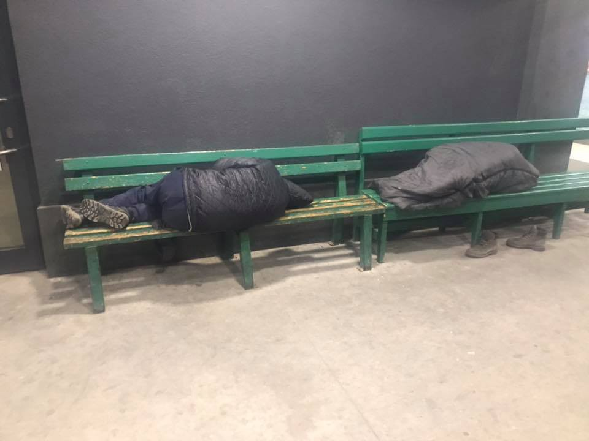
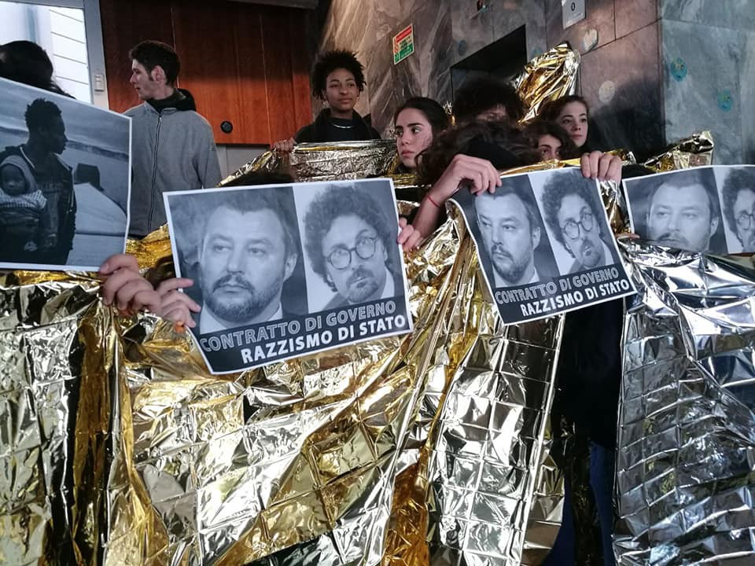
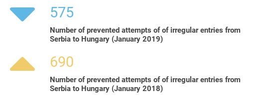
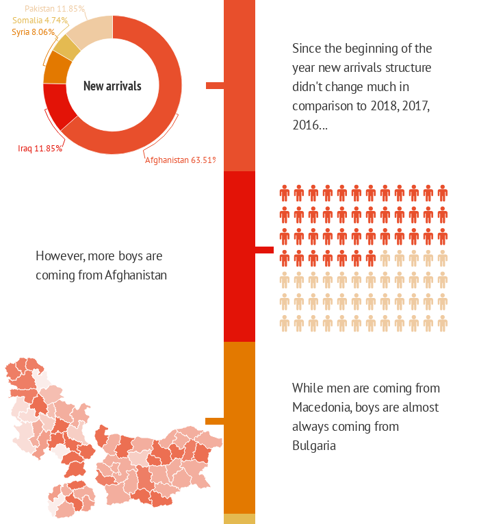
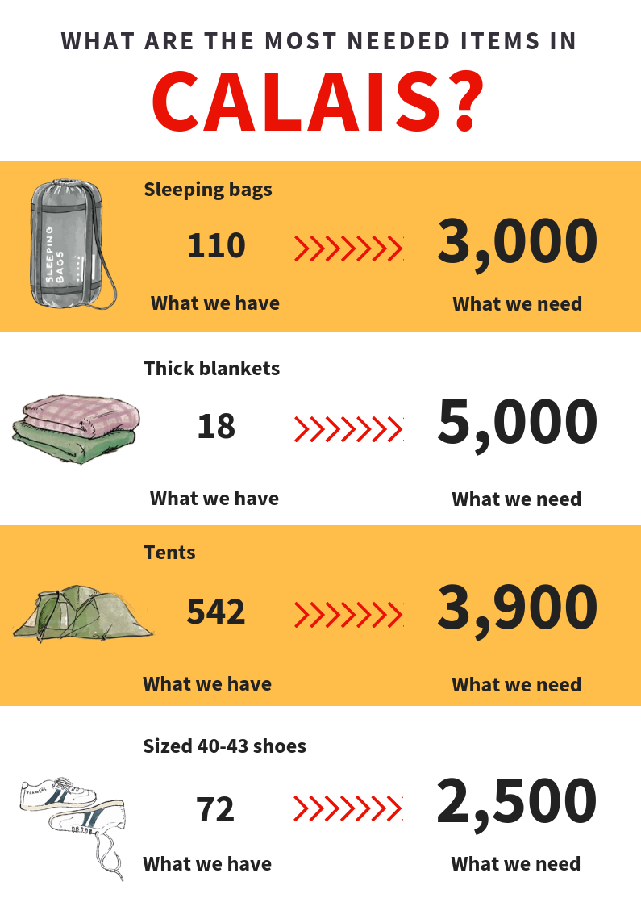

### AYS DAILY DIGEST 15/02/2019: Should we be afraid of the EU?

_Four girls, all minors, died this year while trying to reach Europe // In 2018 634,700 applied for international protection in the EU\+ countries // There are about 1\.5 million Syrian refugees in the country // Parents of a Mawda, girls shot by Belgium police last May, were finally granted permission to stay in the country_

 ‎](assets/54ca629f0216/1*BzEQipo5wHl7-gUHFzdW0A.jpeg)

By [Pothiti Kitromilidi](https://www.facebook.com/pothiti.kitromilidi?__tn__=%2Cd%2AF%2AF-R&eid=ARD_hLkwOTR2h53fOVGJGSrTc0D3Riu6Fqb8Z0Qo9bkCPlPhHuuKy4nc-AQkX-ZBF9yM2hM9djIN0u4G&tn-str=%2AF) ‎
### Feature

**217 people died in the Mediterranean this year\.** Among those who lost their lives while dreaming about freedom and a dignified life, were four girls — one was 9 years old, two were 16 and one 17 years\.

If the borders were open, these girls would not have been forced to take this dangerous journey across the sea in the winter\. Further more, if life in the countries where they are coming from was safe, they could stay at home, go to school, fall in love for the first time, go out with friends, laugh, play, plan a future… But, they only became numbers in [IOM’s dark statistics](https://www.iom.int/news/mediterranean-migrant-arrivals-reach-7510-2019-deaths-reach-217) \.

The same organization is reporting that **7,510 people entered Europe in 2019** \. Again, most of the arrivals were in Spain \(4,649 men, women and children\) \. In Greece, 2,513 people arrived by sea; all are now stuck on one of the islands, in overcrowded and degraded conditions\.

The International Red Cross reports that they have collected more than 300 requests from families looking for relatives potentially missing in various shipwrecks in the Aegean Sea since 2015\. Almost half of these cases \(45%\) concern children\.

In the meantime, more people are heading towards the Balkans and north of Europe\. Many will end up in Bosnia, trying to cross into Croatia and to continue further on\. Volunteers in Tuzla are reporting daily arrivals\. The same situation is in some other cities close to the border\. Existing camps in Bosnia are still not overcrowded, but if the number of arrivals continues to rise, there is a huge possibility that existing capacities will not be sufficient this spring\.

Bus station in Tuzla\.

Crossing into Croatia remains an issue: people are still facing violence from the border police, as well as extreme weather conditions\.

According to [data published by the European Asylum Support Office](https://www.easo.europa.eu/asylum-trends-overview-2018) , **last year 634,700 applied for international protection in the EU\+ countries** \. Out of this number, 34 per cent of people were granted protection in the first instance\.

Most of the people who seek protection came from Syria \(some 74 800 applications\), Afghanistan \(45 300\) and Iraq \(42 100\) \. On the list are also countries such as Pakistan, Iran, Nigeria, Turkey, Venezuela, Albania and Georgia\.

In their weekly comment, ESCI reminds that even last year many people who need protection were prevented from reaching safety and that people blocked en route to Europe are subject to horrific treatment\.

_“The approach is justified as a crackdown on irregular migration but in the absence of safe and legal routes to safety, refugees have to move in an “irregular” way \(it is not illegal to cross borders to seek protection and a majority of those who arrived during the crisis were refugees\) \. Those on the move for other reasons are still bearers of human rights and many leave quite desperate situations\.”_
### Lebanon

According to the Government of Lebanon, there are about 1\.5 million Syrian refugees in the country\. Many of them came back in 2011 when the war started\. However, living conditions and level of respect for human rights for many remains poor\.

[Vulnerability Assessment of Syrian Refugees 2018](https://reliefweb.int/sites/reliefweb.int/files/resources/67983.pdf) points out that in 2018, funding requirements for adequate support to Syrian refugees in Lebanon was estimated at US$ 2\.291 billion\. As of 30 September 2018, those needs were only one third funded\.

Call for Volunteers

_“Want to share your love for climbing with some of the world’s most vulnerable children and youth? Applications for volunteering with ClimbAID’s A ROLLING ROCK project in Lebanon are now open for 2019\. We are looking for enthusiastic climbers, climbing instructors and anyone with a unique skill or trade to offer\.”_

Further information and the application form can be found [here](https://climbaid.org/volunteering-in-lebanon/) \.
### Greece

No Border Greece reports that a man from Syria tried to set himself on fire and wanted to commit suicide outside UNHCR Greece offices in Athens\. Police prevented him from doing this and took him to the nearest police station\.

A small memorial vigil will be held at the main square of Chios Town on Saturday night at 6 pm\. [See here](https://www.facebook.com/.../a.11949.../2030177673718073/...) for more details\.

_“We all are shocked about the tragedy that happened two days ago when a 9\-year\-old girl drowned trying cross from Turkey to Lesvos\. We will light some candles, listen to some words, have a minute of silence and member those lost at sea\.”_

Help is needed for Echo mobile library\. They travel in and around Athens\.

_“We currently visit 4 refugee camps and 4 community spaces, loaning about 80 books and distributing learning resources, running activities and having a chat with over 200 people each week\. “_

At the moment, they have enough funds to keep them going for a little over a month\. [Help if you can](https://www.chuffed.org/project/love-echo?fbclid=IwAR1g5HVDWpn-QX756DkP8eRchrT7aMQER-6hkfACozKtagFro5c_k_MOJ2U) \.
### Italy

A [group of activists](https://www.facebook.com/936750383201689/posts/1008407982702595?sfns=mo) occupied the Milanese headquarters of the ministry of infrastructure and transport as the reaction to “the management of ports and coast guard in sea rejections”\.

They occupied the entrance of the venue, but some activists reached the upper floor halls dropping some banners: **Mediterranean= Cemetery of Europe\.**
### Serbia

In the night between Thursday and Friday, the Hungarian authorities prevented 40 people from entering the country, and returned all the individuals to Serbia, Info Park Belgrade reports\.

Info Park

More statistics from Info Park

### Hungary

Hungarian Helsinki Committee reports that detained asylum seekers received food this afternoon for the first time in 6 and a half days\. \.’

■■■■■■■■■■■■■■ 
> **[HunHelsinkiCommittee](https://twitter.com/hhc_helsinki) @ Twitter Says:** 

> > Our clients received food this afternoon for the first time in 6 and a half days, thanks to the emergency order #Rule39 of the European Court of Human Rights.

Should the authorities restart the shameful and unlawful starvation in the transit zones, we'll again see them in court. 

> **Tweeted at [2019-02-14 15:32:42](https://twitter.com/hhc_helsinki/status/1096069729205264384).** 

■■■■■■■■■■■■■■ 

### Slovakia

The Global Detention Project has released an updated report on the use of immigration detention in Slovakia — “Punitive Conditions Paid for by the Detainees”\.

The report reminds that in 2015, Slovakia filed a lawsuit at the Court of Justice of the European Union challenging the EU’s mandatory relocation scheme, claiming that the designation of 802 people to Slovakia, was “nonsensical and technically impossible”\.

The report argues that the country’s “hostile attitude towards refugees is belied by the fact that Slovakia has been largely shielded from migration pressures because it is not located on the main migration routes into Western Europe”\.

In 2017, Slovakia registered 160 asylum applications which were the lowest number in the EU that year\. For more info, see [here](https://ecre.us1.list-manage.com/track/click?u=8e3ebd297b1510becc6d6d690&id=81b57f237a&e=c131869ccd) \.
### France

More help is needed in Calais\.

Please, if you have any spare items, help\. Organise a collection at home and either visit us in Calais or find a [drop off location near you](http://bit.ly/sleepingbagsfrance) \.
### Belgium

After almost a year, parents of a girls Mawda are granted permission to stay in Belgium\. Unfortunately, the permission is valid only for one year but is renewable\.

Mawda was killed in a police chase in May last year\. A police officer shot her\.

_“I only admit a humanitarian visa in exceptional circumstances and for very specific cases\. This family is eligible in all areas\. Mawda was shot in front of her parents and brother and died in their arms\. They are in exceptional circumstances a child lost, losing a child is the worst thing that can happen to a person, and the judicial investigation into who is liable is also ongoing,”_ says government representative [to the local media](https://www.vrt.be/vrtnws/nl/2019/02/16/familie-van-peuter-mawda-krijgt-een-humanitaire-regularisatie/?fbclid=IwAR0pu5rc9qyCPOMbJYn8HyRrswFYjjS6MZy5xzqHMusoZdzauquaKHzFLDc) \.

[Sign the petitio](http://www.youdontlockupachild.be/?utm_source=ECRE+Newsletters&utm_campaign=bbb14b75d0-EMAIL_CAMPAIGN_2019_02_15_11_24&utm_medium=email&utm_term=0_3ec9497afd-bbb14b75d0-422320969#splash) n against the detention of children

_“It is unacceptable that in Belgium, in 2018, children are exposed to the trauma’s that are caused by detention; alternatives do exist\. Sign this petition to ask the Belgian government to stop detaining children, and to enshrine in law a prohibition on child immigration detention”_
### Germany

Yesterday the news was spread in German networks that two men who had “voluntarily” returned to Syria have now disappeared within the Syrian prisons\.

This sheds light on the fact that the BAMF continues to encourage voluntary return to these countries with the REAG / GARP program, with travel allowances and so\-called start\-up aid\. In contrast, IOM has suspended the promotion of return operations to Syria as well as to Libya, Eritrea and Yemen due to the security situation in those countries\.

[The BAMF argues](https://www.asyl.net/…/berichte-ueber-verschwinden-syrisc…/…) that persons who have opted to voluntarily return should not be in a worse situation than people whose return is supported by IOM\. The return would happen in these cases in the person’s own responsibility and without the affected persons being “encouraged” in any way by German authorities\.

More deportations to Afghanistan have been announced, as well as corresponding protests\.

The German [government has responded t](https://kleineanfragen.de/bundestag/19/7401-erneute-berichte-ueber-polizeigewalt-im-zuge-von-dublin-sammelabschiebungen?utm_source=ECRE+Newsletters&utm_campaign=bbb14b75d0-EMAIL_CAMPAIGN_2019_02_15_11_24&utm_medium=email&utm_term=0_3ec9497afd-bbb14b75d0-422320969) o a parliamentary inquiry filed by MPs from Die Linke — the German leftist party\- concerning new reports on the use of police violence in collective deportation procedures\.

_“The inquiry referred to three particular instances of deportations implementing the Dublin III regulation between June and November 2018\. The refugee councils of Berlin and Lower Saxony provided testimonies that document police brutality, physical restraints, separation of families, humiliating treatment and the use of sedative medication\. In its response, the government provides data showing that in 2018 — until November — on 157 deportation flights people were physically restrained 300 times\. Deportations to Italy, Tunisia and Afghanistan show particularly frequent use of physical restraints\.”_

**We are an entirely volunteer\-run media team, and we rely on our supporters to share our news\. So please share, and never forget to ACT\!**

**We strive to echo correct news from the ground through collaboration and fairness\. Every effort has been made to credit organizations and individuals with regard to the supply of information, video, and photo material \(in cases where the source wanted to be accredited\) \. Please notify us regarding corrections\.**

**If there’s anything you want to share or comment, contact us through Facebook or write to: areyousyrious@gmail\.com**

_Converted [Medium Post](https://medium.com/are-you-syrious/ays-daily-digest-15-02-2019-should-we-be-afraid-of-the-eu-54ca629f0216) by [ZMediumToMarkdown](https://github.com/ZhgChgLi/ZMediumToMarkdown)._
