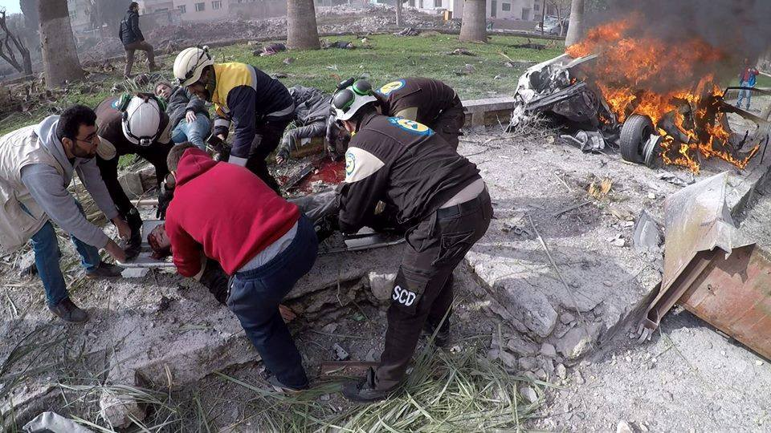
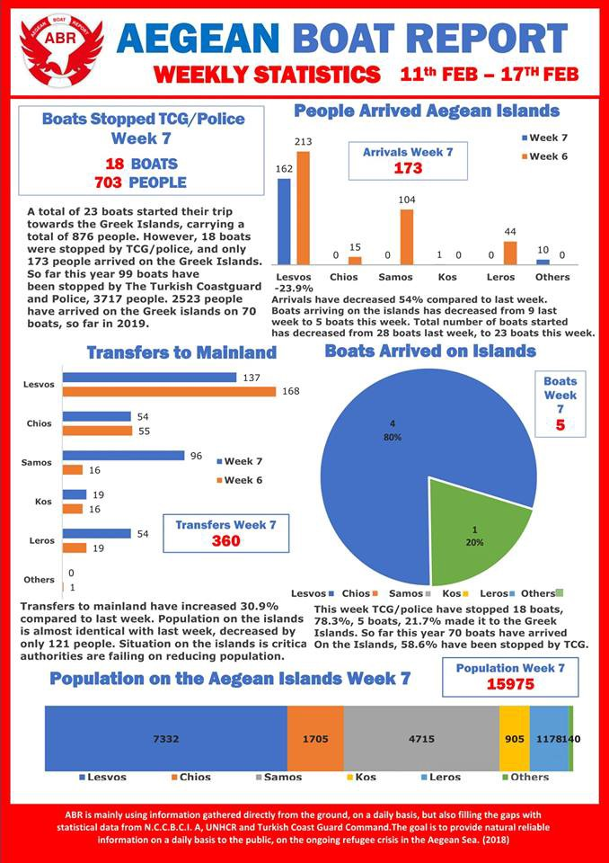

### AYS Daily Digest 18/2/19 Civilians targeted in Idlib, reasons to flee
#### _New arrivals in Greece / “the Cemetery of the Unknown” in Tunisia / bone examinations of asylum seeking children in France / prison time for deportation whistle blowers in Germany / more news…_

#### FEATURE

Another reminder of what too many people must flee from:

](assets/50690c4e4e34/1*LnjlgY1wn4pLY1Y3J_zSpQ.jpeg)

16 civilians were killed and 85 injured in Idlib City Monday afternoon\. The regime’s forces are targeting civilians\. Photo by [Syria Civil Defense — The White Helmets](https://www.facebook.com/SyriaCivilDef/posts/2289629898028072?__xts__[0]=68.ARBEJJuihGjWff9SOPXE3nWkWbRUTm15Xf_rMB-VrUW2zg-dhsfPaWkypQ6DFO5YfNdt452bdQoV9ZbcY5l3FJ1x-TJ7aXK0i27KZ2BjbqxO2BB3WaL_MgIjVjIUhQb8WyLfojg_31P6eZ2BU4yCOdniBb0s8JxEY2vTBSACdhqY4naHkc7Ns3wIETC3oQEkYvDTkCOMQBE1hreYDWhB1HB_Lyd8o64Hw9Ho5-hK_ycUgAM_DyFaYqaO620cZ1Wg4UxgVGEP3QGmmAXlfWWYv2kVQmH6-cVRRrw1gTmMTQmuo65jOHFqgDhIf0fFRUz7i6iAdwNccy6wbwn29tA-llZSySjM&__tn__=-R)

 \.” Photo by [Syria Civil Defense — The White Helmets](https://www.facebook.com/SyriaCivilDef/photos/a.1712251465765921/2289619814695747/?type=3&theater)](assets/50690c4e4e34/1*672p1izla3vm6CQMYa3b3g.jpeg)

“ A child has been killed after an attack by regime’s forces w/cluster bombs targeting Deir Al\-Sharqi village eastern of [\#Idlib](https://www.facebook.com/hashtag/idlib?epa=HASHTAG) \.” Photo by [Syria Civil Defense — The White Helmets](https://www.facebook.com/SyriaCivilDef/photos/a.1712251465765921/2289619814695747/?type=3&theater)

In response to suspected announcements of defeating the Daesh Caliphate expected by President Trump:

> What’s happening now in [\#Idlib](https://www.facebook.com/hashtag/idlib?source=feed_text&epa=HASHTAG) is a real war\. A rain of bombs is threatening the lives of millions\. If you think it is over, you are wrong — [Abdulkafi Alhamdo](https://www.facebook.com/permalink.php?story_fbid=917132478685906&id=100011674889464) teacher and activist 

#### TUNISIA

Alarm Phone has started a crowdfunding initiative to help “ the Cemetery of the Unknown” in Zarzis/Tunisia\. Chamesddine is a local fishmen who buries bodies that have washed up on shore in a dignified way because

> [“I can hear their souls crying\.”](https://www.facebook.com/watch/?v=324253488216395) 

Please find the crowdfunding [here](https://www.betterplace.org/en/projects/67701-crowdfunding-for-the-cemetery-of-the-unknown-in-zarzis-tunisia?fbclid=IwAR0e5827M8Tm8Uy2JGna75lpWqnxGu1zeGjd3miqLaRhUxof6sSDE2TNniU) to support this cause, bringing back some sense of final dignity\.
#### SEA

■■■■■■■■■■■■■■ 
> **[Charlie Yaxley](https://twitter.com/yaxle) @ Twitter Says:** 

> > The Alan Kurdi rescue boat is the last NGO boat conducting search and rescue operations on the central Med.

NGOs play a vital role in saving lives at sea. Already more than 200 people have died attempting to cross the Mediterranean in 2019. 

> **Tweeted at [2019-02-18 11:14:08](https://twitter.com/yaxle/status/1097454210080227329).** 

■■■■■■■■■■■■■■ 

#### GREECE
### Islands

Boats are again starting to make the dangerous trip to the islands\. 
[According to ABR:](https://www.facebook.com/AegeanBoatReport/posts/527496494440126?__xts__[0]=68.ARBdJR16Mtb3qK84tphbsWoyvf93pGmXXlMz962UIanpudmqQKYSK-5O6pm7SbvoypTtkLnrk5M6Vdjp3s5IyYYaiLDoTK3gF-79n3Zj8CBkhw1X4qYVX_0pevJA_hORgh-zkUJYKXaxSl2uzwPlmj_SqcyTHrmA5mNhQm4iPQVh9wYj0TX8RyZ7bMsa9knULiN8tsfxLWueC_F8fWr9hk9erMQZOJ3eQcAN4B1ODFwthq02gxsMPXjqhOOl7AbKEihE80_wVZjvkItuX-r9_KTJgmvYC6hN_-R88-sV6--SMhc_eR-OyFQseCOiIl0gm0-xq4jJw5f4C0ftHFNV2hM&__tn__=-R)

→Eight boats started the trip on Monday, with a total of 317 people

→Only five boats arrived, with 165 people

→Two [boats](https://www.facebook.com/AegeanBoatReport/photos/a.285312485325196/527369404452835/?type=3&theater) arrived on Samos with 103 people \( _First boat_ \- 60 people; 
_Second boat_ \- 43 people; no breakdown for both\)

→Three [boats](https://www.facebook.com/AegeanBoatReport/posts/527505057772603?__xts__[0]=68.ARAT6Cmmf9SiktcbvHetNloLZb8F7LLgx976UBssLLFxJldzEPjp2DGTX24_ZsBnbcujU3mt1gX307egqFuTOyjefbH80-5gUCD3-7XJoVENmDhs475wOPAjWqovgPVvj8mejinHlebbWCqKdupf9Ogue53oPnGzTy0cT3Nq2-U6QvyGLzyGq7qKsIzI2A8eUdN62guiJBg-UkbQpZkxFjTCGjwuDNVs79EMmlmZF8eW7lJWDIpxcq4HnBlRl8GZE24hgTHH9dljQMMek5EejaeFAzU4wzkG8xiDdAs8cBwV2KVeeLewgw6LSS6yedSVKUbXg1pDca3OMJ252y5R2GE&__tn__=-R) arrived on Lesvos, with 62 people \( _First boat_ \- 5 people and no breakdown; _Second boat_ 27 people with 11 children, 6 women, and 10 men; _Third boat_ \- 30 people and no breakdown\)

→ Which means **152 people were arrested** by the Turkish Coastguard

FEOX rescue team on Chios needs help supporting their accommodation house which is currently helping a young woman with thyroid cancer\. Find out more [here](https://www.facebook.com/permalink.php?story_fbid=2319884028296229&id=1584119558539350&__xts__[0]=68.ARD8I_uDRrE1aHsAGtUmqHrZvHuJGzzb2iAt2hv3ooEz6Brm-T6GuxGK9hzNiQhjBvHD0BlAr-TQFq3TxqhA6DJuz7xcALsJ5QlMY4_su5ug3dGvW19FurRl-5zGsnl_TiGzPeyIafD7YB1q0f-c0GtQ8B6YS23mM5Sobv_MHheMtkXgv8p8MmlukYfVflqlDFXVUQBofGklzeArLeFMXRJrVuLCWn33QhdUc-JZeA3IO0DrdP3jgKdM3kswa1oVLpiSQalN5s1oR-ZN2WCIv8o_WxpF7ItmG8zeLkhUgp4JTp1jxrw2oJb23Herv9ERKphBWjWhXhYnUIF4-IRLhNgvQhRF&__tn__=-R) \.

Stand Up for Refugees desperately needs a translator for English/French who can finance themselves in the hospital on Samos\. Learn more [here](https://www.facebook.com/sufr.ch/posts/2312233655763718) \.

](assets/50690c4e4e34/1*YN1MxKFB40Sne6obOp-LNw.jpeg)

Hoping to deal with trauma in an appropriate and safe way\. MSF psychologists helping children express their thoughts\. Photo by [MSF Sea](https://twitter.com/MSF_Sea/status/1097505351468048384?fbclid=IwAR2CwYD4-LTYhe6CpSOLDYSiGJyu--LCtKQNLUznhEXuxurAwEVdek31RaM)
### Athens

A few days ago a Nigerian man was murdered in Omonia by the Greek police\. His name was Ebuka and he was the father of two children, including a newborn baby\. [The United African Women Organization](https://www.facebook.com/UnitedAfricanWomenGr/posts/2263734676990256?__xts__[0]=68.ARDil_ZlopRdplJaundh8PjKb5oJMwYk11_l5NgB3GQCKhb1ymdRNe_UCOSfcrXLjOp81t8Sl-rIzZDsYKz5UlK6d6Bk_ox6Hv4Y-93voU0rMeU__558psL3uOG-fqGsK9EML-f743EZk_sLNlkcB0B97RqOm-WMEng5ULiEFsVyX_lAzXyQZSdcXxz1DoFV9ERby6oA0G52RgIpsCKDu2F_eg3o4pzQq9bI_gxTF-hSQGHL3zodax4h1WhTPP441MNx_kSZXX0gBB6BY-_j4-v8rF8HmqbB2r6FeuspW6NSwhT8MFJ7qqxpDOZOgTc-ntOTxjJ-3dkeI2i3czAKmwymiw&__tn__=-R) in Greece demands justice and states that police brutality against Africans in Greece is all too common\.
#### WEATHER FORECAST FOR THE BALKANS, Feb 19

MONTENEGRO

Predominantly sunny and relatively warm for this time of the year\. Fog during the morning in the basins in the north\. Weak to moderate wind from changing directions\. Lowest temperatures from \-5 to 6 and highest during the day from 7 to 18 degrees\.

SERBIA
 
Light frost and fog in the morning\. During the day predominantly sunny\. Weak to moderate wind blowing from the southeast and turning northwestern in the course of the night\. Lowest temperatures from \-5 to 3 and highest during the day from 12 to 16 degrees\.

BiH

Predominantly sunny, moderately cloudy in the course of the afternoon\. Fog during the morning in the northern basins\. Weak to moderate wind from changing directions\. Lowest temperatures from \-6 to 6 and highest during the day from 6 to 18 degrees\.

CROATIA

Predominantly sunny with the possibility of short periods of fog\. Inland, increasingly more cloudy from the north\. Mostly weak wind and along the coast a weak to moderate wind blowing from the northwest\. Lowest temperatures from \-3 to 8 and highest during the day from 11 to 15 degrees\.
#### BOSNIA AND HERZEGOVINA

](assets/50690c4e4e34/1*sADbSFdswpMJIAcN1BaTHA.jpeg)

“Entrance to the city of Bihac…why can’t institutions in charge at least prevent such scenes?” Photo by [UskDanas](https://www.facebook.com/UskDanas/posts/1031498683714794?__xts__[0]=68.ARCgsE421mCFXHst8X3q1y6FVdAzdu4uUKCWZkfWQ78KVVPOBf8_fDHJmYHmbIN6EYhmRATDAI0kMP-pfej24hyMy8VgUUASXhiO_ycFC1rPY0d4l21zrmi0F417aPCiFDWN5pMamv7rR-7fUnZKzdZ-O5ZJ2SLf6vVgJrYi1DqJlAgIMkKq4h6FdkZJpwtSlmx4K6_ZIpYquTalrjDWIoPF2t-wpyyh3U04JOHNvCuJMVJOCkTExxp1DcE7bEXrkTxmWfXBfEBncTK6jPR0o3hUEZpIarrrrk0k08PrcBll1rkEuNJ_DWL5xe8tXNV_0lzne3XThiIOvwk-uGDu6elreA8xzgf_p2Srg4DKWxKKKkmAwUmE4cao52-BHeSp1f5v8dPdNz3Bje--g0xOhFx_OXrAk250Btm6P3_IQaNpisI&__tn__=-R)
#### GERMANY

A new bill from the far\-right Horst Seehofer \(Federal Minister of the Interior, Building and Homeland\) could punish anyone who leaks information about deportation flights from Germany with up to three years in prison\. Find out more [here](https://www.facebook.com/groups/287056371797292/permalink/553356605167266/) \.
#### FRANCE
### Constant struggles with the age examnations

Lawyers without Borders is strongly urging the Constitutional Council to understand how bone examinations of asylum seeking children to determine age is fundamentally against the rights of the child, as we have already reported in our news earlier this year\. 
The Constitutional Council will consider the issue on March 14th\. Find out more [here](http://www.anafe.org/spip.php?article519&fbclid=IwAR1DBSnrFoly9ACMg1Q4UPsB3OJ8Cam9wbVOqVehHTQWf2i-byqD41LVL3Q) \.
### Paris

Solidarithé is looking for volunteers in Paris\! They need people to help with ground support for refugees forced to live in the streets\. Find out more [here](https://www.facebook.com/solidarithe/photos/a.1758358921148889/2203979433253500/?type=3&theater) \.

Want a detailed depiction for Paris, 2019? Look [here](https://www.facebook.com/permalink.php?story_fbid=1081266005407504&id=598228360377940&__xts__[0]=68.ARCG5yToBlbC9NVSL1BiJnq98uPM_pefYnrfJj-OgG9lmJtdENZVUJBsMErA_jDy8A-GHOXmZJPeR_YmIj2OzKE47PDc6qDXnTFnvD3blCKEDvdfdAhPf-wBeTHE76lvE5uuBfr-2PV-90e7GZ3PFd4EkM6tCcer5SH7Koz4DtTAvbioLzzIsFBY_SlHQb8tOd0vpjCF5wIG5V7oiiBbzwoOI6Wv2GnekNlZ5Pst9noB7QDR-MXNb_ZU4J3MV4jNV9yWRM7KYxne3A7_1pfj_g5CKfVMiwtSWbScyLcQijsJQuYRVH8LhVBebTB74491GRW85gns98asmTHtG9WXS9P0nw&__tn__=-R) \.
#### GENERAL

No Name Kitchen has provided an update on the Solidarity Routes’ last meeting, saying:

> “We want to highlight one of the events which was very special for many of us: the 6th March for Dignity in Ceuta, demanding justice for the 14 migrants who died in El Tarajal\.” 

> “It does not matter how you look at it: push\-backs are illegal” 

Find out more [here](https://www.facebook.com/NoNameKitchenBelgrade/posts/673154146416206) \.

**We are an entirely volunteer\-run media team, and we rely on our supporters to share our news\. So please share, and never forget to ACT\!**

**We also publish weekly summary digests in Persian and Arabic\.** 
**Please, read and share the ones for the week of February 11–17:** 
**in [Persian](%D8%A8%D8%AF%D8%AA%D8%B1-%D8%B4%D8%AF%D9%86-%D8%B4%D8%B1%D8%A7%DB%8C%D8%B7-%D8%AF%D8%B1-%D9%85%D8%B1%D8%B2%D9%87%D8%A7%DB%8C-%D8%A7%D8%B1%D9%88%D9%BE%D8%A7-c1dbe5f6479c) and in [Arabic](%D8%A7%D9%84%D8%B8%D8%B1%D9%88%D9%81-%D8%AA%D8%B2%D8%AF%D8%A7%D8%AF-%D8%B3%D9%88%D8%A1%D9%8B-%D8%B9%D9%84%D9%89-%D8%AD%D8%AF%D9%88%D8%AF-%D8%A7%D9%84%D8%A7%D8%AA%D8%AD%D8%A7%D8%AF-%D8%A7%D9%84%D8%A3%D9%88%D8%B1%D9%88%D8%A8%D9%8A-9121e6961516) \.**

**We strive to echo correct news from the ground through collaboration and fairness\.**

**Every effort has been made to credit organizations and individuals with regard to the supply of information, video, and photo material \(in cases where the source wanted to be accredited\) \. Please notify us regarding corrections\.**

**If there’s anything you want to share or comment, contact us through Facebook or write to: areyousyrious@gmail\.com**

_Converted [Medium Post](https://medium.com/are-you-syrious/ays-daily-digest-18-2-19-civilians-targeted-in-idlib-reasons-to-flee-50690c4e4e34) by [ZMediumToMarkdown](https://github.com/ZhgChgLi/ZMediumToMarkdown)._
