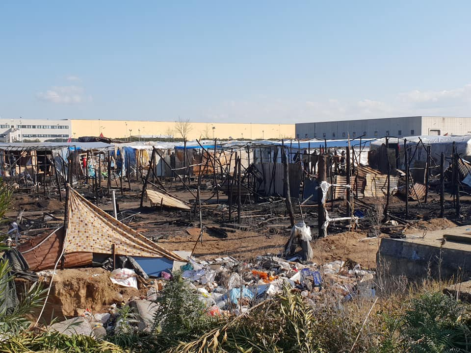
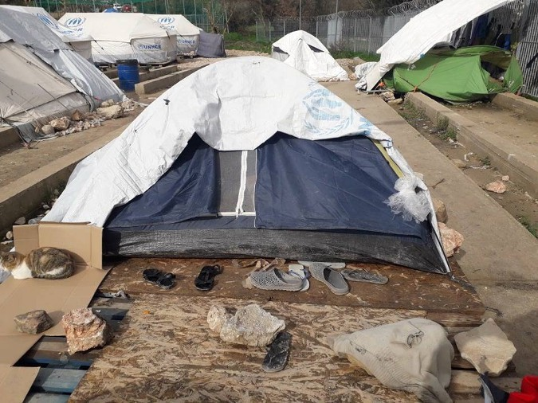
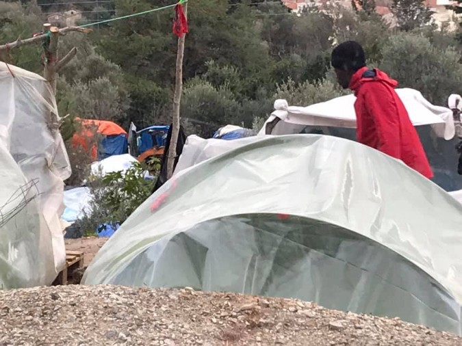
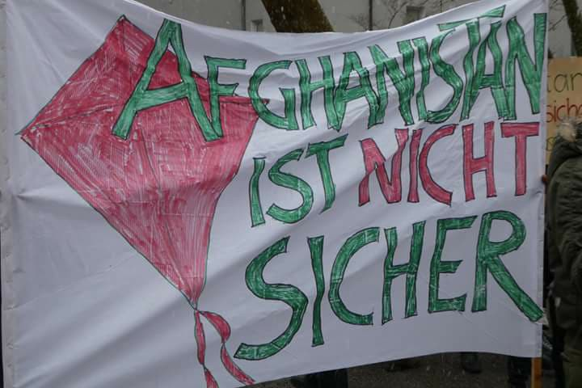

### بدتر شدن شرایط در مرزهای اروپا
#### AYS Weekly News Summary in Persian, February 11–17

### **ترکیه**
#### درگیری بین شهروندان ترک و پناهندگان سوری در استانبول

■■■■■■■■■■■■■■ 
> **[Sotiri Dimpinoudis](https://twitter.com/sotiridi) @ Twitter Says:** 

> > #Breaking: Clashes today between Syrian refugees and Turkish people in Esenyurt, Istanbul #Turkey, leaves at least 12 people wounded. https://t.co/9O9HTAdq6C 

> **Tweeted at [2019-02-09 20:59:38](https://twitter.com/sotiridi/status/1094340065852043265).** 

■■■■■■■■■■■■■■ 

تصاویری از درگیری بین پناهندگان سوری و گروهی از مردان ترک در اسنورت ، استانبول ، پدیدار شده‌اند \. گزارش‌ها حاکی از زخمی شدن حداقل ۱۲ نفر است \. Sotiri Dimpinoudis از منابع محلی گزارش داده‌است که خشونت بین پناهندگان و گروهی از مردان از اخوان‌المسلمین ترکیه پس از آزار یک دختر جوان سوری به آمده‌است\. پس از آن ، تلافی از مغازه داران سوری با ویترین مغازه‌ای شان برخورد کردند و محتویات ، توسط مردان ترک را به غارت رفتند، که در نهایت توسط پلیس شورش ترکیه متوقف شدند
#### [یونان قصد دارد تا کمک مالی نقدی و مسکن برای پناهندگانی که شناسایی شده‌اند را به تدریج متوقف کند](https://blog.refugee.info/exit-accommodation-cash-fa/?fbclid=IwAR3pJFV-1P2JIjRkgQRm9IRJQPZUZZTAf6yW3L9WRcyUjhdWmCs9V7HTgWk)
### **جزایر یونان**
#### به اروپا خوش آمدید ۲۰۱۹

مردم هنوز در چادرهای کمپ ویال در چیوس ساکن هستند

 \)](assets/c1dbe5f6479c/1*F27BzHdqzvbPC0d5gctcBg.png)

Photos by [Chios People’s warehouse](https://www.facebook.com/chiospeopleswarehouse/photos/pcb.546688135828926/546687702495636/?type=3&theater) \)

برنامه سفر آزاد از ویال نیز توسط سازمان یو\.ان به حالت تعلیق در آمده‌است و باعث شده‌است تا مردم در ۷ کیلومتری شهر و ۸ کیلومتر به نزدیک‌ترین بیمارستان بروند

و این وضعیت در مورد ساموس در اردوگاه وتتی نیز بهبود نیافته است

](assets/c1dbe5f6479c/1*4t0xZ4jKDV-4IMUh0WDkYw.jpeg)

photos by [Donate4Refugees\.org\.uk](https://www.facebook.com/Donate4Refugees.org.uk/posts/2278373362452971?hc_location=ufi)

در جزیره ی کاس، مردم نیز فاقد تجهیزات ابتدایی هستند

■■■■■■■■■■■■■■ 
> **[RSA](https://twitter.com/rspaegean) @ Twitter Says:** 

> > Refugees in hotspot of Kos complain about the lack of medical and legal support but also the poor quality of the food. 
#opentheislands #stopthetoxicdeal https://t.co/bF19vZvZWz 

> **Tweeted at [2019-02-08 15:52:58](https://twitter.com/rspaegean/status/1093900501933002758).** 

■■■■■■■■■■■■■■ 

### **صربستان**
#### ۳۲۰ نفر در مرکز شهر بلگراد

اطلاعات پارک ، ۳۲۰ پناهنده را در پارک‌ها و خیابان‌های اطراف شهر بلگراد را به عنوان بخشی از برنامه ی شبانه منظم، خود را شمارش کرده اند \. این گروه اضافه می‌کند که مقامات مجارستان در مجموع ۱۰۷ تلاش ناموفق برای ورود به کشور را در پایان هفته ثبت کرده‌اند که ۹۴ تن از آن‌ها در داخل قلمرو مجارستان متوقف شدند

در صربستان ، پایین‌ترین دما به صفر درجه می‌رسد \. وضعیت در بوسنی و کرواسی بدتر است ، جایی که پایین‌ترین دما در درجه منفی چهار و در مونته نگرو قرار دارد که در آن پایین‌ترین دما از منفی ۶ تا ۷ درجه خواهد بود

> **یادداشت** 

> در اخبار روزانه ما هر روز به انگلیسی پیش‌بینی آب و هوا برای منطقه بالکان، مونته نگرو ، صربستان ، بوسنی هرزگوین و کرواسی را خواهید یافت 

### **ایتالیا**

دادستان عمومی ایتالیا در حال تحقیق درباره ی مرگ ۱۱۷ نفر است که در ماه ژانویه جان خود را از دست دادند که پس از بیش از هشت ساعت در دریا زندگی خود را از دست دادند , چرا که لیبی به تماس‌های تلفنی از روم پاسخ نداده است

هیچ کدام از این دو کشور و نه کشتی‌های بازرگانی در این ناحیه نسبت به درخواست شورای انتخاب قضایی واکنش نشان ندادند و متاسفانه , قایق‌های دیده‌بان دریا برای رسیدن به قایق در زمان پریشانی بسیار دور بودند

تنها سه نفر از ۱۲۰ نفر جان سالم بدر بردند

هزینه‌های زیادی برای پناهجویان و برای اپراتورها در مراکز سالوینی جدید گنجانده شده‌است

در واقع , همانطور که گزارش شده‌است , برای هر مهاجر که در مراکز پذیرش با ظرفیتی در مراکز پذیرش \+50 قرار دارد , در کل 21\.35 در یک روز / روز \( به علاوه پول تو جیبی 2\.50 \) توسط دولت اعطا خواهد شد ،در مقابل 35\.00 در روز که در سال قبل پرداخت میشده است

علاوه بر این , یک اپراتور با 50 نفر کار خواهد کرد , به این معنی که یک فرد نیاز به کار با 50 نفر برای توزیع کالا , پول توجیبی , کمک قانونی و وساطت فرهنگی , همه با مقدار بسیار محدودی زمان و بودجه نیاز دارد

هم چنین در زمان دریافت حمل و نقل هم قطع می‌شود \. اکنون مردم حق دارند 12 سفر سالیانه خود را به حداکثر 30 کیلومتر برسانند \. این بدان معنی است که پناهندگان در شهرهای کوچک نمی‌توانند در مراکز بزرگ‌تر حضور یابند ; این حکم جدید مراکز کوچک‌تر از ایجاد و مدیریت کلاس‌های زبان را در درون ساختار خود متوقف می‌کند

هیچ تمایز برای مقوله‌های آسیب‌پذیر در این حکم گنجانده نشده است; روانشناسان در تسهیلات پذیرش حضور نخواهند داشت , اما , با کنجکاوی , به عنوان چهره‌های پشتیبان در مراکز پیش از تبعید نگهداری می‌شوند , جایی که نیمی از افراد حاضر شانس بالایی برای بازگشت به کشورشان را دارند

هیچ فصل خاصی برای خانواده‌ها , آموزش و تفریح کودکان وجود ندارد

کسانی که مرده اند، چون ایتالیا اجازه نداده در بنادر ایتالیا لنگر بیاندازند و لیبی حتی به درخواست شورای انتخاب قضایی پاسخ نداد

### **اتریش**

اخراج و دیپورت احتمالی در هفته ی آینده به افغانستان

عکس از شهروندان اروپایی در برابر دیپورت به افغانستان

اردوگاه اعتراضی پناهندگان در وین در حدود ۱۹ فوریه می‌گوید ، بسیاری از افغان‌ها از اتریش اخراج و دیپورت خواهند شد ، که تا حدودی از آنها ،از طریق هواپیماهای اجاره‌ای دیپورت میشوند \. یک گروه، به افرادی که احتمالا ً تحت یک تهدید اخراج و دیپورت قرار دارند توصیه می‌کند که به پاسگاه پلیس مراجعه نکنید، در صورتی که برای “ gelinderes Mittel “ به دست شما نامه ای رسید \. همچنین توصیه می‌شود که رفتن

به مکان‌هایی که به طور متداول تحت کنترل پلیس قرار دارند ، مانند ایستگاه‌های راه‌آهن یا ایستگاه‌های زیرزمینی ، اجتناب کنید

افرادی که در معرض خطر قرار دارند شامل کسانی هستند که فاقد مدارک شناسایی هستند یا منفی دوم را در مورد پرونده ی خود دریافت کرده اند \. یک رویداد امروز در اینسبروک برای داوطلبان انجام می‌شود تا در مورد نحوه کمک به مهاجرانی که بعد از تصمیم‌گیریه منفی چگونه از حق و حقوق خود دفاع کنند و در موردش بحث و تبادل نظر کنند

### **آلمان**

سازمان ملل فهرستی جامع از خدمات در دسترس و آفلاین را برای پناهجویان جدید در آلمان منتشر کرده‌است تا اطلاعاتی درباره ی نحوه ی راهبری سیستم پیچیده ارائه دهد

این فهرست شامل لینک‌هایی به سازمان‌هایی می‌شود که در زمینه مهاجرت , ورود و یکپارچگی کار می‌کنند , از جمله حمایت ویژه ی ارائه‌شده به مردم در حرکت که بخشی از جامعه و نوجوانان هستند \. دوره‌های زبان , فرهنگ لغت و دوره‌های خود مطالعه نیز در این مقاله فهرست شده‌اند , اما تنها به شکل حمایت آنلاین و برنامه‌های کاربردی , کار , مشاوره حقوقی , امکانات مسکن و همچنین \( روحی روانی \) خدمات بهداشتی و بارداری و حمایت از تولد در این مقاله گنجانده شده‌است

لطفا ً منبع اصلی را اینجا ببینید

در روز دوشنبه هجدهم , بازگشت دسته‌جمعیه زندانیان به افغانستان برگزار خواهد شد \. مردم از فرانکفورت دیپورت خواهند شد

ن\.ب فرانکفورت و تظاهرات پناهندگان افغان در همان روز , در همبستگی با مردمی که به عقب برده می‌شوند و توقف کردن تمام افراد دیپورت شده , درخواست اعتراض دارند

سازمان ا\.ا\.ام , ارتقای عملیات بازگشت به سوریه و همچنین لیبی , اریتره و یمن را به دلیل وضعیت امنیتی در دو کشور به حالت تعلیق درآورده است

سازمان بین‌المللی مهاجرت استدلال می‌کند افرادی که داوطلبانه بازگشته اند نباید در وضعیت بدتری از افرادی باشند که بازگشت آن‌ها توسط سازمان ا\.ا\.ام حمایت می‌شود

این بازگشت در این موارد با مسئولیت خود و بدون افراد متاثر، به هیچ وجه توسط مقامات آلمانی “ تشویق شوند “ رخ خواهد داد
### **ایرلند**

حمله ی نژادپرست ها به هتلی که مقصد پناهندگان است

به گفته رسانه‌های محلی ، دومین نمونه از این آتش‌سوزی در هتلی واقع شده‌ است که قرار است به عنوان مرکز پذیرش پناهندگان در ایرلند استفاده شود\. اگرچه ساکنان محلی از این رفتار چشم ‌پوشی نمی‌کنند، اما تصور می‌ شود که این حملات تلاشی برای جلوگیری از انتقال پناهندگان به این محل است

> ما یک تیم رسانه‌ای کاملا ً داوطلب هستیم و به طرفداران خود اتکا می‌کنیم تا اخبار ما را به اشتراک بگذارند \. پس لطفا ً پخش کنید 

_Converted [Medium Post](https://medium.com/are-you-syrious/%D8%A8%D8%AF%D8%AA%D8%B1-%D8%B4%D8%AF%D9%86-%D8%B4%D8%B1%D8%A7%DB%8C%D8%B7-%D8%AF%D8%B1-%D9%85%D8%B1%D8%B2%D9%87%D8%A7%DB%8C-%D8%A7%D8%B1%D9%88%D9%BE%D8%A7-c1dbe5f6479c) by [ZMediumToMarkdown](https://github.com/ZhgChgLi/ZMediumToMarkdown)._
