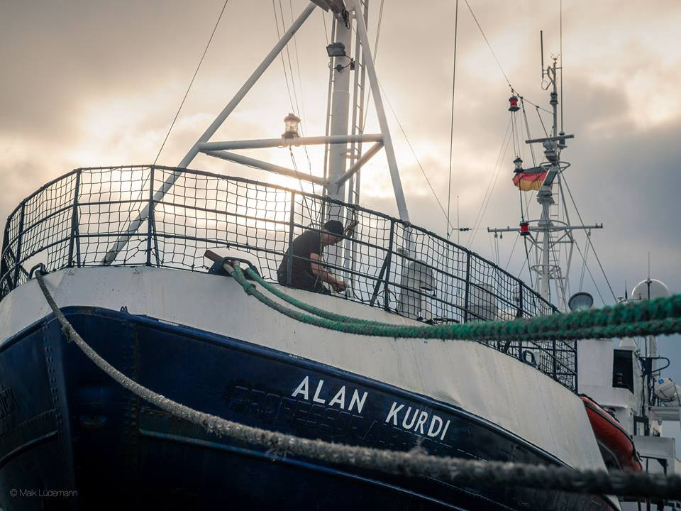
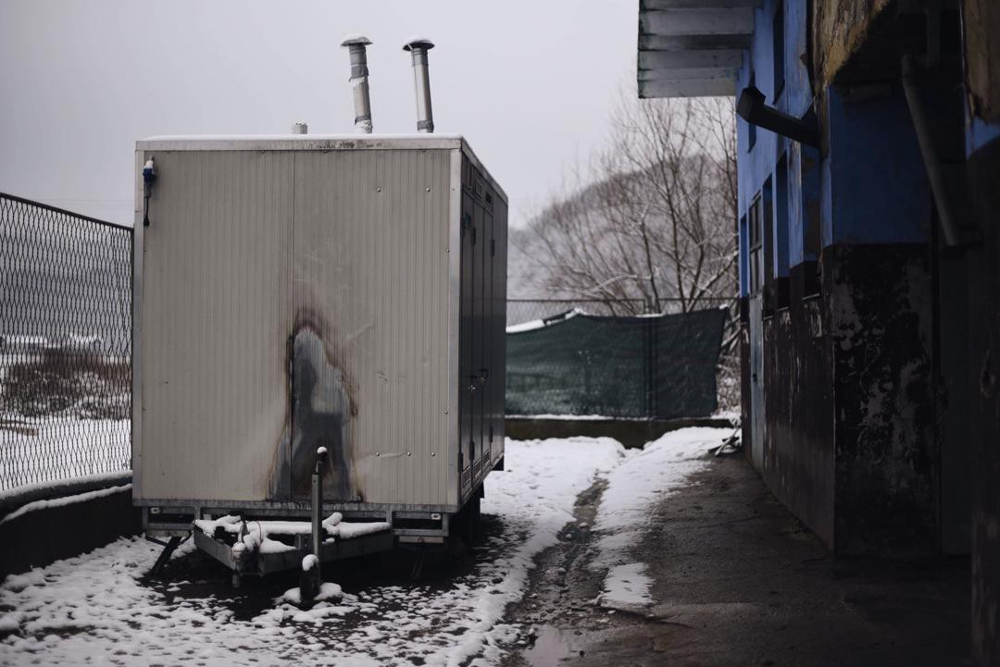

### AYS Daily Digest 20/2/19: Libyan Coast Guard interceptions have decreased number of crossings in the central Mediterranean, according to Frontex\.
#### Feature: Frontex reports finds that Libyan Coast Guard interceptions have lowered number of crossings in the central Mediterranean Is this what success looks like?

A search and rescue vessel, re\-christened the “Alan Kurdi” after the child refugee who was famously photographed after drowining in 2015\. Photo Credit: Sea\-Eye\.

Frontex released their annual report this week on what they call “irregular migration”\. The title of the report is “Risk Analysis for 2019,” and in it they discuss the “pressure” faced by EU nations due to refugee arrivals\. Yet nowhere in their analysis do they address the dangers faced by those who are at the greatest risk: the refugees seeking to cross European borders\. These people face constant violence and abuse from Frontex and other EU\-funded border police\.

One of the findings in the report is that there has been a “dramatic drop in the number of migrants on the central Mediterranean route, where the number of detections \[from 2017 to 2018\] plunged 80% to 23,485\.” As the report itself acknowledges, the reduction in the number of people crossing the central Mediterranean is largely due to the aggressive actions of the Libyan Coast Guard: “ **the sudden uptick in activities by the Libyan Coast Guard in July 2017 was one of the key variables in irregular migration to Europe that changed from 2017 to 2018\.”**

What is not acknowledged in the report is that this “sudden uptick” in the number of interception and forced returns by the Libyan Coast Guard \(LCG\) did not happen on its own\. It is the result of increased funding and cooperation from EU nations, and Italy in particular\. The EU continues to fund the LCG and support their transfer of refugees to detention centers where people are tortured and even sold into slavery\.

You can read the [summary](https://frontex.europa.eu/media-centre/news-release/frontex-publishes-risk-analysis-for-2019-Dh6Wkf?fbclid=IwAR1-0bGVmhtKXWNLgJUf5KOHiq9ya0fEmOHJAjXChsmlHCNkMqTUWurq470) of the Frontex report here, or view it in its [entirety](https://frontex.europa.eu/assets/Publications/Risk_Analysis/Risk_Analysis/Risk_Analysis_for_2019.pdf?fbclid=IwAR1h1jJNNOnVPVLxXIjjxImkr0FFL8lMJ8_rAfrrV23No_NvPTZscqMsbuc) \. Don’t forget to read between the lines\.
### Tunisia

■■■■■■■■■■■■■■ 
> **[Sally Hayden](https://twitter.com/sallyhayd) @ Twitter Says:** 

> > Refugees in Tunisia, who recently escaped Libya, asking me to post this video of what they say is a protest against UNHCR, because a group of 26 are being forced out of their accommodation, despite still being traumatised. https://t.co/VPy57Y6S2X 

> **Tweeted at [2019-02-20 08:47:58](https://twitter.com/sallyhayd/status/1098142205145989120).** 

■■■■■■■■■■■■■■ 

■■■■■■■■■■■■■■ 
> **[HAMIE HAMIE](https://twitter.com/HAMIEHAMIE1) @ Twitter Says:** 

> > Where is  unhcr in Tunisia? https://t.co/PoDPe5Jjav 

> **Tweeted at [2019-02-20 14:18:59](https://twitter.com/hamiehamie1/status/1098225505965363201).** 

■■■■■■■■■■■■■■ 

### Turkey
#### Erdogan suggests Turkey aims to prevent more refugees from entering country

Turkish president Erdogan announced this week that the country will not be able to [“shoulder another wave of migration](https://www.trtworld.com/turkey/erdogan-turkey-no-longer-able-to-face-new-refugee-flow-24306?fbclid=IwAR1Rw6JBSuatydOL-Ud3k76pnBg2EEAwOrxs8i0jTkhscu5d-ed1e2gS9d4) ”\. Any move to create further restrictions for refugees trying to move through Turkey could have drastic consequences for millions of people\. Erdogan said in his address that he would not move to create more physical barriers around the country, as this was not an effective way to prevent migration\. According to the Turkish interior ministry, [268,000 people](https://www.infomigrants.net/en/post/15294/turkey-268-000-undocumented-migrants-apprehended-in-2018?fbclid=IwAR0II5JbT5bOTOXpMJMqQdHYKrWI-apw420B9LhmbcUl6dWJ1QWpkTRK3KE) were apprehended and detained in 2018\.
### Greece
#### Demonstration planned in response to death of Nigerian man

There will be a protest and press conference tomorrow in front of the Omonia police station in Athens\. The demonstration is in response to the killing of a Nigerian man named Ebuka who was beaten to death in the Omonia jail by police, as reported in yesterday’s digest\. [Click here](https://www.facebook.com/events/288022038537511/) for more info\.

■■■■■■■■■■■■■■ 
> **[NoBorders](https://twitter.com/Refugees_Gr) @ Twitter Says:** 

> > Συγκέντρωση διαμαρτυρίας-Συνέντευξη τύπου εξώ από ΑΤ Ομόνοιας αύριο Πέμπτη, 13:00.
Στις 8 Φλεβάρη, ο Εμπουκά, από την Νιγηρία, πατέρας 2 παιδιών, μεταφέρεται για εξακρίβωση στοιχείων στο ΑΤ Ομόνοιας και λίγες ώρες αργότερα πεθαίνει
[facebook.com/events/2880220…](https://www.facebook.com/events/288022038537511/)
#antireport  #refugeesgr https://t.co/ylwuCFmuni 

> **Tweeted at [2019-02-20 14:20:15](https://twitter.com/refugees_gr/status/1098225824870866944).** 

■■■■■■■■■■■■■■ 

#### Cold front and snow starting on Friday

A cold front is arriving in Greece [this week](https://greece.greekreporter.com/2019/02/20/greece-braces-for-more-snow-as-cold-front-barrels-from-the-north/?fbclid=IwAR1mX8Rk3qZ5fFa0fNS8oRris2gcDdErLStoy4k5xZCjYnJsgqlD4ynf2ao) , with temperatures expected to drop rapidly starting on Friday\. Snowfall is expected throughout the country this weekend\. Anyone who is sleeping exposed to the elements is warned to take precautions\.
#### Demonstration In Thessaloniki \(via No Borders network\)

There was a demonstration today in Neapoli, Thessaloniki, in response to last night’s attack against an Iraqi family living in the city\. A Molotov bomb was thrown at the family’s residence\.
#### New welfare program announced

Greek authorities announced the creation of a new welfare program this week, which will be accessible to beneficiaries of international protection\. Such assistance is especially needed now, as Greek authorities recently announced that people who have received refugee status will no longer be eligible for UNHCR cash assistance after six months\. You can find more information on the new welfare program [here](https://www.asylumineurope.org/reports/country/greece/content-international-protection/social-welfare?fbclid=IwAR1UKN6NYEJkXYk_C7syA7ocV6iD0Phc2nlQ-RNzB6BufWoWyd8oHGgY1bg) \.

Stand up for refugees is seeking a french\-speaking volunteer to manage their helpdesk on Samos:

> We are urgently looking for someone who can translate French / English, finance themselves and support the only French\-speaking colleague at the helpdesk in the hospital on [\#samos](https://www.facebook.com/hashtag/samos?hc_location=ufi) \. Volunteers please contact me via Whatsapp \+ 41798809270\.” 

### Balkan Weather Report \(for Thursday, 21\.02\.19\)
#### MONTENEGRO

Predominantly sunny with light to moderate clouds\. Fog is possible during the morning in the low\-lying areas in the north\. Wind mostly light to moderate from the north\. Low temperatures from \-4 to 6 C° and highs from 5 to 18 C°\.
#### SERBIA

Light to moderate cloud cover and warm\. In the evening and in the north, and during the night throughout the country increasing clouds with rain and a drop in temperatures\. Wind light to moderate, strong in the east during the morning, blowing from the northwest\. Low temperatures from \-1 to 5 C° and highs from 11 to 15 C°\.
#### BH

Predominantly sunny and light to moderate cloud cover\. Before noon gradual increase of cloudiness in the northeast and north and in the evening in the central parts\. Wind light blowing from the north and northeast\. Low temperatures from 0 to 7 C°and highs from 8 to 16 C°\.
#### CROATIA

Predominantly sunny\. Local fog during the morning along the rivers, in the low\-lying areas, and along the western coast of Istria\. Towards the evening an increase in cloudiness from the north\. Wind mostly light to moderate along the coast, northwest\. Low temperatures from \-3 to 8 C° and highs from 12 to 17 C°\.
### Serbia

The Umino volunteer team is planning another trip to Subotica, where approximately 100 people are currently living without shelter\. You can learn more about their work and support them [here](https://www.paypal.me/SupportUmino?fbclid=IwAR3JQXr68sF5Qal682PMfZwBbY7EI1ktMA6eBsfH41FxpKFdg6oXbPTu3TQ) \.
### Bosnia
#### Bosnian media amplify anti\-refugee rhetoric

Bosnian media outlets associated with right\-leaning political parties, and in particular the TGE media network, have been releasing a slew of anti\-refugee reports\. These stories are often based upon highly exaggerated statements from Bosnian officials\. For example, yesterday a number of news outlets picked up a statement by Bosnian Security Minister Dragan Mektic that [70,000 refugees](http://www.ansamed.info/ansamed/en/news/sections/generalnews/2019/02/19/bosnia-alarmed-over-70000-migrants-ready-to-leave-greece_8e4d3b5a-c00f-4d4b-aa5b-e10b1b41e13c.html?fbclid=IwAR0ob1XJDYon2duln3jZDaH4sTUjjyIl7Xoz2PjyQELiNNbSChsiPzF2S88) were preparing to leave Greece via Bosnia\. Inaccurate stories like these are closer to hate speech than actual news, as they aim to spread fear and anti\-refugee sentiment based on misinformation\.
#### No Name Kitchen announces return to Bosnia after their papers are sorted out, AidBrigade returns to Usivak camp

Several international volunteer groups have encountered problems with Bosnian authorities after their legal status expired and some of them failed to extend their registration papers or to register NGOs in Bosnia\. For this reason, No Name Kitchen, SOS Team Kladusa and other groups had to pull out some of their volunteers who are EU residents\. No Name Kirchen, an international group that provides free showers for people in Velika Kladusa in cooperation with AYS and MSF, has published an update announcing their return to Bosnia after their papers are sorted out\.

Mobile shower unit Velika Kladusa: collaboration between AYS, NNK and MSF\. Photo Credit: Angélica Sánchez\.

Sarajevo\-based international group AidBrigade has been told they had to leave Usivak camp two weeks ago, but now they’ve received permission from the Bosnian authorities to continue our work from today onward\.

](assets/9b1a1f50f88e/1*LVV9gPEhBx7wIMQUZnfFgQ.jpeg)

Photo Credit: [AidBrigade](https://www.facebook.com/aidbrigade/photos/pcb.2092161290892849/2092165214225790/?type=3&theater)
### Belgium

MSF Belgian released a report today based on their interviews with many asylum seekers in the country\. Among their findings:

> ➡ ONLY 4 of the 47 people surveyed had the intention to go to the UK from the beginning of their journey\. 

> ➡ ONE PERSON OUT OF four attributes his psychological problems to experiences lived in Europe \(mediocre living conditions, uncertainty about the procedure to follow, police behavior…\) \. 

> ➡ MSF, with the other partners of the hub, advocates for a more fluid application of the Dublin regulation and the creation of reception and orientation centers for this group of people\. 

You can read the report [in full here](https://www.msf-azg.be/fr/news/rapport-msf-sur-les-migrants-et-réfugiés-au-hub-humanitaire-à-bruxelles-une-fuite-sans-fin?fbclid=IwAR1OX-Os8Tn5CEj_sqvRl5PnnrmVJaPAWMuEK_qrSgUySve_4siQJmmSf18) \(French\) \.
### Germany
#### Deportation to Georgia scheduled

Activists in Germany are trying to stop a planned deportation which is scheduled for 21 February 2019\. Facing deportation are a pregnant mother and her four children, aged 10 months to 10 years old\. Activists are calling on people to contact Georgian airlines to ask them to stop the flight\. [Click here](https://www.fluechtlingsrat-bayern.de/stoppt-madonas-abschiebung.html?fbclid=IwAR0UCZj1IJtohdpqiti6Oc14NgfmnvHa6JR0ZP5YUNaNVXkmLHlkVe5qCmI) for more information \(German\) \.
### France

Unaccompanied minors who are living on the streets are being given social services appointments that are months away, according to volunteers in the capital\. Meanwhile, the unaccompanied youths are living in street\-camps where they are exposed to constant danger and abuse\.

 \. An appointment for an accommodation and social services appointment that is months away, given to an unaccompanied minor currently living on the street\.](assets/9b1a1f50f88e/1*HEVJSUX1-MEQ0Ii_F_Tf_w.jpeg)

Photo Credit: [Utopia 56](https://www.facebook.com/U56ParisIDF/?__tn__=%2CdkCH-R-R&eid=ARB8zmfs0j-8ywWfTL02YcxJcJDXOxElYG4HgtmTupESkT1_PVHG9SOetLPRE3U7p9srg7_8RQfhHGyM&hc_ref=ARQIRaVb2hePtaigHikeg_RtL7Wk7dD4pVWcT8TczkAtKgC9vCijmQyORIF-NVOxpkw&fref=nf&hc_location=group) \. An appointment for an accommodation and social services appointment that is months away, given to an unaccompanied minor currently living on the street\.

Utopia 56 is looking for volunteers in Lyon to support their work, and also to collect material donations\. [Click here](https://www.facebook.com/utopia56lyon/?__tn__=%2CdKH-R-R&eid=ARAM47CsFiD204ocVfCZ6QlSqCgw4vIufVS7ayy4LIj6raW5BNIIMRIXtqCzWR2k4AH1NAT3bOobEMq9&fref=tag) for more info\.
### Spain
#### Boat missing in Alboran Sea

There is a boat missing in the Alboran Sea which contains an estimated 36 people, [according to human rights reporter Helena Garzon](https://twitter.com/HelenaMaleno/status/1098303157782921216?fbclid=IwAR0H4NEzBE_YynZiomT466yssnvB5scfVLQD9sym3eDVjGmLl2CugoiHXcs) \. The vessel risked the crossing this week in spite of dangerous weather conditions, and the people aboard have not been heard from since departing\.

UNHCR Spain has released their weekly report on new arrivals from last week \(11–17 February\) \. In total, 171 people arrived in Spain, with the most common countries of origin being Morocco and Guinea\. You can see the data [here\.](https://data2.unhcr.org/en/documents/download/68036)
### Italy
#### Evictions in Borgo Mezzanone \(Foggia, Puglia\)

Hundreds of police and number of humvees and helicopters arrived today to begin the destruction of the migrant camp in Borgo Mezzanone\. According to volunteer organizations in Puglia, many shacks had been cleared by the end of the day\.

 \.](assets/9b1a1f50f88e/1*v2Co41yr5jdwXhB1osJxow.jpeg)

Police clearing the encampment\. Photo credit and statement below from [Comitato Lavoratori delle Campagne](https://www.facebook.com/comitatolavoratoridellecampagne/?__tn__=%2CdkCH-R-R&eid=ARAJbnnQdkRugCIeeNPXs1zGXoYudo3_X3Y7tnpypCPvAW9oJyJx4TN_FMMXR8m5ADZrmMnrEXqJyUsn&hc_ref=ARRCyo_JCOj3TpyS9He1hSGzXp1_Ios3QcKi1e9UROldnNE3HW6vTnVYvIBP2noNsBg&fref=nf) \.

> For the moment the [\#clearing](https://www.facebook.com/hashtag/clearing?source=feed_text&epa=HASHTAG&__xts__%5B0%5D=68.ARCXjSP87ftPG4DSWHpy4rnFSBMCMY2ym4LylUUyDh08wBxaGmBM7OPoHglCZ7JSCv0DlIbHBcKcdKz2HaDMkbwa9n4bbe0_JX1DRv8_WeHk1YVaijkQZox5csmHSAB-e5MVEwb9z07kTTCSkKzCDPBk9G9smp2MoXftFzNG8yXQ8beavKAq0aNe0z4gzsoxJLJr2-CJ-u0W2QtpZG_aHBuZXMJg6RskbFzDnUCePA&__tn__=%2ANKH-RR3%5D-R-R) has ending, limited to some farmhouses on the track at bar and workshop\. Electricity has been shut off all day in the area\. This morning’s operation affects especially women, initially threatened to lose even the apartments where they live and work\. \. \. Many police officials said this is only the first action and they will come back\. Humanitarian organizations in the area are protesting today’s clearing, and asking for no more evictions and [\#repression](https://www.facebook.com/hashtag/repression?source=feed_text&epa=HASHTAG&__xts__%5B0%5D=68.ARCXjSP87ftPG4DSWHpy4rnFSBMCMY2ym4LylUUyDh08wBxaGmBM7OPoHglCZ7JSCv0DlIbHBcKcdKz2HaDMkbwa9n4bbe0_JX1DRv8_WeHk1YVaijkQZox5csmHSAB-e5MVEwb9z07kTTCSkKzCDPBk9G9smp2MoXftFzNG8yXQ8beavKAq0aNe0z4gzsoxJLJr2-CJ-u0W2QtpZG_aHBuZXMJg6RskbFzDnUCePA&__tn__=%2ANKH-RR3%5D-R-R) , tents or containers, we want [\#houses](https://www.facebook.com/hashtag/houses?source=feed_text&epa=HASHTAG&__xts__%5B0%5D=68.ARCXjSP87ftPG4DSWHpy4rnFSBMCMY2ym4LylUUyDh08wBxaGmBM7OPoHglCZ7JSCv0DlIbHBcKcdKz2HaDMkbwa9n4bbe0_JX1DRv8_WeHk1YVaijkQZox5csmHSAB-e5MVEwb9z07kTTCSkKzCDPBk9G9smp2MoXftFzNG8yXQ8beavKAq0aNe0z4gzsoxJLJr2-CJ-u0W2QtpZG_aHBuZXMJg6RskbFzDnUCePA&__tn__=%2ANKH-RR3%5D-R-R) , [\#documents](https://www.facebook.com/hashtag/documents?source=feed_text&epa=HASHTAG&__xts__%5B0%5D=68.ARCXjSP87ftPG4DSWHpy4rnFSBMCMY2ym4LylUUyDh08wBxaGmBM7OPoHglCZ7JSCv0DlIbHBcKcdKz2HaDMkbwa9n4bbe0_JX1DRv8_WeHk1YVaijkQZox5csmHSAB-e5MVEwb9z07kTTCSkKzCDPBk9G9smp2MoXftFzNG8yXQ8beavKAq0aNe0z4gzsoxJLJr2-CJ-u0W2QtpZG_aHBuZXMJg6RskbFzDnUCePA&__tn__=%2ANKH-RR3%5D-R-R) and [\#contracts](https://www.facebook.com/hashtag/contracts?source=feed_text&epa=HASHTAG&__xts__%5B0%5D=68.ARCXjSP87ftPG4DSWHpy4rnFSBMCMY2ym4LylUUyDh08wBxaGmBM7OPoHglCZ7JSCv0DlIbHBcKcdKz2HaDMkbwa9n4bbe0_JX1DRv8_WeHk1YVaijkQZox5csmHSAB-e5MVEwb9z07kTTCSkKzCDPBk9G9smp2MoXftFzNG8yXQ8beavKAq0aNe0z4gzsoxJLJr2-CJ-u0W2QtpZG_aHBuZXMJg6RskbFzDnUCePA&__tn__=%2ANKH-RR3%5D-R-R) \! 

### General

> [\#EASO](https://www.facebook.com/hashtag/easo?source=feed_text&epa=HASHTAG) published a new Practical Guide on the best interests of the child in [\#asylum](https://www.facebook.com/hashtag/asylum?source=feed_text&epa=HASHTAG) procedures\.
 

> 📘Read it here ➡️ [https://bit\.ly/2IqR8Df](https://bit.ly/2IqR8Df?fbclid=IwAR0h10jWD8RdnflLNA_O5OVKhXGWV9Gbj7jwNin67sfQsNE0_BOZCzwsJew) \.
 

> Find \+info here ➡️ [https://bit\.ly/2tw2fjJ](https://l.facebook.com/l.php?u=https%3A%2F%2Fbit.ly%2F2tw2fjJ%3Ffbclid%3DIwAR3G9fMYzDdlRIwdHFd89ipQVjp7OwzXnHSziHuSogOyVxes9xMahr0Ab0A&h=AT237cYisn--ZtgjEWlNohHzRJIF__9qYf30ldvj9to1DGShxiwmWHI6b9nIuODBNI3K8Eb3CYz0Bs-lp0dnAF4mZVwH8z34eW8oW4k-7cF_qg1Y24OwqDnDCCQLrGxdlFdZA7Ql_iXoE4QWuh0E6Gh3m-QUgQ) \. 

**We are an entirely volunteer\-run media team, and we rely on our supporters to share our news\. So please share, and never forget to ACT\!**

**We also publish weekly summary digests in Persian and Arabic\.** 
**Please, read and share the ones for the week of February 11–17:** 
**in [Persian](%D8%A8%D8%AF%D8%AA%D8%B1-%D8%B4%D8%AF%D9%86-%D8%B4%D8%B1%D8%A7%DB%8C%D8%B7-%D8%AF%D8%B1-%D9%85%D8%B1%D8%B2%D9%87%D8%A7%DB%8C-%D8%A7%D8%B1%D9%88%D9%BE%D8%A7-c1dbe5f6479c) and in [Arabic](%D8%A7%D9%84%D8%B8%D8%B1%D9%88%D9%81-%D8%AA%D8%B2%D8%AF%D8%A7%D8%AF-%D8%B3%D9%88%D8%A1%D9%8B-%D8%B9%D9%84%D9%89-%D8%AD%D8%AF%D9%88%D8%AF-%D8%A7%D9%84%D8%A7%D8%AA%D8%AD%D8%A7%D8%AF-%D8%A7%D9%84%D8%A3%D9%88%D8%B1%D9%88%D8%A8%D9%8A-9121e6961516) \.**

**We strive to echo correct news from the ground through collaboration and fairness\.**

**Every effort has been made to credit organizations and individuals with regard to the supply of information, video, and photo material \(in cases where the source wanted to be accredited\) \. Please notify us regarding corrections\.**

**If there’s anything you want to share or comment, contact us through Facebook or write to: areyousyrious@gmail\.com**

_Converted [Medium Post](https://medium.com/are-you-syrious/ays-daily-digest-20-2-19-9b1a1f50f88e) by [ZMediumToMarkdown](https://github.com/ZhgChgLi/ZMediumToMarkdown)._
