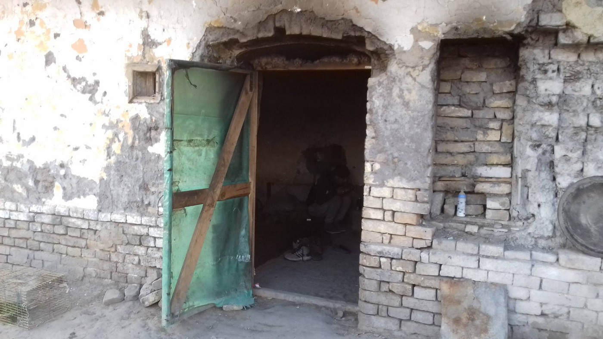
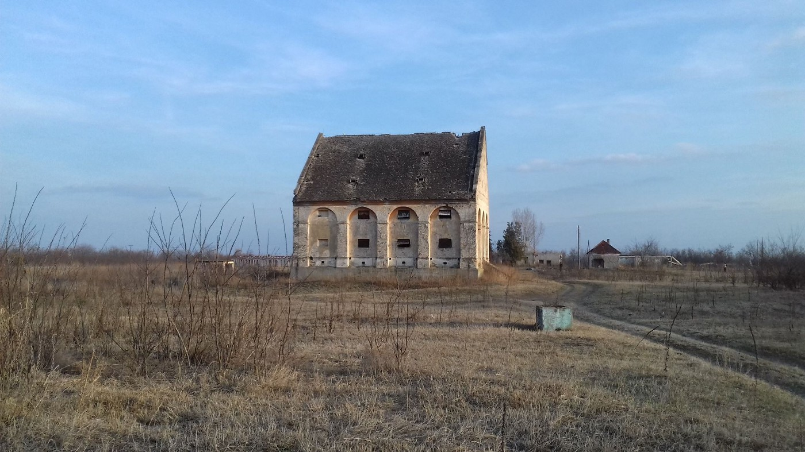

### AYS Daily Digest 22/2/19: Cries for help from behind the bars of detention centres
#### A growing number of calls for help from detention centres, denouncing violence and maltreatment / Baobab group in Rome asks for protective measures for migrants lacking basic mechanisms of international protection — video / more news

[Are You Syrious?](https://medium.com/@AreYouSyrious)

Feb 23

](assets/e6cca4045b21/1*anjsv9tAZORXjgJyTayXag.jpeg)

Photo: [La Cimade](https://www.facebook.com/lacimade/?__xts__%5B0%5D=68.ARBnDAd_osi3DT_Bf3Hb4XyQM2V853qCqJlJaXe4K6QriyGzT8UPngwax-whDbHNdY6sM5Wv4AXtK5RZJQGjhoo7x-gtkgfeVYWsJ8H1OQt3MoCPAyJH-i_c8OiaGIAmErF4YLD3z5mn0YKL6Thr8STpcP1q6f6JBjruiG-15UvuC6eNugym1z--IEnMtkslszkgahWJ7SIfVezEo6MR5RT0aLSWrF3Mv9jqBmQTA6ULdz60oPzVKAZdGmxSrpQRBWJ37y3imwJc5JbqTLI8aGYNRByPkZNGYjunXhRTQ8ZNZ6L2CyZlfeAWd4Fjc4mL3bVf_h0qhtL6-T1aIDxLiQklY4So4-BigP6WXxYBn9ocqwE0zuTx9sT6pDhwbtXVelI9yWYq_xjfujjSyKFF6CbXo_Ku30vIlxII1kbxnK92K98bHuhI9KvveS_isEV5v4m_mm7oKcpuKt05FIeDeCt66vbokLIunVbMHcwY7cq-BpQHGY_wt2nR0bU&__tn__=k%2AF&tn-str=k%2AF)
#### FEATURE

> \- a pregnant woman put in solitary confinement 
 

> \- five attempts of suicide this week in the detention centers in Bordeaux, Toulouse and Coquelles
 

> \- a 2\-months pregnant woman miscarriages in Metz 
 

> \- daily violence in the center of Hendaye
 

> \- people with psychiatric problems in all detention centers 

> The facts are serious\. 

A call for help from behind the barbed wire of the administrative detention center \(CRA\) of Coquelles in the region of Pas\-de\-Calais [reportedly](https://www.humanite.fr/immigration-lappel-au-secours-des-etrangers-en-retention-668424?fbclid=IwAR04pIl33xpG0AWchVWhhfPDolu3pCJqwn5DtOnR2_czywiD2yhwUN8bv9U) arrived earlier this week saying:

> “There is an Eritrean who tried to commit a suicide\. We do not know if he’s dead or not\. This is the third time this week\. Please \! It’s an SOS\!” 

It was Ahmad, a Moroccan immigrant locked up for twenty\-four days:
“I had a house, a job on a permanent contract,” says the man\. As a result of this separation, I lost everything\. Here he is today liable to expulsion to a country where he has no longer any attachment and detained within the walls of this CRA, writing in a letter that was refused to be dispatched: “I am informing you of a suicide attempt last night at 8:30 am, because of the abuse at the center and abusive behaviour towards people who have not committed any criminal offence,” reads the letter\. “I feel that everything that happens here is against my rights\.”

Such telephone calls from detainees at the Center de Rétention in Coquelle are growing in number, reporting “three suicide attempts”, “round trips to the hospital”, “mistreatment”, “insults”, “systematic drowsiness after meals as if they put sedatives in what we eat “, and more\.

There has been a recent increase in the period that one can be held in detention, which goes up to 90 days today\. This is exacerbating the situation for the already vulnerable people being held in the centre, and intensifying the precariousness created through a practice that puts administrative elements ahead of a person’s real situation and story\.

An intellectually disabled boy from Afghanistan \(also belonging to a minority threatened by the Taliban\), who is currently being held in detention in Rouen, is set to be put on a plane to Afghanistan soon\. Not only will this likely worsen his already stressful situation, it will leave him alone and at potential risk of death\. Read more about his story [here](https://www.paris-normandie.fr/actualites/societe/a-rouen-zia-un-jeune-afghan-deficient-intellectuel-pourrait-etre-expulse-prochainement-CA14634879?fbclid=IwAR3WIiFK1mzXPp6hVeKTWMQ1b1_UGUR8s9hxNNRdYXPV11d2Ptz8E-jpKKc) \.

> Tensions are at a maximum in administrative detention centers throughout France\. The Ministry of the Interior must intervene urgently, as well as the Ministry of Health, Ministry of Labor, Employment and Health\. 
 

> They must take their responsibilities\. 

> We need your help to make this situation unacceptable for people whose only fault is to have no papers\. — [La Cimade](https://www.facebook.com/lacimade/?__xts__%5B0%5D=68.ARBnDAd_osi3DT_Bf3Hb4XyQM2V853qCqJlJaXe4K6QriyGzT8UPngwax-whDbHNdY6sM5Wv4AXtK5RZJQGjhoo7x-gtkgfeVYWsJ8H1OQt3MoCPAyJH-i_c8OiaGIAmErF4YLD3z5mn0YKL6Thr8STpcP1q6f6JBjruiG-15UvuC6eNugym1z--IEnMtkslszkgahWJ7SIfVezEo6MR5RT0aLSWrF3Mv9jqBmQTA6ULdz60oPzVKAZdGmxSrpQRBWJ37y3imwJc5JbqTLI8aGYNRByPkZNGYjunXhRTQ8ZNZ6L2CyZlfeAWd4Fjc4mL3bVf_h0qhtL6-T1aIDxLiQklY4So4-BigP6WXxYBn9ocqwE0zuTx9sT6pDhwbtXVelI9yWYq_xjfujjSyKFF6CbXo_Ku30vIlxII1kbxnK92K98bHuhI9KvveS_isEV5v4m_mm7oKcpuKt05FIeDeCt66vbokLIunVbMHcwY7cq-BpQHGY_wt2nR0bU&__tn__=k%2AF&tn-str=k%2AF) 

■■■■■■■■■■■■■■ 
> **[Mary Luna](https://twitter.com/marydelaluna) @ Twitter Says:** 

> > @[cercleDvoisins](https://twitter.com/cercleDvoisins) #Calais Des appels téléphoniques de détenus au Centre de #Rétention de #Coquelles se multiplient pour signaler "trois tentatives de suicides", des "allers et retours à l'hôpital", des "maltraitances", des "insultes" ... [facebook.com/CSP59/?hc_ref=…](https://www.facebook.com/CSP59/?hc_ref=ARQkkZKXGDeb4mfjuomzjsnSgqTU1gWaH-0qpWRWz1k6cbHe9CNX_bZ04FemEYBAodQ&fref=nf&__xts__[0]=68.ARBRiOYZjMBjGETJKzHQ5ZcdPDQPyZfRDmueCQdkehnio1ZoM4bec3bDd_jlbuA_Krr1lsdBoA8N40SB28tSg0Vq-BEQRdSsOCm6v36AjZSXIqrq9q80Uzr45khDR8hDE7z63MDczdzJu_IECiPKDG_UFX41kIrjywqKXItVrXVfu6E5EfM2txQhH67gI8vkcj50vARID2X792qNUvdqXAu-ofYSpL4e535WAxfhFqd4KoCCQX41csneXI92PwrW-2Y6Ib9xV-CIA_X7-Xp5C-JjyGZRb_Ws_OKaWN4M1lPy8E5nuT1QArwZoWVXL8B3Dqp--UwxXzA3MRESn3XNZK5QiDBP&__tn__=kC-R) https://t.co/dk3oelTLQ9 

> **Tweeted at [2019-02-22 08:54:52](https://twitter.com/marydelaluna/status/1098868717709074432).** 

■■■■■■■■■■■■■■ 

#### SEA

The Sea\-Watch 3 had been stuck in the port of Catania, Sicily, since 31st January, after having disembarked 47 people rescued on the Central Mediterranean Sea\.

The rescue took place on 19th January, with neither coordination nor a mandatory port of safety provided by search and rescue authorities, for 10 days\. After the disembarkation in Catania, a statement was published by the Office of the Public Prosecutor of Catania, clarifying that the crew and ship, in conducting the rescue, acted in full accordance with the law\. Subsequently, a ludicrous barrage of controls and inspections ensued to block the ship from sailing, [Sea Watch reported\.](https://sea-watch.org/en/sea-watch-3-sails-to-scheduled-shipyard-maintenance-in-france/?fbclid=IwAR1Vv1voWvMY0FIaIuYgF8pk6WFNq2dn9u0Ayf5u9J2OPw_LVE7c6Yn5I90)

](assets/e6cca4045b21/1*hvsDCfY3SQgAYKJXJxon-w.jpeg)

Our crew is looking for protection from a heavy storm in the coming days\. — [sea\-eye](https://www.facebook.com/seaeyeorg/?tn-str=k%2AF)

■■■■■■■■■■■■■■ 
> **[Marc Tilley](https://twitter.com/TilleyMarc) @ Twitter Says:** 

> > And the #SeaWatch3 is free from administrative detention! Until tonight. Or tomorrow. Maybe even the following week.

This is neither victory for the Humanitarian imperative, nor cause for celebration. Migrant sea rescue operations have been failed again, politically and legally. https://t.co/1Mtu1gWymF 

> **Tweeted at [2019-02-22 14:46:22](https://twitter.com/tilleymarc/status/1098957174800302082).** 

■■■■■■■■■■■■■■ 

[Here](https://www.tpi.it/2019/02/22/migranti-scafista-libico-audio/?fbclid=IwAR3hrNNpUr7LIeov72mtWpNTZdE0Fn4um4EUe-q9gZgtCBB44TzkHstSJOQ) is one of many accounts of smugglers who agree to put migrants on precarious trips in insecure vessels across the Mediterranean in order to get away from dangerous Libya to reach Italy and Europe\.
#### GREECE
#### Arrivals

People are still arriving on the Greek islands, with a steady daily influx\.

22people landed on Chios on Friday afternoon while 78 people have arrived in two different boats on Samos this Friday morning, it has been reported\.
### Horrid conditions in detention centres, more calls for help

> In the prison they gave us nothing, no blanket, no pillows, no beds, we were lying on the floor like corpses\. They didn’t even give us the clothes that was brought to us from solidarity\. Not even toilet paper\. From the donations that come for us, the cops keep the good stuff, they give us the rest\. They put gloves on to touch us women or people of color, saying we are sick\. The cops are so racists, the prisoners suffer from this a lot\. 

Find the full text about the fate of a detained woman in Greece and a link to the fundraiser for her legal aid — [here](https://gogetfunding.com/collect-for-the-asylum-claim-of-b/?fbclid=IwAR3ufdUv0Hf6JIuOOWezV6FXZeFOfGTmKBvNnJZkDAXEqH11-rEnaY64UOQ) \.
#### SERBIA
### Horgos

[Umino](https://www.facebook.com/umino.org/?tn-str=k%2AF&hc_location=group_dialog) team reports: Nearly 50 young people populate the collapse of endangered ruins\. Most of them have been here for many months\.

#### WEATHER FORECAST FOR THE BALKANS for Saturday, Feb 23

MONTENEGRO

Windy and in the south and center changeably cloudy with sunny intervals, in the north moderately to entirely cloudy with snow locally\. Wind strong with stormy or hurricane like gusts blowing from the north and northeast\. Lower temperatures from \-14 to 5 and highest daily from \-12 to 9 degrees\.

SERBIA

Predominantly cloudy and colder with rain and snow in the mountains\. During the evening and night rain transiting into snow in the lower regions in the south and center while in the north and west precipitation will stop\. Wind moderate to strong blowing from the north locally with strong gusts during the evening\. Lowest temperatures from 0 to 6 and highest daily from 6 to 12, in the afternoon, evening and during the night temperatures will drop\.

BiH

In Herzegovina predominately sunny with more clouds in the north\. In Bosnia predominantly cloudy before noon\. Locally weak snow in the central and eastern regions and gradually clearing up in the afternoon in Bosnia\. Wind moderate, with strong gusts, blowing from the northeast\. Lowest temperatures from \-9 to 0 and highest daily from \-5 to 5 degrees\.

CROATIA

Predominantly sunny, cold and very windy\. Inland moderate to strong northeastern wind, with stormy gusts higher up\. Alongside the coast strong winds with hurricane like gusts which will make it feel colder\. Lowest temperatures from \-6 to 3 and highest daily from \-1 to 6 degrees\.
#### AUSTRIA

On March 16, the demonstration of international day against racism will take place at 14h:

> “ the massive increase in deportations, demands for dress banned and the lock\-up of asylum advertisers, attacks on NGOs, cuts in guaranteed resources — all that stands for permanent human rights violations in Austria\.
 

> We stand for solidarity and do we not allow us to be divided by the black\-Blue government through racism and social disparities\.” 

[https://www\.facebook\.com/events/721202841609029/](https://www.facebook.com/events/721202841609029/)
#### ITALY
### Baobab speaks up

Members of the Roman activist network that has been working, assisting, taking care of and fighting for the refugees neglected by the system in Italy have held a press conference to explain and denounce all the problems people are facing in reaching the basic mechanisms of protection in Italy\.

“We assisted 342 people to find practical solutions for reception and protection, including more than 28% asylum seekers, some with international protection where appropriate integration measures were not followed \(11%\) and more than 10 % of people with humanitarian protection for whom it has become more uncertain what would happen to them\. These are some of the data that emerged for 2018\.”

> _Within the activities carried out, the Network has mobilized to ensure the protection of the rights of the persons detained on the [ship Diciotti\.](ays-daily-digest-07-09-2018-detainees-from-the-ship-diciotti-again-persecuted-324281bb96fe) As part of our work of informing and providing legal guidance on national and European rules and procedures and on the instruments of protection of rights, during the course of several meetings, we have listened to the testimonies of the migrants and gathered that information, asking for explanations on why they had been held back and what protective measures were planned in such cases\. Hence the idea of ​​bringing the matter to court has matured, entrusting the task to the lawyer Alessandro Ferrara\._ 

The details of this and other protection actions during this year’s activity were explained in the press conference held on today, Friday afternoon\.
Here is the recording of the press conference:

### Riot in Brindisi

About 70 boys are protesting having been told to leave the reception centre in Via Provinciale\. The authorities have decided only 91 people can fit in and stay in the centre\. The others, as required by regulation, ‘should be removed’\. At first the boys barricaded themselves inside the walls, but following an intervention by the police, everyone went out onto the square where they decided to stay until a solution could be found\. “Either everyone inside, or nobody” they say\. It’s a tight situation between the law enforcement and migrants who have decided to remain united\. Meanwhile, the temperatures have dropped, and nobody wants to leave 150 people out in the cold\. The dormitory doors remain open, but with only 91 beds\.

It is [reported](http://www.brindisioggi.it/braccio-ferro-migranti-sul-piazzale-del-dormitorio-non-vogliono-andare-via-ci-gli-agenti-antisommossa/) that some of the local bars and a pizzeria have sent food for the young migrants protesting\.
#### FRANCE
#### How to reach out and apply for international protection? 
The realities of the system…

> This is OFII’s number — the number new comers in ‘Ile de France’ \(Paris & around\) are supposed to call when they want to start their asylum procedure\. 

> I’ve been trying to call them the whole week for a young man who wants to give his fingerprints in France\. 

> That’s the amount of time I waited this morning \(and all the others since Monday\) before hearing: 

> ‘Due to a large number of calls we are unable to comply with your requests\. Please call back later, thank you\.’ 

> No need to say I almost through my phone out of the window\. 

> But I was in my home, have an unlimited amount of phone credit every month and, mostly, I’m not the one who have crossed half of the world to seek peace & safety, currently sleeping in a tent\. 

> So that’s the choice people are left with in Paris & around: 

> \- spend days/weeks trying to reach OFII to get an appointment to give fingerprints \(meaning you need a phone, phone credit, charge, to speak one of the 6 languages available & to actually manage to reach OFII\) 

> \- try your luck in getting in one of the 2 day centres \(meaning you need to get there early in the morning, pick a number, hope to be ‘lucky’ enough to have your number picked & try again the next day or the one after if you’re not\) \. 

> In the mean time, you’re deemed to be sleeping in a tent, in an ‘irregular’ situation \(i\.e at constant risk of being put in detention\) & have no support whatsoever\. 

> Can this system be anything else than an attempt to prevent people from claiming asylum? — [Faces Before Numbers](https://www.facebook.com/FacesBeforeNumbers/?__xts__%5B0%5D=68.ARDw4X-L0nLeVGAiJSNvZztYIzCtQT5WT6MXvf9Is6P_na1nhQeqPiffw0Q2XjDBbtnq1-S1wu8sGbjM_BhCz8rZ0QpbHeIeJPh_dGfQ5cUXX0UESSvh1ZCI9WkHd503HqTzX9v42swPwYahy056ospYSW8TEmSUawa9G6HtkDYbp8AJA32JNPmv1NaSP4rZC1wI0fzcsaz2fKvmjzhO5nkKAsr4yzA2YcpJT7xdoB6OscEWjKSi7bvjEiiDlNv0FAFJPI40SpBrWJaEW9dDioH1wDq-fzK82yfssP_g5Ugpjp-gxgwI8lfzNEvlNtXNwP6qbvTx8MUTMakeizrUozRNqs53-SJ_sJ0nsObEcnYM5B5jrjEERw&__tn__=k%2AF&tn-str=k%2AF) 

](assets/e6cca4045b21/1*ZIfIg4bcQkdjxsI9AakL9Q.png)

Points of view — by [Migrations en questions](https://www.facebook.com/migrationsenquestions/?__xts__%5B0%5D=68.ARCsaqhoBZwAlJb374q7ZtySjNcQdUhR-o3yWj9wCC3YbLrjtOC2Ud_swYc2iFS1ZC9ESqg9MiuiyR8-yeBbStGoHqP4WBMUUISnjIJEhu9C6oatbPh13odgKvkI4AFIsnJMEKIu5_rdW5IHTB92Oc-2UHmUCWTDCMwHG3bwvtOZMMIBpB-Y9YMvYDAoBG3E-tuTiYtzKJlKJXW0nHgz5RzKXbOJH4aJSelDuRFKl4XrjbaqT1joIo6efc8FLOsyem04ZG3tiUbbhsOWw8DyCvLSf8MZMdOPmdSPTAjQtYPZsPJBdad5EiBV8-ARGwgZWScnVT4JrtTLsFAno4oC6Ou1Y0jk7ohvYYGfTZ3by1eICk-xxbH7TCeZOeJ91nATEPGqFQVUuDQhEkdK90IG3HAhrlbNPIXhW59OvC7Pxz0IjuvHqCSYJ608YtajjosQcmArR3dMooHfa_K5z1If460r0mne-qKcuBd-6dd5CWbYeo_vTuLmC3dsTw&__tn__=k%2AF&tn-str=k%2AF)
#### GERMANY/SWEDEN
### “I deeply admire and appreciate her efforts”

An Afghan migrant in Germany is willing to pay a fine imposed on activist Elin Ersson\. The Swedish activist was charged with violating aviation law after keeping a plane from departing with an Afghan deportee on board\.

Arif Talash, 29, is part of a Frankfurt\-based group of activists who support asylum\-seekers while raising awareness about the dangers faced by deportees returning to Afghanistan, Germany media [reports](https://www.dw.com/en/afghan-asylum-seeker-offers-to-pay-elin-erssons-fine/a-47617902?maca=en-Facebook-sharing&fbclid=IwAR3SWmSXeNCU3VNSNP8EeL7IVUaaRbJ-_4StGWTMyHONlhBOCQYZZ-FbHfc) \. They also advise refugees on their legal rights and provide guidance in asylum cases\.

Talash said he encouraged Ersson to continue doing more for asylum\-seekers\. “I am ready to pay the fine imposed on Elin Ersson on her behalf,” he added\.

**We are an entirely volunteer\-run media team, and we rely on our supporters to share our news\. So please share, and never forget to ACT\!**

**We also publish weekly summary digests in Persian and Arabic\.** 
**Please, read and share the ones for the week of February 11–17:** 
**in [Persian](%D8%A8%D8%AF%D8%AA%D8%B1-%D8%B4%D8%AF%D9%86-%D8%B4%D8%B1%D8%A7%DB%8C%D8%B7-%D8%AF%D8%B1-%D9%85%D8%B1%D8%B2%D9%87%D8%A7%DB%8C-%D8%A7%D8%B1%D9%88%D9%BE%D8%A7-c1dbe5f6479c) and in [Arabic](%D8%A7%D9%84%D8%B8%D8%B1%D9%88%D9%81-%D8%AA%D8%B2%D8%AF%D8%A7%D8%AF-%D8%B3%D9%88%D8%A1%D9%8B-%D8%B9%D9%84%D9%89-%D8%AD%D8%AF%D9%88%D8%AF-%D8%A7%D9%84%D8%A7%D8%AA%D8%AD%D8%A7%D8%AF-%D8%A7%D9%84%D8%A3%D9%88%D8%B1%D9%88%D8%A8%D9%8A-9121e6961516) \.**

**We strive to echo correct news from the ground through collaboration and fairness\.**

**Every effort has been made to credit organizations and individuals with regard to the supply of information, video, and photo material \(in cases where the source wanted to be accredited\) \. Please notify us regarding corrections\.**

**If there’s anything you want to share or comment, contact us through Facebook or write to: areyousyrious@gmail\.com**

_Converted [Medium Post](https://medium.com/are-you-syrious/ays-daily-digest-22-2-19-cries-for-help-from-behind-the-bars-of-detention-centres-e6cca4045b21) by [ZMediumToMarkdown](https://github.com/ZhgChgLi/ZMediumToMarkdown)._
