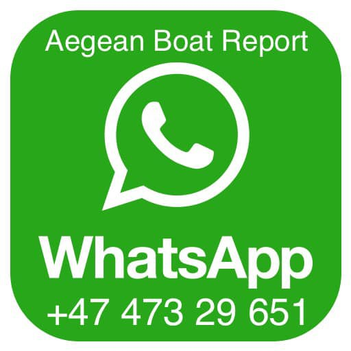
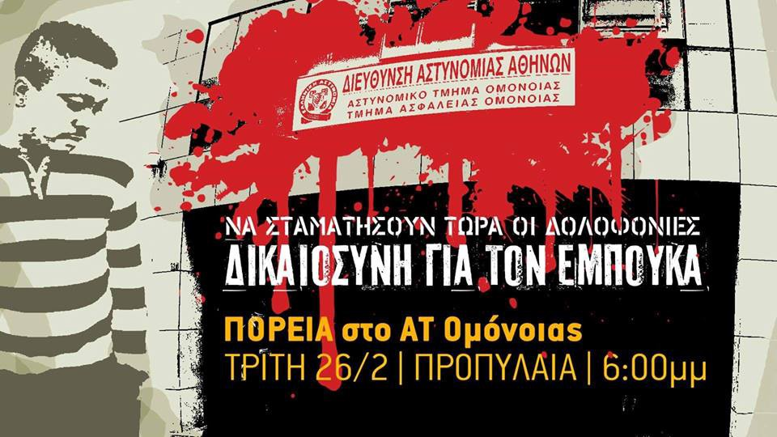

### AYS Weekend Digest 23–24/02/2019 IOM complicit in mistreatment of people on the move in Bosnia

People freezing in mountain detention centre in Libya /// Deportation halted in Germany /// \#Moria8 found not guilty /// Protests planned in Athens /// Videos from Moroccan detention centres /// Refugee status becomes provisional in Denmark…

 \)](assets/560d47feb0d/1*abUGaXE1r0xyaYQ_4p1qow.jpeg)

Wall in Calais \(Photo by [Refugee Rights Europe](https://www.facebook.com/RefugeeRightsEurope/photos/pcb.1990901097883392/1990901007883401/?type=3&theater) \)
#### FEATURE: Bosnia — IOM complicit in mistreatment of people on the move

They came to pick them up early on Saturday morning when half of the people were sleeping\. All at once security and [IOM \- UN Migration](https://medium.com/u/664cb26312d4) personnel started to wake them up and randomly push and hurry them out towards the buses that were waiting in the front of the camp\. They had to run and leave all their belongings, including clothes and shoes they were given previously by volunteers and locals\. These possessions were not easily gotten, as in the camp people rarely get anything; not even enough food\.

 \)](assets/560d47feb0d/1*c_K35aklpBHOQ3MF2cPowQ.jpeg)

Velecevo \( [Crveni Križ Općine Ključ](https://www.facebook.com/profile.php?id=100009318317491&__tn__=%2CdlC-R-R&eid=ARCdx4UYOPvIMRONGJEnVJ3HHA8gz1HNYHF4kUT4tNUYCF0Ri2tD7Pyj0fFJjXD-3KPnhz6p2vw9aX7W&hc_ref=ARRVSwxh-KUaN9ESGaqVbU1tIptg8_8fYb221nqIy5ib4MWGTgDSPmj2FD-GAF2a19Y) \)

On Saturday morning about 200 people were taken from camps Bira and Miral, all against their will, and transferred to the camp Usivak near Sarajevo\. Sources have told us that not enough beds and bedding were prepared for them and many slept with nothing the first night in this camp, despite facing freezing temperatures\. The camp is located under a mountain, in an area where the sun hardly ever comes out\. Sufficient reception conditions were not made despite previous acknowledgements from local authorities and IOM officials that current supplies were not enough to support the new arrivals\.

However, the situation for those transferred and existing residents of the camps has been met with little sympathy or compassion by camp authorities\. The head of IOM, speaking for the local media a week ago, announced that many of the problems faced in the camp are the fault of problematic camp residents, commenting that those who are making problems should be taken to the immigration centre in Sarajevo, which is a closed facility\. This was said after a big fight broke in Bira when over 30 people were injured\. Fights like this are not uncommon, often happening in both Bira and Miral camp\. According to the IOM however, it is fault of a group of people, rather then the unbearable circumstances which exist in IOM run camps in Bosnia\. IOM have still to comment on their failure to provide safe and adequate accommodation in their facilities, despite receiving huge amounts of funding to do so\.

In Bira, over 2200 people are currently living in the camp, while in Miral there are around 900\. Both camps are located in former factories, hastily improvised and without sufficient minimum living conditions\. The camps are dark and dusty, with limited number of toilets and showers in both places\. People have no privacy, and they often complain about the treatment they get from both security and IOM staff\.

Nevertheless, people are willing to stay there while waiting for the right time to try again to cross to Croatia\. If they are sent back to Sarajevo, they face a longer journey before they can cross the border, making the attempts even more difficult\. Many do not have enough money to pay to go again to Bihac\. Even if they do, unlawful practices by the local police in Bihac do not permit them to come back\. Since October, police posted check\-point in Veleceve area where buses are stopped and people taken out and left by the street, with the only help available being provided by local people\. This weekend, a woman from Syria, mother of two, was among those left on the street\.

 \)](assets/560d47feb0d/1*Ot-dkX-YZ3kc-v-ncfW3kw.jpeg)

Velecevo check\-point — Syrian women left alone after taken from the bus Sarajevo — Bihac\. \(Photo by [Crveni Križ Općine Ključ](https://www.facebook.com/profile.php?id=100009318317491&__tn__=%2CdlC-R-R&eid=ARCdx4UYOPvIMRONGJEnVJ3HHA8gz1HNYHF4kUT4tNUYCF0Ri2tD7Pyj0fFJjXD-3KPnhz6p2vw9aX7W&hc_ref=ARRVSwxh-KUaN9ESGaqVbU1tIptg8_8fYb221nqIy5ib4MWGTgDSPmj2FD-GAF2a19Y) \)

On Saturday, the evacuations came with no warning\. People were taken randomly, others were threatened that next time it will be them on the bus\. This random approach meant that families were separated, sick people pushed out from their beds\.

While the people were forcefully taken, one young man from Afghanistan wrote this message to a friend in Bihac:

> “they are behaving like we are animals\. I am really scared\. This is first time I am so scared in my life\.” 

Some others tried to run and hide, some were hiding the entire weekend and did not know what was happening\.

Over the last couple of weeks the level of hate speech has increased in local media, while some people are becoming openly hostile towards refugees and migrants\. Yet solidarity is still strong, and many locals are actively involved in establishing a strong network and providing help\.

Many people are very critical of the role IOM is playing, and their approach in helping Bosnian authorities deal with people on the move\. Most criticism is focused on the lack of transparency in their work, and the conditions they created in camps\. So far, most of the money donated for people on the move in Bosnia is distributed by the IOM, while the state has a limited role\. Publicly, IOM claims that the state should take all the responsibility, though how this would happen when IOM holds all the funds is unclear\. The UNHCR, the second biggest international organization who received donor money in Bosnia, remains quiet about the situation in the country, failing to comment even when it comes to huge human rights violations people on the move face\. Whilst these organisations remain silent, the situation continues to deteriorate and it is becoming increasingly difficult for those trapped within the country’s borders\. International organizations are doing little, indeed nothing, to silence this hostile atmosphere or to be more critical toward the local governments\. All the while refugees and migrants are stripped of all their most basic rights, and people who are helping them are increasingly portrayed as enemies\.

The government in Bihac claims that existing capacities in this area are full and they are demanding that people are distributed in other cities, too\. However, due to the close proximity of the border everybody wants to be in the Bihac area\. It remains hard to say if there is capacity to accept all the people\.

The transfer of people from Bihac and Kladusa was done together with IOM and local governments\. The process of these transfers was humiliating for many people, and, once again, actively created victims\. While the IOM and government in Bosnia are shifting the guilt from one to another, it has to be said that the way humans are being treated in Bosnia at the moment, including many people who need special protection, is something both parties should be ashamed off\. Likewise, the UN agencies who remain silent, refusing to speak out about these human rights violations should recognise that by doing so they become complicit in the ongoing violence shown toward vulnerable populations on the move\.

LIBYA
#### 800 people in Zintan detention centre freezing in the snow

Over the weekend snow has blanketed mountainous areas of the country\.

■■■■■■■■■■■■■■ 
> **[Anette Kjær](https://twitter.com/Billedramme) @ Twitter Says:** 

> > 800 refugees are freezing in Zintan prison in the mountains of Libya. -We have snow inside our hangar and the blankets are white with ice. We are all sick with a flue and many have TB. Help us. Where are UNHCR? 

> **Tweeted at [2019-02-24 08:14:16](https://twitter.com/billedramme/status/1099583275218206721).** 

■■■■■■■■■■■■■■ 

TURKEY
#### People rescued on the Turkish coast

[Aegean Boat Report](https://www.facebook.com/AegeanBoatReport/videos/551104575396881/?v=551104575396881) inform that on Saturday, 11\.00, a group of people were picked up by the Turkish Coast Guard in a remote area near Ayvalik\. They had been heading towards Lesvos north east when bad weather made them turn back\. 28 people \(7 children, 10 women and 11 men\) were rescued\.

MOROCCO
#### Inhumane conditions in Arekmane detention centre, Nador

Association Marocaine de Droits Humains published a [video from inside the confinement centre of Arekmane in Nador](https://www.facebook.com/AmdhNador/videos/237639790447322/?eid=ARD1HcBgdihsMU8QW7K-cg6AZBgX3knTPbKawYDjqp-7v2HkseNnpSzORupsL0l4ZFEdCLI8TqCzKKYl) , where dozens of sub\-Saharan migrants are still detained pending their deportation\. The conditions in the centres are inhumane, with sick migrants locked up, without any medical care provisions\. Authorities continue to prohibit AMDH Nador from visiting this centre\.
#### Two bodies of migrant women discovered in the Nador province

AMDH — Nador [report that two bodies of sub\-Saharan women were discovered](https://www.facebook.com/AmdhNador/photos/a.1693125780899690/2279562175589378/?type=3&__xts__[0]=68.ARAemf6r5LHXXhx6veiZfmQNLE3BAr9EpvXRlAWTiEp1O44fou2bpqV1CdPhrdvkUyoK6Jb-oxBQMd6Db3QGyWaRdbimthdqSXm9PHv7uuOc1rO6z3h4RPTT0hE18oTqbuIe-ReVoVTNDJGWEf4okfL6EvkyIYj0_XtfFClQK5DDiaFEaI9ftXho1ypaIsXvUQsPwP8qoABhOy06XPzSKMrjOQFwT42kuPceP98Xevro4BUJ4t30jKUOfO9Uxkgk4byF4m9L54v_udBmt7k0jfu8k_5KL9WnvFay5uM-wcICfSn71yqnQGMizTncc8ykO16MxC8c0YWCoS9dR1QNnmXi7KdQ&__tn__=-R&hc_location=ufi) over the weekend in the Bni Bouifrour area, in the Nador province\.

> “Amdh Nador, who has several times called for action on the increasingly dangerous activities of Mafia Networks, demands the Moroccan authorities to open a transparent investigation and arrest the big traffickers instead of focusing their repressive actions on simple migrants\. 

> Amdh Nador launches a call for testimony for all migrants knowing these two women\.” 

SEA
#### 48 people rescued in the Alboran Sea

After some [distress calls](https://twitter.com/HelenaMaleno/status/1099286551543140357) over the weekend, the Spanish coast guard, Salvamento Maritimo, [rescued 48 people](https://www.europapress.es/andalucia/noticia-trasladan-motril-granada-48-personas-ellas-dos-ninos-rescatadas-patera-mar-alboran-20190223174525.html) and brought them to the Spanish port of Motril, near Granada\.

Local media [report](https://twitter.com/EFE_Canarias/status/1099252438333296640?fbclid=IwAR1ZX0_AwBB3UTrRpAdZG4u6UQgOx6xeBaify2rw3BJizyQ0n38yyEF5VRM) also that 7 people landed on the island of Gran Canaria\.

GREECE
#### **Arrivals**

[Aegean Boat Report](https://www.facebook.com/AegeanBoatReport/posts/530139844175791?hc_location=ufi) have noted the arrival of 461 people on the Greek Islands this weekend\. This consists of 4 boats arriving to Lesvos carrying 233 people, including 128 children\. 4 boats arriving to Samos, carrying 177 people, and 2 boats arriving to Chios, carrying 51 people\.

[Refugee Rescue/ Mo Chara](https://www.facebook.com/RefugeeRescueUK/posts/2098217570245682?hc_location=ufi) have noted that Saturday saw the highest number of arrivals in one day this year so far, despite awful weather conditions\. The harsh weather, which saw high winds and heavy rain, resulted in worries that the situation could end up emulating that of the recent tragedy which saw the death of a teenage girl along the same stretch of water\. However, despite some people being initially unaccounted for, it seems everyone was finally found safe, albeit soaking wet and freezing, and taken to the transit camp\.

Aegean Boat Report is calling out for support to continue doing their work, highlighting the importance of continued reporting on the arrivals of people to the Aegean Islands, which are no longer reported on by mainstream media, the crisis being long forgotten\.

They stress the importance of information sharing, especially in the face of violence and suppression by the Greek government and police towards those on the ground trying to spread the word\. ABR are asking for people to send any information to either their email at [**aegeanboatreport@hotmail\.com**](mailto:aegeanboatreport@hotmail.com) or their WhatsApp number in the picture below \(they can only receive WhatsApp messages and not phone calls on this number\) \. Information can be either anonymised or accredited\.

#### **Weather Warnings**

Weather warnings [have been issued](https://www.keeptalkinggreece.com/2019/02/24/weather-greece-crete-cyclades-dodecanese/?fbclid=IwAR3G5H0bn7b35PDjDxNRhEX8h90i4xmF_g5r4jB_sEBgdIpVJ6PJN6QKEXg) for the South Aegean Sea, with forecasts of powerful rain storms, thunder and lightning, and heavy snow across mountainous areas of Southern Islands such as Crete, and the islands grouped within the Cyclades and Dodecanese\. This weather is forecast to hit Monday 25th February in the afternoon, and ships have remained docked, due to sea traffic being halted as a result of the dangerous weather conditions\.
#### The Moria8 have finally been found not guilty

The Moria 8, who were arrested on the 19th March 2018, have finally been [found not guilty and acquitted of all charges](https://dm-aegean.bordermonitoring.eu/2019/02/23/moria-8-declared-innocent/?fbclid=IwAR1ESvvnoznz5U5cvxzmAO0LZXoIhRt3dBUAm3e8DWmX2yqCfdwB-hYHex0) \. The 8 men were arrested during protests in Moria camp on the 14th March 2018, accused of arson and attacking the police\. They have been unfairly detained since their arrest, for just over 11 months, some in detention cells and some in prison\. Though they lost nearly a year of their lives due to these harsh detention measures, it took only 1 and a half hours to find them not guilty\. Vici Angelidou, the lawyer of four of the accused stated:

> “The judge and the jury did not even have a meeting in order to take their decision, they looked at each other and made it directly in about ten seconds\.” 

Two of the men had alibis showing they were not even present in the camp during the riots, which were ignored at the pre\-hearing following the arrests and failed to halt the prolonged period of detention\. Neither were any of the accused identified by the police on duty at the time\. Instead, the men were accused based only on one testimony from another camp resident, who 8 months after the arrests released a video admitting he had been wrong and apologising for his actions in falsely accusing the 8 men, blaming his actions on troubles he faced in the camp and on Lesvos\. After this admission he was transferred to the mainland by the police\. At the trial 11 of the 17 police officers who had been on duty during the riots confirmed they did not recognise the defendants\. The president of the High Court who was leading the trial stated:

> “Police officers in Mytilene do strange things I cannot understand\. They took people to prison because of one testimony that does not justify this\. Every now and then, they send people to the High Court without any reason\. There is no case\.” 

Though it seems this time the judge was on the side of those convicted, this is the same person who convicted 32 of the [Moria 35](http://legalcentrelesvos.org/category/news/moria-35/) a year ago, despite there being little evidence against them\.

Deportation Monitoring Aegean have made this statement, denouncing the racist actions of the police on Lesvos:

> “ **The judge found clear words for denouncing the injustice happening on Lesvos, where migrants are frequently targeted by police and can be detained up to 18 months without any investigation\. Still, the practice of random arrests and legal accusations has not stopped\. There will be more court cases against refugees from Lesvos Islands on 28th of February, 9th of May and 10th of October 2019\.** 

> **We demand the police and the court of Mytilene to stop these crackdowns on refugee protests and the criminalization of people seeking international protection in Greece\!”** 

#### **Important Legal Decision on Lesvos**

A milestone decision has been reached at a court on Lesvos, which saw the legal recognition of gender for a trans refugee woman\. [HIAS HELLAS have reported](https://transgendersupportassociation.wordpress.com/2019/02/19/%CE%B4%CE%B5%CE%BB%CF%84%CE%B9%CE%BF-%CF%84%CF%85%CF%80%CE%BF%CF%85-hias-%CE%B5%CE%BB%CE%BB%CE%AC%CE%B4%CE%B1%CF%82-%CF%83%CF%85%CE%B4-%CE%BC%CE%B5%CF%84%CE%B1%CE%B2%CE%BF%CE%BB%CE%AE-%CE%BA/?fbclid=IwAR0-SMWpXZrC-2-DhCFSjbJazVheBZQTwd5Us98sZFLeMzroQCOoLHa-w8M) on the court decision which allowed for the changing of official gender on all documents, allowing the gender identity of the woman to match all official documents\. This ruling marks an important recognition for trans people fighting for their right to be recognised by the gender they identify with, avoiding further trauma and discrimination for people\.
#### **Protest in Athens**

Ebuka, a Nigerian migrant and a husband and father to 2 children, died at the hands of the police inside Omonia police station earlier this month\. The police then tried to cover up the incident by misleading Ebuka’s wife to his whereabouts, sending her to many different police stations before a lawyer intervened and she learnt the true fate of her husband\. It was also police at this station who were involved in the [cover up and murder of Zak Kostopoulos, a trans rights activist, a few months ago](http://i-base.info/htb/35047) \.

> We demand justice for Ebuka, the complete clarification of the conditions that led to his untimely death, the complete forensic report, with forensic advisors, appointed by his family\. 

> We demand an end to the Greek police’s barbarity, and an end to the murders\. 

> Solidarity to refugees and immigrants 

> Solidarity to the family of Ebuka 

Following on from last Thursday’s protest another protest will take place on Tuesday 26th February outside of the police station in Omonia, at 6pm, to continue pressure to hold these police accountable for their actions\. Full details can be found [here\.](https://www.facebook.com/events/2493809523966912/)
#### **Police Violence in Leros**

No Borders group has published a video capturing violence by police towards detained refugees on the island\.

■■■■■■■■■■■■■■ 
> **[NoBorders](https://twitter.com/Refugees_Gr) @ Twitter Says:** 

> > Βίντεο που μας έστειλαν/πιθανόν μετά τον άγριο ξυλοδαρμό από την αστυνομία, υπό κράτηση προσφύγων 21 ή/και 22/2 στη Λέρο μετά από αίτημα για την απελευθέρωσή τους.
VIdeo from #Leros island #Greece police violence against detained #refugeesgr #antireport
[youtube.com/watch?v=uGNt0E…](https://www.youtube.com/watch?v=uGNt0E_oR4Q&feature=youtu.be) 

> **Tweeted at [2019-02-22 19:59:29](https://twitter.com/refugees_gr/status/1099035974066147329).** 

■■■■■■■■■■■■■■ 

#### **Attacks in Chios**

There has been [reports](https://www.facebook.com/photo.php?fbid=2483101125037393&set=a.826592374021618&type=3&theaterhttps://www.facebook.com/photo.php?fbid=2483101125037393&set=a.826592374021618&type=3&theater) of an attack in Chios, close to Vial camp:

> _“_ Last night around 9:30 pm, while I was walking, suddenly six guys riding three motorcycles, they threw eggs on my face because I’m a refugee\. Is this the humanity and the safe place which I’m went to to be safe\.
 

>  Why this racism ? What I did to them?
 

>  This time is egg, what the next will be?\!
 

>  I just need to live in a safe place, not more\.” 

These types of attacks are unfortunately not uncommon, and go to show another aspect of discrimination and persecution refugees continue to face whilst trying to live peacefully in Greece\.
#### **Photos from Moria**

An update from a camp resident on the situation in Moria camp on Lesvos, which continues to see people living in the freezing weather in tents, without electricity or safe accommodation\.

> “This is The Moria Camp situation we do not have electricity The weather is very cold, I have nothing to say when I hear children crying the weather is cold , I took this photo this moment\!” 

 \)](assets/560d47feb0d/1*UOPIkLDFyMpkJdBPtcrLeg.jpeg)

Moria Camp \(Photo by [Farid Ahmad Behzad](https://www.facebook.com/groups/763313107147281/permalink/1707662516045664/?hc_location=ufi) \)

**Callout for Volunteers for Light Without Borders at Moria**

Light Without Borders are in need of optometrists and ophthalmologists for the clinic at Moria camp in Lesvos\.

Please contact LWB for further information at: info@lightwithoutborders\.org\.es

LWB is also looking for a data base glasses coordinator and an extra Farsi/English interpreter\.

For full information please see [here](https://www.facebook.com/groups/informationpointforlesvosvolunteers/permalink/1066390436901736/?hc_location=ufi) \.

ITALY
#### Humiliated in the hospital

Souleymane Rachidi, a young man from Côte d’Ivoire, who lives in the province of Salerno, [posted a video](https://www.facebook.com/SRofficiel1998/videos/1150237788482851/UzpfSTEwMDAwNjQwMjYwMTczNDoyNjA2NDAzODM5NTgzMDEx/) in which he is repeatedly humiliated with racist insults, in the emergency room of the hospital in which he tried to get help for chest pains\.

“You must die, go back to your country”, was what he was told by medical personnel\.

Francesco Borrelli, regional councillor and member of the health commission stated that this is “unacceptable behaviour”\. If the incident will be confirmed he will ask for the suspension of those responsible\.

BALKANS
#### Weather forecast for Monday 25/02

MONTENEGRO — Predominantly sunny in the south, and predominantly cloudy with sunny intervals in the north\. Wind moderate to strong with locally strong gusts, blowing from the south\. Lowest temperatures from \-13 to 1 and highest daily from \-5 to 13 degrees\.

SERBIA — In the morning cold with light to moderate frost, in the mountains moderately cloudy with chance of snow\. During the day predominantly sunny and warmer\. Wind weak to moderate, in the north changeable, blowing from the north and northeast\. Lower temperatures from \-10 to \-4 and highest daily from 2 to 7 degrees\.

BiH — Moderately to predominantly cloudy in Bosnia, chances of snow in the mountains, alongside increased cloudiness\. During the day it will become less cloudy\. In Herzegovina moderately lightly to moderately cloudy and sunny but before noon more cloudy in the north\. Wind in Bosnia weak from the north and northwest, in Herzegovina and southwestern Bosnia moderate to amplified and with hurricane like gusts\. Lowest temperatures from \-7 to 2 and highest daily from 2 to 11 degrees\.

CROATIA — In Dalmatia sunny, in the northern coast predominately sunny\. During the night more cloudy and local possibility of precipitation\. Wind mostly weak, locally moderate to strong, blowing from the northeast\. Alongside the coast moderate to strong Bura with hurricane like gusts and weakening towards the end of the day\. Lowest temperatures from \-6 to 5 and highest daily from 4 and 9 degrees\.

AUSTRIA
#### **Deportations to Kabul**

Afghanistan and Migrants Support and Advice Org have [confirmed the deportation](https://www.facebook.com/AmasoAfg/photos/a.1419588361404777/2362245780472359/?type=3&theater) of a group of people that took place on Saturday the 23rd February, though they were able not able to confirm the number of people on the flight to Kabul at this time\.

GERMANY
#### Deportation halted in Frankfurt

■■■■■■■■■■■■■■ 
> **[twentyonemiles](https://twitter.com/twentyone_miles) @ Twitter Says:** 

> > Frankfurt Airport: Air Algérie pilot refuses to take off with a women, 8 months pregnant, who is being deported. The woman, her husband and their two young daughters were taken off the plane #StopDeportation 

> **Tweeted at [2019-02-23 20:44:46](https://twitter.com/twentyone_miles/status/1099409755104251905).** 

■■■■■■■■■■■■■■ 

#### Demonstrations in Germany

■■■■■■■■■■■■■■ 
> **[Sea-Watch](https://twitter.com/seawatchcrew) @ Twitter Says:** 

> > Klare Ansage aus der #Südkurve des #FCBayern: #Seenotrettung ist kein Verbrechen! 🧡 #FCBBSV #MiaSanMia 

Foto: @[AZ_Strasser](https://twitter.com/AZ_Strasser) https://t.co/NUMEBmxJny 

> **Tweeted at [2019-02-23 18:44:56](https://twitter.com/seawatchcrew/status/1099379596842205184).** 

■■■■■■■■■■■■■■ 

There have been multiple protests in Germany against the criminalisation of sea rescue\. [Local media report](https://www.mdr.de/sachsen/dresden/dresden-radebeul/demonstration-seenotrettung-dresden-loschwitz-100.html?fbclid=IwAR0wjm5szcv62qcCVtMN-hm5cCC2ZfPSqpXiKMRS75-rRpUZ00Ot9f3zdic) that 150 people demonstrated in Dresden on Saturday [in support of Mission Lifeline](https://www.facebook.com/seenotrettung/videos/vb.111682292571652/2252819774978429/?type=2&theater) who have been dealing with several different court cases\. There is a move to remove their charitable status in Germany and a further court date on the 21st of March in Malta\. None the less Reisch and his team will be awarded the Lew Kopelew Prize for Peace and Human Rights 2019 in Cologne on the 7th of April\.
#### Vigils for those who have died at sea

There will be [vigil](https://www.facebook.com/VereinFAIR/posts/2063754700326899?hc_location=ufi) s held for those lost at sea on February 28th and March 14th at the kornhausplatz in Bern\. Each will be from 18\.45–19\.15\.

FRANCE
#### New Report on Calais

Refugee Rights Europe have created a [brief timeline of the situation in Calais moving from 1994 to present day](https://www.facebook.com/RefugeeRightsEurope/photos/a.1502441746729332/1988290611477774/?type=3&theater) \. It provides a valuable insight into the continued failure of state actors to protect and care for people on the move and clearly shows that their actions have been continuously damaging\.

> Since 2016 our research in Northern France has shown a situation characterised by harmful living conditions, a lack of information and security and continued reports of violence and discrimination\. 

You can read the full report [HERE](http://refugeerights.org.uk/wp-content/uploads/2018/10/History-Of-Calais_Refugee-Rights-Europe.pdf) \.
#### Refugee Community Kitchen

RCK have been struggling over winter and are doing a call out for donations and volunteers\. They are currently providing over 9,400 meals a week\.

More info on how to help [here](https://www.facebook.com/JanieMac1/videos/10161387671575384/) \.
#### Litter Pick in Grande\-Synthe Woods

A group are planning to clear rubbish from an area of woodland often used by people after police evictions\. The litter pick will be on the 1st of March the 9th\.

More info [here](https://www.facebook.com/groups/CalaisMigrantSolidarityActionFromUK/permalink/2498543336887065/?hc_location=ufi) \.
#### Court Case of French Man Patras

A French man will be tried in absentia on March the 1st in Patras, Greece for aiding his in\-laws when they were trying to leave Greece\. They had already completed the perilous journey from Syria to Greece and were successful in the onward journey\. They have now been granted asylum in France\.

More info in French [here](https://www.ladepeche.fr/2019/02/22/nouveau-proces-un-albigeois-risque-la-prison-en-grece-pour-avoir-aide-ses-beaux-parents-syriens,8031561.php?fbclid=IwAR0KLRstChPSk-ofWikg7suyQbmS3nVLNxiSLj14AAXHLgdzebr1yr1rCUc) \.
#### Petition for Zia

Zia, a young boy from Afghanistan who we mentioned in our [feature](ays-daily-digest-22-2-19-cries-for-help-from-behind-the-bars-of-detention-centres-29a8b2d0281d) yesterday, now has had a [petition](https://www.change.org/p/madame-la-pr%C3%A8f%C3%A8te-du-cher-pour-que-zia-reste-en-france?recruiter=468078654&utm_source=share_petition&utm_medium=copylink&utm_campaign=share_petition&fbclid=IwAR338f-cCbKAszC1hlAJYDtgcHIywn0G_NppnSTSoyLNTRLqdw-UtiWkxcg) set up in his name to prevent his deportation to Afghanistan on the grounds that he has learning difficulties and has also been diagnosed with PTSD and depression\. Please sign [here](https://www.change.org/p/madame-la-pr%C3%A8f%C3%A8te-du-cher-pour-que-zia-reste-en-france?recruiter=468078654&utm_source=share_petition&utm_medium=copylink&utm_campaign=share_petition&fbclid=IwAR338f-cCbKAszC1hlAJYDtgcHIywn0G_NppnSTSoyLNTRLqdw-UtiWkxcg) \.

DENMARK
#### New bill leaves refugees granted asylum in a state of uncertainty for years

Last week, a [new bill was passed in the Danish Parliament](https://www.dr.dk/nyheder/politik/paradigmeskiftet-vedtaget-i-folketinget-her-er-stramningerne-paa-udlaendingeomraadet?fbclid=IwAR291e_HaIM1J7TGysUiwUvjH9DQExG3-350-QW7IkgHrrARlvYbt80J1kw) , introducing a series of discriminatory policies towards refugees residing in Denmark\. The bill is characterised by leaving refugees in “provisional” and uncertain states even after they have been granted refugee status\.

Next week — when the law will come into force — **all residence permits granted to refugees will become temporary, meaning that these can be revoked or not extended as soon as the home country is considered ‘safe’** \.

Amnesty International Denmark criticises the uncertainty of these policies, and asks for how long one will have to stay on a temporary residency with the risk of having it revoked\. 10 years? 20 years? However, there seems to be **no clear answer to this question\.**

Financial support for refugees will be capped, leaving families in poverty, and given the symbolic name ‘repatriation allowance’ \(hjemrejseydelse\), instead of integration allowance\.

Moreover, municipalities will no longer be obliged to provide permanent accommodation for refugees\. Instead, it will be sufficient to provide temporary accommodation, which is generally in much worse condition\.

The minister of immigration and integration, Inger Støjberg, will be able to cap the number of family reunifications\. Besides this, the bill also includes further restrictions and heightened prison sentences for those living in Danish deportation centres, if they do not comply with their duty to report their presence at the centre three times a week\.

This bill has been strongly criticised by local activists and NGOs\. Psychologist Helena Lund, of [‘Dignity — Danish Institute Against Torture’](https://dignity.dk/blog/paradigmeskiftets-skraemmende-konsekvenser-i-praksis/?fbclid=IwAR1gEERtxvuDWQxSEd7jlZ8-FQMmuyGPIl0K1qDOVP6L4q-1xkdOn5e20ZI) writes:

> Already a week after the presentation of the bill, I met clients panicking of the thought of being sent back to the country they fled, which many describe as a ‘country in ruins’\. \[…\] Fathers tell about neighbours, colleagues and friends who have been tortured and executed in front of their families; families that are already split up\. \[…\] 

> So when they \(the politicians\) talk about ‘the resourceful refugees should go back and rebuild their country, it is not only bricks and walls, but also community, relations, families that have been broken”\. 

GENERAL

According to [mainstream media](https://www.theguardian.com/world/2019/feb/24/african-union-seeks-to-kill-eu-plan-to-process-migrants-in-africa) , The African Union is fighting to dissuade North\-African states to cooperate with the EU’s plans for “regional disembarkation platforms” on African soil\. The AU claim that such platform would breach international law, by establishing “de facto detention centres”, trampling over the rights of those being held\.

Libya is already complying with the EU’s plans, with at least 20,000 people imprisoned in detention centres\. The inhumane conditions in such centres have been reported many times and were defined as “unimaginable horrors” by a recent UN report\. Morocco and other coastal countries have already rejected the EU’s proposal, but “there are concerns within the African Union \(AU\) that other member governments could be persuaded by the offer of development funds”\.

**We are an entirely volunteer\-run media team, and we rely on our supporters to share our news\. So please share, and never forget to ACT\!**

**We also publish weekly summary digests in Persian and Arabic\.** 
**Please, read and share the ones for the week of February 11–17:** 
**in [Persian](%D8%A8%D8%AF%D8%AA%D8%B1-%D8%B4%D8%AF%D9%86-%D8%B4%D8%B1%D8%A7%DB%8C%D8%B7-%D8%AF%D8%B1-%D9%85%D8%B1%D8%B2%D9%87%D8%A7%DB%8C-%D8%A7%D8%B1%D9%88%D9%BE%D8%A7-c1dbe5f6479c) and in [Arabic](%D8%A7%D9%84%D8%B8%D8%B1%D9%88%D9%81-%D8%AA%D8%B2%D8%AF%D8%A7%D8%AF-%D8%B3%D9%88%D8%A1%D9%8B-%D8%B9%D9%84%D9%89-%D8%AD%D8%AF%D9%88%D8%AF-%D8%A7%D9%84%D8%A7%D8%AA%D8%AD%D8%A7%D8%AF-%D8%A7%D9%84%D8%A3%D9%88%D8%B1%D9%88%D8%A8%D9%8A-9121e6961516) \.**

**We strive to echo correct news from the ground through collaboration and fairness\.**

**Every effort has been made to credit organisations and individuals with regard to the supply of information, video, and photo material \(in cases where the source wanted to be accredited\) \. Please notify us regarding corrections\.**

**If there’s anything you want to share or comment, contact us through Facebook or write to: areyousyrious@gmail\.com**

_Converted [Medium Post](https://medium.com/are-you-syrious/ays-weekend-digest-23-24-02-2019-iom-complicit-in-mistreatment-of-people-on-the-move-in-bosnia-560d47feb0d) by [ZMediumToMarkdown](https://github.com/ZhgChgLi/ZMediumToMarkdown)._
