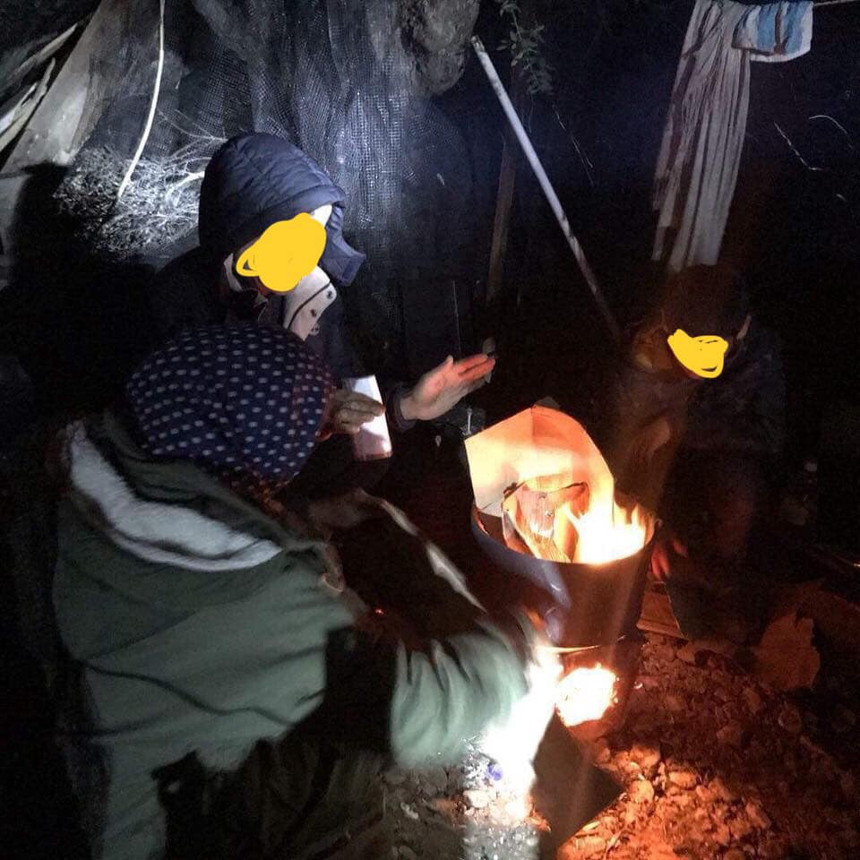
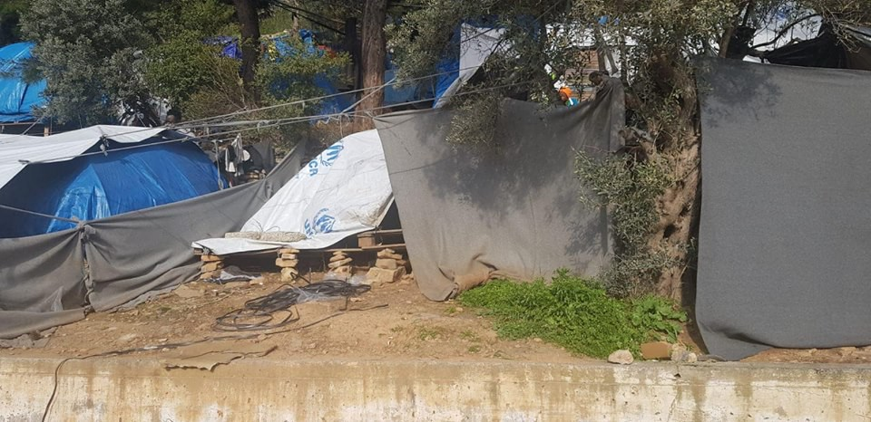
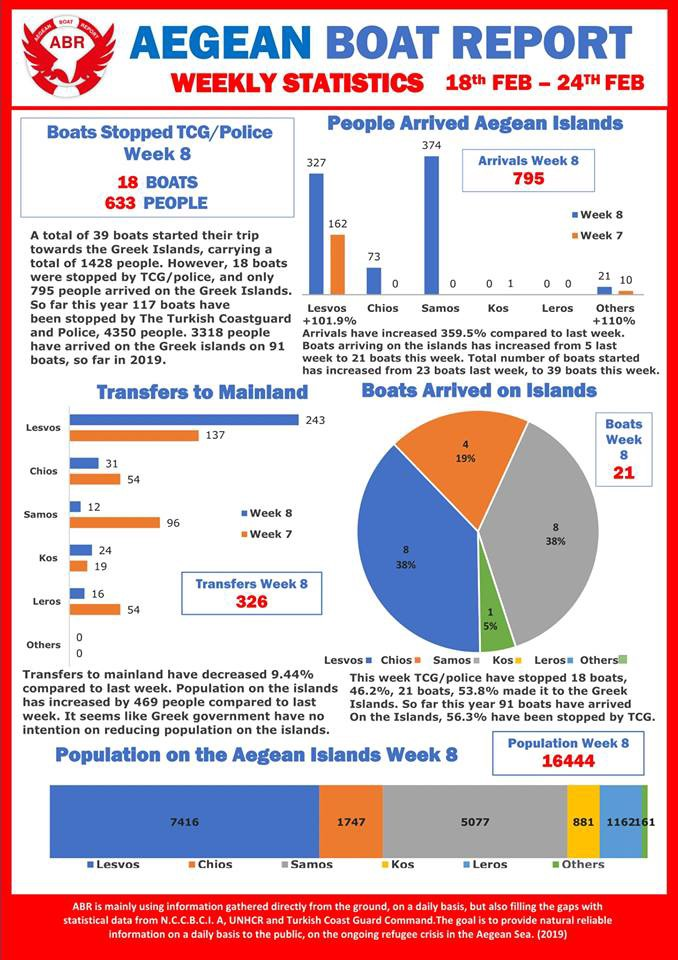

### AYS Daily Digest 25/02/2019 Nothing has changed on the Greek Islands

More legal hassle for SeaWatch /// People on the move face hate crimes in Eastern Germany /// 2,500 Gambian migrants to be deported from Germany /// Vulnerable children in unsuitable conditions in Italy and France

 \)](assets/c70b1da592fd/1*3W-FUUhnYQNK8PiQkVpH9g.jpeg)

\#NoBorders, by Mahmoud Rifai \( [ArtAgainst](https://www.facebook.com/artagainstproject/photos/a.639651369417634/2085742871475136/?type=3&theater) \)
#### Nothing change on the Greek Islands

Despite continuous claims by the Greek Government and EU authorities, and while still remembering [embarrassing statements of the Greek Prime Minister Alexis Tsipras being proud of the living conditions of refugees on the islands](https://greece.greekreporter.com/2017/11/24/greek-pm-tsipras-i-am-proud-of-living-conditions-of-refugees-on-the-mainland/) , nothing there seems to change…

According to [National Statistics](http://mindigital.gr/index.php/%CF%80%CF%81%CE%BF%CF%83%CF%86%CF%85%CE%B3%CE%B9%CE%BA%CF%8C-%CE%B6%CE%AE%CF%84%CE%B7%CE%BC%CE%B1-refugee-crisis/3625-national-situational-picture-regarding-the-islands-at-eastern-aegean-sea-24-02-2019) 15,493 people are still on the facilities on the islands: 7252 on Lesvos, 1741 on Chios, 4294 on Samos, 1173 on Leros, 995 on Kos and 72 on other islands\.

**We learned to mistrust such statistics, especially while — on February 25th — they still state that no one is living in makeshift camps\.**

 \)](assets/c70b1da592fd/1*VzwbFznGsRAy0QWCO4NtkA.jpeg)

Samos, \(Photo by [Aegean Boat Report](https://www.facebook.com/AegeanBoatReport/posts/530996540756788?hc_location=ufi) \)

 \)](assets/c70b1da592fd/1*bCqdUfs2W9j3eLMPJ7HT2A.jpeg)

Lesvos, \(Photo by [Aegean Boat Report](https://www.facebook.com/AegeanBoatReport/posts/530996540756788?hc_location=ufi) \)

On Sunday it was snowing on Lesvos and still around 7,000 people are living in inhumane conditions\.

 \)](assets/c70b1da592fd/1*DybgViD3JKlVM8ZaSs56lg.jpeg)

Lesvos, \(Photo by [Aegean Boat Report](https://www.facebook.com/AegeanBoatReport/posts/530996540756788?hc_location=ufi) \)

While government numbers count 4,294 people on Samos, ABR inform that it is likely that [more than 5,000 live on the island](https://www.facebook.com/AegeanBoatReport/posts/530978767425232?hc_location=ufi) , with [more than 1,000 children](https://twitter.com/samosvolunteers/status/1099980060487008257) without access to formal education or basic services\.

 \)](assets/c70b1da592fd/1*4mhh-gv7ULMkmf5Ze7Fvcg.jpeg)

Samos, \(Photo by [Aegean Boat Report](https://www.facebook.com/AegeanBoatReport/posts/530996540756788?hc_location=ufi) \)

MOROCCO
#### Authorities stop migrant convoys

 \)](assets/c70b1da592fd/1*tLrmP-e7YbeIGyQS3Oyf5w.jpeg)

\(Photo by [AMDH\-Nador](https://www.facebook.com/AmdhNador/posts/2280989112113351) \)

Two groups of sub\-Saharan people were [stopped by the police](https://www.facebook.com/AmdhNador/posts/2280989112113351) yesterday in the coastal town of Arekmane\. One group was of [30 people, the other of 40](https://twitter.com/alzoubeidi/status/1100073363589025793?fbclid=IwAR08WWopTJkbnzr5oNm3iGCYf-0ox_yP4s3Vz6resUDACdrMd-L7YYIqCOA) \.

SEA
#### Sea\-Watch still at bay

SeaWatch is now in France for maintenance operations\.

The Dutch government, the flag\-state of SeaWatch, lifted their illegal blockade of our ship in Italy, after being pressured by the rescue boat crew and their supporters\.

However, they still show every intention of arbitrarily hindering SeaWatch from resuming rescue operations even after planned maintenance in France ends\. [\#FreeTheShips](https://twitter.com/hashtag/FreeTheShips?src=hash)

■■■■■■■■■■■■■■ 
> **[Sea-Watch International](https://twitter.com/seawatch_intl) @ Twitter Says:** 

> > The potentially best-inspected ship on the 7 oceans of the world has again proved its suitability when standing a 6m wave underway to the shipyard. Unfortunately it's not clear when it can go back into operation, because #TheNetherlands still forbid us to sail into the #SAR-zone. https://t.co/hqhsuLGwD1 

> **Tweeted at [2019-02-25 09:26:03](https://twitter.com/seawatch_intl/status/1099963728748072960).** 

■■■■■■■■■■■■■■ 

MALTA
#### Mission Lifeline seek help in the dockyard

Mission Lifeline is looking for a cook to support the crew during maintenance operations\.

> You can plan and perform food and purchase for groups of up to 20 people? You want to volunteer in an ngo to meet our ship and meet our crew? 

> PERIOD 1: 04\.03\. \-18\.03\.2019
 

> PERIOD 2: 18\.03\. \-01\.04\.2019
 

> PERIOD 3: 01\.04\. \-15\.04\.2019 

If interested, contact them [HERE](https://www.facebook.com/job_opening/347598516097087/?source=post_homepage_stream&__xts__[0]=68.ARD2PWZNQ10R-ReDavI-bynwp-1NVgL7KubpVQHkSZQlVyAsPIWdxqnvU-bLKCEEn41ppCxeTSUk-nhgqcFNFAu3ISgDdnfxE-cTBUI_6rUcqBJKsd4dsBpqjX0_FI83TupWar1LH3IR_G7EyUin2T3fFWZcnZodAQZsXSl3mF4dsMxvAlys8Vdyz8EN-1Jiv0PPdG4t-KXEHXqpZUZAk5VtBZ2hM3Oa1wgmXZaHME2WaT2FXIVaqoReMzYaKoSxoBfOiILTnjQQ5KdHbayiNqJoHDat4F_yiTz4IaMJNLGHG8ABA8kDjZGS8pgxuSdUi18hCGL6V5w5ngtaZIGVe6RwxNumHNVSs290fwhEW4y0tA&__tn__=HH-R) \.

GREECE
#### Arrivals

■■■■■■■■■■■■■■ 
> **[Refugee Rescue](https://twitter.com/_refugeerescue) @ Twitter Says:** 

> > Gale force winds, 264 people with 144 children: the last 5 days have been physically and emotionally draining for both our Land and SAR teams.

As long as there is a need for emergency response, we are committed to Lesvos. But we need your help: [refugeerescue.co.uk/donate/](http://www.refugeerescue.co.uk/donate/) https://t.co/1XnAtFFrv3 

> **Tweeted at [2019-02-25 21:38:23](https://twitter.com/refugeerescueuk/status/1100148024615956480).** 

■■■■■■■■■■■■■■ 

#### Aegean Boat Report Fundraiser

The more the ‘refugee crisis’ is forgotten by mainstream media, the more the daily information on arrivals relayed by Aegean Boat Report is key to understanding the situation in the Aegean Sea and on the Eastern Greek islands\.

They are fundraising to support their activities, help them out [HERE](https://www.facebook.com/donate/2262549667345848/530935690762873/) \.
#### Fitness and sports activities on Samos

A group of volunteers is organising fitness and sports activities above the camp everyday between 12:00 and 14:00\.

Join them or contact them [here](https://www.facebook.com/groups/766219550168182/permalink/1875747825882010/?hc_location=ufi) \.

](assets/c70b1da592fd/1*6NNATzfdOY0x9z8sVUGXGw.jpeg)

Image by [Fanny Oppler](https://www.facebook.com/groups/766219550168182/permalink/1875747825882010/?hc_location=ufi)
#### Information on working in Greece

[Refugee\.Info published](https://www.refugee.info/greece/working-in-greece--greece/working-in-greece?fbclid=IwAR3EpzHGEXBZlzuFOABeBFXEGQntlZJIOaXEFAt3aBg_VD-rsCEDJfemH04) important information about rights to work in Greece\.

Read more [HERE](https://www.refugee.info/greece/working-in-greece--greece/working-in-greece?fbclid=IwAR3EpzHGEXBZlzuFOABeBFXEGQntlZJIOaXEFAt3aBg_VD-rsCEDJfemH04)

ITALY
#### Alternative accommodation unsuitable after eviction in Florence

Following up from the eviction of the Pergolino building on 21st February 2018, [MEDU — Medici per i Diritti Umani report](https://www.facebook.com/groups/47002095664/permalink/10156133461140665/) that the conditions in the alternative accommodation offered to those who had been residing in the evicted building are unsuitable, especially considering that among them there is a small child with a severe kidney malformation\.

> Despite what is reported to the press, not all vulnerable people have been adequately supported by the authorities, especially minors\. 

Villa Pepi, accommodation managed by Caritas, where the evicted families now ‘temporarily’ reside, is not adequate for the health situation of the child: there is mould in the rooms, there are no private bathrooms, maintenance works are underway in part of the building, with dust and rubble left in the common spaces, and ‘deafening noises’ near the child’s room\. There are no washing machines or a usable kitchen\.

**MEDU demands for the minor, together with his/her family, to be urgently transferred to suitable accommodation, where life\-saving therapies can take place\.**

SPAIN
#### Sea and land arrivals 1–31 January 2019, UNHCR source

 , from [UNHCR data](https://data2.unhcr.org/en/documents/download/68108) \)](assets/c70b1da592fd/1*KUQmQ19N8UF6Fn7buhEvDw.jpeg)

\(Image by [ACNUR Espana](https://twitter.com/ACNURspain/status/1100061334891315206?fbclid=IwAR3cyz9RvLsKDam8xMqQTPU_QwHhhkHLP3FEMvYEL3R9cTRo832tTkqy3UE) , from [UNHCR data](https://data2.unhcr.org/en/documents/download/68108) \)

BALKANS
#### Weather forecast for Tuesday 26/2

MONTENEGRO — Predominantly sunny or lightly to moderately cloudy\. During the night, gradual increase in cloudiness\. Wind weak to moderate from changeable directions, during the night locally amplified northern wind\. Lowest temperatures from \-11 to 4 and highest daily from 3 to 17 degrees\.

SERBIA — Clear and predominately sunny in the morning with moderate frost\. Increasingly more cloudy from the second part of the day starting in the north and spreading out across the country as the day progresses\. Chance of precipitation in the centre and south\. Wind weak to moderate from the north and northwest\. Lowest temperatures from \-7 to \-2 and highest daily from 6 to 12 degrees\.

BiH — Sunny before noon, during the second part of the day increasingly more cloudy from the north with chance of rain in the centre, east and northeast\. In the mountains weak snow\. Wind mostly weak to moderate from the west and northwest\. In Herzegovina and southeastern Bosnia moderate Bura\. Lowest temperatures from \-5 to 4 and highest daily from 6 to 16 degrees\.

CROATIA — Partly sunny, inland more cloudy from time to time\. Wind weak from the north and northeast, locally strong from the northwest, and along the coast moderate to strong Bura and northwestern wind\. Lowest temperatures from \-3 to 8 and highest daily from 11 to 16 degrees\.

GERMANY
#### Hate Crimes 10 times more likely in East than West

According to recent research from the Leibniz Centre for European Economic Research \(ZEW\) and [shared by Info migrants](https://www.infomigrants.net/en/post/15363/germany-s-east-10-times-more-unsafe-for-asylum-seekers?fbclid=IwAR1w1I7tTDLXZRwQ-N6Mwcaum2zCkKlAmL5hj1yQ9IjWphYrVwkgQW1g47E) , asylum\-seekers in eastern Germany are 10 times more likely to experience hate crimes than those who live in the west\. Hate crimes have included hate speech, offensive graffiti, physical assault, and arson attacks\.

The researchers believe the reasons behind the attacks are often historic and reflect past migration flows\. Areas less used to migration have higher rates of hate crimes\.
#### Gambian migrants in live in fear of deportation

A total of 2,500 rejected Gambian asylum seekers are due to be deported from the Baden\-Württemberg Region, [Gambian media reports](https://standard.gm/?p=53259&fbclid=IwAR2socVvOT9k8S-Lyg4mxYQX_CqdBNqKeLH3oeL5ImScdE4_RBoM0LOy4oo) in collaboration with a Gambian activist [Yahya Sonka](https://www.facebook.com/yahya.sonko.129/posts/3093505020734374?__tn__=K-R) and Gambians Refugee Association in Europe\. It is likely that deportations will take place at the end of February\. As a result, many are too scared to sleep in their homes, fearing that they will be taken in the night, and so are sleeping on the streets in the cold\.

FRANCE
#### Calais and Dunkirk

[The Refugee Women’s Centre](https://www.facebook.com/refugeewomenscentre/posts/591567497935551?hc_location=ufi) are looking for a psychological support coordinator\.

> You must be over 21 to apply and the deadline is the 25th of March\. 

> If you have any questions email them at: [supportus@refugeewomenscentre\.com](mailto:supportus@refugeewomenscentre.com) 

[Charitable Roots](https://www.facebook.com/charitableroots/posts/2869462913278299) have developed an App — [REFAID](https://www.facebook.com/refaidapp/?__tn__=K-R&eid=ARCSQtvZNuRTrEpyS1ug9kysf8gQ4Aq6QORSANjjCJ4HVqY_HiV-1b2sk0Eta6LTcvKTQqLIEYfYcsuE&fref=mentions) — for people on the move to help them find local services and they need help\.

> We are looking for people with either personal experience of northern France or good researching skills to add new useful points of interest to the app\. 

> If you would like to assist, please [PM us](https://www.facebook.com/charitableroots/posts/2869462913278299) for more details\. 

> If you are an organisation working on the ground in Calais, Dunkirk or elsewhere across Europe we recommend checking out the REFAID app and contacting the REFAID team to add your services to the ever expanding app\. 

#### Paris

[Solidarité migrants Wilson](https://www.facebook.com/permalink.php?story_fbid=1085874574946647&id=598228360377940&hc_location=ufi) report that people have returned to the camp after the evacuation on 25th January\. They will distribute a hot meal for 150 to 200 people on the night on the 26th between the esplanade of the church and the door of the chapel — chicken with olives\.

Meet them at 19\.00 to help set up at the level of St\. Genevieve church located at the 139 Avenue of President Wilson 93210 the plain saint Denis\. To find out more and let them know you are coming email — wilsonsolidaire@gmail\.com

They have also published the schedule for the Solidarity Bus:
- Tuesday 26/02: Porte D’Aubervilliers, from 11AM to 5PM
- Wednesday 27/02: Porte D’Aubervilliers from 12AM to 19PM
- Thursday 28/02: Porte de la Chapelle –Parvis/échangeurs, from 1\.30PM to 5PM
- Friday 01/03: Porte D’Aubervilliers, from 12AM to 7PM\.

For more info: Contact: Simon Bichet — [Sbichet@France\-Terre\-Asile\.Org](mailto:Sbichet@France-Terre-Asile.Org)
#### Inadequate facilities for children

A boy has filmed the facilities he has been allocated in Caen

He has not been enrolled in school, is only allowed out on authorised outings on a Saturday and shares the space with other young people sleeping on the ground on inflatable mattresses\.

**It’s time to stop keeping children in prison\-like conditions\.**

BELGIUM
#### Gent4Humanity seeks donations

[Gent4Humanity](https://www.facebook.com/BelgiumGent4Humanity/posts/2230161880634959?hc_location=ufi) are in need of donations for their next trip to Dunkirk, Calais and Paris at the end of March\.

You can help them by [donating on their charity account](https://www.facebook.com/BelgiumGent4Humanity/posts/2230161880634959?hc_location=ufi) \.

Or by donating much needed items:
- Blankets and sleeping bags; men’s socks \(new only\), winter hats, scarves; waffles \(individually packed\)
- Sanitary items: deodorant for men, toothpaste, small bars of soap, small bottles of shower gel for men, disposable razors men, small packets of tissues
- First aid items: dry cough mixture, Strepsils, Dafalgan tablets, flu medications\.

**We are an entirely volunteer\-run media team, and we rely on our supporters to share our news\. So please share, and never forget to ACT\!**

**We also publish weekly summary digests in Persian and Arabic\.** 
**Please, read and share the ones for the week of February 18–24:** 
**in Persian and in [Arabic](%D8%A7%D9%84%D9%8A%D9%88%D9%86%D8%A7%D9%86-%D8%AA%D8%AE%D8%B7%D8%B7-%D9%84%D8%A5%D9%86%D9%87%D8%A7%D8%A1-%D8%A7%D9%84%D8%AF%D8%B9%D9%85-%D8%A7%D9%84%D9%85%D8%A7%D9%84%D9%8A-%D9%88%D8%A7%D9%84%D8%B3%D9%83%D9%86%D9%8A-%D9%84%D9%84%D8%A7%D8%AC%D8%A6%D9%8A%D9%86-%D8%A8%D8%B4%D9%83%D9%84-%D8%AA%D8%AF%D8%B1%D9%8A%D8%AC%D9%8A-85c17518d316) \.**

**We strive to echo correct news from the ground through collaboration and fairness\.**

**Every effort has been made to credit organisations and individuals with regard to the supply of information, video, and photo material \(in cases where the source wanted to be accredited\) \. Please notify us regarding corrections\.**

**If there’s anything you want to share or comment, contact us through Facebook or write to: areyousyrious@gmail\.com**

_Converted [Medium Post](https://medium.com/are-you-syrious/ays-daily-digest-25-02-2019-nothing-change-on-the-greek-islands-c70b1da592fd) by [ZMediumToMarkdown](https://github.com/ZhgChgLi/ZMediumToMarkdown)._
