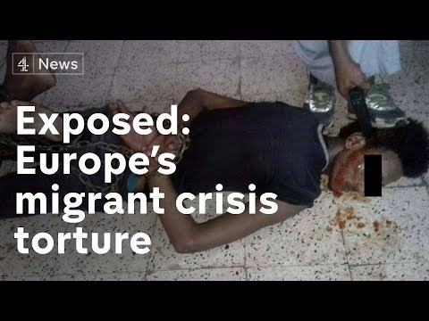

### AYS Daily Digest 26/02/2019: New air strikes around Idlib
#### Several Syrian civilians die in bombings / Protest in Libyan camp / Hundreds of refugees in Greece face losing their homes / Four boats cross the UK channel

](assets/b6fd70c6beb6/1*0cSl2j7GVfryKkgNXA1VqQ.jpeg)

White Helmets looking for victims\. Source: [Syria Civil Defense](https://www.facebook.com/SyriaCivilDef/photos/pcb.2295041710820224/2295041524153576/?type=3&theater)
### Syria

The Idlib region seems to be under heavier attack at the moment\. The White Helmets [report](https://www.facebook.com/SyriaCivilDef/posts/2295041710820224) several air strikes, which caused severe injuries and even deaths today\.

> Children were the biggest casualties today with 6 left dead after brutal attacks hit the cities of [\#Idlib](https://www.facebook.com/hashtag/idlib?source=feed_text&epa=HASHTAG) and [\#Hama](https://www.facebook.com/hashtag/hama?source=feed_text&epa=HASHTAG) , adding to the death toll of 9 civilians, while countless others were injured\. Surviving parents and family are mourning these lost children\. 

### Libya

Journalist Sally Hayden has information that there was a protest in Tripoli’s Triq al Sikka detention center\.

■■■■■■■■■■■■■■ 
> **[Sally Hayden](https://twitter.com/sallyhayd) @ Twitter Says:** 

> > Big protest today in Tripoli's Triq al Sikka detention centre, where male detainees are usually locked inside in the dark, &amp; some have stayed more than a year. I'm told they broke down the door to escape but were met &amp; surrounded by guards. Not sure what's happened since. #libya 

> **Tweeted at [2019-02-26 12:53:29](https://twitter.com/sallyhayd/status/1100378319055400966).** 

■■■■■■■■■■■■■■ 

### Malta

Malta’s Prime Minister Jospeh Muscat [announced](https://www.facebook.com/pikpalesvos/posts/2285336408408444?hc_location=ufi) that several people who were rescued by the Armed Forces of Malta were relocated to Portugal today\.
### Greece

The team of the Tapuat center, which is run by UNICEF, Eliaktida and Better Days, ran optometry test for eleven children and teenagers today\. “Some were complaining about blurry vision and experiencing headache when they have to focus at the class board,” Luz Carmona writes\. With new glasses, this problem will hopefully be solved\.

Deportation Monitoring Aegean reports that activists monitoring deportations from the Greek islands to Turkey are facing frequent police controls, data checks, intimidations, arrests and even police violence\. In one case, the activist in question was hold in the police station for several hours and beaten with his hat\. “ Later it was found that the police had pressed charges against the activist for insult and resistance against the police\. There is still no court date for the incidence,” DMA states\. You can read the full report on their [homepage](https://dm-aegean.bordermonitoring.eu/2019/02/24/criminalization-of-deportation-monitoring-arrests-and-police-violence/?fbclid=IwAR0hnI_5u-2C53D3-MMUc1RkygmtNNAxNvlUh8PkUMfJSQE6DLJz-vWaD6c) \.

The Greek police found seven people, including four children, hidden in a truck on Monday\. AP [reports](https://apnews.com/e04e33944f9b4b9987041899111ce18d) , that the driver was paid to drive them from Turkey to Germany and is assumed to have been paid 1500 euros per person\. He was stopped in Northern Greece and arrested\.

Last week, a transgender refugee won her case, allowing her to change her name in order to avoid confusion concerning the official paperwork, Pipka [states](https://www.facebook.com/pikpalesvos/posts/2285336408408444?hc_location=ufi) \.

On Wednesday, 8pm, there will be an open assembly at Politechneio University about the upcoming evictions of the Estia accomodation\. According to the [announcement](https://www.facebook.com/groups/AthensVolunteersInformation/permalink/1630608590404765/?hc_location=ufi) , refugees who received their status before July 2017 will be forced to leave the UNHCR/NGO accomodations by 31st March\. Translations to Arabic, Farsi, Dari and Greek are provided\. It is assumed that 600 people will be affected by this\.
### WEATHER
#### MONTENEGRO

In the south and center predominantly sunny or lightly to moderately cloudy, in the north predominantly clouds with some light snow in the morning\. Wind locally moderate to strong from the north\. Lowest temperatures from \-5 to 8 and highest daily from \-3 to 15 degrees\. ���
#### SERBIA

Moderately cloudy and dry in most part of the country, weak precipitation in the south during the morning\. After noon the weather will gradually clear, starting in the north\. Wind weak to moderate, strong in places, blowing from the north and northwest; in the evening it will weaken and change direction to south and southwest\. Lowest temperatures from 0 to 4 and highest daily from 7 to 12 degrees\.
#### BiH

In central, east and northeast Bosnia predominantly cloudy with pockets of rain mostly in the morning\. Sometime in the afternoon or evening it will clear up\. Predominantly sunny in the rest of the country\. Moderate to strong Bura in Herzegovina and southwestern Bosnia\. Lowest temperatures from \-3 to 7 and highest daily from 4 to 14 degrees\.
#### CROATIA

Predominantly sunny with more clouds in Dalmatia from time to time\. Wind weak to moderate blowing from the north and northeast\. Alongside the coast moderate to strong Bura, stormy gusts but weakening in the afternoon\. Lowest temperatures from \-1 to 11 and highest daily from 11 to 16 degrees\.
### France

Paris remains a difficult place for many people sleeping rough\. Not only do men have to sleep in the streets in camping tents, even families are abandoned by the French government in the capital city\. Faces Before Numbers reports on a family with a five\-year\-old and a 15\-month\-old child: “These three beautiful souls spent 3 years in Libya and reached our shores a couple of weeks ago, after 36 months of hell\.” While France is refusing to help people in need, at the same time the defense ministry [announced](https://www.infomigrants.net/en/post/15366/france-to-give-6-boats-to-libyan-navy-msf-voices-concern) that it will give six equipped boats to the so\-called Libyan Coast Guard, which is infamous for pull\-backs, as well as inhumane treatment of people on the run\. Italy [will send](https://www.infomigrants.net/en/post/15395/italy-strengthens-libya-accord-another-four-patrol-boats?ref=tw) four boats, too\.

### UK

Within 24 hours, four boats crossed the Channel between France and the UK, Express [reports](https://www-express-co-uk.cdn.ampproject.org/v/s/www.express.co.uk/news/uk/1092584/migrant-crisis-uk-kent-dover-kingsdown/amp?usqp=mq331AQCCAE%3D&fbclid=IwAR1B85f8SgM2BBICAP4fwPHoA6Kdi9yzZvl_4vLkLQRf5m2_CUeFpscPX6c&amp_js_v=0.1#referrer=https%3A%2F%2Fwww.google.com&amp_tf=From%20%251%24s&ampshare=https%3A%2F%2Fwww.express.co.uk%2Fnews%2Fuk%2F1092584%2Fmigrant-crisis-uk-kent-dover-kingsdown) \. They were intercepted on their way by the Border Force\. Among the passengers were women and children\.

Refugee Rights Europe and partners published a report about the shortcomings in the UK’s fulfillment of the Convention on the Elimination of all Forms of Discrimination Against Women \(CEDAW\) \. In this respect, the organisation criticizes continued inadequacies of the British asylum system leading to a range of issues including mental health problems\. Moreover, they highlight lack of access to the labor market, inadequate accommodation, family separation and no appropriate support — all leading to mental health issues\.

**We are an entirely volunteer\-run media team, and we rely on our supporters to share our news\. So please share, and never forget to ACT\!**

**We also publish weekly summary digests in Persian and Arabic\.** 
**Please, read and share the ones for the week of February 11–17:** 
**in [Persian](%D8%A8%D8%AF%D8%AA%D8%B1-%D8%B4%D8%AF%D9%86-%D8%B4%D8%B1%D8%A7%DB%8C%D8%B7-%D8%AF%D8%B1-%D9%85%D8%B1%D8%B2%D9%87%D8%A7%DB%8C-%D8%A7%D8%B1%D9%88%D9%BE%D8%A7-c1dbe5f6479c) and in [Arabic](%D8%A7%D9%84%D8%B8%D8%B1%D9%88%D9%81-%D8%AA%D8%B2%D8%AF%D8%A7%D8%AF-%D8%B3%D9%88%D8%A1%D9%8B-%D8%B9%D9%84%D9%89-%D8%AD%D8%AF%D9%88%D8%AF-%D8%A7%D9%84%D8%A7%D8%AA%D8%AD%D8%A7%D8%AF-%D8%A7%D9%84%D8%A3%D9%88%D8%B1%D9%88%D8%A8%D9%8A-9121e6961516) \.**

**We strive to echo correct news from the ground through collaboration and fairness\.**

**Every effort has been made to credit organisations and individuals with regard to the supply of information, video, and photo material \(in cases where the source wanted to be accredited\) \. Please notify us regarding corrections\.**

**If there’s anything you want to share or comment, contact us through Facebook or write to: areyousyrious@gmail\.com**

_Converted [Medium Post](https://medium.com/are-you-syrious/ays-daily-digest-26-02-2019-new-air-strikes-around-idlib-b6fd70c6beb6) by [ZMediumToMarkdown](https://github.com/ZhgChgLi/ZMediumToMarkdown)._
