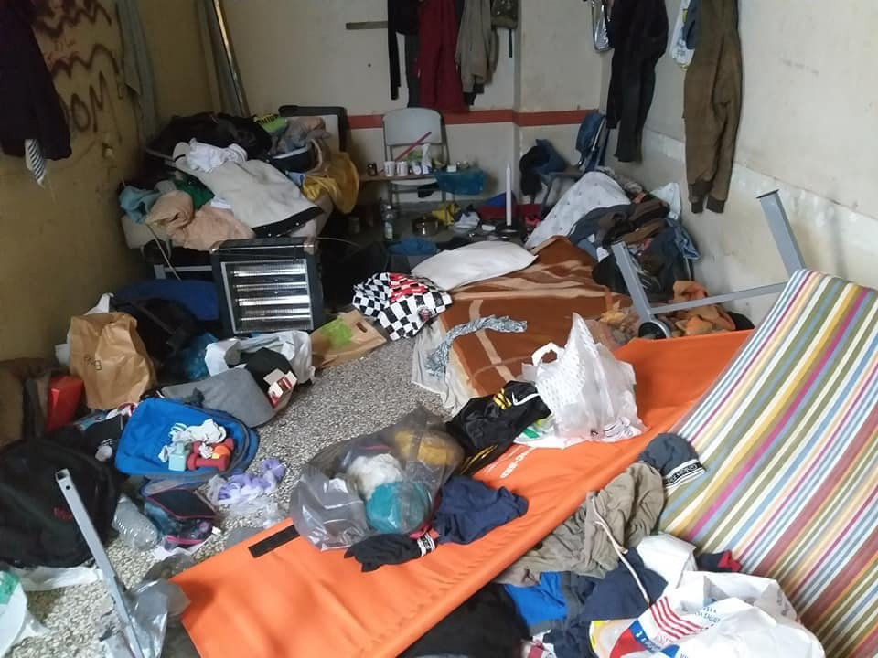
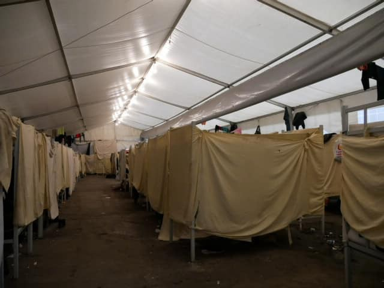
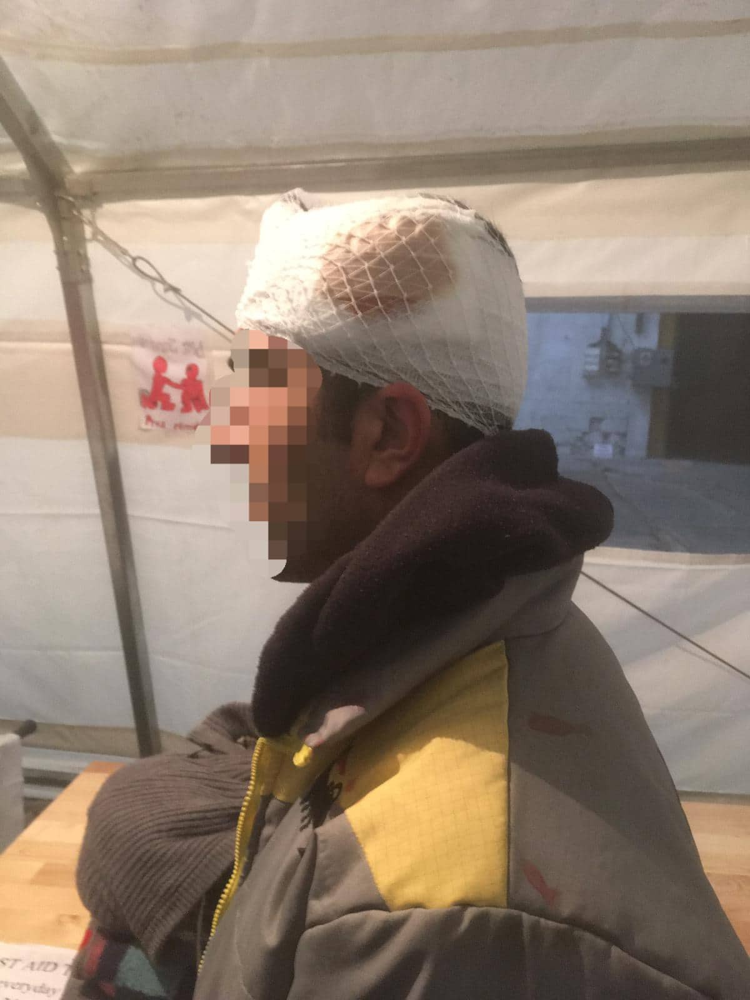

### AYS DAILY DIGEST 27/2/19: Thousands of people in Greece afraid of of losing accommodation
#### _On the Greek government’s decision to start asking people to leave their temporary accommodation // Another incident in acamp in Bosnia // Help needed in Paris // A woman from Afghanistan mistreated in the hospital in Germany / & more news_

](assets/ea766f51cfa/1*ihupGnD3xAXDNZeSy5gE4g.jpeg)

Bira camp\. Photo by [Michele Luppi](https://www.facebook.com/michele.luppi.39?__tn__=%2CdC-R-R&eid=ARC3lJ9s56YsrpuRA_2ZPRn0Y6wIrxAbrcIkdPn4VGkzrV4qmdXDUEf6Ks0In9u4r6hweu3YTAWjklh4&hc_ref=ARQNNQp_NSsVNR2d_m_24gxvVNQO8apl8qz4M8TcJphpSQopPQh814Rs4GaTf0CmU8E&fref=nf)
### Feature

One of the most pressing issues for many people in Greece at the moment is the decision by the government to start asking people with refugee status or subsidiary protection to leave the camp and UNHCR accommodation\. 
We reported about this on several occasions recently, and now we share detailed information gathered by the Refugee\.Info team:

In English: [http://bit\.ly/exit\-en](http://bit.ly/exit-en) 
In Arabic: [http://bit\.ly/exit\-ar](http://bit.ly/exit-ar) 
In Urdu: [http://bit\.ly/exit\-ur](http://bit.ly/exit-ur) 
In French: [http://bit\.ly/exit\-fr](http://bit.ly/exit-fr) 
In Persian: [http://bit\.ly/exit\-fa](http://bit.ly/exit-fa)

People who will have to leave first are those who got their status before August 2017\. Eventually, this will also end their access to cash cards\.
A number of organizations reacted to this decision expressing their concerns that the plan may result in homelessness and hardship for those evicted\.

“The Greek Government must have a better, appropriate plan in place to avoid leaving refugees without housing and to support integration into Greek society,” they say in their [open letter](xhttps://l.facebook.com/l.php?u=https%3A%2F%2Fwww.refugeelegalsupport.org%2Fsingle-post%2F2019%2F02%2F27%2FRLS-Signs-Open-Letter-Regarding-Greece%25E2%2580%2599s-Plans-to-Phase-Out-Cash-Assistance-and-Housing-for-Refugees%3Ffbclid%3DIwAR1i4ioTcJMhHpVY8rwOry-XgBwRtYwChg5uWR69PJ0EtkPFPlA2ClDqaD8&h=AT2OGAMTV-yFcLYa3ra4w0LBrmLsiSdmGnAyr4MYs4aPdroXASDATdINxngcyz3Vih1g76LsEv-dfXxiCQv-C5LiKliKTqNzQUtC1_EJnTCyDBKHld7ueafd1ZlWHvOIODcO9X2R_EsWcpL8bvQ9aRitg3JoVIp__iIcwcF_HQZVcm-bVzIsxEG78YhYWNvlEPsJHBEfyryCm_AVXb4PxtgutiZixXHbYqWpnBgiY2PH8oiD__uBhAL7xinW_lZEDaYLOPXcIROoGVWOPSr-ipww8VRd9-7-K7SQH1SWOOg34tIB4vuwway9KSKa52HQ_0lNR0dWO4Z5Bp91oW7zTVIGloYRuyMBS14p0K49U_lFM8l_fn8LIQYtOKgbSUaqK4mCnIytNAjkS_Git2-aLivA7aSe6vHU0KUChBjWA7ntIy1R--HsuV5jQ5-8YMx05L5T-85PKNdo5egoB-Vxi1gWiZSvlLBsN-elTxBrBWoAcX7DaGjOCzy9KNlbR3T36HzhROphooDTKB58gyxAYT2P7ShP0fBgGEtOC2IZrX8hQbMjtn3k0UsdtCuCLL4UhRGyyFbkMMr2FslB-lNiKhavVavCEo2JUtVvVBisS4eEVJkp6LjhhBtMT0jcjMkGDUk) \.
### Jordan

_“The conditions for their \[Syrian refugees\] return are not present,”_ Jordanian Prime Minister, Osama Al\-Razzaz, warned European politicians who are claiming differently\. “We are now entering a new phase of the Syrian crisis, however, the impact is still ongoing,” Razzaz said [according to the Middle East Monitor](https://www.middleeastmonitor.com/20190221-jordan-syrian-refugees-have-no-intention-to-repatriate/) \.

Officially, only around 10,000 refugees, out of a total estimated 1\.3 million in Jordan, have left since the two countries opened the vital Nassib\-Jaber border crossing last October\.

You can find more about the situation for Syrian refugees in Jordan [here](https://data2.unhcr.org/en/situations/syria/location/36) \.
### Algeria

Protests are happening for the fourth day in a row in Algeria and have been mounted against plans for rarely seen President Abdelaziz Bouteflika \(81\) to extend his 20\-year rule by seeking a fifth term, as the [media are reporting](https://english.alarabiya.net/en/News/north-africa/2019/02/25/Algerian-police-use-tear-gas-as-rare-anti-government-protests-enter-third-day.html) \. On the third day of protests, police used tear gas to disperse demonstrators, and arrested 41 people, according to state news agency APS\.

Protests are going on all over the country\. “People do not want Bouteflika,” is what the crowd chants at protests\.

The presidential elections are scheduled for 18 April\.

So far, little information has been available about what is going on in Algeria at the protests\. Since 2011 and the so\-called Arab spring which even occurred on the streets of this country, socio\-economic protests are often held on the streets of Algerian cities\. However, unlike in Egypt, Libya or Tunisia, these protests did not bring change in the government\.
### EU

According to the [data provided by the IOM](https://www.iom.int/news/mediterranean-migrant-arrivals-reach-8950-2019-deaths-reach-223) , **8,950 people have entered Europe by sea as of 24 February** \. **Two hundred twenty thre** e **people did not complete this journey** and died in the sea\.

The same organizations issued a [report on displacement](https://displacement.iom.int/reports/europe---summary-key-results-january-december-2018) concluding that **144,166 new arrivals were registered in Europe between January and December 2018\.** Out of this number, 96 % were people fleeing the wars in Syria, Afghanistan, Iraq, or the dire situations in Tunisia and Morocco\.

The same report shows that last year, more than 200,000 people were accommodated in Italy, Greece, the Republic of North Macedonia, Serbia, Croatia, Slovenia, Bosnia and Herzegovina, Bulgaria, Cyprus, Kosovo and Romania, while significant increases in irregular entries have been noticeable in Bosnia and Herzegovina \(1,166 vs\. 23,848\) and Montenegro \(807 vs\. 4,645\) in 2017 and 2018 respectively\.
### Greece

On Thursday evening, the single men’s squat in Arachṓbēs 44, Athens has been cleared out and all residents arrested\.

By Arash Hampey\.

Due to this eviction, an [extraordinary open assembly](https://athens.indymedia.org/post/1595995/?fbclid=IwAR07wC8FryzeuHdhPsRaboCmtQYHvUcE_vF4Au8eZf0UJ9c2YNmgPep-w4c) will be held on Thursday 28 February at 6 PMat POLYTECHNIC \(Nkínē\) \.

[Elpída Home](https://www.facebook.com/elpidahome/) is back in Thessaloniki to provide different types of assistance\.

The Elpida Home team is currently providing the following services from their new space in downtown Thessaloniki:

1\.Psychological and psycho\-social support & training to beneficiaries and aid workers
2\. Legal representation & counselling in partnership with Equal Rights Beyond Borders & International Refugee Assistance Project
3\. Health support

_“All of our services take place through appointments, so use our email first\._ 
_In the future, we will be adding more services and keeping you all informed\. We have been operational since the beginning of 2019 and are very happy to receive referrals from other organizations and are interested in finding operational partners as well\. If you are interested in discussing potential partnership possibilities do not hesitate to contact us\. For any inquiries, questions or referrals please feel free to email us at [info@elpidahome\.org](mailto:info@elpidahome.org) ”_

[Protests have been announced](https://www.facebook.com/groups/943355035786244/permalink/2017274335060970/) for Saturday, 16 March, at 2 pm, Victoria Square in Athens\. The protests are against the EU & Turkey deal, which closed the European external and internal borders three years ago\.
#### BALKAN WEATHER FORECAST

MONTENEGRO
Predominantly sunny and light to moderate clouds\. During the morning possibly fog or low clouds are possible\. Winds mostly light to moderate from changing directions\. Low temperatures from \-9 C° to and highs from 6 to 17 C°\.

SERBIA
 At some places weak frost in the morning and fog in the low\-lying areas in the south\. During the day predominantly sunny and warmer\. Wind light to moderate, strong at times in the north and east, blowing from the west and southwest\. Low temperatures \-2 to 4 C° and highs from 12 to 19 C°\.

BH
Predominantly sunny with morning fog in the low/lying areas of central and eastern Bosnia\. Wind light, blowing from the southwest\. Low temperatures \-3 to 8 C° and highs from 12 to 20 C°\.

CROATIA
Predominantly sunny and above average warmth\. Wind light to moderate from the south\-west, alongside the coast western wind\. Low temperatures from \-2 to 11 C° and highs from 16 to 21 C°\.
### Serbia

[INFO Park Belgrade](https://www.facebook.com/infoparkserbia/) reports counting a total of 204 refugees and other migrants on the streets and parks of the Savamala area, central Belgrade\. At the same time, they register that the Hungarian authorities prevented 14 attempts of irregular Serbian\-Hungarian border\-crossings on Tuesday and returned the individuals to Serbia\.
### Bosnia and Herzegovina

Unfortunately, we have to report another incident in camps in Bosnia and Herzegovina\. The victims are residents who complained about IOM employees and private security, again\.

Camp Bira in Bihac is one of the camps run by the IOM in the north of the country\. The camp offers only basic accommodation to people and is often mentioned for the inhuman and degrading living conditions\.

](assets/ea766f51cfa/1*hDcGZJHic8lA1V8GTZiH9g.jpeg)

Photos by [Michele Luppi](https://www.facebook.com/michele.luppi.39?__tn__=%2CdC-R-R&eid=ARC3lJ9s56YsrpuRA_2ZPRn0Y6wIrxAbrcIkdPn4VGkzrV4qmdXDUEf6Ks0In9u4r6hweu3YTAWjklh4&hc_ref=ARQNNQp_NSsVNR2d_m_24gxvVNQO8apl8qz4M8TcJphpSQopPQh814Rs4GaTf0CmU8E&fref=nf)

We received a message from one of the residents telling us about the incident which occurred last weekend when the police and the IOM forcefully transferred about 100 people from this camp to one in Sarajevo\. The message reads:

_“Two Iranian Kurds were asked by IOM to remove their belongings from the container they stayed in and move to a tent which is not safe for Iranian Kurds\. As the two did not want to remove their things, two security guys came and the IOM person closed the door to the container\. The security guys beat the two Iranian Kurds in the heads\. The guys then said, “Ok stop we go but stop\.” But the security guys did not stop\. The IOM guy blocked the door all the time so no one would enter the container and help\. When the security guys came out their hands were full of blood\. They went to the bathroom to wash their hands\. The two Iranian Kurds were taken by other refugees to the first aid tent at Bira\.”_

We received confirmation about this incident from several sources\.

In general, the situation for the people who are stranded in Bosnia is getting more and more dangerous\. The government in the Bihac area continues to put pressure on people on the move, as well as on the local solidarity network\.

Doctor and volunteer, [Dimitar Anakiev](https://www.facebook.com/dimitar.anakiev) , warned in his last post about a new practice: refugees and migrants are being prevented from buying even prescribed drugs in pharmacies\. Furthermore, according to the doctor’s report, police officer are now searching refugees and migrants for medicines and take them, thereby preventing refugees from treating their illness\.

_“Yesterday a pharmacy in Velika Kladuša refused to sell prescribed drugs to a youngster from Afghanistan diagnosed by a local psychiatrist with two psychiatric diseases and today we have the case that police in Velika Kladuša took diabetes medicine \(Glucophage 850 mg\) from our patient; the police also seized his prescription for the medicine\. After our patient started to scream that he needs the tablets for the treatment of diabetesthe police went with him to the clinic where the doctor confirmed that his life is not in danger at the moment if he receives no compensation for the box of drugs seized by police\. It all sounds like the final solution for the question of refugees and migrants in Bosnia\.”_
### Italy

From the beginning of this year, [202 people were registered](https://data2.unhcr.org/en/documents/details/68161) to arrive in Italy by sea\. This drastic decrease in the number of new arrivals is by and large due to the policy of closed ports which has led to a delay in the disembarkation of people from NGO vessels, which in some cases have been stranded at sea for weeks\.

This year, 95 refugees were transferred to Italy from Lebanon and Ethiopia in the context of the Humanitarian Corridors programme\. Since the launch of the programme in 2016, 1,914 persons were transferred to Italy\.

Furthermore, on 31 January, 16 Syrian refugees were resettled from Lebanon to Italy in the context of the Italian Resettlement programme\. Since the programme was launched in 2015, 2,034 refugees have been resettled to Italy\.
### France

A lot of help is needed in Paris this year\. Solidarité Migrants Wilson is calling for volunteers to help them to work at Avenue Wilson in Saint\-Denis\.

Four weeks ago, the camps on the Avenue of President\-Wilson in Saint\-Denis were evacuated, but people are coming back\.

The same group is helping at the Malakoff shelter \(Hauts\-de\-Seine\) \. They warn that the place is overcrowded, has bad conditions, and people are offered little support\.

_“On the ground floor, a room has been set up for male exiles, while the 1st floor is occupied by families\. We entered the ground floor room, in which 40 camp beds are arranged\. 40 asylum seekers are therefore crammed into a room that according to them is suffocating, which has obvious repercussions for their physical and mental health\. The camp beds are only a few inches apart; promiscuity is difficult to tolerate and is also a vector of diseases\. One of the Afghan refugees showed us a mattress installed on the floor because it is too big for the camp bed\. Another tells us he bought his coverlet himself\. The sheets are dirty and have rarely been washed since their arrival\.”_

The group will be going back and you can find out more if you visit their FB page or get in touch with them\.

Donations are also needed in Paris for the Locker Room for Migrants group\.

“The Locker Room a small point, a breath, a permanent meeting between our migrants and volunteers\. The situation has not changed\. It is even more difficult for our migrants, what with total abandonment, indifference, health problems, housing, food, persecution\. It’s very important to continue to support them, to defend them\!”

Visit their [FB page](https://www.facebook.com/groups/177642579245883/permalink/811487242528077/) to see how you can help\.
### Germany

A woman from Afghanistan who was in deportation detention had to be transferred to a hospital and was treated very inhumanly\. During her one\-week\-stay at the hospital in Grossburgwedel, the sick 24\-year\-old Afghani woman was permanently guarded by two security officers\.

In addition, [according to her attorney](http://www.taz.de/!5572026/?fbclid=IwAR26BxYcWIbogIkCwcgujKGjhg04mEVobgKJcGhKpzxZRhHXHCcTUxSRenQ) Peter Fahlbusch, she was “tied with one food to the hospital bed for three days and nights\.” Fahlbusch speaks of “medieval conditions”\.

Furthermore, a district court has now ruled that the deportation detention was unlawful anyways\.

**We are an entirely volunteer\-run media team, and we rely on our supporters to share our news\. So please share, and never forget to ACT\!**

**We strive to echo correct news from the ground through collaboration and fairness\.**

**Every effort has been made to credit organisations and individuals with regard to the supply of information, video, and photo material \(in cases where the source wanted to be accredited\) \. Please notify us regarding corrections\.**

**If there’s anything you want to share or comment, contact us through Facebook or write to: areyousyrious@gmail\.com**

_Converted [Medium Post](https://medium.com/are-you-syrious/ays-daily-digest-27-2-2018-thousands-of-people-in-greece-afraid-of-of-losing-accomodation-ea766f51cfa) by [ZMediumToMarkdown](https://github.com/ZhgChgLi/ZMediumToMarkdown)._
