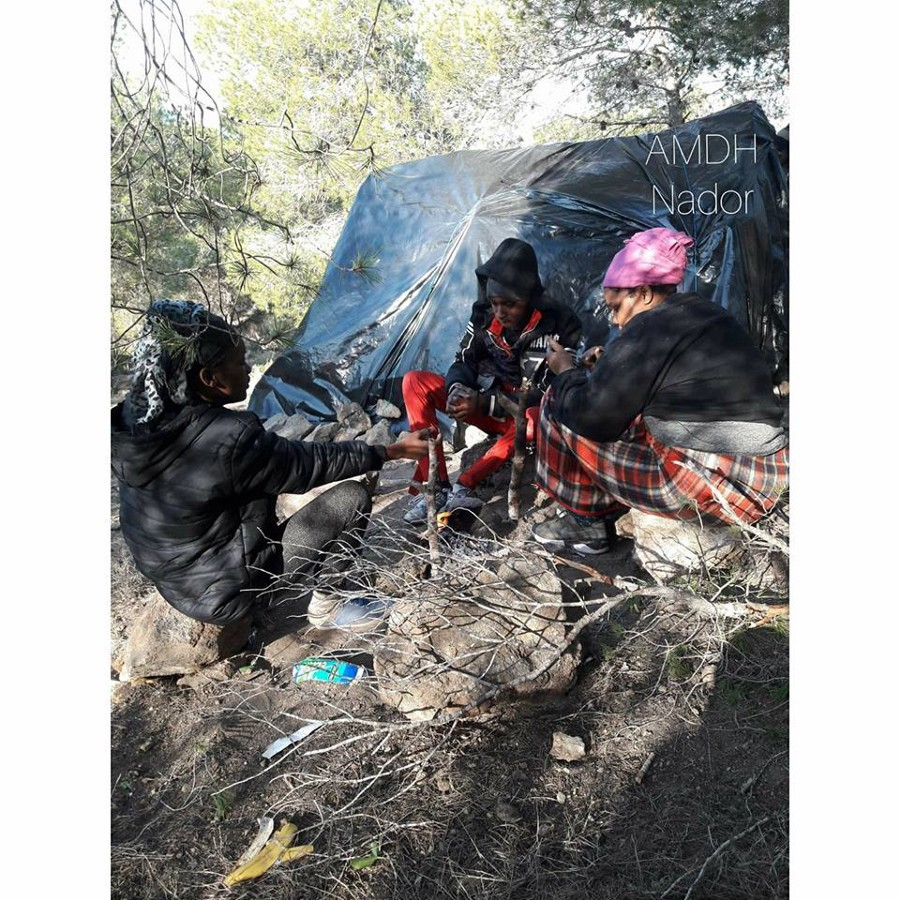

### اليونان تخطط لإنهاء الدعم المالي والسكني للاجئين بشكل تدريجي
#### AYS Weekly News Summary in Arabic, February 18–24

](assets/85c17518d316/1*lWMPSzhnxC8Qciykpb_oag.jpeg)

by [enough14](https://enoughisenough14.org/author/enough2013/)
### **المغرب**
#### نساء جنوب الصحراء يستهدفن من قبل السلطات المغربية

أفادت جمعية موروكيين في الناظور بأن النساء في منطقة جنوب الصحراء يستهدفن من قبل السلطات المغربية\. كانوا أول ضحايا الهجمات الأخيرة على مخيمات مؤقتة في المنطقة\. “وانهم غير قادرين على الركض ، ومن ثم يتم القبض عليهم من قبل القوات المساعدة حتى لو كنَ حاملاً أو مع أطفالهن”\.

### **البحر**
#### ١١٦شخصا عادوا إلى ليبيا

وبدون مفاجأة ، أشاد وزير الداخلية الإيطالي ماتيو سالفيني بخفر السواحل الليبي لإعادة هؤلاء الأشخاص إلى مراكز الاعتقال الليبية\. المنظمة الدولية للهجرة — الهجرة الدولية مستعدة دائماً لدعم عمليات الإعادة غير القانونية والعودة “الطوعية” ، في حين ترفض باستمرار اتخاذ أي إجراء لتحسين ظروف الأشخاص الذين يتحركون في كل من أوروبا وشمال أفريقيا\.

الحكومة الفرنسية تزود حرس السواحل الليبي بقوارب جديدة

وأفادت وسائل الإعلام أيضاً أن الحكومتين الفرنسية والليبية وقعتا في نهاية الأسبوع الماضي اتفاقاً: ستوفر فرنسا لخفر السواحل الليبي وسائل لوجستية لتحسين قدرتها على اعتراض القوارب وإعادة الأشخاص الذين تم إنقاذهم إلى ليبيا\.

سفينة الإنقاذ\( عين البحر\) “آلان كردي” تصل إلى المنطقة الليبية

وصلت السفينة التي أعيدت تسميتها حديثاً “آلن كردي” إلى منطقة الليبية\. وهي الآن السفينة الوحيدة لمنظمة الإغاثة في وسط البحر المتوسط ، بسبب الحصار والتجريم الذي تشغله الحكومتان الإسبانية والإيطالية
### **اليونان**
#### احتجاج في ليروس

أفادت “بلا حدود” أن هناك احتجاجًا من قبل اللاجئين الفلسطينيين في مركز شرطة ليروس أمس\. طلب المتظاهرون إطلاق سراح طالبي اللجوء في حجز الشرطة\. ردت الشرطة بالعنف\. لا مزيد من المعلومات المتاحة\.
#### **اثينا**

**التحديثات على تغييرات سياسة الإقامة والسحوبات النقدية**

لقد ترجم فريق معلومات الجوّال الأخبار التي تفيد بأن الأشخاص الذين حصلوا على وضع اللاجئ أو الحماية الإضافية سيضطرون تدريجياً إلى مغادرة أماكن إقامتهم — إذا كانوا يعيشون في مخيم أو في سكن تابع للمفوضية — وسيفقدون أيضًا مساعدتهم النقدية ، كما أفادنا مؤخرًا\.

### صربيا
#### عنف الشرطة على الناس أثناء التنقل والمتطوعين بعد الطرد في سيد

مطبخ\(بلااسم\) أبلغ عن إخلاء عنيف لإيواء اللاجئين في سيد ، مع ٨ شاحنات شرطة وحوالي ٣٠ ضابط شرطة في مكان الحادث\. وقد تمت مهاجمة المبنى ، الذي كان يضم العديد من اللاجئين في المنطقة ، صباح أمس ، مما أدى إلى احتجاز حوالي ٦٠ لاجئًا في منطقة خارج مركز الشرطة ، وتم نقلهم جميعًا قسريًا إلى معسكرات رسمية ، حيث تمكن حوالي ٢٠ شخصًا من الفرار\. عن طريق إخفاء أنفسهم بينما كان يتم الإخلاء\.
### البوسنة والهرسك
#### يبدأ ترانفيلاس وإغلاق المراكز في يونا سانا كانتون

تقرير إخباري محلي ينص على أن أوامر إغلاق مراكز المهاجرين في منطقة الكانتون في أونا\-سانا في البوسنة أمرت بعد الفشل في تحسين الأوضاع في المراكز بعد استمرار المطالب للقيام بذلك\.

أول الأشخاص الذين سيتم نقلهم من المراكز سيكونون مجموعة من٢٥٠ شخصًا\. سيتم نقلهم إلى مركز الاستقبال في وجيفاك ، في بلدية هاجيجي يوم الجمعة ٢٢ ، فبراير من قبل المنظمة الدولية للهجرة\.
### النمسا
#### احتجاج ضد حصار قارب الانقاذ

احتج النشطاء اليوم أمام القنصلية الإيطالية في فيينا ضد الاستيلاء على سفن الإنقاذ ، وتجريم عمليات الإنقاذ ، والنتائج المميتة للحدود الأوروبية ومراقبة الحدود\. في الوقت الحالي ، يتم حظر مراقبه البحر ٣ في كاتانيا ، ويتم إرساء كل من افتح افتح و ميدايته راتيو و انتا ماري بالقوة في الموانئ الإسبانية\.

### الحدود الفرنسية الإيطالية: الحدود التي تصيب وتقتل

نشرت \(انفـــه\) تقريرا يفصّل النتائج المترتبة على السياسات الحدودية الآمنة والمقيدة على نحو متزايد على أولئك الذين يقومون بالرحلة عبر الحدود الفرنسية / الإيطالية خلال ٢٠١٧\-٢٠١٨\.

من منتون إلى فينتيميليا ، في وادي رويا ، من بريانكون إلى كول دي فريجوس وموداني ، عبر كولج مونتجنيفري وكول دي لوشيل ، الاستنتاجات هي نفسها: الضوابط التمييزية ؛ إجراءات متعجلة انتهاكات حقوق الإنسان الناس المهددة بالانقراض مخالفات في رفض الدخول ؛ معوقات الوصول إلى اللجوء ؛ عدم الاعتناء بالقُصَّر غير المصحوبين ؛ ظهور الدفعات غير النظامية ؛ احتجاز غير قانوني مطاردات الشرطة عنف؛ إصابات\. ووفيات\.
### **إسبانيا**
#### اتفاق جديد يسمح لحرس السواحل الإسباني بإعادة القوارب إلى المغرب

توصلت إسبانيا والمغرب إلى اتفاق غير مسبوق يسمح بإعادة السفن التي أنقذها سالفامنتو ماريتيمو ، الذي يستمر في مساعدة خفر السواحل المغربية ، إلى الموانئ المغربية ، عندما يقع مكان الاعتراض بالقرب من الشواطئ المغربية\.

_Converted [Medium Post](https://medium.com/are-you-syrious/%D8%A7%D9%84%D9%8A%D9%88%D9%86%D8%A7%D9%86-%D8%AA%D8%AE%D8%B7%D8%B7-%D9%84%D8%A5%D9%86%D9%87%D8%A7%D8%A1-%D8%A7%D9%84%D8%AF%D8%B9%D9%85-%D8%A7%D9%84%D9%85%D8%A7%D9%84%D9%8A-%D9%88%D8%A7%D9%84%D8%B3%D9%83%D9%86%D9%8A-%D9%84%D9%84%D8%A7%D8%AC%D8%A6%D9%8A%D9%86-%D8%A8%D8%B4%D9%83%D9%84-%D8%AA%D8%AF%D8%B1%D9%8A%D8%AC%D9%8A-85c17518d316) by [ZMediumToMarkdown](https://github.com/ZhgChgLi/ZMediumToMarkdown)._
