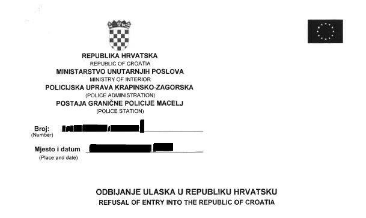
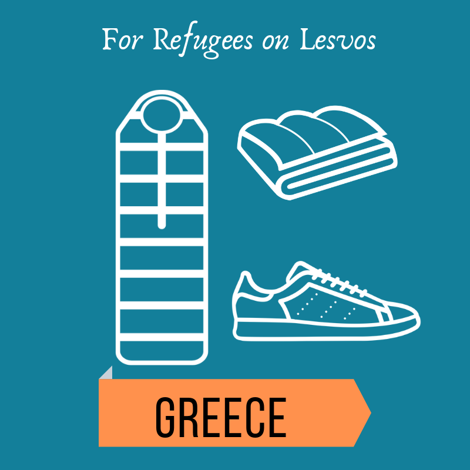
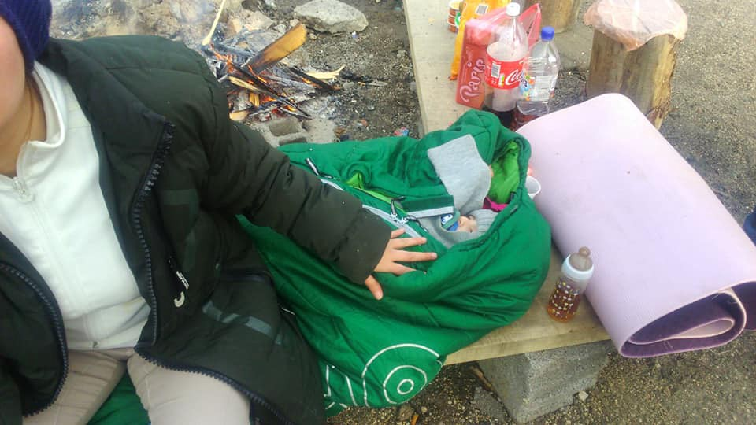
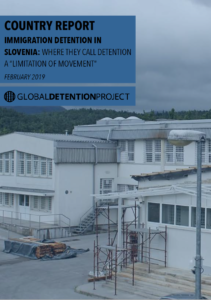
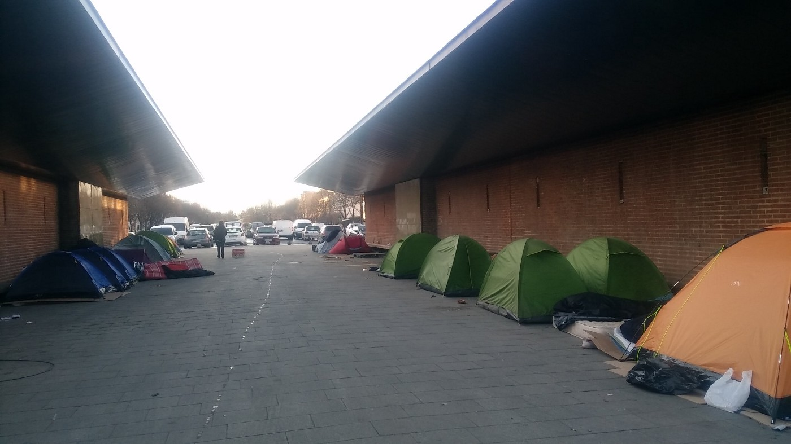
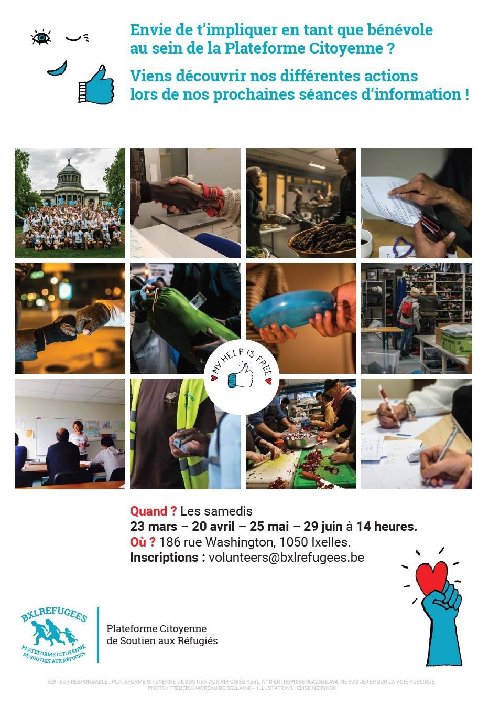
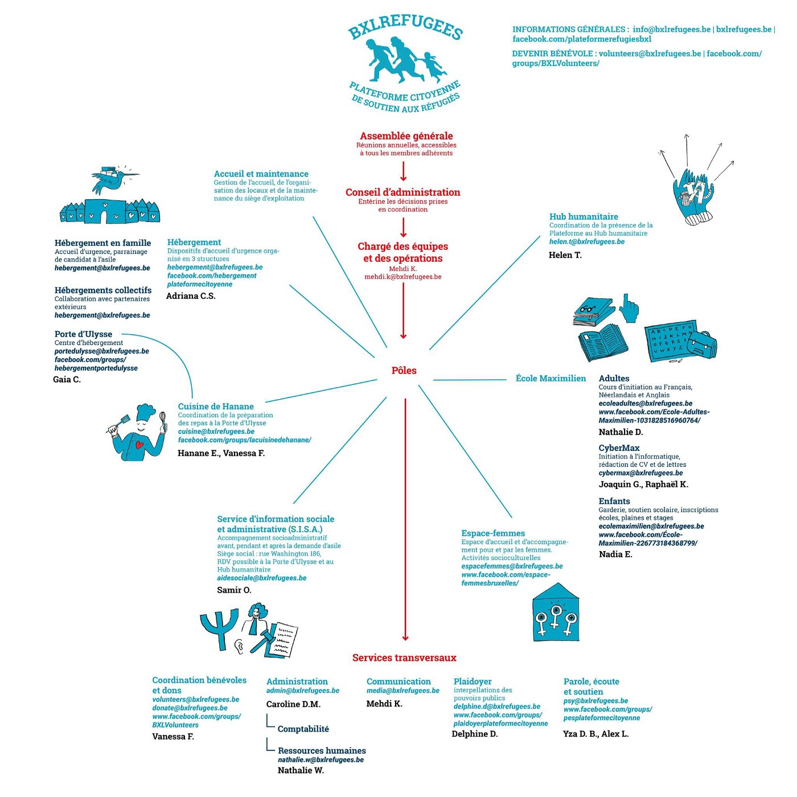

### AYS Daily News Digest 1/3/19: Announced changes in the system, while dubious border practice continues
#### Greece: renewing Residence Permits info / calls for volunteering and aid collection / Internal pushbacks in Bosnia continue, why aren’t organisations being vocal about it? / Changes in Dublin system announced / AIDA Report 2018 for Switzerland is out / ECRE info from Bulgaria / French volunteers struggle / more news

](assets/88754f60b06f/1*287-mmCm5jsn6-UziFAhlA.jpeg)

Photo: S [olidarité migrants Wilson](https://www.facebook.com/Solidarit%C3%A9-migrants-Wilson-598228360377940/?__tn__=%2CdkCH-R-R&eid=ARCxKRI5ZbysDnyeRR343a9IkkomFBwQ43Jmpo4qt-xWuWkGH3IxAQVz9dSHdScsCJHeb3V3zE-QJ1jJ&hc_ref=ARTjCSFUKLQLJ2ZYwK8EHD9gH6FGzCOsFM1LoJKuRPQQiitbRnfEu7j3z7zUxOFLH-E)
#### FEATURE

[Border Crossing Spielfeld](https://www.facebook.com/RefugeesSpielfeld/?__tn__=kCH-R&eid=ARBUeTH5C8TLvQ0st9jeg0QVMnjuTcfipJFbXwBAqHvXdxcuz7VEOXITY1Ms6z8RR5ahApMQabK3XS7A&hc_ref=ARSG1u3cZgvaNfg4Ir6sj88Pi_elgaAYnTOU7wE2zYJtVcszO00PYv8HNecDDZQ2hbc&fref=nf&__xts__%5B0%5D=68.ARDenxG3MpY-wP-dR8kC5dBop4WKPwZGVV-yxLw00Y1Y7AnaxJNjwCbbICmpXT-ZrgBwqqMf1XDlkYgUaFHikhQ3-YtgKs0qpTXJNIhQSsK8R-iZ6lWgJnguvJr61OXM_Cs_8bEtVflHU7iLKTbus2H5X-yR9zPCClo--GqmXqC8xhSrUGZ6VSstR1pBHwBH4_hyedlrwJOaoNfAnwgDU0D7XDZbkh6qIU5U7eh_KYI4zMcZQT1AmJmdQuptmhXc8vsMB3Ib8Iw5wrL9PvS5VVEPrKYiYvf1ZOdHfGrXC3-bZZc6VSwFetZKtk8OvjRmF-smLZKGuQvVa2yLgLykvdUxxTnvtAA314kWhaidzJz_5gVc64Xx3I9-) reports that refugees with Austrian convention pass are increasingly rejected for no reason at the border with Croatia\.

> _For some months now, there have been cases where refugees wishing to enter Croatia with their Austrian convention pass are being denied access to Croatia on the Slovenian\-Croatian border\. Interestingly, this concerns people who travel alone \(without accompanying EU citizens\), for example with Flix bus\._ 

> _We have already asked in December and both the Austrian Embassy in Zagreb and the Croatian embassy in Vienna have assured us that there are no problems, the convention pass is sufficient \(see photo\) \. In the best case, the traveller is given a return document in which point an ‘e’ is painted on— “not sufficient documents\.” But instead of specifying, the line is left empty or simply states, “no sufficient documents;” this is not enough\!_ 

> _We therefore recommend that you travel with “witnesses” and, in the case of a rejection, to pass full information\. An appeal may be lodged for 15 days\. Flix bus drivers confirm that the rejections appear without a visible system in place\. In the most recent case, the passengers concerned were able to enter the car 2 hours later, despite a stamp in the passport\._ 

AYS has confirmed with the Embassy that they know nothing about this, and we hope to get some answers and information from the Croatian police\. We will publish updates\.

#### SYRIA

The UN has expressed concerns about the plight of thousands of civilians fleeing the last ISIL\-held areas of Al\-Baghouz in south\-eastern rural Deir\-Ez\-Zor Governorate following sustained and intense hostilities in the area\.
 In the last week alone, approximately 13,000 people, 90 per cent of them women and children, have arrived at Al Hol camp in Al Hassakeh Governorate\. Many of them arrive exhausted, hungry and sick\. Large numbers of people continue to arrive at the site on a daily basis, which is now operating over\-capacity\. Read more [here\.](https://reliefweb.int/report/syrian-arab-republic/un-syria-expresses-grave-concern-about-plight-civilians-fleeing-deir-ez?fbclid=IwAR25sa5hX9BoKQdpxcAabYeQAk7tzchhR1foL4L--P2gC2uA1tkGk0jTG3w)
#### LIBYA

Here is another journalist’s experiences with what is referenced in the channel 4 documentary on Libyan detention facilities and torture of captured refugees:

■■■■■■■■■■■■■■ 
> **[Matteo de Bellis](https://twitter.com/matteodebellis) @ Twitter Says:** 

> > THREAD/ During the past two weeks I interviewed people who had fled Libya and crossed the border into Tunisia, and then I flew to Berlin for meetings with senior officials and MPs. Here my take on the current situation in Libya and the central Med. 1/14 

> **Tweeted at [2019-03-01 14:40:24](https://twitter.com/matteodebellis/status/1101492387950538752).** 

■■■■■■■■■■■■■■ 

#### EU
### Reform of the Dublin system

The existing criteria for determining which EU country is responsible for examining an asylum application remains unchanged\. There is, however, a proposal to improve the system: the Commission proposes to streamline and supplement the Dublin system with a corrective allocation mechanism \(the so\-called ‘fairness mechanism’\) \.

The main elements of the proposal are:
\- A new automated system to monitor the number of asylum applications received and the number of persons effectively resettled by each member state\.
\- A reference key to determine when a member state is under disproportionate asylum pressure
\- A fairness mechanism to address and alleviate that pressure
The reference key would take into account population and GDP and other factors

The national parliaments of six member states \(Hungary, Slovakia, Czech Republic, Poland, Romania, and Italy\) have submitted reasoned opinions stating that the Commission proposal does not comply with the principle of subsidiarity\. However, more important than this expected self\-defense is what the stakeholders had to say, criticising the existing system, while standing up for the minors, families and other affected parties\. These are: European Council on Refugees and Exiles \(ECRE\), the European Union Agency for Fundamental Rights \(FRA\), the European Data Protection Supervisor \(EDPS\), the International Commission of Jurists \(ICJ\) and the Meijers Committee \(CM\) \. Read more [here](https://www.europarl.europa.eu/RegData/etudes/BRIE/2016/586639/EPRS_BRI(2016)586639_EN.pdf?fbclid=IwAR3ga7ANnuP-fvsC74NQHFoqQ6nlOwBK1FVG51uQSN9gWVege2rscl8Lylw) \.
#### GREECE

 monthly report](assets/88754f60b06f/1*U5rMFkgszVlzZLMl34zC_Q.jpeg)

[Aegean Boat Report](https://www.facebook.com/AegeanBoatReport/?tn-str=k%2AF) monthly report
### Lesvos

[Lighthouse Relief](https://www.facebook.com/lighthouserelief/?__tn__=%2CdkCH-R-R&eid=ARAHFVSwdej4yqMeDqCnZGOTuaSA6K1A8XvDp4sF2_zftxJ0gSL_mxB0BH6KoHH8wSOzbGAAZYHMS5F9&hc_ref=ARRz1o1i8KVaRcVfQkHNT7PVd3Ij_o3gZp44mThLKlX8Ov-_Rk1pJcUklMT01pyC9VU&fref=nf) is collecting shoes for refugees on Lesvos\. Join them in the action and help\!

### How to renew your Residence Permit

The process of renewing residence permits may take longer than expected — sometimes more than 6 months, Refugee Info team [reports](https://www.refugee.info/greece/documents-in-greece--greece/renew-your-residence-permit?language=en&fbclid=IwAR39ssF6rQnmB9Zjxzs05_qZYWThxzpL1gJdCSo8Wrq_-x-bTvxS2dAa2p0) \. The Greek Asylum Service asks residence permit holders to renew them through an online procedure\. They suggest that you start this process **at least 3 months before your residence permit expires** \.

You can find the guidelines on how to renew your residence permit [here](http://asylo.gov.gr/en/?page_id=2498) \.
Read the entire text on Refugee Info web site in order to get answers to questions:
- How and when to apply for renewal of your residence permit
- What to do if your residence permit is about to expire
- What you can do if the renewal of your residence permit is delayed

[Volunteer for Refugees — **Chios Greece** — Iris Center](https://www.facebook.com/Volunteer-for-Refugees-Chios-Greece-Iris-Center-1733015410113689/?tn-str=k%2AF) is looking for support in efforts to aid their fellow volunteers and prevent their deportation:

> Two of our volunteers have been told that if they don’t get a private lawyer they pay within THREE days, they will be deported back to Iraq after SIX days\. 

> Our entire team is now very upset about the situation they are in and we feel helpless\. They are like brothers to us and we want to do EVERYTHING we can to help them\! We love them a lot\! They bring so much joy and happiness\. You can’t imagine how heartbreaking this is for us and for them …
 

> We want to help them, but then we need help from you\! 

> Please\! If everyone are giving 0,50–1€ each we will be able to afford a lawyer for them\! It’s a matter of asking for as much money from each of you as it costs for a pack of gum\! Just that this gum package can change lives\! 

> Vipps: 95460319 \(note with “lawyer”\) 

#### BULGARIA

ECRE has published some valuable information from Bulgaria, one of the countries where not a lot of information is available\. Refugees in Bulgaria are experiencing great danger, and obligatory detention in prisons; it is also reported that working with refugees has proved to be a dangerous thing\. Here is what the [**recent report**](https://mailchi.mp/ecre/ecre-weekly-bulletin-01032019?fbclid=IwAR0Ai8N9_UOHETbP5UJeBViWRZKrFSGjmn0M2vrf_XQ-66LE72Rgo1rGwSs#AIDA%202018%20Update:%20Bulgaria) says:

Nationalities from countries such as Turkey, Ukraine, China and Algeria are treated as manifestly unfounded for asylum claims, with **0% recognition rates** \. The recognition rate of Afghan asylum seekers improved from 1\.5% in 2017 to 24% overall in 2018, but still only as a result of litigation before domestic courts, and still far below the average EU rates\. Recognition of Iraqi applicants continued to be very low with 12% overall recognition — 3% refugee status and 9% subsidiary protection\.

**Reception conditions** : On 17 December 2018, Vrazhdebna shelter was closed for an indefinite period of time and residents were transferred to other reception centres, as the State Agency for Refugees stated to have been unable to accomplish tendering and selection procedures for shelters’ security services\. Vrazhdebna for long remained the only national asylum reception facility with decent living conditions and had just recently been fully renovated with EU funding\.
#### BOSNIA

Police from Bihać continue with the unlawful practice of preventing freedom of movement for the people who are trying to reach Bihać and Velika Kladuša from other parts of Bosnia and Herzegovina\. So far, none of the international human rights organizations have reacted\. UNHCR and IOM, as well as UNICEF, are in fact complaining, but not publicly: not enough is being done in order to prevent this practice\. Last night, a family from Iran was kicked out from a bus and left by the street\.

They slept outside for the whole night, and in the morning local volunteers found them\.

A newborn baby was in the group\.

#### SLOVENIA
### Where They Call Detention a “Limitation of Movement”

In the past months, AYS has continued to receive testimonies of people who are being pushed back from Slovenia to Croatia \(and further on, to Bosnia and Herzegovina\), and of people whose trace has been lost since they were apprehended by the Slovenian border police\. Having bought barbed wire made by Hungarian convicts, a few years ago Slovenia erected wire fencing along its border with Croatia, and introduced stringent new asylum legislation\. **Non\-citizens have a mere three days to appeal their detention and detainees must pay the cost of their confinement** \. Additionally, unaccompanied children and families are regularly placed in the country’s sole immigration detention centre, and “alternatives to detention” are rarely used because migrants can’t afford to pay for private accommodation\. Here is what the recent [Global Detention Project’s report on detention in Slovenia](https://www.globaldetentionproject.org/wp-content/uploads/2019/03/GDP-Immigration-Detention-in-Slovenia-2019.pdf) says:

“While the number of migrants and asylum seekers in Slovenia has increased in the past few years, it may be misleading to characterise the situation as a “mass influx\.” In 2017, the country apprehended 4,180 non\-citizens without a right to stay \(a figure comparable to Cyprus\) and in 2016 2,475 were apprehended\. By comparison, during 2014–2015, the number of apprehensions was between 1,000 and 1,500\.

The number of asylum applications has also increased\. In 2018, 2,875 people applied for asylum; in 2017, 1,475 applied; and in 2016, 1,310 applied\. This all stands in contrast to the approximate 300 or 400 applications in previous years\. On the other hand, the number of returns have decreased over the past few years: in 2017, 250 people were expelled and 330 in 2016, compared to 840 in 2015\. A considerable proportion of returnees leave as part of a “voluntary return” scheme, notably 150 in 2017 and 155 in 2016\.”
#### ITALY
### Life after slavery

In the five months it took Becky to reach Italy from Nigeria, she was jailed, raped at gunpoint, forced into an abortion, nearly drowned at sea and saw several fellow travellers die\.

The 15\-year\-old survived her trials by clutching onto her vision of studying in Italy, so it felt like “a dream come true” when she finally got off a rescue ship in Sicily\.

She is one of the more than 40 million people estimated by the United Nations to be trapped in modern slavery worldwide\. Read more [here](http://news.trust.org/item/20190301005047-srcko/) \.
#### FRANCE

Yet another report on the situation at the Italian\-French border:

### Hypocrites of all countries, unite\!

As elsewhere in the United Europe where culture blooms, alle Menschen are brothers, and Christian solidarity is a forgotten thing\. People are starting to show their real faces: more often than not, it happens in a manner of old films depicting village atttacks on individuals, persecution of women etc\. Well, another such attack happened in France\. The volunteers, who are the only helpers for people stranded with nothing, were distributing aid and basic amenities, when some locals complained, verbally attacked and insulted them and the young people they were trying to provide help to\.

> Yesterday at 18 pm, nice neighbors came to block the passage to a car of three bad volunteers who distributed blankets to three naughty exiles…\. the nice neighbors we asked the wicked volunteers not to leave and called the police \. 

… Read the entire post [here](https://www.facebook.com/permalink.php?story_fbid=312398016083895&id=258099198180444) \.

We send our support to fellow volunteers and invite all of you reading this to stand up to such inhumane treatment, bad rhethorics in daily life and every other instance of demeaning a human being \(in need\) \.

> We are unable to answer your call, goodbye\! 

### Paris

> DEMONSTRATION, this Sunday \(March 3\) at 14h at the station Gare du Nord\. 

**St\. Denis**

[Solidarité migrants Wilson](https://www.facebook.com/Solidarit%C3%A9-migrants-Wilson-598228360377940/?__tn__=%2CdkCH-R-R&eid=ARCxKRI5ZbysDnyeRR343a9IkkomFBwQ43Jmpo4qt-xWuWkGH3IxAQVz9dSHdScsCJHeb3V3zE-QJ1jJ&hc_ref=ARTjCSFUKLQLJ2ZYwK8EHD9gH6FGzCOsFM1LoJKuRPQQiitbRnfEu7j3z7zUxOFLH-E) team reports: 
“After the evacuation of four weeks ago from the camps of the avenue of President\-Wilson in [\#saintdenis](https://www.facebook.com/hashtag/saintdenis?hc_location=ufi) people have arrived or returned to the avenue\. So this morning a dozen volunteers have relayed to offer tea / coffee and snacks\. The number s getting bigger\. In the first few days after the evacuation, there were 3 OR 4 tents\. A dozen days ago we counted 21… and this morning 29, with more than 5 OR 6 people who sleep muffled in duvets and without tent\.”

](assets/88754f60b06f/1*287-mmCm5jsn6-UziFAhlA.jpeg)

Photos: [Solidarité migrants Wilson](https://www.facebook.com/Solidarit%C3%A9-migrants-Wilson-598228360377940/?__tn__=%2CdkCH-R-R&eid=ARCxKRI5ZbysDnyeRR343a9IkkomFBwQ43Jmpo4qt-xWuWkGH3IxAQVz9dSHdScsCJHeb3V3zE-QJ1jJ&hc_ref=ARTjCSFUKLQLJ2ZYwK8EHD9gH6FGzCOsFM1LoJKuRPQQiitbRnfEu7j3z7zUxOFLH-E)

The young Afghani we had previously reported about was deported from France, [Solidarité migrants Wilson](https://www.facebook.com/Solidarit%C3%A9-migrants-Wilson-598228360377940/?__tn__=%2CdkCH-R-R&eid=ARClOB6AeCXyTjrHGp0IhkAqSiBDTwfzBIC16pkL2gwmUemjQS1tdwNABvM18Y4GDN5Ao1-QY5Rfypx5&hc_ref=ARRZuJJlrm9XhtJOU4anln7MHgb9d2_bPj0FDP6GE71FpM_xfG507L9veLKbidjmTfs&fref=nf) reports\.

> New step: the dismissal of persecuted, mentally retarded people in an area at war\. 

> Zia has just been 18, Zia is Hazara \(a persecuted ethnic group\), Zia is mentally disabled \(MENTAL AGE 6 years according to expertise \+ traumatic post syndrome\), Zia is from Ghazni, added to many other reasons why he will probably never be able to be his own\. 

> We will most likely definitely lose any trace of him a little after his deportation to Kabul, after which he will undertake the journey of all dangers to Ghazni” 

#### BELGIUM

[Plateforme citoyenne de soutien aux réfugiés Bruxelles](https://www.facebook.com/bxlrefugees/?tn-str=k%2AF&hc_location=group_dialog) posted an urgent call for volunteers:

#### SWITZERLAND
### AIDA Report 2018

Asylum Information Database has published a new report for Switzerland\. Here are several important points regarding the system and a few changes:

**Access to the territory and push backs** 
Out of a total of 8,187 removals of people who tried to enter Switzerland illegally in 2018, 7,215 of them were recorded at the southern border \(Chiasso\) \. Doubts remain concerning the situation of children during removal proceedings, as there are no specific protection measures granted to children which can assess the best interests of the child in these situations, the report states\.

**Applying for asylum** 
An asylum application can be filed at a reception and processing centre, at an open border crossing or at a border control point at an international airport in Switzerland\. If a person requests asylum at the border or following detention for illegal entry in the vicinity of the border or within Switzerland, the competent authorities shall normally assign him or her to a reception and processing centre\.

Asylum applicants who fail to cooperate without valid reason or who fail to make themselves available to the authorities for more than 20 days lose their right to have the asylum procedure continued\. The applications of the latter are cancelled without a formal decision being taken and the persons concerned cannot file a new application within 3 years\. This is a problematic practice and it is unclear whether or not there is a right to an appeal against the decision to cancel the application in these cases\.

> _In the case of inadmissibility decisions, the decision should be made within 5 working days of the submission of the application, or within at most 5 working days of the moment when the concerned Dublin state has accepted the transfer request\. In all other cases, decisions should be made within 10 working days of the submission of the application\. Within the airport procedure, decisions must be issued within 20 days of the submission of the application\. However, there is no compelling character to these deadlines\._ 

An application is inadmissible where the asylum seeker: 
a\) Can return to a Safe Third Country in which he or she has previously resided;
 b\) Can be transferred to the responsible country \[under the Dublin Association Agreement\];
c\) Can return to a third country in which he or she has previously resided;

d\) Can travel to a third country for which he or she has a visa and where he or she may seek protection;

e\) Can travel to a third country where he or she has family or persons with whom he or she has close links; or

f\) Has applied solely for economic or medical reasons\. In this case, normally a second interview will take place before the state Secretariat for Migration \(SEM\) takes the decision to dismiss the application\.
The grounds relating to countries not listed as “safe third countries” in the Swiss list do not apply if there are indications that there is no effective protection against refoulement in the individual case\.

The SEM has introduced a **fast\-track procedure** for the following countries of origin with a very low recognition rate: Nigeria, Gambia, Morocco, Tunisia, Senegal and Algeria\. 
Having in mind the people in need of protection will have to wait longer, in January 2016, the SEM confirmed that it will maintain its treatment strategy: manifestly **unfounded cases** as well as applications from countries with a low recognition rate \( **48\-hour** procedure and fast track procedure\) and **Dublin cases** are treated with priority\. Since 2018 the accelerated procedure itself is conducted in Boudry while the purpose of the centre of Chevrilles is to accommodate asylum seekers while they are waiting either for a decision or for their return to the Dublin State responsible or to their country of origin\.

The first and last competent authority for examining an appeal against inadmissibility and substantive decisions of the SEM is the Federal Administrative Court \(Tribunal administratif federal, TAF\) \. They confirmed the Swiss practice of determining age assessment by mostly relying on medical procedures such as wrist, collarbone and teeth X\-rays even if such an approach is not entirely respondent to international best practices\.

> The status of subsidiary protection does not exist in Switzerland as the Qualification Directive is not applicable\. Regarding the application of Article 9 of the Dublin III Regulation, the term “international protection” includes the temporary admission status in cases in which the status is granted on the ground that the removal is either contrary to international law or not reasonable because of a situation of war or generalised violence \(but not a temporary admission based on medical grounds\) \. 

**Reception** 
A centre for uncooperative asylum seekers opened in December 2018 in Les Verrières, Canton of Neuchâtel\. The report reminds they should carefully examine whether adequate access to legal assistance and adequate residence conditions are ensured in centres which are geographically isolated\.

Out of 373 persons temporary detained for identification purposes \(max\. 33 days\) in 2018, 181 were Dublin cases\. But, preparatory detention during the asylum procedure, as well as detention pending deportation might also be ordered \(see report p\.91–92 for specific reasons and cases\) \. In 2015, the UN Committee against Torture stated in its recommendations that Switzerland must apply alternative measures to detention, but alternatives to detention are not \(yet\) implemented in law and rarely in practice\.

There is a significant tightening of the practice of both SEM and Federal Administrative Court with regard to asylum applications submitted by Eritreans\.

**Apprenticeship and studies** 
Like elsewhere in Europe, a lack of access to further education, in the form of an apprenticeship or studies, is an important problem in the integration process of asylum applicants over 16\. Although the legislation allows asylum seekers to enter education programmes, many practical and administrative impediments deter potential employers from hiring asylum seekers whose procedure has not been concluded yet\.

Regarding **health care,** the report states that specialised treatment for victims of torture, traumatised beneficiaries, or people with mental health problems is available, but the capacity is far too small\. There is not only a lack of specialised psychiatrists, but also a lack of interpreters / lack of funding for interpretation for this purpose, especially intercultural interpretation that would be needed for specialised treatment of mental health problems\.

Fin the entire document [here](https://www.asylumineurope.org/sites/default/files/report-download/aida_ch_2018update.pdf) \.

**We are an entirely volunteer\-run media team, and we rely on our supporters to share our news\. So please share, and never forget to ACT\!**

**We also publish weekly summary digests in Persian and [Arabic](%D8%A7%D9%84%D9%8A%D9%88%D9%86%D8%A7%D9%86-%D8%AA%D8%AE%D8%B7%D8%B7-%D9%84%D8%A5%D9%86%D9%87%D8%A7%D8%A1-%D8%A7%D9%84%D8%AF%D8%B9%D9%85-%D8%A7%D9%84%D9%85%D8%A7%D9%84%D9%8A-%D9%88%D8%A7%D9%84%D8%B3%D9%83%D9%86%D9%8A-%D9%84%D9%84%D8%A7%D8%AC%D8%A6%D9%8A%D9%86-%D8%A8%D8%B4%D9%83%D9%84-%D8%AA%D8%AF%D8%B1%D9%8A%D8%AC%D9%8A-85c17518d316) \.** 
**Please, read and share the ones for the week of February 18–24\.**

**We strive to echo correct news from the ground through collaboration and fairness\.**

**Every effort has been made to credit organisations and individuals with regard to the supply of information, video, and photo material \(in cases where the source wanted to be accredited\) \. Please notify us regarding corrections\.**

**If there’s anything you want to share or comment, contact us through Facebook or write to: areyousyrious@gmail\.com**

_Converted [Medium Post](https://medium.com/are-you-syrious/ays-daily-news-digest-1-3-19-announced-changes-in-the-system-while-dubious-border-practice-88754f60b06f) by [ZMediumToMarkdown](https://github.com/ZhgChgLi/ZMediumToMarkdown)._
