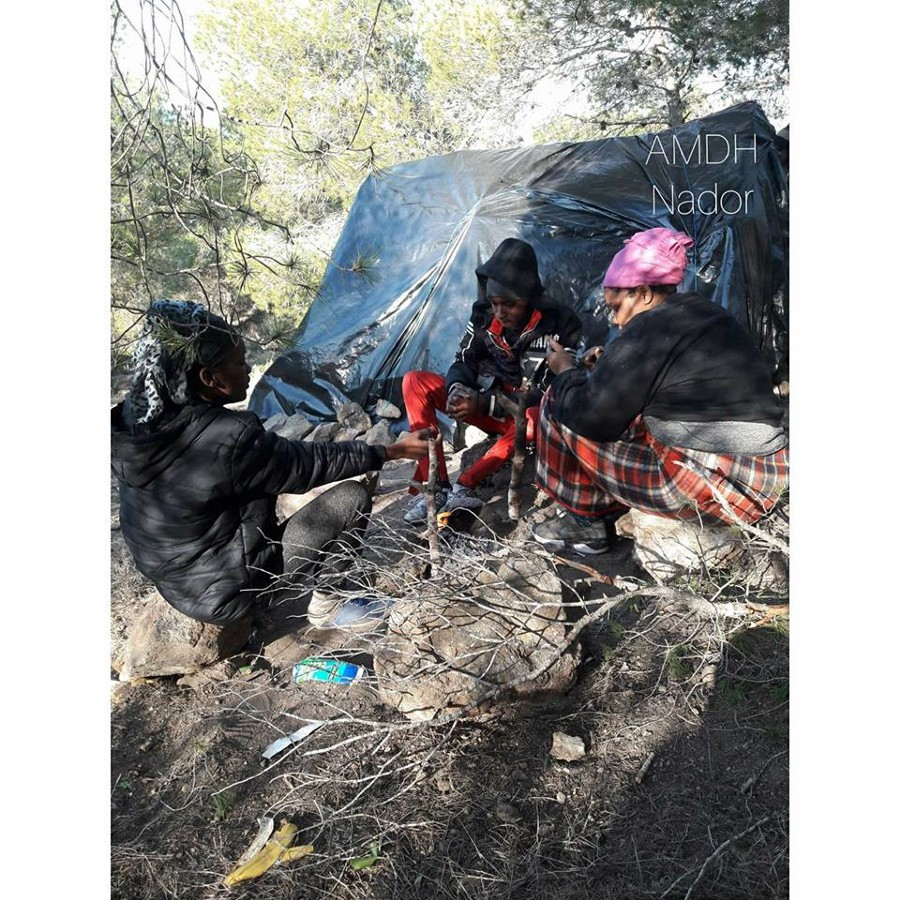

### یونان قصد دارد تا کمک مالی نقدی و مسکن برای پناهندگانی که شناسایی شده‌اند را به تدریج متوقف کند
#### AYS Weekly News Summary in Persian, February 18–24

### **مراکش**
#### زنان جنوب صحرا توسط مقامات مراکش مورد هدف قرار گرفتند

انجمن مراکشی ها دس هامین در گزارش ناددر گزارش داد که زنان جنوب صحرای آفریقا توسط مقامات مراکش هدف قرار می‌گیرند \. آن‌ها اولین قربانیان حملات اخیر به کمپ‌های موقت در این ناحیه بودند که قادر به فرار کردن نبودند ، آن‌ها توسط نیروهای کمکی دستگیر می‌شوند حتی اگر باردار باشند و یا کودکانی را همراه خود داشته باشند

### **دریا**
#### دیپورت صد و شانزده نفر به لیبی

وزیر داخلی ایتالیا , سخنگوی وزارت کشور ایتالیا , از گارد ساحلی لیبی برای بازگشت این افراد به بازداشتگاه لیبی قدردانی کرد \. سازمان آی\.ا\.ام — سازمان یو\.ان همیشه آماده حمایت از بازگشت غیر قانونی و بازگشت داوطلبانه است در حالی که آن‌ها به طور مداوم از انجام هرگونه اقدامی جهت بهبود شرایط مردم در حرکت در اروپا و شمال آفریقا خودداری می‌کنند

■■■■■■■■■■■■■■ 
> **[IOM Libya](https://twitter.com/IOM_Libya) @ Twitter Says:** 

> > Happening now: #IOM_Libya teams tonight at Trig Al Sikka detention centre to provide much needed humanitarian items to over 100 migrants disembarked today. https://t.co/ByYW8hqErc 

> **Tweeted at [2019-02-21 19:18:32](https://twitter.com/iom_libya/status/1098663280246222849).** 

■■■■■■■■■■■■■■ 

### **یونان**
#### تظاهرات اعتراضی در لروس

گزارش‌های \. ن\.بردر حاکی از اعتراض پناهندگان فلسطینی دیروز به پاسگاه پلیس لروس بود \. معترضان خواستار آزادی پناهجویان در بازداشت پلیس شدند \. پلیس با خشونت پاسخ داد \. اطلاعات بیشتر در دسترس نیست

#### **آتن**

به روز رسانی ‌هایی مربوط به محل اقامت و تغییر سیاست کارت‌های نقدی

گروه این\.موب این خبر را ترجمه کرده‌اند، که افرادی که پناهندگی یا اقامت دریافت کرده‌اند، به تدریج باید محل اقامت خود را ترک کنند، اگر آن‌ها در اردوگاه یا محل اقامت سازمان یو\.ان زندگی کنند، کمک نقدی خود را از دست خواهند داد

### **صربستان**
#### خشونت پلیس به مردم در مورد حرکت و داوطلبان پس از بیرون راندن در س\.ی\.د

گروه ن\.ن\.ک بر روی اخراج شدید یک پناهنده، در مسکنی در س\.ی\.د ، با ۸ ون پلیس و حدود ۳۰ افسر پلیس در صحنه گزارش شده است \. این ساختمان که بسیاری از پناهندگان منطقه را در خود جای داده‌است دیروز صبح مورد حمله قرار گرفت و منجر به کشته شدن حدود ۶۰ پناهنده در منطقه‌ای خارج از پاسگاه پلیس شد که همه آن‌ها به اجبار به اردوگاه‌های رسمی برده شدند و حدود ۲۰ نفر با پنهان کردن خود در حالی که این اخراج در حال رخ دادن بود ، فرار کردند

### **بوسنی**
#### ترسفرالز به عنوان بسته شدن مراکز در اونا سنا تاسیس شد

در یک گزارش خبریه محلی آمده‌است که بسته شدن مراکز مهاجر در منطقه کانتون سنا در بوسنی به دنبال شکست در بهبود شرایط در این مراکز پس از ادامه ی تقاضا برای انجام این کار ، صادر شده‌است نخستین افرادی که از این مراکز به خارج منتقل خواهند شد ، گروهی از ۲۵۰ تن از ساکنان خواهند بود \. آن‌ها به مرکز پذیرش در اوسیواک در شهرداری در روز جمعه ۲۲ فوریه توسط آی\.ا\.ام منتقل خواهند شد

### **اتریش**
#### تظاهرات اعتراضی علیه نجات قایق محاصره شده

فعالان امروز قبل از کنسولگری ایتالیا در وین علیه توقیف کشتی‌های نجات ، جرم‌انگاری عملیات نجات و پیامدهای مهلک مرز اروپا و کنترل مرزی اعتراض کردند \. در حال حاضر، گروه س\.و ۳ در کاتانیا بلوکه شده است و هر دو گروه اپ\.ارم و گروه ماری/میدیترناوو به اجبار در بنادر اسپانیا لنگر انداخته ‌اند
### **مرز فرانسه / ایتالیا : یک مرز که منجر به جراحت و کشته شدن شده است**

آنافه گزارشی را منتشر کرده‌است که جزئیات پیامدهای سیاست‌های مرزی فزاینده و محدود را بر کسانی منتشر کرده‌است که این سفر را طی سال‌های ۲۰۱۷ — ۲۰۱۸ در طول مرز فرانسه / ایتالیا طی کرده اند

از منتون تا ونتیمیگلیا ، در دره والی ، از بریانکن تا مدانه ، از ویا گرفته تا د\.فرجوس ، نتایج مشابه موارد زیر هستند : اعمال تبعیض ؛ موانع ورود به پناه‌گاه ؛ نقض حقوق بشر ؛ مجازات غیرقانونی ؛ بازداشت غیرقانونی ؛ تعقیب پلیس ؛ خشونت ؛ جراحات ؛ و مرگ
### **اسپانیا**
#### توافق‌نامه ی جدید، گارد ساحلی اسپانیا اجازه بازگشت به مراکش را می‌دهد

اسپانیا و مراکش به توافق بی‌سابقه‌ای رسیده‌اند که اجازه ی بازگشت کشتی‌ها توسط ماریتیمو را می‌دهد به گارد ساحلی مراکش، زمانی که به سواحل مراکش نزدیک می‌شود، به بنادر مراکش کمک می‌کنند

_Converted [Medium Post](https://medium.com/are-you-syrious/%DB%8C%D9%88%D9%86%D8%A7%D9%86-%D9%82%D8%B5%D8%AF-%D8%AF%D8%A7%D8%B1%D8%AF-%D8%AA%D8%A7-%DA%A9%D9%85%DA%A9-%D9%85%D8%A7%D9%84%DB%8C-%D9%86%D9%82%D8%AF%DB%8C-%D9%88-%D9%85%D8%B3%DA%A9%D9%86-%D8%A8%D8%B1%D8%A7%DB%8C-%D9%BE%D9%86%D8%A7%D9%87%D9%86%D8%AF%DA%AF%D8%A7%D9%86%DB%8C-%DA%A9%D9%87-%D8%B4%D9%86%D8%A7%D8%B3%D8%A7%DB%8C%DB%8C-%D8%B4%D8%AF%D9%87-%D8%A7%D9%86%D8%AF-%D8%B1%D8%A7-%D8%A8%D9%87-%D8%AA%D8%AF%D8%B1%DB%8C%D8%AC-%D9%85%D8%AA%D9%88%D9%82%D9%81-%DA%A9%D9%86%D8%AF-74a6cc5deb64) by [ZMediumToMarkdown](https://github.com/ZhgChgLi/ZMediumToMarkdown)._
